# KFM Pipelines 🧰🗺️
🏷️ **Status:** Governed · Deterministic · CI-validated  
🏷️ **Role in KFM:** ETL → Catalogs (STAC/DCAT/PROV) → Graph → API → UI → Story Nodes → Focus Mode

This folder contains Kansas Frontier Matrix (KFM) **ETL pipelines, ingestion notebooks, and simulation/analysis batch jobs** that transform **raw sources** into **reviewable processed outputs** *plus* the **governance boundary artifacts** (STAC/DCAT/PROV) required before anything becomes user-facing.

> [!IMPORTANT]
> **Pipelines are part of the “truth chain.”** If a dataset doesn’t pass through the pipeline + metadata + provenance steps, it is **not considered published** in KFM.

---

## What belongs here

### ✅ Good fits
- Dataset ingestion + normalization (tabular, vector, raster)
- Format conversion and standardization
- Creation/update of **catalog artifacts** (STAC items/collections, DCAT entries)
- Creation/update of **lineage artifacts** (PROV bundles)
- Generation of **evidence artifacts** (e.g., derived layers, model outputs, OCR corpora) with full provenance
- Batch refresh jobs (idempotent updates)

### ❌ Not allowed here
- Manual one-off edits to `data/processed/` without a pipeline
- UI-only “hidden datasets” (data must be served through governed APIs)
- Interactive pipelines that require prompts, clicks, or human decision mid-run

---

## Non-negotiable ordering

KFM requires a strict ordering so every user-facing artifact is traceable back to raw inputs.

```mermaid
flowchart LR
  subgraph Data
    A["Raw Sources"] --> B["ETL + Normalization"]
    B --> C["Processed Outputs"]
    C --> S["STAC Items + Collections"]
    S --> D["DCAT Dataset Views"]
    S --> P["PROV Lineage Bundles"]
  end

  S --> G["Neo4j Graph (references back to catalogs)"]
  G --> H["API Layer (contracts + redaction)"]
  H --> I["Map UI — React · MapLibre"]
  I --> J["Story Nodes (governed narratives)"]
  J --> K["Focus Mode (provenance-linked context bundle)"]
```



> [!NOTE]
> If a proposal “shortcuts” this sequence (e.g., pushing data straight to UI, or skipping STAC/DCAT/PROV), it’s considered architecturally invalid unless explicitly approved via governance review.

---

## Directory & data conventions

### Pipeline code location (repo-layout note)
KFM documentation describes **a v13 canonical home** for pipelines (`src/pipelines/`) and also references an older/alternate monorepo layout where pipelines may exist at repo root (`pipelines/`).  
If your repo has both, governance policy is: **one canonical home per subsystem** (avoid duplicates).

### Data lifecycle (required staging)
All pipelines must use the standardized staging layout:

- `data/raw/<domain>/` — **read-only** source snapshots  
- `data/work/<domain>/` — intermediate outputs (optional but recommended for audit/debug)  
- `data/processed/<domain>/` — final, ready-to-use outputs

### Boundary artifacts (required for publication)
At publication time, every dataset must generate:

- `data/stac/collections/` and `data/stac/items/` — STAC metadata
- `data/catalog/dcat/` — DCAT dataset entry (JSON-LD)
- `data/prov/` — PROV lineage bundle (inputs, activities, agents)

> [!IMPORTANT]
> These are *interface artifacts* between pipeline output and downstream stages (graph, API, UI). If they aren’t present (or don’t validate), the dataset is **not** ready.

---

## Pipeline contract

### Determinism & idempotency
A pipeline must be:

- **Deterministic:** same inputs + config ⇒ same outputs  
- **Idempotent:** re-running without changes does not duplicate data or drift outputs  
- **Config-driven:** no hard-coded environment assumptions  
- **Fully logged:** enough structured logging to reconstruct what happened

> [!WARNING]
> No manual steps and no interactive prompts are allowed in official pipelines.

### Provenance is mandatory
Every pipeline run must produce/update provenance records that capture:

- Input sources (raw entities)
- Transform steps (activities)
- Who/what ran it (agents)
- Config/parameters
- Timestamps, versions/checksums

### Evidence artifacts (AI/analysis outputs)
If the pipeline produces derived/AI outputs, treat them like any other dataset:

- Store in `data/processed/...`
- Catalog in STAC/DCAT (clearly marked as derived)
- Trace in PROV (methods, parameters, confidence if applicable)
- Integrate into graph cautiously (explicit provenance pointers)
- Expose only through governed APIs (no UI hard-coding)

---

## How to run pipelines

> [!NOTE]
> Exact commands depend on your repo’s Python packaging + Docker service names. Use the patterns below as **canonical conventions**, and align the final command to your local setup.

### Local (host Python)
```bash
# Example patterns (choose the one your repo standardizes on)
python pipelines/<pipeline_name>.py --config configs/<pipeline>.yaml
python -m pipelines.<pipeline_name> --config configs/<pipeline>.yaml
```

### Docker Compose (recommended for consistency)
```bash
# Some docs reference `api` as the backend service; others reference `backend`.
# Use the service name defined in your docker-compose.yml.

docker-compose exec api python -m pipelines.<pipeline_name> --config /app/configs/<pipeline>.yaml
docker-compose exec backend python -m pipelines.<pipeline_name> --config /app/configs/<pipeline>.yaml
```

### Re-run safety
A pipeline should:
- Detect “no-op” runs (nothing changed)
- Prefer checksum/version comparisons for input files
- Overwrite outputs deterministically (or write versioned outputs with explicit lineage)

---

## Testing & validation gates (CI expectations)

KFM CI treats **code + data + docs compliance** as first-class gates. Pipeline-related changes commonly trigger:

- Unit tests (pipeline helpers, transforms)
- Integration tests (when DB/graph sync is involved)
- **Schema validation** (STAC/DCAT/PROV)
- Markdown/YAML linting (when governed docs or metadata change)
- Policy checks (fail-closed governance rules)

### Local “pre-flight” checklist
- [ ] Run unit tests (e.g., `pytest`)
- [ ] Run linters/formatters (Python + JS if applicable)
- [ ] Validate STAC/DCAT/PROV outputs against schemas
- [ ] Confirm no secrets/credentials were committed
- [ ] Confirm raw inputs were not modified

---

## Adding a new dataset pipeline

### Minimal steps (happy path)
1. **Create domain staging folders**
   - `data/raw/<domain>/`
   - `data/work/<domain>/` *(optional but recommended)*
   - `data/processed/<domain>/`

2. **Implement the pipeline**
   - Name it by dataset/source (stable, descriptive)
   - Keep transforms testable (pure functions where possible)
   - Ensure deterministic output formatting and ordering

3. **Write outputs**
   - Final outputs to `data/processed/<domain>/...`
   - Avoid writing anything user-facing outside the governed chain

4. **Generate boundary artifacts**
   - STAC (collections/items)
   - DCAT (dataset entry)
   - PROV (lineage bundle)

5. **Add/update runbook docs**
   - Create/update `docs/data/<domain>/README.md` with sources, methods, caveats, validation steps

6. **Add tests**
   - Unit tests for transforms
   - Validation tests for generated metadata artifacts

7. **Open PR**
   - CI must be green before merge
   - Expect governance review when sensitivity is involved

---

## Pipeline registry (fill this in as you add pipelines)

| Pipeline | Domain | Inputs (raw) | Outputs (processed) | STAC/DCAT/PROV | Owner | Status |
|---|---|---|---|---|---|---|
| `import_<dataset>.py` | `<domain>` | `data/raw/<domain>/...` | `data/processed/<domain>/...` | ✅ required | `@owner` | draft |

> [!TIP]
> Keep this table current. It functions as a lightweight “operational index” for maintainers and reviewers.

---

## Governance & sensitive data 🛡️

KFM is **fail-closed by default**: when checks fail or sensitivity is unclear, the safe action is to block publication until reviewed.

- Apply **FAIR + CARE** thinking:
  - Findable/Accessible/Interoperable/Reusable through metadata + standard formats
  - Collective Benefit / Authority to Control / Responsibility / Ethics in handling community-linked or sensitive information
- If a dataset includes sensitive locations, culturally restricted knowledge, or privacy risk:
  - Generalize or redact at the **API boundary**
  - Mark it for governance review
  - Document the restriction rationale in the domain runbook

---

## Troubleshooting (common)

<details>
<summary><strong>Docker & environment issues</strong></summary>

- **Port conflicts** (e.g., local Postgres on 5432): stop the local service or remap ports in `docker-compose.yml`.
- **Startup ordering**: if services race, ensure `depends_on` is configured and re-run `docker-compose up`.
- **Permissions**: mounted volumes may be read-only or owned by a different UID; ensure `data/` paths are writable for the container.
- **Memory limits**: large datasets may require increasing Docker memory allocation.

</details>

---

## Maintainer notes

- Keep executable code in the pipeline/code area and governed narrative documentation in `docs/` (do not embed “docs front-matter” inside Python scripts).
- Prefer small, reversible changes:
  - One dataset pipeline change per PR when possible
  - Review diffs in `data/processed/` + metadata artifacts carefully
- When in doubt, document assumptions and add validation steps to the domain runbook.

---

### Footnotes
[^1]: “Boundary artifacts” = STAC/DCAT/PROV files required before data is considered fully published; they are the interface between processing and downstream stages (graph/API/UI).