<div align="center">

<picture>
  <source media="(prefers-reduced-motion: reduce)" srcset="../docs/assets/kfm-seal-320.png">
  
</picture>

# 🚰 KFM Pipelines

**Deterministic ingestion + GIS processing + evidence/AI-derived artifacts — published only when metadata, provenance, and policy gates pass.**  
<sub><em>“ETL → STAC/DCAT/PROV → Graph → API → UI → Story Nodes → Focus Mode” — the canonical ordering is non‑negotiable.</em></sub>

<br/>

<!-- Project posture -->


<br/>


<br/>

<a href="#-purpose">🎯 Purpose</a> •
<a href="#-canonical-truth-path">🧭 Truth Path</a> •
<a href="#-where-pipeline-code-lives-v13">📍 Code Location</a> •
<a href="#-pipeline-types">🛰️ Types</a> •
<a href="#-contracts--required-artifacts">📜 Contracts</a> •
<a href="#-running-pipelines-local-to-ci">🚀 Run</a> •
<a href="#-gates-fail-closed">🛡️ Gates</a> •
<a href="#-auditability--observability">🧾 Audit</a> •
<a href="#-author-a-new-pipeline">🧰 New Pipeline</a>

</div>

---

> [!WARNING]
> 🚧 **Under Construction (Active Development)**  
> This hub captures the **current intent + guardrails** for pipelines in KFM.  
> If this doc conflicts with implementation, **implementation wins** — then update this doc to restore alignment.

---

## 🎯 Purpose

Pipelines are where KFM turns **raw evidence** into **publishable, governed artifacts**.

A KFM-grade pipeline is responsible for:

- 📥 **Ingesting raw snapshots** (immutable evidence)
- 🧪 Producing **work artifacts** (auditables, QA outputs, intermediate transforms)
- ✅ Emitting **processed outputs** (serve-ready, analysis-ready, reproducible)
- 🗂️ Publishing **boundary artifacts** for discovery + reuse:
  - **STAC** (spatiotemporal assets)
  - **DCAT** (dataset discovery + distributions)
  - **PROV** (lineage: inputs → activities → outputs)
- 🗄️ Loading **runtime stores** for performance (PostGIS / Neo4j / search/vector)
- 🔒 Enforcing **fail-closed governance** at publish boundaries (license/attribution/sensitivity required)

> [!IMPORTANT]
> **Databases are performance caches — not truth.**  
> Truth is the versioned artifacts in `data/` + their catalogs/provenance + the pipeline code that can rebuild them.

---

## 🧭 Canonical Truth Path

KFM enforces a strict ordering so every dataset (and every derived layer) is **rebuildable, auditable, and governable**:

```text
ETL → STAC/DCAT/PROV catalogs → Neo4j graph → APIs → React/Map UI → Story Nodes → Focus Mode
```

No stage may leapfrog or bypass prior contracts/outputs. ✅

### Data-lifecycle view (what pipelines actually do)

```mermaid
flowchart LR
  R["🧾 Raw snapshots<br/>data/raw/&lt;domain&gt;/"] --> W["🧪 Work artifacts<br/>data/work/&lt;domain&gt;/"]
  W --> P["✅ Processed outputs<br/>data/processed/&lt;domain&gt;/"]

  P --> STAC["🗂️ STAC<br/>data/stac/collections + items"]
  P --> DCAT["🗃️ DCAT<br/>data/catalog/dcat/"]
  P --> PROV["🔗 PROV<br/>data/prov/"]

  STAC --> PG[(PostGIS)]
  STAC --> OBJ[(Object store/CDN<br/>COGs • PMTiles • 3D Tiles)]
  DCAT --> S[(Search/Vector)]
  PROV --> PG
  PROV --> S
  PG --> API["🧩 API boundary<br/>src/server/ (policy + contracts)"]
  S --> API
  API --> UI["🖥️ UI / Maps"]
  API --> SN["📚 Story Nodes"]
  API --> FM["🎯 Focus Mode"]
```



> [!CAUTION]
> If a “shortcut” bypasses catalogs/provenance/policy, it’s treated as a **defect** — not a feature.

---

## 📍 Where pipeline code lives (v13)

In the v13 layout, pipeline implementation is **canonical** under:

- `src/pipelines/` — ETL jobs and domain pipelines  
- `data/` — raw/work/processed outputs + catalog/prov boundary artifacts  
- `src/server/` — API boundary (serves only governed outputs)  
- `web/` — UI (never direct DB access)

> [!TIP]
> If you create a new pipeline, place it in `src/pipelines/` — don’t scatter data processing code elsewhere.

---

## 🧭 Quick links (repo-local)

- 🏗️ System architecture: `../docs/architecture/system_overview.md`
- 🤖 AI / Focus Mode: `../docs/architecture/AI_SYSTEM_OVERVIEW.md`
- 🧾 Standards & profiles: `../docs/standards/`
- 📦 Data vault rules: `../data/README.md`
  - STAC: `../data/stac/`
  - DCAT: `../data/catalog/dcat/`
  - PROV: `../data/prov/`
- 🌐 API boundary: `../src/server/`
- ✅ Tests: `../tests/`
- 🧰 Tools & validators: `../tools/`

---

## 🛰️ Pipeline types

| Type | Examples | Primary outputs | Boundary artifacts |
|---|---|---|---|
| 🗺️ Vector + tabular ingest | boundaries, railroads, trails, census tables | GeoParquet/Parquet (GeoJSON only when small) | DCAT + PROV always; STAC when assetized/spatiotemporal |
| 🛰️ Raster / remote sensing | Landsat/Sentinel, LiDAR products, NOAA rasters | COGs, PMTiles, thumbnails, derived rasters | STAC item/collection + PROV; DCAT record for dataset discovery |
| 🕸️ Graph enrichment | entity extraction, relationship building, story-to-data linking | Neo4j import CSV + mapping artifacts | DCAT + PROV (graph references catalogs; no bulky duplication) |
| 🤖 Evidence/AI-derived artifacts | OCR corpora, masks, change layers, confidence layers | publishable layers + run documentation | Treated as **first-class datasets**: STAC/DCAT/PROV required + extra governance |
| 🧪 QA / validation | schema checks, geometry QA, profiling | reports, metrics, QA artifacts | Publish only if referenced downstream; otherwise keep as work artifacts |

---

## 📜 Contracts & required artifacts

### ✅ Dataset contract: minimum publishable bundle

A dataset is “servable” in KFM only when these exist and cross-link correctly:

| Artifact | Canonical location |
|---|---|
| Raw snapshot(s) | `data/raw/<domain>/...` |
| Work artifacts (optional but recommended) | `data/work/<domain>/...` |
| Processed output(s) | `data/processed/<domain>/...` |
| STAC Items/Collections (when applicable) | `data/stac/collections/*.json` + `data/stac/items/*.json` |
| DCAT dataset record | `data/catalog/dcat/*.jsonld` |
| PROV lineage bundle | `data/prov/*.(prov.)json` |

> [!IMPORTANT]
> Missing license / attribution / sensitivity metadata is a **publish blocker**.  
> CI and policy should treat incomplete bundles as **fail-closed**.

### 🔗 Cross-link expectations (what “traceable” means)

If something is shown on a map, used in a story, or retrieved for Focus Mode, reviewers must be able to walk:

```text
UI/Story/Focus → DCAT → STAC → PROV → Raw Evidence
```

---

## 🚀 Running pipelines (local to CI)

> [!NOTE]
> Runner commands vary by repo iteration. Prefer calling thin wrappers in `tools/` or `Makefile` targets when available.

### Pattern A — Local dev stack (Docker Compose)
```bash
docker compose up -d
```

### Pattern B — Run a pipeline via a CLI runner (examples)
```bash
# Example patterns (adjust to match the repo’s actual runner)
python -m kfm.pipelines run <dataset_id>
python -m src.pipelines.<domain>.<pipeline_module> --help
make pipeline PIPELINE=<dataset_id>
```

### Pattern C — Validate outputs “like CI”
```bash
# Examples (adjust to match repo tooling)
conftest test .            # policy gates (OPA/Conftest)
python -m tools.validate   # schema/catalog/prov validators
pytest                     # pipeline/unit tests
```

---

## 🛡️ Gates (fail-closed)

> [!IMPORTANT]
> **Default deny.** If policy can’t decide: deny.  
> If required metadata/provenance/license is missing: deny.

### Gate 0 — Source & rights (before processing)
A pipeline should not begin unless the source can be described in a reviewable way:
- publisher/origin and acquisition method
- license/rights statement
- sensitivity classification/tagging (and any handling constraints)

### Gate 1 — Output validity (before “processed” is accepted)
Before considering outputs publishable:
- schema validity (domain-specific + common invariants)
- geometry validity + bbox sanity (if spatial)
- CRS explicitly declared (don’t guess)
- null conventions documented
- deterministic behavior (same inputs/config → same outputs, or differences explainable)

### Gate 2 — Boundary artifacts (before discovery/search/UI)
A dataset cannot appear in search/UI unless:
- DCAT record exists and validates
- STAC exists when required (imagery/tiled/spatiotemporal assets)
- PROV exists and links inputs → steps → outputs
- external assets include checksums + retrieval method (if not committed)

### Gate 3 — Evidence/AI-derived outputs (extra governance)
If a pipeline emits AI/analysis outputs:
- record model/tool version + parameters in PROV (and/or a run card)
- enforce sensitivity propagation (outputs cannot be less restricted than inputs)
- ensure downstream retrieval/citation behavior can point back to the bundle

---

## 🧾 Auditability & observability

Pipelines should produce artifacts humans can review **and** machines can validate.

### Minimum per run
- `run_id` (timestamp + dataset id + git sha or build id)
- structured logs (JSON preferred)
- checksums for publishable outputs
- PROV bundle describing:
  - inputs (raw snapshots)
  - activities (transforms)
  - agents (pipeline/tooling)
  - outputs (processed assets + boundary artifacts)

### Strongly recommended
- a short “Run Card” markdown summarizing:
  - what changed
  - counts/bbox/time coverage deltas
  - QA warnings
  - policy outcomes / obligations

---

## 🔒 Security & sensitivity

Pipelines must:
- propagate classification from inputs → outputs (no “less restricted” outputs)
- redact/sanitize outputs when required (attributes, geometry precision, derived aggregates)
- never embed secrets in configs/manifests
- log sensitive runs appropriately (audit posture depends on policy tier)

---

## 🧰 Author a new pipeline

This sequence aligns with the project’s “add a dataset” flow.

1) **Add raw snapshot**  
   Place source snapshots under: `data/raw/<domain>/...`  
   (If assets are too large, commit a pointer strategy + checksums rather than silently omitting identity.)

2) **Write pipeline code (rebuildable from scratch)**  
   Create a script/module under: `src/pipelines/<domain>/...`  
   It should read raw inputs, write intermediates to `data/work/<domain>/...`, and publish outputs to `data/processed/<domain>/...`.

3) **Generate boundary artifacts**  
   For processed outputs, create:
   - STAC (item/collection) under `data/stac/`
   - DCAT under `data/catalog/dcat/`
   - PROV under `data/prov/`

4) **Update indexes/caches (only if needed for runtime)**  
   Load into PostGIS/Neo4j, and/or update search/vector indexes where appropriate.

5) **Expose via the API boundary (if new surface needed)**  
   If existing dataset endpoints suffice, prefer reuse.  
   If new behavior is needed, extend FastAPI routes under `src/server/` and keep UI/API separation strict.

6) **Confirm governance completeness**  
   Ensure license, attribution, and sensitivity tagging are present — CI should flag missing requirements.

### ✅ Definition of Done (pipeline PR)
- [ ] Raw snapshot (or pointer + checksum strategy) is present and documented
- [ ] Pipeline is deterministic and rerunnable
- [ ] Outputs land in `data/work/<domain>/` and `data/processed/<domain>/`
- [ ] STAC/DCAT/PROV exist, validate, and cross-link correctly
- [ ] Any required cache loads (PostGIS/Neo4j/indexes) are reproducible
- [ ] Tests + validators pass locally and in CI
- [ ] Docs/runbook updated (domain notes, known caveats)

---

## 🧯 Troubleshooting

<details>
<summary><b>Pipeline won’t start</b> 🚫</summary>

Common causes:
- missing or ambiguous rights/license info
- sensitivity not declared
- runner can’t locate the pipeline module/config

</details>

<details>
<summary><b>Dataset doesn’t show up in search/UI</b> 🔎</summary>

Common causes:
- DCAT record missing/invalid
- STAC missing (for assets that require it)
- PROV missing or not linked
- policy denies due to missing metadata or sensitivity tags

</details>

<details>
<summary><b>Tiles 404</b> 🧱</summary>

Common causes:
- layer not registered in API
- tiles not built or built to non-canonical paths
- policy denies tile access/caching due to classification

</details>

---

## 🧠 Glossary

- **STAC** 🏷️: SpatioTemporal Asset Catalog (asset metadata: where/when/what)
- **DCAT** 🗂️: Data Catalog Vocabulary (dataset discovery + distributions)
- **W3C PROV** 🔗: provenance model (inputs → process → outputs)
- **COG** 🛰️: Cloud‑Optimized GeoTIFF (partial reads, web-friendly)
- **PMTiles / MVT** 🧩: tile packaging and vector tile formats for web maps
- **OPA** 🧾: Open Policy Agent (policy-as-code enforcement)
- **Fail‑Closed** 🔒: default deny; publish only on complete compliance

---

<div align="center">

### 🌾 Build responsibly. Publish confidently. Keep provenance forever. 🧾✨
<sub>When in doubt: make it reproducible, traceable, and policy-compliant.</sub>

</div>

<details>
<summary><b>📎 Source material used to shape this Pipelines hub</b> (audit trail)</summary>

- **KFM v13 canonical ordering + directory layout:** `docs/MASTER_GUIDE_v13.md` (see project master guide)
- **Dataset addition workflow (pipeline → STAC/DCAT/PROV → stores → API):** KFM System Documentation
- **API boundary (“trust membrane”) posture and “DB as cache” framing:** KFM Developer Guide
- **FAIR/CARE and sovereignty posture:** Indigenous Statistics / KFM blueprint governance sections

</details>