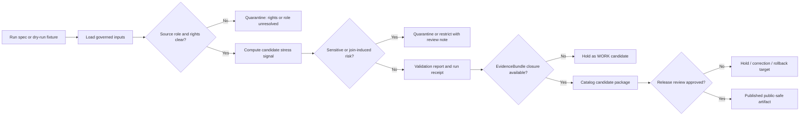

<!-- [KFM_META_BLOCK_V2]
doc_id: kfm://doc/pipelines-biodiversity-vegetation-stress-readme
title: Biodiversity Vegetation Stress Pipeline README
type: readme
version: v0.1
status: draft
owners:
  - <biodiversity-pipeline-owner>
  - <flora-domain-steward>
  - <habitat-domain-steward>
  - <hazards-domain-steward>
  - <agriculture-domain-steward>
  - <docs-steward>
created: 2026-06-13
updated: 2026-06-13
policy_label: public
path: pipelines/biodiversity/vegetation_stress/README.md
related:
  - docs/doctrine/directory-rules.md
  - docs/domains/flora/ARCHITECTURE.md
  - docs/domains/flora/FILE_SYSTEM_PLAN.md
  - docs/domains/flora/DATA_LIFECYCLE.md
  - docs/domains/habitat/SOURCE_REGISTRY.md
  - pipelines/domains/flora/
  - pipelines/domains/habitat/
  - pipeline_specs/flora/
  - pipeline_specs/habitat/
  - data/work/flora/
  - data/work/habitat/
  - data/quarantine/flora/
  - data/quarantine/habitat/
  - data/receipts/pipeline/
  - data/proofs/evidence_bundle/
  - release/candidates/
tags:
  - kfm
  - pipelines
  - biodiversity
  - vegetation-stress
  - flora
  - habitat
  - hazards
  - agriculture
  - remote-sensing
  - derived-surface
  - governance
notes:
  - "Requested path is treated as a pipeline execution lane, not a new canonical domain root."
  - "Vegetation-stress outputs are derived analytical products; they are not sovereign truth, emergency alerts, drought declarations, crop-loss determinations, or publication decisions."
  - "All concrete runtime, source, schema, policy, schedule, CI, and release behavior remains NEEDS VERIFICATION until implemented and tested."
[/KFM_META_BLOCK_V2] -->

<a id="top"></a>

# 🌿 Biodiversity — Vegetation Stress Pipeline

> Detect, normalize, validate, and prepare **candidate vegetation-stress signals** for KFM review without bypassing source-role, sensitivity, evidence, catalog, publication, or rollback gates.


**Status:** Draft  
**Path:** `pipelines/biodiversity/vegetation_stress/README.md`  
**Responsibility root:** `pipelines/` — executable pipeline logic  
**Placement posture:** `PROPOSED / NEEDS VERIFICATION` because `biodiversity/` may be a cross-lane convenience segment rather than a canonical domain segment  
**Public posture:** no direct publication; all outputs remain candidate, quarantined, catalog-pending, or release-gated until promoted through KFM review

---

## Quick jump

- [1. Purpose](#1-purpose)
- [2. Placement and authority](#2-placement-and-authority)
- [3. What this pipeline is](#3-what-this-pipeline-is)
- [4. What this pipeline is not](#4-what-this-pipeline-is-not)
- [5. Accepted inputs](#5-accepted-inputs)
- [6. Explicit exclusions](#6-explicit-exclusions)
- [7. Operating flow](#7-operating-flow)
- [8. Allowed outputs](#8-allowed-outputs)
- [9. Required gates](#9-required-gates)
- [10. Sensitivity and derived-risk posture](#10-sensitivity-and-derived-risk-posture)
- [11. Directory contract](#11-directory-contract)
- [12. Minimal stress-candidate record](#12-minimal-stress-candidate-record)
- [13. Dry-run and test posture](#13-dry-run-and-test-posture)
- [14. Review, promotion, and rollback](#14-review-promotion-and-rollback)
- [15. Definition of done](#15-definition-of-done)
- [16. Open questions](#16-open-questions)

---

## 1. Purpose

This README governs the requested `vegetation_stress` pipeline lane under `pipelines/biodiversity/`.

The lane exists to produce **reviewable candidate vegetation-stress signals** from approved source material and derived indicators. It supports KFM biodiversity interpretation by helping maintainers notice possible vegetation stress, disturbance, drought response, phenology anomaly, burn recovery, habitat degradation, invasive pressure, restoration stress, or other plant-community change signals.

The pipeline must preserve the KFM trust path:

```text
RAW -> WORK / QUARANTINE -> PROCESSED -> CATALOG / TRIPLET -> PUBLISHED
```

Promotion is a governed state transition, not a file move. A vegetation-stress candidate is not public truth until evidence, source roles, rights, sensitivity, validation, catalog closure, release decision, and rollback path exist.

[⬆ Back to top](#top)

---

## 2. Placement and authority

`pipelines/` owns executable pipeline logic. `pipeline_specs/` owns declarative run configuration. `data/` owns lifecycle artifacts. `release/` owns release decisions. `contracts/`, `schemas/`, `policy/`, `tests/`, and `fixtures/` remain separate authority roots.

| Placement question | Determination | Status |
|---|---|---|
| Is this a canonical root? | No. It is a child lane under `pipelines/`. | CONFIRMED by path form |
| Is `biodiversity/` a canonical domain segment? | Not proven here. Treat it as a cross-lane convenience segment until ADR or domain-lane registry confirms it. | NEEDS VERIFICATION |
| Could this later migrate? | Yes. Likely homes to evaluate include `pipelines/domains/flora/vegetation_stress/`, `pipelines/domains/habitat/vegetation_stress/`, or a documented cross-domain pipeline lane. | PROPOSED |
| Does this README define schemas or policies? | No. It points to the proper homes. | CONFIRMED by this file |
| Can this lane publish? | No. It may prepare candidates; release happens through governed release gates. | CONFIRMED doctrine posture |

> [!IMPORTANT]
> Do not use this requested path to create a parallel biodiversity authority root. Biodiversity meaning is distributed across Flora, Habitat, Fauna, Hazards, Agriculture, Soil, Hydrology, and release policy. This pipeline may compose evidence from those lanes; it does not own their truth.

[⬆ Back to top](#top)

---

## 3. What this pipeline is

This pipeline is a bounded execution lane for **derived vegetation-stress candidate production**.

It may:

- ingest or read approved lifecycle inputs from governed upstream stages;
- compute or compare vegetation-stress indicators in a fixture-first manner;
- create candidate anomaly records for steward review;
- emit run receipts, validation reports, and policy decisions;
- route uncertain, sensitive, stale, or rights-unclear material to quarantine;
- prepare catalog-ready artifacts only after validation and evidence closure;
- support future public-safe map products after release review.

The lane is especially cross-cutting because vegetation stress may draw from or affect:

| Lane | Relationship to vegetation stress |
|---|---|
| Flora | Plant taxa, plant communities, phenology, rare/culturally sensitive plants, invasive plants. |
| Habitat | Habitat condition, land cover, vegetation communities, suitability context. |
| Hazards | Drought, fire, flood, smoke, storm, heat, and disturbance context. |
| Agriculture | Cropland stress context; must not become a crop-loss or yield truth source. |
| Hydrology | Wetland, riparian, soil-moisture, flood, and water-stress context. |
| Soil | Substrate, erosion, salinity, and soil-water context. |
| Fauna | Habitat stress that may affect species context, without owning fauna claims. |

[⬆ Back to top](#top)

---

## 4. What this pipeline is not

This pipeline is **not**:

- a drought declaration system;
- an emergency alert system;
- a crop insurance or crop-loss determination system;
- a plant mortality authority;
- a rare-plant exposure surface;
- a public publication path;
- a direct MapLibre layer source;
- a substitute for EvidenceBundle resolution;
- a replacement for Flora, Habitat, Hazards, Agriculture, Soil, Hydrology, or Fauna truth;
- a place to store schemas, policy, fixtures, source descriptors, or release decisions.

> [!CAUTION]
> Vegetation stress is an interpretive derived signal. It can guide review, but it cannot be promoted as authoritative public knowledge without evidence closure and release controls.

[⬆ Back to top](#top)

---

## 5. Accepted inputs

Accepted inputs must come from approved KFM lifecycle or fixture locations, not arbitrary local files.

| Input class | Allowed source | Required condition |
|---|---|---|
| No-network fixture | `fixtures/...` | Safe default for tests and dry runs. |
| Source descriptor / registry pointer | `docs/sources/...` or `data/registry/sources/...` | Source role, rights, cadence, and sensitivity declared. |
| Raw source capture | `data/raw/<domain>/<source_id>/<run_id>/` | Immutable source-edge capture with checksums and ingest receipt. |
| Working normalized input | `data/work/<domain>/<run_id>/` | Candidate only; not public. |
| Processed input | `data/processed/<domain>/<dataset_id>/<version>/` | Validated, but still not automatically public. |
| Catalog/proof input | `data/catalog/...`, `data/proofs/evidence_bundle/...` | Required before claim-like outputs. |
| Prior released baseline | `data/published/...` + `release/manifests/...` | Used only with release manifest and rollback context. |

[⬆ Back to top](#top)

---

## 6. Explicit exclusions

| Do not place here | Proper home |
|---|---|
| Source catalog profiles | `docs/sources/catalog/...` |
| Machine-readable source registry entries | `data/registry/sources/...` |
| Object meaning contracts | `contracts/domains/<domain>/...` or approved cross-domain contract family |
| JSON Schemas | `schemas/contracts/v1/...` |
| Admissibility or sensitivity policy | `policy/domains/<domain>/`, `policy/sensitivity/`, `policy/rights/`, `policy/release/` |
| Golden / valid / invalid fixtures | `fixtures/...` or `tests/fixtures/...` per repo convention |
| Tests | `tests/pipelines/biodiversity/vegetation_stress/` or approved test home |
| Connectors and source fetchers | `connectors/<source_id>/` |
| Lifecycle data outputs | `data/raw/`, `data/work/`, `data/quarantine/`, `data/processed/`, `data/catalog/`, `data/published/` |
| Release decisions | `release/candidates/`, `release/manifests/`, `release/rollback_cards/`, `release/correction_notices/` |
| Public map styles or layer definitions | released map-artifact homes after governance review |

[⬆ Back to top](#top)

---

## 7. Operating flow



The diagram is a target contract for this lane. It does not claim executable code, schedules, CI jobs, or release automation already exist.

[⬆ Back to top](#top)

---

## 8. Allowed outputs

This pipeline may emit only bounded, reviewable outputs.

| Output | Purpose | Typical lifecycle state |
|---|---|---|
| `VegetationStressCandidate` | Candidate stress observation or surface summary for review. | `WORK_CANDIDATE` |
| `VegetationStressRunReceipt` | Records run identity, inputs, versions, hashes, parameters, and outputs. | `data/receipts/pipeline/...` |
| `ValidationReport` | Records schema, policy, evidence, range, temporal, and geometry checks. | `data/proofs/validation_report/...` or approved proof home |
| `PolicyDecision` | Records `ALLOW_AT_STAGE`, `RESTRICT`, `ABSTAIN`, `DENY`, or `ERROR`. | stage-bound decision |
| `QuarantineReceipt` | Records why the candidate cannot proceed. | `data/quarantine/...` |
| `CatalogCandidate` | Catalog-ready package after evidence closure. | `CATALOG_CANDIDATE` |
| `ReleaseCandidateNote` | Human-review handoff for later release. | `release/candidates/...` only by release process, not direct pipeline write unless approved |

[⬆ Back to top](#top)

---

## 9. Required gates

Before downstream use, every vegetation-stress candidate must pass or explicitly fail closed on these gates:

1. **Source descriptor gate** — every input has source identity and role.
2. **Rights gate** — unknown or restrictive terms block public release.
3. **Sensitivity gate** — rare plants, culturally sensitive plants, precise habitat, infrastructure-adjacent, private-land, or join-induced exposure risks fail closed.
4. **Temporal gate** — observation time, retrieval time, processing time, and release time remain distinct.
5. **Spatial gate** — geometry precision, pixel/grid resolution, aggregation, and public-safe generalization are recorded.
6. **Baseline gate** — stress is measured against an explicit baseline or reference period, not an implicit visual impression.
7. **Evidence gate** — claim-like outputs require EvidenceBundle closure or abstain.
8. **Model/algorithm gate** — derived scores record method, parameters, version, and limitations.
9. **Validation gate** — no silent success; validation emits finite outcomes.
10. **Catalog gate** — public or semi-public discovery requires STAC/DCAT/PROV or KFM-equivalent catalog closure.
11. **Release gate** — public artifacts require `ReleaseManifest`, `RollbackCard`, correction path, and review state.
12. **No-direct-UI gate** — public UI must consume governed APIs or released artifacts, not WORK or QUARANTINE outputs.

[⬆ Back to top](#top)

---

## 10. Sensitivity and derived-risk posture

Vegetation-stress outputs can reveal sensitive derived information even when each source input appears public-safe.

Examples of sensitivity risk:

- stress near rare-plant occurrences;
- stress in culturally sensitive plant-use areas;
- stress surfaces that expose exact habitat for vulnerable species;
- crop stress interpreted as private operational or economic information;
- drought/fire/flood stress mistaken for official emergency or regulatory status;
- cross-source joins that infer restricted ecological locations;
- overly precise public raster/vector tiles that reveal sensitive spatial patterns.

> [!IMPORTANT]
> Sensitivity is evaluated at the derived-product level, not only at input admission. A vegetation-stress surface can require redaction, aggregation, delay, restriction, or denial even when the input source files are public.

[⬆ Back to top](#top)

---

## 11. Directory contract

This directory may contain only documentation and executable orchestration files whose primary responsibility is the vegetation-stress pipeline lane.

Recommended future shape:

```text
pipelines/biodiversity/vegetation_stress/
├── README.md                         # this file
├── PIPELINE_CONTRACT.md              # PROPOSED: local execution contract
├── run_dry_fixture.py                # PROPOSED if Python pipeline convention is accepted
├── classify_candidate.py             # PROPOSED if local helper is lane-specific
├── emit_receipt.py                   # PROPOSED only if not shared in tools/
└── adapters/                         # PROPOSED: thin local adapters, no source fetching
```

Declarative run specs should live outside this directory:

```text
pipeline_specs/biodiversity/vegetation_stress/
└── dry_run.yaml                      # PROPOSED / NEEDS VERIFICATION
```

If a mounted-repo inspection proves that `biodiversity/` should not be a child of `pipelines/`, migrate this README and any executable files with:

- drift-register entry;
- old-to-new path map;
- compatibility stub or deprecation note;
- rollback note;
- tests updated in the same PR.

[⬆ Back to top](#top)

---

## 12. Minimal stress-candidate record

The final schema is not defined here. This example shows the minimum information this lane should preserve.

```yaml
schema_version: kfm.vegetation_stress_candidate.v1
candidate_id: vegstress_YYYYMMDD_source_area_hash
pipeline_id: biodiversity.vegetation_stress
run_id: run_YYYYMMDDThhmmssZ
status: WORK_CANDIDATE
source_inputs:
  - source_id: src_example
    source_role: observation
    lifecycle_ref: data/work/flora/example/run_id/
    input_hash: sha256:<hash>
spatial_scope:
  geometry_ref: <governed_geometry_or_tile_ref>
  public_precision: withheld_until_review
temporal_scope:
  observed_start: YYYY-MM-DD
  observed_end: YYYY-MM-DD
  retrieved_at: YYYY-MM-DDThh:mm:ssZ
  processed_at: YYYY-MM-DDThh:mm:ssZ
method:
  indicator_family: vegetation_index_or_anomaly
  algorithm_version: <version>
  baseline_ref: <baseline_id_or_ABSTAIN>
  parameter_hash: sha256:<hash>
stress_signal:
  class: unknown
  magnitude: null
  confidence: low
  interpretation_status: candidate_only
evidence:
  evidence_bundle_ref: null
  citation_state: ABSTAIN
policy:
  outcome: ABSTAIN
  reason_code: EVIDENCE_BUNDLE_NOT_RESOLVED
sensitivity:
  rare_plant_risk: needs_review
  cultural_sensitivity: unknown
  join_induced_risk: needs_review
  public_geometry_allowed: false
outputs:
  candidate_record: data/work/biodiversity/vegetation_stress/run_YYYYMMDDThhmmssZ/candidate.yml
  receipt: data/receipts/pipeline/biodiversity_vegetation_stress/run_YYYYMMDDThhmmssZ.yml
review:
  reviewer_required: true
  reviewer_roles:
    - flora-domain-steward
    - habitat-domain-steward
    - policy-steward
rollback:
  required_before_publication: true
```

[⬆ Back to top](#top)

---

## 13. Dry-run and test posture

Default execution is **fixture-only and no-network** until source activation, rights review, sensitivity review, and CI coverage are approved.

A local dry run should prove:

- fixture inputs load without network access;
- candidate outputs are deterministic enough for review;
- missing evidence produces `ABSTAIN`, not a public claim;
- unresolved rights produce `ABSTAIN` or `DENY`;
- sensitive geometry is withheld or generalized;
- join-induced risk is detected at the derived-output stage;
- invalid records fail validation;
- receipts include input hashes, method hashes, and run identifiers;
- no outputs are written to `data/published/` or release manifests by default.

Recommended test coverage:

```text
tests/pipelines/biodiversity/vegetation_stress/
├── test_no_network_dry_run.py         # PROPOSED
├── test_missing_evidence_abstains.py  # PROPOSED
├── test_sensitive_geometry_denied.py  # PROPOSED
├── test_rights_unknown_denied.py      # PROPOSED
├── test_receipt_hashes.py             # PROPOSED
└── test_no_direct_publish.py          # PROPOSED
```

[⬆ Back to top](#top)

---

## 14. Review, promotion, and rollback

A vegetation-stress candidate may become a published product only after review and release controls.

Required chain:

```text
VegetationStressCandidate
  -> ValidationReport
  -> PolicyDecision
  -> EvidenceBundle closure
  -> CatalogCandidate
  -> steward review
  -> release candidate
  -> ReleaseManifest
  -> RollbackCard
  -> public-safe artifact
```

Rollback for local pipeline candidates:

- preserve the run receipt;
- mark the candidate superseded, denied, or quarantined;
- do not delete failed or denied evidence of a run;
- remove any generated WORK candidate from downstream consideration.

Rollback for published artifacts is owned by `release/`, not by this pipeline lane.

[⬆ Back to top](#top)

---

## 15. Definition of done

This README is done when it:

- treats vegetation stress as a derived candidate signal, not sovereign truth;
- preserves KFM lifecycle and publication boundaries;
- keeps schemas, contracts, policies, fixtures, tests, data, and release decisions in their proper homes;
- marks the `biodiversity/` path segment as needing verification;
- denies direct publication from this lane;
- names sensitivity and join-induced risk explicitly;
- provides a no-network dry-run posture;
- gives maintainers a reviewable candidate-record shape.

Future executable implementation is done only when it has:

- source-descriptor coverage;
- approved fixture inputs;
- schema-backed candidate records;
- policy tests;
- evidence-closure tests;
- sensitivity and rights tests;
- deterministic run receipts;
- no-direct-publish tests;
- CI coverage;
- review handoff;
- release and rollback documentation.

[⬆ Back to top](#top)

---

## 16. Open questions

| ID | Question | Status |
|---|---|---|
| `VEG-STRESS-001` | Is `pipelines/biodiversity/vegetation_stress/` accepted as a stable cross-lane pipeline home, or should it migrate under `pipelines/domains/flora/` or `pipelines/domains/habitat/`? | NEEDS VERIFICATION |
| `VEG-STRESS-002` | Which source descriptors are first-wave approved for vegetation-stress dry runs? | NEEDS VERIFICATION |
| `VEG-STRESS-003` | What canonical object family owns `VegetationStressCandidate`? | PROPOSED / NEEDS ADR if new object family |
| `VEG-STRESS-004` | Which baseline or reference-period rules are acceptable for stress classification? | NEEDS VERIFICATION |
| `VEG-STRESS-005` | Which steward roles approve rare-plant, habitat, cultural, and crop-adjacent derived risk decisions? | NEEDS VERIFICATION |
| `VEG-STRESS-006` | Where should declarative specs live if `pipeline_specs/biodiversity/vegetation_stress/` is not accepted? | NEEDS VERIFICATION |
| `VEG-STRESS-007` | Which public-safe aggregation or redaction policy applies to raster/vector stress outputs? | NEEDS VERIFICATION |
| `VEG-STRESS-008` | Which CI job owns no-network vegetation-stress fixtures? | UNKNOWN |
| `VEG-STRESS-009` | What release class applies to public vegetation-stress tiles, reports, or API payloads? | NEEDS VERIFICATION |

---

## Maintainer note

Start with a fixture-only dry-run and negative tests. Add live source watching, remote sensing inputs, derived rasters, tiles, map layers, or public API payloads only after source descriptors, rights review, sensitivity policy, evidence closure, release review, and rollback paths are in place.
