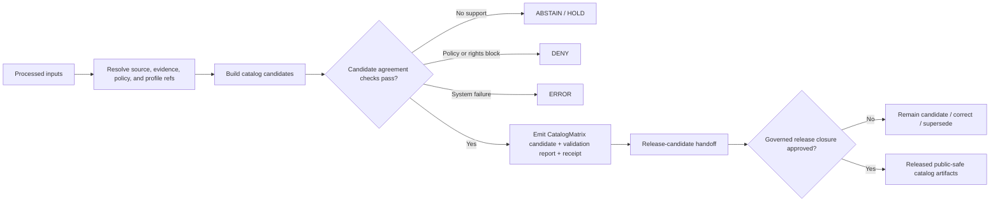

<!-- [KFM_META_BLOCK_V2]
doc_id: kfm://doc/pipelines-catalog-readme
title: pipelines/catalog/ — Shared Catalog-Closure Execution Boundary
type: directory-readme; pipeline-lane-readme; catalog-closure-execution-boundary
version: v0.2
status: draft; repository-grounded; documentation-only; implementation-not-established
owners:
  - OWNER_TBD — Pipeline steward
  - OWNER_TBD — Catalog steward
  - OWNER_TBD — Evidence steward
  - OWNER_TBD — Policy steward
  - OWNER_TBD — Release steward
  - OWNER_TBD — Docs steward
created: 2026-06-13
updated: 2026-07-19
policy_label: public-governance; catalog; evidence-aware; release-gated; no-direct-publish
path: pipelines/catalog/README.md
truth_posture: cite-or-abstain; current-state claims are bounded to the pinned repository evidence snapshot
responsibility_root: pipelines/
responsibility: shared executable catalog-closure logic — the HOW; never catalog data, semantic authority, schema authority, policy authority, proof authority, release authority, or publication authority
evidence_snapshot:
  repository: bartytime4life/Kansas-Frontier-Matrix
  base_ref: main
  base_commit: 144d10ff4ac87dc37566ad608fe6b002f9250d1a
  inspection_mode: GitHub connector file reads, exact-path probes, code-index searches, workflow inspection, and open-PR/branch overlap checks
related:
  - ../../docs/architecture/directory-rules.md
  - ../README.md
  - ../../CONTRIBUTING.md
  - ../../data/catalog/README.md
  - ../../contracts/data/catalog_matrix.md
  - ../../schemas/contracts/v1/data/catalog_matrix.schema.json
  - ../../docs/adr/ADR-0022-catalog-matrix--stac-+-dcat-+-prov-must-agree.md
  - ../domains/hydrology/catalog/README.md
  - ../../docs/registers/DRIFT_REGISTER.md
  - ../../data/receipts/generated/README.md
  - ../../.github/workflows/README.md
  - ../../.github/CODEOWNERS
 tags:
  - kfm
  - pipelines
  - catalog
  - catalog-closure
  - catalog-matrix
  - stac
  - dcat
  - prov
  - evidence
  - receipts
  - fail-closed
  - release-gated
notes:
  - "v0.2 replaces proposal-heavy directory-tree claims with a repository-grounded maturity inventory."
  - "No shared catalog executable, declarative catalog spec lane, dedicated catalog-pipeline test lane, or CatalogMatrix validator was verified at the pinned base."
  - "The current CatalogMatrix schema is a permissive greenfield placeholder; schema presence is not catalog-closure enforcement."
  - "ADR-0022 remains proposed. Its STAC/DCAT/PROV agreement rule is design authority under review, not verified runtime behavior."
  - "This README changes documentation only. It does not create catalog records, run pipelines, alter policy, approve release, or publish artifacts."
[/KFM_META_BLOCK_V2] -->

<a id="top"></a>

# Catalog pipeline

> **One-line purpose.** `pipelines/catalog/` is the shared executable boundary for building and checking catalog-stage candidates from governed processed inputs while preserving evidence, source role, rights, sensitivity, time, provenance, review, release, correction, and rollback boundaries.


> [!IMPORTANT]
> A catalog pipeline may prepare, validate, compare, and hand off catalog candidates. It does **not** make source material true, replace an `EvidenceBundle`, decide policy, approve a release, move an artifact into `PUBLISHED`, or authorize a public client to read internal lifecycle stores.

## Quick navigation

- [Purpose](#purpose)
- [Authority and placement](#authority-and-placement)
- [Repository-grounded status](#repository-grounded-status)
- [Catalog concepts and anti-collapse rules](#catalog-concepts-and-anti-collapse-rules)
- [Shared lane and domain adapters](#shared-lane-and-domain-adapters)
- [Inputs](#inputs)
- [Outputs](#outputs)
- [Candidate closure and release closure](#candidate-closure-and-release-closure)
- [CatalogMatrix boundary](#catalogmatrix-boundary)
- [Required gates](#required-gates)
- [Execution contract](#execution-contract)
- [Responsibility map](#responsibility-map)
- [Tests, fixtures, receipts, and CI](#tests-fixtures-receipts-and-ci)
- [Security, rights, and sensitivity](#security-rights-and-sensitivity)
- [Review, release, correction, and rollback](#review-release-correction-and-rollback)
- [No-loss preservation](#no-loss-preservation)
- [Definition of done](#definition-of-done)
- [Open verification backlog](#open-verification-backlog)
- [Last reviewed](#last-reviewed)

---

## Purpose

`pipelines/catalog/` belongs under the [`pipelines/`](../README.md) responsibility root because its primary responsibility is executable pipeline behavior: **how** catalog-stage candidates are assembled and checked.

The lane is intended to support the governed transition:

```text
RAW -> WORK / QUARANTINE -> PROCESSED -> CATALOG / TRIPLET -> PUBLISHED
                                    ^
                                    |
                         shared catalog execution
```

Its bounded responsibilities are:

- read governed processed inputs and pinned supporting references;
- construct STAC, DCAT, PROV, domain-catalog, and graph/triplet candidates where approved;
- preserve stable identity, digest, source-role, evidence, policy, temporal, and release references;
- compare candidate projections for internal agreement;
- emit deterministic run memory and validation outcomes;
- hand reviewable candidates to catalog-stage data and release-review surfaces;
- fail closed when required support is absent, stale, conflicting, restricted, or unresolved.

This lane is not a source connector, canonical data store, schema registry, policy engine, proof store, release service, public catalog API, or publication path.

[Back to top](#top)

---

## Authority and placement

The current placement follows the live [Directory Rules](../../docs/architecture/directory-rules.md):

| Responsibility | Owning surface | Relationship to this lane |
|---|---|---|
| Executable catalog behavior — the **how** | `pipelines/catalog/` | This lane. |
| Declarative jobs, profiles, schedules, and scope — the **what** | `pipeline_specs/` | Input authority; a catalog-specific lane was not verified. |
| Catalog-stage records and indexes | [`data/catalog/`](../../data/catalog/README.md) | Lifecycle output authority. |
| Graph/triplet projections | `data/triplets/` | Paired `CATALOG / TRIPLET` lifecycle output. |
| Semantic object meaning | [`contracts/data/catalog_matrix.md`](../../contracts/data/catalog_matrix.md) and other contracts | Meaning authority; not executable code. |
| Machine-checkable shape | [`schemas/contracts/v1/data/catalog_matrix.schema.json`](../../schemas/contracts/v1/data/catalog_matrix.schema.json) and approved schemas | Shape authority; not semantic or release authority. |
| Allow, deny, restrict, hold, or abstain decisions | `policy/` | Admissibility authority. |
| Fixtures and behavioral proof | `fixtures/`, `tests/` | Enforceability surfaces. |
| Receipts and proofs | `data/receipts/`, `data/proofs/` | Process memory and evidentiary support remain separate. |
| Release decisions, manifests, corrections, and rollback cards | `release/` | Release authority. |
| Public catalog, API, map, UI, export, or AI behavior | governed application and release surfaces | Downstream consumers of released, policy-safe outputs only. |

> [!NOTE]
> The repository contains an unresolved Directory Rules identity/placement conflict outside this lane. This README links the newer live artifact at `docs/architecture/directory-rules.md` and does not create or endorse a third copy.

### Placement decision

- **CONFIRMED:** `pipelines/catalog/README.md` exists under the executable pipeline responsibility root.
- **CONFIRMED:** Directory Rules list `pipelines/catalog/` as the shared catalog execution lane.
- **CONFIRMED:** `pipelines/` is the **how** and `pipeline_specs/` is the **what**.
- **NEEDS VERIFICATION:** which shared catalog executables should exist here and which reusable logic should instead live in a package or validator tool.
- **No ADR required for this README-only revision:** no root, lifecycle phase, schema authority, policy authority, release authority, or compatibility boundary changes.

[Back to top](#top)

---

## Repository-grounded status

The table below is bounded to `main@144d10ff4ac87dc37566ad608fe6b002f9250d1a`. It distinguishes file presence from implemented behavior.

| Surface | Repository evidence | Status |
|---|---|---|
| This README | Existing file fetched and revised in place. | **CONFIRMED file; draft documentation** |
| Shared catalog executable | No shared executable was verified. An exact probe for `pipelines/catalog/build_stac.py` returned not found, and repository searches did not surface a shared catalog implementation. | **UNKNOWN implementation / NEEDS VERIFICATION** |
| Declarative shared catalog specs | `pipeline_specs/catalog/README.md` was not found. | **NOT VERIFIED / proposed future lane** |
| Dedicated shared catalog tests | `tests/pipelines/catalog/README.md` was not found. | **NOT VERIFIED / proposed future lane** |
| Domain adapter precedent | [`pipelines/domains/hydrology/catalog/README.md`](../domains/hydrology/catalog/README.md) exists and assigns shared framework behavior back to this lane. | **CONFIRMED documentation precedent; executable behavior unverified** |
| Catalog-stage data boundary | [`data/catalog/README.md`](../../data/catalog/README.md) exists and separates catalog records from publication authority. | **CONFIRMED documentation boundary** |
| `CatalogMatrix` semantic contract | [`contracts/data/catalog_matrix.md`](../../contracts/data/catalog_matrix.md) exists. | **CONFIRMED draft semantic contract** |
| `CatalogMatrix` schema | [`schemas/contracts/v1/data/catalog_matrix.schema.json`](../../schemas/contracts/v1/data/catalog_matrix.schema.json) exists but requires only `id`, permits additional properties, and identifies itself as a greenfield placeholder. | **CONFIRMED placeholder shape; not closure enforcement** |
| Declared `CatalogMatrix` validator | The schema names `tools/validators/data/validate_catalog_matrix.py`; that implementation was not verified. The semantic contract also records it as missing. | **UNKNOWN / NEEDS VERIFICATION** |
| Catalog-closure ADR | [ADR-0022](../../docs/adr/ADR-0022-catalog-matrix--stac-+-dcat-+-prov-must-agree.md) is present with status `proposed`. | **CONFIRMED proposed decision; not accepted or implemented proof** |
| Dedicated catalog workflow | No dedicated command-bearing catalog-pipeline workflow was verified. | **UNKNOWN / NEEDS VERIFICATION** |
| General schema/contract CI | Broad pull-request workflows invoke schema and contract checks, but their inspected scope does not establish shared catalog execution or STAC/DCAT/PROV agreement. | **CONFIRMED general checks; catalog closure not established** |

### Current maturity statement

> **CONFIRMED:** the repository contains the responsibility boundary, catalog-stage documentation, a Hydrology adapter contract, a draft `CatalogMatrix` semantic contract, a placeholder machine schema, and a proposed cross-vocabulary ADR.
>
> **UNKNOWN:** shared catalog executable behavior, stable command surface, catalog-specific specs, dedicated fixtures/tests, emitted catalog receipts, cross-vocabulary resolver behavior, promotion integration, runtime observability, and recent CI success.
>
> **Therefore:** this README is an implementation boundary and graduation contract, not evidence that catalog closure currently runs.

[Back to top](#top)

---

## Catalog concepts and anti-collapse rules

Catalog records are inspectability and discovery projections. They are not sovereign truth.

### Required distinctions

| Concept | Meaning in this lane | Must not collapse into |
|---|---|---|
| Processed record | Validated normalized lifecycle input. | Public or released artifact. |
| Catalog candidate | Proposed STAC/DCAT/PROV/domain-catalog representation under review. | Published catalog record or release decision. |
| Triplet/graph delta | Relationship projection with provenance references. | Canonical domain truth or review state. |
| `CatalogMatrix` candidate | Reviewable crosswalk of catalog relationships and agreement claims. | Evidence proof, policy decision, or release manifest. |
| Validation result | Machine or semantic check outcome for declared scope. | Evidence support, rights clearance, or publication approval. |
| Catalog receipt | Process memory for inputs, transforms, checks, and outputs. | Proof that claims are true or released. |
| Release-level closure | Verified agreement and resolvable release references under an approved release process. | A successful pipeline run alone. |
| Public catalog view | Released, policy-safe discovery surface. | Direct access to candidate, internal, RAW, WORK, or QUARANTINE stores. |

### Disallowed collapses

```text
processed -> public
catalog candidate -> EvidenceBundle
CatalogMatrix -> proof closure
schema valid -> semantically correct
schema valid -> policy allowed
schema valid -> released
STAC present -> DCAT/PROV agreement
triplet projection -> canonical truth
pipeline success -> promotion approval
pull request merge -> KFM publication
generated summary -> evidence
```

### Source-role and knowledge-character rule

A catalog projection must preserve the source and knowledge character of the thing it describes. It must not silently upgrade:

- context into authority;
- modeled output into observation;
- forecast-like output into observed history;
- regulatory context into observed event evidence;
- aggregate data into exact place-level fact;
- generated explanation into source evidence;
- public-safe generalized geometry into canonical exact geometry.

Domain adapters may add stricter anti-collapse rules. The existing Hydrology catalog README, for example, explicitly keeps NFHL regulatory context separate from observed flooding.

[Back to top](#top)

---

## Shared lane and domain adapters

The intended division is:

```text
pipelines/catalog/
  shared orchestration, common builders, agreement checks, receipt interfaces
        |
        +-- pipelines/domains/<domain>/catalog/
              domain mapping, domain anti-collapse checks, domain-specific fields
```

### Shared lane responsibilities

Shared implementation may own:

- common catalog-candidate interfaces;
- reusable STAC, DCAT, and PROV mapping helpers;
- canonical identifier and digest comparison helpers;
- release-reference and evidence-reference resolution interfaces;
- cross-vocabulary agreement checking;
- deterministic catalog receipt emission;
- common finite-outcome and blocker reporting;
- common dry-run and no-network harnesses.

### Domain adapter responsibilities

A domain catalog adapter may own:

- mappings from domain objects to approved shared catalog interfaces;
- domain source-role constraints;
- domain knowledge-character distinctions;
- domain-specific rights and sensitivity preflight;
- domain time/freshness caveats;
- public-safe transform references;
- domain-specific negative fixtures and tests.

### Domain adapter restrictions

A domain adapter must not:

- fork a second shared catalog framework;
- redefine `CatalogMatrix` meaning or machine shape locally;
- create its own release authority;
- bypass shared evidence, policy, integrity, or agreement checks;
- expose raw or exact sensitive material through a catalog projection;
- treat domain documentation as executable proof.

[Back to top](#top)

---

## Inputs

The lane may read only governed, scope-appropriate inputs.

| Input class | Expected responsibility home | Minimum condition |
|---|---|---|
| Processed dataset or object batch | `data/processed/<domain>/...` | Validated lifecycle state; stable identity; no implicit public status. |
| Source descriptor or registry reference | `data/registry/sources/...` or the accepted source registry | Source role, rights, attribution, access, sensitivity, and cadence known. |
| Validation report | `data/proofs/validation_report/...` or accepted proof home | Resolves to the exact input and declared validation scope. |
| Evidence reference / bundle | `data/proofs/evidence_bundle/...` or governed resolver | Required for consequential claim-bearing catalog fields. |
| Policy decision or policy input | `policy/`-governed interface and decision record | Outcome and policy version are explicit. |
| Catalog profile / schema | `schemas/`, semantic contracts, standards profiles | Exact version and authority are pinned. |
| Declarative pipeline spec | `pipeline_specs/` | Required once a shared catalog spec contract is established. |
| Prior catalog baseline | `data/catalog/...` | Used for diff, stale state, correction, supersession, and rollback analysis. |
| Release candidate or manifest context | `release/` | Required before asserting release linkage or public exposure. |
| Deterministic fixture | `fixtures/` or verified test-fixture lane | Default CI remains source-system independent. |

### Rejected or held inputs

The lane must not silently process as catalog-ready:

- RAW source payloads outside an explicitly documented audit path;
- WORK candidates that have not passed the required gates;
- QUARANTINE material;
- unresolved source role or identity;
- unknown rights or attribution;
- unresolved sensitive geometry or fields;
- missing or stale evidence support;
- ambiguous time semantics;
- mismatched contract/schema/profile versions;
- missing correction or rollback linkage where public release depends on it.

[Back to top](#top)

---

## Outputs

The lane may emit candidates, diagnostics, receipts, and handoffs. The exact object names and machine schemas remain subject to accepted contracts and schemas.

| Output class | Responsibility home | Authority boundary |
|---|---|---|
| STAC candidate | `data/catalog/stac/...` or accepted catalog lane | Discovery projection; candidate until released. |
| DCAT candidate | `data/catalog/dcat/...` or accepted catalog lane | Interoperability projection; candidate until released. |
| PROV candidate | `data/catalog/prov/...` or accepted catalog lane | Provenance projection; does not replace source or evidence records. |
| Domain catalog candidate | `data/catalog/domain/<domain>/...` | Domain discovery projection. |
| Triplet/graph delta | `data/triplets/...` | Derived relationship projection only. |
| `CatalogMatrix` candidate | Accepted catalog or proof-review lane | Crosswalk/review object; not release proof by itself. |
| Validation or agreement report | `data/proofs/validation_report/...` or accepted proof lane | Scope-bounded result; not policy or release authority. |
| Catalog pipeline receipt | `data/receipts/pipeline/...` | Process memory; not truth or publication authority. |
| Quarantine or blocker record | governed quarantine/blocker lane | Preserves reason, failed gate, and remediation path. |
| Release-candidate handoff | `release/candidates/...` | Review input only; release authority owns the next state. |

> [!CAUTION]
> Exact subpaths above express responsibility and lifecycle ownership. Directory existence, schema adoption, naming, and emitted-artifact behavior remain `NEEDS VERIFICATION` unless separately proven.

### Finite operational outcomes

Until a machine contract adopts an enum, the following are documentation vocabulary only:

| Outcome | Meaning |
|---|---|
| `READY_FOR_CATALOG_REVIEW` | Declared candidate checks passed for the current scope; no release claim. |
| `ABSTAIN` | Required evidence, identity, time, source-role, or support is insufficient to make the catalog assertion. |
| `DENY` | Rights, sensitivity, policy, release, or public-safety posture blocks the operation or exposure. |
| `HOLD` | Steward, domain, catalog, policy, rights, sensitivity, or release review is required. |
| `ERROR` | Malformed input, missing dependency, resolver failure, implementation defect, or unexpected system failure prevented evaluation. |

A skipped check is not a pass. A held candidate is not public. A green workflow is not promotion.

[Back to top](#top)

---

## Candidate closure and release closure

KFM needs two visibly different closure levels.

### Candidate closure

Candidate closure supports internal review before release. It may establish that:

- required input references are present;
- candidate records satisfy their declared shapes;
- stable identifiers and digests are internally consistent;
- source role and temporal scope are preserved;
- evidence and policy references are recorded;
- STAC/DCAT/PROV/domain projections can be compared;
- blockers and unresolved references are explicit;
- a receipt records the run.

Candidate closure does **not** establish public release.

### Release closure

Release closure belongs to the governed release path. The proposed [ADR-0022](../../docs/adr/ADR-0022-catalog-matrix--stac-+-dcat-+-prov-must-agree.md) says promoted releases should require STAC, DCAT, and PROV records to agree on artifact identity, digest, and release reference.

That rule is not represented here as current implementation because:

- ADR-0022 is still `proposed`;
- the current `CatalogMatrix` schema is a permissive placeholder;
- the declared validator was not verified;
- a closure resolver and promotion wiring were not verified;
- a dedicated command-bearing catalog workflow was not verified.

### Target flow



[Back to top](#top)

---

## CatalogMatrix boundary

The repository currently exposes three related but non-equivalent surfaces.

| Surface | Current repository posture | What it can support now |
|---|---|---|
| [`contracts/data/catalog_matrix.md`](../../contracts/data/catalog_matrix.md) | Draft semantic contract. | Human-readable meaning, invariants, boundaries, and future field obligations. |
| [`schemas/contracts/v1/data/catalog_matrix.schema.json`](../../schemas/contracts/v1/data/catalog_matrix.schema.json) | Greenfield placeholder; only `id` is required and additional properties are allowed. | Basic object-shape parsing only. It cannot prove the contract's full semantics. |
| [ADR-0022](../../docs/adr/ADR-0022-catalog-matrix--stac-+-dcat-+-prov-must-agree.md) | Proposed decision with older proposed catalog-family paths. | Design direction for release-level agreement; not accepted placement or runtime enforcement. |

### Placement and authority tension

ADR-0022 proposes catalog-family paths such as `contracts/catalog/` and `schemas/contracts/v1/catalog/`. The current repository instead contains the semantic contract and schema under the `data` family:

```text
contracts/data/catalog_matrix.md
schemas/contracts/v1/data/catalog_matrix.schema.json
```

This README does not resolve that difference. Because ADR-0022 is proposed, its path examples are not current machine authority. Any future move, duplicate, or parallel schema/contract home must follow Directory Rules, ADR review, migration, compatibility, and rollback discipline.

### Minimum semantic obligations for future implementation

A production-grade `CatalogMatrix` contract and schema should eventually make these obligations explicit:

- canonical matrix identity and version;
- bounded domain, dataset, artifact, or release scope;
- STAC, DCAT, PROV, and domain-catalog references;
- canonical artifact identifier and digest;
- release reference where release closure is claimed;
- source-descriptor references and source roles;
- evidence references and resolution state;
- policy, rights, sensitivity, and review state;
- temporal scope and stale/supersession state;
- validation and agreement outcomes;
- correction, withdrawal, supersession, and rollback references;
- producing pipeline spec, code version, tool version, and receipt reference.

These are future contract/schema obligations, not fields guaranteed by the current placeholder schema.

[Back to top](#top)

---

## Required gates

Every implemented shared catalog run must evaluate the applicable gates or return a visible finite negative outcome.

| Gate | Required question | Fail-closed behavior |
|---|---|---|
| Lifecycle gate | Are inputs actually eligible processed records or an approved audit input? | `HOLD`, `ABSTAIN`, or `ERROR`; never silent advancement. |
| Identity gate | Are dataset, artifact, record, geometry, and release identities stable and unambiguous? | `ABSTAIN` or quarantine on ambiguity. |
| Source-role gate | Is each source's authority/context/corroboration/restriction role preserved? | `DENY` silent role upgrade. |
| Rights gate | Are redistribution, display, attribution, derivative, and access terms known? | `DENY` or `HOLD` unknown rights. |
| Sensitivity gate | Are exact sensitive fields and geometry withheld, redacted, or generalized before public discovery? | `DENY` or quarantine unsafe exposure. |
| Evidence gate | Do consequential catalog assertions resolve to admissible evidence support? | `ABSTAIN` missing or stale support. |
| Contract/schema gate | Do candidate objects match approved meaning and machine shape? | `ERROR` or quarantine malformed candidate. |
| Profile gate | Are required STAC/DCAT/PROV/KFM profile versions pinned and supported? | `HOLD` profile drift or unsupported version. |
| Cross-vocabulary agreement gate | Do shared identity, digest, and release fields agree where required? | `DENY` release closure; `HOLD` candidate review. |
| Temporal gate | Are source, observation, valid, retrieval, processing, catalog, release, and correction times distinct where material? | `ABSTAIN` or quarantine collapsed time. |
| Provenance gate | Can the candidate trace inputs, transforms, agents, tools, and outputs? | `HOLD` incomplete provenance. |
| Integrity gate | Are input/output/spec/tool hashes reproducible and correctly scoped? | `ERROR` mismatch; no promotion. |
| Stale/supersession gate | Are stale, replaced, corrected, and withdrawn records visible and linked? | `HOLD` or `DENY` silent overwrite. |
| Review gate | Is the required domain/catalog/policy/release review state explicit? | `HOLD` pending review. |
| No-direct-publish gate | Does the run stop at candidates and governed handoff? | `DENY` direct `data/published/` or public-route write. |
| Rollback-readiness gate | Can a later release identify the prior release and safe rollback/correction target? | `HOLD` before release handoff. |

Schema validity proves shape only. Evidence resolution, policy evaluation, human review, and release approval remain separate gates.

[Back to top](#top)

---

## Execution contract

Any future shared catalog command should declare a reviewable contract before it is treated as implemented.

### Required command properties

- deterministic for the same pinned inputs, profiles, policy state, and tool versions where practical;
- no-network by default in CI;
- explicit live-source activation outside ordinary fixture validation;
- read-only against RAW, WORK, QUARANTINE, and canonical source stores;
- write-scoped to candidate, receipt, report, quarantine, or release-handoff homes;
- no direct write to `data/published/`;
- no hidden success when a required input is missing;
- explicit finite outcomes and deterministic exit behavior;
- stable, documented command name and configuration interface;
- structured logs without secrets, restricted payloads, or exact sensitive locations;
- deterministic receipt or run record;
- safe re-run and idempotency posture;
- correction, supersession, and rollback-aware behavior.

### Required run record

A catalog pipeline receipt should record, at minimum:

- pipeline and spec identity;
- code commit or package version;
- tool and dependency versions material to output;
- input lifecycle references and hashes;
- source-descriptor references;
- evidence and policy references;
- catalog profile and schema versions;
- output candidate references and hashes;
- validation, agreement, and finite outcomes;
- unresolved references, warnings, blockers, and quarantine reasons;
- reviewer handoff state;
- release candidate reference, if created by an authorized release workflow;
- timestamp and replay information.

A receipt is process memory. It does not make the output true, public-safe, reviewed, or released.

[Back to top](#top)

---

## Responsibility map

### Confirmed documentation surface

```text
pipelines/
├── README.md
├── catalog/
│   └── README.md                     # this file
└── domains/
    └── hydrology/
        └── catalog/
            └── README.md             # verified domain-adapter contract
```

### Unverified implementation surface

The following names are **not** current tree facts and must not be created merely because an older README proposed them:

```text
pipelines/catalog/<shared executables>        # NEEDS DESIGN + VERIFICATION
pipeline_specs/catalog/<declarative specs>    # NOT VERIFIED
tests/pipelines/catalog/<tests>               # NOT VERIFIED
fixtures/.../<catalog fixtures>               # NEEDS VERIFIED HOME
tools/validators/data/validate_catalog_matrix.py  # DECLARED, NOT VERIFIED
```

Before creating any of these, inspect adjacent conventions, accepted ADRs, package reuse, command ownership, test placement, and the current drift register. Prefer the smallest coherent proof slice over a broad scaffold.

### Proposed first executable slice

A safe first implementation slice would be one no-network, fixture-driven shared agreement checker that:

1. reads one valid and several invalid candidate bundles;
2. verifies pinned identity, digest, source, evidence, policy, and release-reference fields;
3. compares STAC/DCAT/PROV candidate values without calling external systems;
4. emits a deterministic validation report and pipeline receipt;
5. returns visible `READY_FOR_CATALOG_REVIEW`, `ABSTAIN`, `DENY`, `HOLD`, or `ERROR` outcomes;
6. proves it cannot write to `data/published/` or approve release;
7. is consumed by one domain adapter without duplicating the framework.

This is a **PROPOSED** build increment, not an instruction to scaffold unverified files in this README update.

[Back to top](#top)

---

## Tests, fixtures, receipts, and CI

### Dedicated catalog proof burden

A production implementation needs deterministic positive and negative coverage for:

- valid candidate closure;
- missing or unresolved `EvidenceBundle`;
- missing source role;
- unknown rights;
- restricted or exact sensitive fields;
- malformed STAC/DCAT/PROV candidate;
- identity mismatch;
- digest mismatch;
- release-reference mismatch;
- stale or superseded catalog record;
- temporal-field collapse;
- missing provenance;
- missing policy decision;
- missing review state;
- missing correction or rollback reference where release depends on it;
- direct-publish attempt;
- domain adapter trying to bypass the shared checker;
- expected dependency or resolver failure;
- repeat-run hash stability.

Default fixtures should be synthetic or public-safe and source-system independent.

### Current CI boundary

At the pinned evidence snapshot:

| Workflow | Confirmed command surface | What it does **not** prove for this lane |
|---|---|---|
| [`contracts-validate.yml`](../../.github/workflows/contracts-validate.yml) | Installs test dependencies and runs `make test`. | Shared catalog execution, CatalogMatrix semantic completeness, or STAC/DCAT/PROV closure. |
| [`schema-validation.yml`](../../.github/workflows/schema-validation.yml) | Parses schema JSON, checks Draft 2020-12 metadata, runs configured aggregate validators, and executes schema/contract tests. | The placeholder `CatalogMatrix` schema's missing semantics or a missing dedicated validator. |
| [`validator-suite.yml`](../../.github/workflows/validator-suite.yml) | Runs `make schemas` and one invalid-EvidenceBundle fail-closed check. | Catalog candidate agreement, rights/sensitivity behavior, or release closure. |
| [`docs-build.yml`](../../.github/workflows/docs-build.yml) | Holds explicitly because no accepted documentation generator exists. | Rendered or published documentation. |
| [`api-test.yml`](../../.github/workflows/api-test.yml) | Runs governed API smoke and ABSTAIN-envelope tests. | Catalog-pipeline implementation or public catalog release behavior. |

These workflows are broad pull-request orchestration. Their green state is a review signal for their declared scope, not catalog release authority.

### README-only validation

This documentation revision should verify:

- one H1;
- one closed KFM Meta Block;
- balanced fenced code blocks;
- unique heading anchors;
- no trailing whitespace;
- verified relative links for newly asserted repository files;
- explicit truth labels for current implementation claims;
- no invented owners, accepted ADRs, test results, runtime behavior, or release state;
- no loss of the prior README's useful lifecycle, anti-publish, gate, receipt, correction, and rollback guidance.

### Generated-work receipt

AI-authored changes require a generated-work receipt under [`data/receipts/generated/`](../../data/receipts/generated/README.md). That receipt records provenance and validation claims; it remains pending human review and is not proof, policy approval, release authority, or publication authority.

[Back to top](#top)

---

## Security, rights, and sensitivity

Catalog metadata can leak sensitive information even when the underlying artifact is not directly exposed.

An implementation must treat as high-risk:

- exact archaeology, cultural, sacred, burial, or heritage locations;
- rare species or rare plant occurrence detail;
- living-person, genealogy, DNA, genomic, consent, or private-land data;
- critical infrastructure, access control, vulnerability, or precise operational detail;
- restricted source URLs, tokens, internal identifiers, or private endpoint metadata;
- rights-restricted fields, imagery, derivatives, or redistribution terms;
- source joins that create a more sensitive inference than any individual source;
- small-cell or high-resolution data that enables re-identification;
- stale records that imply current conditions;
- model output presented without method, uncertainty, or evidence support.

Required posture:

- deny or hold unknown rights;
- preserve attribution and source terms;
- generalize or redact before public catalog materialization;
- record transforms and reasons;
- keep steward-only and public catalog views distinct;
- avoid secrets and restricted content in logs, receipts, CI summaries, and uploaded artifacts;
- require governed release state before public discovery;
- provide correction, withdrawal, and rollback linkage.

Catalog discoverability must never become a side channel around the trust membrane.

[Back to top](#top)

---

## Review, release, correction, and rollback

### Review burden

Changes to shared catalog behavior require review across the responsibilities actually affected:

- pipeline implementation;
- catalog semantics;
- machine schema;
- domain mapping;
- evidence support;
- policy, rights, and sensitivity;
- validation and negative fixtures;
- release integration;
- documentation and migration.

[`.github/CODEOWNERS`](../../.github/CODEOWNERS) routes `pipelines/` review to `@bartytime4life` in the current repository. That route is not proof of a governance assignment, independent review, policy approval, or release approval.

### Release boundary

The required trust path is:

```text
processed input
  -> catalog candidate
  -> candidate validation and agreement report
  -> evidence and policy resolution
  -> catalog/domain review
  -> release candidate
  -> governed release closure
  -> ReleaseManifest and rollback/correction support
  -> released public-safe catalog artifact
  -> governed API/UI discovery
```

A branch, commit, pull request, merge, green workflow, catalog receipt, validation report, or `CatalogMatrix` candidate is not publication.

### Correction and supersession

Catalog corrections must preserve:

- the prior catalog record or immutable reference;
- the reason for correction, withdrawal, or supersession;
- affected source, evidence, artifact, release, API, layer, and consumer references;
- new and prior digests;
- effective time and correction time;
- reviewer and release decision references;
- rollback or forward-fix target.

Do not silently overwrite a released meaning.

### Rollback

For this README-only change, rollback is a normal Git revert of the documentation commit or pull request. No pipeline code, lifecycle data, schema, policy, catalog record, release object, or public artifact is changed.

For future executable work, rollback must restore the last known-good code/spec/profile combination and preserve the receipts, reports, release records, and correction lineage needed to explain what changed.

[Back to top](#top)

---

## No-loss preservation

The v0.1 README contained useful material. This revision preserves its substantive obligations while correcting its evidence posture.

| Prior material | Disposition in v0.2 |
|---|---|
| `PROCESSED -> CATALOG / TRIPLET` lifecycle role | **Retained and strengthened** with candidate-vs-release closure. |
| Separation of catalog execution from publication | **Retained and made the central authority boundary.** |
| STAC, DCAT, PROV, domain catalog, and triplet outputs | **Retained**, but labeled as candidate responsibilities rather than verified executables. |
| Evidence, rights, sensitivity, temporal, integrity, stale-state, and rollback gates | **Retained and expanded** into a fail-closed gate matrix. |
| No-network fixtures and negative tests | **Retained**, with current dedicated test-lane absence made explicit. |
| Receipts and deterministic hashing | **Retained**, with process-memory authority clarified. |
| Release, correction, and rollback chain | **Retained**, with pull-request/merge non-publication clarified. |
| Proposed executable directory tree | **Reclassified** as unverified backlog; no longer shown as repository fact. |
| Minimal `CatalogCandidate` YAML example | **Removed as a pseudo-schema** because no adopted machine contract was verified. Semantic obligations are documented without inventing a normative object. |
| Old Directory Rules link | **Corrected** to the newer live `docs/architecture/directory-rules.md` artifact. |
| Open questions | **Retained and grounded** in current contract, schema, validator, spec, test, CI, and ADR evidence. |

No public anchor or stable object identifier was removed. The document ID remains `kfm://doc/pipelines-catalog-readme`.

[Back to top](#top)

---

## Definition of done

### Documentation acceptance

This README revision is complete when:

- [x] the existing file is revised in place;
- [x] the owning responsibility root and lifecycle boundary are explicit;
- [x] current repository evidence is separated from proposals and unknowns;
- [x] the current `CatalogMatrix` contract and placeholder schema are identified accurately;
- [x] ADR-0022 is labeled `proposed`, not implemented or accepted;
- [x] shared-lane and domain-adapter responsibilities are separated;
- [x] direct publication is denied;
- [x] candidate closure and release closure are distinct;
- [x] gates, negative outcomes, receipts, review, correction, and rollback remain visible;
- [x] missing executables, specs, tests, and validator implementation are disclosed;
- [x] useful v0.1 content is preserved without keeping a pseudo-schema;
- [x] rollback is bounded to a documentation revert.

### Implementation graduation

The shared catalog lane is not implementation-complete until repository evidence establishes:

- an accepted semantic and machine contract for the candidate/closure objects it emits;
- a stable shared command or package interface;
- a declarative spec and configuration boundary;
- deterministic public-safe valid and invalid fixtures;
- a real `CatalogMatrix` validator or accepted equivalent;
- STAC/DCAT/PROV profile validation and cross-vocabulary agreement checks;
- source-role, evidence, rights, sensitivity, temporal, stale-state, correction, and rollback checks;
- deterministic receipts and structured validation reports;
- domain-adapter integration without duplicated shared authority;
- no-direct-publish and public-store boundary tests;
- command-bearing CI that calls repository-owned logic;
- observed passing and failing test evidence;
- review and release handoff documentation;
- safe disable, correction, and rollback procedures.

[Back to top](#top)

---

## Open verification backlog

| ID | Question | Evidence needed to close | Status |
|---|---|---|---|
| `CATPIPE-001` | Which shared catalog executables currently exist under this directory, if any? | Recursive tree or mounted checkout plus file reads. | **NEEDS VERIFICATION** |
| `CATPIPE-002` | What is the stable shared command or package interface? | Executable code, CLI help, tests, and run evidence. | **UNKNOWN** |
| `CATPIPE-003` | Should shared declarative catalog jobs live under `pipeline_specs/catalog/`? | Current pipeline-spec conventions and accepted placement decision. | **NEEDS VERIFICATION** |
| `CATPIPE-004` | Which object family represents a catalog candidate before release? | Accepted semantic contract, schema, fixtures, and validator. | **UNKNOWN** |
| `CATPIPE-005` | Is `CatalogMatrix` a `data` family or `catalog` family object? | ADR resolving the current repository path versus ADR-0022's proposed paths, with migration plan if needed. | **NEEDS VERIFICATION** |
| `CATPIPE-006` | When will the placeholder `CatalogMatrix` schema be typed? | Schema revision paired with contract, fixtures, validator, tests, compatibility, and rollback review. | **UNKNOWN** |
| `CATPIPE-007` | Does `tools/validators/data/validate_catalog_matrix.py` exist under another name or location? | Recursive tree and validator registry inspection. | **NEEDS VERIFICATION** |
| `CATPIPE-008` | Which STAC, DCAT, and PROV profiles and versions are mandatory? | Standards profiles, source rights review, ADR, fixtures, and conformance tests. | **NEEDS VERIFICATION** |
| `CATPIPE-009` | Is ADR-0022 accepted, superseded, or still proposed in effective governance? | ADR status review and accepted decision history. | **CONFIRMED proposed in file; effective adoption NEEDS VERIFICATION** |
| `CATPIPE-010` | Where do `CatalogMatrix` candidates and release-level matrices live? | Accepted data/release placement decision and emitted artifact examples. | **NEEDS VERIFICATION** |
| `CATPIPE-011` | Which dedicated catalog pipeline tests and fixtures exist? | Recursive test/fixture inventory and test execution. | **UNKNOWN** |
| `CATPIPE-012` | Which CI job will enforce catalog agreement and no-direct-publish behavior? | Command-bearing workflow, repository-native command, negative fixtures, and run results. | **UNKNOWN** |
| `CATPIPE-013` | Which domain is the first shared catalog proof slice? | Domain steward decision, source/evidence readiness, public-safety review, and bounded acceptance criteria. | **NEEDS VERIFICATION** |
| `CATPIPE-014` | How are catalog corrections, withdrawals, and rollback consumers notified? | Release contracts, API/UI consumer tests, correction fixtures, and rollback drill. | **UNKNOWN** |
| `CATPIPE-015` | Which owners and independent reviewers carry catalog, policy, evidence, and release duties? | Verified stewardship assignments and repository review controls. | **NEEDS VERIFICATION** |

Open items belong in the appropriate contract, ADR, drift, verification, issue, or implementation surface when work begins. This README must not silently resolve them through prose.

[Back to top](#top)

---

## Last reviewed

| Field | Value |
|---|---|
| Date | **2026-07-19** |
| Repository | `bartytime4life/Kansas-Frontier-Matrix` |
| Base ref | `main` |
| Pinned evidence commit | `144d10ff4ac87dc37566ad608fe6b002f9250d1a` |
| Target path | `pipelines/catalog/README.md` |
| Change type | Documentation-only, full in-place revision |
| Shared catalog executable run | **NOT RUN — no mounted checkout and no verified shared command** |
| Repository-native tests | **NOT RUN locally — remote pull-request checks remain the execution surface** |
| Human review | **Pending** |
| Release/publication impact | **None; this pull request is not publication** |

Re-review this README when shared catalog code, specs, schemas, contracts, validators, fixtures, tests, workflows, catalog profiles, ADR status, release integration, or public discovery behavior changes.

[Back to top](#top)
