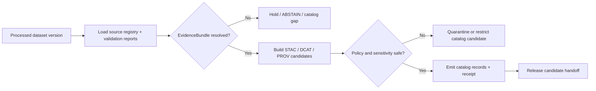

<!-- [KFM_META_BLOCK_V2]
doc_id: kfm://doc/pipelines-catalog-readme
title: Catalog Pipelines README
type: readme
version: v0.1
status: draft
owners:
  - <catalog-pipeline-owner>
  - <source-steward>
  - <evidence-steward>
  - <release-steward>
  - <docs-steward>
created: 2026-06-13
updated: 2026-06-13
policy_label: public
path: pipelines/catalog/README.md
related:
  - docs/doctrine/directory-rules.md
  - pipelines/README.md
  - pipeline_specs/
  - data/catalog/
  - data/triplets/
  - data/proofs/evidence_bundle/
  - data/proofs/validation_report/
  - data/receipts/pipeline/
  - release/candidates/
  - release/manifests/
  - schemas/contracts/v1/
  - contracts/
  - policy/
tags:
  - kfm
  - pipelines
  - catalog
  - evidence
  - stac
  - dcat
  - prov
  - catalog-matrix
  - governance
notes:
  - "This README replaces the greenfield stub for pipelines/catalog."
  - "Catalog pipelines prepare and validate catalog records; they do not publish artifacts or make release decisions."
  - "Executable behavior, CI coverage, schema paths, concrete catalog object names, and release wiring remain NEEDS VERIFICATION until implemented and tested."
[/KFM_META_BLOCK_V2] -->

<a id="top"></a>

# 🗂️ Catalog Pipelines

> Executable pipeline logic for turning validated processed records into **catalog-ready, evidence-linked, policy-aware, release-gated catalog candidates**.


**Status:** Draft  
**Path:** `pipelines/catalog/README.md`  
**Responsibility root:** `pipelines/` — executable pipeline logic  
**Placement posture:** `PROPOSED / NEEDS VERIFICATION` for concrete implementation details; root responsibility is consistent with Directory Rules  
**Public posture:** no direct publication; catalog output remains release-gated and must be consumed through governed interfaces or released artifacts

---

## Quick jump

- [1. Purpose](#1-purpose)
- [2. Placement and authority](#2-placement-and-authority)
- [3. What catalog pipelines do](#3-what-catalog-pipelines-do)
- [4. What catalog pipelines must not do](#4-what-catalog-pipelines-must-not-do)
- [5. Inputs](#5-inputs)
- [6. Outputs](#6-outputs)
- [7. Catalog closure flow](#7-catalog-closure-flow)
- [8. Required gates](#8-required-gates)
- [9. Directory contract](#9-directory-contract)
- [10. Minimal catalog candidate record](#10-minimal-catalog-candidate-record)
- [11. Tests, fixtures, and receipts](#11-tests-fixtures-and-receipts)
- [12. Promotion, publication, and rollback](#12-promotion-publication-and-rollback)
- [13. Definition of done](#13-definition-of-done)
- [14. Open questions](#14-open-questions)

---

## 1. Purpose

`pipelines/catalog/` contains executable catalog-building and catalog-validation pipeline logic.

Its job is to help transform validated processed records into catalog candidates that can support:

- source and dataset discovery;
- EvidenceBundle resolution;
- STAC, DCAT, PROV, or KFM-equivalent metadata closure;
- domain catalog entries;
- graph/triplet handoff where appropriate;
- release-candidate preparation;
- public-safe API, map, and artifact discovery **after release**.

Catalog pipelines sit near the middle of the KFM lifecycle:

```text
RAW -> WORK / QUARANTINE -> PROCESSED -> CATALOG / TRIPLET -> PUBLISHED
```

This directory is about the `PROCESSED -> CATALOG / TRIPLET` transition. It is not the publication authority.

[⬆ Back to top](#top)

---

## 2. Placement and authority

| Question | Answer | Status |
|---|---|---|
| Why `pipelines/`? | Catalog builders are executable pipeline logic: the **how**. | CONFIRMED root responsibility |
| What is `pipeline_specs/` for? | Declarative catalog job specs: the **what**. | CONFIRMED root split |
| Where do catalog records live? | `data/catalog/...`, not beside the code that generated them. | CONFIRMED lifecycle posture |
| Where do graph projections live? | `data/triplets/...` or approved graph-delta homes. | PROPOSED / NEEDS VERIFICATION |
| Where do receipts and proofs live? | `data/receipts/...` and `data/proofs/...`. | CONFIRMED lifecycle posture |
| Where do release decisions live? | `release/...`, not `pipelines/catalog/`. | CONFIRMED release split |

> [!IMPORTANT]
> Catalog pipelines may build and validate catalog candidates. They do not make publication decisions, grant public access, rewrite source roles, bypass evidence closure, or substitute catalog metadata for EvidenceBundle support.

[⬆ Back to top](#top)

---

## 3. What catalog pipelines do

Catalog pipelines may:

- read validated `data/processed/<domain>/<dataset_id>/<version>/` records;
- verify that processed data has validation receipts and policy decisions;
- resolve or verify EvidenceRef / EvidenceBundle pointers;
- build `data/catalog/stac/...` records;
- build `data/catalog/dcat/...` records;
- build `data/catalog/prov/...` records;
- build `data/catalog/domain/<domain>/...` indexes;
- prepare graph/triplet deltas for relationships and crosswalks;
- calculate catalog hashes and stable identifiers;
- emit catalog-build receipts;
- prepare release-candidate notes for later review.

Catalog pipelines should be deterministic where practical: same inputs, same specs, same policy state, and same tool versions should produce the same catalog candidate hashes.

[⬆ Back to top](#top)

---

## 4. What catalog pipelines must not do

Catalog pipelines must not:

- read directly from `data/raw/` unless explicitly operating in a validation/audit mode;
- promote `WORK` or `QUARANTINE` material into catalog;
- treat `data/processed/` as automatically public;
- write public artifacts to `data/published/`;
- write release manifests, promotion decisions, rollback cards, or correction notices unless invoked by a governed release process with explicit authority;
- rewrite source descriptors or source roles;
- create authoritative claims without EvidenceBundle closure;
- expose sensitive geometry or restricted metadata through catalog discovery;
- let generated summaries replace source evidence or review state;
- mutate canonical domain stores as a side effect of catalog generation.

> [!WARNING]
> A catalog record is a discovery and provenance control surface. It is not, by itself, proof of truth, proof of release, or permission for public display.

[⬆ Back to top](#top)

---

## 5. Inputs

Allowed inputs should come from governed KFM lifecycle homes.

| Input | Expected home | Required condition |
|---|---|---|
| Processed dataset version | `data/processed/<domain>/<dataset_id>/<version>/` | Validated, policy-checked, stable identifiers present. |
| Validation report | `data/proofs/validation_report/...` or approved proof home | Pass or bounded non-fatal warnings. |
| EvidenceBundle | `data/proofs/evidence_bundle/...` | Required for claim-bearing catalog entries. |
| Source registry / descriptor | `data/registry/sources/...` and `docs/sources/catalog/...` | Source role, rights, cadence, sensitivity, attribution. |
| Pipeline spec | `pipeline_specs/catalog/...` or approved spec home | Declares what catalog job should run. |
| Prior catalog baseline | `data/catalog/...` | Used for diff, supersession, stale-state detection, and rollback planning. |
| Release context | `release/manifests/...` when comparing to published artifacts | Required for released-state assertions. |

Unknown rights, missing source role, missing validation, or missing evidence support must produce `ABSTAIN`, `DENY`, `ERROR`, quarantine, or hold-state output rather than silent catalog promotion.

[⬆ Back to top](#top)

---

## 6. Outputs

Catalog pipelines may emit bounded outputs only to approved lifecycle homes.

| Output | Purpose | Home |
|---|---|---|
| STAC item/collection candidate | Spatial asset discovery and metadata. | `data/catalog/stac/...` |
| DCAT dataset candidate | Dataset catalog discovery and metadata. | `data/catalog/dcat/...` |
| PROV record candidate | Provenance trace. | `data/catalog/prov/...` |
| Domain catalog entry | Domain-specific catalog index. | `data/catalog/domain/<domain>/...` |
| Catalog matrix / closure report | Records catalog completeness and unresolved gaps. | `data/catalog/...` or `data/proofs/...` per schema decision |
| Triplet / graph delta | Relationship projection, not canonical replacement. | `data/triplets/graph_deltas/...` |
| Catalog build receipt | Run memory: inputs, specs, hashes, outputs. | `data/receipts/pipeline/...` |
| Validation report | Proves catalog candidate shape and policy checks. | `data/proofs/validation_report/...` |
| Release-candidate note | Handoff to release process. | `release/candidates/...` only when release workflow owns the write |

[⬆ Back to top](#top)

---

## 7. Catalog closure flow



The diagram is a target contract. It does not claim the implementation, job schedules, schema names, or CI jobs already exist.

[⬆ Back to top](#top)

---

## 8. Required gates

Every catalog pipeline must check or explicitly fail closed on:

1. **Processed-state gate** — inputs are from `data/processed/` or approved audit mode.
2. **Source-role gate** — source roles are present and not silently upgraded.
3. **Rights gate** — redistribution, display, attribution, and reuse terms are known.
4. **Sensitivity gate** — public discovery does not expose restricted details, exact sensitive geometry, or controlled metadata.
5. **Evidence gate** — claim-bearing catalog entries resolve to EvidenceBundle or abstain.
6. **Validation gate** — catalog records pass schema and semantic validation.
7. **Provenance gate** — PROV or KFM-equivalent provenance connects inputs, transforms, and outputs.
8. **Temporal gate** — observation, retrieval, processing, cataloging, valid, and release times remain distinct.
9. **Integrity gate** — hashes, stable identifiers, spec hashes, and tool versions are recorded.
10. **Stale-state gate** — superseded source versions and stale catalog entries are marked, not silently overwritten.
11. **No-public-shortcut gate** — catalog creation does not write public artifacts or bypass release.
12. **Rollback-readiness gate** — release candidates have enough metadata to support rollback planning.

[⬆ Back to top](#top)

---

## 9. Directory contract

Recommended shape:

```text
pipelines/catalog/
├── README.md                         # this file
├── PIPELINE_CONTRACT.md              # PROPOSED: catalog pipeline behavior contract
├── build_stac.py                     # PROPOSED if repo Python convention is accepted
├── build_dcat.py                     # PROPOSED if repo Python convention is accepted
├── build_prov.py                     # PROPOSED if repo Python convention is accepted
├── build_domain_catalog.py           # PROPOSED domain catalog index builder
├── build_triplet_delta.py            # PROPOSED graph/triplet projection builder
├── validate_catalog_candidate.py     # PROPOSED local validator wrapper, if not shared
└── emit_catalog_receipt.py           # PROPOSED only if not shared in tools/
```

Declarative job specifications should prefer a spec home such as:

```text
pipeline_specs/catalog/
├── README.md                         # PROPOSED / NEEDS VERIFICATION
├── stac_build.yaml                   # PROPOSED
├── dcat_build.yaml                   # PROPOSED
├── prov_build.yaml                   # PROPOSED
└── domain_catalog_build.yaml         # PROPOSED
```

Do not create generated catalog outputs under `pipelines/catalog/`. Generated outputs belong under `data/catalog/`, `data/triplets/`, `data/receipts/`, or `data/proofs/` depending on object type.

[⬆ Back to top](#top)

---

## 10. Minimal catalog candidate record

The final schema is not defined here. This example shows the minimum information the catalog pipeline should preserve.

```yaml
schema_version: kfm.catalog_candidate.v1
catalog_candidate_id: catalog_<domain>_<dataset_id>_<version>_<hash>
pipeline_id: catalog.build
run_id: run_YYYYMMDDThhmmssZ
status: CATALOG_CANDIDATE
input_dataset:
  domain: <domain>
  dataset_id: <dataset_id>
  version: <version>
  lifecycle_ref: data/processed/<domain>/<dataset_id>/<version>/
  input_hash: sha256:<hash>
source_registry_refs:
  - data/registry/sources/<domain>/<source_id>.yaml
evidence:
  evidence_bundle_ref: data/proofs/evidence_bundle/<bundle_id>/
  citation_state: RESOLVED
catalog_outputs:
  stac_ref: data/catalog/stac/<domain>/<dataset_id>/<version>.json
  dcat_ref: data/catalog/dcat/<domain>/<dataset_id>/<version>.json
  prov_ref: data/catalog/prov/<domain>/<dataset_id>/<version>.json
  domain_catalog_ref: data/catalog/domain/<domain>/<dataset_id>/<version>.json
policy:
  outcome: ALLOW_AT_STAGE
  stage: catalog_candidate
  public_release_allowed: false
sensitivity:
  public_discovery_class: restricted_until_release
  exact_geometry_public: false
integrity:
  spec_hash: sha256:<hash>
  output_hashes:
    stac: sha256:<hash>
    dcat: sha256:<hash>
    prov: sha256:<hash>
receipts:
  catalog_build_receipt: data/receipts/pipeline/catalog/run_YYYYMMDDThhmmssZ.yml
review:
  reviewer_required: true
  reviewer_roles:
    - catalog-steward
    - domain-steward
    - release-steward
rollback:
  release_rollback_required_before_publication: true
```

[⬆ Back to top](#top)

---

## 11. Tests, fixtures, and receipts

Recommended test coverage:

```text
tests/pipelines/catalog/
├── test_processed_state_required.py          # PROPOSED
├── test_missing_evidence_abstains.py         # PROPOSED
├── test_rights_unknown_denied.py             # PROPOSED
├── test_sensitive_metadata_restricted.py     # PROPOSED
├── test_stac_dcat_prov_shape.py              # PROPOSED
├── test_catalog_hash_stability.py            # PROPOSED
├── test_no_direct_publish.py                 # PROPOSED
└── test_release_manifest_not_written.py      # PROPOSED
```

Recommended fixture posture:

- no-network fixtures by default;
- one valid fixture per catalog object family;
- one invalid fixture per gate;
- one stale/superseded-source fixture;
- one missing-EvidenceBundle fixture;
- one sensitive-geometry fixture;
- one rights-unknown fixture;
- one rollback-readiness fixture.

Receipts should record:

- input dataset refs and hashes;
- source registry refs;
- EvidenceBundle refs;
- pipeline spec hash;
- tool version / commit where available;
- generated catalog refs and hashes;
- validation and policy outcomes;
- reviewer handoff status.

[⬆ Back to top](#top)

---

## 12. Promotion, publication, and rollback

Catalog creation is not publication.

Required chain:

```text
processed dataset
  -> catalog candidate
  -> validation report
  -> policy decision
  -> EvidenceBundle closure
  -> steward review
  -> release candidate
  -> ReleaseManifest
  -> RollbackCard
  -> public-safe artifact
```

Rollback posture:

- catalog candidates can be superseded or invalidated without deleting run receipts;
- stale catalog records must be marked and linked to superseding records;
- public artifact rollback is owned by `release/`, not by `pipelines/catalog/`;
- correction notices must point back to the release, catalog, and evidence state that changed.

[⬆ Back to top](#top)

---

## 13. Definition of done

This README is done when it:

- replaces the greenfield stub with a useful catalog pipeline contract;
- identifies `pipelines/catalog/` as executable logic, not data or release authority;
- preserves the `PROCESSED -> CATALOG / TRIPLET -> PUBLISHED` boundary;
- separates catalog outputs from release decisions and published artifacts;
- names STAC, DCAT, PROV, domain catalog, triplet, receipt, proof, validation, and rollback responsibilities;
- requires evidence closure and policy checks before catalog use;
- denies direct publication from the catalog pipeline.

Future executable catalog pipeline implementation is done only when it has:

- pipeline specs;
- source registry coverage;
- no-network fixtures;
- schema-backed catalog candidates;
- STAC/DCAT/PROV or equivalent validation;
- evidence-closure tests;
- sensitivity and rights tests;
- deterministic receipts;
- no-direct-publish tests;
- CI coverage;
- steward-review handoff;
- release and rollback documentation.

[⬆ Back to top](#top)

---

## 14. Open questions

| ID | Question | Status |
|---|---|---|
| `CAT-PIPES-001` | What final object family owns `CatalogCandidate`, `CatalogMatrix`, and catalog-closure reports? | PROPOSED / NEEDS ADR if new object family |
| `CAT-PIPES-002` | Should `pipeline_specs/catalog/` be created as the declarative home for catalog jobs? | NEEDS VERIFICATION |
| `CAT-PIPES-003` | Which STAC/DCAT/PROV profiles are mandatory for first-wave catalog closure? | NEEDS VERIFICATION |
| `CAT-PIPES-004` | Which domains are first-wave catalog pipeline targets? | NEEDS VERIFICATION |
| `CAT-PIPES-005` | Which CI job validates catalog candidates and no-direct-publish behavior? | UNKNOWN |
| `CAT-PIPES-006` | Where should catalog closure reports live if they are proof objects rather than catalog records? | NEEDS VERIFICATION |
| `CAT-PIPES-007` | What public discovery fields must be redacted or generalized for sensitive domains? | NEEDS VERIFICATION |
| `CAT-PIPES-008` | Which release steward approves a catalog candidate for release-candidate handoff? | NEEDS VERIFICATION |

---

## Maintainer note

Start with one fixture-only catalog builder and negative tests. Prove no-direct-publish behavior before adding live source-derived catalog generation or release handoff automation.
