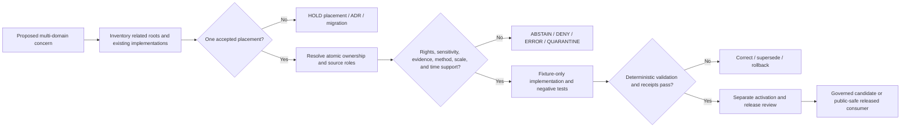

<!-- [KFM_META_BLOCK_V2]
doc_id: kfm://doc/pipelines-cross-lane-readme
title: pipelines/cross_lane/ — Cross-Domain Pipeline Routing and Child-Admission Boundary
type: readme; directory-readme; cross-domain-pipeline-parent; compatibility-routing; child-admission-guardrail; non-publisher-boundary
version: v0.2
status: draft; repository-grounded; parent-readme-plus-one-child; no-shared-executable-established; no-machine-registry-established; placement-conflicted
owners:
  - OWNER_TBD — Pipeline steward
  - OWNER_TBD — Cross-domain architecture steward
  - OWNER_TBD — Domain stewards for admitted child lanes
  - OWNER_TBD — Source and rights steward
  - OWNER_TBD — Evidence and receipt steward
  - OWNER_TBD — Policy and sensitivity steward
  - OWNER_TBD — Validation and CI steward
  - OWNER_TBD — Release steward
  - OWNER_TBD — Security reviewer
  - OWNER_TBD — Directory Rules steward
  - OWNER_TBD — Docs steward
created: 2026-06-13
updated: 2026-07-19
supersedes: v0.1
policy_label: public-doc; pipelines; cross-domain; cross-lane; routing; compatibility; child-admission; no-secrets; no-live-source-access; no-source-activation; no-direct-raw-admission; no-parallel-authority; no-direct-publication; source-role-preserving; evidence-bound; rights-aware; sensitivity-aware; review-gated; correction-aware; rollback-aware
current_path: pipelines/cross_lane/README.md
owning_root: pipelines/
responsibility: preserve the current cross_lane path as a bounded routing, child-admission, compatibility, and migration guardrail for multi-domain pipeline concerns without asserting a generic execution framework, new domain, canonical registry, semantic authority, machine-shape authority, policy authority, proof authority, release authority, or public-serving authority
truth_posture: CONFIRMED target README and prior blob; pipelines executable responsibility root; pipelines/domains domain-owned execution boundary; one surfaced child lane at pipelines/cross_lane/riparian_vegetation/ with repository-grounded v0.2; Directory Rules and multi-domain placement doctrine; cross-lane four-invariant doctrine; cross-domain architecture folder; contracts/cross_domain routing README; tools/validators/cross-lane compatibility bridge and canonical cross-domain-joins target; tests/cross_domain surviving placement-conflicted parent; pipeline_specs placeholder-heavy root; tests/pipelines README-only parent; checked absence of umbrella contract, registry, shared README, cross-lane spec/test/fixture READMEs, lane AGENTS.md, and dedicated cross-lane workflow; bounded search surfacing only this README and the riparian child under pipelines/cross_lane; no open PR or matching branch / PROPOSED compatibility and child-admission role for this parent, one accepted topic-specific executable home per concern, child registration contract, machine registry only after ownership decision, deterministic identity, spec-to-consumer agreement, finite outcomes, no-network fixtures, receipt bindings, correction propagation, and rollback / CONFLICTED cross_lane versus cross-domain naming; umbrella namespace versus direct pipelines/<topic>/ placement doctrine; underscore versus hyphen spelling; generic parent versus topic-specific child authority; WORK-first composition attempts versus PROCESSED derivation posture; tests/cross_domain and contracts/cross_domain compatibility namespaces versus direct topic segments / UNKNOWN exhaustive recursive inventory, accepted parent lifetime, canonical generic pipeline target, executable modules, active specs, parser/consumer registry, source activation, fixtures, executable tests, substantive CI, emitted receipts, production execution, monitoring, release integration, public consumers, and branch-protection significance / NEEDS VERIFICATION named owners, accepted ADR or migration record, stable topic naming, child inventory and registration, candidate and receipt object families, source-role vocabulary, rights and sensitivity enforcement, review separation, correction consumers, and rollback execution
evidence_snapshot:
  repository: bartytime4life/Kansas-Frontier-Matrix
  repository_id: "1059091169"
  visibility: public
  base_ref: main
  base_commit: 66adcd917bc77232f6eac2218849f812019631dd
  target_prior_blob: cf3bb3a434cc29f0b21c64c7c2bc1faefc4e5b81
  pipelines_root_blob: 9fb38acf5a67ca43608617d73a273d06f5f84db5
  pipelines_domains_blob: 5d0662ff795c72e7ced583a3ddedfe230131f40c
  riparian_child_blob: 274bdb2f72766f715ded1bfc46d6478c868266bf
  directory_rules_blob: 18653c00ba193a4afaa3e07a0924452807fb98ef
  multi_domain_placement_blob: 12ba496e89b1a2bb5e1009080e4d611c7fb369d0
  cross_lane_relations_blob: 15ca8eb8c7790d2962b710097196ed9b1eea0f79
  cross_domain_architecture_blob: 5ed58879a3724439cf296845241960fc1f39cdc8
  contracts_cross_domain_blob: 58c2f1bfaa4f9b49676c339b2977a1c46ffcf88a
  validator_cross_lane_blob: 509c6e90a94e84ce2b3ae6384f0acf40621ef334
  tests_cross_domain_blob: cdf514e6a972be821f5f10d27d504aa3a5d03131
  pipeline_specs_root_blob: 7f35f1c06aaec08d03182cf71e88a812bf179ebf
  tests_pipelines_blob: 08fa70cd33af2c04f03aadbf7d973c6f4e29fbf3
  direct_lane_files_confirmed:
    - pipelines/cross_lane/README.md
    - pipelines/cross_lane/riparian_vegetation/README.md
  checked_absent_paths:
    - AGENTS.md
    - pipelines/AGENTS.md
    - pipelines/cross_lane/AGENTS.md
    - pipelines/cross_lane/PIPELINE_CONTRACT.md
    - pipelines/cross_lane/registry.yml
    - pipelines/cross_lane/shared/README.md
    - pipeline_specs/cross_lane/README.md
    - tests/pipelines/cross_lane/README.md
    - fixtures/pipelines/cross_lane/README.md
    - .github/workflows/cross-lane.yml
  inventory_method: GitHub connector exact file reads, bounded repository code-index queries, exact path probes, and open branch/pull-request searches; absence, child-count, and README-only conclusions are bounded to checked paths, indexed results, and the pinned snapshot
related:
  - ../README.md
  - ../domains/README.md
  - ./riparian_vegetation/README.md
  - ../biodiversity/vegetation_stress/README.md
  - ../../docs/architecture/directory-rules.md
  - ../../docs/architecture/cross-domain/README.md
  - ../../docs/architecture/cross-domain/multi-domain-placement.md
  - ../../docs/architecture/cross-domain/cross-lane-relations.md
  - ../../contracts/cross_domain/README.md
  - ../../tools/validators/cross-lane/README.md
  - ../../tools/validators/cross-domain-joins/README.md
  - ../../tests/cross_domain/README.md
  - ../../pipeline_specs/README.md
  - ../../tests/pipelines/README.md
  - ../../CONTRIBUTING.md
  - ../../.github/CODEOWNERS
  - ../../data/receipts/generated/README.md
  - ../../schemas/contracts/v1/receipts/generated_receipt.schema.json
tags:
  - kfm
  - pipelines
  - cross-lane
  - cross-domain
  - routing
  - compatibility
  - child-admission
  - domain-ownership
  - source-role
  - evidence
  - rights
  - sensitivity
  - policy
  - correction
  - rollback
notes:
  - "v0.2 replaces a proposed generic umbrella tree with a commit-pinned routing, compatibility, child-admission, and migration boundary."
  - "Bounded inspection surfaced this README and one child README under pipelines/cross_lane; no shared executable, umbrella contract, machine registry, matching spec/test/fixture README, or dedicated workflow is established."
  - "Directory doctrine supports multi-domain files under the lowest common responsibility root with a stable topic segment, but does not by itself accept cross_lane as a generic intermediate namespace."
  - "This parent indexes and constrains child lanes; it does not create cross-domain truth, absorb domain ownership, or authorize implementation, source activation, lifecycle promotion, release, or publication."
  - "This documentation-only revision changes no executable code, source activation, schema, contract, policy, fixture, test, workflow, lifecycle record, receipt instance beyond generated provenance, proof, release object, runtime behavior, or public artifact."
[/KFM_META_BLOCK_V2] -->

<a id="top"></a>

# `pipelines/cross_lane/` — Cross-Domain Pipeline Routing and Child-Admission Boundary

> **One-line purpose.** Preserve the current `cross_lane/` path as a reviewable routing and compatibility surface for multi-domain pipeline concerns while requiring every executable concern to resolve to one accepted, topic-specific implementation, specification, validation, evidence, and release path.

<p>
  
  
  
  
  
  
</p>

**Path:** `pipelines/cross_lane/README.md`
**Version:** `v0.2`
**Owning root:** [`pipelines/`](../README.md) — executable pipeline logic, the **how**
**Current path class:** parent routing, compatibility, child admission, duplicate-authority prevention, and migration guidance
**Direct inventory at the pinned snapshot:** this README plus [`riparian_vegetation/README.md`](./riparian_vegetation/README.md)
**Public posture:** no direct source admission, lifecycle promotion, release, deployment, public API, map, export, or AI authority
**Evidence snapshot:** `main@66adcd917bc77232f6eac2218849f812019631dd`

> [!IMPORTANT]
> **This is not a proven generic cross-domain execution framework.** Bounded inspection found no umbrella contract, machine registry, shared implementation README, matching declarative spec parent, matching pipeline-test parent, matching fixture parent, or dedicated workflow. The directory's existence and prose do not activate a framework.

> [!CAUTION]
> **Placement is unresolved.** Multi-domain placement doctrine says files belong under the lowest common responsibility root using a stable topic segment, such as `pipelines/<topic>/...`. The current `pipelines/cross_lane/<topic>/...` shape adds a generic intermediate namespace. No accepted ADR or machine registry was verified that settles whether this is canonical, transitional, or a compatibility path.

> [!WARNING]
> Cross-domain joins can create sensitive knowledge not present in any one input. A parent index must not normalize unsafe precision, source-role collapse, private-land inference, rare-species exposure, cultural reconstruction, infrastructure exposure, regulatory implication, or public release simply by registering a child.

**Quick navigation:** [Status](#0-status-and-evidence-boundary) · [Purpose](#1-purpose) · [Authority](#2-authority-and-placement) · [Parent role](#3-parent-lane-responsibilities) · [Allowed](#4-what-belongs-here) · [Excluded](#5-what-does-not-belong-here) · [Inventory](#6-current-inventory) · [Admission](#7-child-lane-admission-contract) · [Invariants](#8-cross-lane-invariants) · [Lifecycle](#9-lifecycle-and-execution-boundary) · [Routing](#10-responsibility-root-routing) · [Specs and tests](#11-specs-contracts-schemas-validators-tests-and-ci) · [Security](#12-rights-sensitivity-security-and-data-minimization) · [Outcomes](#13-finite-outcomes-and-operational-states) · [Receipts](#14-receipts-proofs-observability-and-audit) · [Review](#15-review-governance-and-change-discipline) · [Rollback](#16-correction-migration-and-rollback) · [Preservation](#17-no-loss-preservation) · [Done](#18-definition-of-done) · [Open](#19-open-verification-register) · [Evidence](#20-evidence-ledger) · [History](#21-change-history)

---

## 0. Status and evidence boundary

### Current determination

`pipelines/cross_lane/` is an existing parent README path inside the executable `pipelines/` responsibility root. At the pinned snapshot, it is best supported as a **routing and compatibility boundary**, not as an established umbrella implementation.

| Surface | Inspected state | Evidence-bounded conclusion |
|---|---:|---|
| Parent README | `CONFIRMED` | v0.1 existed and is revised in place. |
| Direct parent inventory | `README + ONE CHILD` | Bounded search surfaced this README and `riparian_vegetation/README.md`. |
| Confirmed child | `riparian_vegetation/` | Repository-grounded v0.2; direct child implementation is not established. |
| Parent execution contract | `NOT FOUND AT CHECKED PATH` | No umbrella executable contract is established. |
| Parent machine registry | `NOT FOUND AT CHECKED PATH` | No accepted child registry or activation register is established. |
| Shared implementation lane | `NOT FOUND AT CHECKED PATH` | No `shared/README.md` or common executor is established here. |
| Declarative spec parent | `NOT FOUND AT CHECKED PATH` | No `pipeline_specs/cross_lane/README.md` is established. |
| Dedicated pipeline-test parent | `NOT FOUND AT CHECKED PATH` | No `tests/pipelines/cross_lane/README.md` is established. |
| Dedicated fixture parent | `NOT FOUND AT CHECKED PATH` | No `fixtures/pipelines/cross_lane/README.md` is established. |
| Dedicated workflow | `NOT FOUND AT CHECKED PATH` | No `.github/workflows/cross-lane.yml` is established. |
| Cross-domain doctrine | `CONFIRMED DRAFT FILES` | Multi-domain placement and four relation invariants are documented. |
| Generic cross-domain validator | `CONFIRMED ROUTING SURFACE` | `cross-lane/` is a compatibility bridge to `cross-domain-joins/`; executable depth varies and is separate from this parent. |
| Cross-domain test parent | `CONFIRMED / CONFLICTED` | `tests/cross_domain/` survives as a routing parent with one surfaced child; naming remains unresolved. |
| Cross-domain contracts parent | `CONFIRMED / CONFLICTED` | `contracts/cross_domain/` exists as a coordination README; topic naming remains unresolved. |
| Runtime use | `UNKNOWN` | No production trace, scheduler, active spec, receipt corpus, release dependency, or public consumer was verified. |

### Safe conclusions

- **CONFIRMED:** the path exists inside the correct executable responsibility root.
- **CONFIRMED:** one child README is surfaced under this parent.
- **CONFIRMED:** cross-domain composition must preserve ownership, source role, sensitivity, and EvidenceBundle support.
- **CONFIRMED:** `pipelines/domains/` remains the domain-owned executable lane.
- **PROPOSED:** this parent may remain as a compatibility and child-admission index if governance accepts it.
- **CONFLICTED:** the generic `cross_lane/` intermediate namespace versus direct `pipelines/<topic>/` placement.
- **UNKNOWN:** any generic shared executor, runtime registry, active source use, production behavior, or release integration.
- **NEEDS VERIFICATION:** every future child, command, contract, schema, spec, fixture, test, validator binding, policy, receipt, workflow, and consumer.

### Truth labels

| Label | Meaning in this README |
|---|---|
| `CONFIRMED` | Verified from the pinned repository snapshot, exact path checks, or merged adjacent documentation. |
| `PROPOSED` | A future design, path, contract, workflow, or procedure not established as current behavior. |
| `CONFLICTED` | Current repository structure and doctrine do not resolve to one accepted answer. |
| `UNKNOWN` | The inspected evidence is insufficient. |
| `NEEDS VERIFICATION` | A concrete check is required before reliance or promotion. |
| `DENY` | A proposed action would bypass responsibility, policy, evidence, sensitivity, lifecycle, or release controls. |

[Back to top](#top)

---

## 1. Purpose

This parent exists to make multi-domain pipeline work visible and governable without inventing a new KFM domain or merging bounded contexts.

Its useful responsibilities are:

- route contributors to cross-domain placement doctrine before they choose a path;
- index only children verified to exist;
- require each child to name its participating domains and atomic owners;
- prevent one child from becoming a generic shared authority by convenience;
- prevent duplicate runners, specs, contracts, schemas, tests, receipts, or release paths;
- make naming and placement conflicts explicit;
- define the evidence required before a child graduates from documentation to implementation;
- preserve migration, correction, and rollback obligations;
- deny direct publication from every child.

This parent does not answer the child-specific scientific, historical, operational, or policy question. A child and its paired responsibility-root artifacts must carry those details.

### Why cross-domain pipeline work needs a parent guardrail

Multi-domain work is vulnerable to four structural failures:

1. **picked-domain ownership** — one domain becomes the accidental owner of another domain's facts;
2. **parallel authority** — multiple runners or schemas implement the same composition differently;
3. **role and sensitivity collapse** — the join erases knowledge character or lowers restrictions;
4. **publication shortcut** — a derived map or summary is mistaken for released truth.

A parent index helps reviewers see those risks. It does not solve them by itself.

[Back to top](#top)

---

## 2. Authority and placement

### Directory Rules basis

The live [Directory Rules](../../docs/architecture/directory-rules.md) choose paths by primary responsibility. The [multi-domain placement standard](../../docs/architecture/cross-domain/multi-domain-placement.md) states that a file spanning multiple domains belongs under the lowest common responsibility root, using a stable non-domain topic segment.

For executable orchestration, the relevant root is:

```text
pipelines/
```

The unresolved question is the segment below it:

```text
pipelines/<topic>/...                 # direct topic form from multi-domain doctrine
pipelines/cross_lane/<topic>/...      # current repository form for the surfaced child
```

### Current path class

| Field | Determination |
|---|---|
| Primary responsibility | Parent routing, child admission, compatibility, duplicate-authority prevention, migration guidance |
| Owning root | `pipelines/` |
| Current repository form | `pipelines/cross_lane/` |
| Canonical status | `CONFLICTED / NEEDS VERIFICATION` |
| Domain status | Not a domain |
| Shared executable status | Not established |
| Machine-registry status | Not established |
| Publication status | Denied |

### Parent versus topic-specific execution

A future executable concern should normally have a stable topic identity, such as a riparian-vegetation, habitat-fauna, regulatory-observed, or vegetation-stress concern. Before code lands, reviewers must decide whether the concern uses:

- a direct topic path under `pipelines/`;
- a child under this compatibility parent;
- a domain-owned implementation with cross-domain references;
- a package or tool because pipeline orchestration is not the primary responsibility.

The decision must be explicit. This README does not select one universal answer.

### No implicit umbrella authority

The parent does not own:

- a generic cross-domain object model;
- generic join semantics;
- relation or crosswalk schemas;
- cross-domain policy;
- generic validation mechanics;
- an active child registry;
- a scheduler or runtime;
- catalog or release authority.

Those concerns already belong to separate roots or require an accepted decision.

[Back to top](#top)

---

## 3. Parent-lane responsibilities

### What this parent owns

This README may own documentation for:

- the current path's status and evidence boundary;
- the bounded child index;
- child admission and graduation requirements;
- shared cross-lane invariants by reference;
- duplicate-authority detection;
- naming and placement conflicts;
- compatibility and migration posture;
- review burden and rollback expectations;
- evidence-ledger maintenance for this parent.

### What this parent coordinates but does not own

| Concern | Parent role | Actual authority |
|---|---|---|
| Child execution | Index and review entrypoint | Accepted child pipeline or package |
| Domain facts | Verify ownership is named | Participating domain contracts and lifecycle records |
| Relation meaning | Require an accepted reference | `contracts/<topic>/` or accepted contract home |
| Machine shape | Require a pinned schema | `schemas/contracts/v1/<topic>/` or accepted schema home |
| Policy | Require decisions and obligations | `policy/<topic>/` or accepted policy home |
| Validation | Require one canonical validator path | `tools/validators/<topic>/` |
| Fixtures and tests | Require deterministic coverage | `fixtures/`, `tests/`, or accepted package/domain test lanes |
| Specs | Require one schema-valid spec and consumer | `pipeline_specs/` |
| Receipts and proofs | Require emitted refs | `data/receipts/`, `data/proofs/` |
| Lifecycle artifacts | Require governed transitions | `data/<phase>/` |
| Release | Require separate approval | `release/` |
| Public behavior | Require governed released inputs | application, runtime, and public artifact roots |

### Parent non-goals

The parent must not become:

- an executable framework package;
- a contract, schema, or policy bundle;
- a data store;
- a receipt or proof store;
- a release registry;
- a public API index;
- a merged domain.

[Back to top](#top)

---

## 4. What belongs here

Given current maturity, accepted content is deliberately narrow:

- this parent README;
- verified child directories with their own evidence-bounded README;
- compatibility and migration notices;
- child admission checklists;
- bounded inventory and evidence-ledger updates;
- explicit deprecation or supersession notices;
- links to canonical responsibility-root artifacts.

### Conditional future content

The following content may belong only after an accepted placement decision proves this parent is more than a compatibility path:

- a parent-level health checker that verifies child links and duplicate paths;
- a generated child index derived from an accepted control-plane registry;
- a thin routing entrypoint that dispatches only to separately owned child consumers;
- shared orchestration interfaces that cannot be owned by a topic-specific package or pipeline.

Even then, this directory must not duplicate generic join validation, policy, contracts, schemas, tests, data, or release logic.

### Child directory test

A child is eligible for consideration only when:

- it spans at least two domains materially;
- no one domain is the correct semantic owner of the composition;
- executable orchestration is the file family's primary responsibility;
- a stable topic name exists;
- the child does not shadow an existing topic or domain lane;
- its contract, schema, policy, tests, fixtures, receipts, and release handoffs are routed to their own roots;
- it has no direct publication path.

[Back to top](#top)

---

## 5. What does not belong here

| Excluded content | Correct responsibility home |
|---|---|
| Single-domain pipeline implementation | [`pipelines/domains/<domain>/`](../domains/README.md) |
| Source fetchers, API clients, credentials, external retry logic | `connectors/` or accepted source-access package |
| Source identity, source role, rights, activation | source registry/control-plane, contracts, and policy |
| Cross-domain semantic meaning | `contracts/<topic>/` or accepted contract home |
| Machine-checkable shape | `schemas/contracts/v1/<topic>/` |
| Allow, deny, restrict, redact, generalize, or release logic | `policy/<topic>/` |
| Generic cross-domain join validation | [`tools/validators/cross-domain-joins/`](../../tools/validators/cross-domain-joins/README.md) |
| Compatibility-only validator naming | [`tools/validators/cross-lane/`](../../tools/validators/cross-lane/README.md) |
| Declarative schedules, profiles, source bindings, run scope | [`pipeline_specs/`](../../pipeline_specs/README.md) |
| Fixtures | `fixtures/<topic>/` or accepted fixture lane |
| Executable tests | `tests/<topic>/`, [`tests/cross_domain/`](../../tests/cross_domain/README.md), package-local, or domain-local lane after placement review |
| Lifecycle artifacts | `data/raw/`, `data/work/`, `data/quarantine/`, `data/processed/`, `data/catalog/`, `data/triplets/`, `data/published/` |
| Receipts and proofs | `data/receipts/`, `data/proofs/` |
| Release manifests, corrections, withdrawals, rollback cards | `release/` |
| Public API, map, UI, export, or AI response code | governed app/runtime/package roots |
| A new root-level `cross_lane/` or `cross_domain/` folder | Denied by responsibility-root discipline |

Generated outputs must never be stored beside the code or README that describes them.

[Back to top](#top)

---

## 6. Current inventory

### Surfaced parent and child

| Path | Current role | Status |
|---|---|---|
| `pipelines/cross_lane/README.md` | Parent routing, compatibility, child admission, placement warning, migration guardrail | `CONFIRMED target` |
| [`pipelines/cross_lane/riparian_vegetation/README.md`](./riparian_vegetation/README.md) | Riparian-vegetation composition boundary | `CONFIRMED v0.2 / README-only / placement-conflicted` |

No additional child is claimed from the bounded search.

### Checked absent parent surfaces

```text
pipelines/cross_lane/AGENTS.md
pipelines/cross_lane/PIPELINE_CONTRACT.md
pipelines/cross_lane/registry.yml
pipelines/cross_lane/shared/README.md
pipeline_specs/cross_lane/README.md
tests/pipelines/cross_lane/README.md
fixtures/pipelines/cross_lane/README.md
.github/workflows/cross-lane.yml
```

Absence is limited to these checked paths and the pinned snapshot. It does not prove absence from history, other branches, ignored files, generated output, package-local code, or external systems.

### Adjacent cross-domain surfaces

| Surface | Relationship | Parent posture |
|---|---|---|
| [`docs/architecture/cross-domain/`](../../docs/architecture/cross-domain/README.md) | Doctrine and navigation | Read; do not duplicate. |
| [`contracts/cross_domain/`](../../contracts/cross_domain/README.md) | Semantic coordination compatibility namespace | Require accepted topic contract; naming remains conflicted. |
| [`tools/validators/cross-lane/`](../../tools/validators/cross-lane/README.md) | Compatibility pointer | Do not treat as generic implementation. |
| [`tools/validators/cross-domain-joins/`](../../tools/validators/cross-domain-joins/README.md) | Canonical generic validator boundary by adjacent README evidence | Reference; do not reimplement. |
| [`tests/cross_domain/`](../../tests/cross_domain/README.md) | Surviving cross-domain test-routing parent | Placement-conflicted; do not assume child coverage. |
| [`pipeline_specs/`](../../pipeline_specs/README.md) | Declarative spec root | No cross-lane parent established. |
| [`tests/pipelines/`](../../tests/pipelines/README.md) | Pipeline behavior test parent | Direct lane documented as README-only at its snapshot. |

### Inventory maintenance rule

The child table must be evidence-generated or manually verified at a pinned commit. Do not list a planned child as current inventory. Planned topics belong in the verification register until created through review.

[Back to top](#top)

---

## 7. Child-lane admission contract

### Admission decision

A new child under this parent requires a review record that answers:

| Field | Required answer |
|---|---|
| Topic | Stable cross-domain topic name and naming rationale |
| Participating domains | Every domain materially involved |
| Atomic ownership | Which domain owns each input and output atom |
| Why not one domain? | Evidence that a domain-owned path would hide or distort authority |
| Why not direct `pipelines/<topic>/`? | Explicit rationale for using the compatibility parent |
| Existing overlaps | All related pipeline, package, validator, spec, test, contract, schema, policy, receipt, proof, and release paths |
| Canonical implementation | One runner or package home; duplicate implementations denied |
| Declarative spec | One spec ID, version, schema, parser, and consumer |
| Inputs and outputs | Allowed lifecycle phases and immutable references |
| Source roles | Allowed roles and anti-collapse rules |
| Method | Version, parameters, scale, time, uncertainty, and fitness limits |
| Rights and sensitivity | Decision refs, obligations, transforms, and join-induced risk |
| Evidence | EvidenceRef-to-EvidenceBundle closure requirements |
| Outcomes | Finite results, reason codes, and hold/quarantine semantics |
| Tests | Valid, invalid, denied, abstain, stale, corrected, and rollback cases |
| Receipts | Required process-memory and proof references |
| Release | Review, correction, withdrawal, and rollback chain |
| Security | No-network, sandbox, secret, logging, and resource limits |
| Owners | Verified GitHub identities and stewardship assignments |
| Migration | Compatibility, deprecation, and rollback path |

### Admission outcomes

| Outcome | Meaning |
|---|---|
| `ADMIT_DOCUMENTATION_ONLY` | README may land; no implementation or activation claim. |
| `ADMIT_FIXTURE_ONLY` | Synthetic no-network implementation may land behind denied activation. |
| `HOLD_PLACEMENT` | Topic is valid but implementation home is unresolved. |
| `HOLD_AUTHORITY` | Atomic ownership, contract, schema, policy, or reviewer authority is unresolved. |
| `DENY_DUPLICATE` | Another active or accepted implementation already owns the concern. |
| `DENY_SENSITIVITY` | Safe fixtures, minimization, rights, or join-risk controls are insufficient. |
| `DENY_PUBLIC_PATH` | Proposed child would publish, expose internal stores, or bypass release. |
| `ERROR_PREFLIGHT` | Inventory or required evidence could not be resolved. |

These names are README vocabulary unless a contract or schema adopts them.

### Graduation stages

```text
documentation-only
  -> accepted placement and owners
  -> accepted contract/schema/spec interfaces
  -> synthetic fixture-only implementation
  -> deterministic tests and receipts
  -> source activation review
  -> candidate production
  -> catalog/triplet and release integration
  -> governed public-safe consumption
```

Each transition is separately reviewed. No child skips from README to public output.

[Back to top](#top)

---

## 8. Cross-lane invariants

The [cross-lane relation doctrine](../../docs/architecture/cross-domain/cross-lane-relations.md) defines four core invariants. Every child must implement or defer to them.

| Invariant | Required child behavior |
|---|---|
| Ownership preserved | Each atomic object keeps its owning domain and version; relations do not transfer ownership. |
| Source role preserved | Observed, regulatory, modeled, aggregate, administrative, candidate, and synthetic characters remain explicit. |
| Sensitivity preserved | A child cannot lower restrictions by joining, aggregating, summarizing, or rendering. |
| Evidence support | Consequential relations resolve required EvidenceBundles or abstain/deny. |

### Additional parent admission invariants

1. **One canonical implementation.** No duplicate runner, scheduler, spec consumer, or output writer.
2. **One canonical identity grammar.** Child, spec, run, method, input, candidate, receipt, and release refs are deterministic where required.
3. **No source-role synthesis.** A join does not invent a new observation or authority class.
4. **No public truth upgrade.** Candidate, processed, catalog, graph, tile, summary, or model output remains derived.
5. **No sensitivity laundering.** Generalization or aggregation requires explicit policy and transform evidence.
6. **No direct lifecycle bypass.** Children use governed transitions and allowed write roots.
7. **No implicit review.** A pipeline return code, CI check, commit, or merge is not steward approval.
8. **No direct publication.** Release authority remains separate.
9. **Correction propagation.** Changed atomic inputs invalidate or re-evaluate dependent outputs.
10. **Rollback visibility.** Every release-affecting child has a tested rollback target.

### Anti-collapse examples

```text
cross-lane join -> new domain truth
context source -> primary authority
modeled surface -> observation
regulatory layer -> historical event
aggregate -> per-place fact
proximity -> occurrence
pipeline success -> evidence closure
catalog entry -> release
merge -> publication
generated summary -> EvidenceBundle
```

All are denied.

[Back to top](#top)

---

## 9. Lifecycle and execution boundary

Every admitted child preserves:

```text
RAW -> WORK / QUARANTINE -> PROCESSED -> CATALOG / TRIPLET -> PUBLISHED
```

### Parent stance

The parent does not define one universal cross-domain state machine. A child must state:

- which phases it may read;
- which candidate phase it may write;
- how failed or unsafe material enters QUARANTINE;
- what validates a derived object for PROCESSED;
- how catalog and triplet projections preserve provenance;
- which release gates apply;
- how corrections and withdrawals propagate.

### WORK-versus-PROCESSED conflict

Current documentation exposes two compatible but not yet accepted ideas:

- exploratory cross-lane join attempts begin in WORK or QUARANTINE;
- cross-domain derivations enter PROCESSED only after participating atomic facts and evidence close.

This suggests a two-stage model, but the parent does not ratify it:

```text
WORK join attempt
  -> blockers, validation, sensitivity, evidence resolution
  -> PROCESSED derived candidate
  -> CATALOG / TRIPLET
  -> release review
  -> PUBLISHED public-safe artifact
```

Each child must obtain lifecycle-steward approval for its exact transition grammar.

### Parent execution flow



[Back to top](#top)

---

## 10. Responsibility-root routing

A cross-domain concern fans across roots by responsibility. The topic may share a conceptual name, but authority remains split.

| Responsibility | Correct root | Parent requirement |
|---|---|---|
| Architecture and placement doctrine | `docs/architecture/` | Link; do not restate as implementation proof. |
| Semantic meaning | `contracts/<topic>/` | Require accepted contract and atomic owners. |
| Machine shape | `schemas/contracts/v1/<topic>/` | Require paired schema and version. |
| Admissibility | `policy/<topic>/` | Require finite decision and obligations. |
| Executable pipeline orchestration | `pipelines/<topic>/`, child here, or accepted package | Decide exactly one. |
| Declarative intent | `pipeline_specs/<topic>/` or accepted spec lane | Require schema, parser, consumer, activation state. |
| Shared validator | `tools/validators/<topic>/` | Reuse generic cross-domain mechanics. |
| Fixtures | `fixtures/<topic>/` or accepted domain/package lane | Synthetic and minimized by default. |
| Tests | `tests/<topic>/`, surviving compatibility parent, package/domain lane | Avoid duplicate assertions. |
| Lifecycle records | `data/<phase>/` | Governed state transition only. |
| Receipts | `data/receipts/` | Process memory; not evidence or approval. |
| Proofs and EvidenceBundles | `data/proofs/` | Resolve for consequential claims. |
| Release and rollback | `release/` | Independent authority. |
| Public API/UI/AI | governed apps, runtime, packages, released artifacts | Consume only released and policy-safe inputs. |

### Topic identity rule

A stable topic name must be consistent enough to resolve related artifacts without forcing every root to use a generic `cross_lane` or `cross_domain` intermediate namespace. Where existing compatibility paths differ, the PR must document the mapping and migration plan.

### No mechanical mirroring

Do not create every corresponding path merely because the conceptual concern spans roots. Create only the artifacts required by an accepted implementation slice, and prove each placement against current evidence.

[Back to top](#top)

---

## 11. Specs, contracts, schemas, validators, tests, and CI

### Current maturity

| Surface | Current evidence | Safe conclusion |
|---|---|---|
| Parent pipeline spec | Not found at checked path | No active parent spec system. |
| Parent pipeline tests | Not found at checked path | No dedicated umbrella suite. |
| Parent fixtures | Not found at checked path | No dedicated umbrella fixture family. |
| Cross-domain test routing | `tests/cross_domain/` exists | Placement-conflicted; one surfaced README-only child at its snapshot. |
| Cross-domain contract routing | `contracts/cross_domain/` exists | Coordination README; naming and concrete inventory unresolved. |
| Generic validator routing | `cross-lane/` bridge points to `cross-domain-joins/` | Do not duplicate generic mechanics here. |
| Pipeline-spec root | Placeholder-heavy | File presence does not activate a spec. |
| Pipeline-test root | README-only direct parent at its snapshot | No default dedicated pipeline suite established. |
| Dedicated workflow | Not found at checked path | No cross-lane check or required-check claim. |

### Minimum active spec contract

A child spec must identify:

- stable spec ID, semantic version, state, owners, and digest;
- accepted schema and canonicalization rules;
- exact parser, consumer, and code revision;
- admitted source and domain object refs;
- fixed source roles and knowledge characters;
- allowed lifecycle inputs and candidate outputs;
- method, parameters, thresholds, scale, time, uncertainty, and fitness limits;
- rights, sensitivity, evidence, policy, review, release, correction, and rollback requirements;
- no-network fixtures and deterministic expected outcomes;
- activation, deactivation, supersession, and kill-switch behavior.

A YAML file without those bindings is not an active spec.

### Minimum child test families

- placement and duplicate-authority detection;
- atomic ownership preservation;
- source-role and knowledge-character preservation;
- rights and source-term denial;
- sensitivity inheritance and join-induced disclosure;
- EvidenceRef resolution and cite-or-abstain;
- scale, CRS, precision, adjacency, and generalization;
- temporal support, staleness, correction, and source vintage;
- deterministic identity, hashing, idempotency, replay, and no-op;
- no-network and filesystem sandbox;
- malformed, oversized, adversarial, and partial-state handling;
- receipt content and hash closure;
- no-direct-publish and no-release-write;
- correction, withdrawal, supersession, and rollback;
- public consumer finite negative states.

### CI requirements

A future workflow must:

- use a stable name and job IDs;
- declare least-privilege permissions;
- treat pull-request code as untrusted;
- use repository-native commands;
- pin or explicitly govern external actions and dependencies;
- run no-network fixtures by default;
- distinguish pass, fail, deny, hold, abstain, explicit skip, and system error;
- fail on zero test collection when tests are required;
- avoid masking failures with diagnostic success;
- emit only bounded review artifacts;
- never become policy, evidence, release, or publication authority.

[Back to top](#top)

---

## 12. Rights, sensitivity, security, and data minimization

### Join-induced sensitivity

A composition may expose more than its inputs:

- generalized occurrences plus precise environmental features can reconstruct sensitive locations;
- public administrative data plus private or restricted records can reveal living-person or parcel facts;
- infrastructure and hazard joins can expose vulnerabilities;
- archaeological, cultural, sacred, or Indigenous knowledge can be reconstructed from context;
- modeled suitability and species or flora records can imply unverified presence;
- aggregate records can become identifying when sliced by geography, time, or rare categories.

### Default posture

- evaluate the derived output, not only each input;
- preserve the most restrictive applicable access and sensitivity posture;
- deny exact sensitive geometry on public paths;
- use minimum necessary fields and precision;
- prohibit real restricted records in examples, issues, diffs, logs, screenshots, and receipts;
- require public-safe transforms and receipts before release-facing use;
- retain source terms, attribution, consent, sovereignty, and cultural governance obligations;
- abstain or deny when rights or sensitivity are unresolved;
- do not document reversal recipes for redaction or generalization.

### Security preflight

Every child must address:

- credentials, tokens, private endpoints, and secret scanning;
- no-network default and explicit live activation;
- input size, feature count, geometry complexity, runtime, and memory limits;
- path traversal, symlink escape, archive expansion, and unsafe temporary files;
- dependency and model provenance;
- deterministic logs without exact protected details;
- access control for restricted fixtures, receipts, and artifacts;
- cancellation, retry, partial writes, and crash recovery;
- incident, correction, and rollback procedures.

[Back to top](#top)

---

## 13. Finite outcomes and operational states

### Parent preflight outcomes

| Outcome | Meaning |
|---|---|
| `ROUTE_ACCEPTED` | One accepted topic-specific path and authority chain is resolved. |
| `ROUTE_COMPATIBILITY_ONLY` | Current path may remain for navigation or migration, not implementation. |
| `HOLD_PLACEMENT` | Topic is legitimate but naming or home is unresolved. |
| `HOLD_OWNERSHIP` | Atomic owner or reviewer authority is unresolved. |
| `ABSTAIN_EVIDENCE` | Required repository or evidentiary support cannot be resolved. |
| `DENY_DUPLICATE_AUTHORITY` | Another implementation, schema, validator, or release path already owns the concern. |
| `DENY_SENSITIVITY` | Safe handling, rights, minimization, or review posture is insufficient. |
| `DENY_PUBLIC_BYPASS` | Proposed child would expose internal or unreleased state. |
| `ERROR_PREFLIGHT` | Inventory, tooling, malformed configuration, or unexpected failure prevents evaluation. |

These are documentation vocabulary, not adopted machine enums.

### Child runtime outcomes

Each child must use the accepted decision and runtime contracts. At minimum it must distinguish:

- supported answer or candidate production;
- abstention due to insufficient support;
- denial due to policy, rights, sensitivity, or boundary violation;
- operational hold or quarantine requiring review;
- explicit restriction or generalization obligation;
- retryable versus non-retryable error;
- explicit no-op;
- stale or superseded state;
- correction or rollback required.

A skipped gate, empty result, missing input, or swallowed exception is not a successful answer.

[Back to top](#top)

---

## 14. Receipts, proofs, observability, and audit

### Parent-level process memory

This parent may be updated with a generated-work receipt for documentation changes. Such a receipt records authorship, hashes, inspected evidence, validation boundaries, and pending human review. It is not approval or truth.

### Child run receipts

A mature child run receipt should include:

- spec, runner, code, method, environment, and dependency identities;
- every input ref, version, digest, owner, source role, lifecycle state, and release state;
- parameters, scale, time, uncertainty, and declared limitations;
- rights, sensitivity, policy, evidence, and review refs;
- outputs, hashes, blockers, outcomes, and reason codes;
- correction, supersession, and rollback refs;
- no-network/live-activation and side-effect posture;
- resource use and bounded diagnostics.

### Receipts are not proofs

```text
RunReceipt              process memory
ValidationReport        scoped check result
EvidenceBundle          claim support
PolicyDecision          admissibility and obligations
ReleaseManifest         release state
RollbackCard            recovery target
```

No object substitutes for another.

### Observability constraints

Metrics and logs must avoid:

- exact protected geometry;
- living-person, genomic, title, parcel, operator, or consent data;
- secrets and private endpoints;
- restricted source payloads;
- redaction reversal information;
- unsupported scientific, regulatory, or historical conclusions.

Operational dashboards are derived surfaces and must preserve release and correction state.

[Back to top](#top)

---

## 15. Review, governance, and change discipline

### Required review surfaces

A child admission or material parent change may require:

- pipeline and architecture review;
- every participating domain steward;
- source and rights review;
- evidence and method review;
- policy and sensitivity review;
- validation and security review;
- release and rollback review when public state may change;
- Directory Rules or ADR review for naming, path, authority, or lifecycle changes.

CODEOWNERS routes GitHub review. It does not prove stewardship assignment, independent review, or approval.

### ADR triggers

An ADR or equivalent accepted decision is required before:

- declaring `pipelines/cross_lane/` canonical;
- renaming to `cross-domain`, `cross-lane`, `cross_domain`, or a direct topic form;
- creating a parent machine registry or shared runtime;
- moving or deleting the riparian child;
- establishing a generic cross-domain candidate or receipt object family;
- introducing a new public, privileged, or release-affecting path;
- changing lifecycle entry or promotion semantics;
- running duplicate implementations during migration.

### Smallest sound change

Prefer this order:

1. document the concern and conflict;
2. inventory all related paths;
3. decide ownership and placement;
4. define contract/schema/spec interfaces;
5. add synthetic fixtures and negative tests;
6. add one fixture-only runner;
7. observe receipts and CI;
8. review source activation;
9. integrate catalog and release;
10. add public consumers only after closure.

[Back to top](#top)

---

## 16. Correction, migration, and rollback

### Correction propagation

Every child must track dependencies on atomic input versions, evidence, policy, methods, and release state. When a dependency is corrected, withdrawn, superseded, reclassified, rights-restricted, or made more sensitive, the child must:

1. identify affected candidates and releases;
2. prevent new reliance where required;
3. mark outputs stale, held, denied, withdrawn, or under review;
4. emit correction or supersession candidates;
5. rebuild only from accepted dependencies;
6. preserve prior receipts and review history;
7. expose public correction state where material.

### Parent migration

If this parent is renamed, flattened, or retired:

1. accept a placement and naming decision;
2. inventory inbound links, child paths, specs, tests, workflows, receipts, and release dependencies;
3. preserve Git history with explicit moves;
4. identify one replacement path per concern;
5. prevent duplicate active runners and registries;
6. provide compatibility notices where required;
7. update domain dossiers and cross-domain indexes;
8. validate links and runtime consumers;
9. prove rollback;
10. retire the old path only after consumers migrate.

### Parent rollback

For this documentation revision:

- revert the README and generated receipt commit or merge commit;
- restore v0.1 prose if needed;
- do not claim that reverting docs changes any runtime, source activation, lifecycle, release, or public state;
- preserve the prior blob in review records.

### Child rollback

Child implementation rollback must cover:

- spec deactivation;
- scheduler and consumer disablement;
- candidate invalidation;
- receipt and proof preservation;
- catalog/triplet withdrawal or correction;
- release rollback through `release/`;
- prevention of restored unsafe or unsupported public state.

[Back to top](#top)

---

## 17. No-loss preservation

| v0.1 element | v0.2 disposition | Reason |
|---|---|---|
| Cross-lane as multi-domain composition | Retained | Core purpose remains useful. |
| Not a domain or truth owner | Retained and strengthened | Prevents bounded-context collapse. |
| Ownership, source role, evidence, sensitivity | Retained and aligned to four invariants | Doctrine-supported trust spine. |
| Lifecycle and no-direct-publish rules | Retained and expanded | Promotion and release remain separate. |
| Proposed umbrella tree | Reclassified | Contract, registry, shared lane, and future children are not current inventory. |
| Proposed spec/test/fixture trees | Reclassified | Matching parents were not found at checked paths. |
| Current child inventory | Narrowed to one verified child | Avoids planned-as-present claims. |
| Finite outcomes | Retained, normalized as documentation vocabulary | Current machine vocabulary remains unresolved. |
| Join-induced sensitivity | Retained and expanded | Derived disclosure is a primary risk. |
| Promotion chain | Retained with conditional transitions | No automatic release path. |
| Rollback and correction | Retained and expanded | Required for durable governance. |
| Open questions | Expanded into verification register | Current conflicts are more precisely scoped. |
| Stable document ID | Preserved | Maintains lineage and links. |

No useful v0.1 governance requirement is intentionally removed. Unsupported path and implementation claims are narrowed rather than erased.

[Back to top](#top)

---

## 18. Definition of done

### This README revision

| Criterion | Status |
|---|---:|
| Existing path and stable document ID preserved | `PASS` |
| Current parent and child inventory pinned | `PASS` |
| Proposed umbrella tree replaced with evidence-bounded admission rules | `PASS` |
| Placement and naming conflict surfaced | `PASS` |
| Domain-owned and cross-domain responsibilities separated | `PASS` |
| Cross-lane four invariants retained | `PASS` |
| Spec, contract, schema, policy, validator, test, receipt, data, and release roots separated | `PASS` |
| No-direct-publish, correction, migration, and rollback rules visible | `PASS` |
| Current implementation, registry, spec, test, fixture, workflow, and runtime gaps disclosed | `PASS` |
| Human governance review completed | `PENDING` |

### Parent graduation

This parent may be considered an accepted active routing parent only when:

- naming and placement are accepted;
- owners and reviewer roles are verified;
- one machine registry or intentionally no registry is decided;
- child admission and deprecation rules are machine- or test-enforceable where needed;
- direct topic versus parent-child routing is resolved;
- duplicate detection exists;
- link and registry health checks run;
- migration and rollback are tested;
- no generic implementation authority is duplicated.

### Child graduation

Each child must independently satisfy:

- accepted placement and owners;
- accepted contract, schema, policy, and spec bindings;
- synthetic no-network fixtures;
- deterministic executable implementation;
- ownership, role, evidence, sensitivity, scale, time, method, security, and no-publish tests;
- schema-valid receipts and bounded observability;
- correction, supersession, withdrawal, and rollback tests;
- substantive CI and current passing evidence;
- source activation review;
- catalog, release, and public-consumer closure when applicable.

[Back to top](#top)

---

## 19. Open verification register

| ID | Question | Status |
|---|---|---|
| `CROSS-LANE-001` | Is `pipelines/cross_lane/` canonical, transitional, or compatibility-only? | `CONFLICTED / ADR-CLASS` |
| `CROSS-LANE-002` | Should executable multi-domain topics use direct `pipelines/<topic>/` paths instead? | `NEEDS VERIFICATION` |
| `CROSS-LANE-003` | Which spelling is accepted: `cross_lane`, `cross-lane`, `cross_domain`, `cross-domain`, or no generic namespace? | `CONFLICTED / ADR-CLASS` |
| `CROSS-LANE-004` | Should this parent have a machine registry, and if so does it belong here or under `control_plane/`? | `PROPOSED / NEEDS VERIFICATION` |
| `CROSS-LANE-005` | Is `riparian_vegetation/` a permanent child or a migration candidate to a direct topic or domain-owned path? | `CONFLICTED / NEEDS VERIFICATION` |
| `CROSS-LANE-006` | Which additional children, if any, actually exist beyond bounded search? | `UNKNOWN` |
| `CROSS-LANE-007` | What qualifies a concern for parent-child routing rather than domain-owned execution? | `NEEDS VERIFICATION` |
| `CROSS-LANE-008` | Who owns parent arbitration when domain stewards disagree? | `NEEDS VERIFICATION` |
| `CROSS-LANE-009` | What stable topic-naming and alias policy maps artifacts across roots? | `NEEDS VERIFICATION` |
| `CROSS-LANE-010` | Which cross-domain contract and schema homes are canonical versus compatibility namespaces? | `CONFLICTED` |
| `CROSS-LANE-011` | Which validator path is canonical for generic and pair-specific checks? | `PARTIALLY CONFIRMED / NEEDS VERIFICATION` |
| `CROSS-LANE-012` | Which test layout is canonical: direct topic, `tests/cross_domain/`, domain-local, or package-local? | `CONFLICTED` |
| `CROSS-LANE-013` | Should a matching `pipeline_specs/cross_lane/` parent exist, or should specs use direct topics? | `NEEDS VERIFICATION` |
| `CROSS-LANE-014` | What is the accepted child candidate and join-receipt vocabulary? | `UNKNOWN / ADR-CLASS if new family` |
| `CROSS-LANE-015` | What lifecycle grammar governs exploratory joins versus processed derivations? | `CONFLICTED / NEEDS VERIFICATION` |
| `CROSS-LANE-016` | Which source-role and knowledge-character vocabulary is machine-authoritative? | `NEEDS VERIFICATION` |
| `CROSS-LANE-017` | How are rights and sensitivity decisions composed across inputs and derived outputs? | `NEEDS VERIFICATION` |
| `CROSS-LANE-018` | Which generalization, suppression, aggregation, and delay profiles are public-safe? | `NEEDS VERIFICATION` |
| `CROSS-LANE-019` | Which finite outcome and reason-code contract applies to parent preflight and child runtime? | `NEEDS VERIFICATION` |
| `CROSS-LANE-020` | Which receipts and proofs are required for admission, runs, policy, catalog, and release? | `UNKNOWN` |
| `CROSS-LANE-021` | Which workflow owns parent link/registry health without duplicating child CI? | `UNKNOWN` |
| `CROSS-LANE-022` | Which workflows and checks are required by branch protection? | `UNKNOWN` |
| `CROSS-LANE-023` | How do corrections to one domain propagate through multi-domain candidates and releases? | `NEEDS VERIFICATION` |
| `CROSS-LANE-024` | What metrics, drift detection, performance budgets, and incident procedures govern production children? | `UNKNOWN` |
| `CROSS-LANE-025` | What migration and rollback proof is required before renaming or retiring this parent? | `NEEDS VERIFICATION` |

[Back to top](#top)

---

## 20. Evidence ledger

| Evidence | Supports | Does not prove |
|---|---|---|
| This README at the pinned base | Existing path, v0.1 purpose, prior proposed tree, and prior obligations | Generic framework implementation |
| [`pipelines/README.md`](../README.md) | `pipelines/` is executable logic, separate from specs, data, and release | Child inventory or runtime maturity |
| [`pipelines/domains/README.md`](../domains/README.md) | Domain-owned executable lane and atomic ownership boundary | Canonical cross-domain routing |
| [`riparian_vegetation/README.md`](./riparian_vegetation/README.md) | One verified child and its repository-grounded conflict/maturity posture | Parent framework implementation |
| [Directory Rules](../../docs/architecture/directory-rules.md) | Responsibility-root placement and lifecycle law | Acceptance of `cross_lane` namespace |
| [Multi-domain placement](../../docs/architecture/cross-domain/multi-domain-placement.md) | Lowest common responsibility root and stable topic segment | Exact pipeline topic path or naming |
| [Cross-lane relations](../../docs/architecture/cross-domain/cross-lane-relations.md) | Ownership, source-role, sensitivity, and evidence invariants | Current enforcement or validator runtime |
| [Cross-domain architecture](../../docs/architecture/cross-domain/README.md) | Doctrine/navigation role and folder-placement conflict | Executable pipeline authority |
| [`contracts/cross_domain/README.md`](../../contracts/cross_domain/README.md) | Existing semantic coordination namespace and naming conflict | Concrete contract inventory or accepted canonical name |
| [`tools/validators/cross-lane/README.md`](../../tools/validators/cross-lane/README.md) | Compatibility-bridge pattern and canonical generic validator target | This pipeline parent is a validator or has executable checks |
| [`tests/cross_domain/README.md`](../../tests/cross_domain/README.md) | Surviving test-routing parent and naming conflict | Cross-lane pipeline test coverage |
| [`pipeline_specs/README.md`](../../pipeline_specs/README.md) | Spec root and placeholder-heavy maturity | Active cross-lane spec |
| [`tests/pipelines/README.md`](../../tests/pipelines/README.md) | Pipeline test responsibilities and current maturity boundary | Dedicated cross-lane suite or current pass rate |
| Exact probes and bounded search | Two surfaced direct files and checked absent paths | Exhaustive history, branch, runtime, or external inventory |
| [`CONTRIBUTING.md`](../../CONTRIBUTING.md) and [CODEOWNERS](../../.github/CODEOWNERS) | Change discipline and review routing | Steward assignment, independent review, or approval completion |

No external web research was required. This revision describes repository placement, governance, and evidence boundaries—not current domain facts or operational conditions.

[Back to top](#top)

---

## 21. Change history

### v0.2 — 2026-07-19

- preserved the stable document ID and existing path;
- pinned current claims to repository commit and blob evidence;
- narrowed the direct inventory to the parent README and one verified riparian child;
- classified the parent as routing, compatibility, child admission, duplicate-authority prevention, and migration guidance;
- removed the implication that the proposed umbrella tree, shared layer, registry, spec parent, test parent, fixture parent, or workflow currently exists;
- aligned placement guidance with lowest-common-responsibility-root and topic-segment doctrine;
- surfaced `cross_lane` / `cross-domain` / direct-topic naming and placement conflicts;
- integrated the four cross-lane invariants and responsibility-root routing matrix;
- added child admission outcomes, graduation stages, security, receipts, correction, migration, rollback, and no-loss preservation;
- added a 25-item verification register and evidence ledger;
- changed no executable, source activation, schema, contract, policy, fixture, test, workflow, lifecycle, proof, release, runtime, or public behavior.

### v0.1 — 2026-06-13

Initial design-forward parent README describing a proposed cross-lane pipeline umbrella, potential child lanes, required gates, sensitivity posture, spec/test/fixture trees, promotion chain, rollback responsibilities, and open questions.

[Back to top](#top)
