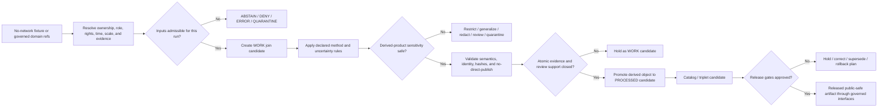

<!-- [KFM_META_BLOCK_V2]
doc_id: kfm://doc/pipelines-cross-lane-riparian-vegetation-readme
title: pipelines/cross_lane/riparian_vegetation/ — Governed Riparian-Vegetation Composition Boundary
type: readme; directory-readme; cross-lane-pipeline-boundary; sensitive-derived-product; non-publisher-guardrail
version: v0.2
status: draft; repository-grounded; direct-lane-readme-only; no-executable-implementation-established; placement-conflicted
owners:
  - OWNER_TBD — Pipeline steward
  - OWNER_TBD — Cross-lane architecture steward
  - OWNER_TBD — Hydrology steward
  - OWNER_TBD — Flora steward
  - OWNER_TBD — Habitat steward
  - OWNER_TBD — Soil steward
  - OWNER_TBD — Hazards steward
  - OWNER_TBD — Agriculture steward
  - OWNER_TBD — Fauna and geoprivacy reviewer
  - OWNER_TBD — Source and rights steward
  - OWNER_TBD — Evidence and receipt steward
  - OWNER_TBD — Policy and sensitivity steward
  - OWNER_TBD — Validation and CI steward
  - OWNER_TBD — Release steward
  - OWNER_TBD — Security reviewer
  - OWNER_TBD — Docs steward
created: 2026-06-13
updated: 2026-07-19
supersedes: v0.1
policy_label: public-doc; pipelines; cross-lane; riparian-vegetation; sensitive-derived-product; no-secrets; no-live-source-access; no-source-activation; no-direct-raw-admission; no-regulatory-delineation; no-life-safety-alerting; no-private-land-inference; no-direct-publication; source-role-preserving; observed-modeled-aggregate-separation; evidence-bound; rights-aware; geoprivacy-aware; join-risk-aware; review-gated; correction-aware; rollback-aware
current_path: pipelines/cross_lane/riparian_vegetation/README.md
owning_root: pipelines/
responsibility: define and preserve the executable boundary for future multi-domain riparian-vegetation composition without owning source truth, domain truth, object meaning, machine shape, policy, evidence, release, or public delivery
truth_posture: CONFIRMED target README, pipelines executable responsibility, cross_lane parent README, Flora-owned riparian sublane, repository-grounded vegetation-stress compatibility boundary, ecology cross-domain doctrine, Flora canonical-path register, pipeline_specs root maturity boundary, tests/pipelines maturity boundary, checked absence of lane-local contract/runner/spec/test README, bounded search that surfaced no riparian executable or dedicated workflow, CODEOWNERS routing, and no open PR or matching branch / PROPOSED continued compatibility role for this path, accepted cross-lane ownership, one canonical candidate contract and schema, deterministic identity, source and run activation, two-stage WORK-to-PROCESSED derivation model, finite outcomes and reason codes, no-network fixtures, spec-to-consumer agreement, cross-lane receipt binding, correction propagation, and rollback / CONFLICTED pipelines/cross_lane versus pipelines/domains/flora/riparian versus biodiversity/vegetation_stress and habitat-oriented processing as potential implementation homes; WORK-first candidate posture versus ecology doctrine that derivations enter PROCESSED after atomic evidence closure; cross_lane naming and long-term canonical status / UNKNOWN exhaustive recursive inventory, accepted implementation owner, executable modules, canonical candidate object family, active pipeline spec, parser, consumer, scheduler, source activation, network behavior, fixtures, executable tests, substantive CI, emitted run receipts, production execution, monitoring, release integration, and public effects / NEEDS VERIFICATION named owners, ADR or migration record, source-role vocabulary, approved source descriptors, method and scale rules, rights and sensitivity enforcement, receipt/proof homes, branch protection, review separation, correction handling, and rollback execution
evidence_snapshot:
  repository: bartytime4life/Kansas-Frontier-Matrix
  repository_id: "1059091169"
  visibility: public
  base_ref: main
  base_commit: 5cf7386b17a85feeadbb82a0eb9ec92bded68279
  target_prior_blob: 4b1af6368df16fc1b77a49eea54014da54639b20
  parent_cross_lane_blob: cf3bb3a434cc29f0b21c64c7c2bc1faefc4e5b81
  flora_riparian_blob: 6f62dcffc51e844c6a96facb2b336812ffcfd1fc
  vegetation_stress_blob: 265dce76a9fcad0349a28b0f7f0cf792888614c2
  ecology_cross_domain_blob: d8eed34dac129fbe484a968b0649571b39ab6bc8
  flora_canonical_paths_blob: 367d40d9781387019443fbd5ca98070be543f31c
  pipeline_specs_root_blob: 7f35f1c06aaec08d03182cf71e88a812bf179ebf
  tests_pipelines_blob: 08fa70cd33af2c04f03aadbf7d973c6f4e29fbf3
  direct_lane_files_confirmed:
    - pipelines/cross_lane/riparian_vegetation/README.md
  checked_absent_paths:
    - AGENTS.md
    - pipelines/AGENTS.md
    - pipelines/cross_lane/riparian_vegetation/PIPELINE_CONTRACT.md
    - pipelines/cross_lane/riparian_vegetation/run_dry_fixture.py
    - pipelines/cross_lane/riparian_vegetation/build_candidate.py
    - pipeline_specs/cross_lane/riparian_vegetation/README.md
    - pipeline_specs/flora/riparian.yaml
    - tests/pipelines/cross_lane/riparian_vegetation/README.md
  inventory_method: GitHub connector exact file reads plus bounded repository code-index queries; absence and README-only conclusions are limited to checked paths, indexed results, and the pinned branch snapshot
related:
  - ../../README.md
  - ../README.md
  - ../../domains/flora/riparian/README.md
  - ../../biodiversity/vegetation_stress/README.md
  - ../../../docs/architecture/directory-rules.md
  - ../../../docs/architecture/ecology-cross-domain.md
  - ../../../docs/domains/flora/CANONICAL_PATHS.md
  - ../../../pipeline_specs/README.md
  - ../../../tests/pipelines/README.md
  - ../../../CONTRIBUTING.md
  - ../../../.github/CODEOWNERS
  - ../../../data/receipts/generated/README.md
  - ../../../schemas/contracts/v1/receipts/generated_receipt.schema.json
tags:
  - kfm
  - pipelines
  - cross-lane
  - riparian-vegetation
  - hydrology
  - flora
  - habitat
  - soil
  - hazards
  - agriculture
  - fauna
  - source-role
  - evidence
  - rights
  - sensitivity
  - geoprivacy
  - correction
  - rollback
notes:
  - "v0.2 replaces a design-forward candidate example and proposed file tree with a commit-pinned maturity, routing, and implementation-graduation boundary."
  - "The direct lane is README-only in bounded inspection; no executable implementation, accepted declarative spec, dedicated fixture/test lane, candidate contract/schema, or dedicated workflow is established."
  - "The repository contains multiple adjacent riparian and vegetation-condition paths. This README does not select a canonical implementation home by assertion and prohibits duplicate active implementations."
  - "A riparian-vegetation signal is a derived, reviewable composition—not stream, wetland, botanical, habitat, agricultural, regulatory, private-land, emergency, or release truth."
  - "This documentation-only revision changes no executable code, source activation, schema, contract, policy, fixture, test, workflow, lifecycle record, domain record, release object, runtime behavior, or public artifact."
[/KFM_META_BLOCK_V2] -->

<a id="top"></a>

# `pipelines/cross_lane/riparian_vegetation/` — Governed Riparian-Vegetation Composition Boundary

> **One-line purpose.** Preserve this existing path as a reviewable boundary for future evidence-bounded composition of Hydrology, Flora, Habitat, Soil, Hazards, Agriculture, Fauna, and related context—without creating a new domain, a second source of truth, a regulatory product, or a publication shortcut.

<p>
  
  
  
  
  
  
</p>

**Path:** `pipelines/cross_lane/riparian_vegetation/README.md`
**Version:** `v0.2`
**Status:** draft / repository-grounded / README-only / no executable implementation established
**Owning root:** [`pipelines/`](../../README.md) — executable pipeline logic, the **how**
**Current path role:** compatibility, routing, safety, and future implementation-graduation contract
**Public posture:** no direct public path; no source admission, wetland or buffer determination, alerting, land-management prescription, promotion, or publication
**Evidence snapshot:** `main@5cf7386b17a85feeadbb82a0eb9ec92bded68279`

> [!IMPORTANT]
> **The direct lane is documentation-only at the pinned snapshot.** Bounded repository search surfaced this README, while exact checks found no local pipeline contract, runner, candidate builder, dedicated declarative spec, dedicated test README, or accepted candidate schema. Path presence and prose do not establish an active pipeline.

> [!CAUTION]
> **Canonical implementation ownership is unresolved.** The repository also describes riparian responsibility under [`pipelines/domains/flora/riparian/`](../../domains/flora/riparian/README.md), vegetation-condition work under [`pipelines/biodiversity/vegetation_stress/`](../../biodiversity/vegetation_stress/README.md), and broader ecological composition in [`docs/architecture/ecology-cross-domain.md`](../../../docs/architecture/ecology-cross-domain.md). Do not create duplicate active runners, specs, candidate writers, schedules, receipts, or release paths.

> [!WARNING]
> Cross-lane joins can reveal rare or protected flora and fauna, sensitive habitat, private parcel or operator conditions, archaeology or cultural knowledge, regulated-land implications, infrastructure detail, or reconstructive ecological patterns. Logs, diffs, receipts, issues, screenshots, tiles, API payloads, and generated summaries must minimize detail and fail closed.

**Quick navigation:** [Status](#0-status-and-evidence-boundary) · [Purpose](#1-purpose) · [Placement](#2-placement-and-authority) · [What it is](#3-what-this-pipeline-is) · [What it is not](#4-what-this-pipeline-is-not) · [Ownership](#5-cross-lane-ownership-model) · [Inputs](#6-accepted-inputs) · [Exclusions](#7-explicit-exclusions) · [Flow](#8-operating-flow) · [Outputs](#9-allowed-outputs) · [Gates](#10-required-gates) · [Sensitivity](#11-sensitivity-and-public-safety-posture) · [Directory](#12-directory-contract) · [Candidate](#13-minimal-riparian-vegetation-candidate-record) · [Testing](#14-dry-run-and-test-posture) · [Review](#15-review-promotion-and-rollback) · [Done](#16-definition-of-done) · [Open](#17-open-questions) · [Evidence](#18-evidence-ledger) · [History](#19-change-history)

---

## 0. Status and evidence boundary

### Current determination

`pipelines/cross_lane/riparian_vegetation/` is an existing README lane inside the executable `pipelines/` responsibility root. It is **not** an established riparian-vegetation implementation.

| Surface | Inspected state | Evidence-bounded conclusion |
|---|---:|---|
| Target README | `CONFIRMED` | The v0.1 document existed; this revision updates it in place. |
| Direct lane inventory | `README ONLY` | Bounded search and exact probes surfaced no direct executable module. |
| Local pipeline contract | `NOT FOUND AT CHECKED PATH` | No lane-specific execution contract is established. |
| Local runner or candidate builder | `NOT FOUND AT CHECKED PATHS` | No fixture runner or candidate implementation is established. |
| Declarative cross-lane spec | `NOT FOUND AT CHECKED PATH` | No `pipeline_specs/cross_lane/riparian_vegetation/` contract is established. |
| Referenced Flora spec | `NOT FOUND AT CHECKED PATH` | `pipeline_specs/flora/riparian.yaml` is referenced by adjacent prose but was not present at the pinned snapshot. |
| Dedicated tests | `NOT FOUND AT CHECKED PATH` | No lane-specific test README is established. |
| Dedicated fixtures | `NOT ESTABLISHED` | Bounded search did not establish a lane-specific fixture family. |
| Parent cross-lane boundary | `DRAFT README` | Describes a working composition umbrella; canonical status and implementation remain unverified. |
| Flora riparian boundary | `DRAFT README` | Defines Flora-owned riparian processing and explicitly delegates multi-domain composition to this lane. |
| Vegetation-stress boundary | `REPOSITORY-GROUNDED DRAFT` | Records competing execution homes and no established implementation. |
| Ecology architecture | `DRAFT DOCTRINE` | Confirms ecological products are cross-domain derivations, not a new domain. |
| Canonical candidate contract/schema | `NOT ESTABLISHED` | `RiparianVegetationCandidate` and `CrossLaneJoinReceipt` surfaced as prose names, not adopted object families. |
| Dedicated workflow | `NOT ESTABLISHED` | Bounded workflow search surfaced no riparian-specific command-bearing workflow. |
| Production use | `UNKNOWN` | No runtime trace, deployment, receipt, catalog closure, release manifest, or public consumer was inspected. |

### Safe conclusions

- **CONFIRMED:** the path and its README exist.
- **CONFIRMED:** `pipelines/` owns executable behavior, while `pipeline_specs/` owns declarative intent.
- **CONFIRMED:** the Flora riparian README distinguishes Flora-owned processing from multi-domain composition.
- **CONFIRMED:** the current pipeline-spec and pipeline-test parent boundaries describe placeholder-heavy or README-only maturity.
- **PROPOSED:** this path may remain the composition boundary if an ADR, registry, owners, and implementation evidence accept it.
- **CONFLICTED:** several neighboring paths can plausibly claim parts of the implementation.
- **UNKNOWN:** complete repository inventory, runtime behavior, active source use, model behavior, public use, and current operational ownership.
- **NEEDS VERIFICATION:** every future contract, schema, spec, executable, test, fixture, receipt, policy binding, release path, and consumer.

### Truth and outcome vocabulary

| Term | Use in this README |
|---|---|
| `CONFIRMED` | Verified at the pinned repository snapshot. |
| `PROPOSED` | Desired or recommended future state, not current implementation proof. |
| `CONFLICTED` | Relevant paths or authorities compete and require an explicit decision. |
| `UNKNOWN` | Current evidence is insufficient. |
| `NEEDS VERIFICATION` | A concrete check must close before relying on the claim. |
| `ABSTAIN` | Support is insufficient or outside scope. |
| `DENY` | Policy, rights, sensitivity, ownership, or release posture blocks the operation. |
| `ERROR` | Execution could not evaluate the requested operation safely. |
| `HOLD` / `QUARANTINE` | Operational states requiring remediation or human review; they are not public answer outcomes unless adopted by a contract. |

[Back to top](#top)

---

## 1. Purpose

This lane exists to define the future **composition step** for riparian-vegetation derivations. It may eventually coordinate stable references from several bounded contexts to produce reviewable candidates about:

- potential riparian vegetation presence, absence, type, condition, stress, recovery, or uncertainty;
- stream-, wetland-, floodplain-, spring-, seep-, or corridor-adjacent plant context;
- relationships among hydrologic setting, vegetation communities, habitat condition, soils, disturbance, and land use;
- evidence gaps, source-role conflicts, scale mismatch, stale context, and join-induced sensitivity;
- catalog, triplet, steward-review, correction, and rollback handoffs.

A mature implementation must answer only what the evidence, method, scale, time, rights, and policy support. It must never convert proximity, modeled context, remote-sensing signals, or a multi-domain join into unsupported botanical, hydrologic, regulatory, private-land, or management truth.

The lane inherits the KFM lifecycle:

```text
RAW -> WORK / QUARANTINE -> PROCESSED -> CATALOG / TRIPLET -> PUBLISHED
```

Promotion is a governed state transition. A file write, pipeline return code, passing test, commit, pull request, or merge is not promotion or publication.

[Back to top](#top)

---

## 2. Placement and authority

The live [Directory Rules](../../../docs/architecture/directory-rules.md) choose paths by responsibility. This README remains under `pipelines/` because it concerns future executable behavior, not because riparian vegetation is a domain.

| Question | Determination | Status |
|---|---|---:|
| Why `pipelines/`? | The lane concerns how a governed composition might execute. | `CONFIRMED` root responsibility |
| Why `cross_lane/`? | The derivation needs multiple domain-owned facts and cannot claim one domain's truth as its own. | `PROPOSED` working segment |
| Is `cross_lane/` canonical? | No accepted ADR or registry decision was established in this review. | `CONFLICTED / NEEDS VERIFICATION` |
| Is riparian vegetation a KFM domain? | No. Atomic facts remain in Hydrology, Flora, Habitat, Soil, Hazards, Agriculture, Fauna, and other owners. | `CONFIRMED` doctrine |
| Does this replace the Flora riparian lane? | No. Flora-owned preparation belongs in the Flora lane; this path would compose governed domain outputs. | `CONFIRMED` adjacent boundary |
| Can this lane publish? | No. It may produce candidates and review handoffs only after implementation and governance gates exist. | `CONFIRMED` doctrine |
| Is a new ADR needed for this README revision? | No root, lifecycle phase, schema authority, policy authority, or release authority changes. | `NOT APPLICABLE` |
| Is an ADR or migration decision needed before executable graduation? | Yes if this path becomes canonical, displaces another implementation home, or introduces a cross-cutting object family. | `NEEDS VERIFICATION` |

### Placement conflict and routing law

The repository exposes at least three adjacent responsibilities:

| Path | Intended responsibility | Boundary |
|---|---|---|
| `pipelines/cross_lane/riparian_vegetation/` | Multi-domain composition, if accepted. | Must not own domain atoms. |
| `pipelines/domains/flora/riparian/` | Flora-owned riparian plant candidate preparation. | Must not own Hydrology/Habitat truth or general cross-lane composition. |
| `pipelines/biodiversity/vegetation_stress/` | Compatibility boundary for broader vegetation-stress derivations. | Must not become a duplicate riparian runner or release path. |

Before any executable lands, the implementation PR must name:

1. one canonical runner home;
2. one canonical spec home;
3. one candidate contract and schema family;
4. one fixture/test ownership model;
5. one receipt and observability binding;
6. one correction and rollback path;
7. one migration or compatibility treatment for competing paths.

No file in this lane may silently make that architecture decision by existing.

[Back to top](#top)

---

## 3. What this pipeline is

A future implementation may be:

- a no-network composition runner over deterministic synthetic or approved fixtures;
- an orchestrator that reads stable, already-governed domain references;
- a source-role-preserving join and method-validation boundary;
- a candidate builder that records uncertainty rather than inventing completeness;
- a quarantine and blocker emitter for missing or unsafe support;
- a producer of reviewable catalog/triplet handoffs;
- a non-publisher that emits bounded receipts and diagnostics.

It may coordinate contributing domain adapters, but shared orchestration must not absorb their semantic authority.

### Minimum future executable contract

Before this lane can be called implemented, an accepted contract must define:

| Concern | Required decision |
|---|---|
| Entry point | Exact module, CLI, callable, arguments, and exit behavior. |
| Spec binding | Exact declarative spec ID/version/hash and parser. |
| Inputs | Accepted lifecycle phases, source refs, domain refs, schemas, and content hashes. |
| Source roles | Allowed role per input and rules preventing silent promotion. |
| Method | Method family, version, parameters, baseline, scale, temporal support, and limitations. |
| Candidate identity | Deterministic ID inputs, canonicalization, digest, and idempotency. |
| Outcomes | Finite machine outcomes, stable reason codes, and operational hold/quarantine states. |
| Side effects | Allowed read/write paths, no-network default, sandbox, and denied public/release writes. |
| Receipts | Required run, join, transform, validation, redaction, or policy references. |
| Review | Required domain, sensitivity, policy, evidence, and release reviewers. |
| Correction | Supersession, invalidation, stale-state, and downstream dependency handling. |
| Rollback | Candidate rollback and released-artifact rollback owner. |

Until that contract exists and is tested, examples in this README are documentation obligations only.

[Back to top](#top)

---

## 4. What this pipeline is not

This lane is not:

- a stream, reach, watershed, floodplain, wetland, or regulatory-boundary authority;
- a botanical taxonomy, occurrence, specimen, vegetation-community, or rare-plant truth store;
- a `HabitatPatch`, habitat-suitability, ecological-system, restoration, or corridor authority;
- a soil-moisture, hydric-soil, erosion, salinity, or substrate authority;
- an emergency flood, drought, wildfire, heat, smoke, or erosion-warning system;
- a crop-condition, crop-loss, farm-management, irrigation, parcel, operator, or land-title determination;
- evidence that a rare species, culturally sensitive plant, or protected place occurs at an exact location;
- a source connector, registry, schema, contract, policy, proof, catalog, release, API, map, or AI authority;
- permission for public display;
- a substitute for `EvidenceBundle`, review, policy, release, correction, or rollback closure.

> [!CAUTION]
> A visually plausible riparian corridor can still be a false, over-precise, stale, rights-restricted, sensitive, or regulatory-adjacent claim. The correct result may be `ABSTAIN`, `DENY`, `ERROR`, generalized output, quarantine, or human review.

[Back to top](#top)

---

## 5. Cross-lane ownership model

### Atomic ownership

| Contributing lane | Owns | This lane may eventually consume |
|---|---|---|
| Hydrology | Streams, reaches, watersheds, waterbodies, gauges, hydrologic observations, source-role-separated flood and wetland context. | Stable released or governed refs with spatial/temporal support. |
| Flora | Plant taxa, occurrences, specimens, vegetation communities, invasive plants, phenology, restoration planting, rare/cultural sensitivity. | Public-safe or restricted-review refs; never raw exact sensitive geometry by default. |
| Habitat | Habitat patches, land cover, ecological systems, suitability, condition, connectivity, restoration opportunities. | Governed context and method limitations. |
| Soil | Soil map units, components, horizons, properties, hydrologic groups, moisture observations, suitability and erosion context. | Scale-appropriate contextual refs. |
| Hazards | Hazard events and observations, regulatory/official context, exposure and resilience products. | Stressor context without converting KFM into alert authority. |
| Agriculture | Crop, field, irrigation, conservation, land-use, yield, and agricultural-economy observations. | Generalized context; private operation and parcel inference fail closed. |
| Fauna | Taxa, occurrences, ranges, sensitive sites, habitat relations. | Only public-safe or authorized restricted-review refs. |
| Atmosphere | Weather, climate, smoke, drought, heat, and atmospheric observations/models. | Explicitly labeled observed, modeled, or aggregate context. |
| Spatial foundation | CRS, geography versions, geometry fingerprints, scale support, generalization transforms. | Shared spatial grammar and transform refs. |
| Evidence / Policy / Release | Evidence bundles, decisions, review, release, correction, rollback. | Governing support and handoff; never bypassed. |

### Join rule

Every contributing reference must retain:

- owning domain;
- object family and version;
- source identity and source role;
- lifecycle and release state;
- spatial support and precision;
- valid, observed, source, retrieval, processing, and release time where material;
- rights, sensitivity, and access posture;
- evidence and review references;
- transform, generalization, redaction, or aggregation state;
- correction and supersession state.

A join does not erase any of those obligations.

[Back to top](#top)

---

## 6. Accepted inputs

Inputs remain **PROPOSED** until a contract, schema, accepted spec, and implementation establish them.

| Input class | Future allowed form | Required gate |
|---|---|---|
| No-network fixture | Synthetic, generalized, rights-safe fixture. | Default first implementation; no real sensitive coordinates or private records. |
| Source descriptor ref | Stable admitted source identifier. | Role, rights, sensitivity, cadence, citation, and activation state resolved. |
| Domain object ref | Stable object/version/digest from an owning lane. | Contract and schema version resolved; lifecycle state allowed. |
| Processed domain artifact | Immutable or reproducible processed record set. | Validation and evidence support closed for the atomic facts used. |
| Public-safe derived layer | Released or review-authorized generalized artifact. | Release, correction, and rollback refs preserved. |
| Policy or sensitivity decision ref | Immutable decision identifier. | Applicable scope, bundle version, reason codes, and reviewer state resolved. |
| Evidence ref | `EvidenceRef` resolving to `EvidenceBundle` when claims depend on evidence. | Unresolved support yields `ABSTAIN` or hold. |
| Prior candidate or release | Immutable prior identity and digest. | Used only for comparison, correction, supersession, or rollback. |

### Denied input behavior

The runner must not silently proceed when an input has:

- unknown or incompatible source role;
- absent or unresolved rights;
- unsupported spatial scale or geometry precision;
- incompatible valid-time or observation-time support;
- stale, withdrawn, superseded, or corrected state without explicit handling;
- exact sensitive geometry not authorized for the run;
- missing evidence or review requirements;
- unverified model output presented as observation;
- direct RAW, uncontrolled WORK, or QUARANTINE material outside an explicit remediation test.

[Back to top](#top)

---

## 7. Explicit exclusions

| Does not belong here | Correct owner |
|---|---|
| Source fetching, API clients, credentials, retry/backoff for external systems | `connectors/` or accepted source-access package |
| Source admission and source roles | `data/registry/`, control plane, contracts, and policy |
| Hydrology, Flora, Habitat, Soil, Hazards, Agriculture, Fauna, or Atmosphere object meaning | Each domain's `contracts/` and docs lanes |
| Candidate or receipt machine shape | Canonical `schemas/contracts/v1/` family after placement decision |
| Allow, deny, restrict, generalize, redact, or release rules | `policy/` |
| Declarative schedules, profiles, source bindings, and run scope | `pipeline_specs/` |
| Fixtures | `fixtures/` or verified package/domain fixture lane |
| Executable behavior tests | `tests/pipelines/`, domain-local tests, or package-local tests after placement decision |
| Lifecycle records and derived artifacts | Correct phase under `data/` |
| Receipts and proofs | `data/receipts/` and `data/proofs/` |
| Release decisions, manifests, corrections, withdrawals, rollback cards | `release/` |
| Public API, map, UI, exports, or AI response logic | Governed application/runtime roots |
| Regulatory, engineering, emergency, legal, title, or farm-management determinations | Outside this pipeline's authority |

Generated or candidate outputs must never be stored beside this README or future executable code.

[Back to top](#top)

---

## 8. Operating flow

### Proposed two-stage derivation model

The current v0.1 README uses a WORK-candidate-first posture, while [`ecology-cross-domain.md`](../../../docs/architecture/ecology-cross-domain.md) says ecological derivations enter PROCESSED after contributing atomic facts close evidence. These can be reconciled only as a **PROPOSED two-stage model**:

1. exploratory join attempts and blockers remain in WORK or QUARANTINE;
2. a validated, evidence-supported derived object may enter PROCESSED;
3. catalog/triplet and public release remain separate governed transitions.

This README does not ratify that model. The executable contract and lifecycle steward must accept or amend it before implementation.



### No automatic truth upgrade

At no point may the flow automatically convert:

```text
proximity -> occurrence
spectral signal -> taxon
land-cover class -> vegetation community
floodplain context -> observed flood
soil context -> plant condition
modeled suitability -> observed habitat
candidate -> processed truth
processed -> public
catalog entry -> release
pipeline success -> approval
merge -> KFM publication
```

[Back to top](#top)

---

## 9. Allowed outputs

No output family below is confirmed as an adopted object type. Names are retained from v0.1 as **PROPOSED documentation vocabulary** pending contract/schema/ADR review.

| Proposed output | Purpose | Authority boundary |
|---|---|---|
| `RiparianVegetationCandidate` | Records a bounded derived hypothesis, method, scope, uncertainty, and blockers. | Not domain truth, evidence, policy, or release. |
| `CrossLaneJoinReceipt` | Records contributing refs, roles, joins, parameters, transforms, hashes, and outputs. | Process memory, not proof or approval. |
| `ValidationReport` ref | Records declared schema and semantic checks. | Scoped test evidence only. |
| `PolicyDecision` ref | Carries applicable finite decision and obligations. | Decision is owned by policy, not the pipeline. |
| Quarantine or blocker record | Records why the attempt cannot proceed. | Must avoid sensitive payload leakage. |
| Triplet/graph candidate | Represents evidence-linked relationships. | Projection, not canonical truth. |
| Catalog candidate | Supports discovery and provenance after gates. | Not public until release-approved. |
| Release-candidate handoff | Gives release stewards immutable refs and blockers. | Not a release decision. |
| Correction or supersession candidate | Identifies stale or invalidated dependencies. | Requires owning-domain and release review. |

### Output-home rule

Exact output paths remain `NEEDS VERIFICATION`. A future implementation must resolve homes against current Directory Rules, accepted ADRs, contracts, schemas, lifecycle policy, and existing inventory before writing any artifact.

[Back to top](#top)

---

## 10. Required gates

A future run must implement or defer to these gates with explicit outcomes:

1. **Identity gate** — stable run, spec, method, source, input, candidate, and output identities.
2. **Ownership gate** — every atomic fact remains owned by its bounded context.
3. **Source-role gate** — context, modeled, aggregate, regulatory, administrative, candidate, and observed material cannot be silently upgraded.
4. **Admission gate** — source and object refs resolve to accepted versions and lifecycle states.
5. **Rights gate** — access, reuse, redistribution, attribution, and derivative permissions are resolved.
6. **Spatial-support gate** — CRS, geography version, scale, resolution, geometry precision, buffer logic, and adjacency semantics are declared.
7. **Temporal-support gate** — valid, observed, source, retrieval, processing, release, and correction times remain distinct where material.
8. **Method gate** — method family, version, baseline, parameters, thresholds, uncertainty, and limitations are pinned.
9. **Evidence gate** — consequential claims resolve evidence or abstain.
10. **Join-risk gate** — the derived product is evaluated for sensitivity not present in any one input.
11. **Rare/cultural ecology gate** — protected taxa, sacred/cultural knowledge, and reconstructive location risk fail closed.
12. **Private-land gate** — parcel, operator, crop, restoration, or land-management inference is denied unless explicitly authorized and minimized.
13. **Regulatory-adjacency gate** — no wetland, buffer, floodplain, permitting, title, compliance, or engineering determination.
14. **Emergency-authority gate** — no alert, warning, evacuation, fire, drought, flood, or operational instruction.
15. **Validation gate** — declared contract, schema, semantic, negative, determinism, and side-effect checks pass.
16. **Receipt gate** — reproducible input, method, decision, output, and hash refs are recorded.
17. **No-direct-publish gate** — no writes to public UI/API, release decisions, aliases, or `data/published/`.
18. **Correction gate** — stale, withdrawn, superseded, or corrected inputs propagate to dependent candidates.
19. **Rollback gate** — candidate invalidation and released-artifact rollback owners are known.
20. **Review-separation gate** — generation, domain review, sensitivity/policy review, and release approval remain distinct where material.

A skipped required gate is not a pass.

[Back to top](#top)

---

## 11. Sensitivity and public-safety posture

### Derived-product risk

The sensitivity of a composition is not the maximum label copied mechanically from one input. A join can create a new disclosure:

- a generalized rare-plant record plus a precise stream segment may reconstruct an exact location;
- vegetation condition plus parcel boundaries may imply private operational or land-management facts;
- habitat plus hydrology plus fauna may reveal sensitive breeding, roosting, nesting, or migration areas;
- cultural plant-use context plus geography may expose protected or sacred knowledge;
- stream proximity and regulatory layers may be mistaken for jurisdictional wetland or buffer determinations;
- stress or recovery maps may be mistaken for official hazard, restoration, or compliance status.

### Default posture

- deny public exact sensitive geometry;
- use the minimum fields and spatial precision required for the declared purpose;
- prefer synthetic/no-network fixtures for development and CI;
- prohibit real restricted records in examples, issues, logs, diffs, screenshots, or receipts;
- require output-level sensitivity review after joins;
- record generalization, redaction, aggregation, delay, or withholding transforms;
- preserve CARE, sovereignty, steward, and source-term obligations where applicable;
- use `ABSTAIN`, `DENY`, `ERROR`, quarantine, or restricted review when support or authority is incomplete;
- never encode a redaction reversal recipe in public documentation or artifacts.

### Security posture

A future runner must:

- deny credentials and secrets in specs, fixtures, logs, receipts, and command lines;
- default to no network;
- isolate filesystem writes to an approved temporary or lifecycle candidate root;
- reject path traversal and symlink escapes;
- cap input size, feature count, geometry complexity, memory, and runtime;
- avoid logging exact protected geometry or private identifiers;
- pin dependency and method versions;
- produce deterministic diagnostics safe for review.

[Back to top](#top)

---

## 12. Directory contract

### Current lane

```text
pipelines/cross_lane/riparian_vegetation/
└── README.md
```

That is the only direct lane file confirmed by bounded inspection.

### Future file admission

Do **not** create the v0.1 proposed tree mechanically. Each future file must pass a placement and ownership review.

| Proposed responsibility | Candidate home | Admission requirement |
|---|---|---|
| Lane execution contract | This lane or accepted semantic-contract root | Avoid duplicating domain or pipeline-root contracts. |
| Shared runner | One accepted `pipelines/` or package home | Canonical owner and command surface decided. |
| Domain adapter | Owning domain pipeline lane | Thin adapter; no duplicated composition runner. |
| Declarative spec | One accepted `pipeline_specs/` lane | Schema, parser, consumer, source binding, fixtures, and tests established. |
| Candidate semantic contract | `contracts/` family selected by ADR/placement review | Object family and invariants accepted. |
| Candidate machine schema | `schemas/contracts/v1/` paired with contract | No parallel schema home. |
| Policy | `policy/` | Rights, sensitivity, spatial precision, review, and release rules. |
| Fixtures | Verified `fixtures/` lane | Synthetic and sensitivity-safe. |
| Tests | Verified root, domain, or package test lane | Positive, negative, deterministic, no-network, no-publish coverage. |
| Receipt instances | `data/receipts/` | Schema-valid, minimal, no sensitive payloads. |
| Proofs | `data/proofs/` | Separate from receipts and release. |
| Lifecycle outputs | Correct `data/<phase>/` path | Governed state transitions only. |
| Release objects | `release/` | Independent release authority. |

### Migration rule

If `cross_lane/` is rejected or renamed:

1. record the conflict in the drift register;
2. accept an ADR or migration record naming the replacement;
3. preserve history with an explicit move;
4. update specs, tests, consumers, receipts, links, CODEOWNERS, and release dependencies;
5. provide compatibility or deprecation treatment where needed;
6. prove rollback;
7. do not run duplicate active implementations during migration.

[Back to top](#top)

---

## 13. Minimal riparian vegetation candidate record

There is no verified `RiparianVegetationCandidate` contract or schema. This section therefore defines **semantic obligations**, not YAML, JSON, a DTO, an enum, or an adopted machine shape.

A future candidate must preserve at least:

| Obligation | Required meaning |
|---|---|
| Candidate identity | Deterministic ID, version, digest, and supersession lineage. |
| Run identity | Runner, spec, method, code revision, environment, and receipt refs. |
| Scope | Purpose, spatial support, temporal support, geography version, and intended audience. |
| Atomic inputs | Owning domain, object/version/digest, source, source role, lifecycle/release state, and evidence ref. |
| Method | Family, version, parameters, baseline, thresholds, assumptions, uncertainty, and fitness limits. |
| Knowledge character | Candidate/derived status and explicit observed, modeled, aggregate, regulatory, administrative, or synthetic contributors. |
| Result | Bounded signal or classification plus uncertainty; never implicit fact. |
| Evidence | Resolvable support or explicit `ABSTAIN`. |
| Rights and sensitivity | Applicable decisions, obligations, transforms, and withheld fields. |
| Validation | Contract/schema/semantic/determinism/negative/side-effect results. |
| Review | Required domain, sensitivity, policy, evidence, and release reviewers. |
| Outputs | Immutable refs and hashes; no embedded release authority. |
| Correction | Input dependency graph, stale-state rule, supersession, and correction refs. |
| Rollback | Candidate invalidation target and released-product rollback owner. |

### Candidate invariants

- No atomic object is re-owned by the candidate.
- Every consequential derived assertion is evidence-supported or abstained.
- Uncertainty is explicit and cannot be omitted for presentation.
- Geometry precision is no greater than the least permissive applicable source/policy decision.
- A candidate cannot imply wetland, buffer, jurisdictional, compliance, title, emergency, or management status.
- A candidate cannot become public without release, correction, and rollback closure.
- A schema-valid candidate is not automatically semantically correct, policy-allowed, evidence-supported, reviewed, or released.

[Back to top](#top)

---

## 14. Dry-run and test posture

### Current repository maturity

- The [`pipeline_specs/`](../../../pipeline_specs/README.md) root is placeholder-heavy and does not establish an active spec system.
- The [`tests/pipelines/`](../../../tests/pipelines/README.md) direct lane is documented as README-only with no dedicated executable suite established.
- This riparian lane has no verified dedicated spec, fixture README, test README, runner, or workflow.
- Existing general workflows do not establish riparian-vegetation behavior.

### First executable slice

The first implementation should be fixture-only, no-network, and non-publishing. It should prove:

- accepted synthetic inputs parse and bind to stable domain/source roles;
- the runner refuses RAW, uncontrolled WORK, QUARANTINE, stale, withdrawn, and unsupported inputs;
- missing ownership, rights, evidence, scale support, or method support produces a finite negative result;
- remote-sensing or proximity signals cannot become taxon occurrences or regulatory determinations;
- join-induced sensitive geometry is generalized, restricted, or denied;
- private parcel/operator inference is denied;
- repeated identical runs produce identical candidate IDs and hashes;
- changed parameters or inputs change identity deterministically;
- receipts cover inputs, method, outputs, decisions, and hashes;
- no network, public API, release, or `data/published/` writes occur;
- correction and supersession invalidate dependent candidates;
- failure, cancellation, retry, no-op, partial write, and rollback behavior are deterministic.

### Proposed test families

These are behavior families, not verified paths:

| Family | Minimum cases |
|---|---|
| Contract/schema | Valid candidate plus invalid missing identity, role, scope, method, evidence, and sensitivity cases. |
| Ownership | Each domain ref preserved; no atom copied into cross-lane authority. |
| Source role | Context/model/aggregate cannot become observation. |
| Scale | Resolution mismatch, buffer misuse, and false precision abstain or deny. |
| Time | Stale, incompatible valid-time, and corrected input handling. |
| Evidence | Resolved support passes; missing/conflicted support abstains. |
| Rights/sensitivity | Unknown rights, rare/cultural joins, private-land inference, and exact geometry fail closed. |
| Determinism | Canonicalization, hashing, replay, idempotency, and no-op. |
| Side effects | No network; sandboxed writes; no public/release path. |
| Correction/rollback | Supersede, withdraw, invalidate, and rebuild dependencies. |
| Security | Path traversal, oversized geometry, malformed payload, secret/log leakage. |

No CI badge or “implemented” status is justified until the accepted suite runs and current workflow evidence is observed.

[Back to top](#top)

---

## 15. Review, promotion, and rollback

### Review burden

A future candidate may require:

- Hydrology review for hydrography, stream, water, floodplain, and wetland context;
- Flora review for taxa, occurrences, vegetation communities, invasive plants, phenology, and rare/cultural sensitivity;
- Habitat review for habitat condition, suitability, connectivity, and restoration context;
- Soil, Hazards, Agriculture, Fauna, Atmosphere, Spatial, or other domain review when their atoms are material;
- source/rights review;
- evidence and method review;
- sensitivity/geoprivacy review;
- policy review;
- release review distinct from generation where consequence warrants it.

No README placeholder is an executable reviewer identity. Confirm actual GitHub users, teams, and stewardship assignments before encoding review automation.

### Promotion chain

```text
admitted atomic refs
  -> reproducible WORK join attempt
  -> validation / blockers / receipt
  -> evidence-supported PROCESSED derived candidate
  -> catalog / triplet candidate
  -> policy and steward review
  -> release candidate
  -> ReleaseManifest + correction path + rollback target
  -> governed public-safe artifact
```

Each arrow is conditional. Nothing here is automatic.

### Correction and supersession

A mature implementation must maintain a dependency graph from the derived candidate to every input version and decision. When an input is corrected, withdrawn, superseded, reclassified, rights-restricted, or made more sensitive, the system must:

1. identify affected candidates and releases;
2. mark them stale, held, denied, withdrawn, or under review;
3. prevent new public use where required;
4. emit correction or supersession candidates;
5. rebuild only from accepted inputs;
6. preserve prior receipts and review history;
7. expose correction state through governed public surfaces when material.

### Rollback

- Local candidate rollback invalidates or supersedes the candidate without deleting process history.
- Pipeline/spec rollback restores the prior accepted implementation and disables incompatible schedules or consumers.
- Released-artifact rollback belongs to `release/`, not this lane.
- Rollback must not restore a known sensitive disclosure, rights violation, false regulatory implication, or unsupported claim.
- Reverting this README restores v0.1 prose only; it does not alter runtime or published state because none is established by this documentation change.

[Back to top](#top)

---

## 16. Definition of done

### This README revision

| Criterion | Status |
|---|---:|
| Stable document ID and existing path preserved | `PASS` |
| Current repository evidence separated from proposals and unknowns | `PASS` |
| Cross-lane versus Flora-riparian versus vegetation-stress responsibilities surfaced | `PASS` |
| v0.1 lifecycle, ownership, evidence, sensitivity, no-publish, correction, and rollback substance preserved | `PASS` |
| Proposed file tree reclassified as admission-controlled future work | `PASS` |
| Pseudo-machine candidate example replaced with semantic obligations | `PASS` |
| Current spec/test/runner/workflow maturity disclosed | `PASS` |
| No executable, spec, schema, policy, fixture, test, workflow, lifecycle, release, or public behavior changed | `PASS` |
| Human review completed | `PENDING` |

### Future executable graduation

This lane is not implementation-complete until all applicable items are verified:

- accepted canonical implementation home and owners;
- accepted candidate and receipt semantics;
- canonical schemas and deterministic valid/invalid fixtures;
- accepted spec schema, parser, consumer, and source binding;
- fixture-only no-network runner;
- stable identity, hashing, replay, and idempotency;
- domain-ownership and source-role anti-collapse tests;
- method, scale, time, uncertainty, and baseline tests;
- rights, sensitivity, geoprivacy, private-land, and regulatory-adjacency tests;
- evidence and policy resolution;
- side-effect and no-direct-publish tests;
- schema-valid receipts and reviewable diagnostics;
- substantive CI with stable check names and explicit permissions;
- correction, supersession, withdrawal, and rollback tests;
- release handoff and public consumer tests;
- runtime traces or emitted artifacts proving the declared behavior;
- steward approval and documentation updates.

[Back to top](#top)

---

## 17. Open questions

| ID | Question | Status |
|---|---|---|
| `RIP-VEG-001` | Is `pipelines/cross_lane/` accepted as the canonical executable segment, a compatibility segment, or a migration source? | `CONFLICTED / NEEDS VERIFICATION` |
| `RIP-VEG-002` | Which steward owns the composition runner while domain stewards retain atomic truth? | `NEEDS VERIFICATION` |
| `RIP-VEG-003` | Should `RiparianVegetationCandidate` become a cross-cutting object family, a domain-owned derivative, or remain documentation vocabulary? | `PROPOSED / ADR-CLASS` |
| `RIP-VEG-004` | Is `CrossLaneJoinReceipt` a distinct receipt type or an application of an existing run/transform receipt? | `NEEDS VERIFICATION` |
| `RIP-VEG-005` | What is the accepted two-stage WORK-to-PROCESSED derivation contract? | `CONFLICTED / NEEDS VERIFICATION` |
| `RIP-VEG-006` | What exact spec home, schema, parser, consumer, and activation model govern this lane? | `UNKNOWN` |
| `RIP-VEG-007` | Which no-network source descriptors and synthetic fixtures are approved for the first slice? | `NEEDS VERIFICATION` |
| `RIP-VEG-008` | Which methods and baselines are admissible for presence, condition, stress, recovery, and uncertainty? | `NEEDS VERIFICATION` |
| `RIP-VEG-009` | Which spatial-support, adjacency, corridor, and buffer rules prevent false precision and regulatory implication? | `NEEDS VERIFICATION` |
| `RIP-VEG-010` | Which temporal-support and stale-state rules apply across asynchronously updated domain inputs? | `NEEDS VERIFICATION` |
| `RIP-VEG-011` | Which public-safe generalization, aggregation, delay, and redaction profiles apply after join-induced risk review? | `NEEDS VERIFICATION` |
| `RIP-VEG-012` | Which policy decision vocabulary and reason codes are canonical for pipeline evaluation versus operational hold/quarantine states? | `NEEDS VERIFICATION` |
| `RIP-VEG-013` | Where do tests live when shared orchestration and domain adapters are split? | `CONFLICTED / NEEDS VERIFICATION` |
| `RIP-VEG-014` | Which CI check is substantive, stable, and promotion-blocking for this lane? | `UNKNOWN` |
| `RIP-VEG-015` | Which receipts, proofs, catalog records, correction consumers, and release objects close the public path? | `UNKNOWN` |
| `RIP-VEG-016` | How are downstream candidates and releases invalidated when an atomic input changes rights, sensitivity, identity, or evidence state? | `NEEDS VERIFICATION` |
| `RIP-VEG-017` | What monitoring, drift, performance, and failure budgets govern production use? | `UNKNOWN` |
| `RIP-VEG-018` | Which branch-protection and independent-review rules apply to future executable or release-affecting changes? | `NEEDS VERIFICATION` |

[Back to top](#top)

---

## 18. Evidence ledger

| Evidence | What it supports | What it does not prove |
|---|---|---|
| This README at the pinned base | Existing path, v0.1 content, proposed vocabulary, and prior obligations. | Executable behavior or canonical placement. |
| [`pipelines/cross_lane/README.md`](../README.md) | Working cross-lane umbrella and ownership-preserving intent. | Accepted canonical segment or runtime implementation. |
| [`pipelines/domains/flora/riparian/README.md`](../../domains/flora/riparian/README.md) | Flora-owned versus cross-lane boundary. | Flora runner, spec, tests, or source activation. |
| [`pipelines/biodiversity/vegetation_stress/README.md`](../../biodiversity/vegetation_stress/README.md) | Repository-grounded neighboring placement conflict and sensitive-derived-product controls. | Riparian implementation. |
| [`docs/architecture/ecology-cross-domain.md`](../../../docs/architecture/ecology-cross-domain.md) | Ecology is cross-domain composition; atoms remain domain-owned; derived-product sensitivity. | Current executable path or accepted lifecycle implementation. |
| [`docs/domains/flora/CANONICAL_PATHS.md`](../../../docs/domains/flora/CANONICAL_PATHS.md) | Domain Placement Law and Flora object-family/path doctrine. | Current complete repository topology. |
| [`pipeline_specs/README.md`](../../../pipeline_specs/README.md) | Spec root responsibility and placeholder-heavy current maturity. | An active riparian spec. |
| [`tests/pipelines/README.md`](../../../tests/pipelines/README.md) | Pipeline test responsibility and absence of an established dedicated direct suite at its snapshot. | Complete test inventory or current pass rate. |
| Exact path probes and bounded code search | Checked absence of named local contract/runner/spec/test paths and no indexed riparian executable. | Permanent or exhaustive absence across history, branches, generated files, or external systems. |
| [`CONTRIBUTING.md`](../../../CONTRIBUTING.md) and [CODEOWNERS](../../../.github/CODEOWNERS) | Contribution discipline and review routing. | Steward assignment, branch-protection enforcement, or review completion. |

No external web research was required. This revision describes repository responsibility and KFM doctrine, not current ecological facts, source terms, or operational environmental conditions.

[Back to top](#top)

---

## 19. Change history

### v0.2 — 2026-07-19

- preserved the stable document ID and existing repository path;
- pinned current-state claims to a repository commit and blob inventory;
- classified the direct lane as README-only and implementation-not-established;
- surfaced the competing cross-lane, Flora-riparian, vegetation-stress, and ecology architecture responsibilities;
- replaced proposal-as-fact directory and test trees with file-admission and graduation rules;
- replaced the illustrative pseudo-schema with semantic candidate obligations;
- added a proposed two-stage WORK-to-PROCESSED derivation model while preserving the lifecycle conflict as unresolved;
- expanded anti-collapse, source-role, method, scale, time, rights, sensitivity, security, correction, and rollback controls;
- added current test/spec/CI maturity, evidence ledger, definition of done, and open verification register;
- made no executable, policy, schema, contract, fixture, workflow, lifecycle, release, or public-surface change.

### v0.1 — 2026-06-13

Initial design-forward README defining a cross-lane riparian-vegetation candidate pipeline, ownership model, inputs, outputs, gates, sensitivity posture, proposed file/test trees, illustrative candidate record, dry-run posture, review chain, and open questions.

[Back to top](#top)
