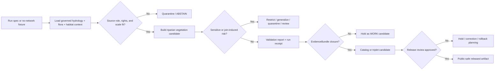

<!-- [KFM_META_BLOCK_V2]
doc_id: kfm://doc/pipelines-cross-lane-riparian-vegetation-readme
title: Cross-Lane Riparian Vegetation Pipeline README
type: readme
version: v0.1
status: draft
owners:
  - <cross-lane-pipeline-owner>
  - <hydrology-domain-steward>
  - <flora-domain-steward>
  - <habitat-domain-steward>
  - <soil-domain-steward>
  - <hazards-domain-steward>
  - <agriculture-domain-steward>
  - <policy-steward>
  - <docs-steward>
created: 2026-06-13
updated: 2026-06-13
policy_label: public
path: pipelines/cross_lane/riparian_vegetation/README.md
related:
  - docs/doctrine/directory-rules.md
  - pipelines/README.md
  - pipelines/biodiversity/README.md
  - pipelines/biodiversity/vegetation_stress/README.md
  - docs/domains/hydrology/
  - docs/domains/flora/
  - docs/domains/habitat/
  - docs/domains/soil/
  - docs/domains/hazards/
  - docs/domains/agriculture/
  - pipeline_specs/
  - data/work/
  - data/quarantine/
  - data/processed/
  - data/catalog/
  - data/triplets/
  - data/receipts/pipeline/
  - data/proofs/evidence_bundle/
  - release/candidates/
tags:
  - kfm
  - pipelines
  - cross-lane
  - riparian-vegetation
  - hydrology
  - flora
  - habitat
  - soil
  - hazards
  - evidence
  - policy
  - governance
notes:
  - "This README governs the requested cross-lane riparian vegetation pipeline path. It does not establish cross_lane as a new canonical domain root."
  - "Riparian vegetation candidates compose Hydrology, Flora, Habitat, Soil, Hazards, and Agriculture evidence without owning those lanes' truth."
  - "Executable behavior, source activation, schema contracts, schedules, CI coverage, release wiring, and public map/API behavior remain NEEDS VERIFICATION until implemented and tested."
[/KFM_META_BLOCK_V2] -->

<a id="top"></a>

# 🌾 Cross-Lane — Riparian Vegetation Pipeline

> Pipeline lane for evidence-bound, policy-aware **riparian vegetation candidates** that compose Hydrology, Flora, Habitat, Soil, Hazards, and Agriculture context without becoming a new truth store or publication shortcut.


**Status:** Draft  
**Path:** `pipelines/cross_lane/riparian_vegetation/README.md`  
**Responsibility root:** `pipelines/` — executable pipeline logic  
**Placement posture:** `PROPOSED / NEEDS VERIFICATION` because `cross_lane/` is treated here as a cross-lane pipeline segment, not as a proven canonical domain segment  
**Public posture:** no direct publication; all outputs must pass KFM lifecycle, evidence, policy, catalog, release, and rollback gates

---

## Quick jump

- [1. Purpose](#1-purpose)
- [2. Placement and authority](#2-placement-and-authority)
- [3. What this pipeline is](#3-what-this-pipeline-is)
- [4. What this pipeline is not](#4-what-this-pipeline-is-not)
- [5. Cross-lane ownership model](#5-cross-lane-ownership-model)
- [6. Accepted inputs](#6-accepted-inputs)
- [7. Explicit exclusions](#7-explicit-exclusions)
- [8. Operating flow](#8-operating-flow)
- [9. Allowed outputs](#9-allowed-outputs)
- [10. Required gates](#10-required-gates)
- [11. Sensitivity and public-safety posture](#11-sensitivity-and-public-safety-posture)
- [12. Directory contract](#12-directory-contract)
- [13. Minimal riparian vegetation candidate record](#13-minimal-riparian-vegetation-candidate-record)
- [14. Dry-run and test posture](#14-dry-run-and-test-posture)
- [15. Review, promotion, and rollback](#15-review-promotion-and-rollback)
- [16. Definition of done](#16-definition-of-done)
- [17. Open questions](#17-open-questions)

---

## 1. Purpose

`pipelines/cross_lane/riparian_vegetation/` is a bounded cross-lane execution lane for candidate riparian-vegetation analysis.

It supports reviewable answers to questions such as:

- where riparian vegetation may be present, missing, stressed, changing, or recovering;
- how riparian vegetation context relates to streams, floodplains, wetlands, soils, land cover, habitat condition, invasive plants, fire, drought, flood, or agricultural adjacency;
- which derived products need steward review before public display;
- which evidence gaps block interpretation.

This pipeline must preserve the KFM lifecycle:

```text
RAW -> WORK / QUARANTINE -> PROCESSED -> CATALOG / TRIPLET -> PUBLISHED
```

A riparian vegetation candidate is not public truth until source roles, rights, evidence, sensitivity, validation, catalog closure, release decision, and rollback path are all satisfied.

[⬆ Back to top](#top)

---

## 2. Placement and authority

| Question | Answer | Status |
|---|---|---|
| Why `pipelines/`? | The requested artifact governs executable pipeline behavior: the **how**. | CONFIRMED root responsibility |
| Why `cross_lane/`? | The slice composes multiple domains and does not belong wholly to one domain without hiding dependencies. | PROPOSED |
| Is `cross_lane/` a canonical pipeline segment? | Not proven here. Treat it as a working cross-lane segment pending Directory Rules / ADR / domain-lane registry verification. | NEEDS VERIFICATION |
| Does this create a new domain? | No. This README does not create `docs/domains/riparian_vegetation/` or a new canonical root. | CONFIRMED by this README |
| Can this lane publish? | No. It prepares candidates and receipts; release happens elsewhere. | CONFIRMED doctrine posture |

> [!IMPORTANT]
> Cross-lane means “composes owned evidence,” not “owns everything it touches.” Hydrology owns waterbody and stream-network truth; Flora owns plant truth; Habitat owns habitat truth; Soil, Hazards, Agriculture, Fauna, Roads, Settlements, and release policy keep their own truth.

[⬆ Back to top](#top)

---

## 3. What this pipeline is

This pipeline is a candidate-producing execution lane for riparian vegetation products.

It may:

- read approved fixtures or governed lifecycle inputs;
- combine hydrologic context with flora, habitat, soil, hazard, and agricultural context;
- classify candidate riparian vegetation presence, absence, condition, stress, recovery, or uncertainty;
- create cross-lane relationship candidates or triplet deltas;
- emit run receipts and validation reports;
- route sensitive or unresolved records to quarantine;
- prepare catalog candidates only after evidence and validation gates are met;
- support later public-safe released products after steward review.

The pipeline is expected to be conservative: when support is weak, the correct output is `ABSTAIN`, `DENY`, `ERROR`, quarantine, or reviewer handoff — not a polished map layer.

[⬆ Back to top](#top)

---

## 4. What this pipeline is not

This pipeline is **not**:

- a hydrologic boundary authority;
- a wetland delineation authority;
- a regulatory buffer determination;
- a vegetation-community truth store;
- a rare-plant exposure surface;
- a crop-loss or land-management determination;
- an emergency flood, fire, drought, or erosion warning system;
- a public API or map layer source;
- a replacement for EvidenceBundle resolution;
- a release decision; or
- a place to store source descriptors, schemas, policy, fixtures, test outputs, proofs, catalog records, or published artifacts.

> [!CAUTION]
> Riparian vegetation outputs may look like neutral environmental context, but they can imply regulated land, sensitive habitat, vulnerable species, private-property conditions, or restoration status. Treat derived products as claim-bearing until policy proves otherwise.

[⬆ Back to top](#top)

---

## 5. Cross-lane ownership model

| Lane | Owns | This pipeline may do |
|---|---|---|
| Hydrology | Streams, watersheds, floodplain/wetland context, observations, hydrography source roles. | Use governed hydrologic context; never become hydrology truth. |
| Flora | Plant taxa, vegetation communities, rare plants, invasive plants, phenology, restoration planting context. | Use governed flora context; never expose sensitive flora geometry. |
| Habitat | Habitat patches, land-cover context, suitability/condition surfaces. | Compose habitat context for candidate interpretation. |
| Soil | Soil units, hydric/substrate context, erosion/salinity/soil-water context. | Use as contextual evidence with scale and source-role limits. |
| Hazards | Flood, drought, fire, heat, smoke, storm, erosion, disturbance context. | Use as stressor context; never become emergency authority. |
| Agriculture | Crop, field, irrigation, land-use, restoration adjacency context. | Use carefully; never infer private operation or crop-loss claims without review. |
| Fauna | Species/habitat interactions and sensitive occurrence context. | Use only through public-safe or restricted-reviewed joins. |
| Release / Policy | Promotion, rights, public safety, rollback, correction. | Obey; never bypass. |

[⬆ Back to top](#top)

---

## 6. Accepted inputs

Accepted inputs must come from governed KFM lifecycle or fixture locations.

| Input class | Allowed source | Required condition |
|---|---|---|
| No-network fixture | `fixtures/...` | Safe default for tests and dry runs. |
| Source descriptor / registry pointer | `docs/sources/...` or `data/registry/sources/...` | Source role, rights, cadence, sensitivity, attribution declared. |
| Hydrologic context | `data/processed/hydrology/...` or governed work candidate | Validated or explicitly candidate-only. |
| Flora / vegetation context | `data/processed/flora/...` or governed work candidate | Rare/cultural sensitivity evaluated. |
| Habitat context | `data/processed/habitat/...` or governed work candidate | Land-cover and suitability limitations recorded. |
| Soil context | `data/processed/soil/...` or governed work candidate | Scale, map-unit, and interpretation limits recorded. |
| Hazards context | `data/processed/hazards/...` or governed work candidate | Not treated as emergency or regulatory truth. |
| Prior catalog / proof | `data/catalog/...`, `data/proofs/...` | Required before claim-like outputs. |
| Prior release baseline | `data/published/...` plus `release/manifests/...` | Used only with release and rollback context. |

Unknown source role, rights, sensitivity, scale fitness, or evidence support must block public interpretation.

[⬆ Back to top](#top)

---

## 7. Explicit exclusions

| Do not place here | Correct responsibility home |
|---|---|
| Source catalog profiles | `docs/sources/catalog/...` |
| Machine-readable source registry entries | `data/registry/sources/...` |
| Connector/fetcher code | `connectors/<source_id>/` |
| Domain architecture docs | `docs/domains/<domain>/...` |
| Object meaning contracts | `contracts/domains/<domain>/...` or approved cross-domain contract family |
| JSON Schemas | `schemas/contracts/v1/...` |
| Policy rules | `policy/domains/<domain>/`, `policy/sensitivity/`, `policy/rights/`, `policy/release/` |
| Golden / valid / invalid fixtures | `fixtures/...` or `tests/fixtures/...` per repo convention |
| Tests | `tests/pipelines/cross_lane/riparian_vegetation/` or approved test home |
| Lifecycle outputs | `data/raw/`, `data/work/`, `data/quarantine/`, `data/processed/`, `data/catalog/`, `data/triplets/`, `data/published/` |
| Receipts and proofs | `data/receipts/...`, `data/proofs/...` |
| Release decisions | `release/candidates/`, `release/manifests/`, `release/rollback_cards/`, `release/correction_notices/` |
| Public UI / map code | `apps/explorer-web/`, `packages/ui/`, `packages/maplibre-runtime/` |

[⬆ Back to top](#top)

---

## 8. Operating flow



This is a target contract, not proof that executable code or CI jobs already exist.

[⬆ Back to top](#top)

---

## 9. Allowed outputs

| Output | Purpose | Typical home |
|---|---|---|
| `RiparianVegetationCandidate` | Candidate record or surface summary for review. | `data/work/cross_lane/riparian_vegetation/...` or approved lifecycle home |
| `CrossLaneJoinReceipt` | Records inputs, source roles, joins, limits, and hashes. | `data/receipts/pipeline/...` |
| `ValidationReport` | Records schema, temporal, spatial, sensitivity, source-role, and evidence checks. | `data/proofs/validation_report/...` |
| `PolicyDecision` | Records `ALLOW_AT_STAGE`, `RESTRICT`, `ABSTAIN`, `DENY`, or `ERROR`. | approved policy-decision/proof home |
| `QuarantineReceipt` | Records why a candidate cannot proceed. | `data/quarantine/cross_lane/riparian_vegetation/...` or approved home |
| `TripletDeltaCandidate` | Candidate relationships such as stream segment ↔ vegetation community ↔ habitat context. | `data/triplets/graph_deltas/...` |
| `CatalogCandidate` | Catalog-ready package after evidence closure. | `data/catalog/...` |
| `ReleaseCandidateNote` | Handoff to release review. | `release/candidates/...` only through release workflow |

[⬆ Back to top](#top)

---

## 10. Required gates

Every riparian vegetation run must check or explicitly fail closed on:

1. **Cross-lane ownership gate** — every input retains its owning domain and source role.
2. **Source descriptor gate** — no input without stable source identity.
3. **Rights gate** — unclear or restrictive terms block public release.
4. **Scale and fitness gate** — hydrology, land cover, soil, and vegetation data are not overinterpreted beyond source resolution and purpose.
5. **Temporal gate** — observation, retrieval, processing, valid, and release times remain distinct.
6. **Spatial gate** — buffer distances, adjacency, CRS, geometry precision, and public-safe generalization are recorded.
7. **Evidence gate** — claim-bearing outputs require EvidenceBundle closure or abstain.
8. **Sensitivity gate** — rare species, culturally sensitive plants, precise habitat, private land, and join-induced exposure fail closed.
9. **Policy gate** — policy produces finite outcomes; no silent allow.
10. **Validation gate** — candidate shape and semantic constraints are checked.
11. **No-direct-publish gate** — no writes to public UI, public API, or `data/published/`.
12. **Catalog/release gate** — catalog and release happen only through the appropriate lifecycle and release paths.
13. **Rollback-readiness gate** — public release requires rollback target and correction path.

[⬆ Back to top](#top)

---

## 11. Sensitivity and public-safety posture

Riparian vegetation products can create sensitive derived risks.

Examples:

- exact rare-plant or sensitive habitat exposure near streams;
- culturally sensitive plant-use or sacred-land associations;
- private-property condition inference from riparian stress or absence;
- regulatory misinterpretation of buffers, wetlands, or stream corridors;
- wildlife habitat exposure through vegetation and hydrology joins;
- flood, drought, or fire context misread as an official warning;
- restoration or land-management status inferred without steward review.

Default posture:

- public exact sensitive geometry is denied;
- derived products are reviewed at the output level, not only source level;
- uncertain source rights or source roles produce `ABSTAIN`, `DENY`, or quarantine;
- map tiles and API payloads must be generalized, redacted, delayed, or withheld where needed;
- public outputs must state limits and evidence basis.

[⬆ Back to top](#top)

---

## 12. Directory contract

Recommended shape:

```text
pipelines/cross_lane/riparian_vegetation/
├── README.md                         # this file
├── PIPELINE_CONTRACT.md              # PROPOSED: local execution contract
├── run_dry_fixture.py                # PROPOSED if repo Python convention is accepted
├── build_candidate.py                # PROPOSED lane-specific candidate builder
├── validate_join_context.py          # PROPOSED lane-specific join validator wrapper
├── emit_cross_lane_receipt.py        # PROPOSED only if not shared in tools/
└── adapters/                         # PROPOSED: thin adapters, no source fetching
```

Declarative specs should prefer a spec home, not this README:

```text
pipeline_specs/cross_lane/riparian_vegetation/
└── dry_run.yaml                      # PROPOSED / NEEDS VERIFICATION
```

Recommended tests:

```text
tests/pipelines/cross_lane/riparian_vegetation/
├── test_no_network_dry_run.py        # PROPOSED
├── test_cross_lane_roles_required.py # PROPOSED
├── test_missing_evidence_abstains.py # PROPOSED
├── test_sensitive_geometry_denied.py # PROPOSED
├── test_scale_mismatch_abstains.py   # PROPOSED
├── test_receipt_hashes.py            # PROPOSED
└── test_no_direct_publish.py         # PROPOSED
```

If `cross_lane/` is later rejected as a stable pipeline segment, migrate this lane with a drift-register entry, path map, compatibility note, updated tests, and rollback note.

[⬆ Back to top](#top)

---

## 13. Minimal riparian vegetation candidate record

The final schema is not defined here. This example shows the minimum information this lane should preserve.

```yaml
schema_version: kfm.riparian_vegetation_candidate.v1
candidate_id: ripveg_<area>_<run_id>_<hash>
pipeline_id: cross_lane.riparian_vegetation
run_id: run_YYYYMMDDThhmmssZ
status: WORK_CANDIDATE
owning_context:
  cross_lane: true
  primary_domains:
    - hydrology
    - flora
    - habitat
source_inputs:
  - domain: hydrology
    source_id: src_hydrology_example
    source_role: context
    lifecycle_ref: data/processed/hydrology/<dataset>/<version>/
    input_hash: sha256:<hash>
  - domain: flora
    source_id: src_flora_example
    source_role: observation
    lifecycle_ref: data/processed/flora/<dataset>/<version>/
    input_hash: sha256:<hash>
  - domain: habitat
    source_id: src_habitat_example
    source_role: context
    lifecycle_ref: data/processed/habitat/<dataset>/<version>/
    input_hash: sha256:<hash>
spatial_scope:
  area_ref: <governed_area_or_stream_corridor_ref>
  geometry_precision: withheld_until_review
  buffer_or_adjacency_rule: <declared_rule_or_ABSTAIN>
temporal_scope:
  observed_start: YYYY-MM-DD
  observed_end: YYYY-MM-DD
  retrieved_at: YYYY-MM-DDThh:mm:ssZ
  processed_at: YYYY-MM-DDThh:mm:ssZ
method:
  method_family: cross_lane_context_join
  algorithm_version: <version>
  parameter_hash: sha256:<hash>
  limitations:
    - candidate_only
    - not_regulatory_delineation
riparian_signal:
  class: unknown
  confidence: low
  interpretation_status: candidate_only
evidence:
  evidence_bundle_ref: null
  citation_state: ABSTAIN
policy:
  outcome: ABSTAIN
  reason_code: EVIDENCE_BUNDLE_NOT_RESOLVED
sensitivity:
  rare_species_risk: needs_review
  cultural_sensitivity: unknown
  private_property_inference: needs_review
  join_induced_risk: needs_review
  public_geometry_allowed: false
outputs:
  candidate_record: data/work/cross_lane/riparian_vegetation/run_YYYYMMDDThhmmssZ/candidate.yml
  receipt: data/receipts/pipeline/cross_lane_riparian_vegetation/run_YYYYMMDDThhmmssZ.yml
review:
  reviewer_required: true
  reviewer_roles:
    - hydrology-domain-steward
    - flora-domain-steward
    - habitat-domain-steward
    - policy-steward
rollback:
  required_before_publication: true
```

[⬆ Back to top](#top)

---

## 14. Dry-run and test posture

Default execution is **fixture-only and no-network** until source activation, rights review, sensitivity review, and CI coverage are approved.

A dry run should prove:

- fixtures load without network access;
- every input retains owning domain and source role;
- missing EvidenceBundle support produces `ABSTAIN`;
- source-role mismatch produces quarantine or denial;
- scale mismatch produces `ABSTAIN` or review-required output;
- exact sensitive geometry is withheld;
- private-property and cultural sensitivity risks are flagged;
- invalid records fail validation;
- run receipts include input hashes, method hashes, and output hashes;
- no outputs are written to `data/published/` or release manifests by default.

[⬆ Back to top](#top)

---

## 15. Review, promotion, and rollback

Required chain:

```text
RiparianVegetationCandidate
  -> CrossLaneJoinReceipt
  -> ValidationReport
  -> PolicyDecision
  -> EvidenceBundle closure
  -> Catalog / Triplet candidate
  -> steward review
  -> release candidate
  -> ReleaseManifest
  -> RollbackCard
  -> public-safe artifact
```

Rollback for local candidates:

- preserve the run receipt;
- mark the candidate superseded, denied, abstained, or quarantined;
- do not delete denied or abstained run evidence;
- remove the candidate from downstream consideration if invalidated.

Rollback for published artifacts belongs to `release/`, not this directory.

[⬆ Back to top](#top)

---

## 16. Definition of done

This README is done when it:

- explains this path as a cross-lane pipeline lane, not a new domain root;
- preserves Hydrology, Flora, Habitat, Soil, Hazards, Agriculture, Fauna, Policy, and Release ownership boundaries;
- preserves KFM lifecycle and trust-membrane rules;
- denies direct publication from this pipeline;
- separates code from data, receipts, proofs, schemas, policies, tests, and release decisions;
- identifies sensitivity and join-induced risk;
- provides a no-network dry-run posture;
- gives maintainers a reviewable candidate-record shape.

Future executable implementation is done only when it has:

- approved source descriptors;
- no-network fixtures;
- schema-backed candidate records;
- cross-lane ownership tests;
- source-role, rights, and sensitivity tests;
- scale and temporal fitness tests;
- evidence-closure tests;
- deterministic receipts;
- no-direct-publish tests;
- CI coverage;
- steward-review handoff;
- release and rollback documentation.

[⬆ Back to top](#top)

---

## 17. Open questions

| ID | Question | Status |
|---|---|---|
| `RIP-VEG-001` | Is `pipelines/cross_lane/` accepted as a stable cross-lane pipeline segment, or should this migrate under `pipelines/domains/hydrology/`, `pipelines/domains/flora/`, `pipelines/domains/habitat/`, or `pipelines/biodiversity/`? | NEEDS VERIFICATION |
| `RIP-VEG-002` | Which domain steward is primary for riparian vegetation candidates: Hydrology, Flora, Habitat, or a cross-lane steward? | NEEDS VERIFICATION |
| `RIP-VEG-003` | What canonical object family owns `RiparianVegetationCandidate` and `CrossLaneJoinReceipt`? | PROPOSED / NEEDS ADR if new object family |
| `RIP-VEG-004` | Which source descriptors are first-wave approved for fixture-only dry runs? | NEEDS VERIFICATION |
| `RIP-VEG-005` | Which public-safe generalization rules apply to stream-adjacent vegetation outputs? | NEEDS VERIFICATION |
| `RIP-VEG-006` | Which CI job owns no-network cross-lane riparian vegetation fixtures? | UNKNOWN |
| `RIP-VEG-007` | How should regulatory-adjacent wetland, buffer, floodplain, and private-property interpretation be labeled or denied? | NEEDS VERIFICATION |
| `RIP-VEG-008` | Should declarative specs live in `pipeline_specs/cross_lane/riparian_vegetation/` or a domain-specific spec home? | NEEDS VERIFICATION |

---

## Maintainer note

Start with fixture-only candidates and negative tests. Do not add live source fetching, public map layers, stream-buffer products, wetland-adjacent products, or release handoff automation until source roles, rights, sensitivity, scale fitness, evidence closure, and rollback are proven.
