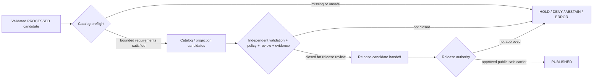

<!-- [KFM_META_BLOCK_V2]
doc_id: kfm://doc/pipelines-domains-archaeology-catalog-readme
title: pipelines/domains/archaeology/catalog/ — Governed Archaeology Catalog-Closure Boundary
type: readme; directory-readme; domain-pipeline-sublane; catalog-closure-boundary; sensitive-domain; non-publisher-guardrail
version: v0.2
status: draft; repository-grounded; direct-lane-readme-only; no-executable-catalog-processor-established; placeholder-spec; proof-unimplemented; validator-readme-only; tests-placeholder-heavy; workflow-readiness-holds
owners:
  - OWNER_TBD — Archaeology pipeline steward
  - OWNER_TBD — Archaeology domain steward
  - OWNER_TBD — Catalog steward
  - OWNER_TBD — Evidence and proof steward
  - OWNER_TBD — Cultural-review and sovereignty steward
  - OWNER_TBD — Rights-holder representative
  - OWNER_TBD — Policy and sensitivity steward
  - OWNER_TBD — Schema and contract steward
  - OWNER_TBD — Validation and CI steward
  - OWNER_TBD — Release steward
  - OWNER_TBD — Security reviewer
  - OWNER_TBD — Docs steward
created: 2026-06-13
updated: 2026-07-19
supersedes: v0.1
policy_label: public-doc; pipelines; domains; archaeology; catalog-closure; sensitive-domain; no-secrets; no-live-source-access; no-source-activation; no-direct-raw-admission; no-exact-location-exposure; no-site-discovery; no-cultural-authority; no-proof-authority; no-policy-authority; no-release-authority; no-direct-publication; candidate-not-site; source-role-preserving; evidence-bound; review-gated; rights-aware; sovereignty-aware; correction-aware; rollback-aware
current_path: pipelines/domains/archaeology/catalog/README.md
owning_root: pipelines/
responsibility: preserve the Archaeology catalog-closure execution boundary, current repository maturity, future implementation admission contract, and safe handoff from processed candidates toward catalog/triplet and release review without owning source truth, object meaning, machine shape, policy, cultural or rights-holder authority, evidence/proof records, lifecycle data, release decisions, public serving, or protected-location disclosure
truth_posture: CONFIRMED target README and prior blob; pipelines and Archaeology parent responsibilities; direct catalog sublane surfaced as README-only through bounded search and exact checks; checked absence of local execution contract, fixture runner, catalog-matrix builder, dedicated pipeline-test README, and reusable catalog-fixture README; catalog.spec.yaml exists as a seven-line PROPOSED inventory placeholder; data/catalog/domain/archaeology is a draft PROPOSED catalog-stage guide; data/proofs/archaeology is a draft PROPOSED proof guide with no concrete proof artifacts accepted by the current workflow; Archaeology contracts are draft with overlapping object-family spines; the domain schema lane reports no confirmed concrete catalog-closure schema inventory; Archaeology policy is draft and runtime enforcement is unverified; the broad validator lane is README-only; the domain test lane has thirteen named modules, including test_catalog_closure.py, while sampled modules are placeholder docstrings and collected enforcement is unestablished; the domain-archaeology workflow is read-only and records explicit validation, proof, and release readiness holds; the release-candidate lane has no child dossier; no overlapping open pull request or matching task branch was found / PROPOSED one accepted catalog-closure owner, consumer-bound specification, typed input and result contracts, deterministic identity and hashing, no-network synthetic first slice, finite outcomes and safe reason codes, catalog/triplet adapters, catalog-run receipt binding, correction propagation, and rollback / CONFLICTED whether catalog closure belongs in this domain sublane or a shared catalog implementation; CatalogMatrix, catalog-closure result, catalog receipt, graph delta, review, representation, and release-blocker object ownership and schema homes; catalog versus proof closure sequencing; domain tests versus pipeline-specific tests / UNKNOWN exhaustive recursive inventory, differently named executable modules, accepted spec parser or registry, active source bindings, concrete catalog records, proof records, fixture payloads, executable tests, substantive CI, emitted receipts, runtime execution, monitoring, branch-protection significance, release integration, deployment, and public consumers / NEEDS VERIFICATION named owners and CODEOWNERS, accepted catalog and proof contracts, schemas, source roles, rights and sovereignty controls, cultural-review interfaces, representation profiles, catalog/triplet vocabularies, invalidation semantics, separation of duties, correction consumers, and rollback execution
evidence_snapshot:
  repository: bartytime4life/Kansas-Frontier-Matrix
  repository_id: "1059091169"
  visibility: public
  base_ref: main
  base_commit: f31613299e6b0c1fc3ac37f2bbf08bc56af49e42
  target_prior_blob: a7efe425655947c0263ffd81cd3fd5d23382d5f2
  archaeology_pipeline_parent_blob: 50873232e09f66b060e94ac32ffe69efde68f541
  archaeology_spec_readme_blob: 7ca798d1482b8599942720d3e566ab2d21584f77
  archaeology_catalog_spec_blob: 2d22e88e8c4c575fa65040d45ebea36b2890b0f8
  archaeology_catalog_data_blob: 859c7ded28caceed9984ccf507bacb7bf9ffdbdc
  archaeology_contract_blob: d857c0eba2f97c3cab28c5dd76721b7b79942fb1
  archaeology_schema_blob: 1d2708f4cd74c458258cef457085f058a400681a
  archaeology_policy_blob: 8d03cdb11361739e7ad33214f76a0cfe4836ff9b
  archaeology_test_blob: 229113afacc6acc0839e92318082ccce9e2ceab3
  archaeology_validator_blob: bae2eabb5d29bf7099ed74a66a17c0071ae98557
  archaeology_proof_blob: 4dc6a8af9bf885b405b11f6d92c89fd44d53f34b
  archaeology_release_candidate_blob: bc5edc7a44ea77a6b8ed25b95569646d8df72754
  archaeology_workflow_blob: 41e377f50ca310eccdc4b716ba8374c4fa8181db
  direct_lane_files_confirmed:
    - pipelines/domains/archaeology/catalog/README.md
  checked_absent_paths:
    - pipelines/domains/archaeology/catalog/PIPELINE_CONTRACT.md
    - pipelines/domains/archaeology/catalog/run_dry_fixture.py
    - pipelines/domains/archaeology/catalog/build_catalog_matrix.py
    - tests/pipelines/domains/archaeology/catalog/README.md
    - fixtures/domains/archaeology/catalog/README.md
  concurrency_check: no open pull request matching pipelines/domains/archaeology/catalog/README.md and no branch matching archaeology-catalog were surfaced
  inventory_method: GitHub connector exact file reads plus bounded repository code-index queries; absence and README-only conclusions are limited to checked paths, indexed results, and the pinned branch snapshot
related:
  - ../../../README.md
  - ../../README.md
  - ../README.md
  - ../ingest/README.md
  - ../normalize/README.md
  - ../validate/README.md
  - ../publish/README.md
  - ../../../../docs/architecture/directory-rules.md
  - ../../../../docs/domains/archaeology/PIPELINE.md
  - ../../../../pipeline_specs/archaeology/README.md
  - ../../../../pipeline_specs/archaeology/catalog.spec.yaml
  - ../../../../contracts/domains/archaeology/README.md
  - ../../../../schemas/contracts/v1/domains/archaeology/README.md
  - ../../../../policy/domains/archaeology/README.md
  - ../../../../data/processed/archaeology/README.md
  - ../../../../data/catalog/domain/archaeology/README.md
  - ../../../../data/proofs/archaeology/README.md
  - ../../../../tests/domains/archaeology/README.md
  - ../../../../tools/validators/archaeology/README.md
  - ../../../../release/candidates/archaeology/README.md
  - ../../../../.github/workflows/domain-archaeology.yml
  - ../../../../data/receipts/generated/README.md
  - ../../../../schemas/contracts/v1/receipts/generated_receipt.schema.json
tags:
  - kfm
  - pipelines
  - domains
  - archaeology
  - catalog
  - catalog-closure
  - evidence
  - proof
  - candidate-not-site
  - cultural-review
  - sovereignty
  - rights
  - sensitivity
  - exact-location-denial
  - triplet
  - correction
  - rollback
notes:
  - "v0.2 replaces a design-forward executable tree and pseudo-machine closure record with a commit-pinned maturity, authority, admission, and implementation-graduation boundary."
  - "The direct catalog sublane is README-only in bounded inspection. Its declarative catalog spec is a placeholder, and no local runner, builder, dedicated pipeline-test lane, or reusable catalog fixture lane is established."
  - "Catalog presence, metadata closure, graph projection, proof references, validator success, or a green readiness hold do not confirm an archaeological site, confer cultural authority, clear rights, approve release, or make material public."
  - "This documentation-only revision changes no executable code, source activation, specification, contract, schema, policy rule, fixture, test, workflow, lifecycle record, receipt instance, proof, release object, runtime behavior, route, map, AI answer, or protected payload."
[/KFM_META_BLOCK_V2] -->

<a id="top"></a>

# `pipelines/domains/archaeology/catalog/` — Governed Archaeology Catalog-Closure Boundary

> **One-line purpose.** Preserve the Archaeology catalog-closure sublane as a reviewable, fail-closed execution boundary for future processed-to-catalog/triplet handoff—without turning catalog metadata, graph projections, generated summaries, candidate detections, or workflow success into archaeological truth, cultural authority, proof, release approval, or public location disclosure.

<p>
  
  
  
  
  
  
</p>

**Path:** `pipelines/domains/archaeology/catalog/README.md`
**Version:** `v0.2`
**Owning root:** [`pipelines/`](../../../README.md) — executable pipeline logic, the **how**
**Parent lane:** [`pipelines/domains/archaeology/`](../README.md) — Archaeology-domain execution routing
**Declarative companion:** [`pipeline_specs/archaeology/catalog.spec.yaml`](../../../../pipeline_specs/archaeology/catalog.spec.yaml) — current seven-line `PROPOSED` placeholder
**Catalog data companion:** [`data/catalog/domain/archaeology/`](../../../../data/catalog/domain/archaeology/README.md) — draft catalog-stage guide, not an implemented record family
**Public posture:** no direct public path; no site confirmation, location discovery, cultural approval, rights clearance, proof creation, release decision, map/API serving, or publication
**Evidence snapshot:** `main@f31613299e6b0c1fc3ac37f2bbf08bc56af49e42`

> [!IMPORTANT]
> **The direct catalog sublane is documentation-only at the pinned snapshot.** Exact checks found no local execution contract, no fixture runner, no catalog-matrix builder, no dedicated pipeline-test README, and no reusable catalog fixture README. The catalog specification is an inventory placeholder. A rich README and named stage do not establish an executable processor.

> [!CAUTION]
> **The surrounding trust surfaces are not closed.** The Archaeology proof lane is a draft guide with no accepted concrete proof producer; the schema lane reports no confirmed catalog-closure schema inventory; validators are README-only; the domain test lane is placeholder-heavy; and the workflow deliberately records validation, proof, and release holds. Do not infer catalog readiness from path presence or workflow color.

> [!WARNING]
> **Catalog and graph surfaces can become site-discovery surfaces.** Exact or reverse-engineerable archaeological locations, burial or human-remains context, sacred or culturally restricted knowledge, collection-security detail, looting-risk information, private-landowner detail, consent secrets, steward-only review substance, and transformation parameters must not appear in public metadata, identifiers, paths, logs, receipts, graph edges, screenshots, exports, embeddings, search indexes, or AI summaries.

**Quick navigation:** [Status](#0-status-and-evidence-boundary) · [Purpose](#1-purpose) · [Authority](#2-placement-and-authority) · [Anti-collapse](#3-catalog-anti-collapse-rules) · [Belongs](#4-what-belongs-here) · [Does not](#5-what-does-not-belong-here) · [Scope](#6-catalog-scope) · [Lifecycle](#7-lifecycle-contract) · [Gates](#8-required-gates) · [Directory](#9-directory-contract-and-file-admission) · [Inputs](#10-input-and-output-boundary) · [Result](#11-minimum-catalog-closure-result-obligations) · [Testing](#12-tests-fixtures-receipts-and-proofs) · [Promotion](#13-promotion-publication-correction-and-rollback) · [Done](#14-definition-of-done) · [Open](#15-open-verification-register) · [Evidence](#16-evidence-ledger) · [History](#17-change-history)

---

## 0. Status and evidence boundary

### Current determination

`pipelines/domains/archaeology/catalog/` is an existing Archaeology pipeline-documentation sublane. It is **not** an established catalog-closure implementation.

| Surface | Inspected state | Evidence-bounded conclusion |
|---|---:|---|
| Target README | `CONFIRMED` | v0.1 existed; this revision updates it in place. |
| Direct sublane inventory | `README ONLY` | Bounded search and exact probes surfaced no local executable. |
| Local execution contract | `NOT FOUND AT CHECKED PATH` | No adopted sublane contract is established. |
| Local no-network runner | `NOT FOUND AT CHECKED PATH` | No fixture-backed dry-run entrypoint is established. |
| Local catalog builder | `NOT FOUND AT CHECKED PATH` | No direct catalog-matrix implementation is established. |
| Declarative catalog spec | `PLACEHOLDER` | `catalog.spec.yaml` has seven planning lines and activates nothing. |
| Parent Archaeology pipeline | `DRAFT README` | Defines the execution boundary; concrete behavior remains unverified. |
| Domain catalog data lane | `DRAFT / PROPOSED GUIDE` | Defines catalog-stage responsibilities; no concrete catalog-record inventory is established. |
| Archaeology proof lane | `DRAFT / PROPOSED GUIDE` | Proof requirements are documented; concrete proof schemas, producers, and artifacts are unestablished. |
| Semantic contracts | `DRAFT / PARTIAL` | Overlapping object-family spines exist; catalog-closure meaning and ownership remain unresolved. |
| Machine schemas | `INDEX ONLY / INCOMPLETE` | No confirmed catalog-closure schema inventory is established under the domain schema lane. |
| Domain policy | `DRAFT / RUNTIME UNKNOWN` | Fail-closed intent exists; accepted bundle/evaluator/runtime binding is unverified. |
| Broad validator | `README ONLY` | No catalog validator executable or ValidationReport producer is established. |
| Domain tests | `13 NAMES / PLACEHOLDER-HEAVY` | `test_catalog_closure.py` exists, but executable content and collected cases remain unestablished. |
| Dedicated pipeline tests | `NOT FOUND AT CHECKED PATH` | No catalog-specific pipeline-test README is established. |
| Reusable catalog fixtures | `NOT FOUND AT CHECKED PATH` | No dedicated reusable catalog fixture README is established. |
| Domain workflow | `READ-ONLY READINESS HOLDS` | It checks for maturity drift and performs no catalog, proof, release, or publication operation. |
| Release candidate lane | `PARENT README ONLY` | No child Archaeology candidate dossier or approved release is established. |
| Runtime / production use | `UNKNOWN` | No execution trace, retained catalog receipt, proof manifest, deployment, or public consumer was inspected. |

### Safe conclusions

- **CONFIRMED:** the path and README exist under the executable `pipelines/` responsibility root.
- **CONFIRMED:** current catalog intent is represented by documentation plus a placeholder spec, not executable behavior.
- **CONFIRMED:** catalog, proof, review, policy, release, and public serving remain separate authorities.
- **PROPOSED:** this sublane may own Archaeology-specific catalog orchestration after placement, contracts, schemas, interfaces, and tests are accepted.
- **CONFLICTED:** domain-specific catalog orchestration here versus a shared catalog implementation remains unresolved.
- **UNKNOWN:** complete recursive inventory, differently named modules, live source use, concrete records, runtime consumers, and production behavior.
- **NEEDS VERIFICATION:** every future contract, schema, executable, fixture, test, validator, receipt, proof, catalog record, triplet vocabulary, release handoff, and rollback path.

### Truth and outcome vocabulary

| Term | Use in this README |
|---|---|
| `CONFIRMED` | Verified at the pinned repository snapshot. |
| `PROPOSED` | Design or behavior not yet established as implementation. |
| `UNKNOWN` | Not resolved by bounded inspection. |
| `NEEDS VERIFICATION` | Checkable, but not verified strongly enough to rely on. |
| `CONFLICTED` | Current evidence exposes incompatible or overlapping claims without an accepted resolution. |
| `READY` / `HOLD` / `DENY` / `ABSTAIN` / `ERROR` | Proposed operational result classes for a future catalog preflight; not an adopted machine enum. |

[Back to top](#top)

---

## 1. Purpose

The durable question for this lane is:

> Can a governed Archaeology process convert an already validated, review-bounded processed candidate into catalog/triplet handoff material while preserving source identity, candidate status, evidence support, rights, cultural and sovereignty review, sensitivity, representation constraints, correction lineage, and rollback readiness—and while producing no public exposure or false confirmation?

A mature catalog-closure process may eventually:

- read only authorized, immutable processed inputs or synthetic public-safe fixtures;
- verify the declared contract, schema, source role, lifecycle state, validation result, review state, policy state, and evidence dependencies;
- prepare domain catalog records and accepted discovery projections;
- prepare graph/triplet projections that preserve provenance and invalidation;
- record release blockers without making release decisions;
- emit deterministic process receipts under an accepted receipt family;
- route incomplete, restricted, unsafe, conflicted, or unsupported material to an explicit hold or denial;
- preserve correction, supersession, revocation, withdrawal, and rollback dependencies.

This lane must not:

- fetch or admit sources;
- read unrestricted live upstream systems by default;
- normalize or validate source records as a substitute for upstream stages;
- confirm archaeological sites or cultural interpretations;
- create cultural, steward, sovereignty, consent, or rights-holder authority;
- create an `EvidenceBundle` merely by resolving a pointer;
- store proof, catalog, receipt, review, policy, release, or published records beside code;
- expose exact or triangulable protected locations;
- write release manifests, public maps, public APIs, search indexes, exports, or AI answers.

[Back to top](#top)

---

## 2. Placement and authority

### Directory Rules basis

The owning root is `pipelines/` because the intended responsibility is executable orchestration. The Archaeology domain remains a segment inside that root. Catalog records themselves belong under `data/catalog/`; proof belongs under `data/proofs/`; policy belongs under `policy/`; release decisions belong under `release/`.

| Responsibility | Owning home | This lane's role |
|---|---|---|
| Archaeology catalog orchestration | `pipelines/` after accepted placement | Potential execution support only. |
| Declarative run intent | `pipeline_specs/archaeology/` | Consumed only after parser, schema, owner, and binding are accepted. |
| Archaeology semantic meaning | `contracts/domains/archaeology/` | Consumed; never redefined here. |
| Machine-checkable shape | `schemas/contracts/v1/domains/archaeology/` or accepted catalog schema home | Consumed; never silently selected. |
| Source identity, role, rights, and admission | source registries and connector/admission roots | Referenced; never decided here. |
| Processed inputs | `data/processed/archaeology/` | Read-only governed inputs. |
| Domain catalog records | `data/catalog/domain/archaeology/` | Output authority after accepted lifecycle transition. |
| STAC / DCAT / PROV projections | accepted `data/catalog/` child lanes | Optional projections, not truth. |
| Graph / triplet projection | accepted triplet/graph lane | Derived projection, not canonical truth. |
| Evidence and proof | `data/proofs/` | Referenced and checked; never authored as a shortcut here. |
| Receipts and review records | accepted `data/receipts/` and review homes | Emitted/referenced only through accepted contracts. |
| Policy and sensitivity | `policy/` | Applied through a verified evaluator; not implemented by catalog prose. |
| Tests and validators | `tests/`, `fixtures/`, `tools/validators/` | Prove behavior; do not confer authority. |
| Release, correction, withdrawal, rollback | `release/` | Receives a handoff; decides publication. |
| Public API, map, search, export, AI | governed application and released-artifact surfaces | No direct access to this lane or internal stores. |

### Placement conflict

Two implementation shapes remain plausible:

```text
 pipelines/domains/archaeology/catalog/    # domain-specific orchestration
 pipelines/catalog/                        # shared catalog mechanics with Archaeology adapters
```

Neither shape is accepted here. Before executable work lands, reviewers must decide:

1. which location owns generic catalog mechanics;
2. which location owns Archaeology-only sensitivity, review, representation, and candidate-boundary adaptation;
3. how one implementation avoids duplicate writes, specs, receipts, tests, and schedules;
4. whether the current sublane remains canonical, becomes an adapter, or becomes documentation-only.

A path's existence does not settle this responsibility decision.

### Authority of this README

This README may define:

- the local documentation boundary;
- current verified maturity;
- admission conditions for future files;
- anti-collapse, sensitivity, security, test, review, correction, and rollback obligations;
- unresolved placement and ownership questions.

It cannot define:

- Archaeology object meaning or machine shape;
- accepted source roles or source rights;
- cultural or sovereignty authority;
- policy outcomes;
- evidence truth;
- catalog record truth;
- release approval;
- public exposure permission.

[Back to top](#top)

---

## 3. Catalog anti-collapse rules

A future implementation must preserve these distinctions:

```text
 processed record                 != catalog record
 catalog record                   != proof
 EvidenceRef                      != EvidenceBundle
 evidence lookup success          != admissible evidence closure
 catalog metadata                 != archaeological truth
 candidate feature                != confirmed archaeological site
 remote-sensing anomaly           != confirmed archaeological site
 graph or triplet projection      != canonical record
 STAC / DCAT / PROV projection    != source or release authority
 generalized representation      != permission to disclose
 transform description            != RedactionReceipt
 review reference                 != current valid review
 policy reference                 != PolicyDecision
 catalog-run receipt              != ValidationReport or ProofPack
 release blocker summary          != release candidate or PromotionDecision
 generated summary                != evidence or cultural authority
 workflow success                 != catalog, proof, release, or publication
 merge                            != lifecycle promotion
```

Required invariants:

1. **Candidate status is monotonic until governed change.** A label, score, graph edge, catalog class, or generated explanation cannot confirm a site.
2. **Source role survives every projection.** Observed, archival, administrative, modeled, candidate, synthetic, interpreted, aggregate, and contextual material remain distinguishable.
3. **Sensitivity never decreases by convenience.** Generalization, aggregation, hashing, or catalog indexing does not automatically make protected material public-safe.
4. **Evidence remains external and resolvable.** Catalog closure references an admissible bundle; it does not synthesize proof from metadata.
5. **Human authority is explicit and current.** Cultural, rights-holder, sovereignty, steward, consent, revocation, and embargo state cannot be inferred.
6. **Lifecycle state remains explicit.** `PROCESSED`, `CATALOG / TRIPLET`, release candidate, and `PUBLISHED` are separate states.
7. **Projections remain projections.** Search, graph, vector, tile, scene, report, and AI carriers cannot replace canonical records.
8. **Correction and rollback remain attached.** A downstream record without invalidation and rollback relationships is not release-ready.

[Back to top](#top)

---

## 4. What belongs here

Only files whose primary responsibility is Archaeology-specific catalog-closure execution may be admitted after the ownership decision closes.

Potential future responsibilities include:

- reading governed processed-object references, not unrestricted source payloads;
- checking that required validation, source, rights, review, policy, evidence, representation, correction, and rollback references are declared;
- adapting an accepted shared catalog contract to Archaeology-specific object families;
- preserving candidate, interpretation, model, archive, observation, and confirmed-record boundaries;
- preparing domain catalog candidates under an accepted schema;
- preparing STAC/DCAT/PROV or graph/triplet handoff candidates when those projections are accepted;
- calculating deterministic digests and replay metadata without exposing protected detail;
- emitting an accepted catalog-run receipt;
- producing explicit, safe blocker results;
- routing incomplete or unsafe cases to hold, abstain, deny, quarantine, or error handling.

A file does not belong merely because it contains the word `catalog`, references Archaeology, or writes JSON.

[Back to top](#top)

---

## 5. What does not belong here

| Does not belong | Correct responsibility home |
|---|---|
| Source fetchers, API clients, watchers, and admission logic | `connectors/`, source-admission pipelines, and source registries |
| RAW, WORK, QUARANTINE, PROCESSED, CATALOG, TRIPLET, or PUBLISHED payloads | Governed `data/` lifecycle homes |
| Archaeology domain doctrine | `docs/domains/archaeology/` |
| Object meaning | `contracts/domains/archaeology/` |
| JSON Schema or schema registries | `schemas/` and accepted registry homes |
| Policy rules or evaluator implementation | `policy/` and verified policy-runtime packages |
| Cultural, steward, rights-holder, sovereignty, consent, or revocation decisions | Accepted review/governance record homes |
| EvidenceBundle or ProofPack records | `data/proofs/` or accepted proof homes |
| Reusable fixtures and executable tests | `fixtures/` and `tests/` |
| Shared catalog mechanics | Accepted shared catalog package or pipeline home |
| Release candidates, manifests, promotion decisions, corrections, withdrawals, rollback cards | `release/` |
| Public API, map, tile, search, graph, export, report, screenshot, or AI behavior | Governed app/runtime roots and released artifacts |
| Exact or reverse-engineerable locations and protected cultural substance | Restricted governed stores only; never public docs or ordinary logs |
| Credentials, tokens, private endpoints, consent secrets, transform offsets | Secret manager or governed restricted stores |

[Back to top](#top)

---

## 6. Catalog scope

### Processed-input admission

A future catalog run must refuse or hold an input unless the accepted profile can establish:

- stable processed-object identity and version;
- object-family contract and schema version;
- source identity, role, vintage, rights, and access posture;
- validation result and finite status;
- lifecycle state and immutable input digest;
- candidate-versus-confirmed status;
- spatial support and precision class without leaking protected coordinates;
- temporal support, validity, correction, and supersession state;
- sensitivity, cultural review, sovereignty, consent, revocation, and embargo context where applicable;
- evidence dependencies and admissibility requirements;
- public-representation and transform requirements where release-facing use is proposed.

### Catalog candidate preparation

A catalog candidate should preserve:

- the canonical object reference rather than copy sensitive canonical content;
- source and processed lineage;
- object family and knowledge character;
- candidate/confirmed/interpretive state;
- time, geography class, scale, and representation scope;
- sensitivity and audience posture;
- rights and review dependency references;
- evidence dependency references;
- validation and policy dependency references;
- correction, supersession, invalidation, and rollback relationships;
- release blockers.

### Optional projections

STAC, DCAT, PROV, graph, triplet, search, and other projections are optional and independently governed. A future implementation must:

- use only accepted projection contracts;
- preserve source role, ownership, evidence, sensitivity, review, and invalidation;
- avoid exact-location leakage through geometry, bounding boxes, centroids, identifiers, titles, descriptions, timestamps, thumbnails, links, or graph neighborhoods;
- produce no projection when the safe representation cannot be proven;
- treat projection failure as a finite hold or error, not permission to emit a partial unsafe record.

### Release-blocker handoff

This lane may describe why catalog closure is incomplete. It may not approve promotion. Blockers may include:

- missing or inadmissible evidence;
- missing or stale review;
- unresolved rights, sovereignty, consent, revocation, or embargo;
- candidate/site identity ambiguity;
- unknown or unsafe sensitivity posture;
- missing transform or representation support;
- schema/contract/profile drift;
- projection inconsistency;
- missing correction or rollback target;
- release topology conflict.

[Back to top](#top)

---

## 7. Lifecycle contract

The canonical lifecycle remains:

```text
 RAW -> WORK / QUARANTINE -> PROCESSED -> CATALOG / TRIPLET -> PUBLISHED
```

Catalog closure operates only at the governed boundary between `PROCESSED` and `CATALOG / TRIPLET`.



Rules:

- A directory write is not a promotion.
- A catalog candidate is not a catalog record until the accepted state transition closes.
- A catalog record is not released.
- A release candidate is not a release.
- No stage may reconstruct or expose protected detail merely because an upstream internal record contains it.
- Correction, revocation, withdrawal, and rollback can invalidate downstream catalog and projection records after initial creation.

[Back to top](#top)

---

## 8. Required gates

A future catalog run must close or fail safely on all material gates:

1. **Ownership and profile gate** — one accepted implementation owner, spec, contract, schema, and configuration profile.
2. **Processed-state gate** — immutable processed input, lifecycle state, version, and digest.
3. **Source gate** — stable source identity, role, vintage, rights, access, and attribution.
4. **Object gate** — accepted object meaning and candidate-versus-confirmed semantics.
5. **Schema gate** — accepted machine shape; permissive scaffold is not sufficient.
6. **Validation gate** — deterministic result under an accepted validator profile.
7. **Evidence gate** — claim-bearing dependencies resolve to admissible evidence or the result holds/abstains.
8. **Rights and sovereignty gate** — authority-to-control, CARE, consent, revocation, embargo, and cultural obligations as applicable.
9. **Sensitivity gate** — exact and reverse-engineerable protected detail fails closed.
10. **Review gate** — required cultural, steward, rights-holder, sensitivity, and release review is current and in scope.
11. **Representation gate** — public-safe carrier and transform support are accepted without exposing methods that enable reversal.
12. **Time gate** — observation, validity, retrieval, processing, review, correction, catalog, and release times remain distinct.
13. **Projection gate** — catalog, STAC, DCAT, PROV, graph, and triplet candidates agree under accepted profiles.
14. **Receipt gate** — deterministic input, method, dependency, outcome, and output hashes are recorded under an accepted receipt family.
15. **Correction gate** — invalidation, supersession, revocation, and correction propagation are defined.
16. **Rollback gate** — rollback target and downstream dependency map exist before release-facing handoff.
17. **No-direct-publish gate** — no public route, map, tile, export, search, report, or AI write.
18. **Security gate** — no secret, path traversal, injection, unsafe archive, external fetch, or protected-detail leak.

No single successful gate substitutes for another.

[Back to top](#top)

---

## 9. Directory contract and file admission

### Current inspected shape

```text
 pipelines/domains/archaeology/catalog/
   README.md
```

This is bounded evidence, not an exhaustive filesystem proof.

### Admission rule

Do not add a file here until a pull request establishes:

1. **Responsibility:** why the file is domain-specific catalog orchestration rather than shared catalog mechanics, validation, policy, proof, data, or release work.
2. **Owner:** named maintainers and review routing.
3. **Interface:** accepted input/result contract, schema, and version.
4. **Specification:** consumer-bound declarative profile with stable identity and digest.
5. **Data boundary:** exact allowed reads, writes, and denied side effects.
6. **Sensitivity:** safe handling of exact, inferential, cultural, collection-security, and private-land detail.
7. **Evidence/review/policy:** referenced interfaces and finite failure behavior.
8. **Tests:** synthetic, minimized, no-network positive and negative cases.
9. **Receipts:** accepted receipt family and deterministic replay fields.
10. **Correction/rollback:** invalidation graph, migration note, and rollback target.
11. **CI:** explicit workflow graduation from current readiness holds.
12. **No duplication:** proof that no parallel runner, spec, schedule, or writer already owns the concern.

### Path posture for future files

Potential future file names are **PROPOSED only after admission review**. This README intentionally does not publish a ready-made executable tree. Creating empty files to satisfy a diagram would falsely increase apparent maturity.

[Back to top](#top)

---

## 10. Input and output boundary

### Allowed inputs

| Input family | Required posture |
|---|---|
| Synthetic public-safe catalog fixture | Deterministic, minimized, no-network, and explicitly non-authoritative |
| Processed-object reference | Immutable version and digest; no unrestricted payload copy |
| Validation result reference | Accepted profile, finite outcome, safe reason codes |
| Source descriptor reference | Stable source identity, role, rights, sensitivity, vintage |
| Evidence dependency reference | Resolvable under authorized context; no proof copied into logs |
| Review and policy dependency references | Current, in-scope, unrevoked, and independently governed |
| Representation dependency | Named public-safe carrier/profile and receipt reference where applicable |
| Correction / supersession / rollback dependency | Stable target and invalidation semantics |

### Denied inputs

- direct live source access;
- unadmitted RAW payloads;
- unresolved or unrestricted exact site geometry;
- burial, sacred-site, looting-risk, collection-security, or private-owner details in ordinary fixtures;
- consent secrets or restricted review substance;
- generated claims presented as evidence;
- path-only or filename-only approval signals;
- mutable “latest” records without pinned identity and time;
- schemas or policy profiles selected silently at runtime.

### Potential outputs

A future process may emit only into accepted governed homes:

- catalog candidate or record;
- optional discovery/provenance projection candidate;
- optional graph/triplet projection candidate;
- safe blocker/result record;
- catalog-run receipt;
- correction/invalidation handoff;
- release-candidate support pointer.

It must not emit:

- proof records as a shortcut;
- cultural or rights-holder decisions;
- policy approval;
- release manifests or promotion decisions;
- public layers, routes, tiles, search indexes, exports, or AI text;
- exact or reverse-engineerable protected detail.

[Back to top](#top)

---

## 11. Minimum catalog-closure result obligations

No accepted catalog-closure result schema is established. Before one is adopted, the semantic obligations are:

### Identity and replay

- stable run identity;
- stable implementation, spec, contract, schema, policy, and profile versions;
- deterministic parameter and dependency digests;
- immutable processed-input references and hashes;
- clear retry, idempotency, and duplicate-detection behavior.

### Object and source posture

- owning domain and object family;
- native object identity and version;
- candidate, confirmed, interpreted, modeled, synthetic, aggregate, or contextual posture;
- source identity, role, vintage, rights, and access state;
- no inference of truth from a catalog label.

### Spatial and temporal posture

- spatial support class and permitted precision;
- explicit denial of protected exact or inferential location;
- distinct observation, validity, processing, review, catalog, correction, and release time kinds;
- stale, superseded, withdrawn, revoked, or embargoed state.

### Evidence, review, policy, and representation

- evidence dependency and resolution state;
- cultural/steward/rights-holder/sovereignty review dependency and scope;
- policy dependency and finite outcome;
- representation dependency and transform receipt where required;
- no leakage of protected review substance or reversible transform parameters.

### Catalog and projection posture

- target catalog profile and version;
- optional projection profiles and versions;
- provenance and invalidation links;
- consistency findings across projections;
- explicit blockers and safe reason codes;
- no claim that a projection is canonical truth.

### Correction and rollback

- upstream correction and revocation dependencies;
- downstream catalog, triplet, release, and public consumers to invalidate;
- supersession target;
- rollback target and replay boundary;
- audit refs that do not expose protected detail.

A machine schema may encode these obligations only after contract, placement, sensitivity, validator, fixture, and review acceptance.

[Back to top](#top)

---

## 12. Tests, fixtures, receipts, and proofs

### Current test posture

The domain test lane confirms the filename `tests/domains/archaeology/test_catalog_closure.py`. Its executable content and collected cases remain `NEEDS VERIFICATION`. The domain workflow currently expects direct Archaeology test modules to contain no executable test functions/classes and requires explicit workflow graduation when implementation appears.

The checked dedicated path below is absent:

```text
 tests/pipelines/domains/archaeology/catalog/README.md
```

Do not create a second test authority casually. Decide whether catalog closure is proved in the domain test lane, a pipeline-specific lane, or both with non-overlapping responsibilities.

### Minimum future test matrix

A no-network first slice should include:

| Case | Expected safe result |
|---|---|
| Valid synthetic processed candidate with bounded public-safe support | `READY` for catalog-candidate construction only |
| Missing processed state or immutable digest | `HOLD` |
| Missing accepted contract or schema | `HOLD` or `ERROR` |
| Permissive scaffold presented as active schema | `DENY` / `HOLD` |
| Candidate relabeled as confirmed site | `DENY` |
| EvidenceRef unresolved or inadmissible | `ABSTAIN` / `HOLD` |
| Missing or stale cultural/rights-holder review | `HOLD` / `DENY` |
| Revoked consent or active embargo | `DENY` / `HOLD` |
| Exact or triangulable protected detail in catalog candidate | `DENY` |
| Unsafe identifier, title, bbox, centroid, link, graph edge, or diagnostic | `DENY` |
| Projection mismatch | `HOLD` |
| Missing correction or rollback target for release-facing material | `HOLD` |
| Attempted public, release, network, or unrestricted filesystem write | `DENY` / `ERROR` |
| Repeated identical run | deterministic no-op or identical digest |
| Upstream correction or revocation | downstream invalidation set produced |

### Fixture rules

Fixtures must be:

- synthetic, minimized, public-safe, deterministic, and no-network;
- free of real exact sites, collection-security detail, restricted cultural knowledge, private-owner data, and consent secrets;
- designed to test reverse-inference and metadata leakage, not only direct coordinate fields;
- linked to consuming tests and accepted contracts/schemas;
- versioned with expected finite outcome and safe reason code;
- stored in the accepted fixture root after placement review.

### Receipt boundary

A catalog-run receipt is process memory. It must not become:

- an `EvidenceBundle`;
- a cultural or review decision;
- a `PolicyDecision`;
- a catalog record;
- a release candidate;
- a `ReleaseManifest`;
- a `RollbackCard`;
- publication proof.

No accepted Archaeology catalog receipt family is established by the inspected evidence. Do not invent one through a README example.

### Proof boundary

The proof lane documents EvidenceBundle requirements but reports concrete proof schemas, producers, validators, and artifacts as unestablished. A catalog processor may resolve or validate authorized proof references. It must not create evidence closure from a successful metadata join.

[Back to top](#top)

---

## 13. Promotion, publication, correction, and rollback

### Governed chain

```text
 validated PROCESSED Archaeology candidate
   -> catalog preflight
   -> catalog / projection candidates
   -> independent evidence, review, policy, sensitivity, and validation closure
   -> governed CATALOG / TRIPLET transition
   -> release-candidate review
   -> promotion decision + release manifest + rollback support
   -> public-safe released carrier
   -> governed API / map / search / export / AI surface
```

Every arrow is conditional and auditable.

### Publication boundary

This lane must never:

- publish directly;
- write a release manifest or promotion decision;
- create a public route or alias;
- expose a restricted internal catalog to standard clients;
- issue site-discovery output;
- treat a public-safe representation description as permission;
- authorize AI to reveal exact or inferential protected location.

### Correction and invalidation cascade

A correction, revocation, rights change, review change, policy change, schema defect, source withdrawal, evidence failure, sensitivity reclassification, or representation defect may require invalidation of:

- processed-object status;
- catalog records;
- STAC/DCAT/PROV projections;
- graph/triplet projections;
- search or vector indexes;
- proof references;
- release candidates and manifests;
- caches and current aliases;
- maps, tiles, exports, reports, screenshots, embeddings, and AI answer caches.

Invalidation must be explicit, reasoned, receipt-backed, reviewable, and reversible where policy permits.

### Rollback for executable changes

A future implementation pull request must name:

- previous implementation and spec versions;
- data and catalog migrations;
- affected catalog/triplet/projection identities;
- consumer and cache invalidation;
- rollback command or governed procedure;
- protected-data handling during rollback;
- criteria for restoration versus continued hold.

[Back to top](#top)

---

## 14. Definition of done

### Documentation revision

This README revision is complete when it:

- preserves the existing path and stable document identity;
- states the direct README-only inventory and placeholder spec accurately;
- separates catalog orchestration from data, proof, policy, review, release, and public authority;
- preserves candidate-not-site, source-role, sensitivity, evidence, cultural-review, correction, and rollback invariants;
- removes speculative implementation trees and pseudo-machine records from current-state presentation;
- defines future file-admission, testing, CI-graduation, security, and rollback burdens;
- changes no executable or trust-bearing behavior.

### Future executable catalog closure

An implementation is not done until all of the following are `CONFIRMED`:

- accepted placement and one implementation owner;
- named owners and CODEOWNERS;
- accepted semantic contract and machine schema;
- accepted consumer-bound catalog spec and parser/registry binding;
- stable source-role, object-state, time, spatial, sensitivity, review, policy, evidence, and representation vocabularies;
- deterministic identity, hashing, replay, idempotency, and duplicate handling;
- public-safe synthetic fixtures;
- executable positive and negative tests;
- active no-network enforcement;
- safe diagnostics and artifact retention;
- catalog/triplet/projection conformance;
- accepted receipt family;
- correction and revocation propagation;
- rollback drill;
- workflow graduated from readiness hold to the exact accepted command;
- independent governance review;
- no direct publication or public-client internal-store access.

[Back to top](#top)

---

## 15. Open verification register

| ID | Question | Status |
|---|---|---|
| `ARCH-CAT-001` | Does catalog closure belong here, in a shared catalog pipeline, or in a package with a thin Archaeology adapter? | `CONFLICTED / NEEDS VERIFICATION` |
| `ARCH-CAT-002` | Who owns generic catalog mechanics versus Archaeology-specific review and sensitivity adaptation? | `NEEDS VERIFICATION` |
| `ARCH-CAT-003` | What is the accepted semantic contract for catalog closure? | `UNKNOWN` |
| `ARCH-CAT-004` | What schema owns the catalog candidate/result shape? | `UNKNOWN` |
| `ARCH-CAT-005` | Is `CatalogMatrix` an accepted object family, profile name, or documentation-only corpus term? | `NEEDS VERIFICATION` |
| `ARCH-CAT-006` | Which catalog, STAC, DCAT, PROV, graph, and triplet profiles are accepted? | `UNKNOWN` |
| `ARCH-CAT-007` | What is the accepted parser/registry/consumer binding for `catalog.spec.yaml`? | `UNKNOWN` |
| `ARCH-CAT-008` | Which processed Archaeology object families enter the first slice? | `NEEDS VERIFICATION` |
| `ARCH-CAT-009` | Which source-role and candidate-state vocabularies are accepted? | `NEEDS VERIFICATION` |
| `ARCH-CAT-010` | What evidence interface defines admissible closure without copying proof? | `UNKNOWN` |
| `ARCH-CAT-011` | What review-record interfaces prove current cultural, rights-holder, sovereignty, consent, and embargo state? | `UNKNOWN` |
| `ARCH-CAT-012` | What policy bundle/evaluator and finite decision vocabulary are accepted? | `UNKNOWN` |
| `ARCH-CAT-013` | What public-representation profile and transform receipt are accepted? | `UNKNOWN` |
| `ARCH-CAT-014` | How are exact and inferential location leaks tested across metadata and graph neighborhoods? | `NEEDS VERIFICATION` |
| `ARCH-CAT-015` | What catalog-run receipt family is accepted, and where is it stored? | `UNKNOWN` |
| `ARCH-CAT-016` | Which correction, revocation, withdrawal, and invalidation events cascade downstream? | `NEEDS VERIFICATION` |
| `ARCH-CAT-017` | Which test lane owns catalog closure and how is duplicate coverage prevented? | `CONFLICTED / NEEDS VERIFICATION` |
| `ARCH-CAT-018` | Are reusable catalog fixtures admitted under the domain fixture root? | `NEEDS VERIFICATION` |
| `ARCH-CAT-019` | What safe diagnostic and retained CI artifact profile is accepted? | `UNKNOWN` |
| `ARCH-CAT-020` | Which exact command graduates `domain-archaeology` from readiness hold? | `UNKNOWN` |
| `ARCH-CAT-021` | What branch-protection significance should catalog closure have? | `UNKNOWN` |
| `ARCH-CAT-022` | What release-candidate handoff record is accepted without granting release authority? | `UNKNOWN` |
| `ARCH-CAT-023` | Which public clients consume released Archaeology catalog derivatives? | `UNKNOWN` |
| `ARCH-CAT-024` | How are caches, indexes, tiles, embeddings, screenshots, and AI answer caches invalidated? | `NEEDS VERIFICATION` |
| `ARCH-CAT-025` | What rollback procedure has been exercised with protected-data controls? | `UNKNOWN` |
| `ARCH-CAT-026` | Which owners and independent reviewers are required for implementation and release-facing changes? | `NEEDS VERIFICATION` |
| `ARCH-CAT-027` | Are any differently named catalog executables, scheduled jobs, or external consumers present? | `UNKNOWN` |
| `ARCH-CAT-028` | What operational telemetry is safe and useful without leaking protected detail? | `UNKNOWN` |
| `ARCH-CAT-029` | What resource, timeout, archive, and input-size limits apply? | `NEEDS VERIFICATION` |
| `ARCH-CAT-030` | What is the verified correction and rollback target for each emitted catalog identity? | `UNKNOWN` |

[Back to top](#top)

---

## 16. Evidence ledger

| Evidence | Status | Supports | Limits |
|---|---|---|---|
| Prior target README, blob `a7efe425...` | `CONFIRMED` | Existing purpose, section structure, fail-closed catalog intent, and prior speculative design. | Did not prove implementation. |
| [`pipelines/domains/archaeology/README.md`](../README.md) | `CONFIRMED file / draft` | Parent execution boundary and Archaeology sensitivity posture. | Parent is documentation-forward and not execution proof. |
| [`pipeline_specs/archaeology/README.md`](../../../../pipeline_specs/archaeology/README.md) and [`catalog.spec.yaml`](../../../../pipeline_specs/archaeology/catalog.spec.yaml) | `CONFIRMED` | Five stage files exist; catalog spec is a seven-line `PROPOSED` placeholder. | No accepted spec schema, parser, registry, consumer, or activation. |
| [`data/catalog/domain/archaeology/README.md`](../../../../data/catalog/domain/archaeology/README.md) | `CONFIRMED file / PROPOSED guide` | Catalog-stage boundary and deny-default requirements. | No concrete catalog record or validator inventory established. |
| [`data/proofs/archaeology/README.md`](../../../../data/proofs/archaeology/README.md) | `CONFIRMED file / PROPOSED guide` | EvidenceRef/EvidenceBundle and protected-proof boundaries. | Concrete proof schemas, producers, validators, and artifacts unestablished. |
| [`contracts/domains/archaeology/README.md`](../../../../contracts/domains/archaeology/README.md) | `CONFIRMED file / draft` | Semantic authority and candidate/confirmed distinction. | Overlapping object-family spines and incomplete catalog-closure contract. |
| [`schemas/contracts/v1/domains/archaeology/README.md`](../../../../schemas/contracts/v1/domains/archaeology/README.md) | `CONFIRMED index / incomplete` | Candidate schema home and fail-closed sensitivity posture. | No confirmed catalog-closure schema inventory. |
| [`policy/domains/archaeology/README.md`](../../../../policy/domains/archaeology/README.md) | `CONFIRMED file / draft` | Deny-default intent and review/rights obligations. | Bundle, evaluator, tests, and runtime enforcement unverified. |
| [`tools/validators/archaeology/README.md`](../../../../tools/validators/archaeology/README.md) | `CONFIRMED README-only lane` | Required validation families and maturity gaps. | No executable catalog validator or report producer established. |
| [`tests/domains/archaeology/README.md`](../../../../tests/domains/archaeology/README.md) | `CONFIRMED` | Thirteen named modules, including catalog closure; placeholder-heavy maturity. | Executable cases and pass results unestablished. |
| [`.github/workflows/domain-archaeology.yml`](../../../../.github/workflows/domain-archaeology.yml) | `CONFIRMED` | Read-only readiness checks and explicit validation/proof/release holds. | Green held result is not catalog, proof, or release evidence. |
| [`release/candidates/archaeology/README.md`](../../../../release/candidates/archaeology/README.md) | `CONFIRMED parent only` | No child dossier, candidate, manifest, or approved release established. | Does not inventory external or unindexed release state. |
| Exact missing-path probes | `CONFIRMED bounded absence` | No local contract, runner, builder, dedicated pipeline-test README, or reusable catalog-fixture README at checked paths. | Does not prove permanent or differently named absence. |

No external research was used. This README makes repository and doctrine claims only from current-session KFM evidence.

[Back to top](#top)

---

## 17. Change history

### v0.2 — 2026-07-19

- Replaced design-forward current-state claims with commit-pinned repository evidence.
- Classified the direct catalog sublane as README-only and the catalog spec as a placeholder.
- Separated catalog orchestration from catalog data, proof, review, policy, release, and public authority.
- Removed the speculative executable tree and pseudo-machine closure record.
- Added catalog metadata and graph no-leak controls, file admission, no-network tests, CI graduation, correction cascade, rollback, and a 30-item verification register.
- Preserved useful v0.1 purpose, lifecycle, candidate-not-site, evidence, review, policy, representation, graph, release-blocker, correction, and rollback requirements.

### Rollback for this README

Before merge, close the review pull request or reset/delete its scoped branch. After merge, revert the generated receipt commit and README commit in reverse order, restoring prior target blob `a7efe425655947c0263ffd81cd3fd5d23382d5f2`.

This documentation rollback changes no catalog data, proof, policy, review, release, route, runtime, or public artifact.

[Back to top](#top)
