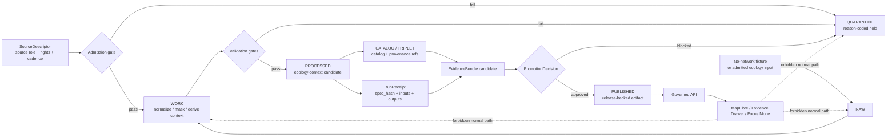

<!-- [KFM_META_BLOCK_V2]
doc_id: kfm://doc/TODO-uuid-pipelines-ecology-readme
title: Ecology Pipeline
type: standard
version: v1
status: draft
owners: TODO(verify pipeline/ecology owner or CODEOWNERS)
created: 2026-04-29
updated: 2026-04-29
policy_label: TODO(verify public|restricted)
related: [../../README.md, ../README.md, ../habitat_layer_build/README.md, ../kansas_biodiversity_etl/README.md, ../../data/README.md, ../../policy/README.md, ../../schemas/README.md]
tags: [kfm, pipelines, ecology, biodiversity, remote-sensing, evidence]
notes: [doc_id owners and policy_label require repository verification, replaces empty placeholder README, hls_landsat_ingest.py behavior remains unknown until implemented and tested]
[/KFM_META_BLOCK_V2] -->

# Ecology Pipeline

Ecology-context pipeline boundary for turning public-safe ecological and remote-sensing inputs into reviewable KFM artifacts without bypassing evidence, policy, sensitivity, or publication gates.


| Field | Value |
|---|---|
| **Status** | `draft` / `experimental` |
| **Owners** | `TODO(verify pipeline/ecology owner or CODEOWNERS)` |
| **Path** | `pipelines/ecology/README.md` |
| **Document role** | Directory README for the ecology pipeline lane and its current `hls_landsat_ingest.py` placeholder |
| **Current evidence boundary** | `CONFIRMED`: public `main` exposes `README.md` and `hls_landsat_ingest.py` in this directory. `NEEDS VERIFICATION`: active checkout, script behavior, package runner, CI wiring, source descriptors, and emitted artifacts. |
| **Quick jumps** | [Scope](#scope) · [Repo fit](#repo-fit) · [Accepted inputs](#accepted-inputs) · [Exclusions](#exclusions) · [Directory tree](#directory-tree) · [Pipeline contract](#minimum-ecology-pipeline-contract) · [Quickstart](#quickstart) · [Diagram](#diagram) · [Validation gates](#validation-gates) · [Task list](#task-list--definition-of-done) · [FAQ](#faq) · [Appendix](#appendix) |

> [!IMPORTANT]
> This directory is **not** a publication grant and not a public ecology truth surface.
> It may prepare ecology-context candidates, dry-runs, and validation handoffs, but public release still requires governed evidence closure, policy decisions, review state, release manifest, and rollback references.

---

## Scope

`pipelines/ecology/` is the execution-facing home for ecology-context pipeline work that is broader than a single species-occurrence ETL and narrower than KFM-wide ecological doctrine.

It is intended for fixture-first and source-described processing of ecological context inputs such as remote-sensing products, vegetation-index context, land-cover context, ecological condition indicators, and other public-safe derivatives that may support later habitat, flora, fauna, agriculture, hydrology, or hazards interpretation.

### At a glance

| Question | Ecology pipeline answer |
|---|---|
| What is this lane allowed to do? | Prepare reviewable ecology-context artifacts from declared inputs, fixtures, source descriptors, and prior-stage lifecycle material. |
| What is this lane not allowed to do? | Publish sensitive locations, infer species presence from context alone, bypass rights review, or let a map layer stand in for evidence. |
| What is the current script status? | `hls_landsat_ingest.py` is present as a placeholder; runtime behavior remains `UNKNOWN` until implemented and tested. |
| What lifecycle invariant applies? | `RAW -> WORK / QUARANTINE -> PROCESSED -> CATALOG / TRIPLET -> PUBLISHED`. |
| What should fail closed? | Unknown rights, unknown sensitivity, missing source role, missing support scale, unresolved EvidenceRef, exact sensitive geometry, and unreviewed public release. |

### Lane boundaries

`ecology/` should coordinate with adjacent lanes instead of absorbing them.

| Adjacent lane | Relationship | Boundary rule |
|---|---|---|
| [`../habitat_layer_build/README.md`][habitat-pipeline] | Builds habitat layer candidates from governed habitat inputs. | Ecology may provide context dependencies; habitat layer claims still need habitat-specific source roles and gates. |
| [`../kansas_biodiversity_etl/README.md`][biodiversity-pipeline] | Handles Kansas biodiversity occurrence ETL and geoprivacy-heavy publication logic. | Ecology must not treat occurrence records as public ecological context unless biodiversity policy allows it. |
| [`../README.md`][pipelines-readme] | Defines the shared pipeline contract. | Ecology inherits pipeline lifecycle, no-network-first, evidence-closure, and no-public-raw-path rules. |

[Back to top](#ecology-pipeline)

---

## Repo fit

`pipelines/ecology/` sits under the governed execution surface. It should stay thin, reviewable, and subordinate to data lifecycle, schemas/contracts, policy, validation, release, and governed runtime surfaces.

### Upstream and adjacent surfaces

| Surface | Relationship | Status |
|---|---|---|
| [`../../README.md`][root-readme] | Root KFM identity, truth path, map/AI boundaries, and inspectable-claim posture. | `CONFIRMED` adjacent repo file; active-branch state still should be checked before merge. |
| [`../README.md`][pipelines-readme] | Parent pipeline rules, lifecycle map, accepted inputs, exclusions, validation gates, and definition of done. | `CONFIRMED` adjacent repo file. |
| [`../../data/README.md`][data-readme] | Lifecycle storage, registry, fixtures, raw/work/quarantine/processed/catalog/proofs/published boundaries. | `CONFIRMED` adjacent repo file. |
| [`../../policy/README.md`][policy-readme] | Rights, sensitivity, release, source-role, review, and runtime decision logic. | `CONFIRMED` adjacent repo file. |
| [`../../schemas/README.md`][schemas-readme] | Parent schema lane and schema-home ambiguity guardrail. | `CONFIRMED` adjacent repo file; schema authority remains `NEEDS VERIFICATION`. |
| [`./hls_landsat_ingest.py`][script-placeholder] | Current ecology script placeholder. | `CONFIRMED` file name; behavior `UNKNOWN`. |

### Downstream consumers

| Consumer | Allowed relationship |
|---|---|
| Governed API | May consume only released or policy-safe artifacts with EvidenceBundle linkage. |
| MapLibre shell / Evidence Drawer | May display released ecology-context layers with source role, freshness, support scale, review state, policy state, and limitations. |
| Focus Mode / governed AI | May synthesize only over released, evidence-resolved, policy-checked context; it must abstain or deny otherwise. |
| Habitat, flora, fauna, agriculture, hydrology, hazards lanes | May consume ecology-context artifacts as dependencies, never as silent replacement truth. |

> [!WARNING]
> Public clients and routine UI surfaces must not read this pipeline’s `RAW`, `WORK`, `QUARANTINE`, local scratch outputs, or unpublished candidates directly.

[Back to top](#ecology-pipeline)

---

## Accepted inputs

Inputs belong here only when they can be described, reproduced, validated, and reviewed.

| Input class | Belongs here when… | Required posture |
|---|---|---|
| `SourceDescriptor` / source intake records | The pipeline needs source role, source family, rights, cadence, access posture, and activation state. | Required before live source activation. |
| No-network fixtures | The lane needs a small reproducible test before live fetching or broad processing. | Preferred first slice. |
| Public-safe remote-sensing or ecology-context samples | The sample is clipped, synthetic, already admitted, or fixture-bounded. | Must include CRS, support scale, temporal scope, checksum, and source role. |
| Prior-stage lifecycle artifacts | The pipeline consumes governed `RAW`, `WORK`, `QUARANTINE`, or `PROCESSED` material through declared paths. | Must preserve stage provenance and not upgrade release state by placement. |
| Build configuration | The run defines AOI, time window, transform, masks, index family, output family, and dependency refs. | Must be versioned or hashable where practical. |
| Validation and review records | The run needs to show why a candidate passed, failed, generalized, or stayed in quarantine. | Must use stable outcomes and reason codes. |
| Redaction or generalization receipts | A transform reduces or withholds sensitive precision. | Required before any public-safe derivative can claim a sensitivity transform. |

### Minimum source fields

```json
{
  "source_id": "TODO-verify-source-id",
  "source_family": "remote_sensing_context | land_cover_context | ecology_fixture | TODO",
  "source_role": "context | observation | model | derived | generalized | TODO",
  "retrieved_at": "ISO8601-or-fixture-created-at",
  "rights_posture": "TODO-verify",
  "sensitivity_posture": "TODO-verify",
  "crs": "TODO-verify",
  "temporal_scope": "TODO-verify",
  "support_resolution": "TODO-verify",
  "publication_intent": "dry_run_only | candidate | TODO"
}
```

> [!NOTE]
> A source being public or machine-readable does not make it automatically publishable. Rights, sensitivity, source role, temporal support, spatial support, and review state still control release.

[Back to top](#ecology-pipeline)

---

## Exclusions

Do not put these in `pipelines/ecology/`.

| Excluded item | Why it does not belong | Put it here instead |
|---|---|---|
| Raw source dumps, archives, rasters, or bulk provider payloads | Lifecycle storage belongs outside executable pipeline definitions. | `../../data/raw/` after source intake. |
| Work-in-progress transformed artifacts as durable truth | Pipeline scratch output is not public evidence. | `../../data/work/` or `../../data/quarantine/`. |
| Released public artifacts or public aliases | Publication is a governed transition, not a folder copy. | `../../release/` and release-backed `../../data/published/` surfaces. |
| Secrets, API keys, cookies, tokens, private service URLs | Pipeline definitions must remain safe to review. | Secret manager or deployment configuration outside repo-visible docs. |
| Canonical schema definitions embedded only in this lane | Schemas must remain reusable and validator-addressable. | `../../schemas/` or `../../contracts/` after schema-home decision. |
| Policy allow/deny semantics hidden in script conditionals | Policy must stay inspectable, testable, and deny-by-default. | `../../policy/` plus tests. |
| Biodiversity occurrence publication | Occurrence records carry geoprivacy, rights, and steward-access burdens. | [`../kansas_biodiversity_etl/README.md`][biodiversity-pipeline] and domain policy. |
| Habitat layer publication | Habitat candidates require habitat-specific support, source-role, and release checks. | [`../habitat_layer_build/README.md`][habitat-pipeline]. |
| Exact sensitive species, rare-plant, nest, den, roost, archaeological, cultural, or steward-controlled locations | Exact public exposure can create ecological, cultural, legal, or institutional harm. | Restricted steward lanes, redaction/generalization transforms, or `../../data/quarantine/`. |
| UI popups, MapLibre styles, or public API routes | Public clients should consume governed release-safe payloads, not pipeline internals. | `../../apps/`, `../../packages/`, and governed API contracts after verification. |
| Free-form AI summaries as pipeline output truth | AI is interpretive and cannot manufacture evidence or release state. | Governed AI runtime envelopes after EvidenceBundle and policy checks. |

[Back to top](#ecology-pipeline)

---

## Directory tree

### Current checked-in baseline

```text
pipelines/ecology/
├── README.md              # placeholder being replaced by this document
└── hls_landsat_ingest.py  # placeholder; behavior UNKNOWN until implemented and tested
```

### Proposed implementation shape

The shape below is a target layout only. Do not create or rename files until the active checkout, package runner, and repo conventions are verified.

```text
pipelines/ecology/
├── README.md
├── hls_landsat_ingest.py
├── config/
│   └── ecology_context.example.yaml
├── fixtures/
│   ├── good/
│   │   └── ecology_context_candidate.valid.json
│   └── bad/
│       ├── missing_source_role.invalid.json
│       ├── missing_support_resolution.invalid.json
│       ├── unknown_rights.invalid.json
│       └── exact_sensitive_geometry.invalid.json
├── harvest/
│   └── README.md
├── normalize/
│   └── README.md
├── validate/
│   └── README.md
├── emit/
│   └── README.md
└── outputs/
    └── .gitkeep           # working output only; public release belongs outside this lane
```

### Placement rule

If executable code belongs in a central package or tool directory after active-checkout inspection, keep this README as the lane index and move implementation to the confirmed package home. Do not let a convenient script location become a hidden contract authority.

[Back to top](#ecology-pipeline)

---

## Minimum ecology pipeline contract

Every ecology pipeline run should be able to answer these questions before it can support a public-facing claim.

| Contract question | Required answer |
|---|---|
| What lifecycle transition is attempted? | Example: `RAW -> WORK`, `WORK -> PROCESSED`, or `PROCESSED -> CATALOG_CANDIDATE`. |
| What source role is being used? | Context, observation, model, derived, generalized, steward-reviewed, or other typed role. |
| What spatial support applies? | CRS, extent, support resolution, geometry validity, nodata/mask rules, and precision class. |
| What temporal support applies? | Observed time, source time, valid time, retrieval time, or product time window. |
| What evidence supports visible claims? | `EvidenceRef -> EvidenceBundle` closure or explicit `ABSTAIN` / `DENY` / `ERROR`. |
| Which policies apply? | Rights, sensitivity, source-role, publication, no-bypass, correction, and rollback policy refs. |
| What does the run emit? | `RunReceipt`, `ValidationReport`, candidate `LayerManifest`, catalog refs, and rollback/correction refs where applicable. |
| What is the finite outcome? | `PASS`, `HOLD`, `QUARANTINE`, `ABSTAIN`, `DENY`, or `ERROR`. |

### Illustrative manifest shape

```yaml
# ILLUSTRATIVE EXAMPLE — PROPOSED, not confirmed repo schema
pipeline_id: ecology_context_dryrun
status: proposed
owner: TODO(verify pipeline/ecology owner)
network: disabled
publication_performed: false

lifecycle_transition:
  from: RAW
  to: PROCESSED_CANDIDATE

source_descriptors:
  - data/registry/sources/ecology/TODO.source.json

schemas:
  - schemas/contracts/v1/source/source_descriptor.schema.json
  - schemas/contracts/v1/evidence/evidence_bundle.schema.json
  - schemas/contracts/v1/policy/decision_envelope.schema.json
  - schemas/contracts/v1/release/release_manifest.schema.json

policies:
  - policy/source_role.rego
  - policy/rights.rego
  - policy/sensitivity.rego
  - policy/public_boundary.rego

fixtures:
  valid:
    - pipelines/ecology/fixtures/good/ecology_context_candidate.valid.json
  invalid:
    - pipelines/ecology/fixtures/bad/unknown_rights.invalid.json
    - pipelines/ecology/fixtures/bad/exact_sensitive_geometry.invalid.json

emits:
  receipts:
    - RunReceipt
    - ValidationReport
    - PolicyDecision
  candidates:
    - LayerManifest
    - CatalogRefs
    - RollbackReference

outcomes:
  - PASS
  - HOLD
  - QUARANTINE
  - ABSTAIN
  - DENY
  - ERROR
```

[Back to top](#ecology-pipeline)

---

## Quickstart

These commands are safe orientation commands. They do not prove runtime readiness.

### 1. Inspect the active checkout

```bash
# Run from repository root.
git status --short
git branch --show-current

# Confirm the current ecology lane contents.
find pipelines/ecology -maxdepth 2 -type f | sort
wc -l pipelines/ecology/README.md pipelines/ecology/hls_landsat_ingest.py
```

### 2. Check placeholder status without running a live ingest

```python
from pathlib import Path

required = [
    Path("pipelines/ecology/README.md"),
    Path("pipelines/ecology/hls_landsat_ingest.py"),
]

for path in required:
    if not path.exists():
        raise SystemExit(f"missing required ecology lane file: {path}")
    print(f"{path}: {path.stat().st_size} bytes")

print("Ecology lane inventory check complete. Runtime behavior still requires implementation evidence.")
```

### 3. Do not run live fetches until gates are ready

```bash
# PROPOSED ONLY — replace with repo-native command after implementation.
# The first real command should be fixture-first and no-network.
python pipelines/ecology/hls_landsat_ingest.py --dry-run --no-network
```

> [!WARNING]
> Do not run live remote-sensing harvests, bulk raster processing, broad tile generation, public release, or destructive cleanup until source descriptors, rights, endpoint behavior, credentials, sensitivity policy, rollback, and CI expectations are verified.

[Back to top](#ecology-pipeline)

---

## Diagram



The critical boundary is between `PROCESSED` and `PUBLISHED`: this lane may prepare candidates, receipts, validation reports, and evidence refs, but it does not make the release decision by itself.

[Back to top](#ecology-pipeline)

---

## Validation gates

| Gate | Required evidence | Fail-closed outcome |
|---|---|---|
| Source admission | Descriptor exists; source role, rights, cadence, access posture, and activation state are declared. | `HOLD`, `QUARANTINE`, or `DENY`. |
| Rights | License, source terms, attribution, redistribution posture, and access class are known. | Block public release. |
| Sensitivity | Exact-location, rare-species, restricted, steward-controlled, cultural, or critical exposure is classified. | Redact, generalize, restrict, embargo, quarantine, or deny. |
| Source-role semantics | Context layers, observations, modeled surfaces, detections, and derived products stay distinct. | Abstain or deny unsupported claims. |
| Spatial support | CRS, extent, geometry/raster validity, support resolution, nodata/masks, and precision class are explicit. | Hold in `WORK` or `QUARANTINE`. |
| Temporal support | Observation/product/retrieval/valid-time windows are explicit. | Hold or abstain. |
| Evidence closure | Consequential claims resolve from `EvidenceRef` to `EvidenceBundle`. | Runtime must `ABSTAIN`, `DENY`, or `ERROR`. |
| Catalog/proof closure | Catalog refs, provenance refs, validation reports, receipts, release candidate refs, and rollback refs cross-link. | Block promotion. |
| Public boundary | No public route reads `RAW`, `WORK`, `QUARANTINE`, or unpublished candidates. | Block release. |
| Correction readiness | Supersession, rollback, or withdrawal target is recorded when an artifact can affect public claims. | Block promotion or mark candidate `HOLD`. |

[Back to top](#ecology-pipeline)

---

## Operating tables

### Ecology source-role guardrails

| Source role | Can support | Cannot support |
|---|---|---|
| `remote_sensing_context` | Contextual environmental condition, change, or index claims when source/time/support are clear. | Species presence, legal habitat designation, or exact ecological cause by itself. |
| `land_cover_context` | Landscape class context and coarse habitat-adjacent interpretation. | Occurrence proof, habitat preference truth, or regulatory status. |
| `vegetation_index_context` | Vegetation condition or anomaly context with limitations visible. | Field-confirmed ecological condition without corroborating evidence. |
| `modeled_ecology_context` | Model-bounded context where model identity, parameters, limitations, and validation are visible. | Observation truth, regulatory claims, or exact public location claims. |
| `generalized_public_derivative` | Public-safe summarized or generalized context after transform receipt. | Restricted exact geometry, steward-only evidence, or hidden sensitive-source reconstruction. |
| `biodiversity_occurrence_dependency` | Dependency linkage to governed occurrence records when biodiversity policy allows. | Direct public exposure or inferred habitat truth without occurrence-lane gates. |

### Current file responsibilities

| File | Current role | Required next evidence |
|---|---|---|
| `README.md` | Directory contract and review surface. | Replace placeholder with this README and verify active branch. |
| `hls_landsat_ingest.py` | Placeholder for a possible HLS/Landsat-style ecology ingest or dry-run runner. | Source descriptor, no-network fixture, runner convention, tests, receipts, and policy gates before use. |

### Candidate output contract

| Field | Required? | Why it matters |
|---|---:|---|
| `ecology_candidate_id` | Yes | Stable candidate reference for review and rollback. |
| `source_descriptor_refs` | Yes | Evidence, rights, and source-role traceability. |
| `source_roles` | Yes | Prevents semantic role collapse. |
| `input_artifact_refs` | Yes | Supports rebuild and rollback. |
| `spec_hash` | Yes | Deterministic identity for transform configuration. |
| `crs` | Yes | Spatial correctness. |
| `extent` | Yes | Spatial scope. |
| `temporal_scope` | Yes | Time-aware claim boundary. |
| `support_resolution` | Yes | Prevents overclaiming precision. |
| `limitations` | Yes | Evidence Drawer and API disclosure. |
| `validation_report_ref` | Yes | Gate auditability. |
| `run_receipt_ref` | Yes | Process memory. |
| `catalog_refs` | When release candidate | Catalog closure. |
| `evidence_bundle_ref` | When release candidate | Claim traceability. |
| `rollback_ref` | When superseding or publishing | Reversible change. |

[Back to top](#ecology-pipeline)

---

## Task list & definition of done

### Merge readiness checklist

- [ ] Active checkout inspected; branch, file sizes, package runner, and target path verified.
- [ ] `doc_id`, owners, policy label, and related links resolved or deliberately left as reviewed placeholders.
- [ ] `hls_landsat_ingest.py` is either documented as placeholder-only or implemented with no-network dry-run support.
- [ ] Source descriptors exist for every source family used by an ecology run.
- [ ] Good and bad fixtures are present, public-safe, no-network, and small enough for review.
- [ ] Negative tests cover unknown rights, missing source role, missing support resolution, exact sensitive geometry, and unresolved EvidenceRef.
- [ ] The pipeline emits or simulates `RunReceipt`, `ValidationReport`, `PolicyDecision`, and candidate manifest refs.
- [ ] No live source activation occurs without rights, endpoint, cadence, attribution, and source-role verification.
- [ ] No public UI/API route reads pipeline internals, `RAW`, `WORK`, `QUARANTINE`, or unpublished candidates.
- [ ] Candidate handoff does not auto-publish or mutate public aliases.
- [ ] Parent [`../README.md`][pipelines-readme] is updated if pipeline family names, commands, gates, or directory shape change.
- [ ] Rollback and correction behavior is documented for any output that can supersede prior candidates.

### Definition of done

This README is ready when a maintainer can inspect `pipelines/ecology/` and quickly determine:

1. what this lane is allowed to process;
2. what `hls_landsat_ingest.py` is allowed or not yet allowed to do;
3. what inputs are acceptable;
4. where outputs belong;
5. which gates block release;
6. what remains unverified;
7. how an ecology-context artifact becomes reviewable evidence instead of an unsupported map or model-derived assertion.

[Back to top](#ecology-pipeline)

---

## FAQ

### Is `pipelines/ecology/` the canonical ecology truth source?

No. It is an execution lane for candidate processing and dry-run evidence. Canonical authority remains with source descriptors, schemas/contracts, policy, catalog/proof objects, review records, and release state.

### Can this lane publish ecological layers?

Not directly. This lane may prepare candidates and proof inputs. Publication requires governed promotion, evidence closure, policy decisions, review state, release manifest, and rollback reference.

### Can `hls_landsat_ingest.py` fetch live sources?

`NEEDS VERIFICATION`. Treat it as placeholder-only until it has a source descriptor, fixture-first dry-run, rights and endpoint verification, no-secret handling, tests, and receipts.

### Can remote sensing prove species presence?

No. Remote-sensing context can help frame ecological interpretation, but species presence, rare-species exposure, occurrence evidence, and steward-controlled data require separate evidence and policy gates.

### Can MapLibre read this pipeline’s work outputs?

No. MapLibre and ordinary UI surfaces should consume governed release-safe artifacts through governed APIs or released layer manifests, never this lane’s `RAW`, `WORK`, `QUARANTINE`, or unpublished candidates.

### What happens if a sensitive input is discovered after processing?

The affected candidate should be held, quarantined, redacted, generalized, restricted, or denied. Any public or semi-public artifact already affected should receive correction, withdrawal, rollback, or supersession handling.

[Back to top](#ecology-pipeline)

---

## Appendix

### Review prompt for ecology pipeline PRs

Use this during review:

```text
Does this ecology pipeline preserve RAW -> WORK / QUARANTINE -> PROCESSED -> CATALOG / TRIPLET -> PUBLISHED?

Does it declare:
- source role,
- rights posture,
- sensitivity posture,
- lifecycle transition,
- input and output homes,
- schemas,
- policies,
- fixtures,
- receipts,
- evidence closure,
- support resolution,
- temporal scope,
- rollback target,
- and finite failure outcomes?

Does it avoid:
- direct public reads from RAW / WORK / QUARANTINE,
- live fetch without descriptor and rights review,
- publication without promotion,
- treating remote-sensing context as species presence proof,
- treating occurrence records as habitat truth,
- AI or renderer ownership of truth,
- secret leakage,
- unsupported precision,
- and silent overwrites of correction history?
```

### Glossary

| Term | Meaning |
|---|---|
| `SourceDescriptor` | Declares source identity, role, rights, cadence, support, activation state, and citation obligations. |
| `EvidenceRef` | A reference that must resolve to an `EvidenceBundle` before consequential claims are exposed. |
| `EvidenceBundle` | Inspectable support package for claims, layers, Focus outputs, exports, or review actions. |
| `PolicyDecision` | Decision record for rights, sensitivity, release eligibility, obligations, or denial. |
| `RunReceipt` | Process memory for a pipeline run: inputs, versions, hashes, tools, outcomes, and timestamps. |
| `ValidationReport` | Machine or reviewer-readable result of schema, policy, source-role, spatial, temporal, or catalog checks. |
| `LayerManifest` | Map-layer contract that connects data source, meaning, evidence route, freshness, policy, and review state. |
| `ReleaseManifest` | Release-facing manifest that binds promoted artifacts, digests, evidence, and rollback/correction references. |
| `RedactionReceipt` | Record of a precision-reducing, withholding, generalization, or public-safety transform. |
| `spec_hash` | Deterministic identity over declared source, schema, transform, policy, and parameter inputs where practical. |

---

[root-readme]: ../../README.md
[pipelines-readme]: ../README.md
[data-readme]: ../../data/README.md
[policy-readme]: ../../policy/README.md
[schemas-readme]: ../../schemas/README.md
[habitat-pipeline]: ../habitat_layer_build/README.md
[biodiversity-pipeline]: ../kansas_biodiversity_etl/README.md
[script-placeholder]: ./hls_landsat_ingest.py
