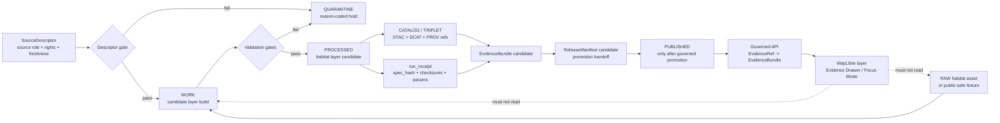

<!-- [KFM_META_BLOCK_V2]
doc_id: kfm://doc/NEEDS_VERIFICATION__pipelines_habitat_layer_build_readme
title: Habitat Layer Build Pipeline
type: standard
version: v1
status: draft
owners: @bartytime4life; NEEDS_VERIFICATION__habitat_layer_build_leaf_owner
created: NEEDS_VERIFICATION__YYYY-MM-DD
updated: 2026-04-25
policy_label: NEEDS_VERIFICATION__public_or_internal
related: [../../README.md, ../README.md, ../../docs/architecture/habitat/HABITAT_CONTROL_PLANE_INDEX.md, ../../docs/architecture/habitat/ADR-0001-habitat-schema-home.md, ../../data/registry/habitat/, ../../schemas/contracts/v1/habitat/, ../../contracts/habitat/, ../../policy/habitat/, ../../tests/habitat/, ../../data/receipts/habitat/, ../../data/proofs/habitat/, ../../data/catalog/stac/habitat/]
tags: [kfm, pipelines, habitat, layer-build, evidence-first, map-first, source-descriptor, proof, validation]
notes: [Drafted from attached KFM habitat, pipeline, MapLibre UI, and documentation-control doctrine. Target repo was not mounted in this session; exact doc_id, creation date, policy label, leaf owner, schema home, executable entrypoints, fixtures, and CI wiring remain NEEDS VERIFICATION before merge.]
[/KFM_META_BLOCK_V2] -->

<a id="top"></a>

# Habitat Layer Build Pipeline

Builds **reviewable habitat layer candidates** from governed habitat inputs without bypassing source roles, validation, catalog closure, release review, or EvidenceBundle-backed publication.

> [!NOTE]
> **Status:** `experimental`  
> **Owners:** `@bartytime4life` *(broad surfaced owner; leaf ownership NEEDS VERIFICATION)*  
> **Path:** `pipelines/habitat_layer_build/README.md`  
> **Repo fit:** child pipeline README under [`../README.md`](../README.md), scoped to habitat layer candidate construction and handoff into governed catalog / proof / release surfaces  
> **Quick jumps:** [Scope](#scope) · [Repo fit](#repo-fit) · [Accepted inputs](#accepted-inputs) · [Exclusions](#exclusions) · [Directory tree](#directory-tree) · [Quickstart](#quickstart) · [Usage](#usage) · [Diagram](#diagram) · [Operating tables](#operating-tables) · [Task list](#task-list--definition-of-done) · [FAQ](#faq) · [Appendix](#appendix)


> [!IMPORTANT]
> This README describes a **pipeline boundary**, not a publication grant. A habitat layer candidate is not public truth until the relevant source roles, rights, sensitivity checks, validation reports, catalog objects, proof objects, review records, release manifests, and rollback references are present and accepted by the governed promotion path.

> [!WARNING]
> This path name is import-safe for Python-style modules, but the actual repo language stack, package manager, test runner, and entrypoint conventions remain **NEEDS VERIFICATION** until inspected in a mounted checkout.

[Back to top](#top)

---

## Scope

`pipelines/habitat_layer_build/` is for the lane-local work that turns already admitted or fixture-bounded habitat inputs into **candidate layer artifacts** that can be validated, cataloged, reviewed, and handed off to release machinery.

It is not a standalone source connector, not a policy engine, not a public tile server, and not an authority surface for habitat claims.

| At a glance | Meaning |
|---|---|
| **Primary job** | Produce validated habitat layer candidates and build receipts from governed inputs. |
| **Truth posture** | Habitat layer build behavior is `PROPOSED` until repo code, tests, and CI prove it. |
| **Canonical invariant** | `RAW -> WORK / QUARANTINE -> PROCESSED -> CATALOG / TRIPLET -> PUBLISHED`. |
| **Publication posture** | This pipeline can prepare release candidates; promotion remains a separate governed transition. |
| **UI posture** | MapLibre / Evidence Drawer consumers must read released artifacts through governed APIs, not this pipeline’s work area. |

A good run from this lane should answer four review questions:

1. Which source descriptor and source role produced the layer candidate?
2. Which inputs, parameters, support resolution, CRS, temporal scope, and masks shaped the output?
3. Which validation, catalog, proof, and policy gates passed or failed?
4. Which release, correction, or rollback object would be affected downstream?

[Back to top](#top)

---

## Repo fit

`pipelines/habitat_layer_build/` sits inside the execution family. It should stay narrow: build the layer candidate, emit machine-readable proof inputs, and stop before publication.

### Upstream and adjacent surfaces

| Surface | Relationship | Use it for |
|---|---|---|
| [`../README.md`](../README.md) | Parent execution-family index | Pipeline placement, shared execution expectations, sibling lane discovery |
| `../../docs/architecture/habitat/` | Habitat control plane | Habitat doctrine, continuity inventory, preservation matrix, compatibility map, schema-home ADR |
| `../../data/registry/habitat/` | Source registry | Source descriptors, source roles, rights, steward review, freshness expectations |
| `../../schemas/contracts/v1/habitat/` or `../../contracts/habitat/` | Machine-contract home | Schema validation after schema-home authority is resolved |
| `../../policy/habitat/` | Policy-as-code boundary | Deny modeled-as-critical, deny missing rights, deny sensitive exact public outputs |
| `../../tests/habitat/` | Verification boundary | Fixture tests, negative tests, no-regression tests, evidence-closure tests |
| `../../data/raw/habitat/` | Raw habitat assets | Original admitted source files and fixture subsets; never public runtime input |
| `../../data/work/habitat_layer_build/` | Candidate scratch area | Temporary build products and validation reports |
| `../../data/processed/habitat/` | Processed habitat artifacts | Normalized or clipped habitat surfaces after validation |
| `../../data/catalog/stac/habitat/` | Catalog closure | STAC records for released or candidate artifacts where applicable |
| `../../data/receipts/habitat/` | Process memory | Run receipts, validation reports, transform receipts, correction / rollback receipts |
| `../../data/proofs/habitat/` | Proof memory | EvidenceBundles, release proof packs, release-scoped verification outputs |

### Downstream consumers

| Consumer | Allowed relationship |
|---|---|
| Governed API | May read **published / release-safe** habitat artifacts and resolve EvidenceRef to EvidenceBundle. |
| MapLibre layer registry | May reference released layer manifests; must preserve source-role and evidence metadata. |
| Evidence Drawer | May display claim, citation, freshness, rights, review, policy, provenance, and correction state. |
| Focus Mode / AI summaries | May summarize only after evidence resolution and policy checks; never treats layer output as root truth. |
| Release / promotion gate | Owns publication, rollback, correction, and public availability. |

[Back to top](#top)

---

## Accepted inputs

Only admit inputs that keep the build reproducible and reviewable.

| Input | Belongs here when | Required minimum |
|---|---|---|
| Source descriptor references | The source is registered and has an explicit role | `source_id`, `source_role`, rights, steward / owner, freshness, access posture |
| Processed habitat surfaces | The upstream artifact is already normalized or fixture-bounded | CRS, extent, support resolution, product version, checksums, provenance |
| Fixture habitat assets | The fixture is small, public-safe, no-network, and intentionally synthetic or clipped | Fixture label, purpose, expected output, invalid-case pair where useful |
| Build configuration | The config controls a candidate build without hiding policy decisions | AOI, time window, source refs, output family, transform params, support scale |
| Validation reports | The report is machine-readable and tied to the candidate run | outcome, failure reasons, spec hash, source refs, validator version |
| Review records | The build requires steward or release review before downstream use | reviewer, date, scope, decision, limitations, unresolved items |
| Dependency manifests | The candidate uses released or authorized upstream dependencies | dependency refs, release refs, source roles, policy labels |

> [!TIP]
> Prefer **one small, no-network fixture build** before any live source activation. The first useful habitat layer build does not need broad coverage; it needs traceability, failure cases, and rollback clarity.

[Back to top](#top)

---

## Exclusions

These are intentionally out of scope for `pipelines/habitat_layer_build/`.

| Do not put here | Put it instead | Reason |
|---|---|---|
| Live source fetching, crawling, scraping, or credentialed API access | Source-specific connector or watcher lane, plus `data/registry/habitat/` | Fetching and building are different governance responsibilities. |
| Raw upstream rasters, archives, or source dumps | `../../data/raw/habitat/` | Raw assets must stay lifecycle-bound and non-public. |
| Canonical habitat truth claims | Shared contracts, catalog records, EvidenceBundles, and release review surfaces | A build output is evidence-bearing material, not sovereign truth. |
| Policy overrides or allow / deny decisions | `../../policy/habitat/` and promotion gate | Policy must remain inspectable and fail-closed. |
| Public MapLibre style, UI component, or API route code | UI / API package lanes | Public clients should consume governed released artifacts, not work products. |
| AI-generated habitat explanations | Governed AI / Focus Mode path after EvidenceBundle resolution | AI is interpretive; it cannot manufacture authority. |
| Exact sensitive occurrence geometry | Restricted fauna/flora data lanes and policy-gated outputs | Habitat layers must not leak protected species or steward-controlled locations. |
| Auto-promotion or silent publication | Release / promotion lane | Promotion is a governed state transition, not a file move. |
| Broad habitat doctrine | `../../docs/architecture/habitat/` | This README is an execution-facing guide, not the master architecture manual. |

> [!CAUTION]
> If this pipeline emits public-facing tiles, MapLibre styles, or API responses without a separate release decision, it has crossed out of its intended boundary.

[Back to top](#top)

---

## Directory tree

The tree below is a **PROPOSED expected shape** for this lane. It should be reconciled with the real repo before files are created or renamed.

```text
pipelines/
└── habitat_layer_build/
    ├── README.md
    ├── config/
    │   └── layer_build.example.yaml
    ├── fixtures/
    │   ├── good/
    │   │   └── habitat_layer_candidate.valid.json
    │   └── bad/
    │       ├── missing_source_role.invalid.json
    │       ├── modeled_as_critical.invalid.json
    │       └── missing_support_resolution.invalid.json
    ├── jobs/
    │   └── build_habitat_layer.py              # NEEDS VERIFICATION: repo-native language / entrypoint
    ├── validate/
    │   └── validate_layer_candidate.py         # NEEDS VERIFICATION: repo-native validator placement
    ├── emit/
    │   ├── write_catalog_refs.py
    │   ├── write_layer_manifest.py
    │   └── write_run_receipt.py
    ├── tests/
    │   └── test_habitat_layer_build.py
    └── outputs/
        └── .gitkeep                            # working output only; public release lives under data/
```

### Placement rule

Executable code may live here only if the mounted repo confirms pipeline-local modules are normal. If the repo centralizes packages under `packages/`, `tools/`, or another runner, keep this README as the lane index and move implementation to the confirmed package home with a compatibility note.

[Back to top](#top)

---

## Quickstart

These commands are **PROPOSED command shapes**, not confirmed runnable entrypoints. Replace them with repo-native commands after inspecting package files, test configuration, and CI conventions.

```bash
# 1. Confirm you are in the repository root.
git status --short

# 2. Inspect the pipeline lane and adjacent governance surfaces.
find pipelines/habitat_layer_build docs/architecture/habitat data/registry/habitat policy/habitat tests/habitat \
  -maxdepth 3 -type f 2>/dev/null | sort

# 3. Validate the example config and fixtures.
python -m pipelines.habitat_layer_build.validate.validate_layer_candidate \
  --config pipelines/habitat_layer_build/config/layer_build.example.yaml \
  --fixtures pipelines/habitat_layer_build/fixtures

# 4. Run the no-network fixture build.
python -m pipelines.habitat_layer_build.jobs.build_habitat_layer \
  --config pipelines/habitat_layer_build/config/layer_build.example.yaml \
  --mode fixture \
  --out data/work/habitat_layer_build/runs/NEEDS_VERIFICATION_RUN_ID

# 5. Inspect emitted proof inputs.
jq . data/receipts/habitat/layer_build/NEEDS_VERIFICATION_RUN_ID/run_receipt.json
jq . data/work/habitat_layer_build/runs/NEEDS_VERIFICATION_RUN_ID/layer_manifest.candidate.json
```

Expected posture:

| Step | Expected result |
|---|---|
| Repo scan | Confirms actual file homes or marks them `UNKNOWN`. |
| Fixture validation | Good fixtures pass; bad fixtures fail with explicit reason codes. |
| Build | Emits work products only; does not publish. |
| Receipt inspection | Shows source refs, spec hash, validator results, limitations, and output refs. |
| Handoff | Candidate artifacts are ready for catalog / proof / release review. |

[Back to top](#top)

---

## Usage

### 1. Register source role before building

Every candidate layer needs a source role. Source role is not cosmetic; it determines what claims the layer may support.

Examples of habitat source roles:

| Source role | Can support | Cannot support |
|---|---|---|
| `regulatory_critical_habitat` | Designated critical habitat claims when source, date, and review state pass | Species occurrence, modeled suitability, or field observation claims |
| `modeled_habitat` | Modeled context with limitations, version, support, and uncertainty | Regulatory critical-habitat claims |
| `land_cover_context` | Land-cover or landscape class context | Species presence / absence or habitat preference truth |
| `habitat_community_context` | Ecological system / community context | Legal designation or exact occurrence claims |
| `restoration_or_stewardship_context` | Public restoration / stewardship context after rights review | Habitat condition claims without evidence |

### 2. Build a candidate layer

A build should preserve input identity and derivation parameters.

Required build facts:

- `source_descriptor_ref`
- `source_role`
- `input_artifact_refs`
- `aoi_ref`
- `temporal_scope`
- `crs`
- `support_resolution`
- `transform_method`
- `transform_params`
- `spec_hash`
- `limitations`
- `policy_label`
- `review_state`

### 3. Validate before handoff

Validation should fail closed when required evidence is absent.

Minimum gates:

| Gate | Blocks when |
|---|---|
| Source descriptor gate | Source role, rights, owner, freshness, or endpoint posture is missing. |
| Geometry / raster gate | CRS, extent, support resolution, nodata / mask handling, or checksum is missing. |
| Role semantics gate | Modeled habitat is used as critical habitat, or occurrence points are treated as habitat boundaries. |
| Catalog closure gate | STAC / DCAT / PROV or equivalent refs are missing where required. |
| Public-safety gate | Exact sensitive geometry or uncertain rights would leak into public output. |
| Runtime envelope gate | Candidate lacks evidence refs needed by governed API / Evidence Drawer. |

### 4. Emit proof inputs, not publication

This lane may emit:

- `run_receipt.json`
- `validation_report.json`
- `layer_manifest.candidate.json`
- `catalog_refs.candidate.json`
- `dependency_manifest.json`
- `build_summary.md`
- candidate processed artifacts under `data/work/` or `data/processed/`

It must not directly emit:

- public release manifests
- public API responses
- public MapLibre style changes
- publication aliases
- final EvidenceBundle acceptance without release review

[Back to top](#top)

---

## Diagram



The important boundary is the handoff between `PROCESSED` and `PUBLISHED`: this pipeline prepares material for review, but does not make the public release decision.

[Back to top](#top)

---

## Operating tables

### Lifecycle responsibility matrix

| Lifecycle stage | This pipeline’s role | Output family | Public by default? |
|---|---|---|---|
| `RAW` | Read admitted fixture / source refs only | Source refs, checksums | No |
| `WORK` | Build candidate layer | Scratch artifacts, candidate reports | No |
| `QUARANTINE` | Route invalid or denied candidates with reason codes | Quarantine notes, failure reports | No |
| `PROCESSED` | Emit validated candidate artifacts | Processed candidate layer, spec hash | No |
| `CATALOG / TRIPLET` | Prepare catalog and lineage refs | STAC / DCAT / PROV candidate refs | No, until release |
| `PUBLISHED` | Handoff only; promotion happens elsewhere | Release manifest, EvidenceBundle, layer manifest | Only after governed promotion |

### Source-role negative rules

| Rule | Required behavior |
|---|---|
| Critical habitat is not modeled habitat. | Deny or abstain if modeled habitat is used to answer a regulatory critical-habitat claim. |
| Occurrence points are not habitat boundaries. | Do not convert fauna/flora occurrences into habitat polygons or absence / presence truth. |
| Land cover is context. | It can support context claims, not species-habitat preference truth by itself. |
| Cross-domain fusion is derived. | Preserve all source refs and source roles; never erase provenance. |
| Most restrictive input wins. | Public output inherits the strongest rights / sensitivity / review constraint among dependencies. |
| Missing support scale blocks release. | Support resolution, temporal scope, and limitations must be visible. |

### Candidate output contract

| Field | Required | Why it matters |
|---|---:|---|
| `layer_candidate_id` | yes | Stable candidate reference for reports and review |
| `source_descriptor_refs` | yes | Evidence and rights traceability |
| `source_roles` | yes | Prevents semantic role collapse |
| `input_artifact_refs` | yes | Supports rebuild and rollback |
| `spec_hash` | yes | Deterministic identity for transform configuration |
| `crs` | yes | Spatial correctness |
| `extent` | yes | Spatial scope |
| `temporal_scope` | yes | Time-aware claim boundary |
| `support_resolution` | yes | Prevents overclaiming precision |
| `limitations` | yes | Evidence Drawer / API disclosure |
| `validation_report_ref` | yes | Gate auditability |
| `run_receipt_ref` | yes | Process memory |
| `catalog_refs` | when release candidate | Catalog closure |
| `evidence_bundle_ref` | when release candidate | Claim traceability |
| `rollback_ref` | when superseding or publishing | Reversible change |

[Back to top](#top)

---

## Task list & definition of done

### Merge readiness checklist

- [ ] Repo checkout inspected; branch, package manager, runner, and target path verified.
- [ ] `doc_id`, created date, policy label, and leaf owner resolved or deliberately left as reviewed placeholders.
- [ ] Schema-home ADR completed if both `contracts/` and `schemas/contracts/v1/` are in play.
- [ ] Source descriptors exist for every source family used by the build.
- [ ] Good and bad fixtures are present, public-safe, no-network, and small enough for review.
- [ ] Source-role negative tests cover modeled-as-critical, occurrence-as-boundary, missing rights, missing support resolution, and missing provenance.
- [ ] Build emits a `run_receipt`, `validation_report`, candidate layer manifest, and dependency manifest.
- [ ] Catalog closure is present or explicitly blocked with `ABSTAIN` / `DENY` reason codes.
- [ ] Candidate handoff does not auto-publish or mutate public aliases.
- [ ] Evidence Drawer payload requirements are represented in the candidate / release handoff.
- [ ] Rollback and correction behavior is documented for any output that can supersede an earlier candidate.
- [ ] Parent `../README.md` and habitat control-plane docs are updated if file families, commands, or gates change.

### Definition of done

This README is done when a maintainer can inspect the lane and quickly determine:

1. what this pipeline is allowed to build;
2. what it must not claim;
3. where inputs and outputs belong;
4. which gates block release;
5. what remains unverified;
6. how a candidate layer becomes reviewable evidence instead of an unsupported map.

[Back to top](#top)

---

## FAQ

### Is this pipeline the canonical habitat truth source?

No. It builds candidate artifacts from governed inputs. Canonical authority remains with the source registry, schemas/contracts, policy, catalog/proof objects, review records, and release state.

### Can this pipeline build critical habitat layers?

Only when the input source role is explicitly `regulatory_critical_habitat`, source terms and freshness are verified, and the candidate passes role, rights, geometry, catalog, proof, and promotion gates.

### Can modeled habitat answer “is this designated critical habitat?”

No. The correct finite outcome is `ABSTAIN` or `DENY`, with a reason such as `SOURCE_ROLE_MISMATCH`.

### Can this lane fetch NLCD, LANDFIRE, GAP, NatureServe, or USFWS data directly?

Not by default. Live source activation belongs behind source descriptors, source-specific rights / endpoint verification, and dry-run gates. This lane may consume admitted or fixture-bounded inputs.

### Can MapLibre read this pipeline’s `WORK` outputs?

No. Public and ordinary UI surfaces should consume governed release-safe artifacts through governed APIs or released layer manifests, never `RAW` or `WORK`.

### What happens if a dependency is rolled back?

Derived habitat layer candidates become stale or superseded until revalidated. The catalog matrix and release / rollback records should keep old refs discoverable rather than deleting them silently.

[Back to top](#top)

---

## Appendix

<details>
<summary>Illustrative config shape — PROPOSED, not confirmed</summary>

```yaml
# pipelines/habitat_layer_build/config/layer_build.example.yaml
layer_build:
  run_id: NEEDS_VERIFICATION_RUN_ID
  mode: fixture
  output_family: habitat_layer_candidate

source_refs:
  - data/registry/habitat/NEEDS_VERIFICATION_source_descriptor.yaml

source_roles:
  - modeled_habitat

spatial_scope:
  aoi_ref: tests/fixtures/habitat/aoi/kansas_small_aoi.geojson
  crs: EPSG:5070
  extent_policy: clip_to_aoi

temporal_scope:
  valid_time_start: 2021-01-01
  valid_time_end: 2021-12-31
  source_publication_date: NEEDS_VERIFICATION

support:
  support_resolution: NEEDS_VERIFICATION
  support_units: meters
  limitations:
    - Fixture build; not a production source.
    - Modeled or contextual habitat cannot satisfy regulatory critical-habitat claims.

outputs:
  work_dir: data/work/habitat_layer_build/runs/NEEDS_VERIFICATION_RUN_ID
  receipt_dir: data/receipts/habitat/layer_build/NEEDS_VERIFICATION_RUN_ID
  processed_dir: data/processed/habitat/NEEDS_VERIFICATION_LAYER_ID
  catalog_candidate_dir: data/catalog/stac/habitat/NEEDS_VERIFICATION_LAYER_ID

policy:
  public_release_requested: false
  fail_closed: true
  require_evidence_bundle_for_public: true
```

</details>

<details>
<summary>Reason-code vocabulary seed</summary>

| Reason code | Meaning |
|---|---|
| `SOURCE_DESCRIPTOR_MISSING` | Build referenced an unregistered or unresolved source. |
| `SOURCE_ROLE_MISMATCH` | Candidate is being used for a claim its source role cannot support. |
| `RIGHTS_UNKNOWN` | Source rights or redistribution posture are unresolved. |
| `SUPPORT_RESOLUTION_MISSING` | Resolution / support scale is not declared. |
| `TEMPORAL_SCOPE_MISSING` | Time range, acquisition date, or source publication date is missing. |
| `PROVENANCE_INCOMPLETE` | Input refs, transform params, or catalog refs are incomplete. |
| `SENSITIVE_PUBLIC_GEOMETRY` | Output would expose restricted geometry or dependent sensitive data. |
| `CATALOG_CLOSURE_MISSING` | STAC / DCAT / PROV or repo-equivalent catalog closure is missing. |
| `REVIEW_REQUIRED` | Steward or release review is required before promotion. |
| `ROLLBACK_REF_MISSING` | Superseding or public-adjacent output lacks rollback / correction path. |

</details>

<details>
<summary>Truth labels used in this README</summary>

| Label | Use here |
|---|---|
| `CONFIRMED` | Verified from attached doctrine, surfaced repo-facing README patterns, or current-session workspace inspection. |
| `INFERRED` | A narrow conclusion drawn from project doctrine and adjacent README conventions, not direct target-file evidence. |
| `PROPOSED` | Recommended implementation shape, command, file, fixture, or gate not verified in mounted repo code. |
| `UNKNOWN` | Not verifiable without the real repo, tests, CI, runtime logs, or generated artifacts. |
| `NEEDS VERIFICATION` | Specific check required before merge, source activation, public release, or enforcement claim. |

</details>

[Back to top](#top)
