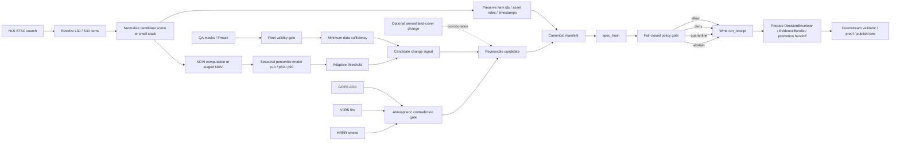

<!-- [KFM_META_BLOCK_V2]
doc_id: kfm://doc/NEEDS-VERIFICATION
title: pipelines/hls-ndvi-change
type: standard
version: v1
status: draft
owners: @bartytime4life
created: 2026-04-15
updated: 2026-04-15
policy_label: public
related: [../README.md, ../../data/work/README.md, ../../data/receipts/README.md, ../../data/proofs/README.md, ../../data/catalog/stac/README.md, ../../tools/validators/README.md, ../../tools/validators/promotion_gate/README.md, ../../policy/README.md, ../../schemas/README.md, ../../tests/README.md]
tags: [kfm, pipelines, hls, ndvi, vegetation-change, stac, spec_hash, evidence-bundle, decision-envelope]
notes: [Hardened from the prior lane draft with explicit STAC acquisition, NDVI computation, sufficiency, atmospheric contradiction, and deterministic identity rules. Exact mounted subtree contents, workflow ownership, schema paths, and live validator/runtime wiring remain reviewable on active branch.]
[/KFM_META_BLOCK_V2] -->

<a id="top"></a>

# `pipelines/hls-ndvi-change/`

Governed HLS vegetation-change preparation lane for STAC-resolved NDVI candidates, fail-closed validity checks, deterministic identity, and evidence-first handoff into downstream review, proof, and publication surfaces.

> [!NOTE]
> **Status:** `experimental`  
> **Owners:** `@bartytime4life`  
> **Path:** `pipelines/hls-ndvi-change/README.md`  
> 
> 
> 
> 
> 
> 
>   
> **Quick jumps:** [Scope](#scope) · [Repo fit](#repo-fit) · [Accepted inputs](#accepted-inputs) · [Exclusions](#exclusions) · [Directory tree](#directory-tree) · [Quickstart](#quickstart) · [Signal model](#signal-model) · [Hashing and identity](#hashing-and-identity) · [Contract surfaces](#contract-surfaces) · [Release and policy gates](#release-and-policy-gates) · [Outputs](#outputs) · [Task list](#task-list--definition-of-done) · [FAQ](#faq) · [Open questions](#open-questions) · [Appendix](#appendix)

| Field | Value |
|---|---|
| Path | `pipelines/hls-ndvi-change/` |
| Role | `observe → resolve → normalize → QA gate → baseline → adaptive threshold → contradiction check → candidate / receipt → downstream handoff` |
| Posture | `fail-closed · evidence-first · STAC-resolved · change detection is not publication` |
| Lane class | Vegetation-change preparation lane built around HLS L30/S30 and explicit contradiction checks |
| Primary watched source | HLS v2 L30 / S30 reflectance or provenance-preserving HLS-derived NDVI |
| Context sources | GOES AOD · VIIRS fire · HRRR smoke · optional annual land-cover corroboration |
| Identity anchor | `spec_hash` over canonical manifest content |
| Current evidence posture | Doctrine is strong; exact mounted executables, scheduler wiring, validator code, and final schema locations remain **NEEDS VERIFICATION** |

---

## Scope

This lane exists to turn **reviewable HLS-derived vegetation-change candidates** into governed handoff objects without collapsing observation, proof, and publication into one step.

It is responsible for:

- resolving HLS inputs through explicit STAC search
- preserving **item-level identity** rather than hiding support in early mosaics
- normalizing one candidate scene pair or small stack into a deterministic manifest shape
- computing or staging NDVI from HLS inputs
- applying QA, cloud, and shadow validity checks before any release-facing interpretation
- deriving a stable seasonal baseline for candidate comparison
- applying adaptive percentile thresholds instead of one rigid global NDVI cutoff
- applying an atmospheric contradiction gate using orthogonal context such as **GOES AOD**, **VIIRS fire**, and **HRRR smoke**
- keeping **sensor-consensus** logic visible when Landsat- and Sentinel-derived observations disagree
- deriving and preserving `spec_hash`
- emitting a compact `run_receipt`
- preparing downstream `DecisionEnvelope`, `EvidenceBundle`, or release handoff objects only after fail-closed checks succeed

It is **not** the place where outward truth is declared. This directory is the lane where a candidate becomes inspectable enough to hand off.

> [!WARNING]
> **HLS vegetation change is not the same thing as climate-anomaly context, regulatory truth, or release state.**  
> This lane must not flatten observation, modeled atmosphere, annual corroboration, proof, and publication into one undifferentiated “change truth.”

[Back to top](#top)

---

## Current evidence posture

| Surface | Status | Why it matters |
|---|---|---|
| HLS-based vegetation-change preparation is a valid KFM lane shape | **CONFIRMED** | It fits map-first, evidence-first, and time-aware doctrine. |
| Receipt / proof / catalog separation | **CONFIRMED** | Prevents trust-surface collapse and preserves inspectability. |
| STAC-resolved acquisition and item-level identity retention | **INFERRED / strongly supported** | Needed for replayability, deterministic identity, and cloud-native operation. |
| Adaptive percentile thresholds, atmospheric contradiction gating, and sensor-consensus weighting | **PROPOSED / strongly supported** | Coherent implementation direction; exact branch proof still needs mounted code. |
| Exact local subtree, workflow files, validators, schemas, tests, and runtime emitters for this path | **NEEDS VERIFICATION** | Current evidence is document-rich and architecture-strong, but not full branch execution proof. |

---

## Repo fit

This lane should remain narrow: **resolve and prepare here, prove and publish downstream**.

| Direction | Surface | Status | Relationship |
|---|---|---|---|
| Upstream | [`../README.md`](../README.md) | **INFERRED / NEEDS VERIFICATION** | Likely parent `pipelines/` routing surface and neighboring lane conventions. |
| Adjacent | [`../../data/work/README.md`](../../data/work/README.md) | **INFERRED / doctrine-supported** | Intermediate NDVI stacks, masks, deltas, and staging artifacts belong there. |
| Downstream | [`../../data/receipts/README.md`](../../data/receipts/README.md) | **CONFIRMED pattern** | Compact process-memory outputs belong there. |
| Downstream | [`../../data/proofs/README.md`](../../data/proofs/README.md) | **CONFIRMED pattern** | Release-grade proof surfaces belong there, not here. |
| Downstream | [`../../data/catalog/stac/README.md`](../../data/catalog/stac/README.md) | **CONFIRMED pattern** | Catalog publication belongs downstream, not in this lane. |
| Downstream | [`../../tools/validators/README.md`](../../tools/validators/README.md) | **CONFIRMED pattern** | Validation surfaces should consume this lane’s emitted objects. |
| Downstream | [`../../tools/validators/promotion_gate/README.md`](../../tools/validators/promotion_gate/README.md) | **CONFIRMED pattern** | Release-bearing candidates should be proven there, not here. |
| Downstream | [`../../policy/README.md`](../../policy/README.md) | **CONFIRMED pattern** | Deny-by-default decision law remains upstream of helper logic. |
| Downstream | [`../../schemas/README.md`](../../schemas/README.md) | **CONFIRMED pattern** | Canonical machine-file authority belongs there once schema paths land. |
| Downstream | [`../../tests/README.md`](../../tests/README.md) | **CONFIRMED pattern** | Positive, negative, replay, and drift checks should be proved there. |

---

## Accepted inputs

The current corpus supports the following first-wave inputs for this lane.

| Input surface | Purpose | Status |
|---|---|---|
| HLS L30 / S30 STAC Items | Primary vegetation observation inputs | **CONFIRMED direction** |
| HLS reflectance assets (`B04`, `B08`) | NDVI computation inputs | **CONFIRMED direction** |
| HLS QA / `Fmask` or equivalent QA assets | Pixel-validity evidence before change claims | **CONFIRMED direction** |
| Optional precomputed HLS vegetation-index assets | Staged NDVI-like surface where provenance remains explicit | **INFERRED / reviewable** |
| GOES AOD | Atmospheric contradiction context | **PROPOSED** |
| VIIRS active fire | Disturbance / smoke contradiction or corroboration context | **PROPOSED** |
| HRRR smoke or plume context | Modeled atmospheric contradiction context | **PROPOSED** |
| Optional annual land-cover change context | Slower-moving corroborative land-cover baseline | **PROPOSED** |
| Geometry / AOI, time window, policy label, and source-role metadata | Required to make the candidate reviewable | **TECHNICALLY VALIDATED direction** |
| Canonicalization rules | Stable hashing and replay behavior | **TECHNICALLY VALIDATED direction** |

### What belongs here

- candidate scenes, pairs, or small declared stacks that can be normalized deterministically
- STAC item identifiers, collection identifiers, asset roles, acquisition timestamps, and AOI references
- QA and sufficiency evidence needed to explain which pixels and observations were considered valid
- contradiction and corroboration references that help interpret a candidate without turning this lane into a full catalog
- release-candidate objects that remain reviewable, reversible, and clearly subordinate to downstream proof and publication

### Input rules

1. Prefer **per-observation** or **small-stack** inputs over early mosaics.
2. Keep **AOI** and **time window** explicit.
3. Keep **QA** explicit; masked or low-confidence pixels must not silently pass.
4. Keep **observation**, **modeled atmosphere**, and **corroborative annual context** visibly separate.
5. Keep every threshold, scene id, item id, and algorithm setting inside the hashed manifest.
6. Label any cross-check layer as **contradiction** or **corroboration** rather than flattening it into the primary observation surface.
7. Missing required identity or QA surfaces must fail closed.

---

## Exclusions

This lane does **not**:

- publish catalog artifacts by itself
- replace policy ownership
- replace release-proof validation
- treat fixed NDVI thresholds as timeless law
- flatten HLS vegetation change into climate-anomaly, regulatory, or public-answer truth
- silently promote on schema drift, missing QA, or atmospheric ambiguity
- redefine schema authority
- act as the final proof store
- collapse **receipts**, **proofs**, **DecisionEnvelope objects**, and **catalog** objects into one file
- imply live scheduler, workflow, or signing integration unless those surfaces are directly verified in-repo

> [!CAUTION]
> A change detector that quietly skips QA, hides STAC support, ignores atmospheric contradiction, or promotes candidates without receipts has already left KFM doctrine.

---

## Directory tree

### Current safe claim

```text
pipelines/hls-ndvi-change/
└── README.md
```

That is the only subtree claim this document makes without direct active-branch inspection.

### Illustrative later shape only

<details>
<summary><strong>Illustrative thin-slice layout</strong></summary>

```text
pipelines/hls-ndvi-change/
├── README.md
├── manifests/
├── fixtures/
├── examples/
└── docs/
```

This is a design sketch, not current-tree proof.

</details>

---

## Quickstart

Use this sequence when turning the lane from a draft contract into a real thin slice.

1. Admit HLS and any first-wave contradiction or corroboration sources through source descriptors or equivalent source-identity records.
2. Pick one bounded AOI and one explicit observation window.
3. Resolve HLS items through explicit STAC search.
4. Stage required reflectance and QA assets, or stage a provenance-preserving NDVI asset where explicitly allowed.
5. Normalize candidate scenes or a small stack into a deterministic manifest shape.
6. Apply QA, cloud, and shadow validity checks.
7. Compute or stage NDVI.
8. Build a seasonal percentile snapshot (`p10`, `p50`, `p90`) for comparable support and season.
9. Run minimum sufficiency checks.
10. Run the atmospheric contradiction gate.
11. Apply adaptive threshold logic.
12. Derive `spec_hash` from canonicalized candidate content.
13. Always emit `run_receipt`, whether the candidate is allowed, denied, quarantined, or abstained.
14. Prepare downstream `DecisionEnvelope`, `EvidenceBundle`, or promotion-handoff objects only after the lane passes.

### Illustrative execution rhythm

```text
observe
  -> STAC resolve
  -> normalize
  -> QA gate
  -> NDVI
  -> percentile baseline
  -> adaptive threshold
  -> contradiction gate
  -> spec_hash
  -> policy gate
  -> run_receipt
  -> downstream handoff
```

---

## Usage

### STAC acquisition contract

This lane treats STAC resolution as part of the candidate contract, not as disposable plumbing.

#### Required acquisition fields

All HLS inputs admitted here MUST be resolved via STAC search with explicit:

- `collections`
- `bbox` or declared geometry / AOI reference
- `datetime` window
- asset names used by the lane
- deterministic item ordering before canonicalization

#### Required first-wave collection posture

The first-wave lane shape assumes HLS v2 collection families such as:

- `HLSL30.v2.0`
- `HLSS30.v2.0`

Exact collection strings, mirrored endpoints, and environment-specific callers remain **NEEDS VERIFICATION** on active branch.

#### Required manifest-preserved STAC members

The canonical manifest MUST preserve, at minimum:

- STAC item ids
- collection ids
- acquisition timestamps
- asset names used by the lane
- asset hrefs or normalized asset references when policy allows
- declared AOI / geometry reference
- query window used for item selection

#### Deterministic ordering rule

Before hashing or diffing:

- items MUST be sorted deterministically
- asset names MUST be normalized
- collection order MUST not depend on caller or API response order

> [!IMPORTANT]
> **Replayability depends on preserving what was actually selected.**  
> Query strings alone are not enough; item identity must remain inspectable.

---

## Diagram



> [!NOTE]
> This lane keeps its immediate branch language narrow and reviewable: **allow / deny / quarantine / abstain**.  
> Broader runtime surfaces may still materialize `ANSWER`, `ABSTAIN`, `DENY`, and `ERROR` elsewhere; this README does not silently settle that cross-surface naming task.

---

## Tables

### Source surfaces and roles

| Source | Lane role | Notes |
|---|---|---|
| **HLS L30 / S30 reflectance** | Primary watched vegetation observation surface | Best first-wave fit for vegetation-change work. |
| **HLS-derived NDVI** | Derived primary observation surface | Allowed only when provenance remains explicit and upstream computation is inspectable. |
| **HLS QA / Fmask** | Required validity surface | Not optional in this lane. |
| **GOES AOD** | Atmospheric contradiction context | Helps detect optically compromised scenes. |
| **VIIRS fire** | Disturbance / smoke context | Useful contradiction or corroboration input; not the vegetation signal itself. |
| **HRRR smoke** | Modeled atmospheric context | Contextual, not primary land observation. |
| **Annual land-cover change layer** | Optional corroborative baseline | Slower-moving corroboration; not a high-cadence observation feed. |

### Signal model

#### 1) Primary observation surface

Prefer **HLS reflectance with explicit NDVI derivation**. Precomputed vegetation-index assets may be admitted only when provenance, source role, and reproducibility remain inspectable.

The lane should keep data **per observation** or in a **small declared stack**. Avoid early mosaicking that hides support, acquisition timing, and scene-level validity.

#### 2) NDVI computation contract

NDVI MUST be computed as:

```python
ndvi = (nir - red) / (nir + red)
```

First-wave band posture:

- `nir` = `B08`
- `red` = `B04`

Final branch mapping for any alternate asset names or harmonized aliases remains **NEEDS VERIFICATION**.

#### 3) NDVI validity rules

- division-by-zero MUST yield masked or invalid values
- QA masks MUST be applied before aggregation
- invalid, clouded, shadowed, or otherwise excluded pixels MUST not silently pass
- missing required QA MUST fail closed
- lane-level summaries MUST report valid-pixel coverage explicitly

Illustrative first-wave clear-pixel posture:

```text
valid_pixel := QA indicates clear
```

Do not assume this exact predicate is final until the concrete schema and validator land.

#### 4) Adaptive baseline

A fixed threshold like `NDVI drop > 0.2` is too blunt for this lane. The stronger direction is a **pixel-wise or support-wise seasonal percentile model**:

- `p10`, `p50`, `p90` over a multi-year or declared seasonal window
- `variability = p90 - p10`
- `ΔNDVI = current - expected(p50)`

Illustrative threshold function:

```python
def adaptive_threshold(p10, p90, alpha=0.35, abs_min=0.08):
    variability = p90 - p10
    return max(abs_min, alpha * variability)
```

This keeps sensitivity local, seasonal, and diffable.

#### 5) Minimum data sufficiency

A candidate MUST fail closed when support is too weak to justify change interpretation.

Illustrative first-wave sufficiency gates:

- valid pixel ratio below configured minimum
- too few valid observations in the declared window
- missing percentile basis
- missing QA coverage
- unresolved geometry / AOI support

Illustrative policy-friendly rule:

```text
if valid_pixel_ratio < MIN_VALID_PIXEL_RATIO:
  abstain or quarantine
```

The exact minimum remains a validator-owned constant once the contract lands.

#### 6) Atmospheric contradiction gate

Quality masks alone are not enough. Atmospheric context is part of the lane’s contradiction model.

A safe first-wave posture is:

- reject or quarantine missing required contradiction context when policy says it is mandatory
- mark atmospheric contradiction explicitly
- do not quietly convert compromised scenes into outward answers

Illustrative machine-readable fields:

- `atmospheric_status`: `clear | uncertain | obstructed`
- `contradiction_flags`: list of explicit signals such as `aod_high`, `smoke_present`, `fire_nearby`
- `contradiction_basis`: source refs and thresholds used

Illustrative lane logic:

```text
if QA missing:
  deny or quarantine

if AOD high and smoke model high:
  abstain or quarantine

if atmospheric status unresolved:
  deny or abstain pending review
```

Final threshold constants and mandatory combinations remain validator-owned.

#### 7) Sensor consensus

Because HLS blends Landsat and Sentinel observations, single-sensor anomalies should not silently carry the same weight as cross-sensor agreement.

Useful first-wave pattern:

- if only one sensor family shows the signal: downweight confidence
- if both agree: boost confidence
- if both are present but diverge beyond tolerance: mark candidate `sensor_divergent`

Illustrative rule:

```text
if abs(delta_l30 - delta_s30) > SENSOR_TOLERANCE:
  mark sensor_divergent
  require downstream review
```

#### 8) Grammar note

The broader corpus still needs cross-surface grammar normalization.

Until that lands:

- keep the **lane-local gate** focused on `allow`, `deny`, `quarantine`, and `abstain`
- let downstream runtime or reviewer surfaces materialize `DecisionEnvelope` outcomes such as `ANSWER`, `ABSTAIN`, `DENY`, and `ERROR` only when the owning contract is published

---

## Hashing and identity

This lane treats deterministic identity as a trust object, not a convenience.

### `spec_hash` purpose

`spec_hash` is the candidate identity anchor for:

- replay
- deduplication
- diff stability
- correction linkage
- review visibility

### `spec_hash` MUST include

`spec_hash` MUST be derived from canonicalized content including, at minimum:

- sorted STAC item ids
- collection ids
- acquisition timestamps or normalized observation identifiers
- AOI geometry or canonical AOI reference
- declared observation window
- asset names used by the lane
- threshold parameters
- percentile basis identifiers or references
- QA rules or QA-mode configuration
- contradiction-gate configuration
- sensor-consensus configuration
- policy label where lane behavior differs by label

### `spec_hash` MUST NOT include

`spec_hash` MUST NOT depend on:

- filesystem paths
- transient runtime values
- unordered API result order
- log timestamps
- machine-local temp locations
- reviewer comments

### Canonicalization expectations

Before hashing:

- lists MUST be sorted deterministically
- maps MUST be serialized in canonical key order
- null and omitted-field behavior MUST be stable
- floating-point thresholds MUST use stable serialization
- geometry encoding MUST be canonicalized

> [!IMPORTANT]
> `spec_hash` should answer: **“Is this materially the same candidate?”**  
> It should not answer: “Did this run happen on the same machine or write to the same path?”

---

## Contract surfaces

The corpus strongly pressures a small object family here, though not every schema is directly surfaced as mounted code.

| Object | Owned here? | Purpose | Status |
|---|---|---|---|
| `SourceDescriptor` or equivalent source identity record | Partially | Describe source identity, cadence, role, and rights posture | **PROPOSED first-wave schema** |
| Canonical manifest | Yes | Stable candidate identity before release handoff | **INFERRED / strongly supported** |
| `spec_hash` | Yes | Deterministic identity + idempotency anchor | **TECHNICALLY VALIDATED direction** |
| `run_receipt` | Yes | Compact process-memory record for allow / deny / quarantine / abstain | **TECHNICALLY VALIDATED direction** |
| Summary metrics object | Yes | Reviewer-visible sufficiency and change stats | **PROPOSED** |
| Delta raster / mask refs | Yes, where produced | Derived artifacts for review and downstream proof | **PROPOSED** |
| `DecisionEnvelope` | Handoff / optional runtime surface | Governed outcome for downstream runtime or review surfaces | **PROPOSED** |
| `EvidenceBundle` | Handoff only | Proof-bearing support bundle | **Downstream responsibility** |
| Promotion manifest | Handoff only | Release-candidate object passed downstream | **PROPOSED** |
| Catalog objects | No | Discoverability and outward linkage | **Downstream responsibility** |

> [!IMPORTANT]
> Keep **receipt ≠ proof ≠ catalog** visible in implementation.
>
> This lane should emit the first one, prepare the second, and avoid pretending it already owns the third.

### Recommended first-wave machine objects

A strong thin slice would likely include:

- canonical manifest
- `run_receipt`
- summary metrics object
- validator-consumable sufficiency record
- optional artifact refs for NDVI delta and QA masks

---

## Release and policy gates

### Confirmed lane laws

| Law | Practical consequence here |
|---|---|
| Promotion is a governed state transition, not a file move | A passing change candidate still needs downstream release handling. |
| Fail closed on weak support | Missing QA, missing source identity, or unresolved atmospheric state should stop handoff. |
| `spec_hash` anchors identity | Replays and diffs should use canonical content, not filenames or ad hoc labels. |
| HLS vegetation change is not climate-anomaly truth | Observation, modeled atmosphere, and corroborative annual context must stay distinct. |
| Always emit a receipt | Allowed, denied, quarantined, and abstained runs all need machine-readable memory. |
| Signed proof lives downstream | This lane prepares release objects; it does not pretend they are already published. |

### Proposed first gate set

These are the safest first-wave checks to document here without inventing mounted implementation:

- required source identity present
- STAC resolution preserved and item ids present
- geometry / AOI explicit
- observation window explicit and ordered
- required reflectance assets present when NDVI is computed here
- required QA inputs present and non-empty
- percentile snapshot present or computable from declared baseline inputs
- sufficiency stats present
- atmospheric status explicit when contradiction inputs are in scope
- sensor-consensus field present if both Landsat and Sentinel materially contribute
- `spec_hash` present and stable
- `run_receipt` emitted on both pass and fail paths
- downstream handoff object omitted when validation fails

### Fail-closed examples

A good first implementation should fail for:

- missing QA
- missing STAC item ids
- missing percentile basis
- missing `spec_hash`
- missing source identity
- missing receipt
- unresolved contradiction state where policy requires explicit atmospheric posture

---

## Outputs

| Output | When emitted | Purpose |
|---|---|---|
| Canonical manifest | Always, once the candidate is normalized | Stable identity surface before handoff |
| `spec_hash` | Always, after canonicalization | Deterministic identity anchor |
| `run_receipt` | Always | Compact memory for allow / deny / quarantine / abstain |
| Sufficiency / summary metrics | Always after evaluation begins | Reviewer-visible support, change, and validity stats |
| Reviewable candidate refs | Pass or review path | Keep scenes, masks, and evidence members explicit |
| NDVI delta raster ref | When generated | Reviewable derived artifact for downstream proof or QA |
| QA mask artifact ref | When staged or derived | Reviewable validity artifact |
| `DecisionEnvelope` or equivalent governed outcome | When the owning downstream contract exists | Runtime or review-facing finite result surface |
| `EvidenceBundle` ref | Pass path only | Proof-bearing support pointer |
| Promotion / release handoff object | Pass path only | Candidate passed to validator / signing / publish lane |

### Recommended summary metrics

A strong first-wave summary object would expose fields such as:

- `valid_pixel_ratio`
- `observation_count`
- `scene_count`
- `sensor_families_present`
- `delta_stat_summary`
- `percent_changed`
- `atmospheric_status`
- `contradiction_flags`

---

## Task list — definition of done

### Thin-slice definition of done

- [ ] first-wave source descriptors exist for **HLS**, **GOES AOD**, **VIIRS**, and any required modeled or corroborative surfaces
- [ ] STAC acquisition contract is expressed in machine-readable form
- [ ] one canonical manifest fixture exists for a bounded HLS change candidate
- [ ] one passing `run_receipt` fixture exists
- [ ] one denied or quarantined `run_receipt` fixture exists
- [ ] one abstained fixture exists for weak-support or cloudy conditions
- [ ] one atmospherically compromised fixture exists
- [ ] threshold computation is deterministic over canonicalized inputs
- [ ] QA absence fails closed
- [ ] missing STAC identity fails closed
- [ ] contradiction logic is machine-readable and reviewer-visible
- [ ] `spec_hash` remains stable across replay of materially identical inputs
- [ ] mounted tests prove unchanged `spec_hash` replays do not silently re-promote
- [ ] direct repo evidence confirms workflow file, scheduler owner, and storage target

### Things this doc intentionally leaves open

- exact workflow filename
- exact scheduler owner
- exact storage layout below `data/work/`, `data/quarantine/`, and `data/receipts/`
- exact schema registry path for first-wave objects
- exact validator package path and executable names
- exact downstream ownership of `DecisionEnvelope` and `EvidenceBundle`
- exact signing / proof-bundle mechanics after handoff
- exact threshold constants for contradiction and sufficiency checks

---

## FAQ

### Does this lane publish final change maps?

No. It prepares a reviewable candidate, emits a receipt, and hands the candidate downstream.

### Does “change detected” equal a public answer?

No. A candidate signal is not yet an outward claim.

### Is a fixed NDVI threshold the contract here?

No. The stronger direction is adaptive, percentile-based, and context-aware.

### Does this lane require STAC identity preservation?

Yes. Item-level identity is part of the lane contract because replay, hashing, and review depend on it.

### Are atmospheric inputs optional forever?

No. The doctrine strongly pressures explicit contradiction logic. Exact first-wave minimums still need direct branch verification.

### Why keep annual land-cover context separate from HLS?

Because HLS is a higher-cadence observation surface, while annual land-cover change is a slower corroborative baseline.

### Is the finite outcome grammar final?

No. The broader corpus still needs a normalization pass for cross-surface vocabulary.

---

## Open questions

- Does the first thin slice stage **reflectance-derived NDVI** only, or also support **precomputed NDVI-like assets** on equal footing?
- Which contradiction inputs are mandatory on day one: **GOES AOD**, **VIIRS**, **HRRR**, or a narrower subset?
- Is annual land-cover corroboration first-wave mandatory or a later strengthening move?
- Where will the first-wave schemas for `SourceDescriptor`, canonical manifest, `run_receipt`, and any downstream `DecisionEnvelope` live?
- Does this repo ultimately treat **promotion manifest** and **release manifest** as distinct objects here?
- Which downstream surface consumes the lane’s first passed candidate: a validator, a promotion gate, a runtime proof harness, or another pipeline?
- What is the final lane-owned minimum valid-pixel threshold, and is it global or policy-label-dependent?
- How should sensor divergence be represented in the first-wave review surface?

---

## Appendix

<details>
<summary><strong>Illustrative shapes only</strong></summary>

These examples are **illustrative**. They exist to make the lane concrete without pretending the final field names or file paths are already verified.

### Illustrative candidate manifest

```yaml
# illustrative only — final field names NEEDS VERIFICATION
source_descriptors:
  - id: hls
    role: primary-observation
  - id: goes-aod
    role: atmospheric-context
  - id: viirs-fire
    role: contradiction-context
  - id: hrrr-smoke
    role: modeled-atmosphere
  - id: annual-landcover-change
    role: corroborative-annual-context

stac_query:
  collections:
    - HLSL30.v2.0
    - HLSS30.v2.0
  datetime: 2026-04-01T00:00:00Z/2026-04-15T23:59:59Z
  aoi_ref: kfm://aoi/NEEDS-VERIFICATION

items:
  - id: NEEDS-VERIFICATION
    collection: HLSL30.v2.0
    acquired_at: 2026-04-14T16:42:00Z
    assets:
      red: B04
      nir: B08
      qa: Fmask

observed_window:
  start: 2026-04-01T00:00:00Z
  end: 2026-04-15T23:59:59Z

threshold_snapshot:
  p10: NEEDS-VERIFICATION
  p50: NEEDS-VERIFICATION
  p90: NEEDS-VERIFICATION
  algorithm: adaptive_threshold_v1

sufficiency:
  valid_pixel_ratio: NEEDS-VERIFICATION
  observation_count: NEEDS-VERIFICATION

atmospheric_status: clear
contradiction_flags: []
policy_label: public
spec_hash: sha256:<digest>

artifacts:
  - kind: hls-ndvi-delta
    href: data/work/NEEDS-VERIFICATION
  - kind: qa-mask
    href: data/work/NEEDS-VERIFICATION
```

### Illustrative `run_receipt`

```yaml
# illustrative only — final field names NEEDS VERIFICATION
run_id: 2026-04-15T12:00:00Z
spec_hash: sha256:<digest>
decision: allow
reason_codes: []
quarantined: false
abstained: false
summary_metrics_ref: data/receipts/NEEDS-VERIFICATION
promotion_manifest_ref: pipelines/hls-ndvi-change/NEEDS-VERIFICATION
```

### Illustrative runtime-facing `DecisionEnvelope`

```json
{
  "type": "DecisionEnvelope",
  "outcome": "ABSTAIN",
  "reason": "ATMOSPHERIC_INTERFERENCE",
  "evidence_bundle_ref": "kfm://bundle/NEEDS-VERIFICATION",
  "obligations": [
    "retry_when_aod_below_threshold",
    "preserve_scene_and_mask_proof"
  ]
}
```

### Illustrative NDVI rule

```python
def compute_ndvi(red, nir):
    denom = nir + red
    return (nir - red) / denom
```

### Illustrative sufficiency gate

```python
def sufficient(valid_pixel_ratio, min_ratio=0.6):
    return valid_pixel_ratio >= min_ratio
```

</details>

[Back to top](#top)
