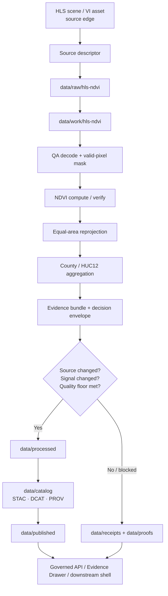

<!-- [KFM_META_BLOCK_V2]
doc_id: kfm://doc/NEEDS-VERIFICATION
title: HLS → NDVI → County/HUC12 Pipeline
type: standard
version: v1
status: draft
owners: NEEDS VERIFICATION
created: YYYY-MM-DD
updated: YYYY-MM-DD
policy_label: public-safe
related: [../README.md, ../../README.md, ../../data/README.md, ../../contracts/README.md, ../../policy/README.md, ../../schemas/README.md, ../../tests/README.md, ../../tools/README.md, ../../docs/domains/hydrology/README.md]
tags: [kfm, hls, ndvi, pipeline, geospatial, remote-sensing]
notes: [Target path was not supplied in the task; this file is written as a PROPOSED child-lane README aligned to current public pipeline patterns.]
[/KFM_META_BLOCK_V2] -->

# 🌾 HLS → NDVI → County/HUC12 Pipeline

Deterministic, evidence-first environmental aggregation lane for turning HLS scene inputs into county- and HUC12-scale vegetation summaries with explicit masks, receipts, and governed publish gates.

> **Status:** Experimental · **Path:** `pipelines/hls-ndvi/README.md` (**PROPOSED**) · **Owners:** NEEDS VERIFICATION  
>      
> **Quick jumps:** [Scope](#scope) · [Repo fit](#repo-fit) · [Accepted inputs](#accepted-inputs) · [Exclusions](#exclusions) · [Directory tree](#directory-tree) · [Quickstart](#quickstart) · [Usage](#usage) · [Diagram](#diagram) · [Tables](#tables) · [Task list](#task-list--definition-of-done) · [FAQ](#faq) · [Appendix](#appendix)  
> **Repo fit:** Upstream: [../README.md](../README.md), [../../README.md](../../README.md), [../../docs/domains/hydrology/README.md](../../docs/domains/hydrology/README.md) · Adjacent: [../soils/README.md](../soils/README.md), [../soils/gssurgo-ks/README.md](../soils/gssurgo-ks/README.md), [../wbd-huc12-watcher/README.md](../wbd-huc12-watcher/README.md) · Downstream: [../../data/README.md](../../data/README.md), [../../contracts/README.md](../../contracts/README.md), [../../policy/README.md](../../policy/README.md), [../../schemas/README.md](../../schemas/README.md), [../../tests/README.md](../../tests/README.md), [../../tools/README.md](../../tools/README.md)

> [!IMPORTANT]
> **Current public-main boundary:** this lane is **not currently confirmed** as a checked-in child under `/pipelines/` on the public tree. Read this file as a **repo-native proposal** built upward from the uploaded draft and the visible public patterns of `/pipelines/soils/gssurgo-ks/` and `/pipelines/wbd-huc12-watcher/`.

> [!NOTE]
> **Sequencing rule:** hydrology remains KFM’s preferred first governed thin slice. This README frames HLS/NDVI as an adjacent environmental/vegetation lane that should reuse the same contract, receipt, promotion, and correction discipline rather than replace hydrology-first sequencing.

---

## Scope

This lane exists to convert HLS scene or vegetation-index assets into **public-safe aggregated vegetation summaries** at county and HUC12 scale, with explicit mask accounting, equal-area aggregation, deterministic comparison, and release-bearing proof objects.

### Working truth map

| Statement | Status | Why it matters here |
|---|---:|---|
| KFM is governed, evidence-first, map-first, and time-aware. | **CONFIRMED** | This lane must behave like a governed publication surface, not a loose analytic notebook. |
| `/pipelines/` is the execution-family documentation surface. | **CONFIRMED** | This is why the file is placed here rather than under `docs/pipelines/`. |
| `pipelines/hls-ndvi/README.md` is the right home for this file. | **PROPOSED** | The path matches current public pipeline naming patterns, but the lane is not yet confirmed on public `main`. |
| County/HUC12 NDVI aggregation is the operating burden of this lane. | **PROPOSED** | Preserved from the uploaded draft; still needs branch-level verification against mounted implementation. |
| HLS source-edge discovery, mask-first processing, and STAC-linked publication are appropriate for this lane. | **INFERRED** | Consistent with the uploaded draft, adjacent repo patterns, and attached environmental expansion notes. |

### Why this lane is worth having

A good HLS/NDVI lane can prove several KFM behaviors without immediately entering the highest-precision or highest-rights burdens:

- source admission with explicit descriptors
- deterministic geospatial transforms
- mask-aware aggregation
- material-change gating
- STAC/DCAT/PROV closure
- proof-bearing publication and rollback discipline

[Back to top](#hls--ndvi--countyhuc12-pipeline)

---

## Repo fit

The current public repo already exposes the governance and execution surfaces this lane would need. The goal here is to fit into those visible shapes instead of inventing a parallel documentation grammar.

### Path and neighbors

| Surface | Status | Role for this lane |
|---|---:|---|
| `pipelines/README.md` | **CONFIRMED** | Parent execution-family index; defines `/pipelines/` as lane-local execution surface. |
| `pipelines/soils/README.md` | **CONFIRMED** | Parent domain-style analogue for a lane family with child recipes. |
| `pipelines/soils/gssurgo-ks/README.md` | **CONFIRMED** | Closest visible pattern for a single-lane ingest/emit recipe. |
| `pipelines/wbd-huc12-watcher/README.md` | **CONFIRMED** | Closest visible pattern for a watcher-style lane with public-tree/proposed-tree split. |
| `pipelines/hls-ndvi/README.md` | **PROPOSED** | Recommended target path for this file. |
| `docs/domains/hydrology/README.md` | **CONFIRMED** | Important sequencing and lane-burden reference, especially for HUC12 context and thin-slice discipline. |

### Data-lifecycle alignment

This lane should align to the current public `data/` zone names rather than inventing a parallel storage layout.

| Data zone | Current status | Lane implication |
|---|---:|---|
| `data/raw/` | **CONFIRMED** root zone | Source-edge snapshots and admitted HLS scene refs land here first. |
| `data/work/` | **CONFIRMED** root zone | Intermediate masks, grids, and per-tile stats belong here. |
| `data/quarantine/` | **CONFIRMED** root zone | Invalid or policy-blocked inputs move here, not silently onward. |
| `data/processed/` | **CONFIRMED** root zone | Cleaned, deterministic county/HUC12 aggregates belong here. |
| `data/catalog/` | **CONFIRMED** root zone | Outward STAC/DCAT/PROV closure belongs here. |
| `data/published/` | **CONFIRMED** root zone | Release-bearing outputs move here only after gates pass. |
| `data/receipts/` | **CONFIRMED** root zone | Lane-local receipts and decision traces belong here. |
| `data/proofs/` | **CONFIRMED** root zone | Attestations, integrity proofs, and audit artifacts belong here. |
| `data/registry/` | **CONFIRMED** root zone | Dataset identity and lane registration belong here. |
| deeper child paths such as `data/catalog/stac/hls-ndvi/` | **PROPOSED** | Use these only after branch-level verification or scaffolding. |

[Back to top](#hls--ndvi--countyhuc12-pipeline)

---

## Accepted inputs

### Required

| Input | Why it belongs here | Status |
|---|---|---:|
| HLS scene assets or HLS vegetation-index assets | Core source-edge material for this lane. Exact upstream collection IDs still need verification. | **PROPOSED** |
| STAC-compatible discovery metadata | Needed for asset identity, `updated` tracking, and catalog closure. | **INFERRED** |
| RED and NIR bands, or a precomputed NDVI/VI asset | Required to compute or verify vegetation index outputs. | **PROPOSED** |
| QA/Fmask or equivalent scene-quality band | Required for cloud/shadow/snow/water exclusion. | **PROPOSED** |
| County polygons or HUC12 polygons | Required public-safe aggregation geometries. | **PROPOSED** |
| Lane source descriptor | Needed to make source admission inspectable and repeatable. | **INFERRED** |
| Prior dataset version or prior evidence bundle | Needed if this lane performs deterministic material-change evaluation. | **INFERRED** |

### Optional

| Input | Why it helps | Status |
|---|---|---:|
| Precomputed NDVI or broader VI product | Allows “verify rather than recompute” mode. | **PROPOSED** |
| Aerosol / smoke / haze masks | Useful for more conservative scene exclusion. | **PROPOSED** |
| Land / water mask | Useful when water should be excluded from zonal stats. | **PROPOSED** |
| Baseline/reference window | Needed for explicit temporal comparison logic. | **PROPOSED** |
| Previous release manifest | Tightens rollback and supersession handling. | **INFERRED** |

---

## Exclusions

This lane should stay narrow. It is a governed aggregation pipeline, not a catch-all remote-sensing playground.

| Not for this lane | Why it is excluded | Where it belongs instead |
|---|---|---|
| Parcel-level or exact-point vegetation disclosure | Higher precision and potentially higher sensitivity burden than county/HUC12 aggregation. | Rights-reviewed domain or steward-only lane |
| Unreleased interpretive narratives | Narrative surfaces must stay downstream of evidence bundles and policy checks. | Focus / API / story surface after release |
| 3D terrain or globe delivery | 3D is a downstream burden-bearing surface, not this lane’s primary job. | UI / Cesium / story-node surfaces |
| Ad hoc browser-side zonal analytics | Would bypass governed execution and drift from reproducible outputs. | Pipeline or governed API |
| Hydrology-first thin-slice replacement | Violates current sequencing posture. | Keep hydrology as first proof lane |
| Free-text thresholds with no steward review | Makes materiality drift too easy. | Policy / standards / fixtures / tests |

[Back to top](#hls--ndvi--countyhuc12-pipeline)

---

## Directory tree

The current public repo proves the parent surfaces. The lane tree below is a **starter proposal** aligned to those surfaces.

### Proposed execution lane tree

```text
pipelines/
└── hls-ndvi/                         # PROPOSED
    ├── README.md
    ├── watcher.yaml                  # PROPOSED
    ├── recipe.sh                     # PROPOSED
    ├── validate.py                   # PROPOSED
    ├── stac_emit.py                  # PROPOSED
    ├── decision_emit.py              # PROPOSED
    ├── src/                          # PROPOSED
    │   ├── ingest.py
    │   ├── qa_decode.py
    │   ├── ndvi.py
    │   ├── aggregate.py
    │   ├── materiality.py
    │   └── publish.py
    └── tests/                        # PROPOSED
```

### Proposed data-zone placement

```text
data/
├── registry/hls-ndvi/                # CONFIRMED zone / PROPOSED child path
├── raw/hls-ndvi/
├── work/hls-ndvi/
├── quarantine/hls-ndvi/
├── processed/hls-ndvi/
├── catalog/stac/hls-ndvi/
├── receipts/hls-ndvi/
├── proofs/hls-ndvi/
└── published/hls-ndvi/
```

### Naming note

The uploaded draft used `hls_ndvi` in several sample paths. This README normalizes the **lane path** to `hls-ndvi/` to match current public pipeline naming patterns such as `gssurgo-ks/` and `wbd-huc12-watcher/`. Snake_case may still be acceptable inside filenames, IDs, or code if an implementation already uses it.

---

## Quickstart

### 1) Inspection-first

Before writing code or polishing prose, verify what is already present on the working branch.

```bash
# inspect parent surfaces first
ls pipelines/
ls data/
ls contracts/
ls policy/
ls schemas/
ls tools/

# inspect current visible analogues
ls pipelines/soils/
ls pipelines/wbd-huc12-watcher/

# inspect visible contract families
find contracts -maxdepth 3 -type f | sort
find schemas/contracts -maxdepth 4 -type f | sort
```

> [!CAUTION]
> The public tree currently proves parent surfaces and adjacent lane patterns, **not** this specific lane. Do not present the tree below as current implementation unless the working branch confirms it.

### 2) Proposed scaffold

```bash
# illustrative scaffold only — not public-main proof
mkdir -p pipelines/hls-ndvi
mkdir -p data/{registry,raw,work,quarantine,processed,receipts,proofs,published}/hls-ndvi
mkdir -p data/catalog/stac/hls-ndvi
```

### 3) Proposed execution outline

```bash
# illustrative pseudocode — not confirmed current CLI
./pipelines/hls-ndvi/recipe.sh discover --window 2026-01-01/2026-01-31 --roi kansas
./pipelines/hls-ndvi/recipe.sh mask --stage work
./pipelines/hls-ndvi/recipe.sh aggregate --zones counties
./pipelines/hls-ndvi/recipe.sh aggregate --zones huc12
python pipelines/hls-ndvi/validate.py
python pipelines/hls-ndvi/decision_emit.py
python pipelines/hls-ndvi/stac_emit.py
```

[Back to top](#hls--ndvi--countyhuc12-pipeline)

---

## Usage

### Lane contract

This lane should turn source-edge HLS inputs into **inspectable aggregated outputs**, not free-floating map overlays. Every outward-facing value should remain one hop away from:

- source identity
- mask burden
- aggregation geometry
- decision logic
- proof objects
- correction lineage

### Processing stages

1. **Discover and admit source assets**  
   Record scene identity, discovery window, `updated` metadata, checksums/ETags where available, and lane-specific source descriptor references.

2. **Decode quality and exclusion masks**  
   Decode or normalize cloud, shadow, snow, water, adjacent-contamination, and any optional aerosol or smoke burden indicators.

3. **Compute or verify NDVI**  
   Prefer a published NDVI/VI asset when it is trustworthy and source-aligned; otherwise compute deterministically from RED and NIR.

4. **Reproject to an equal-area analysis grid**  
   County/HUC12 aggregation should happen on a stable equal-area grid rather than in the source scene CRS.

5. **Aggregate to county and/or HUC12**  
   Emit area-aware stats plus explicit valid-pixel and exclusion burdens.

6. **Compare to the prior released state**  
   Determine whether this run is materially new, non-material, or blocked.

7. **Emit decision and proof objects**  
   Publish only after quality, policy, and release gates pass.

### NDVI formula

```text
NDVI = (NIR - RED) / (NIR + RED)
```

### Mask policy

| Mask / signal | Intended meaning | Lane stance |
|---|---|---:|
| `clear` | usable pixel | **PROPOSED** required for valid-pixel inclusion |
| `cloud` | cloud-covered pixel | **PROPOSED** exclude |
| `shadow` | cloud shadow | **PROPOSED** exclude |
| `snow` | snow / ice burden | **PROPOSED** exclude unless explicitly retained by policy |
| `water` | water surface | **PROPOSED** usually exclude for land-vegetation summaries |
| `adjacent` | near-cloud contamination | **PROPOSED** exclude when available |
| `aerosol` | degraded optical clarity | **PROPOSED** thresholded exclusion |
| `smoke` | plume burden from optional atmospheric mask | **PROPOSED** thresholded exclusion |

### Materiality gate

The uploaded draft already contained a usable decision shape. It is preserved here, but the numerical defaults stay visibly provisional until a stewarded lane standard exists.

| Gate | Baseline rule | Status |
|---|---|---:|
| Source changed | STAC `updated` changed **or** asset checksum / ETag changed | **PROPOSED** |
| Signal changed | NDVI statistic moved enough to matter | **PROPOSED** |
| Quality floor | valid-pixel burden is high enough to trust aggregation | **PROPOSED** |
| Outcome | publish, record-only, or fail-closed | **INFERRED** from KFM doctrine + uploaded draft |

#### Baseline draft defaults to preserve for review

| Draft default | Value | Status |
|---|---:|---:|
| Absolute NDVI mean delta | `> 0.05` | **PROPOSED** |
| Relative NDVI mean delta | `> 10%` | **PROPOSED** |
| Minimum valid pixels | `≥ 60%` | **PROPOSED** |

> [!WARNING]
> These thresholds are useful **starter defaults**, not settled project law. Keep them in the doc only until a reviewed standards/profile or fixture-backed policy bundle replaces them.

### Contract edge and proof objects

The public repo already exposes the **family names** this lane should attach to, but their schema depth on public `main` still needs verification.

| Visible family | Why this lane should connect to it | Current public-main stance |
|---|---|---:|
| `source_descriptor.schema.json` | Source admission and source-edge identity | **CONFIRMED family name** |
| `dataset_version.schema.json` | Stable identity for emitted aggregation set | **CONFIRMED family name** |
| `decision_envelope.schema.json` | Explicit publish / abstain / deny / error logic | **CONFIRMED family name** |
| `evidence_bundle.schema.json` | Bundle tile stats, polygon stats, mask burdens, provenance refs | **CONFIRMED family name** |
| `release_manifest.schema.json` | Release-bearing publication packet | **CONFIRMED family name** |
| `runtime_response_envelope.schema.json` | Downstream runtime/API surface if this lane later feeds Focus or public answers | **CONFIRMED family name** |
| `reason_codes.json`, `obligation_codes.json`, `reviewer_roles.json` | Stable policy vocabulary | **CONFIRMED family names** |
| enforcement-grade schema implementation | Needed for hard guarantees | **NEEDS VERIFICATION** |

### Publish rule

The lane should remain **fail-closed**:

- no valid descriptor → no publish
- no reproducible aggregate → no publish
- no evidence bundle or decision trace → no publish
- no release-bearing closure → no publish
- quality or policy failure → record and stop, not “best-effort publish”

[Back to top](#hls--ndvi--countyhuc12-pipeline)

---

## Diagram



---

## Tables

### Output matrix

| Output | Purpose | Preferred home | Status |
|---|---|---|---:|
| Source snapshot metadata | Preserve what was actually admitted | `data/raw/hls-ndvi/` | **PROPOSED child path** |
| Per-tile mask / stat tables | Intermediate deterministic work product | `data/work/hls-ndvi/` | **PROPOSED child path** |
| County aggregate table | Public-safe administrative summary | `data/processed/hls-ndvi/` | **PROPOSED child path** |
| HUC12 aggregate table | Public-safe watershed summary | `data/processed/hls-ndvi/` | **PROPOSED child path** |
| Lane-local run receipt | Human + machine inspection of the run | `data/receipts/hls-ndvi/` | **PROPOSED child path** |
| Evidence bundle | Tile stats, polygon stats, masks, provenance refs | `data/proofs/hls-ndvi/` or `data/receipts/hls-ndvi/` | **PROPOSED child path** |
| STAC/DCAT/PROV closure | Outward catalog and provenance surface | `data/catalog/stac/hls-ndvi/` + peers | **PROPOSED child path** |
| Release-bearing publish packet | Published outward result | `data/published/hls-ndvi/` | **PROPOSED child path** |

### Public-tree alignment matrix

| Need | Visible public surface | How to use it |
|---|---|---|
| Execution-lane README pattern | `pipelines/soils/gssurgo-ks/README.md` | Use its lane-scoped structure and explicit proposal markers. |
| Watcher-style lane pattern | `pipelines/wbd-huc12-watcher/README.md` | Use its public-tree/proposed-tree honesty. |
| Data lifecycle zones | `data/README.md` | Reuse exact `raw/work/quarantine/processed/catalog/published/receipts/proofs/registry` wording. |
| Tools placement | `tools/README.md` | Place validators, diff helpers, and attestation helpers under existing lane families rather than inventing new top-level tools. |
| Policy vocabulary | `policy/README.md` | Keep reasons, obligations, and reviewer-role vocab stable. |
| Contract vocabulary | `contracts/README.md` + `schemas/README.md` | Attach to visible family names without overclaiming current enforcement depth. |

[Back to top](#hls--ndvi--countyhuc12-pipeline)

---

## Task list / Definition of done

### Minimum lane gates

- [ ] Target path is confirmed on the working branch **or** scaffolded deliberately.
- [ ] Exact HLS source collections or upstream asset families are written into a lane source descriptor.
- [ ] County and HUC12 geometry sources are pinned and documented.
- [ ] Equal-area aggregation CRS is chosen and documented.
- [ ] Valid-pixel mask semantics are explicit and source-specific.
- [ ] Dataset version identity is emitted.
- [ ] Evidence bundle is emitted.
- [ ] Decision envelope is emitted.
- [ ] Publish / record-only / fail-closed branches are all testable.
- [ ] STAC/DCAT/PROV closure is produced for publishable outputs.
- [ ] Receipts and proofs remain linked after publication.
- [ ] Correction / rollback behavior is documented before public release.

### Review gates

- [ ] Thresholds are steward-reviewed rather than left as draft constants.
- [ ] Public-safe aggregation claim is reviewed for rights / sensitivity / precision posture.
- [ ] Any downstream Focus or narrative use is evidence-bounded and never treated as sovereign truth.
- [ ] README text is synchronized with actual lane file names and commands.

[Back to top](#hls--ndvi--countyhuc12-pipeline)

---

## FAQ

### Why county and HUC12 instead of parcel or exact point?

Because the uploaded draft and the current KFM doctrine both fit best with **public-safe aggregated publication**, not exact-point exposure. County and HUC12 also align better with existing public-safe domain sequencing.

### Does this lane replace the hydrology thin slice?

No. Hydrology remains the preferred first governed thin slice. This lane is best treated as a **second-wave environmental adjacency lane** or a parallel design-ready lane.

### Is the exact HLS collection list already settled here?

No. The lane concept is grounded, but the exact upstream collection IDs, catalog endpoints, and scene-selection rules remain **NEEDS VERIFICATION**.

### Are the current public contract schemas already enforcement-grade?

Not yet proven. The **family names are visible**, which is enough to align the README to the current repo vocabulary, but branch-level enforcement depth still needs verification.

### Why keep “draft thresholds” in the file at all?

Because they were already part of the uploaded baseline and are useful review anchors. They are preserved here as **PROPOSED defaults**, not as settled policy.

[Back to top](#hls--ndvi--countyhuc12-pipeline)

---

## Appendix

<details>
<summary><strong>Baseline defaults preserved from the uploaded draft</strong></summary>

### Preserved draft ideas

- scene discovery through STAC-like metadata
- QA decode before aggregation
- NDVI compute-or-verify choice
- equal-area reprojection before zonal stats
- county / HUC12 outputs
- source-change + signal-change gating
- receipts, proofs, and lineage as first-class outputs
- fail-closed posture when data quality or provenance is insufficient

### Preserved draft gotchas

- mixed CRS invalidates aggregation
- cloudy pixels bias NDVI
- low valid-pixel burden can make outputs non-actionable
- missing provenance invalidates the run even when the numbers look plausible

</details>

<details>
<summary><strong>Illustrative run receipt (PROPOSED)</strong></summary>

```json
{
  "lane": "hls-ndvi",
  "dataset_version_ref": "TBD",
  "source_descriptor_ref": "TBD",
  "scene_window": "2026-01-01/2026-01-31",
  "zones": ["county", "huc12"],
  "source_refs": [
    {
      "asset_id": "TBD",
      "updated": "TBD",
      "checksum_or_etag": "TBD"
    }
  ],
  "quality": {
    "pct_valid_pixels": "TBD",
    "excluded_masks": ["cloud", "shadow", "snow", "water", "adjacent", "aerosol", "smoke"]
  },
  "decision": {
    "classification": "publish | record_only | fail_closed",
    "reason_codes": ["TBD"],
    "obligations": []
  },
  "evidence_bundle_ref": "TBD",
  "release_manifest_ref": "TBD",
  "audit_ref": "TBD"
}
```

</details>

<details>
<summary><strong>Open verification items</strong></summary>

| Item | Why it still matters |
|---|---|
| Exact target path on the working branch | The request did not provide a file path, and public `main` does not prove this lane exists yet. |
| Exact owners / doc ID / dates | Required by KFM meta block, but not safely confirmed from current evidence. |
| Actual HLS collection IDs and source endpoints | Needed before this README can become execution truth instead of proposal. |
| Real policy bundle names and fixtures | Public repo proves policy surfaces, not this lane’s exact bundle layout. |
| Real helper filenames and commands | Current public evidence supports adjacent patterns, not these exact scripts. |
| Schema enforcement depth | Current public family names are visible, but implementation depth still needs verification. |

</details>

---

**Readable next move:** verify whether this lane already exists on the working branch; if not, scaffold it as a child under `/pipelines/`, keep thresholds visibly provisional, and do not publish any outward claims until the lane emits a source descriptor, dataset version, decision envelope, evidence bundle, and release-bearing catalog closure.
