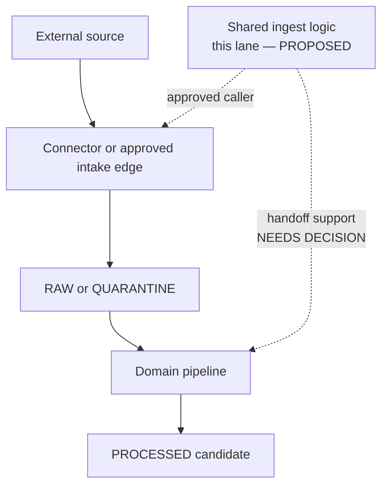

<!-- [KFM_META_BLOCK_V2]
doc_id: kfm://doc/pipelines-ingest-readme
title: pipelines/ingest/ — Shared Ingest Pipeline Boundary
type: readme; directory-readme; shared-ingest-pipeline-boundary; compatibility-index
version: v0.2
status: draft; repository-grounded; documentation-only-direct-lane; no-shared-executable-system-established
owners:
  - OWNER_TBD — Pipeline steward
  - OWNER_TBD — Ingest and connector steward
  - OWNER_TBD — Domain pipeline stewards
  - OWNER_TBD — Source, rights, and sensitivity steward
  - OWNER_TBD — Contract and schema steward
  - OWNER_TBD — Validation and CI steward
  - OWNER_TBD — Evidence and receipt steward
  - OWNER_TBD — Policy and release steward
  - OWNER_TBD — Docs steward
created: 2026-06-13
updated: 2026-07-20
supersedes: v0.1
policy_label: public-doc; pipelines; shared-ingest; no-source-activation; no-direct-publication; fail-closed; receipt-aware; correction-aware; rollback-aware
current_path: pipelines/ingest/README.md
truth_posture: CONFIRMED canonical pipelines responsibility root, Directory Rules shared ingest lane, current README, Fauna compatibility child, proposed IngestReceipt contract and schema, paired fixtures, common schema fixture harness, pipeline/spec/tool/test responsibility boundaries, and bounded checked absences / PROPOSED future shared ingest interface, producer-writer handoff, shared consumers, no-network harness, dedicated behavior tests, receipt integration, and substantive CI / CONFLICTED connector RAW-or-QUARANTINE writer rule versus pre-RAW executable ingest placement, and domain child placement outside pipelines/domains / UNKNOWN exhaustive history and branch inventory, runtime consumers, source activation, scheduler use, emitted ingest receipts, production effects, branch protection, and public use / NEEDS VERIFICATION named owners, accepted handoff decision, canonical source-registry topology, active spec binding, finite gate vocabulary, reason codes, policy wiring, correction propagation, and release dependency
evidence_snapshot:
  repository: bartytime4life/Kansas-Frontier-Matrix
  repository_id: "1059091169"
  visibility: public
  base_ref: main
  base_commit: 13e1b27bf8cc4fdd4d88305532e69c444c07a4b5
  target_prior_blob: da14498b6a94c0aa52ebe73d5c4d7056e9f7011e
  bounded_direct_inventory:
    - README.md
    - fauna/README.md
  checked_absent_paths:
    - pipelines/ingest/INGEST_SHARED_CONTRACT.md
    - pipelines/ingest/run_dry_fixture.py
    - pipelines/ingest/validate_source_descriptor.py
    - pipelines/ingest/validate_source_intake.py
    - pipelines/ingest/validate_payload_integrity.py
    - pipelines/ingest/validate_rights_citation.py
    - pipelines/ingest/preserve_source_role.py
    - pipelines/ingest/admit_raw_capture.py
    - pipelines/ingest/route_quarantine_reason.py
    - pipelines/ingest/emit_ingest_receipt.py
    - pipelines/ingest/adapters/README.md
    - pipeline_specs/ingest/README.md
    - tests/pipelines/ingest/README.md
    - fixtures/ingest/README.md
    - tools/validators/validate_ingest_receipt.py
    - tests/schemas/test_ingest_receipt_validator.py
  inventory_method: GitHub connector exact reads and bounded repository-index queries; absence claims are path-specific, not exhaustive history, branch, generated-file, or external-system assertions
related:
  - ../README.md
  - fauna/README.md
  - ../../docs/doctrine/directory-rules.md
  - ../../docs/sources/ADMISSION_PROCESS.md
  - ../../docs/runbooks/FIRST_INGEST.md
  - ../../docs/adr/ADR-0012-connector-outputs-to-data-raw-or-data-quarantine-only.md
  - ../../docs/adr/ADR-0017-source-descriptor-admission-process.md
  - ../../docs/adr/ADR-0021-quarantine-has-structured-exit-paths.md
  - ../../contracts/source/ingest_receipt.md
  - ../../schemas/contracts/v1/source/ingest_receipt.schema.json
  - ../../fixtures/contracts/v1/source/ingest_receipt/README.md
  - ../../tests/schemas/test_common_contracts.py
  - ../../tests/pipelines/README.md
  - ../../pipeline_specs/README.md
  - ../../tools/ingest/README.md
  - ../../data/receipts/generated/README.md
notes:
  - "v0.2 replaces a planning-oriented proposed file tree with a commit-pinned maturity, routing, and admission boundary."
  - "The direct lane contains this README and the Fauna compatibility child at the bounded snapshot; no shared executable sibling was established."
  - "Directory Rules place connectors at the RAW-or-QUARANTINE write edge, while source-admission documentation also assigns pre-RAW executable ingest to this lane. This README records the conflict and does not invent a winner."
  - "IngestReceipt shape and fixtures are present but PROPOSED; a dedicated validator path named by the schema is absent at the checked path, while the common schema fixture harness can discover the family."
  - "This documentation-only revision changes no executable, specification, source activation, contract, schema, fixture, test, workflow, lifecycle record, policy decision, proof, release object, runtime, or public artifact."
[/KFM_META_BLOCK_V2] -->

<a id="top"></a>

# `pipelines/ingest/` — Shared Ingest Pipeline Boundary

> Repository-grounded boundary for genuinely cross-domain executable ingest behavior, preserving source identity, lifecycle state, rights, sensitivity, integrity, receipts, and fail-closed handoffs without becoming a connector, source registry, policy engine, evidence authority, release authority, or public serving surface.


**Path:** `pipelines/ingest/README.md`

**Version:** `v0.2`

**Current maturity:** documentation boundary; no shared executable system established

**Responsibility:** shared executable ingest behavior only when reuse and ownership are proven

**Public posture:** no direct public access, release decision, catalog write, or publication authority

> [!IMPORTANT]
> A directory, README, schema, fixture, green schema check, or successful source capture is not proof that a shared ingest runtime exists or that source material is true, admissible for every use, evidence-complete, release-approved, or public-safe.

## Quick navigation

- [Current repository status](#current-repository-status)
- [Purpose and non-goals](#purpose-and-non-goals)
- [Authority and placement](#authority-and-placement)
- [Producer/writer handoff conflict](#producerwriter-handoff-conflict)
- [Lifecycle boundary](#lifecycle-boundary)
- [Anti-collapse rules](#anti-collapse-rules)
- [Future interface obligations](#future-interface-obligations)
- [Identity, time, rights, and sensitivity](#identity-time-rights-and-sensitivity)
- [Outcome vocabularies](#outcome-vocabularies)
- [Contracts, schemas, fixtures, and tests](#contracts-schemas-fixtures-and-tests)
- [Routing and file admission](#routing-and-file-admission)
- [Smallest reversible implementation sequence](#smallest-reversible-implementation-sequence)
- [Validation and CI](#validation-and-ci)
- [Correction and rollback](#correction-and-rollback)
- [Open verification items](#open-verification-items)
- [Evidence ledger](#evidence-ledger)
- [Definition of done](#definition-of-done)

---

## Current repository status

The table is bounded to the pinned evidence snapshot in the metadata block. A confirmed path proves presence only.

| Surface | Observed state | Truth status | What it does **not** prove |
|---|---|---|---|
| [`pipelines/`](../README.md) | Canonical executable pipeline responsibility root; parent README labels shared ingest support `PROPOSED / NEEDS VERIFICATION`. | CONFIRMED file and root doctrine | Functional shared pipeline code. |
| `pipelines/ingest/` direct inventory | This README plus [`fauna/README.md`](fauna/README.md). | CONFIRMED by bounded reads/search | Exhaustive history, branch-local files, generated files, or runtime services. |
| Shared ingest implementation | No proposed v0.1 helper file was found at its exact checked path. | CONFIRMED bounded absence; overall maturity `NEEDS VERIFICATION` | Absolute absence of ingest behavior elsewhere in the repository. |
| Fauna child | README-only compatibility boundary; Fauna-owned code routes to `pipelines/domains/fauna/`. | CONFIRMED current document; placement `CONFLICTED` | Executable Fauna ingest or an accepted migration decision. |
| Declarative ingest root | [`pipeline_specs/`](../../pipeline_specs/README.md) exists, but `pipeline_specs/ingest/README.md` was not found. | CONFIRMED bounded result | No relevant domain specification exists elsewhere. |
| Shared behavior tests | [`tests/pipelines/`](../../tests/pipelines/README.md) is a README-only direct lane at its snapshot; `tests/pipelines/ingest/README.md` was not found. | CONFIRMED bounded result | No distributed or dynamically collected pipeline tests. |
| Shared ingest fixtures | `fixtures/ingest/README.md` was not found. | CONFIRMED exact-path absence | No ingest-shaped fixture exists anywhere else. |
| `IngestReceipt` family | Proposed contract, Draft 2020-12 schema, and one valid/one invalid fixture family exist. | CONFIRMED files; semantic status PROPOSED | A real ingest ran, hashes bind real bytes, source policy passed, or release is allowed. |
| Dedicated receipt validator | Schema names `tools/validators/validate_ingest_receipt.py`; that path and a focused test path were not found. | CONFLICTED reference; CONFIRMED exact-path absence | Lack of all schema validation: the common fixture harness can discover this family. |
| Runtime consumers and emitted receipts | No consumer, scheduler, active source, emitted run, or production dependency was established by this review. | UNKNOWN | Inactivity in every branch or external runtime. |

### Truth labels used here

- **CONFIRMED** — supported by an exact repository file, blob, schema field, workflow, test, or bounded path check.
- **PROPOSED** — a future interface, implementation, policy, or placement that has not been accepted and proven.
- **UNKNOWN** — not established by the evidence reviewed.
- **NEEDS VERIFICATION** — checkable before implementation or acceptance but not yet closed.
- **CONFLICTED** — repository sources point to incompatible responsibilities, names, or paths.

---

## Purpose and non-goals

This lane may eventually hold small, reusable executable ingest behavior that has more than one verified domain consumer and belongs to the pipeline **how**, not to a connector, tool, contract, schema, policy, data, test, or release root.

Potential responsibilities, all **PROPOSED** until implemented and tested, include:

- deterministic validation of an ingest handoff envelope;
- verification that declared digests, byte counts, media types, capture time, and source references are present;
- preservation of source role, source vintage, retrieval time, rights, citation, and sensitivity state across a handoff;
- deterministic construction of an `IngestReceipt` candidate conforming to an accepted contract;
- structured fail-closed routing information for an owning connector or domain pipeline;
- no-network fixture adapters shared by multiple domain ingest implementations.

This lane does **not** currently establish any of those behaviors.

It must not:

- fetch as the source-specific connector of record;
- create, edit, activate, or approve a `SourceDescriptor`;
- invent source role, rights, license, citation, sensitivity, or policy state;
- silently become the sole writer to `data/raw/` or `data/quarantine/`;
- normalize domain records or create canonical identifiers;
- claim schema validity is semantic validity or evidence closure;
- create an `EvidenceBundle`, catalog record, graph/triplet, release manifest, or public artifact;
- expose RAW, WORK, QUARANTINE, internal receipts, or sensitive material to public clients;
- treat generated text, logs, map pixels, or receipts as proof of truth.

---

## Authority and placement

Directory Rules make the responsibility split explicit:

```text
connectors/      = source-specific fetch and admission edge
pipelines/       = executable pipeline logic — the how
pipeline_specs/  = declarative pipeline intent — the what
tools/           = durable validators, inspectors, generators, and helpers
data/            = lifecycle state and emitted artifacts
contracts/       = object meaning
schemas/         = machine shape
policy/          = admissibility
release/         = release, correction, withdrawal, and rollback decisions
tests/           = executable enforceability proof
fixtures/        = test inputs
```

Directory Rules list `pipelines/ingest/` as a shared stage lane. That placement is **CONFIRMED doctrine**. Whether this directory has a justified shared implementation is a separate question; current evidence establishes documentation, not executable maturity.

### Shared versus domain-owned behavior

| Behavior | Correct routing posture |
|---|---|
| Used by one domain only | Keep it under `pipelines/domains/<domain>/` or another accepted domain-owned pipeline lane. |
| Source-specific network fetch, authentication, pagination, rate limiting, or upstream API semantics | Keep it under `connectors/<source-family>/`. |
| Inspect-only, compare-only, watcher, preflight, or steward-report helper | Evaluate [`tools/ingest/`](../../tools/ingest/README.md); it may report but cannot admit, promote, or publish. |
| Declarative profile or stage configuration | Keep it under [`pipeline_specs/`](../../pipeline_specs/README.md) after an accepted schema, consumer, and activation model exist. |
| Genuinely cross-domain executable ingest transition logic | This lane may be appropriate after consumers, contract, side effects, tests, and ownership are proven. |

> [!CAUTION]
> “Shared” is not a reason to centralize unproven behavior. New code must name at least two real consumers or document why the responsibility is inherently repository-wide. Convenience alone does not create shared authority.

---

## Producer/writer handoff conflict

The current repository contains two incomplete views of the ingest edge:

1. [`docs/doctrine/directory-rules.md`](../../docs/doctrine/directory-rules.md) §7.3 says connector output **MUST** land in `data/raw/<domain>/<source_id>/<run_id>/` or `data/quarantine/...`, with source descriptors, checksums, and ingest receipts.
2. [`docs/sources/ADMISSION_PROCESS.md`](../../docs/sources/ADMISSION_PROCESS.md) describes admission as a pre-RAW membrane and names `pipelines/ingest/` as the executable ingest home.

The proposed companion ADRs do not close the conflict:

- [`ADR-0012`](../../docs/adr/ADR-0012-connector-outputs-to-data-raw-or-data-quarantine-only.md) codifies the connector RAW-or-QUARANTINE rule but remains `draft / proposed`.
- [`ADR-0017`](../../docs/adr/ADR-0017-source-descriptor-admission-process.md) defines a source admission process but remains `proposed`.

The unresolved question is not whether gates and receipts are required. They are. The unresolved question is **which component owns the final pre-RAW decision and which component performs the governed RAW-or-QUARANTINE write**.

Until an accepted decision and implementation evidence close that handoff:

- this README does not declare `pipelines/ingest/` the sole RAW writer;
- a connector must not delegate away its Directory Rules obligations through an undocumented helper;
- a shared helper must not create a second admission or lifecycle authority;
- every implementation proposal must identify one producer, one decision owner, one writer, one receipt emitter, and one rollback owner;
- disagreement must be recorded as drift or an ADR issue rather than encoded as competing write paths.

---

## Lifecycle boundary

The lifecycle invariant remains:

```text
RAW → WORK / QUARANTINE → PROCESSED → CATALOG / TRIPLET → PUBLISHED
```

Promotion is a governed state transition, not a file move. The diagram below is a boundary model, not evidence of current execution.



The lane may participate only through an explicit, accepted caller and interface. It does not own the external source, lifecycle directories, domain semantics, downstream validation, evidence closure, release, or public serving.

### Minimum transition properties

Any future implementation must:

1. identify the current and requested lifecycle states;
2. reject an undeclared or impossible transition without side effects;
3. preserve immutable source bytes or stable content-addressed references;
4. preserve the owning domain and source identity;
5. record input and output digests;
6. record decision, reason, caller, code, and specification lineage;
7. make partial writes detectable and recoverable;
8. never skip from source input or RAW to catalog, triplet, release, or publication;
9. hand correction and rollback to their governing roots.

---

## Anti-collapse rules

The following equivalences are forbidden:

```text
directory exists              != shared runtime exists
connector response            != admitted RAW capture
RAW capture                   != normalized domain record
ingest success                != schema or semantic validation
schema-valid IngestReceipt    != proof that ingest occurred
IngestReceipt                 != RunReceipt
receipt                       != EvidenceBundle
source role                   != permanent trust
known digest                  != rights clearance
quarantine                    != denial, deletion, or publication
pipeline completion           != catalog closure
green workflow                != source activation or release approval
generated summary             != evidence
```

Keep these objects and responsibilities separate:

- source descriptor;
- source activation/admission decision;
- staged or retrieved payload;
- RAW capture;
- quarantine case;
- domain WORK candidate;
- `IngestReceipt` and broader run/transform receipts;
- validation report;
- policy decision;
- evidence reference and `EvidenceBundle`;
- catalog record;
- review record;
- release manifest;
- correction, withdrawal, and rollback artifacts;
- public derivative.

---

## Future interface obligations

No shared ingest API, command, module, or envelope is accepted by this README. The tables define obligations that a future proposal must satisfy without fixing field names prematurely.

### Required inputs

| Input class | Minimum obligation |
|---|---|
| Caller scope | Stable caller, owning domain, requested operation, and declared lifecycle edge. |
| Source identity | Stable reference to the governed source descriptor or accepted registry entry. |
| Admission state | Reference to the applicable source activation/admission posture; no implicit activation. |
| Payload | Immutable or content-addressed reference, media type, byte count, and digest set. |
| Time | Retrieval/capture time plus source vintage, observation/valid time, or explicit not-applicable markers as relevant. |
| Rights and citation | Carried source terms, attribution/citation requirements, and unresolved-state marker. |
| Sensitivity | Declared classification and required reviewer/redaction state. |
| Execution lineage | Code revision, accepted profile/spec reference if one exists, dependency/environment identity, and idempotency key. |

### Permitted output classes

| Output class | Boundary |
|---|---|
| Decision/result candidate | Uses an accepted finite vocabulary and reason-code family; no prose-only success. |
| Lifecycle reference | References an approved RAW, WORK-intake, or QUARANTINE location written by the authorized owner. |
| Receipt candidate | Conforms to the accepted receipt contract and binds actual inputs/outputs by digest. |
| Handoff envelope | Gives the owning domain pipeline sufficient identity, time, source-role, rights, sensitivity, and integrity state. |
| Diagnostic | Public-safe, deterministic, no secrets, no raw sensitive payloads, and no hidden reasoning. |

### Forbidden outputs

- a normalized or canonical domain record;
- an `EvidenceBundle` or claim that evidence closure passed;
- a policy approval invented by the pipeline;
- a catalog or triplet record;
- a release or promotion decision;
- a public layer, tile, API response, map claim, export, or AI answer;
- unredacted secrets, tokens, private URLs, exact sensitive coordinates, restricted payloads, or living-person data;
- private chain-of-thought or unbounded generated narrative.

---

## Identity, time, rights, and sensitivity

### Identity

- Preserve source identity exactly; never derive source authority from a URL or filename alone.
- Preserve the owning domain and caller; shared code does not erase domain ownership.
- Use deterministic run and receipt identifiers from accepted contracts. Do not create a local identifier grammar in this README.
- Bind inputs, outputs, code, and specs with hashes where the governing contract requires them.
- Replays with the same idempotency key and inputs must not create divergent side effects.

### Time

Retrieval time, capture time, source vintage, observation time, valid time, publication time, and review time are different facts. Future code must preserve each time kind supplied by the source or caller and must not substitute pipeline execution time for source time.

Unknown, stale, future-dated, contradictory, or unsupported time state must remain visible and fail closed where it affects admission or downstream interpretation.

### Source role and rights

- Read source role from a governed descriptor or accepted decision; never infer it from brand, file format, or historical use.
- Preserve distinctions among primary, corroborating, contextual, restricted, and other accepted roles.
- Treat rights, terms, citation, redistribution, derivative-use, and retention constraints as separate fields or governed references.
- Unknown or incompatible rights block the affected use; a digest or successful fetch cannot override rights.

### Sensitivity

Sensitive-domain material remains deny-by-default for unauthorized exposure. This includes rare species and plants, archaeology and cultural places, living-person and DNA data, private land/stewardship information, critical infrastructure, exact-harm coordinates, and restricted source material.

Shared code must not broaden visibility. Redaction or generalization must be performed by an authorized transform with its own receipt and review state; the original remains protected.

---

## Outcome vocabularies

Do not collapse unrelated finite vocabularies.

| Surface | Current evidence | Rule |
|---|---|---|
| `IngestReceipt.outcome` | `SUCCESS`, `PARTIAL`, `FAIL` in the proposed source schema. | Records ingest/capture result only. It is not a policy, lifecycle, or release outcome. |
| Runtime answer envelope | KFM doctrine uses `ANSWER`, `ABSTAIN`, `DENY`, `ERROR` for answer behavior. | Do not reuse it as an ingest receipt enum unless an accepted contract explicitly does so. |
| Lifecycle state | RAW, WORK, QUARANTINE, PROCESSED, CATALOG/TRIPLET, PUBLISHED. | A state is not a result code. |
| Policy/review decision | Owned by `policy/` and review contracts. | Reference the decision; do not manufacture it here. |
| Quarantine exit | [`ADR-0021`](../../docs/adr/ADR-0021-quarantine-has-structured-exit-paths.md) proposes five governed exits. | ADR remains proposed; no helper may silently implement it as accepted authority. |

A `SUCCESS` receipt can coexist with QUARANTINE when capture succeeded but downstream use is blocked. A `FAIL` receipt does not itself authorize deletion. A policy `DENY` does not rewrite the ingest receipt. The governing contracts must make each dimension explicit.

---

## Contracts, schemas, fixtures, and tests

### Confirmed repository surfaces

| Surface | Current evidence | Limit |
|---|---|---|
| [`contracts/source/ingest_receipt.md`](../../contracts/source/ingest_receipt.md) | v0.2 semantic contract; status `draft / PROPOSED`. | Does not prove pipeline integration or source truth. |
| [`ingest_receipt.schema.json`](../../schemas/contracts/v1/source/ingest_receipt.schema.json) | Draft 2020-12, closed object, required identity/time/outcome/bytes/digest fields; status `PROPOSED`. | Shape only. |
| [`ingest_receipt` fixtures](../../fixtures/contracts/v1/source/ingest_receipt/README.md) | One valid fixture and one invalid missing-`id` fixture. | Narrow shape polarity only. |
| [`test_common_contracts.py`](../../tests/schemas/test_common_contracts.py) | Discovers `source` schemas with matching fixture families and checks valid/invalid polarity. | No focused ingest semantics, filesystem side effects, or handoff behavior. |
| [`tests/pipelines/README.md`](../../tests/pipelines/README.md) | Repository-grounded parent says its direct lane is README-only at its snapshot. | No dedicated shared pipeline behavior suite established. |

### Confirmed gaps and conflicts

- The schema and fixture documentation name `tools/validators/validate_ingest_receipt.py`, but that exact path was not found.
- No focused `tests/schemas/test_ingest_receipt_validator.py` was found.
- The common fixture harness provides discoverable schema polarity coverage, but it is not a dedicated CLI validator and does not prove an ingest event.
- No accepted shared ingest handoff contract, active shared ingest specification, shared fixture lane, executable consumer, or dedicated pipeline test lane was established.
- No emitted `IngestReceipt` instance was inspected as runtime proof.

### Minimum future test burden

A shared implementation cannot graduate on schema fixtures alone. It needs no-network tests for:

- accepted and rejected caller scope;
- missing and unresolved source identity;
- digest, byte-count, media-type, and immutable-reference mismatch;
- source-role preservation and ambiguity;
- rights, citation, and sensitivity fail-closed behavior;
- each accepted lifecycle edge and every forbidden skip;
- partial-write detection and retry/idempotency behavior;
- timestamp ordering and stale/future/unknown time state;
- deterministic receipt content and hash binding;
- secret, sensitive payload, and exact-coordinate exclusion from logs/diagnostics;
- correction, withdrawal, and rollback handoff;
- no catalog, triplet, release, public API/UI/map, or AI side effects.

---

## Routing and file admission

The direct lane is not an invitation to recreate the v0.1 proposed tree.

Before adding a file here, a PR must answer:

1. What exact executable responsibility does the file own?
2. Which two or more verified consumers require the shared behavior?
3. Why does the behavior not belong to a source connector, domain pipeline, `tools/ingest/`, shared package, validator, or declarative spec?
4. Which accepted contract and schema govern its inputs, outputs, outcomes, and reason codes?
5. Who owns the RAW-or-QUARANTINE write and receipt emission?
6. Which lifecycle side effects are allowed, and how are all others denied?
7. Which no-network fixtures and negative tests prove the boundary?
8. How are retries, partial writes, correction, and rollback handled?
9. Which workflow runs the substantive tests, and does it fail on zero collection?
10. Which owners review source, rights, sensitivity, pipeline behavior, and documentation?

If those questions cannot be answered, add no executable file here. Record the requirement in an issue, verification backlog, drift entry, or proposed ADR instead.

### Child routing

[`fauna/README.md`](fauna/README.md) is retained as a compatibility and documentation boundary. New Fauna-owned executable behavior belongs in the canonical domain pipeline lane unless an accepted migration decision says otherwise. No additional domain child should be added here by analogy.

---

## Smallest reversible implementation sequence

The next useful step is not to create all filenames previously sketched by v0.1. The smallest evidence-driven sequence is:

1. **Resolve the producer/writer handoff.** Accept or supersede the conflicting connector/pre-RAW model; name decision owner, writer, receipt emitter, and rollback owner.
2. **Name real consumers.** Identify at least two domain/source flows needing identical behavior and prove the shared abstraction is smaller than duplication.
3. **Ratify one handoff contract.** Define meaning under `contracts/`, shape under `schemas/`, finite outcomes/reasons, side effects, and compatibility/versioning.
4. **Add public-safe no-network fixtures.** Cover success, partial/fail, quarantine, rights ambiguity, sensitivity, digest mismatch, time anomalies, and forbidden lifecycle skips.
5. **Implement one thin vertical slice.** Prefer a pure validation/decision core plus an authorized writer adapter rather than a large framework.
6. **Add focused tests.** Prove deterministic results, idempotency, fail-closed behavior, side-effect boundaries, receipt binding, and no-publication.
7. **Wire substantive CI.** Use read-only, secret-free pull-request execution; fail on missing tests or zero collection.
8. **Observe emitted artifacts.** Inspect real no-network receipts and rollback behavior before adding networked or scheduled use.
9. **Activate one internal consumer through review.** Source activation, runtime enablement, promotion, release, and publication remain separate decisions.

Each step must be independently reviewable and revertible. A later step cannot retroactively prove an earlier gate.

---

## Validation and CI

Repository evidence currently supports the following bounded statements:

- `.github/workflows/contracts-validate.yml` runs `make test`, whose documented scope is schema and contract tests.
- `.github/workflows/schema-validation.yml` checks canonical schema structure, configured aggregate validators, and `tests/schemas` plus `tests/contracts` with read-only repository permission.
- The common contract fixture test can discover the current `source/ingest_receipt` schema/fixture pair.
- `.github/workflows/docs-build.yml` is an explicit readiness hold, not a rendered-documentation build or publication path.
- The repository has broad documentation/link and policy checks, but no dedicated shared ingest behavior workflow was established by this review.
- A green schema or documentation workflow proves only its tested boundary. It is not source activation, ingest execution, receipt emission, policy approval, lifecycle promotion, evidence closure, release, or publication proof.

For this documentation-only change, the appropriate checks are:

- Markdown structure, heading hierarchy, internal anchors, and balanced fences;
- exact repository-relative link resolution;
- preservation of the KFM metadata wrapper and one H1;
- generated-receipt JSON parse, schema validation, and artifact-hash match;
- remote byte-for-byte readback;
- base-to-head changed-path verification;
- ordinary pull-request workflow observation.

Repository-native ingest tests cannot be claimed because no accepted shared ingest executable or dedicated suite was established.

---

## Correction and rollback

### Documentation correction

If a repository claim in this README is wrong:

1. correct the claim in a reviewed PR;
2. identify the evidence snapshot or bounded absence that changed;
3. preserve the prior revision in Git history;
4. update the evidence ledger and truth label;
5. update or supersede any generated-work receipt associated with the correction.

### Future implementation correction

An ingest implementation must make correction and replay possible without rewriting history:

- preserve original source and receipt references;
- emit superseding receipts rather than editing completed receipts in place;
- invalidate or quarantine affected downstream candidates through governed mechanisms;
- propagate correction identifiers to dependent validation, evidence, catalog, and release surfaces;
- require release-owned correction, withdrawal, or rollback for anything already published;
- never use deletion or a silent rerun as the only correction record.

### Rollback of this change

This revision is documentation plus its generated-work provenance receipt. Rollback is a normal reviewed Git revert of those scoped commits. It does not imply a lifecycle rollback because no source, data, pipeline execution, release, or public artifact changes here.

---

## Open verification items

| ID | Question | Status |
|---|---|---|
| `PIPE-INGEST-001` | Which component owns the final pre-RAW decision and which component performs the RAW-or-QUARANTINE write? | CONFLICTED / ADR OR DOCTRINE CLARIFICATION REQUIRED |
| `PIPE-INGEST-002` | Does shared executable ingest behavior have at least two real consumers? | UNKNOWN |
| `PIPE-INGEST-003` | Should this lane remain documentation-only, become a small shared pipeline module, or delegate reusable logic to a package? | NEEDS VERIFICATION |
| `PIPE-INGEST-004` | Which source-registry topology is canonical for descriptor resolution? | CONFLICTED / NEEDS VERIFICATION |
| `PIPE-INGEST-005` | Is the proposed `IngestReceipt` contract ready for acceptance, and who owns versioning? | PROPOSED / NEEDS REVIEW |
| `PIPE-INGEST-006` | Will the named dedicated validator be implemented, or should schema metadata point to the common harness? | CONFLICTED |
| `PIPE-INGEST-007` | Which accepted finite gate and reason-code vocabularies govern partial, hold, quarantine, retry, and fail behavior? | NEEDS VERIFICATION |
| `PIPE-INGEST-008` | Where should shared no-network fixtures and behavior tests live? | NEEDS VERIFICATION |
| `PIPE-INGEST-009` | Which CI check proves non-vacuous shared ingest behavior and blocks unsafe changes? | UNKNOWN |
| `PIPE-INGEST-010` | Which review roles own source, rights, sensitivity, pipeline, receipt, and rollback approval? | NEEDS VERIFICATION |
| `PIPE-INGEST-011` | Are any current external runtimes or branches consuming this path? | UNKNOWN |
| `PIPE-INGEST-012` | Should the Fauna compatibility child be migrated, retained as a pointer, or removed after an accepted plan? | NEEDS VERIFICATION |

---

## Evidence ledger

| Evidence | Observation supported | Status | Limitation |
|---|---|---|---|
| [`docs/doctrine/directory-rules.md`](../../docs/doctrine/directory-rules.md) | `pipelines/` owns executable how; `pipeline_specs/` owns declarative what; shared `ingest/` is listed; connectors write RAW or QUARANTINE. | CONFIRMED doctrine | Does not prove current implementation. |
| prior target blob `da14498b…` | v0.1 boundary and proposed helper tree. | CONFIRMED prior file | Proposed paths were not implementation evidence. |
| bounded direct inventory | Target README plus Fauna child. | CONFIRMED bounded result | Not exhaustive across history, branches, generators, or external systems. |
| [`fauna/README.md`](fauna/README.md) | Existing child is a README-only compatibility boundary and routes domain behavior to `pipelines/domains/fauna/`. | CONFIRMED current document | Does not settle migration. |
| [`docs/sources/ADMISSION_PROCESS.md`](../../docs/sources/ADMISSION_PROCESS.md) | Pre-RAW admission model and executable ingest reference. | CONFIRMED draft document | Conflicts with connector writer wording; not execution proof. |
| [`ADR-0012`](../../docs/adr/ADR-0012-connector-outputs-to-data-raw-or-data-quarantine-only.md) | Proposed numbered connector output rule. | CONFIRMED file; draft/proposed | Directory Rules, not the ADR, supplies current governing authority. |
| [`ADR-0017`](../../docs/adr/ADR-0017-source-descriptor-admission-process.md) | Proposed source descriptor admission process. | CONFIRMED file; proposed | Not accepted implementation authority. |
| [`ADR-0021`](../../docs/adr/ADR-0021-quarantine-has-structured-exit-paths.md) | Proposed structured quarantine exits. | CONFIRMED file; proposed | No accepted exit implementation established. |
| [`IngestReceipt` contract](../../contracts/source/ingest_receipt.md) and [schema](../../schemas/contracts/v1/source/ingest_receipt.schema.json) | Proposed receipt meaning and closed field shape. | CONFIRMED files; PROPOSED object family | Not runtime proof. |
| [`IngestReceipt` fixtures](../../fixtures/contracts/v1/source/ingest_receipt/README.md) | One valid and one missing-id invalid example. | CONFIRMED fixture documentation | Narrow shape coverage. |
| [`test_common_contracts.py`](../../tests/schemas/test_common_contracts.py) | Dynamic schema/fixture polarity harness includes the `source` family. | CONFIRMED executable test code | No dedicated ingest behavior semantics. |
| exact-path probes in metadata | Prior proposed helpers, shared ingest spec/test/fixture README, and focused validator/test were not found. | CONFIRMED bounded absence | No exhaustive repository absence claim. |
| [`pipeline_specs/README.md`](../../pipeline_specs/README.md) | Declarative root is placeholder-heavy and no active root spec system is established. | CONFIRMED repository-grounded doc | Its snapshot predates this review. |
| [`tests/pipelines/README.md`](../../tests/pipelines/README.md) | Direct pipeline-test lane is README-only at its snapshot; distributed negative coverage exists. | CONFIRMED repository-grounded doc | No exhaustive test inventory. |
| [`tools/ingest/README.md`](../../tools/ingest/README.md) | Separate inspect/preflight/watcher support boundary. | CONFIRMED current doc | Does not prove all child executables. |
| supplied Pipeline Living Implementation Manual v0.3 | Small, receipt-emitting, fail-closed, no-network-first design guidance. | PROPOSED supporting design source | Not live-repository implementation evidence. |

---

## Definition of done

### This README revision

This documentation revision is complete when it:

- preserves the existing document identity and creation date;
- records current maturity without treating proposed files as implemented;
- retains strong lifecycle, source-role, rights, sensitivity, receipt, evidence, policy, release, correction, and rollback boundaries;
- surfaces the connector/pre-RAW writer conflict instead of choosing silently;
- distinguishes shared, domain-owned, connector-owned, tool, spec, contract, schema, fixture, test, data, policy, and release responsibilities;
- cites repository evidence with explicit truth labels and limitations;
- contains no source payload, secret, exact sensitive location, source activation, runtime mutation, or publication instruction;
- is accompanied by a schema-valid generated-work receipt with human review pending;
- is delivered through a scoped branch and draft pull request.

### Future executable graduation

This lane is not implementation-complete until repository evidence proves all of the following:

- an accepted producer/decision/writer/receipt-emitter handoff;
- named owners and at least two justified shared consumers;
- accepted input, output, outcome, reason-code, versioning, and side-effect contracts;
- public-safe no-network valid and invalid fixtures;
- deterministic, idempotent, fail-closed executable behavior;
- source-role, rights, sensitivity, time, identity, digest, partial-write, retry, correction, and rollback coverage;
- dedicated non-vacuous tests and read-only pull-request CI;
- emitted receipt inspection and artifact-hash closure;
- no direct catalog, graph, release, public API/UI/map, or AI side effects;
- separate human review, source activation, promotion, release, and publication decisions.

Until then, the correct status is **documentation boundary / no shared executable system established**.

---

## Changelog

### v0.2 — 2026-07-20

- replaced the speculative helper tree with bounded repository inventory and exact-path absence evidence;
- classified the direct lane as documentation-only at the evidence snapshot;
- incorporated the grounded Fauna compatibility child and domain-placement rule;
- surfaced the connector RAW-or-QUARANTINE versus pre-RAW ingest handoff conflict;
- grounded the proposed `IngestReceipt` contract, schema, fixtures, common harness, and missing dedicated validator reference;
- separated `pipelines/ingest/` from `tools/ingest/`, connectors, domain pipelines, specs, data, policy, evidence, release, and public surfaces;
- added future interface obligations, finite-vocabulary separation, implementation admission questions, smallest reversible sequence, validation limits, correction, rollback, open verification items, and evidence ledger;
- changed documentation only.

[Back to top](#top)
