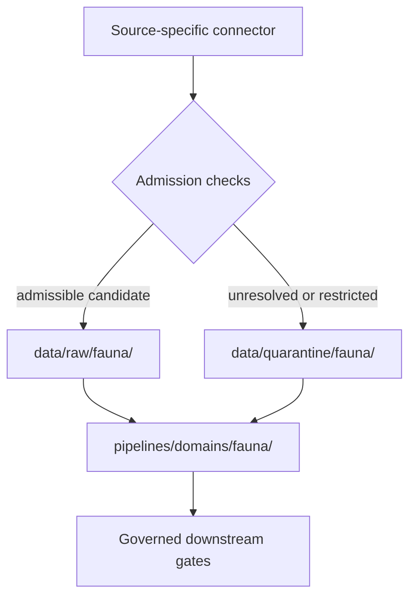

<!-- [KFM_META_BLOCK_V2]
doc_id: kfm://doc/pipelines-ingest-fauna-readme
title: pipelines/ingest/fauna/ — Fauna Ingest Compatibility Boundary
type: readme
version: v0.2
status: draft; repository-grounded; README-only compatibility boundary; placement conflicted for domain-owned executable logic
owners:
  - <pipeline-owner>
  - <ingest-steward>
  - <fauna-domain-steward>
  - <source-steward>
  - <geoprivacy-steward>
  - <evidence-steward>
  - <policy-steward>
  - <docs-steward>
created: 2026-06-13
updated: 2026-07-20
supersedes: v0.1
policy_label: public-with-fauna-ingest-geoprivacy-and-quarantine-gates
path: pipelines/ingest/fauna/README.md
truth_posture: CONFIRMED target README, pipelines and ingest parent contracts, canonical pipelines/domains/fauna lane, Fauna contracts/schemas/policy/tests/fixtures/source-registry/lifecycle README surfaces, repository-grounded pipeline_specs/fauna boundary, and bounded absence probes for the previously proposed adapter/spec/test/fixture files / PROPOSED compatibility-only role and future migration or removal / CONFLICTED use of pipelines/ingest/fauna for domain-owned executable logic because Directory Rules places domain-specific pipeline logic under pipelines/domains/fauna / UNKNOWN executable adapter behavior, accepted ingest contract and receipt schema, active source profiles, runtime consumers, CI enforcement, emitted receipts, proof closure, release integration, and public use
evidence_snapshot:
  repository: bartytime4life/Kansas-Frontier-Matrix
  repository_id: "1059091169"
  visibility: public
  base_ref: main
  base_commit: 2b31ccbd9ba5b3fe6772ea1b0165eca45bdfebb0
  prior_blob: a03934112656906712313436f93f92f0f49c84d1
  inspection_method: GitHub connector file reads, exact-path absence probes, code-index queries, current repository doctrine, and supplied KFM doctrine/architecture sources
  bounded_lane_observation: README confirmed; no proposed executable sibling, dedicated ingest spec, dedicated ingest test README, or dedicated ingest fixture README was verified by exact-path probes
related:
  - docs/doctrine/directory-rules.md
  - docs/doctrine/ai-build-operating-contract.md
  - pipelines/README.md
  - pipelines/ingest/README.md
  - pipelines/domains/fauna/README.md
  - pipelines/normalize/fauna/README.md
  - docs/domains/fauna/ARCHITECTURE.md
  - docs/domains/fauna/CANONICAL_PATHS.md
  - pipeline_specs/fauna/README.md
  - contracts/domains/fauna/README.md
  - schemas/contracts/v1/domains/fauna/README.md
  - policy/domains/fauna/README.md
  - policy/sensitivity/fauna/README.md
  - tests/domains/fauna/README.md
  - fixtures/domains/fauna/README.md
  - data/registry/sources/fauna/README.md
  - data/receipts/ingest/README.md
  - data/proofs/evidence_bundle/README.md
  - release/candidates/fauna/README.md
  - docs/registers/DRIFT_REGISTER.md
tags: [kfm, pipelines, ingest, fauna, compatibility-boundary, source-admission, occurrence, monitoring, geoprivacy, quarantine, receipt, evidence-bundle, policy, governance]
notes:
  - "This revision preserves the requested path but does not normalize it into the canonical home for Fauna-owned executable behavior."
  - "Directory Rules places domain-specific executable pipeline logic under pipelines/domains/fauna/; shared cross-domain ingest behavior may remain under pipelines/ingest/."
  - "No accepted ADR was verified that authorizes pipelines/ingest/fauna/ as a parallel Fauna implementation authority."
  - "ADR-0010, ADR-0012, and ADR-0018 are useful companion records but remain draft or proposed at the evidence snapshot; governing claims here rely on Directory Rules and core doctrine."
  - "Exact source activation, rights, endpoints, cadence, schemas, fields, outcome enums, receipt shapes, tests, and runtime behavior remain outside this README unless verified in their owning roots."
[/KFM_META_BLOCK_V2] -->

<a id="top"></a>

# `pipelines/ingest/fauna/` — Fauna Ingest Compatibility Boundary


> **One-line purpose.** This README preserves and bounds the existing `pipelines/ingest/fauna/` path while routing Fauna-owned ingest implementation to the canonical domain pipeline lane and preventing intake helpers from becoming source, evidence, policy, release, or publication authority.

**Audience:** Fauna maintainers, pipeline and connector owners, source and rights stewards, sensitivity/geoprivacy reviewers, test and validation owners, release reviewers, and coding agents.  
**Current maturity:** documentation boundary only; no executable sibling, dedicated ingest spec, dedicated ingest test README, or dedicated ingest fixture README was verified by the bounded exact-path checks recorded above.  
**Canonical implementation posture:** Fauna-owned executable logic belongs under [`pipelines/domains/fauna/`](../../domains/fauna/README.md). Shared, genuinely cross-domain ingest behavior may belong in [`pipelines/ingest/`](../README.md).  
**Public posture:** no direct public output, catalog write, release decision, or publication authority.

## Quick navigation

- [Purpose and scope](#purpose-and-scope)
- [Authority and placement decision](#authority-and-placement-decision)
- [Current repository status](#current-repository-status)
- [What belongs here](#what-belongs-here)
- [What belongs elsewhere](#what-belongs-elsewhere)
- [Fauna ingest boundary](#fauna-ingest-boundary)
- [Lifecycle and trust membrane](#lifecycle-and-trust-membrane)
- [Source, identity, time, rights, and sensitivity](#source-identity-time-rights-and-sensitivity)
- [Finite dispositions and failure behavior](#finite-dispositions-and-failure-behavior)
- [Directory and interface map](#directory-and-interface-map)
- [Operations and quickstart](#operations-and-quickstart)
- [Tests, fixtures, receipts, and evidence](#tests-fixtures-receipts-and-evidence)
- [Validation and maintenance](#validation-and-maintenance)
- [Correction and rollback](#correction-and-rollback)
- [Evidence ledger](#evidence-ledger)
- [Open verification items](#open-verification-items)
- [Last reviewed](#last-reviewed)

---

## Purpose and scope

This directory exists in the repository, but its long-term authority is unresolved. The README therefore serves three bounded purposes:

1. preserve the existing path without pretending that it is an implemented adapter package;
2. define the trust and sensitivity boundaries any compatibility shim at this path must obey; and
3. route new implementation work to the correct responsibility root and domain lane.

This document does **not** activate a Fauna source, define a source endpoint, create a pipeline spec, establish an ingest receipt schema, certify an executable, or authorize public release.

The broader Fauna domain includes taxonomy, occurrence evidence, monitoring, range and seasonal range, mortality, disease, invasive-species records, and public-safe derivatives. Those meanings remain owned by the [Fauna contract lane](../../../contracts/domains/fauna/README.md), not by this compatibility boundary.

[Back to top](#top)

---

## Authority and placement decision

### Directory Rules basis

The current [Directory Rules](../../../docs/doctrine/directory-rules.md) establish:

- `pipelines/` as the canonical root for executable pipeline logic — the **how**;
- `pipeline_specs/` as the canonical root for declarative pipeline configuration — the **what**;
- `pipelines/domains/<domain>/` as the placement pattern for domain-specific executable logic; and
- non-domain segments of a responsibility root for genuinely shared or cross-domain behavior.

That makes the placement decision for this directory explicit:

| Question | Decision | Evidence status |
|---|---|---|
| Is `pipelines/` the right responsibility root for executable ingest logic? | Yes. | **CONFIRMED** by Directory Rules and [`pipelines/README.md`](../../README.md). |
| Is `pipelines/ingest/` valid for shared ingest behavior? | Yes, when behavior is genuinely cross-domain. | **CONFIRMED** parent-lane posture; implementation maturity remains separate. |
| Is `pipelines/ingest/fauna/` the canonical home for Fauna-owned ingest logic? | No current authority was verified for a parallel domain implementation home. | **CONFLICTED** with the domain placement pattern. |
| Where should new Fauna-owned executable ingest behavior go? | Under `pipelines/domains/fauna/`; an `ingest/` child remains **PROPOSED / NEEDS VERIFICATION** until accepted and created. | **CONFIRMED** parent domain lane; proposed child placement. |
| May this path hold a compatibility shim? | Only with a documented consumer, migration or compatibility purpose, tests, and a non-authoritative posture. | **PROPOSED** bounded exception. |
| Is an ADR already accepted for this exception? | None was verified during this review. | **UNKNOWN** beyond the inspected ADR and repository evidence set. |

> [!IMPORTANT]
> Do not add new Fauna-owned executable modules here merely because the folder already exists. Existing structure is repo evidence, not placement authority. Use the canonical domain lane or obtain an accepted ADR/migration decision.

### Authority level

This README is **documentation and compatibility guidance**. It may constrain accidental expansion of this path, but it does not define:

- Fauna semantic objects;
- machine schemas;
- source roles, rights, or activation;
- sensitivity or geoprivacy decisions;
- lifecycle state;
- evidence closure;
- promotion or release decisions; or
- public API, map, UI, or AI behavior.

[Back to top](#top)

---

## Current repository status

The status below is bounded to the pinned evidence snapshot in the metadata block. A confirmed file or README does not prove executable behavior.

| Surface | Observed status | What it proves | What it does not prove |
|---|---|---|---|
| This README | **CONFIRMED** existing file | The path and prior documentation exist. | Adapter implementation or canonical placement. |
| [`pipelines/ingest/`](../README.md) | **CONFIRMED** parent README | Shared ingest has a documented responsibility boundary. | Runnable shared ingest helpers. |
| [`pipelines/domains/fauna/`](../../domains/fauna/README.md) | **CONFIRMED** canonical domain-lane README | The repository has the Directory Rules-aligned Fauna pipeline documentation surface. | Executable Fauna pipeline behavior. |
| [`pipeline_specs/fauna/`](../../../pipeline_specs/fauna/README.md) | **CONFIRMED** repository-grounded README and placeholder `refresh.yaml` | A declarative Fauna spec boundary and a proposed placeholder exist. | Active top-level spec, parser, scheduler, consumer, or activation record. |
| Previously proposed files under this directory | **NOT FOUND by exact-path probes** | The named adapter contract, dry-run, validation, routing, and receipt-helper files were not verified. | Exhaustive recursive absence of every possible sibling name. |
| `pipeline_specs/ingest/fauna.yaml` | **NOT FOUND by exact-path probe** | The previously cited dedicated spec was not present at that path. | Absence of all possible Fauna specs. |
| Dedicated `tests/pipelines/ingest/fauna/README.md` and `fixtures/ingest/fauna/README.md` | **NOT FOUND by exact-path probes** | Those previously cited documentation lanes were not present. | Absence of all Fauna tests or fixtures elsewhere. |
| Fauna domain tests and fixtures | **CONFIRMED README surfaces** at [`tests/domains/fauna/`](../../../tests/domains/fauna/README.md) and [`fixtures/domains/fauna/`](../../../fixtures/domains/fauna/README.md) | Canonical domain verification and fixture roots exist. | Ingest-specific coverage or current passing results. |
| Runtime, CI, receipts, proofs, and release integration for this path | **UNKNOWN / NOT VERIFIED** | Nothing beyond the bounded documentation evidence. | Any current operational readiness or public safety. |

### ADR posture

The inspected companion ADRs do not override Directory Rules at this snapshot:

- [ADR-0010 — deny-by-default for DNA, rare species, archaeology, and critical infrastructure](../../../docs/adr/ADR-0010-deny-by-default-for-dna-rare-species-archaeology-infrastructure.md) is draft/proposed and number-conflicted;
- [ADR-0012 — connector outputs to RAW or QUARANTINE only](../../../docs/adr/ADR-0012-connector-outputs-to-data-raw-or-data-quarantine-only.md) is draft/proposed and codifies an existing Directory Rules invariant; and
- [ADR-0018 — promotion gate sequence](../../../docs/adr/ADR-0018-promotion-gate-sequence.md) is proposed.

Use those records as design context, not as accepted authority.

[Back to top](#top)

---

## What belongs here

The safe default is deliberately narrow:

- this README;
- a compatibility note that points to the canonical implementation;
- a temporary import or command shim only when a verified current consumer requires it;
- a migration marker that identifies the canonical target, owner, removal condition, and rollback; and
- tests specifically proving that a compatibility shim delegates without changing source, policy, evidence, lifecycle, or release semantics.

A compatibility shim must remain thin. It must not become the place where Fauna ingest behavior quietly accumulates.

### Admission test for any future file

Before adding a file here, all answers must be explicit:

1. Which current consumer requires this exact compatibility path?
2. Why can the behavior not live in `pipelines/domains/fauna/` or the shared `pipelines/ingest/` parent?
3. Is the file a shim or migration aid rather than a second implementation authority?
4. Which contract, schema, policy, fixture, test, and receipt governs it?
5. What is its removal or migration condition?
6. How is rollback performed without losing audit history?

If any answer is missing, hold the change for placement review.

[Back to top](#top)

---

## What belongs elsewhere

| Responsibility | Canonical or current governed home | Placement status |
|---|---|---|
| Fauna-owned executable pipeline behavior | [`pipelines/domains/fauna/`](../../domains/fauna/README.md) | **CONFIRMED** parent lane. |
| Shared cross-domain ingest helpers | [`pipelines/ingest/`](../README.md) | **CONFIRMED** parent shared lane. |
| Declarative Fauna configuration | [`pipeline_specs/fauna/`](../../../pipeline_specs/fauna/README.md) | **CONFIRMED** boundary; active profiles remain separately verified. |
| Source-specific fetch and admission | `connectors/<source_id>/` | **CONFIRMED** root pattern; exact connector depends on source. |
| Source identity, role, rights, cadence, and activation posture | [`data/registry/sources/fauna/`](../../../data/registry/sources/fauna/README.md) | **CONFIRMED** current registry README surface. |
| Fauna semantic meaning | [`contracts/domains/fauna/`](../../../contracts/domains/fauna/README.md) | **CONFIRMED** current contract lane. |
| Machine-checkable Fauna shapes | [`schemas/contracts/v1/domains/fauna/`](../../../schemas/contracts/v1/domains/fauna/README.md) | **CONFIRMED** current schema lane. |
| Fauna admissibility | [`policy/domains/fauna/`](../../../policy/domains/fauna/README.md) | **CONFIRMED** current policy lane. |
| Sensitivity and geoprivacy policy | [`policy/sensitivity/fauna/`](../../../policy/sensitivity/fauna/README.md) | **CONFIRMED** scaffold/readme surface; enforcement remains separately verified. |
| Domain tests and public-safe fixtures | [`tests/domains/fauna/`](../../../tests/domains/fauna/README.md), [`fixtures/domains/fauna/`](../../../fixtures/domains/fauna/README.md) | **CONFIRMED** current roots; ingest sublanes remain proposed. |
| RAW, WORK, QUARANTINE, and later lifecycle material | `data/<phase>/fauna/` | **CONFIRMED** lifecycle placement; state transition requires governed evidence. |
| Ingest receipts | [`data/receipts/ingest/`](../../../data/receipts/ingest/README.md) | **CONFIRMED** receipt-family README; concrete receipt schema remains separately verified. |
| EvidenceBundle records | [`data/proofs/evidence_bundle/`](../../../data/proofs/evidence_bundle/README.md) | **CONFIRMED** proof-family README. |
| Fauna release review | [`release/candidates/fauna/`](../../../release/candidates/fauna/README.md) | **CONFIRMED** review lane; not publication by itself. |
| Public API, map, UI, or AI behavior | Governed application/runtime roots | Exact path depends on the owning deployable; never this directory. |

> [!CAUTION]
> Do not create parallel homes for source descriptors, schemas, contracts, policy, receipts, proofs, catalog records, releases, or published artifacts under this directory.

[Back to top](#top)

---

## Fauna ingest boundary

This README does not define an executable contract. It records the minimum boundary that any future canonical Fauna ingest implementation must preserve.

### Permitted responsibilities

A canonical Fauna ingest step may:

- accept references to connector-staged payloads or approved manual-intake artifacts;
- require a resolvable source descriptor and preserve its declared source role;
- verify payload digest, size, media type, capture context, and retrieval metadata;
- distinguish taxonomy, occurrence evidence, monitoring events, range context, mortality, disease, invasive-species, and derived indicators;
- preserve restricted/public classification without converting restricted occurrences into public occurrences;
- route unresolved rights, source role, sensitivity, geoprivacy, integrity, or review state to a governed hold or quarantine path;
- emit an ingest receipt through the accepted receipt contract; and
- return references to lifecycle outputs owned by the Fauna domain pipeline.

### Prohibited authority

An ingest step must not:

```text
connector response -> canonical Fauna truth
ingest success -> validation pass
payload digest -> rights approval
source descriptor -> evidence closure
occurrence intake -> public occurrence
OccurrenceRestricted -> OccurrencePublic
range or model surface -> occurrence evidence
geoprivacy preflight -> public-safe release
receipt -> proof or ReleaseManifest
generated summary -> evidence
```

It also must not normalize beyond the accepted intake contract, approve taxonomy, resolve policy by implication, fabricate an EvidenceBundle, write catalog/triplet truth, construct a public DTO, or publish.

[Back to top](#top)

---

## Lifecycle and trust membrane

KFM's governing lifecycle remains:

```text
RAW -> WORK / QUARANTINE -> PROCESSED -> CATALOG / TRIPLET -> PUBLISHED
```

The source edge and Fauna domain lane interact as follows:



The arrows represent governed handoffs, not automatic file moves. In particular:

- connectors may write only to RAW or QUARANTINE under the governing Directory Rules invariant;
- an ingest result does not establish PROCESSED state;
- EvidenceBundle closure, policy review, sensitivity transforms, catalog/triplet closure, release review, correction, and rollback occur downstream in their owning roots; and
- public clients use released, governed interfaces rather than RAW, WORK, or QUARANTINE stores.

[Back to top](#top)

---

## Source, identity, time, rights, and sensitivity

### Source role and authority

Source roles come from governed source descriptors. An ingest implementation may preserve and validate a declared role; it must not invent one from provider reputation, file naming, record count, convenience, or agreement with another source.

Aggregators, occurrence platforms, agency records, museum/specimen records, monitoring programs, citizen observations, model surfaces, and conservation-status sources can have different authority limits. Combining them does not erase those limits.

### Deterministic identity

Where contracts permit, ingest should anchor replay and deduplication to stable inputs such as:

- governed `source_id`;
- upstream record identifier and source version;
- immutable payload digest;
- retrieval or capture identifier;
- accepted profile/spec digest; and
- deterministic run or receipt identifier.

Do not derive canonical identity from a mutable display label alone. Exact field names and algorithms belong to accepted contracts and schemas; this README does not define them.

### Time

Fauna intake may involve several distinct times: observation/event time, source publication or revision time, retrieval time, validity interval, seasonal interval, and correction/supersession time. Preserve the distinctions available from the source and accepted contract. Do not substitute retrieval time for observation time or flatten an interval into an unsupported instant.

### Rights and attribution

Unknown or incompatible rights block activation or route material to quarantine/review. A technically readable payload is not automatically admissible or redistributable. Preserve source citation and attribution requirements through every handoff.

### Sensitivity and geoprivacy

Exact locations for sensitive taxa, nests, dens, roosts, hibernacula, spawning sites, and steward-controlled occurrences fail closed. Ingest must retain restricted state and policy references without exposing restricted geometry in logs, receipts, fixtures, errors, PRs, or examples.

A generalized geometry, redaction candidate, or geoprivacy transform is not public-safe merely because coordinates changed. Public use also requires policy, review, evidence, receipt, release, correction, and rollback closure.

[Back to top](#top)

---

## Finite dispositions and failure behavior

No accepted Fauna ingest disposition schema or enum was verified for this path. A future implementation must use the accepted repository contract and return a finite, machine-checkable result rather than ambiguous success text.

At minimum, the contract must distinguish these semantic classes; the names below are **descriptive, not canonical enum values**:

| Disposition class | Meaning | Required next state |
|---|---|---|
| Admitted candidate | Required intake checks passed for RAW admission. | Emit governed RAW reference and ingest receipt; no downstream approval implied. |
| Quarantined or held | A remediable or review-dependent condition is unresolved. | Emit reason code, blocked gate, safe references, and review/remediation target. |
| Denied | Policy, rights, sensitivity, or authority prohibits the requested intake/use. | Record a non-sensitive denial reason; do not retry as success. |
| Error | The system could not evaluate the request reliably. | Fail closed, preserve diagnostics without sensitive payloads, and avoid partial publication side effects. |

Conditions that must not silently pass include:

- missing or unresolved source descriptor;
- unknown source role;
- missing or mismatched payload digest;
- unverified rights or attribution obligations;
- malformed, implausible, or unsupported temporal/spatial metadata;
- restricted occurrence treated as public;
- missing sensitivity/geoprivacy classification;
- unsupported taxonomy or ambiguous identifier mapping;
- missing caller/profile scope;
- non-deterministic or incomplete receipt inputs; and
- attempted writes beyond RAW/QUARANTINE or the accepted handoff boundary.

[Back to top](#top)

---

## Directory and interface map

### Bounded observed state

```text
pipelines/ingest/fauna/
└── README.md    # CONFIRMED at the pinned evidence commit
```

This is a bounded observation, not an exhaustive recursive tree guarantee. The exact-path probes named in the evidence snapshot did not verify the previously proposed sibling files.

### Placement map for future work

| Proposed work | Preferred location | Status |
|---|---|---|
| Fauna-owned ingest implementation | `pipelines/domains/fauna/ingest/` | Parent lane **CONFIRMED**; child sublane **PROPOSED / NEEDS VERIFICATION**. |
| Shared cross-domain admission helper | `pipelines/ingest/` or a verified shared package/tool | **NEEDS VERIFICATION** by actual consumers and reuse. |
| Fauna declarative profile | `pipeline_specs/fauna/` | Boundary **CONFIRMED**; profile activation separately governed. |
| Fauna ingest tests | `tests/domains/fauna/ingest/` | **PROPOSED** child of the canonical domain test lane. |
| Fauna ingest fixtures | `fixtures/domains/fauna/ingest/` | **PROPOSED** child; synthetic/public-safe default. |
| Source adapter/client | `connectors/<source_id>/` | **CONFIRMED** source-organized pattern. |
| Ingest receipt instance | `data/receipts/ingest/` under the accepted naming/layout contract | Receipt root **CONFIRMED**; exact instance layout **NEEDS VERIFICATION**. |

Any move, compatibility shim, or new sublane must update affected links, tests, specs, receipts, and the [drift register](../../../docs/registers/DRIFT_REGISTER.md) when required.

[Back to top](#top)

---

## Operations and quickstart

There is no verified runnable command for this directory at the evidence snapshot. That absence is intentional in this README: a documentation example must not be mistaken for implementation.

Before adding a command, maintainers must verify all of the following in the resulting commit:

1. canonical implementation path and accepted migration posture;
2. executable entrypoint and pinned declarative profile;
3. no-network public-safe fixture path;
4. source descriptor and rights/sensitivity dependencies;
5. finite result contract and reason-code vocabulary;
6. deterministic receipt schema and output location;
7. negative tests for quarantine, deny, and error behavior;
8. no writes beyond the allowed lifecycle boundary; and
9. repository-native command and CI wiring.

Only then should this README or the canonical implementation README publish a copy-paste command.

[Back to top](#top)

---

## Tests, fixtures, receipts, and evidence

### Minimum future verification matrix

| Case | Expected proof obligation |
|---|---|
| Valid public-safe synthetic intake | Deterministic admitted-candidate result, RAW reference, and receipt; no network. |
| Missing SourceDescriptor | Quarantine/hold or deny according to the accepted contract. |
| Unknown source role | Fail closed; no authority inferred. |
| Payload digest mismatch | Reject or quarantine; no partial lifecycle write. |
| Rights unresolved | Hold or deny; no public-use path. |
| Sensitive exact occurrence | Restricted state preserved; coordinates absent from public logs and outputs. |
| Restricted/public collapse attempt | Deterministic failure. |
| Observation time absent or confused with retrieval time | Contract-defined hold/error; no invented timestamp. |
| Taxon identifier ambiguity | Quarantine/review; no silent accepted crosswalk. |
| EvidenceRef absent or unresolved where required downstream | Preserve unresolved state; never fabricate EvidenceBundle closure. |
| Retry/replay of identical input | Idempotent or explicitly deduplicated result under the accepted identity contract. |
| Attempted PROCESSED/catalog/published write | Deterministic denial/failure. |
| Network access in default fixture suite | Test failure. |

### Fixture posture

- Default fixtures must be synthetic or demonstrably public-safe.
- Do not store exact sensitive locations, private keys, tokens, credentials, restricted payloads, or rights-limited source extracts in fixtures.
- Golden fixtures must pin source/profile/schema versions needed for deterministic replay.
- Live-source tests, if ever justified, must be separate, opt-in, non-publishing, rate-limited, and governed by current rights and secret-handling controls.

### Receipt posture

An ingest receipt is process memory. It should preserve input refs, source descriptor ref, source role, payload digest, profile/spec digest, checks performed, finite disposition, reason codes, output refs, tool version, and replay/rollback information as required by the accepted schema.

A receipt is not an EvidenceBundle, ValidationReport, PolicyDecision, ReviewRecord, ReleaseManifest, RollbackCard, catalog record, or public artifact.

### What a passing suite would not prove

Passing ingest tests would not by themselves prove source authority, current rights, EvidenceBundle closure, public geoprivacy safety, catalog closure, release approval, public API behavior, map safety, correction execution, or rollback execution.

[Back to top](#top)

---

## Validation and maintenance

### Documentation validation for this README

- [x] Existing `doc_id` and creation date preserved.
- [x] One H1 and logical heading hierarchy used.
- [x] Current path, parent lane, canonical Fauna lane, and responsibility root verified.
- [x] Directory Rules, Fauna canonical paths, drift register, relevant ADR posture, and adjacent README conventions inspected.
- [x] Previously proposed executable/spec/test/fixture paths checked directly and not presented as current files.
- [x] Source, rights, sensitivity, lifecycle, evidence, release, correction, and rollback boundaries preserved.
- [x] Illustrative disposition names labeled non-canonical.
- [x] No source endpoint, credential, quota, license, active profile, schema, command, or runtime behavior invented.
- [ ] Repository-native Markdown/link checks observed in CI after the pull request opens.

### Maintenance triggers

Review this README when any of the following occurs:

- an accepted ADR resolves this directory's compatibility status;
- a consumer, shim, or executable sibling is added or removed;
- `pipelines/domains/fauna/ingest/` is accepted or created;
- a Fauna ingest spec becomes active;
- an ingest receipt or finite-disposition contract is accepted;
- Fauna rights, sensitivity, geoprivacy, taxonomy, identity, or temporal contracts change;
- CI begins enforcing Fauna ingest behavior; or
- Directory Rules changes the domain placement pattern.

### Definition of done for executable graduation

This directory must not be described as implemented until current repository evidence proves:

- accepted placement or compatibility authority;
- executable code with verified consumers;
- pinned contract, schema, source descriptor, and declarative profile;
- deterministic identity, temporal, integrity, and receipt behavior;
- public-safe no-network fixtures;
- positive and negative finite-outcome tests;
- rights, sensitivity, and geoprivacy fail-closed behavior;
- no unauthorized lifecycle, catalog, release, API, UI, or publication side effects;
- repository-native CI coverage; and
- documented correction, migration, deactivation, and rollback paths.

[Back to top](#top)

---

## Correction and rollback

### Documentation correction

If a claim in this README is disproved, correct it in place through a reviewable commit, preserve the `doc_id`, update the evidence snapshot, and record supersession or drift where the correction affects authority or placement.

### Compatibility-path rollback

If a future shim at this path causes regression:

1. stop new activation or routing through the shim;
2. revert the shim through a transparent commit without rewriting shared history;
3. restore the prior verified canonical route;
4. invalidate affected candidate outputs and receipts as required;
5. re-run the bounded compatibility and no-side-effect tests; and
6. retain the incident, correction, and rollback references.

### This documentation change

Rollback this README revision by reverting its implementation commit or pull-request merge commit, then re-run the same Markdown, link, and claim-boundary checks. Reversion changes documentation only; it must not be represented as operational rollback of Fauna data or releases.

[Back to top](#top)

---

## Evidence ledger

| Evidence | Status | Supports | Limits |
|---|---|---|---|
| [Directory Rules](../../../docs/doctrine/directory-rules.md) | **CONFIRMED** repository doctrine | Responsibility-root split, domain placement pattern, connector RAW/QUARANTINE boundary, lifecycle, and drift handling. | Does not prove implementation. |
| [`pipelines/README.md`](../../README.md) and [`pipelines/ingest/README.md`](../README.md) | **CONFIRMED** current docs | Executable-how versus declarative-what split and shared ingest boundary. | Their draft claims do not prove runnable code. |
| [`pipelines/domains/fauna/README.md`](../../domains/fauna/README.md) | **CONFIRMED** current file | Canonical Fauna domain pipeline documentation surface. | Executable behavior remains separately verified. |
| [Fauna canonical paths register](../../../docs/domains/fauna/CANONICAL_PATHS.md) | **CONFIRMED** current draft register | Fauna responsibility-lane mapping and sensitive-occurrence placement concerns. | The register itself labels many specific paths proposed and does not override Directory Rules. |
| [`pipeline_specs/fauna/README.md`](../../../pipeline_specs/fauna/README.md) | **CONFIRMED** repository-grounded current doc | Placeholder profile posture and missing activation/runtime proof. | Evidence snapshot predates this review and must not be generalized beyond its claims. |
| Direct exact-path probes at the pinned commit | **CONFIRMED bounded check** | Previously proposed sibling/spec/test/fixture paths were not found. | Not an exhaustive recursive tree proof. |
| Inspected ADR-0010, ADR-0012, and ADR-0018 | **CONFIRMED current files; draft/proposed decisions** | Sensitivity, connector-output, and promotion design context. | Not accepted authority at the evidence snapshot. |
| Supplied KFM pipeline and implementation architecture sources | **CONFIRMED source inputs / lineage** | Lifecycle, source-role, evidence, fail-closed, and sensitive-Fauna design baseline. | Do not prove repository or runtime implementation. |

[Back to top](#top)

---

## Open verification items

| ID | Question | Status | Resolution evidence |
|---|---|---|---|
| `PIPE-INGEST-FAUNA-001` | Should this path remain as a compatibility boundary, migrate to the canonical domain lane, or be removed after links are updated? | **CONFLICTED / NEEDS VERIFICATION** | Accepted ADR or migration decision plus consumer and inbound-link inventory. |
| `PIPE-INGEST-FAUNA-002` | Is `pipelines/domains/fauna/ingest/` the accepted child path for Fauna-owned ingest code? | **NEEDS VERIFICATION** | Directory review, accepted lane decision, and implementation PR. |
| `PIPE-INGEST-FAUNA-003` | Which contract and schema own Fauna ingest finite dispositions, reason codes, and receipts? | **UNKNOWN** | Accepted contracts/schemas and validator wiring. |
| `PIPE-INGEST-FAUNA-004` | Which source profile should provide the first public-safe, no-network Fauna ingest proof? | **NEEDS VERIFICATION** | Admitted SourceDescriptor, rights review, fixture, and test plan. |
| `PIPE-INGEST-FAUNA-005` | Which CI job and repository command will enforce Fauna ingest invariants? | **UNKNOWN** | Command-bearing workflow and observed check result. |
| `PIPE-INGEST-FAUNA-006` | Which taxonomy, identity, temporal, and geoprivacy vocabularies are accepted for intake? | **NEEDS VERIFICATION** | Accepted domain contracts, schemas, policies, fixtures, and steward review. |
| `PIPE-INGEST-FAUNA-007` | Does the current source-registry topology fully resolve admitted Fauna source roles, rights, cadence, and sensitivity? | **NEEDS VERIFICATION** | Recursive registry inventory and activation review. |
| `PIPE-INGEST-FAUNA-008` | Should the placement conflict be added as a dedicated drift-register entry? | **NEEDS VERIFICATION** | Steward decision scoped to this compatibility path. |

[Back to top](#top)

---

## Last reviewed

| Field | Value |
|---|---|
| Date | 2026-07-20 |
| Repository | `bartytime4life/Kansas-Frontier-Matrix` |
| Base ref | `main` |
| Pinned evidence commit | `2b31ccbd9ba5b3fe6772ea1b0165eca45bdfebb0` |
| Prior target blob | `a03934112656906712313436f93f92f0f49c84d1` |
| Review type | Repository-grounded revision of an existing README; no executable, spec, policy, schema, workflow, source activation, lifecycle artifact, or release state changed. |
| Next review trigger | Placement decision, executable sibling, active Fauna ingest profile, accepted receipt/outcome contract, CI enforcement, or Directory Rules change. |

## Changelog

### v0.2 — 2026-07-20

- Reclassified the path as a README-only compatibility boundary rather than an implied adapter implementation.
- Grounded placement in current Directory Rules and routed Fauna-owned executable logic to `pipelines/domains/fauna/`.
- Replaced speculative sibling trees and a canonical-looking receipt example with bounded repository observations and non-canonical interface requirements.
- Added current evidence status, source/identity/time/rights/sensitivity boundaries, finite-disposition semantics, validation limits, correction/rollback guidance, and an evidence ledger.
- Preserved the original `doc_id`, creation date, trust membrane, geoprivacy, quarantine, evidence, policy, release, and rollback boundaries.

[Back to top](#top)
