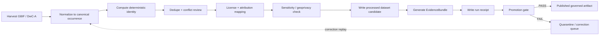

<!-- [KFM_META_BLOCK_V2]
doc_id: kfm://doc/NEEDS_VERIFICATION__kansas_biodiversity_etl_readme
title: Kansas Biodiversity ETL
type: standard
version: v1
status: draft
owners: NEEDS_VERIFICATION__@bartytime4life_or_biodiversity_domain_owner
created: NEEDS_VERIFICATION__YYYY-MM-DD
updated: 2026-04-25
policy_label: NEEDS_VERIFICATION__public_or_internal
related: [
  ../../data/raw/README.md,
  ../../data/work/README.md,
  ../../data/quarantine/README.md,
  ../../data/processed/README.md,
  ../../data/catalog/README.md,
  ../../data/receipts/README.md,
  ../../data/proofs/README.md,
  ../../data/published/README.md,
  ../../tools/validators/promotion_gate/README.md,
  ../../schemas/contracts/v1/README.md,
  ../../policy/README.md
]
tags: [kfm, etl, biodiversity, occurrences, dwc, gbif, evidencebundle, provenance, promotion-gate]
notes: [
  "README target path is inferred from the supplied draft: pipelines/kansas_biodiversity_etl/README.md.",
  "Implementation presence, package manager, CLI entrypoints, schema home, and active workflow names remain NEEDS_VERIFICATION until checked in the mounted repository.",
  "Biodiversity is a higher-burden lane; rights, sensitivity, geoprivacy, steward review, and public/steward access split must fail closed.",
  "The prior draft used policy_label=evidence-first; accepted policy_label vocabulary should be verified before publication."
]
[/KFM_META_BLOCK_V2] -->

# Kansas Biodiversity ETL

Incremental, evidence-first occurrence pipeline for Kansas biodiversity records, from **GBIF / DwC-A harvest** to **EvidenceBundle-backed, promotion-gated publication**.

> [!IMPORTANT]
> This README defines the **contract-level pipeline shape**. It does not prove that the active repository already contains every script, validator, schema, workflow, Make target, or published artifact named below.


**Status:** `experimental` / `draft`  
**Owners:** `NEEDS_VERIFICATION__@bartytime4life_or_biodiversity_domain_owner`  
**Path:** `pipelines/kansas_biodiversity_etl/README.md` *(inferred from supplied draft)*  
**Repo fit:** pipeline README for a staged biodiversity occurrence lane; downstream users should consume governed published artifacts, not raw harvests.

**Quick jumps:** [Scope](#scope) · [Repo fit](#repo-fit) · [Accepted inputs](#accepted-inputs) · [Exclusions](#exclusions) · [Directory tree](#directory-tree) · [Pipeline overview](#pipeline-overview) · [Stage contract](#stage-contract) · [Promotion gate](#promotion-gate) · [Quickstart](#quickstart-proposed) · [Definition of done](#definition-of-done) · [Verification backlog](#verification-backlog) · [Appendix](#appendix)

---

## Scope

This pipeline turns Kansas biodiversity occurrence inputs into deterministic, reviewable, policy-aware datasets.

It is designed to preserve the KFM truth path:

```text
RAW -> WORK / QUARANTINE -> PROCESSED -> CATALOG / TRIPLET -> PUBLISHED
```

The public value is not “a species dot on a map.” The public value is an **inspectable occurrence claim** that can resolve to source identity, license posture, sensitivity treatment, review state, release state, and correction lineage.

### Included

- Kansas biodiversity occurrence records where `stateProvince = Kansas` or equivalent spatial filtering is proven.
- Global Biodiversity Information Facility records from API, export, or download workflows.
- Darwin Core Archive inputs from IPT or similar DwC-A providers.
- Incremental harvesting based on source-supported modification timestamps or run manifests.
- Canonical record normalization.
- Geometry normalization to `EPSG:4326`.
- Deterministic `spec_hash` identity.
- Deduplication, license mapping, attribution capture, sensitivity enforcement, EvidenceBundle emission, run receipt emission, and promotion gate validation.

### Boundary posture

| Area | Posture |
| --- | --- |
| Source family | `GBIF`, `DwC-A`, and related occurrence sources |
| Domain burden | Higher than hydrology/soils because biodiversity carries rights, sensitivity, geoprivacy, interpretation, and public/steward access burdens |
| Publication stance | Fail closed until EvidenceBundle, license, attribution, sensitivity, and promotion evidence are complete |
| Public UI stance | Downstream only; UI must use governed APIs / released artifacts |
| AI stance | Interpretive only; generated summaries never replace EvidenceBundle or policy state |

[Back to top](#kansas-biodiversity-etl)

---

## Repo fit

**Inferred target path**

```text
pipelines/kansas_biodiversity_etl/README.md
```

**Upstream dependencies**

| Upstream surface | Role | Status |
| --- | --- | --- |
| `../../data/raw/` | stores captured source payloads before normalization | NEEDS_VERIFICATION |
| `../../data/work/` | stores normalized/intermediate work products | NEEDS_VERIFICATION |
| `../../data/quarantine/` | stores invalid, conflicted, sensitive, or blocked records | NEEDS_VERIFICATION |
| `../../schemas/contracts/v1/` | expected schema / contract home for machine-readable objects | NEEDS_VERIFICATION |
| `../../policy/` | policy-as-code or policy documentation for release decisions | NEEDS_VERIFICATION |
| `../../tools/validators/promotion_gate/` | promotion gate validation surface | NEEDS_VERIFICATION |

**Downstream dependencies**

| Downstream surface | Role | Status |
| --- | --- | --- |
| `../../data/processed/kansas_occurrences/` | normalized dataset output | PROPOSED |
| `../../data/catalog/` | catalog records / source-discovery records | NEEDS_VERIFICATION |
| `../../data/receipts/` | run receipts and signing records | NEEDS_VERIFICATION |
| `../../data/proofs/` | proof packs / validation evidence | NEEDS_VERIFICATION |
| `../../data/published/` | promotion-gated public or stewarded artifacts | NEEDS_VERIFICATION |
| governed API / MapLibre UI | may consume only published, governed outputs | UNKNOWN |

> [!WARNING]
> Do not wire public map layers, Focus Mode, Evidence Drawer, or AI summaries directly to `raw`, `work`, `quarantine`, or unpublished candidate data.

[Back to top](#kansas-biodiversity-etl)

---

## Accepted inputs

Inputs belong here only if they can be recorded with source identity, license posture, time of retrieval, and release obligations.

| Input | Accepted when | Required evidence |
| --- | --- | --- |
| GBIF occurrence API result | query, response metadata, and source URI are captured | source URI, query parameters, retrieval timestamp, license fields |
| GBIF download/export | download key or export manifest is captured | download URI/key, predicates, source dataset metadata, checksum where available |
| DwC-A archive | archive source, terms, and metadata are captured | archive URI, EML / metadata, source organization, retrieval timestamp |
| Synthetic fixture | explicitly marked non-live and safe | fixture manifest, expected validator result |
| Corrected replay input | linked to previous receipt and correction record | prior `spec_hash`, correction reason, replacement receipt |

### Minimum source fields

```json
{
  "source_id": "NEEDS_VERIFICATION__source_id",
  "source_family": "GBIF_OR_DWCA",
  "source_uri": "https://example.org/source",
  "retrieved_at": "ISO8601",
  "query_or_manifest": "stateProvince=Kansas&modified>=...",
  "license_raw": "CC0 | CC-BY | NEEDS_VERIFICATION",
  "attribution_raw": "NEEDS_VERIFICATION",
  "sensitivity_terms": "NEEDS_VERIFICATION",
  "source_role": "occurrence_aggregator | collection_provider | steward_reviewed | NEEDS_VERIFICATION"
}
```

[Back to top](#kansas-biodiversity-etl)

---

## Exclusions

These do **not** belong in this pipeline path.

| Excluded item | Why | Preferred destination |
| --- | --- | --- |
| Raw API passthrough for public clients | bypasses governance and promotion | governed API over published artifacts |
| Unknown-license records | cannot be released safely | `data/quarantine/` |
| Non-attributed records requiring attribution | release obligation is incomplete | `data/quarantine/` or source correction queue |
| Exact sensitive locality records without policy clearance | can expose protected taxa or steward-controlled sites | redacted derivative or steward-only access path |
| Taxonomic backbone authority claims | occurrence aggregators are not automatically taxonomy authorities | taxonomy resolver / source-role registry |
| Habitat suitability claims | occurrence ≠ habitat proof | habitat/fauna/flora lane with separate evidence |
| Live connector credentials | README should not contain secrets | secrets manager / deployment config |
| UI popups or AI summaries | interpretive surfaces only | governed UI/API contracts |

[Back to top](#kansas-biodiversity-etl)

---

## Directory tree

PROPOSED until the mounted repository confirms the actual pipeline conventions.

```text
pipelines/kansas_biodiversity_etl/
├── README.md
├── harvest/
│   └── README.md                         # source capture rules; PROPOSED
├── normalize/
│   └── README.md                         # DwC -> canonical mapping; PROPOSED
├── dedupe/
│   └── README.md                         # deterministic identity and merge rules; PROPOSED
├── license/
│   └── README.md                         # license mapping and attribution obligations; PROPOSED
├── sensitivity/
│   └── README.md                         # geoprivacy and exact-location handling; PROPOSED
├── publish/
│   └── README.md                         # dataset, EvidenceBundle, and receipt writer; PROPOSED
└── scripts/
    └── README.md                         # CLI / make target notes; PROPOSED
```

### Lifecycle alignment

| Stage | Path | Rule |
| --- | --- | --- |
| Raw | `../../data/raw/{source}/{YYYYMMDD}/` | captured input only; no public use |
| Work | `../../data/work/kansas_biodiversity_etl/` | intermediate transformations |
| Quarantine | `../../data/quarantine/kansas_biodiversity_etl/` | invalid, blocked, conflicted, or sensitive records |
| Processed | `../../data/processed/kansas_occurrences/` | normalized dataset candidates |
| Catalog | `../../data/catalog/` | dataset/source metadata |
| Receipts | `../../data/receipts/` | process memory and signing records |
| Proofs | `../../data/proofs/` | validator and promotion evidence |
| Published | `../../data/published/` | promotion-gated artifacts only |

[Back to top](#kansas-biodiversity-etl)

---

## Pipeline overview



### Responsibility split

| Responsibility | Must happen here | Must not happen here |
| --- | --- | --- |
| Source capture | record query, retrieval time, source URI, license fields | silently rewrite raw source evidence |
| Normalization | map DwC fields to canonical occurrence shape | invent missing source facts |
| Identity | compute stable `spec_hash` from canonical content | include transient ingest metadata in identity |
| Policy | fail closed on rights/sensitivity gaps | release exact sensitive locality by default |
| Publication | emit evidence and promotion records | move files to published without gate evidence |

[Back to top](#kansas-biodiversity-etl)

---

## Stage contract

### 1. Harvest

Harvest records only when the query or archive request is reproducible.

```json
{
  "harvest_time": "ISO8601",
  "source_family": "GBIF_OR_DWCA",
  "query": "stateProvince=Kansas&modified>=...",
  "source_uris": ["https://example.org/source"],
  "retrieval_method": "api | download | dwca",
  "operator_or_workflow": "NEEDS_VERIFICATION"
}
```

**Failure disposition**

| Condition | Disposition |
| --- | --- |
| Missing source URI | `FAIL` |
| Missing retrieval timestamp | `FAIL` |
| Unresolvable source | `QUARANTINE` |
| Source terms unavailable | `QUARANTINE` |

### 2. Normalize

Map Darwin Core fields into a canonical KFM occurrence record.

| Canonical field | Source field / derivation | Notes |
| --- | --- | --- |
| `occurrence_id` | `occurrenceID` or stable source identifier | preferred when present |
| `catalog_id` | `catalogNumber` | not globally unique alone |
| `taxon` | `scientificName` | taxonomic authority remains source-role bound |
| `event_date` | `eventDate` | preserve uncertainty where present |
| `geometry` | `decimalLatitude` + `decimalLongitude` | CRS must be `EPSG:4326` |
| `uncertainty_m` | `coordinateUncertaintyInMeters` | required for precision-aware publication |
| `institution` | `institutionCode` | attribution input |
| `collection` | `collectionCode` | attribution input |
| `license_raw` | `license` | fail closed when missing or unknown |
| `basis_of_record` | `basisOfRecord` | specimen / observation distinction |
| `source_uri` | source record URL | required for EvidenceBundle closure |

**Geometry rule**

```text
geometry.crs MUST equal EPSG:4326
invalid_or_missing_coordinates -> QUARANTINE unless record is intentionally non-spatial
```

### 3. Compute deterministic identity

```text
spec_hash = sha256(canonical_record_without_transients)
```

Exclude transient fields from the hash:

- ingest timestamp
- row index
- local file path
- pipeline runtime metadata
- non-semantic ordering

> [!NOTE]
> Exact canonical serialization rules are **NEEDS_VERIFICATION** until the active repository confirms whether KFM uses JCS, a custom canonical JSON serializer, or another stable serialization contract.

### 4. Deduplicate and classify conflicts

| Key type | Rule | Disposition |
| --- | --- | --- |
| Primary | `institutionCode + collectionCode + catalogNumber` | merge when exact and non-conflicting |
| Source occurrence | `occurrenceID` | preserve as source identity |
| Fallback | `round(lat,5) + round(lon,5) + event_date + taxon` | mark as probable duplicate |
| Conflict | same identity with incompatible values | route to quarantine / review |

```text
fallback_key = round(lat, 5) + round(lon, 5) + event_date + normalized_taxon
```

### 5. Map license and attribution

| Raw license | Canonical license | Action |
| --- | --- | --- |
| `CC0` | `CC0` | allow if all other gates pass |
| `CC-BY` | `CC-BY-4.0` or verified equivalent | allow with attribution |
| missing | `UNKNOWN` | fail |
| ambiguous | `NEEDS_VERIFICATION` | quarantine |
| restricted | `RESTRICTED` | steward-only or blocked until policy allows |

Attribution must be preserved as a release obligation.

```text
"R.L. McGregor Herbarium (KANU) via GBIF"
```

### 6. Enforce sensitivity and geoprivacy

If a record is sensitive, publication must use a reviewed transform:

- remove geometry,
- generalize geometry,
- reduce coordinate precision,
- publish steward-only exact geometry, or
- deny publication.

Policy posture, expressed as pseudocode:

```text
fail_closed_if(sensitivity_required AND no_redaction_or_access_control_applied)
fail_closed_if(exact_sensitive_geometry AND public_release_requested)
```

### 7. Write processed dataset candidate

```text
../../data/processed/kansas_occurrences/
├── part-*.parquet
└── _dataset_metadata.json
```

Minimum metadata:

```json
{
  "dataset_id": "kansas_occurrences",
  "spec_hash": "sha256:...",
  "record_count": 12345,
  "created_at": "ISO8601",
  "source_families": ["GBIF", "DwC-A"],
  "crs": "EPSG:4326",
  "license_summary": ["CC0", "CC-BY-4.0", "RESTRICTED"],
  "sensitivity_summary": {
    "public_exact": 0,
    "generalized": 0,
    "removed": 0,
    "restricted": 0
  }
}
```

### 8. Emit EvidenceBundle

EvidenceBundle is required before promotion.

```json
{
  "evidenceBundle": {
    "bundle_id": "kfm://evidence-bundle/NEEDS_VERIFICATION",
    "spec_hash": "sha256:...",
    "items": 12345,
    "harvest_date": "ISO8601",
    "source_uris": ["https://example.org/source"],
    "license": "CC0 | CC-BY-4.0 | Restricted",
    "attribution": "NEEDS_VERIFICATION",
    "obligations": [
      "retain attribution",
      "redact sensitive coordinates"
    ],
    "policy_refs": [
      "NEEDS_VERIFICATION__policy_ref"
    ]
  }
}
```

### 9. Emit run receipt and signature

```text
../../data/receipts/YYYYMMDD/kansas_biodiversity_etl/run_receipt.json
```

Signing surface is PROPOSED until repo tooling is verified:

| Tooling | Status |
| --- | --- |
| DSSE envelope | PROPOSED |
| cosign / Sigstore | NEEDS_VERIFICATION |
| local hash manifest | PROPOSED |
| promotion proof pack | PROPOSED |

[Back to top](#kansas-biodiversity-etl)

---

## Promotion gate

Publication is a governed state transition, not a file move.

| Gate | Check | Pass condition | Failure disposition |
| --- | --- | --- | --- |
| A | EvidenceBundle present | bundle exists and resolves | `FAIL` |
| B | `spec_hash` matches dataset | recomputed hash equals recorded hash | `FAIL` |
| C | Sources resolvable | source URIs and source descriptors resolve | `FAIL` or `QUARANTINE` |
| D | License valid | every released record has allowed license posture | `FAIL` |
| E | Attribution preserved | obligations recorded and included downstream | `FAIL` |
| F | Sensitivity enforced | exact sensitive locality is denied, redacted, generalized, or steward-controlled | `FAIL` |
| G | Counts consistent | source, processed, and bundle counts reconcile | `FAIL` |
| H | Signature / integrity verified | receipt and manifest integrity check passes | `FAIL` |
| I | Review state acceptable | steward/reviewer state meets lane policy | `FAIL` |

Failure route:

```text
../../data/quarantine/kansas_biodiversity_etl/
```

[Back to top](#kansas-biodiversity-etl)

---

## Quickstart PROPOSED

These commands are a desired workflow shape, not verified active entrypoints.

```bash
# PROPOSED: initialize incremental watermark
printf '%s\n' '2026-04-01T00:00:00Z' > ../../data/registry/kansas_biodiversity_last_modified.txt

# PROPOSED: run no-publication pipeline sequence
make harvest-biodiversity
make normalize-biodiversity
make dedupe-biodiversity
make license-biodiversity
make sensitivity-biodiversity
make evidence-biodiversity
make gate-biodiversity
```

If the repository does not use `make`, map the same stages to repo-native scripts after inspection.

### Script-level fallback PROPOSED

```bash
# PROPOSED: script names are placeholders until repo inspection
python harvest/harvest_kansas.py --since ../../data/registry/kansas_biodiversity_last_modified.txt
python normalize/normalize_dwc.py ../../data/raw/gbif/
python dedupe/dedupe_occurrences.py ../../data/work/kansas_biodiversity_etl/normalized.parquet
python license/map_license.py ../../data/work/kansas_biodiversity_etl/deduped.parquet
python sensitivity/apply_geoprivacy.py ../../data/work/kansas_biodiversity_etl/licensed.parquet
python publish/write_evidence_bundle.py ../../data/processed/kansas_occurrences/
python ../../tools/validators/promotion_gate/run.py --lane kansas_biodiversity_etl
```

[Back to top](#kansas-biodiversity-etl)

---

## Failure modes

| Condition | Behavior | Why |
| --- | --- | --- |
| Missing license | `FAIL` | release rights are unresolved |
| Unknown attribution obligation | `FAIL` | downstream publication would be non-compliant |
| Invalid geometry | `QUARANTINE` | spatial claim is unsafe |
| Missing source URI | `FAIL` | EvidenceBundle cannot close |
| EvidenceBundle absent | `FAIL` | no inspectable claim chain |
| `spec_hash` mismatch | `FAIL` | artifact integrity is broken |
| Sensitive exact locality without transform | `FAIL` | geoprivacy violation |
| Duplicate conflict | `QUARANTINE` | review required |
| Live source terms not verified | `FAIL` | source activation is not safe |

[Back to top](#kansas-biodiversity-etl)

---

## Determinism guarantees

This pipeline should provide these guarantees before publication:

- same canonical inputs produce the same `spec_hash`;
- hashing is order independent where record order is non-semantic;
- transient ingest metadata is excluded from record identity;
- every promoted dataset resolves to an EvidenceBundle;
- every EvidenceBundle resolves to source URIs, license posture, attribution obligations, and sensitivity handling;
- every correction or replay creates a new receipt rather than silently mutating release history.

[Back to top](#kansas-biodiversity-etl)

---

## Definition of done

A Kansas biodiversity occurrence dataset is publishable only when all checks below are true.

- [ ] Source descriptors or source records exist for every input source.
- [ ] All source records have captured retrieval time, query/archive identity, license posture, and attribution obligations.
- [ ] Canonical normalization is complete and schema-valid.
- [ ] Geometry is valid or intentionally absent.
- [ ] Sensitive records are denied, redacted, generalized, or steward-controlled according to policy.
- [ ] Deduplication is deterministic and conflict records are quarantined.
- [ ] `spec_hash` is stable and verified.
- [ ] EvidenceBundle is complete and resolvable.
- [ ] Run receipt is written.
- [ ] Integrity/signature check passes or is explicitly marked `NEEDS_VERIFICATION` before non-public dry run.
- [ ] Promotion gate passes.
- [ ] Published artifact path is updated only through the governed promotion transition.
- [ ] Downstream UI/API consumers receive only governed published artifacts.

[Back to top](#kansas-biodiversity-etl)

---

## Verification backlog

These items must be resolved before treating this README as an implementation claim.

| Item | Status | Why it matters |
| --- | --- | --- |
| Confirm target path `pipelines/kansas_biodiversity_etl/README.md` | NEEDS_VERIFICATION | inferred from supplied draft |
| Confirm owner | NEEDS_VERIFICATION | owner field cannot be assumed from draft alone |
| Confirm accepted `policy_label` vocabulary | NEEDS_VERIFICATION | meta block requires repo-specific policy label |
| Confirm schema home | NEEDS_VERIFICATION | `schemas/contracts/v1` vs other contract home may differ |
| Confirm package manager / runner | UNKNOWN | quickstart uses PROPOSED commands only |
| Confirm promotion gate path | NEEDS_VERIFICATION | validator path is inferred from KFM patterns |
| Confirm signing toolchain | NEEDS_VERIFICATION | DSSE/cosign are proposed, not verified active tooling |
| Confirm GBIF / DwC-A source terms at activation time | NEEDS_VERIFICATION | source rights and API behavior can change |
| Confirm sensitive species policy | NEEDS_VERIFICATION | exact locality handling requires steward/policy rules |
| Confirm public vs stewarded access split | NEEDS_VERIFICATION | biodiversity lane carries geoprivacy burden |

[Back to top](#kansas-biodiversity-etl)

---

## Future extensions PROPOSED

Only add these after the core proof path is working.

| Extension | Add when | Guardrail |
| --- | --- | --- |
| Taxonomic backbone reconciliation | taxonomy source-role registry exists | occurrence source must not become taxonomy authority by accident |
| Habitat overlays | habitat/fauna/flora joins are governed | occurrence ≠ habitat proof |
| Temporal occurrence change products | time validity and sampling caveats are modeled | avoid false trend claims |
| STAC/DCAT catalog emission | catalog schema is verified | catalog metadata must not replace EvidenceBundle |
| MapLibre layer descriptor | public-safe derivatives exist | no exact sensitive geometry |
| Focus Mode summaries | citation validator and EvidenceBundle resolver work | cite-or-abstain only |

[Back to top](#kansas-biodiversity-etl)

---

## FAQ

### Can the UI read this pipeline directly?

No. Public and normal UI surfaces should use governed APIs and released artifacts. Raw, work, quarantine, and unpublished candidate outputs are not UI surfaces.

### Can GBIF data be published automatically after harvest?

No. GBIF or DwC-A harvest is only the first step. Publication requires license mapping, attribution obligations, sensitivity checks, EvidenceBundle closure, run receipt, and promotion gate pass.

### Is a biodiversity occurrence a habitat claim?

No. An occurrence is evidence that a source reported a taxon at a place/time under a source-specific observation or specimen model. Habitat claims require additional evidence and a separate governed relation.

### What happens to sensitive exact coordinates?

They fail closed unless a policy-approved transform or steward-controlled access path exists. Public exact sensitive locality exposure is denied by default.

[Back to top](#kansas-biodiversity-etl)

---

## Appendix

<details>
<summary>Sample quarantine record</summary>

```json
{
  "quarantine_record": {
    "record_ref": "sha256:...",
    "source_family": "GBIF",
    "reason": "missing_license",
    "detected_at": "ISO8601",
    "stage": "license_mapping",
    "disposition": "BLOCK_PUBLIC_RELEASE",
    "next_action": "source_terms_review"
  }
}
```

</details>

<details>
<summary>Sample redaction receipt</summary>

```json
{
  "redaction_receipt": {
    "receipt_id": "kfm://receipt/NEEDS_VERIFICATION",
    "input_record_hash": "sha256:...",
    "output_record_hash": "sha256:...",
    "reason": "sensitive_locality",
    "transform": "coordinate_removed",
    "policy_ref": "NEEDS_VERIFICATION__policy_ref",
    "performed_at": "ISO8601"
  }
}
```

</details>

<details>
<summary>Illustrative source-role notes</summary>

| Source role | Can support | Cannot support by itself |
| --- | --- | --- |
| `occurrence_aggregator` | reported occurrence evidence | legal status, steward approval, habitat suitability |
| `collection_provider` | specimen or collection-backed record | unrestricted public release |
| `steward_reviewed` | policy-reviewed release posture | universal truth outside stated scope |
| `taxonomy_authority` | accepted taxon identity, if source is actually authoritative | occurrence presence without occurrence evidence |

</details>

[Back to top](#kansas-biodiversity-etl)
