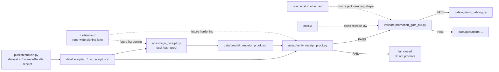

<!-- [KFM_META_BLOCK_V2]
doc_id: kfm://doc/NEEDS_VERIFICATION__kansas_biodiversity_etl_attest_readme
title: Kansas Biodiversity ETL Attestation Helpers
type: standard
version: v1
status: draft
owners: NEEDS_VERIFICATION__@bartytime4life_or_biodiversity_domain_owner
created: NEEDS_VERIFICATION__YYYY-MM-DD
updated: 2026-04-25
policy_label: NEEDS_VERIFICATION__public_or_internal
related: [
  ../README.md,
  ../Makefile,
  ../publish/README.md,
  ../validate/README.md,
  ../../../data/receipts/README.md,
  ../../../data/proofs/README.md,
  ../../../tools/attest/README.md,
  ../../../tools/validators/README.md,
  ../../../tools/validators/promotion_gate/README.md,
  ../../../contracts/README.md,
  ../../../schemas/README.md,
  ../../../policy/README.md
]
tags: [kfm, biodiversity, etl, attestation, receipts, proofs, spec-hash, promotion-gate]
notes: [
  "Target path is provided by the task: pipelines/kansas_biodiversity_etl/attest/README.md.",
  "This README documents a pipeline-local proof shim proposed during the Kansas biodiversity ETL thin-slice work.",
  "Full cosign, DSSE, Rekor, workflow callers, and merge-blocking enforcement remain NEEDS VERIFICATION until active-branch tooling is inspected.",
  "Receipt/proof/catalog/publication separation is preserved intentionally."
]
[/KFM_META_BLOCK_V2] -->

<a id="top"></a>

# Kansas Biodiversity ETL Attestation Helpers

Pipeline-local receipt proof helpers for the Kansas biodiversity ETL, used to bind generated run receipts to reviewable proof artifacts before promotion.

<div align="left">


</div>

| Impact field | Value |
| --- | --- |
| **Status** | `experimental` |
| **Owners** | `NEEDS_VERIFICATION__@bartytime4life_or_biodiversity_domain_owner` |
| **Path** | `pipelines/kansas_biodiversity_etl/attest/README.md` |
| **Primary role** | pipeline-local receipt proof creation and verification |
| **Trust posture** | local deterministic proof shim; not a substitute for release-grade cosign / DSSE attestation |
| **Quick jumps** | [Scope](#scope) · [Repo fit](#repo-fit) · [Accepted inputs](#accepted-inputs) · [Exclusions](#exclusions) · [Directory tree](#directory-tree) · [Quickstart](#quickstart) · [Usage](#usage) · [Diagram](#diagram) · [Reference tables](#reference-tables) · [Task list](#task-list) · [FAQ](#faq) |

> [!IMPORTANT]
> This lane creates and verifies **local receipt hash proofs** for the Kansas biodiversity ETL. It does **not** replace `tools/attest/`, release proof packs, DSSE envelopes, cosign verification, policy decisions, catalog closure, or governed publication.

> [!TIP]
> Keep the KFM trust split visible:
>
> **receipt ≠ proof ≠ catalog ≠ publication**
>
> This directory may help bind a pipeline receipt to a proof artifact. It must not become the canonical proof store, release system, policy engine, or publication lane.

---

## Scope

`pipelines/kansas_biodiversity_etl/attest/` is a narrow, pipeline-local helper lane for receipt proof work inside the Kansas biodiversity ETL.

It exists to support this bounded sequence:

```text
publish -> run_receipt.json -> receipt_proof.json -> verify proof -> promotion gate
```

### Included

- local proof creation for `run_receipt.json`
- receipt hash calculation
- proof JSON emission into the pipeline proof path
- proof verification before or during promotion checks
- deterministic, reviewable failure reasons

### Boundary posture

| Area | Posture |
| --- | --- |
| Helper maturity | **PROPOSED / NEEDS VERIFICATION** until active branch confirms files |
| Attestation strength | local hash proof shim only |
| Release-grade signing | **NEEDS VERIFICATION** |
| Cosign / DSSE / Rekor | referenced as future or externalized hardening, not claimed active |
| Promotion relation | supports promotion gate; does not decide promotion |
| Proof custody | durable proof artifacts belong under `data/proofs/` |

[Back to top](#top)

---

## Repo fit

**Target path**

```text
pipelines/kansas_biodiversity_etl/attest/README.md
```

### Upstream and downstream surfaces

| Relation | Surface | Role | Status |
| --- | --- | --- | --- |
| Pipeline parent | [`../README.md`](../README.md) | Kansas biodiversity ETL contract, stages, and promotion posture | **CONFIRMED adjacent doc / NEEDS VERIFICATION active branch** |
| Publisher | [`../publish/`](../publish/) | emits dataset, metadata, EvidenceBundle, and run receipt | **PROPOSED implementation lane** |
| Validator | [`../validate/`](../validate/) | validates dataset, EvidenceBundle, metadata, and optionally proof state | **PROPOSED implementation lane** |
| Run receipt storage | [`../../../data/receipts/README.md`](../../../data/receipts/README.md) | process memory for runs and review support | **CONFIRMED doctrine** |
| Proof storage | [`../../../data/proofs/README.md`](../../../data/proofs/README.md) | durable proof and release-evidence objects | **CONFIRMED doctrine** |
| General attestation lane | [`../../../tools/attest/README.md`](../../../tools/attest/README.md) | repo-wide signing / verification helper surface | **CONFIRMED adjacent lane** |
| Validator family | [`../../../tools/validators/README.md`](../../../tools/validators/README.md) | deterministic fail-closed checks | **CONFIRMED doctrine** |
| Promotion gate | [`../../../tools/validators/promotion_gate/README.md`](../../../tools/validators/promotion_gate/README.md) | broader promotion gate doctrine | **CONFIRMED adjacent lane** |
| Policy | [`../../../policy/README.md`](../../../policy/README.md) | release law, deny/allow/abstain, obligations | **NEEDS VERIFICATION path** |
| Contracts / schemas | [`../../../contracts/README.md`](../../../contracts/README.md), [`../../../schemas/README.md`](../../../schemas/README.md) | object meaning and machine shape | **NEEDS VERIFICATION path** |

> [!WARNING]
> Do not let this pipeline-local lane fork or compete with `tools/attest/`. If repo-wide signing helpers become available, this lane should either call them or document why it remains a temporary shim.

[Back to top](#top)

---

## Accepted inputs

Inputs belong here only when they are already generated by the governed pipeline and are safe to hash, verify, and reference.

| Input | Accepted when | Required handling |
| --- | --- | --- |
| `run_receipt.json` | emitted by the publisher for a bounded ETL run | hash the exact file bytes |
| explicit proof output path | points under `../../../data/proofs/` or an approved proof-equivalent path | create parent directories; write deterministic JSON |
| signer label | human or automation label, not a private key | record as declared metadata only |
| existing `receipt_proof.json` | used by verification helper | compare declared hash to current receipt bytes |
| promotion gate proof argument | passed explicitly by Makefile or validator | fail closed when missing or mismatched |

### Minimum proof fields

A local proof artifact should include at least:

```json
{
  "proof_type": "kfm.local_receipt_hash_proof.v1",
  "receipt": "../../../data/receipts/kansas_biodiversity_etl/YYYYMMDD/run_receipt.json",
  "receipt_hash": "sha256:...",
  "signed_at": "ISO8601",
  "signer": "@bartytime4life",
  "attestation_verified": false
}
```

> [!NOTE]
> `attestation_verified: false` is intentional for the local shim. Do not mark this true unless a real verified attestation profile is wired and checked.

[Back to top](#top)

---

## Exclusions

These do **not** belong in this directory.

| Excluded item | Put it here instead | Why |
| --- | --- | --- |
| durable proof packs | [`../../../data/proofs/`](../../../data/proofs/) | proof custody belongs in the data proof lane |
| process-memory receipts | [`../../../data/receipts/`](../../../data/receipts/) | receipts are inputs, not owned by this helper lane |
| release-grade signing policy | [`../../../tools/attest/`](../../../tools/attest/) and policy/release docs | pipeline-local helpers should not define trust-root law |
| promotion decision logic | [`../validate/`](../validate/) or [`../../../tools/validators/promotion_gate/`](../../../tools/validators/promotion_gate/) | validators decide pass/fail posture |
| EvidenceBundle schema or semantics | [`../../../contracts/`](../../../contracts/) and [`../../../schemas/`](../../../schemas/) | object law must not hide in helper code |
| catalog closure | `../../../data/catalog/` | STAC/DCAT/PROV closure is a separate surface |
| publication moves | `../../../data/published/` through governed promotion | proof creation is not publication |
| private keys, tokens, signing secrets | secret-management surfaces outside repo | do not commit trust-root material |
| raw occurrence payloads or sensitive exact geometry | `../../../data/raw/`, `../../../data/quarantine/`, governed restricted storage | attestation traceability is not permission to leak protected content |

[Back to top](#top)

---

## Directory tree

### Proposed local helper shape

```text
pipelines/kansas_biodiversity_etl/
└── attest/
    ├── README.md
    ├── sign_receipt.py             # PROPOSED / NEEDS VERIFICATION
    └── verify_receipt_proof.py     # PROPOSED / NEEDS VERIFICATION
```

### Expected lifecycle outputs

```text
data/
├── receipts/
│   └── kansas_biodiversity_etl/
│       └── YYYYMMDD/
│           └── run_receipt.json
└── proofs/
    └── kansas_biodiversity_etl/
        └── YYYYMMDD/
            └── receipt_proof.json
```

### Related pipeline stages

```text
pipelines/kansas_biodiversity_etl/
├── harvest/
├── normalize/
├── dedupe/
├── publish/
├── attest/
├── validate/
└── catalog/
```

> [!NOTE]
> The helper filenames above are the proposed thin-slice names from this ETL buildout. Treat them as **NEEDS VERIFICATION** until the active repository branch confirms they exist.

[Back to top](#top)

---

## Quickstart

Run from:

```text
pipelines/kansas_biodiversity_etl/
```

### 1. Create a local receipt proof

```bash
python attest/sign_receipt.py \
  --receipt ../../data/receipts/kansas_biodiversity_etl/20260425/run_receipt.json \
  --proof-output ../../data/proofs/kansas_biodiversity_etl/20260425/receipt_proof.json \
  --signer "@bartytime4life"
```

Expected output shape:

```json
{
  "decision": "PROOF_WRITTEN",
  "proof": "../../data/proofs/kansas_biodiversity_etl/20260425/receipt_proof.json"
}
```

### 2. Verify the proof

```bash
python attest/verify_receipt_proof.py \
  --receipt ../../data/receipts/kansas_biodiversity_etl/20260425/run_receipt.json \
  --proof ../../data/proofs/kansas_biodiversity_etl/20260425/receipt_proof.json
```

Expected output shape:

```json
{
  "decision": "PASS",
  "receipt_hash": "sha256:..."
}
```

### 3. Wire through Makefile

```makefile
PROOF := $(PROOFS_DIR)/receipt_proof.json

sign:
	python attest/sign_receipt.py \
		--receipt $(RECEIPT) \
		--proof-output $(PROOF) \
		--signer "@bartytime4life"

verify-proof:
	python attest/verify_receipt_proof.py \
		--receipt $(RECEIPT) \
		--proof $(PROOF)
```

Suggested pipeline order:

```text
harvest
normalize
dedupe
publish
sign
verify-proof
gate
catalog
```

[Back to top](#top)

---

## Usage

### `sign_receipt.py`

**Role:** create a local proof artifact that binds a receipt path to the receipt’s current SHA-256 hash.

| Argument | Meaning | Required |
| --- | --- | --- |
| `--receipt` | path to the run receipt JSON | yes |
| `--proof-output` | path for the proof JSON | yes |
| `--signer` | declared signer label | no, but recommended |

Expected behavior:

- fail if receipt is missing
- hash the receipt file bytes
- write a proof JSON object
- set `attestation_verified` to `false`
- print a compact machine-readable result

### `verify_receipt_proof.py`

**Role:** fail closed unless the proof’s declared `receipt_hash` matches the current receipt bytes.

| Argument | Meaning | Required |
| --- | --- | --- |
| `--receipt` | path to the run receipt JSON | yes |
| `--proof` | path to the proof JSON | yes |

Expected failure reasons:

| Reason | Meaning |
| --- | --- |
| `receipt_missing` | receipt path does not exist |
| `proof_missing` | proof path does not exist |
| `invalid_proof_json` | proof cannot be parsed |
| `receipt_proof_hash_mismatch` | receipt changed after proof creation |

[Back to top](#top)

---

## Diagram



[Back to top](#top)

---

## Reference tables

### Boundary matrix

| Surface | Owns | Must not silently own |
| --- | --- | --- |
| `pipelines/kansas_biodiversity_etl/attest/` | pipeline-local receipt proof helper commands | release-grade trust-root law |
| `data/receipts/` | run and process memory | release proof authority |
| `data/proofs/` | durable proof and release-evidence artifacts | raw source custody or hidden policy |
| `tools/attest/` | repo-wide signing / verification helpers | policy or promotion law |
| `tools/validators/` | deterministic fail-closed validation | signing secrets or publication state |
| `policy/` | rights, sensitivity, obligations, deny/allow/abstain | helper implementation details |
| `contracts/` / `schemas/` | object semantics and machine shapes | pipeline-local convenience shortcuts |
| `data/catalog/` | STAC/DCAT/PROV closure | proof custody or receipt storage |
| `data/published/` | governed outward artifacts | raw, work, or candidate data |

### Local proof status vocabulary

| Status / field | Meaning |
| --- | --- |
| `PROOF_WRITTEN` | local proof file was created |
| `PASS` | current receipt hash matches proof |
| `FAIL` | proof check failed |
| `attestation_verified: false` | local proof exists, but release-grade attestation is not verified |
| `receipt_hash` | SHA-256 digest of the receipt file bytes |

### Required posture for future hardening

| Hardening step | Status until verified | Required evidence |
| --- | --- | --- |
| DSSE envelope | **NEEDS VERIFICATION** | checked-in helper, tests, expected envelope shape |
| cosign verification | **NEEDS VERIFICATION** | helper body, key identity policy, verification result shape |
| Rekor inclusion proof | **NEEDS VERIFICATION** | transparency-log policy and fixtures |
| CI enforcement | **NEEDS VERIFICATION** | workflow caller and required check evidence |
| merge-blocking promotion | **NEEDS VERIFICATION** | branch protection / ruleset / workflow evidence |

[Back to top](#top)

---

## Task list

### Minimum credible definition of done

- [ ] `doc_id`, `created`, owner, and `policy_label` placeholders are resolved or left as explicit review blockers.
- [ ] Active branch confirms whether `sign_receipt.py` exists.
- [ ] Active branch confirms whether `verify_receipt_proof.py` exists.
- [ ] Makefile calls the same helper paths documented here.
- [ ] Proof output lands in `data/proofs/`, not inside the helper directory.
- [ ] Receipt input comes from `data/receipts/`, not ad hoc local scratch.
- [ ] Negative-path verification is tested: missing receipt, missing proof, invalid proof JSON, and hash mismatch.
- [ ] Promotion gate either calls proof verification or documents proof verification as a required prior step.
- [ ] No secrets, private keys, exact sensitive geometry, or raw source payloads are written to proof files.
- [ ] Any cosign / DSSE / Rekor language remains **NEEDS VERIFICATION** until actual tooling exists.

### Review gates for edits to this lane

- [ ] Does the helper remain deterministic?
- [ ] Does it fail closed?
- [ ] Does it avoid publication side effects?
- [ ] Does it preserve receipt/proof separation?
- [ ] Does it avoid inventing schema or policy law?
- [ ] Can a reviewer reproduce the hash check locally?
- [ ] Are all stronger attestation claims backed by active-branch evidence?

[Back to top](#top)

---

## FAQ

### Is this real attestation?

Not yet. This lane documents a local receipt hash proof shim. It can help prove that a receipt has not changed since proof creation, but it is not equivalent to DSSE, cosign, Rekor, or a repo-approved release-grade attestation profile.

### Why keep this under the pipeline instead of `tools/attest/`?

Because this is a pipeline-local thin slice. If the helper becomes reusable across lanes, it should move to or wrap the repo-wide `tools/attest/` surface after active-branch verification.

### Can a passing proof publish the dataset?

No. A passing proof only supports integrity of the run receipt. Publication still requires dataset validation, EvidenceBundle checks, license and sensitivity gates, catalog/proof closure, and governed promotion.

### Should the proof include the full receipt?

No. The proof should reference the receipt and record its digest. Full process memory remains in `data/receipts/`.

### What happens when the receipt changes?

Verification must fail with `receipt_proof_hash_mismatch`. A changed receipt requires a new proof and, depending on policy, a new review trail.

### Can this handle sensitive biodiversity data?

Only indirectly. It can hash receipt bytes, but it must not store raw sensitive records, exact protected coordinates, or private source payloads in the proof object.

[Back to top](#top)
