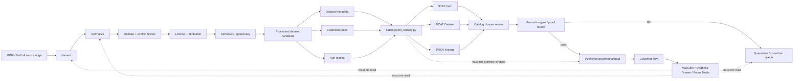

<!-- [KFM_META_BLOCK_V2]
doc_id: kfm://doc/NEEDS_VERIFICATION__pipelines_kansas_biodiversity_etl_catalog_readme
title: Kansas Biodiversity ETL Catalog
type: standard
version: v1
status: draft
owners: NEEDS_VERIFICATION__@bartytime4life_or_biodiversity_domain_owner
created: 2026-04-25
updated: 2026-04-25
policy_label: NEEDS_VERIFICATION__public_or_internal
related: [../README.md, ./emit_catalog.py, ../../README.md, ../../../data/catalog/README.md, ../../../data/catalog/stac/README.md, ../../../data/catalog/dcat/README.md, ../../../data/catalog/prov/README.md, ../../../data/receipts/README.md, ../../../data/proofs/README.md, ../../../data/published/README.md, ../../../schemas/README.md, ../../../contracts/README.md, ../../../policy/README.md, ../../../tools/validators/promotion_gate/README.md]
tags: [kfm, pipelines, biodiversity, catalog, stac, dcat, prov, evidence-bundle, receipts, promotion]
notes: [Current public main confirms this path exists and that this README is empty before revision; current public main also confirms sibling emit_catalog.py. Owners, policy_label, branch-local execution wiring, and catalog promotion enforcement remain NEEDS_VERIFICATION.]
[/KFM_META_BLOCK_V2] -->

<a id="top"></a>

# Kansas Biodiversity ETL Catalog

Catalog-closure README for the Kansas biodiversity occurrence pipeline’s STAC, DCAT, and PROV emitter.

> [!IMPORTANT]
> This directory is a **catalog closure seam**, not a promotion shortcut. It may emit catalog records for already-generated governed artifacts, but it must not publish data, bypass policy, override proofs, or turn catalog metadata into source truth.

<div align="left">


</div>

| Field | Value |
|---|---|
| **Status** | `experimental` / `draft` |
| **Owners** | `NEEDS_VERIFICATION__@bartytime4life_or_biodiversity_domain_owner` |
| **Path** | `pipelines/kansas_biodiversity_etl/catalog/README.md` |
| **Repo fit** | child README for catalog-emission logic inside the staged Kansas biodiversity ETL lane |
| **Current public-main inventory** | `README.md` + `emit_catalog.py` |
| **Primary artifact family** | `STAC Item` · `DCAT Dataset` · `PROV lineage document` |
| **Quick jumps** | [Scope](#scope) · [Repo fit](#repo-fit) · [Accepted inputs](#accepted-inputs) · [Exclusions](#exclusions) · [Directory tree](#directory-tree) · [Quickstart](#quickstart) · [Usage](#usage) · [Diagram](#diagram) · [Operating tables](#operating-tables) · [Task list](#task-list--definition-of-done) · [FAQ](#faq) · [Appendix](#appendix) |

---

## Scope

`catalog/` is the pipeline-local home for catalog-closure emission around the Kansas biodiversity occurrence dataset candidate.

It exists to help the pipeline turn already-produced governed artifacts into reviewable metadata records:

- a **STAC Item** for spatial/temporal artifact discovery,
- a **DCAT Dataset** for dataset/distribution description,
- a **PROV lineage document** for entity/activity/source linkage.

The catalog stage should make the release candidate easier to inspect. It does **not** make the release candidate safe, promoted, public, or authoritative by itself.

### What this directory should make clear

| Question | Expected answer |
|---|---|
| What catalog records are emitted? | STAC, DCAT, and PROV records for the Kansas biodiversity occurrence candidate. |
| What must already exist? | Dataset metadata, an `EvidenceBundle`, and a run receipt. |
| What does catalog closure prove? | Metadata cross-linkage and lineage description, subject to validation. |
| What does it not prove? | Publication approval, source authority, policy clearance, or sensitive-location safety. |
| What remains downstream? | Promotion gate, proof review, release state, published alias, governed API/UI consumption. |

[Back to top](#top)

---

## Repo fit

This README sits inside the staged Kansas biodiversity ETL lane.

### Path and neighboring surfaces

| Relationship | Surface | Role | Status |
|---|---|---|---|
| Parent pipeline lane | [`../README.md`](../README.md) | Defines the Kansas biodiversity ETL truth path, source burden, stage contract, promotion gate, and failure modes. | **CONFIRMED public-main path** |
| Sibling emitter | [`./emit_catalog.py`](./emit_catalog.py) | Emits STAC, DCAT, and PROV records from dataset metadata, EvidenceBundle, and run receipt inputs. | **CONFIRMED public-main file** |
| Pipeline root | [`../../README.md`](../../README.md) | Defines `/pipelines/` as the execution-family index. | **CONFIRMED public-main path** |
| Data catalog parent | [`../../../data/catalog/README.md`](../../../data/catalog/README.md) | Defines the repo-wide catalog seam and the distinction between catalog, proof, receipt, and publication. | **CONFIRMED public-main path** |
| STAC lane | [`../../../data/catalog/stac/README.md`](../../../data/catalog/stac/README.md) | Repo-level STAC guidance and child catalog surface. | **CONFIRMED public-main path** |
| DCAT lane | [`../../../data/catalog/dcat/README.md`](../../../data/catalog/dcat/README.md) | Repo-level DCAT guidance and child catalog surface. | **CONFIRMED public-main path** |
| PROV lane | [`../../../data/catalog/prov/README.md`](../../../data/catalog/prov/README.md) | Repo-level provenance guidance and lineage surface. | **CONFIRMED public-main path** |
| Receipts | [`../../../data/receipts/README.md`](../../../data/receipts/README.md) | Process memory; catalog records may reference receipts but must not replace them. | **NEEDS VERIFICATION in active checkout** |
| Proofs | [`../../../data/proofs/README.md`](../../../data/proofs/README.md) | Release evidence; catalog records may reference proof objects but must not replace them. | **NEEDS VERIFICATION in active checkout** |
| Published artifacts | [`../../../data/published/README.md`](../../../data/published/README.md) | Promotion-gated public or steward-facing materialization. | **NEEDS VERIFICATION in active checkout** |
| Contracts / schemas | [`../../../contracts/README.md`](../../../contracts/README.md), [`../../../schemas/README.md`](../../../schemas/README.md) | Shared contract meaning and machine schema authority. | **Schema-home posture NEEDS VERIFICATION** |
| Policy | [`../../../policy/README.md`](../../../policy/README.md) | Rights, sensitivity, geoprivacy, and release policy. | **NEEDS VERIFICATION in active checkout** |
| Promotion gate | [`../../../tools/validators/promotion_gate/README.md`](../../../tools/validators/promotion_gate/README.md) | Gate logic that should evaluate catalog closure as one release-readiness input. | **NEEDS VERIFICATION in active checkout** |

### Placement rule

Use `pipelines/kansas_biodiversity_etl/catalog/` for pipeline-local catalog emission code and documentation.

Use `data/catalog/` for emitted catalog records.

Use `data/proofs/` for EvidenceBundles, release manifests, catalog matrices, proof packs, rollback cards, and correction notices.

Use `data/receipts/` for run receipts and process memory.

[Back to top](#top)

---

## Accepted inputs

Inputs belong here only when they are already produced by governed upstream stages and are safe to describe as catalog subjects.

| Input | Accepted when… | Required minimum |
|---|---|---|
| Dataset metadata JSON | The publish stage produced `_dataset_metadata.json` or an equivalent metadata object. | `dataset_id`, `generated_at`, `spec_hash`, record count, format, and dataset root. |
| EvidenceBundle JSON | The pipeline emitted an evidence bundle that ties the candidate dataset to source URIs, license posture, attribution, obligations, and policy references. | Resolvable bundle identifier, source references, license/attribution fields, obligations, and `spec_hash`. |
| Run receipt JSON | The pipeline wrote a receipt for the execution that produced the candidate dataset and evidence bundle. | `run_id`, time, inputs/outputs, validation/policy status where available, and linkable artifact references. |
| Dataset root | The path describes the processed candidate dataset being cataloged. | Stable path or URI; no raw/work/quarantine path. |
| Catalog output paths | The paths target catalog surfaces, not publication surfaces. | STAC, DCAT, and PROV outputs under `data/catalog/...` or a repo-approved equivalent. |

### CLI input contract

`emit_catalog.py` expects these arguments:

```text
--dataset-root
--metadata
--evidence
--receipt
--stac-output
--dcat-output
--prov-output
```

[Back to top](#top)

---

## Exclusions

These do **not** belong in `pipelines/kansas_biodiversity_etl/catalog/`.

| Excluded item | Why | Use instead |
|---|---|---|
| Raw GBIF or DwC-A payloads | Catalog emission must not become a raw-source store. | `../../../data/raw/` |
| Work-stage normalized JSONL or scratch files | Work products are not release-ready catalog subjects. | `../../../data/work/` |
| Quarantined records | Invalid, sensitive, conflicted, or blocked records should not be cataloged as outward artifacts. | `../../../data/quarantine/` |
| Processed dataset files | The emitter can point at processed artifacts but should not store them here. | `../../../data/processed/` |
| Proof packs or release manifests | Catalog records are metadata closure, not release evidence. | `../../../data/proofs/` |
| Run receipts | Receipts are process memory and should remain adjacent but separate. | `../../../data/receipts/` |
| Published aliases | Publication is a governed state transition, not an emitter side effect. | `../../../data/published/` |
| Policy decisions or Rego bundles | Catalog records may reference policy outcomes; they do not define policy. | `../../../policy/` |
| Generated AI summaries | AI is interpretive and cannot replace catalog/proof/evidence objects. | governed API / Focus Mode surfaces |
| Secrets or source credentials | README and emitter code must not contain live credentials. | deployment secrets / environment configuration |

[Back to top](#top)

---

## Directory tree

Current public-main inventory for this directory is intentionally small.

```text
pipelines/kansas_biodiversity_etl/catalog/
├── README.md          # this file; catalog-closure orientation
└── emit_catalog.py    # CONFIRMED: STAC + DCAT + PROV emitter
```

### Expected output placement

The emitter should write catalog records outside the pipeline code directory:

```text
data/catalog/
├── stac/
│   └── kansas_biodiversity_occurrences.item.json
├── dcat/
│   └── kansas_biodiversity_occurrences.dataset.json
└── prov/
    └── kansas_biodiversity_occurrences.prov.json
```

> [!NOTE]
> Output names above match the current emitter guidance. Before treating them as release policy, verify branch-local schema names, catalog conventions, and promotion-gate expectations.

[Back to top](#top)

---

## Quickstart

Run catalog emission only after the upstream biodiversity pipeline has produced the processed dataset metadata, EvidenceBundle, and run receipt.

### Inspect the catalog lane

```bash
find pipelines/kansas_biodiversity_etl/catalog -maxdepth 2 -type f | sort
sed -n '1,220p' pipelines/kansas_biodiversity_etl/catalog/README.md
sed -n '1,260p' pipelines/kansas_biodiversity_etl/catalog/emit_catalog.py
```

### Emit catalog records from repo root

```bash
python pipelines/kansas_biodiversity_etl/catalog/emit_catalog.py \
  --dataset-root data/processed/kansas_occurrences \
  --metadata data/processed/kansas_occurrences/_dataset_metadata.json \
  --evidence data/proofs/kansas_biodiversity_etl/20260425/evidence_bundle.json \
  --receipt data/receipts/kansas_biodiversity_etl/20260425/run_receipt.json \
  --stac-output data/catalog/stac/kansas_biodiversity_occurrences.item.json \
  --dcat-output data/catalog/dcat/kansas_biodiversity_occurrences.dataset.json \
  --prov-output data/catalog/prov/kansas_biodiversity_occurrences.prov.json
```

### Verify outputs before promotion review

```bash
python -m json.tool data/catalog/stac/kansas_biodiversity_occurrences.item.json >/dev/null
python -m json.tool data/catalog/dcat/kansas_biodiversity_occurrences.dataset.json >/dev/null
python -m json.tool data/catalog/prov/kansas_biodiversity_occurrences.prov.json >/dev/null
```

> [!WARNING]
> The command above does not prove the dataset is publishable. It only emits and smoke-checks catalog JSON. Promotion still requires evidence closure, rights review, sensitivity handling, integrity checks, and release-state approval.

### Makefile posture

The current pipeline Makefile should be inspected before assuming `make catalog` exists.

```bash
grep -nE 'catalog|CATALOG_|emit_catalog' pipelines/kansas_biodiversity_etl/Makefile || true
```

If branch-local Makefile integration is absent, call `emit_catalog.py` directly or add a reviewed `catalog` target in the smallest reversible PR.

[Back to top](#top)

---

## Usage

### When to use this emitter

Use `emit_catalog.py` when the Kansas biodiversity ETL has already produced:

1. a processed occurrence dataset candidate,
2. dataset metadata with stable identity,
3. an EvidenceBundle,
4. a run receipt.

The emitter can then write catalog records that make the candidate easier to inspect across discovery, dataset description, and provenance surfaces.

### What the emitter does

| Function | Catalog role | Notes |
|---|---|---|
| `build_stac_item` | Creates a STAC-shaped item for the dataset candidate. | Links to EvidenceBundle and run receipt. |
| `build_dcat_dataset` | Creates a DCAT-shaped dataset/distribution record. | Uses license and attribution from the EvidenceBundle. |
| `build_prov_document` | Creates a PROV-shaped lineage document. | Links dataset, EvidenceBundle, run receipt, and source URIs. |
| `write_json` | Writes deterministic JSON with sorted keys. | Creates parent directories as needed. |
| `main` | Parses CLI arguments and writes all three catalog records. | Prints `CATALOG_EMITTED` with output paths and `spec_hash`. |

### What the emitter must not do

The emitter must not:

- harvest source APIs,
- normalize Darwin Core records,
- deduplicate records,
- decide license admissibility,
- redact or generalize sensitive coordinates,
- approve release state,
- write published aliases,
- expose raw or quarantined data,
- create AI-facing answers.

[Back to top](#top)

---

## Diagram



The key boundary: `catalog/` helps close metadata around a candidate artifact. It does not create the candidate, approve it, or make it public.

[Back to top](#top)

---

## Operating tables

### Truth labels for this README

| Label | Meaning here |
|---|---|
| **CONFIRMED** | Verified from the current public GitHub tree or directly visible sibling file content. |
| **INFERRED** | Strongly suggested by parent pipeline docs or adjacent catalog doctrine, but not directly enforced by this README alone. |
| **PROPOSED** | Fits KFM doctrine and current lane shape, but needs implementation or branch-local confirmation. |
| **UNKNOWN** | Not verified from mounted repo evidence, runtime logs, CI, emitted artifacts, or platform state. |
| **NEEDS VERIFICATION** | A concrete check must happen before the claim can be used as implementation fact. |

### Current evidence snapshot

| Observation | Status | Consequence |
|---|---|---|
| `pipelines/kansas_biodiversity_etl/catalog/README.md` exists but is effectively empty before this revision. | **CONFIRMED** | This file can be revised without needing to preserve existing prose. |
| `pipelines/kansas_biodiversity_etl/catalog/emit_catalog.py` exists. | **CONFIRMED** | This README should document the emitter rather than invent a different catalog role. |
| `emit_catalog.py` accepts dataset metadata, EvidenceBundle, and run receipt inputs. | **CONFIRMED** | Accepted inputs are grounded in the current emitter. |
| `emit_catalog.py` emits STAC, DCAT, and PROV records. | **CONFIRMED** | The README’s scope should be catalog-closure specific. |
| `emit_catalog.py` says it does not promote data by itself. | **CONFIRMED** | Promotion language must remain bounded. |
| Current branch has active `make catalog` wiring. | **NEEDS VERIFICATION** | Use direct CLI unless Makefile integration is confirmed. |
| Generated catalog outputs have passed schema validation. | **UNKNOWN** | Add validation before release reliance. |
| Catalog closure is enforced by merge-blocking CI. | **UNKNOWN** | Treat as a future gate until workflow evidence exists. |

### Catalog output contract

| Output | Purpose | Must reference |
|---|---|---|
| STAC Item | Spatial/temporal artifact discovery. | dataset metadata, EvidenceBundle link, run receipt link, asset path, `spec_hash`. |
| DCAT Dataset | Dataset/distribution description, rights, access, and publisher-facing metadata. | dataset identifier, access URL, format, license, attribution, `spec_hash`. |
| PROV lineage document | Entity/activity/source lineage. | dataset entity, EvidenceBundle entity, run receipt entity, source URIs, generation activity. |

### Anti-collapse rules

| Do not collapse… | Because… |
|---|---|
| catalog record → proof pack | Catalog closure supports review; proof packs establish release evidence. |
| receipt → EvidenceBundle | Receipts are process memory; EvidenceBundles resolve claims to support. |
| STAC/DCAT/PROV → publication | Metadata does not equal release approval. |
| occurrence → habitat claim | Occurrence evidence does not prove habitat suitability. |
| source aggregator → taxonomic authority | Aggregators can report occurrence records without becoming source-of-truth for taxonomy. |
| public map layer → canonical truth | UI surfaces interpret governed outputs; they do not own source truth. |

[Back to top](#top)

---

## Task list & definition of done

A revision to this README is ready when:

- [ ] KFM Meta Block V2 is present and reviewable.
- [ ] Status, owners, path, badges, and quick jumps are present.
- [ ] The README states that catalog closure is **not** promotion.
- [ ] Accepted inputs match `emit_catalog.py` arguments.
- [ ] Exclusions keep raw, work, quarantine, receipts, proofs, policy, and published aliases out of this directory.
- [ ] The directory tree reflects the current public-main inventory.
- [ ] The quickstart is non-destructive and says what must exist before running it.
- [ ] The diagram shows catalog as a closure seam, not the whole pipeline.
- [ ] STAC, DCAT, and PROV outputs are explained as separate but cross-linked metadata surfaces.
- [ ] Makefile integration is marked `NEEDS VERIFICATION` unless branch-local evidence confirms it.
- [ ] Promotion, rights, sensitivity, geoprivacy, and EvidenceBundle closure remain downstream gates.
- [ ] Open verification items are visible instead of hidden in confident prose.

A catalog output is review-ready when:

- [ ] `--metadata`, `--evidence`, and `--receipt` inputs exist.
- [ ] JSON outputs are syntactically valid.
- [ ] Output subjects point to the same dataset candidate and `spec_hash`.
- [ ] STAC, DCAT, and PROV records can be associated with the same release candidate.
- [ ] EvidenceBundle references resolve.
- [ ] Receipt references resolve.
- [ ] No raw, work, or quarantine path is exposed as a public-facing asset.
- [ ] Rights and sensitivity posture are visible or explicitly blocked.
- [ ] Promotion gate treats catalog closure as one input, not an automatic pass.

[Back to top](#top)

---

## FAQ

### Does this catalog README make the biodiversity dataset publishable?

No. Catalog closure helps reviewers inspect a candidate artifact. Publication still requires EvidenceBundle closure, source/license/sensitivity review, integrity checks, proof objects, and a governed promotion decision.

### Can the UI consume files from this directory?

No. Normal UI surfaces should consume governed APIs or released artifacts. This directory contains pipeline-local catalog emission logic and documentation.

### Are STAC, DCAT, and PROV enough to prove source truth?

No. They describe discovery, dataset/distribution metadata, and lineage. They do not replace source records, policy decisions, EvidenceBundles, receipts, proofs, or review state.

### Should generated catalog JSON live beside `emit_catalog.py`?

No. Generated catalog records belong under the repo’s catalog data surfaces, such as `data/catalog/stac/`, `data/catalog/dcat/`, and `data/catalog/prov/`, or a branch-approved equivalent.

### Should `make catalog` be used?

Only after branch-local Makefile wiring is confirmed. The direct `python ... emit_catalog.py` command is the clearest current interface because it matches the emitter’s CLI arguments.

### What is the safest next improvement?

Add fixture-backed tests that run `emit_catalog.py` against a tiny dataset metadata JSON, EvidenceBundle JSON, and run receipt JSON, then assert STAC/DCAT/PROV outputs share the same dataset identity and `spec_hash`.

[Back to top](#top)

---

## Appendix

<details>
<summary>Open verification backlog</summary>

| Item | Status | Why it matters |
|---|---|---|
| Confirm branch-local owner for `pipelines/kansas_biodiversity_etl/catalog/`. | **NEEDS VERIFICATION** | Owner assignment should come from CODEOWNERS or steward records. |
| Confirm accepted `policy_label` vocabulary. | **NEEDS VERIFICATION** | Meta block should not invent policy labels. |
| Confirm `make catalog` integration. | **NEEDS VERIFICATION** | Current Makefile wiring may not include catalog execution. |
| Add catalog fixtures. | **PROPOSED** | Prevents catalog closure from remaining prose-only. |
| Add STAC/DCAT/PROV schema or structural validation. | **PROPOSED** | JSON syntax is not enough for catalog closure. |
| Add CatalogMatrix or equivalent closure check. | **PROPOSED** | STAC/DCAT/PROV should agree on subject, version, checksums, and release references. |
| Confirm whether `stac_version: 1.0.0` remains the desired target. | **NEEDS VERIFICATION** | Standards posture should be pinned intentionally. |
| Confirm branch-local schema home. | **NEEDS VERIFICATION** | KFM materials repeatedly warn about schema-home ambiguity. |
| Confirm sensitive species policy integration. | **NEEDS VERIFICATION** | Biodiversity catalog records must not expose exact sensitive locality by accident. |
| Confirm generated output retention policy. | **NEEDS VERIFICATION** | Catalog candidates, failed records, and superseded outputs need explicit retention/rollback behavior. |

</details>

<details>
<summary>Review prompts for maintainers</summary>

Before merging catalog-lane changes, ask:

1. Does this change describe catalog closure, or is it trying to sneak in promotion?
2. Do all catalog records point to the same candidate dataset and `spec_hash`?
3. Can every EvidenceBundle and receipt reference be resolved?
4. Are rights, attribution, sensitivity, and geoprivacy burdens visible?
5. Are generated files written to `data/catalog/` rather than the pipeline code directory?
6. Is Makefile or CI wiring actually present, or only proposed?
7. Is rollback/correction possible without deleting historical evidence?
8. Does the public UI remain downstream of governed artifacts?

</details>

<details>
<summary>Illustrative catalog-emission receipt shape</summary>

```json
{
  "decision": "CATALOG_EMITTED",
  "dataset_id": "kansas_occurrences",
  "spec_hash": "sha256:NEEDS_VERIFICATION",
  "stac": "data/catalog/stac/kansas_biodiversity_occurrences.item.json",
  "dcat": "data/catalog/dcat/kansas_biodiversity_occurrences.dataset.json",
  "prov": "data/catalog/prov/kansas_biodiversity_occurrences.prov.json",
  "promotion_state": "NOT_PROMOTED_BY_CATALOG",
  "notes": [
    "Catalog emission is metadata closure only.",
    "Promotion requires downstream proof and policy gates."
  ]
}
```

This shape is illustrative. Do not treat it as a schema unless a repo-local contract adopts it.

</details>

[Back to top](#top)
