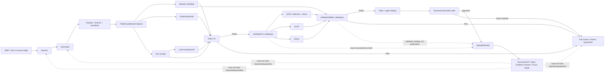

<!-- [KFM_META_BLOCK_V2]
doc_id: kfm://doc/NEEDS_VERIFICATION__pipelines_kansas_biodiversity_etl_catalog_readme
title: Kansas Biodiversity ETL Catalog
type: standard
version: v1
status: draft
owners: NEEDS_VERIFICATION__@bartytime4life_or_biodiversity_domain_owner
created: 2026-04-25
updated: 2026-04-25
policy_label: NEEDS_VERIFICATION__public_or_internal
related: [
  ../README.md,
  ../Makefile,
  ./emit_catalog.py,
  ./validate_catalog.py,
  ../validate/README.md,
  ../attest/README.md,
  ../../README.md,
  ../../../data/catalog/README.md,
  ../../../data/catalog/stac/README.md,
  ../../../data/catalog/dcat/README.md,
  ../../../data/catalog/prov/README.md,
  ../../../data/receipts/README.md,
  ../../../data/proofs/README.md,
  ../../../data/published/README.md,
  ../../../schemas/README.md,
  ../../../contracts/README.md,
  ../../../policy/README.md,
  ../../../tools/validators/promotion_gate/README.md
]
tags: [kfm, pipelines, biodiversity, catalog, stac, dcat, prov, evidence-bundle, receipts, proofs, promotion-gate, catalog-validation]
notes: [
  "Revision of existing catalog README for pipelines/kansas_biodiversity_etl/catalog/.",
  "Updates the catalog lane to document partition-aware STAC output, validate_catalog.py, and Gate A-I catalog closure.",
  "Owners, policy_label, branch-local execution wiring, schema validation, and CI enforcement remain NEEDS VERIFICATION.",
  "Catalog closure remains metadata validation, not publication."
]
[/KFM_META_BLOCK_V2] -->

<a id="top"></a>

# Kansas Biodiversity ETL Catalog

Catalog-closure README for the Kansas biodiversity occurrence pipeline’s STAC, DCAT, PROV, and catalog-validation helpers.

> [!IMPORTANT]
> This directory is a **catalog closure seam**, not a promotion shortcut. It may emit and validate catalog records for already-generated governed artifacts, but it must not publish data, bypass policy, override proofs, or turn catalog metadata into source truth.

<div align="left">


</div>

| Field | Value |
| --- | --- |
| **Status** | `experimental` / `draft` |
| **Owners** | `NEEDS_VERIFICATION__@bartytime4life_or_biodiversity_domain_owner` |
| **Path** | `pipelines/kansas_biodiversity_etl/catalog/README.md` |
| **Repo fit** | child README for catalog-emission and catalog-validation logic inside the staged Kansas biodiversity ETL lane |
| **Primary emitter** | `emit_catalog.py` |
| **Primary validator** | `validate_catalog.py` |
| **Primary artifact family** | `STAC Collection` · `STAC Items` · `DCAT Dataset` · `PROV lineage document` |
| **Ordering rule** | catalog closure follows Gate A-H and is rechecked by `validate-catalog` / Gate I |
| **Quick jumps** | [Scope](#scope) · [Repo fit](#repo-fit) · [Accepted inputs](#accepted-inputs) · [Exclusions](#exclusions) · [Directory tree](#directory-tree) · [Quickstart](#quickstart) · [Usage](#usage) · [Diagram](#diagram) · [Operating tables](#operating-tables) · [Task list](#task-list--definition-of-done) · [FAQ](#faq) · [Appendix](#appendix) |

---

## Scope

`catalog/` is the pipeline-local home for catalog-closure emission and validation around the Kansas biodiversity occurrence dataset candidate.

It exists to help the pipeline turn already-produced governed artifacts into reviewable, machine-checkable metadata records:

- a **STAC Collection** for the dataset-level spatial/temporal discovery surface,
- one or more **STAC Items** for partition-level discovery,
- a **DCAT Dataset** for dataset/distribution description,
- a **PROV lineage document** for entity/activity/source linkage,
- a **catalog validation pass** that checks catalog identity alignment against dataset metadata.

The catalog stage should make the release candidate easier to inspect. It does **not** make the release candidate safe, promoted, public, or authoritative by itself.

### Current catalog boundary

| Question | Expected answer |
| --- | --- |
| What catalog records are emitted? | STAC Collection + partition Items, DCAT Dataset, and PROV lineage for the Kansas biodiversity occurrence candidate. |
| What validates catalog closure? | `validate_catalog.py`, plus optional Gate I enforcement in `promotion_gate_full.py`. |
| What must already exist? | Dataset metadata, EvidenceBundle, run receipt, receipt proof, and a passing pre-catalog Gate A-H decision. |
| What should run before catalog closure? | Harvest, normalize, dedupe, publish, sign, and Gate A-H. |
| What does catalog closure prove? | Catalog artifacts agree on the same candidate identity, especially `spec_hash`. |
| What does it not prove? | Publication approval, source authority, policy clearance, or sensitive-location safety. |
| What remains downstream? | Promotion decision, release state, published alias, governed API/UI consumption. |

[Back to top](#top)

---

## Repo fit

This README sits inside the staged Kansas biodiversity ETL lane.

### Path and neighboring surfaces

| Relationship | Surface | Role | Status |
| --- | --- | --- | --- |
| Parent pipeline lane | [`../README.md`](../README.md) | Defines the Kansas biodiversity ETL truth path, source burden, stage contract, promotion gate, and failure modes. | **NEEDS VERIFICATION** |
| Pipeline Makefile | [`../Makefile`](../Makefile) | Expected to wire `catalog`, `validate-catalog`, and `gate-catalog` after the dataset/proof gate. | **PROPOSED / NEEDS VERIFICATION** |
| Catalog emitter | [`./emit_catalog.py`](./emit_catalog.py) | Emits STAC Collection + Items, DCAT, and PROV records from dataset metadata, EvidenceBundle, and run receipt inputs. | **PROPOSED / NEEDS VERIFICATION** |
| Catalog validator | [`./validate_catalog.py`](./validate_catalog.py) | Validates STAC/DCAT/PROV closure and `spec_hash` alignment. | **PROPOSED / NEEDS VERIFICATION** |
| Validation lane | [`../validate/README.md`](../validate/README.md) | Documents Gate A-H / A-I and fail-closed candidate validation. | **PROPOSED / NEEDS VERIFICATION** |
| Attestation lane | [`../attest/README.md`](../attest/README.md) | Documents local receipt proof helpers. | **PROPOSED / NEEDS VERIFICATION** |
| Pipeline root | [`../../README.md`](../../README.md) | Defines `/pipelines/` as the execution-family index. | **NEEDS VERIFICATION** |
| Data catalog parent | [`../../../data/catalog/README.md`](../../../data/catalog/README.md) | Defines the repo-wide catalog seam and the distinction between catalog, proof, receipt, and publication. | **NEEDS VERIFICATION** |
| STAC lane | [`../../../data/catalog/stac/README.md`](../../../data/catalog/stac/README.md) | Repo-level STAC guidance and child catalog surface. | **NEEDS VERIFICATION** |
| DCAT lane | [`../../../data/catalog/dcat/README.md`](../../../data/catalog/dcat/README.md) | Repo-level DCAT guidance and child catalog surface. | **NEEDS VERIFICATION** |
| PROV lane | [`../../../data/catalog/prov/README.md`](../../../data/catalog/prov/README.md) | Repo-level provenance guidance and lineage surface. | **NEEDS VERIFICATION** |
| Receipts | [`../../../data/receipts/README.md`](../../../data/receipts/README.md) | Process memory; catalog records may reference receipts but must not replace them. | **NEEDS VERIFICATION** |
| Proofs | [`../../../data/proofs/README.md`](../../../data/proofs/README.md) | Release evidence; catalog records may reference proof objects but must not replace them. | **NEEDS VERIFICATION** |
| Published artifacts | [`../../../data/published/README.md`](../../../data/published/README.md) | Promotion-gated public or steward-facing materialization. | **NEEDS VERIFICATION** |
| Contracts / schemas | [`../../../contracts/README.md`](../../../contracts/README.md), [`../../../schemas/README.md`](../../../schemas/README.md) | Shared contract meaning and machine schema authority. | **Schema-home posture NEEDS VERIFICATION** |
| Policy | [`../../../policy/README.md`](../../../policy/README.md) | Rights, sensitivity, geoprivacy, and release policy. | **NEEDS VERIFICATION** |
| Promotion gate | [`../../../tools/validators/promotion_gate/README.md`](../../../tools/validators/promotion_gate/README.md) | Repo-wide promotion gate doctrine. | **NEEDS VERIFICATION** |

### Placement rule

Use `pipelines/kansas_biodiversity_etl/catalog/` for pipeline-local catalog emission, validation, and documentation.

Use `data/catalog/` for emitted catalog records.

Use `data/proofs/` for EvidenceBundles, release manifests, catalog matrices, proof packs, rollback cards, and correction notices.

Use `data/receipts/` for run receipts and process memory.

[Back to top](#top)

---

## Accepted inputs

Inputs belong here only when they are already produced by governed upstream stages and are safe to describe as catalog subjects.

| Input | Accepted when… | Required minimum |
| --- | --- | --- |
| Dataset metadata JSON | The publish stage produced `_dataset_metadata.json` or an equivalent metadata object. | `dataset_id`, `generated_at`, `spec_hash`, record count, format, partition metadata when available, and dataset root. |
| EvidenceBundle JSON | The pipeline emitted an evidence bundle tying the candidate dataset to source URIs, license posture, attribution, obligations, and policy references. | source references, license/attribution fields, obligations, item count, and `spec_hash`. |
| Run receipt JSON | The pipeline wrote a receipt for the execution that produced the candidate dataset and evidence bundle. | time, inputs/outputs, candidate path, `spec_hash`, and linkable artifact references. |
| Receipt proof JSON | The local proof helper emitted a receipt proof and Gate H verified it. | `receipt_hash`, proof type, signer label, and verification outcome. |
| Dataset root | The path describes the processed candidate dataset being cataloged. | Stable path or URI; no raw/work/quarantine path. |
| Catalog output paths | The paths target catalog surfaces, not publication surfaces. | STAC root, DCAT output, and PROV output under `data/catalog/...` or a repo-approved equivalent. |

### CLI input contract

`emit_catalog.py` expects:

```text
--dataset-root
--metadata
--evidence
--receipt
--stac-output-root
--dcat-output
--prov-output
```

`validate_catalog.py` expects:

```text
--metadata
--stac-root
--dcat
--prov
```

`promotion_gate_full.py` may enforce Gate I when supplied:

```text
--stac-root
--dcat
--prov
```

### Current Makefile order

```text
harvest
normalize
dedupe
publish
sign
gate
catalog
validate-catalog
gate-catalog
```

> [!IMPORTANT]
> Catalog should not run as a substitute for `gate`. The catalog lane emits and checks catalog closure only after the candidate has passed the dataset/proof validation membrane.

[Back to top](#top)

---

## Exclusions

These do **not** belong in `pipelines/kansas_biodiversity_etl/catalog/`.

| Excluded item | Why | Use instead |
| --- | --- | --- |
| Raw GBIF or DwC-A payloads | Catalog emission must not become a raw-source store. | `../../../data/raw/` |
| Work-stage normalized JSONL or scratch files | Work products are not release-ready catalog subjects. | `../../../data/work/` |
| Quarantined records | Invalid, sensitive, conflicted, or blocked records should not be cataloged as outward artifacts. | `../../../data/quarantine/` |
| Processed dataset files | The emitter can point at processed artifacts but should not store them here. | `../../../data/processed/` |
| Proof packs or release manifests | Catalog records are metadata closure, not release evidence. | `../../../data/proofs/` |
| Run receipts | Receipts are process memory and should remain adjacent but separate. | `../../../data/receipts/` |
| Published aliases | Publication is a governed state transition, not an emitter side effect. | `../../../data/published/` |
| Policy decisions or Rego bundles | Catalog records may reference policy outcomes; they do not define policy. | `../../../policy/` |
| Generated AI summaries | AI is interpretive and cannot replace catalog/proof/evidence objects. | governed API / Focus Mode surfaces |
| Secrets or source credentials | README and emitter code must not contain live credentials. | deployment secrets / environment configuration |

[Back to top](#top)

---

## Directory tree

Current expected inventory for this directory:

```text
pipelines/kansas_biodiversity_etl/catalog/
├── README.md             # this file; catalog-closure orientation
├── emit_catalog.py       # STAC Collection + Items, DCAT, and PROV emitter
└── validate_catalog.py   # STAC/DCAT/PROV closure validator
```

### Current output placement

The emitter writes catalog records outside the pipeline code directory:

```text
data/catalog/
├── stac/
│   └── kansas_biodiversity_occurrences/
│       ├── collection.json
│       ├── year=2026-month=04.item.json
│       └── year=unknown-month=unknown.item.json
├── dcat/
│   └── kansas_biodiversity_occurrences.dataset.json
└── prov/
    └── kansas_biodiversity_occurrences.prov.json
```

| Shape | Status | Why |
| --- | --- | --- |
| STAC Collection + item per partition | **PROPOSED / NEEDS VERIFICATION** | matches partitioned Parquet and time-aware discovery |
| DCAT dataset/distribution | **PROPOSED / NEEDS VERIFICATION** | dataset/distribution-level description |
| PROV lineage document | **PROPOSED / NEEDS VERIFICATION** | entity/activity/source linkage |
| Catalog validator | **PROPOSED / NEEDS VERIFICATION** | checks STAC/DCAT/PROV identity alignment |

[Back to top](#top)

---

## Quickstart

Run catalog emission only after the upstream biodiversity pipeline has produced the processed dataset metadata, EvidenceBundle, run receipt, local proof, and a passing pre-catalog gate.

### Full pipeline route

From:

```text
pipelines/kansas_biodiversity_etl/
```

```bash
make clean
make all
```

Expected order if Makefile wiring is current:

```text
harvest -> normalize -> dedupe -> publish -> sign -> gate -> catalog -> validate-catalog -> gate-catalog
```

### Emit catalog records directly from repo root

```bash
python pipelines/kansas_biodiversity_etl/catalog/emit_catalog.py \
  --dataset-root data/processed/kansas_occurrences \
  --metadata data/processed/kansas_occurrences/_dataset_metadata.json \
  --evidence data/proofs/kansas_biodiversity_etl/20260425/evidence_bundle.json \
  --receipt data/receipts/kansas_biodiversity_etl/20260425/run_receipt.json \
  --stac-output-root data/catalog/stac/kansas_biodiversity_occurrences \
  --dcat-output data/catalog/dcat/kansas_biodiversity_occurrences.dataset.json \
  --prov-output data/catalog/prov/kansas_biodiversity_occurrences.prov.json
```

### Validate catalog closure directly

```bash
python pipelines/kansas_biodiversity_etl/catalog/validate_catalog.py \
  --metadata data/processed/kansas_occurrences/_dataset_metadata.json \
  --stac-root data/catalog/stac/kansas_biodiversity_occurrences \
  --dcat data/catalog/dcat/kansas_biodiversity_occurrences.dataset.json \
  --prov data/catalog/prov/kansas_biodiversity_occurrences.prov.json
```

Expected successful shape:

```json
{
  "decision": "PASS",
  "checks": [
    "metadata",
    "stac_collection",
    "stac_items",
    "dcat",
    "prov",
    "spec_hash_alignment"
  ]
}
```

### Re-run the full gate with catalog closure

```bash
python pipelines/kansas_biodiversity_etl/validate/promotion_gate_full.py \
  --dataset data/processed/kansas_occurrences \
  --metadata data/processed/kansas_occurrences/_dataset_metadata.json \
  --evidence data/proofs/kansas_biodiversity_etl/20260425/evidence_bundle.json \
  --receipt data/receipts/kansas_biodiversity_etl/20260425/run_receipt.json \
  --proof data/proofs/kansas_biodiversity_etl/20260425/receipt_proof.json \
  --stac-root data/catalog/stac/kansas_biodiversity_occurrences \
  --dcat data/catalog/dcat/kansas_biodiversity_occurrences.dataset.json \
  --prov data/catalog/prov/kansas_biodiversity_occurrences.prov.json
```

Expected successful gate list includes:

```json
["A", "B", "C", "D", "E", "F", "G", "H", "I"]
```

> [!WARNING]
> Catalog validation proves catalog identity alignment. It does not prove the dataset is publishable. Publication still requires the governed promotion path.

[Back to top](#top)

---

## Usage

### `emit_catalog.py`

Use `emit_catalog.py` when the Kansas biodiversity ETL has already produced and validated:

1. a processed occurrence dataset candidate,
2. dataset metadata with stable identity,
3. an EvidenceBundle,
4. a run receipt,
5. a local receipt proof when Gate H is enabled,
6. a passing Gate A-H decision.

The emitter writes catalog records that make the candidate easier to inspect across discovery, dataset description, and provenance surfaces.

| Function family | Catalog role | Notes |
| --- | --- | --- |
| STAC Collection builder | Creates dataset-level STAC discovery record. | Links to EvidenceBundle, receipt, DCAT, PROV, and partition items. |
| STAC Item builder | Creates partition-level STAC records. | Carries partition year/month and dataset `spec_hash`. |
| DCAT builder | Creates dataset/distribution record. | Uses license and attribution from EvidenceBundle. |
| PROV builder | Creates lineage document. | Links dataset, EvidenceBundle, run receipt, STAC, DCAT, and source URIs. |
| Writer/main | Writes deterministic JSON with sorted keys. | Creates parent directories as needed and prints `CATALOG_EMITTED`. |

### `validate_catalog.py`

Use `validate_catalog.py` to fail closed unless the catalog surface agrees with dataset metadata.

| Check | Failure examples |
| --- | --- |
| Metadata exists and includes `spec_hash` | `metadata_missing`, `metadata_missing_spec_hash` |
| STAC root exists and is a directory | `stac_root_missing`, `stac_root_not_directory` |
| STAC Collection exists and carries matching `spec_hash` | `stac_collection_missing`, `stac_collection_spec_hash_mismatch` |
| STAC Items exist and carry matching `spec_hash` | `no_stac_items_found`, `stac_item_spec_hash_mismatch:<file>` |
| DCAT exists and carries matching `spec_hash` | `dcat_missing`, `dcat_spec_hash_mismatch` |
| PROV exists and carries matching dataset `spec_hash` | `prov_missing`, `prov_spec_hash_mismatch` |

### What the catalog lane must not do

The catalog lane must not:

- harvest source APIs,
- normalize Darwin Core records,
- deduplicate records,
- decide license admissibility,
- redact or generalize sensitive coordinates,
- approve release state,
- write published aliases,
- expose raw or quarantined data,
- create AI-facing answers.

[Back to top](#top)

---

## Diagram



The key boundary: `catalog/` helps close metadata around a candidate artifact **after** the candidate has passed validation. It does not create the candidate, approve it, or make it public.

[Back to top](#top)

---

## Operating tables

### Truth labels for this README

| Label | Meaning here |
| --- | --- |
| **CONFIRMED** | Verified from uploaded project material or directly visible sibling-file description. |
| **INFERRED** | Strongly suggested by parent pipeline docs or adjacent catalog doctrine, but not directly enforced by this README alone. |
| **PROPOSED** | Fits KFM doctrine and current lane shape, but needs implementation or branch-local confirmation. |
| **UNKNOWN** | Not verified from mounted repo evidence, runtime logs, CI, emitted artifacts, or platform state. |
| **NEEDS VERIFICATION** | A concrete check must happen before the claim can be used as implementation fact. |

### Current evidence snapshot

| Observation | Status | Consequence |
| --- | --- | --- |
| `pipelines/kansas_biodiversity_etl/catalog/README.md` is the target file. | **CONFIRMED** | This file is revised directly. |
| Earlier catalog README documented `emit_catalog.py` as the sibling emitter. | **CONFIRMED from uploaded draft** | This README keeps the same catalog-emitter role. |
| `validate_catalog.py` has been introduced in this workstream. | **PROPOSED / NEEDS VERIFICATION** | Documented as expected current catalog validator pending active-branch check. |
| `promotion_gate_full.py` can enforce catalog closure when STAC/DCAT/PROV args are supplied. | **PROPOSED / NEEDS VERIFICATION** | Documented as Gate I pending active-branch check. |
| Current pipeline has active `make catalog`, `validate-catalog`, and `gate-catalog` wiring. | **PROPOSED / NEEDS VERIFICATION** | Inspect Makefile before relying on target execution. |
| Generated catalog outputs have passed repo-approved schema validation. | **UNKNOWN** | Add schema validation before release reliance. |
| Catalog closure is enforced by merge-blocking CI. | **UNKNOWN** | Treat as future gate until workflow evidence exists. |

### Catalog output contract

| Output | Purpose | Must reference |
| --- | --- | --- |
| STAC Collection | Dataset-level spatial/temporal discovery. | dataset metadata, EvidenceBundle link, run receipt link, item links, DCAT link, PROV link, `spec_hash`. |
| STAC Items | Partition-level discovery. | partition path, partition year/month, record count, dataset `spec_hash`. |
| DCAT Dataset | Dataset/distribution description, rights, access, and publisher-facing metadata. | dataset identifier, access URL, format, license, attribution, `spec_hash`. |
| PROV lineage document | Entity/activity/source lineage. | dataset entity, EvidenceBundle entity, run receipt entity, STAC/DCAT entities, source URIs, generation activities. |

### Anti-collapse rules

| Do not collapse… | Because… |
| --- | --- |
| catalog record → proof pack | Catalog closure supports review; proof packs establish release evidence. |
| receipt → EvidenceBundle | Receipts are process memory; EvidenceBundles resolve claims to support. |
| STAC/DCAT/PROV → publication | Metadata does not equal release approval. |
| occurrence → habitat claim | Occurrence evidence does not prove habitat suitability. |
| source aggregator → taxonomic authority | Aggregators can report occurrence records without becoming source-of-truth for taxonomy. |
| public map layer → canonical truth | UI surfaces interpret governed outputs; they do not own source truth. |

[Back to top](#top)

---

## Task list & definition of done

A revision to this README is ready when:

- [ ] KFM Meta Block V2 is present and reviewable.
- [ ] Status, owners, path, badges, and quick jumps are present.
- [ ] The README states that catalog closure is **not** promotion.
- [ ] Accepted inputs match `emit_catalog.py` and `validate_catalog.py` arguments.
- [ ] Exclusions keep raw, work, quarantine, receipts, proofs, policy, and published aliases out of this directory.
- [ ] The directory tree reflects the active branch inventory or clearly marks uncertainty.
- [ ] The quickstart is non-destructive and says what must exist before running it.
- [ ] The diagram shows catalog as a closure seam, not the whole pipeline.
- [ ] STAC, DCAT, and PROV outputs are explained as separate but cross-linked metadata surfaces.
- [ ] Makefile integration is marked `NEEDS VERIFICATION` unless branch-local evidence confirms it.
- [ ] Promotion, rights, sensitivity, geoprivacy, and EvidenceBundle closure remain downstream gates.
- [ ] Open verification items are visible instead of hidden in confident prose.

A catalog output is review-ready when:

- [ ] `--metadata`, `--evidence`, and `--receipt` inputs exist.
- [ ] Gate A-H has passed for the candidate or the catalog output is explicitly marked draft.
- [ ] STAC Collection and partition Items are syntactically valid JSON.
- [ ] DCAT and PROV outputs are syntactically valid JSON.
- [ ] Output subjects point to the same dataset candidate and `spec_hash`.
- [ ] `validate_catalog.py` passes.
- [ ] `gate-catalog` passes with Gate I when wired.
- [ ] EvidenceBundle references resolve.
- [ ] Receipt references resolve.
- [ ] No raw, work, or quarantine path is exposed as a public-facing asset.
- [ ] Rights and sensitivity posture are visible or explicitly blocked.
- [ ] Promotion gate treats catalog closure as one input, not an automatic pass.

### Next hardening tasks

- [ ] Add fixture-backed tests for `emit_catalog.py`.
- [ ] Add negative catalog fixtures for missing STAC collection, missing STAC items, mismatched `spec_hash`, missing DCAT, and missing PROV.
- [ ] Validate STAC/DCAT/PROV JSON against repo-approved schemas or structural checks.
- [ ] Add a catalog matrix confirming STAC/DCAT/PROV agree on `dataset_id`, `spec_hash`, source refs, and receipt refs.
- [ ] Decide whether Gate I becomes mandatory in all promotion contexts or remains an explicit `gate-catalog` step.

[Back to top](#top)

---

## FAQ

### Does this catalog README make the biodiversity dataset publishable?

No. Catalog closure helps reviewers inspect a candidate artifact. Publication still requires EvidenceBundle closure, source/license/sensitivity review, integrity checks, proof objects, and a governed promotion decision.

### Can the UI consume files from this directory?

No. Normal UI surfaces should consume governed APIs or released artifacts. This directory contains pipeline-local catalog emission and validation logic.

### Are STAC, DCAT, and PROV enough to prove source truth?

No. They describe discovery, dataset/distribution metadata, and lineage. They do not replace source records, policy decisions, EvidenceBundles, receipts, proofs, or review state.

### Should generated catalog JSON live beside `emit_catalog.py`?

No. Generated catalog records belong under the repo’s catalog data surfaces, such as `data/catalog/stac/`, `data/catalog/dcat/`, and `data/catalog/prov/`, or a branch-approved equivalent.

### Should `make catalog` be used?

Use it only when branch-local Makefile wiring is confirmed. The direct Python commands above remain the clearest interface for review because they show every artifact path.

### Why have both `validate-catalog` and `gate-catalog`?

`validate-catalog` checks the catalog artifacts directly. `gate-catalog` re-runs the promotion gate with catalog inputs so the candidate can pass through one A-I fail-closed decision surface.

### What is the safest next improvement?

Add catalog fixtures and negative tests. Schema validation is valuable, but negative fixtures prove the fail-closed behavior that KFM relies on.

[Back to top](#top)

---

## Appendix

<details>
<summary>Open verification backlog</summary>

| Item | Status | Why it matters |
| --- | --- | --- |
| Confirm branch-local owner for `pipelines/kansas_biodiversity_etl/catalog/`. | **NEEDS VERIFICATION** | Owner assignment should come from CODEOWNERS or steward records. |
| Confirm accepted `policy_label` vocabulary. | **NEEDS VERIFICATION** | Meta block should not invent policy labels. |
| Confirm `make catalog`, `validate-catalog`, and `gate-catalog` integration. | **NEEDS VERIFICATION** | Current Makefile wiring must be checked on branch. |
| Confirm Gate A-I is active in branch-local validator. | **NEEDS VERIFICATION** | Catalog should run through a validated candidate boundary. |
| Add catalog fixtures. | **PROPOSED** | Prevents catalog closure from remaining prose-only. |
| Add STAC/DCAT/PROV schema or structural validation. | **PROPOSED** | JSON syntax is not enough for catalog closure. |
| Add CatalogMatrix or equivalent closure check. | **PROPOSED** | STAC/DCAT/PROV should agree on subject, version, checksums, and release references. |
| Confirm whether `stac_version: 1.0.0` remains the desired target. | **NEEDS VERIFICATION** | Standards posture should be pinned intentionally. |
| Confirm branch-local schema home. | **NEEDS VERIFICATION** | KFM materials repeatedly warn about schema-home ambiguity. |
| Confirm sensitive species policy integration. | **NEEDS VERIFICATION** | Biodiversity catalog records must not expose exact sensitive locality by accident. |
| Confirm generated output retention policy. | **NEEDS VERIFICATION** | Catalog candidates, failed records, and superseded outputs need explicit retention/rollback behavior. |

</details>

<details>
<summary>Review prompts for maintainers</summary>

Before merging catalog-lane changes, ask:

1. Does this change describe catalog closure, or is it trying to sneak in promotion?
2. Do all catalog records point to the same candidate dataset and `spec_hash`?
3. Can every EvidenceBundle and receipt reference be resolved?
4. Are rights, attribution, sensitivity, and geoprivacy burdens visible?
5. Are generated files written to `data/catalog/` rather than the pipeline code directory?
6. Is Makefile or CI wiring actually present, or only proposed?
7. Is rollback/correction possible without deleting historical evidence?
8. Does the public UI remain downstream of governed artifacts?
9. Does `validate_catalog.py` fail on broken catalog identity?
10. Does `gate-catalog` produce a single A-I decision?

</details>

<details>
<summary>Illustrative catalog-emission receipt shape</summary>

```json
{
  "decision": "CATALOG_EMITTED",
  "dataset_id": "kansas_occurrences",
  "spec_hash": "sha256:NEEDS_VERIFICATION",
  "stac_collection": "data/catalog/stac/kansas_biodiversity_occurrences/collection.json",
  "stac_items": [
    "data/catalog/stac/kansas_biodiversity_occurrences/year=2026-month=04.item.json"
  ],
  "dcat": "data/catalog/dcat/kansas_biodiversity_occurrences.dataset.json",
  "prov": "data/catalog/prov/kansas_biodiversity_occurrences.prov.json",
  "promotion_state": "NOT_PROMOTED_BY_CATALOG",
  "notes": [
    "Catalog emission is metadata closure only.",
    "Promotion requires downstream proof and policy gates."
  ]
}
```

This shape is illustrative. Do not treat it as a schema unless a repo-local contract adopts it.

</details>

<details>
<summary>Illustrative catalog-validation pass shape</summary>

```json
{
  "decision": "PASS",
  "checks": [
    "metadata",
    "stac_collection",
    "stac_items",
    "dcat",
    "prov",
    "spec_hash_alignment"
  ],
  "dataset_id": "kfm:kansas_biodiversity_occurrences",
  "spec_hash": "sha256:NEEDS_VERIFICATION"
}
```

This shape is illustrative unless copied from a real validator run.

</details>

[Back to top](#top)
