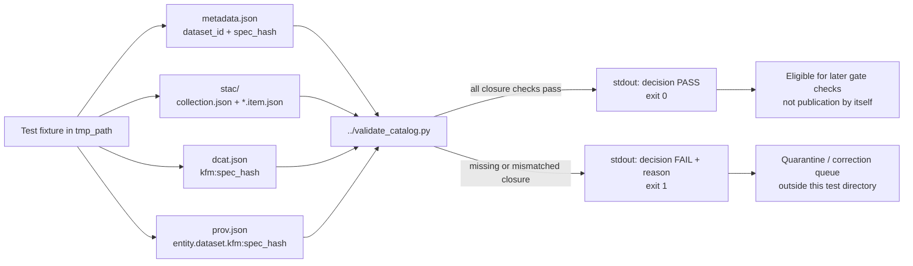

<!-- [KFM_META_BLOCK_V2]
doc_id: kfm://doc/TODO-uuid
title: Kansas Biodiversity ETL Catalog Tests
type: standard
version: v1
status: draft
owners: NEEDS_VERIFICATION__@bartytime4life_or_biodiversity_domain_owner
created: 2026-04-25
updated: 2026-04-25
policy_label: TODO-public-or-restricted
related: [../README.md, ../../README.md, ../../../README.md, ../validate_catalog.py, ../emit_catalog.py, ./test_validate_catalog.py, ../../Makefile]
tags: [kfm, biodiversity, pipeline, catalog, tests, STAC, DCAT, PROV, EvidenceBundle, spec_hash]
notes: [doc_id placeholder requires assigned UUID; owners require CODEOWNERS or maintainer verification; policy_label vocabulary requires repo verification; local mounted repo was unavailable during drafting]
[/KFM_META_BLOCK_V2] -->

# Kansas Biodiversity ETL Catalog Tests

Test the Kansas biodiversity catalog-closure validator so STAC, DCAT, PROV, metadata, and `spec_hash` alignment fail closed before publication.


> [!IMPORTANT]
> **Status:** `experimental`  
> **Owners:** `NEEDS_VERIFICATION__@bartytime4life_or_biodiversity_domain_owner`  
> **Path:** `pipelines/kansas_biodiversity_etl/catalog/tests/README.md`  
> **Role:** directory README for no-network regression tests around catalog closure.  
> **Truth boundary:** this file documents the intended test contract. It does not prove CI enforcement, branch protection, release readiness, or active publication behavior without a mounted checkout and workflow evidence.

**Quick jumps:** [Scope](#scope) · [Repo fit](#repo-fit) · [Accepted inputs](#accepted-inputs) · [Exclusions](#exclusions) · [Directory tree](#directory-tree) · [Test contract](#test-contract) · [Quickstart](#quickstart) · [Usage](#usage) · [Diagram](#diagram) · [Definition of done](#definition-of-done) · [FAQ](#faq) · [Appendix](#appendix)

---

## Scope

`catalog/tests/` is the local regression-test surface for the catalog stage of the Kansas biodiversity ETL.

These tests exercise the validator that checks whether a processed biodiversity occurrence dataset has enough catalog closure to be considered for the next gate. In this lane, catalog closure means the dataset metadata, STAC records, DCAT record, and PROV record all agree on the same `spec_hash` and expose the minimum KFM fields required for review.

This test directory is intentionally small. It should prove that the catalog validator rejects incomplete or inconsistent catalog artifacts before any downstream promotion step treats them as release-ready.

### What this test surface protects

| Risk | Test posture |
| --- | --- |
| A dataset has metadata but no STAC collection | Fail closed |
| A STAC collection exists but has no item records | Fail closed |
| STAC item `kfm:spec_hash` diverges from metadata | Fail closed |
| DCAT `kfm:spec_hash` diverges from metadata | Fail closed |
| PROV dataset entity lacks `kfm:spec_hash` | Fail closed |
| STAC root is missing | Fail closed |
| A valid synthetic catalog closure exists | Return `PASS` |

> [!NOTE]
> These tests do **not** prove full STAC, DCAT, or PROV standards compliance. They prove the KFM-specific closure fields that the current lightweight validator checks.

[Back to top](#kansas-biodiversity-etl-catalog-tests)

---

## Repo fit

### Path

```text
pipelines/kansas_biodiversity_etl/catalog/tests/
```

### Upstream links

| Upstream surface | Relationship | Status |
| --- | --- | --- |
| [`../../README.md`](../../README.md) | Defines the Kansas biodiversity ETL lane, lifecycle, source burden, and promotion posture. | CONFIRMED in public repo; verify in local checkout |
| [`../emit_catalog.py`](../emit_catalog.py) | Emits catalog artifacts that this test family expects the validator to inspect. | CONFIRMED in public repo; verify formatting in local checkout |
| [`../validate_catalog.py`](../validate_catalog.py) | Validator under test; checks metadata, STAC, DCAT, PROV, and `spec_hash` alignment. | CONFIRMED in public repo; verify in local checkout |
| [`../../Makefile`](../../Makefile) | Provides pipeline targets such as `catalog`, `validate-catalog`, `gate-catalog`, `sample`, and `test-e2e`. | CONFIRMED in public repo; verify runner behavior |
| [`../README.md`](../README.md) | Parent catalog README; currently expected to document catalog-stage responsibilities. | NEEDS VERIFICATION / likely thin |

### Downstream links

| Downstream surface | Test responsibility | Status |
| --- | --- | --- |
| [`../../../../data/catalog/`](../../../../data/catalog/) | Catalog artifact roots for STAC, DCAT, and PROV outputs. | NEEDS VERIFICATION |
| [`../../../../data/proofs/`](../../../../data/proofs/) | Proof objects and catalog validation evidence. | NEEDS VERIFICATION |
| [`../../../../data/receipts/`](../../../../data/receipts/) | Run receipts referenced by catalog artifacts. | NEEDS VERIFICATION |
| [`../../../../release/`](../../../../release/) | Release candidates must not proceed if catalog closure fails. | NEEDS VERIFICATION |
| [`../../../../.github/workflows/`](../../../../.github/workflows/) | CI may run this test directory, but workflow enforcement is not proven by this README. | UNKNOWN |

> [!WARNING]
> Tests may support promotion decisions, but tests are not promotion. KFM publication remains a governed state transition, not a file move.

[Back to top](#kansas-biodiversity-etl-catalog-tests)

---

## Accepted inputs

Only synthetic, no-network, reviewable test inputs belong in this directory.

| Input | Belongs here when… | Required guardrail |
| --- | --- | --- |
| Temporary JSON fixtures | Created inside test temp directories such as `tmp_path`. | No live source data, no secrets, no sensitive locality records |
| Metadata fixture | Carries `dataset_id`, `spec_hash`, record count, and format needed by the validator. | `spec_hash` must be deterministic test data |
| STAC collection fixture | Represents minimal KFM catalog closure. | Must include `summaries.kfm:spec_hash` |
| STAC item fixture | Represents a partition or catalog item. | Must include `properties.kfm:spec_hash` |
| DCAT fixture | Represents the dataset/distribution metadata under test. | Must include `kfm:spec_hash` |
| PROV fixture | Represents lineage for the dataset. | Must include `entity.dataset.kfm:spec_hash` |
| Validator subprocess call | Runs `../validate_catalog.py` as a CLI, not by importing hidden state. | Parse JSON stdout and assert return code |

### Fixture principle

The safest test fixture is boring: small JSON, explicit mutation, clear expected outcome.

```python
# Illustrative pattern only. Keep actual assertions in test files.
paths = build_valid_catalog(tmp_path)

# Mutate one trust-bearing field.
dcat = json.loads(paths["dcat"].read_text(encoding="utf-8"))
dcat["kfm:spec_hash"] = "sha256:bad"
write_json(paths["dcat"], dcat)

result = run_validator(paths)
assert result.returncode == 1
assert parse_stdout(result) == {
    "decision": "FAIL",
    "reason": "dcat_spec_hash_mismatch",
}
```

[Back to top](#kansas-biodiversity-etl-catalog-tests)

---

## Exclusions

These do not belong in `catalog/tests/`.

| Excluded item | Why it does not belong here | Put it here instead |
| --- | --- | --- |
| Live GBIF, DwC-A, or biodiversity source responses | Catalog tests must be deterministic and no-network. | `../../harvest/`, source fixtures, or governed source-probe tests |
| Real sensitive occurrence records | Exact locality can create geoprivacy risk. | Restricted fixture store or synthetic redaction tests |
| Credentials, API keys, tokens, cookies | Tests must remain reviewable and safe. | Secret manager or deployment configuration |
| Bulk generated catalog output | Tests should generate minimal temp fixtures. | `../../../../data/catalog/` after pipeline run |
| Full STAC/DCAT/PROV conformance suites | Current tests target KFM closure, not full standards certification. | Dedicated standards validation tooling |
| Promotion decisions | Validation informs gates but does not publish. | Promotion gate / release workflow |
| UI, map popup, Evidence Drawer, or Focus Mode assertions | This directory tests catalog closure only. | UI/API contract tests |
| Free-form AI summaries | AI is interpretive and must not become evidence. | Governed AI tests with citation validation |

[Back to top](#kansas-biodiversity-etl-catalog-tests)

---

## Directory tree

CONFIRMED from public repository inspection; verify in the mounted checkout before editing.

```text
pipelines/kansas_biodiversity_etl/catalog/tests/
├── README.md
└── test_validate_catalog.py
```

Expected adjacent catalog files:

```text
pipelines/kansas_biodiversity_etl/catalog/
├── README.md                 # parent catalog README; content status NEEDS VERIFICATION
├── emit_catalog.py            # emits STAC, DCAT, and PROV catalog records
├── validate_catalog.py        # validator under test
└── tests/
    ├── README.md              # this file
    └── test_validate_catalog.py
```

[Back to top](#kansas-biodiversity-etl-catalog-tests)

---

## Test contract

### Validator under test

`../validate_catalog.py` should emit a compact JSON decision envelope on stdout.

| Condition | Expected return code | Expected decision |
| --- | ---: | --- |
| Metadata, STAC collection, STAC item, DCAT, and PROV agree on `spec_hash` | `0` | `PASS` |
| Required artifact is missing | `1` | `FAIL` with reason |
| Required artifact is invalid JSON | `1` | `FAIL` with reason |
| Required `spec_hash` is missing | `1` | `FAIL` with reason |
| Required `spec_hash` does not match metadata | `1` | `FAIL` with reason |

### Current regression targets

| Test | Guarded behavior |
| --- | --- |
| `test_valid_catalog_passes` | Valid synthetic closure returns `PASS`. |
| `test_missing_collection_fails` | Missing `collection.json` returns `stac_collection_missing`. |
| `test_no_stac_items_fails` | Empty STAC item set returns `no_stac_items_found`. |
| `test_stac_item_hash_mismatch_fails` | Item hash mismatch names the mismatched item. |
| `test_dcat_hash_mismatch_fails` | DCAT hash mismatch fails. |
| `test_prov_missing_spec_hash_fails` | Missing PROV dataset hash fails. |
| `test_stac_root_missing_fails` | Missing STAC root fails. |

### Output grammar

This is a **gate/test** surface, so the local outcomes are intentionally not the public runtime outcomes.

| Surface | Outcomes | Notes |
| --- | --- | --- |
| Catalog validator | `PASS`, `FAIL` | CLI decision for catalog closure. |
| Promotion gate | `PASS`, `HOLD`, `DENY`, `ERROR` or repo-native equivalent | NEEDS VERIFICATION against active policy grammar. |
| Public runtime / Focus Mode | `ANSWER`, `ABSTAIN`, `DENY`, `ERROR` | Downstream only; not emitted by these tests. |

[Back to top](#kansas-biodiversity-etl-catalog-tests)

---

## Quickstart

### Run only the catalog tests

```bash
# From repository root.
python -m pytest pipelines/kansas_biodiversity_etl/catalog/tests -q
```

### Run the current test file directly

```bash
# From repository root.
python -m pytest pipelines/kansas_biodiversity_etl/catalog/tests/test_validate_catalog.py -q
```

### Run the validator manually against generated catalog artifacts

```bash
# From repository root.
python pipelines/kansas_biodiversity_etl/catalog/validate_catalog.py \
  --metadata data/processed/kansas_occurrences/_dataset_metadata.json \
  --stac-root data/catalog/stac/kansas_biodiversity_occurrences \
  --dcat data/catalog/dcat/kansas_biodiversity_occurrences.dataset.json \
  --prov data/catalog/prov/kansas_biodiversity_occurrences.prov.json
```

### Makefile path, after artifacts exist

```bash
# From pipelines/kansas_biodiversity_etl/.
make validate-catalog
make gate-catalog
```

> [!CAUTION]
> Do not run live harvests, publication, destructive cleanup, or release actions just to test this directory. Prefer synthetic fixtures first.

[Back to top](#kansas-biodiversity-etl-catalog-tests)

---

## Usage

### Add a new fail-closed case

When the validator grows, add one small mutation per test. Keep the failure reason exact so reviewers can see whether the validator is precise or merely failing by accident.

```python
def test_new_catalog_gap_fails(tmp_path: Path) -> None:
    paths = build_valid_catalog(tmp_path)

    # Mutate exactly one required field or file.
    # Example: remove a required catalog closure field.

    result = run_validator(paths)
    payload = parse_stdout(result)

    assert result.returncode == 1
    assert payload == {
        "decision": "FAIL",
        "reason": "expected_reason_code",
    }
```

### Add a new pass case

Only add a passing test when the new fixture proves a permitted catalog shape. Avoid broad “happy path” fixtures that hide unsupported assumptions.

```python
def test_valid_catalog_with_multiple_items_passes(tmp_path: Path) -> None:
    paths = build_valid_catalog(tmp_path)

    # Add a second item that keeps the same expected spec_hash.
    # Assert the validator reports the expected item count.

    result = run_validator(paths)
    payload = parse_stdout(result)

    assert result.returncode == 0
    assert payload["decision"] == "PASS"
    assert payload["stac_items"] == 2
```

### Review checklist for changes

Before merging a test update, check:

- The test uses temp files, not committed generated artifacts.
- No live network request is introduced.
- No real sensitive species locality is embedded.
- Failure reasons are stable and machine-readable.
- New assertions align with `../validate_catalog.py`, not with unrelated pipeline stages.
- Any validator behavior change is reflected in the parent catalog README or pipeline README.

[Back to top](#kansas-biodiversity-etl-catalog-tests)

---

## Diagram



The important boundary is that this directory proves catalog validation behavior. It does not own catalog semantics, promotion policy, release authority, or public UI behavior.

[Back to top](#kansas-biodiversity-etl-catalog-tests)

---

## Operating tables

### Catalog closure matrix

| Artifact | Minimum field under current validator | Failure if absent or mismatched |
| --- | --- | --- |
| Metadata | `spec_hash` | `metadata_missing_spec_hash` |
| STAC root | Directory exists | `stac_root_missing` |
| STAC collection | `type = Collection` and `summaries.kfm:spec_hash` | `stac_collection_*` reason |
| STAC items | At least one `*.item.json`; each `type = Feature`; each `properties.kfm:spec_hash` | `no_stac_items_found` or `stac_item_*` reason |
| DCAT | `kfm:spec_hash` | `dcat_*` reason |
| PROV | `entity.dataset.kfm:spec_hash` | `prov_*` reason |

### What these tests should never normalize away

| Boundary | Why it matters |
| --- | --- |
| `spec_hash` is identity, not policy | A matching hash does not mean rights, sensitivity, or review passed. |
| Catalog closure is not publication | STAC/DCAT/PROV records describe artifacts; they do not approve them. |
| Receipts are process memory | A receipt can support review, but it is not release proof by itself. |
| Synthetic fixtures are not source evidence | Test data exercises behavior; it must not become biodiversity evidence. |
| Public map visibility is downstream | MapLibre, Evidence Drawer, Focus Mode, and exports must use governed payloads only. |

[Back to top](#kansas-biodiversity-etl-catalog-tests)

---

## Definition of done

A change to `catalog/tests/` is ready for review when:

- [ ] The target path exists in the mounted checkout.
- [ ] `python -m pytest pipelines/kansas_biodiversity_etl/catalog/tests -q` passes.
- [ ] Every new failure mode emits `{"decision": "FAIL", "reason": "..."}`.
- [ ] Valid fixtures still return `{"decision": "PASS", ...}` with the expected `spec_hash`.
- [ ] Tests do not require network access.
- [ ] Tests do not embed live GBIF/DwC-A payloads, credentials, or sensitive exact localities.
- [ ] Any validator behavior change is reflected in documentation.
- [ ] Makefile or CI wiring is updated only after the command path is verified.
- [ ] Rollback is simple: revert the test/validator change without modifying data artifacts.
- [ ] No downstream publication claim is made from tests alone.

[Back to top](#kansas-biodiversity-etl-catalog-tests)

---

## FAQ

### Do these tests prove the dataset can be published?

No. They prove one catalog-closure validator can pass or fail deterministically. Publication still requires evidence, rights, attribution, sensitivity, review, integrity, and promotion gates.

### Should this directory contain real catalog outputs?

No. Use temporary fixtures in tests. Generated catalog outputs belong under the repo’s data/catalog convention after the pipeline runs and gates permit them.

### Why is `spec_hash` checked in every catalog surface?

Because KFM needs stable identity across derived artifacts. If metadata, STAC, DCAT, and PROV disagree on the dataset hash, the catalog trail cannot support an inspectable claim.

### Should missing STAC items be an error?

Yes. A collection without items is not enough for this partitioned biodiversity dataset closure test. The current validator treats that as `FAIL`.

### Can this README be used as CI proof?

No. CI proof requires actual workflow runs, logs, and artifacts. This README only defines the intended directory contract.

[Back to top](#kansas-biodiversity-etl-catalog-tests)

---

## Appendix

<details>
<summary>Current test-case inventory</summary>

| Test case | Expected output |
| --- | --- |
| Valid catalog closure | `PASS` |
| Missing STAC collection | `FAIL`, `stac_collection_missing` |
| No STAC items | `FAIL`, `no_stac_items_found` |
| STAC item hash mismatch | `FAIL`, `stac_item_spec_hash_mismatch:<item>` |
| DCAT hash mismatch | `FAIL`, `dcat_spec_hash_mismatch` |
| PROV missing dataset hash | `FAIL`, `prov_missing_spec_hash` |
| Missing STAC root | `FAIL`, `stac_root_missing` |

</details>

<details>
<summary>Open verification backlog</summary>

| Item | Status | Why it remains open |
| --- | --- | --- |
| Assigned `doc_id` UUID | NEEDS VERIFICATION | No confirmed document registry entry was available during drafting. |
| Owner | NEEDS VERIFICATION | Parent README uses an owner placeholder; CODEOWNERS was not verified in a mounted checkout. |
| `policy_label` vocabulary | NEEDS VERIFICATION | Repo-specific policy labels require confirmation. |
| CI workflow path | UNKNOWN | Workflow inventory was not available in the local workspace. |
| Parent catalog README authority | NEEDS VERIFICATION | Parent README exists but needs substantive catalog-stage contract content. |
| Validator formatting | NEEDS VERIFICATION | Public raw files appeared compacted/minified; verify checkout formatting before editing. |
| Full STAC/DCAT/PROV validation scope | PROPOSED | Current tests check KFM closure fields, not full standard conformance. |

</details>

[Back to top](#kansas-biodiversity-etl-catalog-tests)
