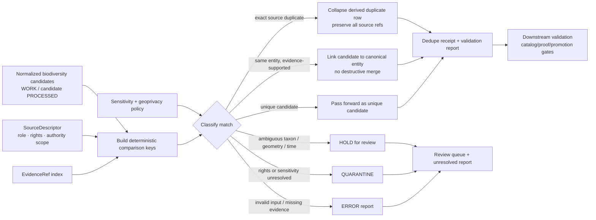

<!-- [KFM_META_BLOCK_V2]
doc_id: kfm://doc/TODO-uuid-pipelines-kansas-biodiversity-etl-dedupe-readme
title: Kansas Biodiversity ETL — Dedupe
type: standard
version: v1
status: draft
owners: TODO-confirm-biodiversity-pipeline-owner
created: 2026-04-25
updated: 2026-04-25
policy_label: TODO-confirm-public-or-restricted
related: [TODO-confirm-adjacent-pipeline-and-domain-doc-links]
tags: [kfm, biodiversity, etl, dedupe, pipeline, evidence, geoprivacy]
notes: [draft README generated from attached KFM doctrine; mounted target repo not verified; replace TODO placeholders after direct repo scan]
[/KFM_META_BLOCK_V2] -->

# Kansas Biodiversity ETL — Dedupe

Deduplicate Kansas biodiversity candidate records without erasing evidence, source role, sensitivity, rights, or review state.

<a id="top"></a>


> [!IMPORTANT]
> **Status:** experimental — **NEEDS VERIFICATION** against the mounted repository.  
> **Owners:** `TODO-confirm-biodiversity-pipeline-owner`  
> **Quick jumps:** [Scope](#scope) · [Repo fit](#repo-fit) · [Accepted inputs](#accepted-inputs) · [Exclusions](#exclusions) · [Dedupe flow](#dedupe-flow) · [Dedupe rules](#dedupe-rules) · [Review gates](#review-gates) · [Verification backlog](#verification-backlog)

---

## Scope

This directory is for the **dedupe stage** of the Kansas biodiversity ETL lane.

Its job is to compare already-normalized biodiversity candidate records, classify duplicate or near-duplicate relationships, and emit reviewable dedupe results that preserve the KFM trust path:

```text
SOURCE EDGE → RAW → WORK / QUARANTINE → PROCESSED → CATALOG / TRIPLET → PUBLISHED
```

The dedupe stage is **not** a publication stage. It must not turn a convenient match into public truth. A match is only useful when the resulting claim remains inspectable through source identity, EvidenceRef/EvidenceBundle resolution, source role, rights posture, sensitivity posture, and review state.

> [!NOTE]
> **Truth posture for this README:**  
> **CONFIRMED:** KFM doctrine requires governed evidence flow, cite-or-abstain behavior, authority separation, and sensitivity-aware publication.  
> **PROPOSED:** the local dedupe responsibilities and target artifact families below.  
> **UNKNOWN:** actual implementation files, package manager, test command, owners, schema home, and adjacent README paths until the real repo checkout is inspected.

[Back to top](#top)

---

## Repo fit

| Field | Value |
|---|---|
| Target path | `pipelines/kansas_biodiversity_etl/dedupe/README.md` |
| Directory role | Dedupe / entity-resolution stage for normalized biodiversity candidates |
| Upstream link | `TODO: confirm upstream normalization README path` |
| Upstream stage | Source-specific ingestion and normalization that has already separated RAW, WORK, QUARANTINE, and source descriptors |
| Downstream link | `TODO: confirm downstream validation/catalog/publish README path` |
| Downstream stage | Validation reports, review queues, catalog/proof generation, public-safe derivatives, and governed API surfaces |
| Public boundary | No public release, no public exact sensitive coordinates, no Focus Mode or map output directly from dedupe |
| Required posture | Evidence-preserving, deterministic where possible, fail-closed where risk or ambiguity matters |

### What this stage should decide

The dedupe stage may classify relationships such as:

- two rows are the same **source record**;
- two source records support the same **taxon candidate**;
- two occurrence candidates are probably the same **event**, but require review;
- two candidates must stay separate because source role, taxonomy, geometry, time, rights, or sensitivity does not support a safe merge.

### What this stage must not decide alone

The dedupe stage must not silently decide:

- legal species status;
- public release eligibility;
- exact sensitive-location disclosure;
- taxonomic authority when matches are ambiguous;
- whether an occurrence proves species presence outside its evidence support;
- whether a derived habitat join replaces canonical occurrence evidence.

[Back to top](#top)

---

## Accepted inputs

> [!WARNING]
> This stage should consume **WORK/PROCESSED candidate material only** after source intake and normalization. It must not read RAW, unpublished restricted stores, live source APIs, or private credentials unless the mounted repo explicitly documents a governed exception.

| Input | Required posture | Why it matters |
|---|---|---|
| Normalized candidate records | **PROPOSED** fields include `candidate_id`, `source_id`, `source_record_id`, `source_role`, `rights_status`, taxon fields, event/time fields, geometry support, and `evidence_refs` | Dedupe cannot preserve trust if source identity or evidence references are missing |
| Source descriptors | Must include source role, rights posture, update cadence, authority scope, and activation status | Prevents aggregators from becoming legal/status authorities by accident |
| Taxon authority/crosswalk tables | Must expose authority version, synonym handling, rank, source ID, and ambiguity status | Avoids silent taxon churn and false merges |
| Sensitivity and geoprivacy policy | Must identify restricted precision, generalization requirements, embargoes, steward review, and quarantine rules | Protects rare species and sensitive occurrence records |
| EvidenceRef index | Must allow candidate records to resolve to EvidenceBundle during validation/review | Supports cite-or-abstain behavior downstream |
| Prior dedupe mappings | Must carry version, hash, migration notes, and rollback target | Prevents destructive identity churn |
| Fixtures | Must include valid and invalid no-network examples | Lets review prove fail-closed behavior without live connectors |

[Back to top](#top)

---

## Exclusions

| Does not belong here | Send it instead to | Reason |
|---|---|---|
| Live source harvesting | Upstream source connector / source activation flow | Dedupe is not a source watcher |
| RAW source files | RAW lifecycle storage | RAW material must not become normal pipeline input without intake controls |
| Credentials, API tokens, private endpoints | Secret manager / governed connector config | Secrets must not appear in repo docs, fixtures, or dedupe reports |
| Public map tiles or screenshots | Downstream public-safe layer and publication pipeline | Dedupe results are not public artifacts |
| Exact restricted biodiversity coordinates in public payloads | Restricted internal store plus geoprivacy transform workflow | Exact sensitive locations fail closed by default |
| Taxonomic authority decisions without evidence | Taxonomy review / authority registry | Ambiguous or unresolved taxa must HOLD rather than merge |
| Legal-status conclusions from occurrence aggregators | Source-role policy and steward review | Source role must match claim type |
| AI summaries or Focus Mode answers | Governed API after release and EvidenceBundle resolution | AI is interpretive, not a dedupe authority |

[Back to top](#top)

---

## Directory tree

**NEEDS VERIFICATION:** replace this sketch with the actual tree after mounting the repo.

```text
pipelines/kansas_biodiversity_etl/dedupe/
├── README.md                 # this file
├── fixtures/                 # PROPOSED: no-network valid/invalid dedupe examples
├── reports/                  # PROPOSED: generated local reports; commit policy TBD
├── tests/                    # PROPOSED: stage-local tests if repo convention supports it
└── src/ or module files      # UNKNOWN: actual code home must be verified
```

> [!TIP]
> Keep generated reports out of committed source unless the repo already has a convention for committed golden reports, proof fixtures, or receipt examples.

[Back to top](#top)

---

## Quickstart

Use this only as a **verification-first starter**. Replace `TODO` commands with the repo-native test runner after direct inspection.

```bash
# 1. Confirm this is a real KFM checkout.
git rev-parse --show-toplevel
git status --short

# 2. Inspect the dedupe stage before running anything.
find pipelines/kansas_biodiversity_etl/dedupe -maxdepth 2 -type f | sort

# 3. Confirm adjacent documentation and schema homes.
find pipelines/kansas_biodiversity_etl -maxdepth 2 -name README.md -print | sort
find contracts schemas policy tests -maxdepth 3 -type f 2>/dev/null | sort | sed -n '1,120p'

# 4. TODO: run the repo-native no-network dedupe fixture tests.
# Examples only — replace after toolchain verification:
# pytest pipelines/kansas_biodiversity_etl/dedupe/tests
# make test-biodiversity-dedupe
# pnpm test biodiversity-dedupe
```

> [!CAUTION]
> Do not run live source connectors, publish outputs, or regenerate public layers from this directory until source descriptors, rights, sensitivity policy, test commands, and promotion gates are verified.

[Back to top](#top)

---

## Dedupe flow



The diagram is a **PROPOSED flow**, not proof of current implementation.

[Back to top](#top)

---

## Dedupe rules

### 1. Preserve evidence before reducing rows

A dedupe result must retain every source reference needed to reconstruct the candidate claim. Collapsing a duplicate display row must not collapse the evidence trail.

**Required behavior:**

- keep `source_id` and `source_record_id`;
- keep all contributing `evidence_refs`;
- keep source-role distinctions;
- emit a dedupe receipt or run receipt with input hashes and disposition counts;
- keep rejected, held, and quarantined records reviewable.

### 2. Separate match type from publication eligibility

A strong duplicate match does **not** mean the result is publishable.

| Match state | Publication posture |
|---|---|
| Same source record | Still must pass rights, evidence, sensitivity, and review gates |
| Same taxon candidate | Does not imply public occurrence disclosure |
| Same occurrence candidate | Still requires geometry, uncertainty, time, and source-role checks |
| Same status claim | Requires authority scope and effective date checks |
| Same public grid/county support | Does not authorize exact coordinate release |

### 3. Do not silently merge ambiguous taxonomy

Taxon normalization should support deterministic keys, but ambiguous or unresolved taxa must not be forced into a canonical record.

| Taxon resolution | Dedupe disposition |
|---|---|
| `exact` | May link when evidence and source role support it |
| `synonym` | May link only with authority version and mapping receipt |
| `ambiguous` | `HOLD` — no merge |
| `unresolved` | `HOLD` or `QUARANTINE` depending on policy |
| conflicting authority versions | `HOLD` with migration/review note |

### 4. Treat sensitive geometry as protected data

Precise locations for protected, rare, embargoed, steward-controlled, or otherwise sensitive records must not leak through dedupe reports, logs, fixtures, review summaries, public APIs, graph projections, or screenshots.

**Fail closed if:**

- restricted coordinates appear in a public or committed payload;
- rights are unknown and public promotion is requested;
- source geoprivacy flags are ignored;
- redaction/generalization lacks a receipt;
- a tile/grid/public derivative can reverse-engineer protected precision.

### 5. Keep assertions distinct

Do not dedupe different knowledge characters into one record just because they share a taxon or place.

| Assertion family | Keep distinct from |
|---|---|
| Occurrence observation | Range map, habitat model, legal status, monitoring effort |
| Range / seasonal support | Exact occurrence event |
| Habitat suitability | Species presence claim |
| Kansas legal status | Federal legal status, conservation ranking, public occurrence |
| Monitoring coverage | Species absence or presence unless the protocol supports it |

### 6. Make identity deterministic, but reversible

Use deterministic comparison keys where practical. Do not let deterministic hashing become destructive identity churn.

**PROPOSED key inputs:**

- normalized scientific name;
- taxonomic rank;
- authority scope and authority version;
- source ID and source record ID;
- event date or valid-time interval;
- geometry support and coordinate uncertainty class;
- evidence bundle or source payload digest;
- lifecycle stage and policy version when relevant.

[Back to top](#top)

---

## Source-role hierarchy

**NEEDS VERIFICATION before live activation.** These source families are listed to guide dedupe posture, not to assert that source descriptors are already implemented.

| Source family | Likely source role | Dedupe consequence |
|---|---|---|
| Kansas Department of Wildlife and Parks / state heritage-style sources | Kansas status, review, sensitive biodiversity context | May carry Kansas authority; exact-location release still requires policy/steward review |
| USFWS ECOS / IPaC | Federal listed species, critical habitat, ESA project context | Federal status/critical habitat context; does not replace Kansas status authority |
| NatureServe / heritage systems | At-risk species and sensitive occurrence context, often with precision/access differences | Treat precision and license as controlled; do not expose restricted detail |
| GBIF | Global occurrence aggregation and corroboration | Useful evidence/corroboration; not legal-status authority by itself |
| Community science / third-party occurrence feeds | Candidate evidence, screening, context | Require quality, rights, and sensitivity review; never authoritative by default |
| Internal KFM derived layers | Rebuildable derivatives | Never replace canonical source evidence |

[Back to top](#top)

---

## Match dispositions

| Disposition | Meaning | Required next step |
|---|---|---|
| `same_source_record` | Duplicate representation of one source record | Collapse only the redundant derived row; preserve source/evidence refs |
| `same_entity_supported` | Candidate links to an existing entity with sufficient evidence | Emit mapping and receipt; preserve contributing assertions |
| `candidate_unique` | No supported duplicate found | Pass forward as candidate; do not imply publication |
| `ambiguous_match` | Similarity exists but taxonomy, time, geometry, or source role is unclear | `HOLD` for review |
| `conflicting_authority` | Sources disagree in a way that affects meaning | `HOLD`; require steward or domain review |
| `sensitivity_blocked` | Match might expose protected precision or restricted fields | `QUARANTINE`; no public output |
| `rights_blocked` | Rights or redistribution status is unknown or incompatible | `QUARANTINE`; block publication |
| `invalid_input` | Required fields, evidence refs, or schema validity missing | Emit error report; do not pass forward |

[Back to top](#top)

---

## Outputs

| Output class | Public? | Purpose |
|---|---:|---|
| Dedupe mapping | No, unless explicitly released | Candidate-to-candidate or candidate-to-canonical relationship with disposition |
| Dedupe receipt / run receipt | Usually internal process memory | Records input digests, policy versions, tool version, counts, and failure reasons |
| Review queue | No | Holds ambiguous, sensitive, rights-blocked, or conflicting candidates |
| Validation report | Internal or review-facing | Shows schema, evidence, sensitivity, source-role, and deterministic-key checks |
| Candidate set for downstream validation | Not public by itself | Input to catalog/proof/promotion gates after additional checks |
| Public layer/API output | **Never from this stage** | Must be produced downstream through governed publication |

> [!IMPORTANT]
> Receipts, proof bundles, catalog records, and release manifests are different artifact families. A dedupe receipt explains process history; it does not prove public release eligibility.

[Back to top](#top)

---

## Review gates

Before this stage is treated as production-bearing, verify the following:

- [ ] Mounted repo scan confirms this directory exists and this README belongs here.
- [ ] Owners, policy label, related links, and doc ID are resolved.
- [ ] Upstream/downstream README links are valid from this file location.
- [ ] Actual package manager and test runner are confirmed.
- [ ] Source descriptor home is confirmed.
- [ ] Schema/contract home is confirmed or ADR-backed.
- [ ] Valid fixtures cover exact duplicate, synonym link, unique candidate, and safe source-role mapping.
- [ ] Invalid fixtures cover ambiguous taxonomy, missing EvidenceRef, unknown rights, sensitive exact public geometry, source-role misuse, and destructive identity churn.
- [ ] Validator reports are machine-readable and reviewable.
- [ ] Dedupe receipts include input hashes, policy version, source refs, and disposition counts.
- [ ] No RAW, WORK, QUARANTINE, restricted geometry, or private source field is available to public clients.
- [ ] Downstream catalog/proof/promotion gates remain separate from dedupe.
- [ ] Rollback path exists for any new mapping or identity rule.
- [ ] Documentation updates accompany any behavior, schema, policy, or fixture changes.

[Back to top](#top)

---

## Verification backlog

| Item | Status | Why it matters |
|---|---|---|
| Actual directory contents | `UNKNOWN` | Prevents invented file claims |
| Existing dedupe implementation | `UNKNOWN` | Determines whether this README documents code or only target behavior |
| Owners / CODEOWNERS | `UNKNOWN` | Required for review and stewardship |
| Schema home | `NEEDS VERIFICATION` | KFM materials identify schema-home ambiguity as a recurring risk |
| Source descriptor registry path | `NEEDS VERIFICATION` | Source role cannot be enforced without a registry |
| Policy engine and command | `UNKNOWN` | Do not claim OPA/Conftest/Rego enforcement without proof |
| Test runner | `UNKNOWN` | Quickstart commands must be replaced with repo-native commands |
| Sensitive biodiversity policy | `NEEDS VERIFICATION` | Exact-location defaults and steward review must be explicit |
| Upstream/downstream links | `NEEDS VERIFICATION` | README navigation must be repaired after repo scan |
| Whether outputs are committed | `UNKNOWN` | Receipts/reports may be generated-only or fixture-only depending on repo convention |

[Back to top](#top)

---

## FAQ

### Can dedupe merge two biodiversity records into one canonical truth object?

Not by itself. Dedupe may propose or record a relationship. Canonical merge, release, or publication requires evidence, source-role, rights, sensitivity, review, and rollback support.

### Can a public GBIF occurrence duplicate a restricted heritage record?

It may be related, but the restricted record’s precision and policy must not be leaked. Public openness from one source does not automatically make another source’s restricted precision public.

### Can this stage publish a public occurrence layer?

No. Public layers belong downstream after geoprivacy, catalog/proof, policy, review, and promotion gates.

### What should happen when evidence is insufficient?

Hold or quarantine. Do not guess. Dedupe should prefer `HOLD`, `QUARANTINE`, or error reporting over false certainty.

[Back to top](#top)

---

## Appendix

<details>
<summary>Candidate record field checklist — PROPOSED / NEEDS VERIFICATION</summary>

| Field family | Example fields | Required behavior |
|---|---|---|
| Identity | `candidate_id`, `source_id`, `source_record_id`, `source_payload_hash` | Stable, traceable, reversible |
| Source role | `source_role`, `authority_scope`, `rights_status`, `license_ref` | Unknown or incompatible rights block public promotion |
| Taxonomy | `scientific_name`, `normalized_name`, `rank`, `taxon_authority`, `taxon_authority_version`, `external_taxon_id` | Ambiguous/unresolved taxonomy must not merge |
| Occurrence/event | `event_date`, `valid_time`, `basis_of_record`, `observer_or_protocol_ref`, `coordinate_uncertainty` | Time and method affect match confidence |
| Geometry support | `geometry_ref`, `geometry_support_type`, `crs`, `precision_class`, `public_geometry_class` | Public payload must not include restricted exact coordinates |
| Evidence | `evidence_refs`, `evidence_bundle_ref`, `review_record_ref` | Consequential claims must resolve to evidence |
| Policy | `sensitivity_class`, `geoprivacy_rule`, `embargo_until`, `steward_review_required` | Fail closed when missing or conflicting |
| Dedupe | `comparison_key`, `cluster_id`, `match_score`, `match_disposition`, `dedupe_receipt_ref` | Deterministic where practical; reviewable where uncertain |

</details>

<details>
<summary>Illustrative dedupe contract shape — not implementation proof</summary>

```json
{
  "dedupe_run_id": "TODO",
  "spec_hash": "TODO",
  "input_scope": {
    "domain": "biodiversity",
    "lifecycle_stage": "WORK",
    "source_ids": ["TODO"],
    "policy_version": "TODO"
  },
  "candidate": {
    "candidate_id": "TODO",
    "source_id": "TODO",
    "source_record_id": "TODO",
    "evidence_refs": ["TODO"],
    "sensitivity_class": "TODO"
  },
  "match": {
    "match_disposition": "ambiguous_match",
    "matched_candidate_ids": ["TODO"],
    "reason_codes": ["taxonomy_ambiguous", "rights_unknown"],
    "public_output_allowed": false
  },
  "receipt": {
    "dedupe_receipt_ref": "TODO",
    "input_hash": "TODO",
    "created_at": "TODO",
    "review_required": true
  }
}
```

</details>

[Back to top](#top)
