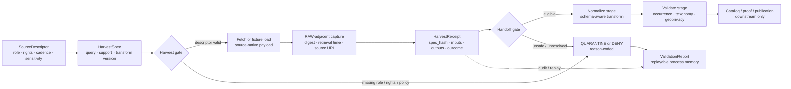

<!-- [KFM_META_BLOCK_V2]
doc_id: kfm://doc/TODO-NEEDS-UUID
title: Kansas Biodiversity ETL — Harvest
type: standard
version: v1
status: draft
owners: TODO-NEEDS-CODEOWNERS-VERIFICATION
created: TODO-VERIFY-YYYY-MM-DD
updated: 2026-04-25
policy_label: TODO-VERIFY-public-or-restricted
related: [../README.md, ../normalize/README.md, ../validate/README.md, ../../README.md, ../../../data/registry/README.md, ../../../data/receipts/README.md, ../../../schemas/contracts/v1/source/source_descriptor.schema.json, ../../../schemas/contracts/v1/runtime/run_receipt.schema.json, ../../../policy/README.md, ../../../tests/fixtures/README.md]
tags: [kfm, pipelines, biodiversity, harvest, source-admission, geoprivacy, receipts]
notes: [Target path supplied by user. Current session did not expose a mounted KFM Git checkout, so owner, created date, policy label, adjacent paths, package runner, and executable inventory remain NEEDS VERIFICATION. This README is written as a directory README and standard KFM doc.]
[/KFM_META_BLOCK_V2] -->

<a id="top"></a>

# Kansas Biodiversity ETL — Harvest

Harvest-stage orientation for admitting Kansas biodiversity source data into KFM without normalizing, publishing, or exposing sensitive locations.


> [!IMPORTANT]
> **Status:** experimental  
> **Owners:** `TODO-NEEDS-CODEOWNERS-VERIFICATION`  
> **Path:** `pipelines/kansas_biodiversity_etl/harvest/README.md`  
> **Repo fit:** harvest-stage boundary inside the proposed Kansas biodiversity ETL lane. This directory is upstream of normalization, validation, cataloging, map delivery, Evidence Drawer payloads, and publication review.  
> **Quick jumps:** [Scope](#scope) · [Repo fit](#repo-fit) · [Accepted inputs](#accepted-inputs) · [Exclusions](#exclusions) · [Directory tree](#directory-tree) · [Quickstart](#quickstart) · [Usage](#usage) · [Diagram](#diagram) · [Operating tables](#operating-tables) · [Task list](#task-list--definition-of-done) · [FAQ](#faq) · [Appendix](#appendix)

> [!NOTE]
> **Evidence posture:** This README is doctrine-grounded and target-path-aware, but not repo-implementation-confirmed. The current writing session did not expose a mounted KFM repository, package marker, workflow file, source registry, schema registry, test runner, or harvest executable. Treat commands, sibling paths, and directory contents below as **PROPOSED** until verified in the checked-out branch.

---

## Scope

This directory owns the **first governed contact** between KFM and biodiversity source material.

The harvest stage may:

- read approved or candidate **SourceDescriptor** records;
- make source-bound requests or load no-network fixtures;
- capture source-native payloads without semantic collapse;
- preserve provider-native identifiers, retrieval URIs, checksums, timestamps, source terms, and precision posture;
- emit harvest receipts, validation reports, and quarantine reasons;
- hand off raw/admitted material to downstream normalization.

The harvest stage must not decide final truth, final taxonomy, final public geometry, public release, or user-facing claims.

> [!WARNING]
> Biodiversity harvest data can contain exact occurrence locations, rare-species context, steward-controlled records, record-level licenses, observer metadata, or checklist semantics. Harvest is therefore **deny-by-default for publication** and **quarantine-first when rights, precision, source role, or provenance are unresolved**.

[Back to top](#top)

---

## Repo fit

### Path

`pipelines/kansas_biodiversity_etl/harvest/README.md`

### Upstream links

These are intended repo neighbors and must be checked before merge:

| Upstream surface | Link | Status | Why it matters |
|---|---|---|---|
| Parent biodiversity ETL lane | [`../`](../) | NEEDS VERIFICATION | Defines lane-level scope, ownership, and stage order. |
| Pipeline family index | [`../../`](../../) | NEEDS VERIFICATION | Places this lane among other KFM pipeline families. |
| Source registry | [`../../../data/registry/`](../../../data/registry/) | NEEDS VERIFICATION | Source admission should come from governed descriptors, not ad hoc connector code. |
| Source descriptor schema | [`../../../schemas/contracts/v1/source/source_descriptor.schema.json`](../../../schemas/contracts/v1/source/source_descriptor.schema.json) | NEEDS VERIFICATION | Machine-checks source role, rights, cadence, access method, and sensitivity posture. |
| Policy surface | [`../../../policy/`](../../../policy/) | NEEDS VERIFICATION | Supplies deny/quarantine/release-gate rules. |

### Downstream links

| Downstream surface | Link | Status | Harvest handoff |
|---|---|---|---|
| Normalize stage | [`../normalize/`](../normalize/) | NEEDS VERIFICATION | Receives source-native payloads plus harvest receipts; performs schema-aware normalization. |
| Validate stage | [`../validate/`](../validate/) | NEEDS VERIFICATION | Checks occurrence shape, source roles, rights, geoprivacy, taxonomy support, and finite outcomes. |
| Receipt surface | [`../../../data/receipts/`](../../../data/receipts/) | NEEDS VERIFICATION | Stores replayable process memory when repo convention supports central receipts. |
| Quarantine surface | [`../../../data/quarantine/`](../../../data/quarantine/) | NEEDS VERIFICATION | Holds unresolved or unsafe payloads outside public paths. |
| Tests and fixtures | [`../../../tests/fixtures/`](../../../tests/fixtures/) | NEEDS VERIFICATION | Provides no-network harvest proofs and negative fixtures. |

> [!TIP]
> Keep harvest boring on purpose: stable descriptors, reproducible captures, explicit receipts, and conservative quarantine behavior are more valuable here than broad connector coverage.

[Back to top](#top)

---

## Accepted inputs

Only admit inputs that can be reconstructed, reviewed, and governed.

| Input family | Belongs here? | Minimum admission metadata | Normal harvest disposition |
|---|---:|---|---|
| `SourceDescriptor` | Yes | source name, source role, authority scope, access method, rights posture, cadence, sensitivity posture, expected validation checks | Read before connector execution; fail closed if absent or incomplete. |
| Source query / harvest spec | Yes | source descriptor ref, query parameters, spatial/temporal support, transform version, requester/run context | Compute `spec_hash`; use for idempotency and replay. |
| Source-native response payload | Yes | provider-native ID, retrieval URI, retrieval time, content digest, source descriptor ref | Capture as RAW-adjacent material; do not normalize in place. |
| No-network fixture payload | Yes | fixture name, source family, expected outcome, sensitivity/rights posture | Use for validator and CI proof before live source activation. |
| Harvest receipt / run receipt | Yes | run ID, spec hash, input refs, output refs, decision, reason codes, actor/tool version | Emit for every run, including denied/quarantined runs. |
| Source terms / rights evidence | Yes | source terms ref, retrieved date, rights class, redistribution/public-use notes | Preserve with source descriptor or admission review. |
| Geoprivacy / precision metadata | Yes | source-native obscuration, coordinate uncertainty, public precision class, steward override if any | Drive quarantine/generalization decision downstream. |

### Candidate source families

These candidate families are **not confirmed as enabled connectors**. They are listed because KFM biodiversity doctrine and source-descriptor examples repeatedly require explicit source-role and geoprivacy handling.

| Source family | Typical role | Harvest obligation | Public-release posture |
|---|---|---|---|
| Kansas steward / regulatory sources | Kansas status or review context | Preserve authority scope and review state. | Never infer occurrence truth from status alone. |
| USFWS / federal species sources | federal listed species / critical habitat context | Preserve federal authority scope and spatial support. | Treat as status/context unless occurrence evidence is explicit. |
| NatureServe / heritage-style sources | controlled sensitive occurrence context | Preserve access restrictions and steward conditions. | Restricted by default; public exact geometry denied unless explicitly cleared. |
| GBIF | global occurrence corroboration | Preserve provider chain, dataset key, license, and uncertainty. | Corroborative, not regulatory authority. |
| iNaturalist | community-science occurrence evidence | Preserve observation ID, license, geoprivacy, taxon confidence, and source URI. | Record-level rights and geoprivacy decide public support. |
| eBird | checklist-backed bird occurrence evidence | Preserve checklist semantics, effort context, observation date, precision, and rights. | Checklist support must not be overstated as exact site truth. |

[Back to top](#top)

---

## Exclusions

The harvest directory is not a shortcut around KFM’s trust membrane.

Do **not** put these here:

| Excluded item | Why not | Belongs instead |
|---|---|---|
| Normalized occurrence records | Harvest preserves source-native evidence; normalization changes meaning. | `../normalize/` *(NEEDS VERIFICATION)* |
| Taxonomy resolution outputs | Ambiguous or unresolved taxa require receipts, mappings, and validation. | Normalize/validate taxonomy modules *(NEEDS VERIFICATION)* |
| Habitat joins or point-to-raster assignments | Derived joins are not canonical truth. | Downstream derived-artifact or habitat support lane *(NEEDS VERIFICATION)* |
| Public PMTiles, COGs, GeoParquet releases, or layer manifests | Delivery artifacts require catalog/proof/release closure. | Published/release surfaces *(NEEDS VERIFICATION)* |
| Evidence Drawer payloads or Focus Mode responses | UI trust surfaces must consume governed downstream envelopes. | App/API/UI contract surfaces *(NEEDS VERIFICATION)* |
| Secrets, API keys, private tokens, cookies, or steward-only credentials | Harvest docs and fixtures must remain safe to review. | Secret manager or deployment config; never committed. |
| Public exact sensitive coordinates | Exact protected locations can create harm. | Restricted store with policy controls, or generalized/redacted public derivative with receipt. |
| AI summaries, generated species claims, or uncited explanations | AI is interpretive and downstream of admissible evidence. | Governed AI runtime after EvidenceBundle resolution. |

[Back to top](#top)

---

## Directory tree

Current repository contents were not available in this session. The following tree is a **PROPOSED target shape** only. Prefer the repo’s existing package and pipeline conventions if they differ.

```text
harvest/
├── README.md
├── sources/                 # PROPOSED: source-specific harvest specs or adapters, if repo convention allows
├── fixtures/                # PROPOSED: no-network source-native payload fixtures
├── reports/                 # PROPOSED: generated validation/harvest reports; often gitignored
├── receipts/                # PROPOSED: lane-local receipts only if central data/receipts is not used
└── scripts/                 # NEEDS VERIFICATION: runner location may live in packages/ or tools/ instead
```

> [!IMPORTANT]
> Do not create parallel homes for receipts, fixtures, schemas, or source descriptors if the repository already has canonical locations. Verify the active branch first, then adapt this directory README to the discovered structure.

[Back to top](#top)

---

## Quickstart

Use this sequence to inspect before acting. The commands below are safe read-only probes.

```bash
# From the repository root.
git status --short
git branch --show-current

# Verify this target path and adjacent lane structure.
find pipelines/kansas_biodiversity_etl -maxdepth 3 -type f | sort

# Check whether source descriptors, receipts, schemas, and fixtures already have canonical homes.
find data schemas contracts policy tests tools pipelines -maxdepth 4 -type f 2>/dev/null \
  | grep -Ei 'biodiversity|fauna|flora|habitat|occurrence|source_descriptor|run_receipt|geoprivacy' \
  | sort
```

The harvest runner is **UNKNOWN** until the repo is mounted. Do not claim or document an executable command until package conventions are confirmed.

```bash
# ILLUSTRATIVE PSEUDOCODE — replace with the repo-native command after verification.
# This shape captures the intended safety posture, not a confirmed implementation.

python -m pipelines.kansas_biodiversity_etl.harvest \
  --source-descriptor data/registry/biodiversity/inaturalist.source.json \
  --fixture tests/fixtures/biodiversity/harvest/inaturalist_public_safe.json \
  --dry-run \
  --emit-receipt build/biodiversity/harvest/receipts/example.run_receipt.json
```

[Back to top](#top)

---

## Usage

### 1. Descriptor-first admission

Every source family starts with a descriptor, not a connector.

A descriptor should answer:

- What is the source role?
- What can this source support?
- What must it never be used to prove?
- What rights, license, or redistribution constraints apply?
- What geometry precision and geoprivacy rules apply?
- What freshness/cadence expectations apply?
- What validation checks are required before harvest can proceed?

### 2. Fixture-first proof

Before a live source fetch, add no-network fixtures for:

- one public-safe record;
- one missing-provenance record;
- one unknown-rights record;
- one sensitive exact-location record;
- one malformed payload;
- one source-role misuse case.

### 3. Harvest run

A harvest run should:

1. read the SourceDescriptor;
2. read the harvest spec;
3. compute a deterministic spec hash;
4. fetch or load a fixture;
5. capture source-native content and digest;
6. classify the run as allowed, quarantined, denied, or errored;
7. emit a receipt and validation report;
8. hand off only eligible material to downstream normalization.

### 4. Handoff

The handoff is intentionally narrow.

Harvest passes downstream:

- source-native payload reference;
- source descriptor reference;
- harvest receipt reference;
- content digest;
- retrieval timestamp;
- source-native ID(s);
- rights and sensitivity posture;
- quarantine or denial reason if applicable.

Harvest does not pass downstream:

- public claim text;
- final EvidenceBundle;
- public map layer IDs;
- final taxonomy resolution;
- public geometry decision;
- publication approval.

[Back to top](#top)

---

## Diagram



[Back to top](#top)

---

## Operating tables

### Harvest boundary map

| Object family | Harvest role | Can harvest create it? | Can harvest publish it? |
|---|---|---:|---:|
| `SourceDescriptor` | Input contract for admission | No; reads and validates | No |
| `HarvestSpec` | Run-specific source query / fixture spec | Yes, if repo convention supports it | No |
| Source-native payload | Captured evidence input | Yes, as RAW-adjacent capture | No |
| `IngestReceipt` / `RunReceipt` | Process memory for replay and review | Yes | No |
| `ValidationReport` | Reason-coded gate output | Yes | No |
| `QuarantineRecord` | Hold state for unresolved/unsafe material | Yes | No |
| `OccurrenceEvidence` | Normalized claim-support object | No | No |
| `EvidenceBundle` | Downstream support for inspectable claims | No, unless repo contract explicitly says otherwise | No |
| `ReleaseManifest` / proof pack | Publication proof | No | No |
| Public layer / tile artifact | Map delivery | No | No |

### Proposed harvest outcomes

| Outcome | Meaning | Next step |
|---|---|---|
| `ALLOW_TO_RAW` | Source descriptor, rights posture, source role, and basic payload shape are sufficient for RAW-adjacent capture. | Emit receipt; hand off to normalization. |
| `QUARANTINE` | Payload may be useful but rights, provenance, precision, source role, taxonomy support, or shape is unresolved. | Emit validation report; do not normalize for public path. |
| `DENY` | Known policy or rights condition forbids the requested harvest/use. | Emit denial receipt; do not retain beyond allowed audit record. |
| `ERROR` | Tooling, network, schema, or runner failure prevents a meaningful decision. | Emit error receipt where possible; retry only after cause is fixed. |

### Sensitive-location rules

| Condition | Harvest behavior |
|---|---|
| Source geoprivacy says obscured/private | Preserve flag; never reconstruct or expose exact coordinates. |
| Taxon or steward policy requires restriction | Preserve restricted marker; route to quarantine/restricted handoff. |
| Rights are unknown | Quarantine; public promotion is blocked downstream. |
| Coordinate uncertainty is absent | Preserve absence; require downstream validation before any spatial claim. |
| Public exact geometry is requested for sensitive record | Deny or quarantine; require redaction/generalization receipt downstream. |

[Back to top](#top)

---

## Task list — definition of done

A harvest README or implementation PR is not complete until these review gates are satisfied.

- [ ] Confirm `pipelines/kansas_biodiversity_etl/harvest/` exists in the real checkout.
- [ ] Verify owner from `CODEOWNERS` or governance record.
- [ ] Replace meta-block placeholders for `doc_id`, `created`, `owners`, and `policy_label`.
- [ ] Confirm parent, downstream, schema, policy, fixture, receipt, and registry links.
- [ ] Identify the repo-native package manager and test runner.
- [ ] Confirm canonical homes for `SourceDescriptor`, run receipt, validation report, and source fixtures.
- [ ] Add at least one valid and one invalid fixture before any live connector activation.
- [ ] Validate source descriptors for role, authority scope, rights, cadence, sensitivity, and freshness.
- [ ] Prove unknown rights and sensitive exact locations fail closed.
- [ ] Emit a harvest receipt for allow, quarantine, deny, and error cases.
- [ ] Confirm no public path reads RAW, WORK, QUARANTINE, secrets, or restricted coordinates.
- [ ] Update adjacent README files when stage boundaries or object homes change.
- [ ] Record rollback/deprecation notes if any previous biodiversity harvest path is moved or superseded.

[Back to top](#top)

---

## FAQ

### Can harvest publish biodiversity records?

No. Harvest can capture and document source-native material. Publication requires downstream validation, catalog/proof closure, review, policy checks, and release state.

### Can harvest normalize taxonomy?

No. Harvest preserves source-native names, identifiers, ranks, and provider metadata. Taxonomy resolution belongs downstream and must handle ambiguous or unresolved matches without silent merging.

### Can harvest use iNaturalist, eBird, GBIF, KDWP, USFWS, or NatureServe directly?

Only after the corresponding source descriptor, rights posture, access method, and source-role policy are verified. Candidate source names in this README are not proof of enabled connectors.

### Can a public fixture include exact coordinates?

Only when the fixture is explicitly public-safe, non-sensitive, rights-compatible, and marked as such. Negative fixtures should include sensitive exact-location cases to prove denial/quarantine behavior.

### Can a harvest receipt replace an EvidenceBundle?

No. A receipt records process memory. An EvidenceBundle supports inspectable claims downstream after admissible evidence, policy posture, review state, and release context are resolved.

### What should happen when source rights are unclear?

Quarantine or deny. Do not normalize into a public path, build public tiles, or let Focus Mode answer from the record.

[Back to top](#top)

---

## Appendix

<details>
<summary>Truth labels used in this README</summary>

| Label | Meaning here |
|---|---|
| CONFIRMED | Verified in this writing session from the user-supplied target path, attached KFM doctrine, or direct workspace inspection. |
| INFERRED | Reasonable project-fit interpretation from doctrine and target path, but not directly proven in the repo. |
| PROPOSED | Recommended shape, command, object, fixture, link, or directory not verified as current implementation. |
| UNKNOWN | Not verifiable until the real checkout, workflows, schemas, tests, logs, or runtime are inspected. |
| NEEDS VERIFICATION | Specific item that should be checked before merge or live-source activation. |

</details>

<details>
<summary>Open verification backlog</summary>

- Does the active repository contain `pipelines/kansas_biodiversity_etl/harvest/`?
- Is the broader lane named `kansas_biodiversity_etl`, or is this path a new target?
- Which owner or team is responsible for biodiversity harvest?
- Are source descriptors stored under `data/registry/`, `contracts/source/`, `schemas/contracts/v1/source/`, or another canonical home?
- Are receipts central under `data/receipts/`, lane-local, build-artifact-only, or both?
- Which finite outcomes are already standardized for pipeline gates?
- Which runner should execute harvest: Python module, script, Make target, workflow action, or another package entrypoint?
- Are iNaturalist, eBird, GBIF, KDWP, USFWS, NatureServe, or other biodiversity sources already represented by descriptors?
- What source terms, rate limits, licenses, and steward permissions apply to each candidate source?
- Which fields must be stripped from logs, receipts, public fixtures, and reports?
- Are exact restricted coordinates stored in a separate restricted store, or are they omitted entirely from public-safe fixtures?
- What downstream object creates the final EvidenceBundle for biodiversity claims?
- Which CI job proves no public path reads RAW, WORK, QUARANTINE, or restricted geometry?

</details>

[Back to top](#top)
