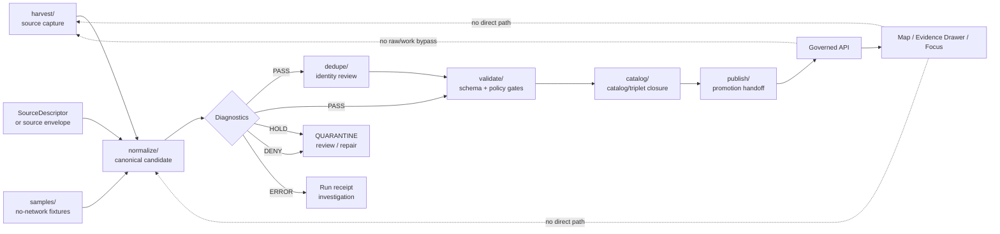

<!-- [KFM_META_BLOCK_V2]
doc_id: kfm://doc/NEEDS-VERIFICATION__pipelines_kansas_biodiversity_etl_normalize_readme
title: Kansas Biodiversity ETL Normalize
type: standard
version: v1
status: draft
owners: NEEDS_VERIFICATION__@bartytime4life_or_biodiversity_domain_owner
created: NEEDS-VERIFICATION
updated: 2026-04-25
policy_label: NEEDS-VERIFICATION__public_or_internal
related: [../README.md, ../harvest/, ../dedupe/, ../validate/, ../catalog/, ../publish/, ../samples/, ../Makefile, ../../../data/, ../../../schemas/, ../../../policy/, ../../../tools/, ../../../tests/]
tags: [kfm, pipelines, biodiversity, normalize, occurrence, darwin-core, gbif, evidence, geoprivacy]
notes: [Target path is confirmed on public main; the current leaf README was empty before this revision; owner, created date, policy label, runner commands, schema home, and active CI enforcement still need checkout-level verification.]
[/KFM_META_BLOCK_V2] -->

<a id="top"></a>

# Kansas Biodiversity ETL — Normalize

Convert harvested Kansas biodiversity occurrence inputs into deterministic, source-traceable, policy-aware normalized candidates without publishing or weakening the KFM trust path.

> [!IMPORTANT]
> **Status:** `experimental` / `draft`  
> **Owners:** `NEEDS_VERIFICATION__@bartytime4life_or_biodiversity_domain_owner`  
> **Path:** `pipelines/kansas_biodiversity_etl/normalize/README.md`  
> **Repo fit:** child stage under [`../README.md`](../README.md), between [`../harvest/`](../harvest/) and downstream review stages such as [`../dedupe/`](../dedupe/), [`../validate/`](../validate/), [`../catalog/`](../catalog/), and [`../publish/`](../publish/)  
> **Truth posture:** `CONFIRMED` target path · `CONFIRMED` parent pipeline shape · `PROPOSED` local stage contract · `UNKNOWN` active runner, schema home, CI gates, and artifact outputs  
> **Quick jumps:** [Scope](#scope) · [Repo fit](#repo-fit) · [Accepted inputs](#accepted-inputs) · [Exclusions](#exclusions) · [Directory tree](#directory-tree) · [Normalization contract](#normalization-contract) · [Quickstart](#quickstart) · [Usage](#usage) · [Diagram](#diagram) · [Operating tables](#operating-tables) · [Definition of done](#definition-of-done) · [FAQ](#faq) · [Appendix](#appendix)


> [!NOTE]
> This README is intentionally conservative. It documents the normalize stage as a governed transformation seam, not as proof that any specific script, Make target, schema, workflow, or publication artifact is currently active.

---

## Scope

`normalize/` is the stage that translates harvested biodiversity occurrence material into a KFM-shaped candidate record set.

It does **not** decide that a record is publishable. It prepares records for later deduplication, validation, catalog closure, EvidenceBundle resolution, review, and promotion.

### This stage should make these things explicit

| Question | Normalize-stage answer |
|---|---|
| What was harvested? | A GBIF, DwC-A, synthetic fixture, or replay input already tied to source identity and retrieval context. |
| What is being normalized? | Occurrence-like records, geometry, event time, taxon strings, basis of record, license, attribution, source references, and sensitivity hints. |
| What leaves this stage? | Normalized candidates, diagnostics, validation-side facts, and run-local process memory. |
| What must fail closed? | Missing source URI, missing or unknown license posture, invalid geometry, unresolved required source identity, sensitive exact locality without allowed treatment, and ambiguous identity that would silently merge evidence. |
| What is never produced here? | Public map layers, final EvidenceBundles, released artifacts, or raw client-visible truth. |

[Back to top](#top)

---

## Repo fit

### Local stage position

```text
pipelines/kansas_biodiversity_etl/
├── harvest/      # source capture and retrieval context
├── normalize/    # this stage: canonical candidate shaping
├── dedupe/       # deterministic identity, conflict handling, merge review
├── validate/     # schema, policy, evidence, geometry, rights, sensitivity gates
├── catalog/      # catalog / triplet closure preparation
├── publish/      # promotion-gated release handoff
├── samples/      # small no-network examples / fixtures
├── Makefile      # stage orchestration, if targets are verified
└── README.md     # parent pipeline contract
```

### Upstream links

| Upstream surface | Relationship | Verification posture |
|---|---|---|
| [`../README.md`](../README.md) | Parent contract for the Kansas biodiversity occurrence lane. | `CONFIRMED` path |
| [`../harvest/`](../harvest/) | Supplies reproducible source capture context. | `CONFIRMED` path / stage behavior `NEEDS VERIFICATION` |
| [`../samples/`](../samples/) | Expected home for no-network sample inputs and expected-output fixtures. | `CONFIRMED` path / inventory `NEEDS VERIFICATION` |
| [`../../../data/`](../../../data/) | Lifecycle storage boundary for raw, work, quarantine, processed, receipts, proofs, catalog, and published artifacts. | `CONFIRMED` root path / subpath conventions `NEEDS VERIFICATION` |
| [`../../../schemas/`](../../../schemas/) and [`../../../contracts/`](../../../contracts/) | Machine-readable object contracts, after schema-home authority is verified. | `CONFIRMED` root paths / authority `NEEDS VERIFICATION` |
| [`../../../policy/`](../../../policy/) | Rights, sensitivity, source-role, and release policy. | `CONFIRMED` root path / rule inventory `NEEDS VERIFICATION` |

### Downstream links

| Downstream surface | Normalize responsibility |
|---|---|
| [`../dedupe/`](../dedupe/) | Receives normalized records with stable candidate identity fields and conflict diagnostics. |
| [`../validate/`](../validate/) | Receives normalized candidate records plus enough diagnostics to fail closed. |
| [`../catalog/`](../catalog/) | Receives only downstream-approved candidates; normalize does not close catalog records by itself. |
| [`../publish/`](../publish/) | Receives nothing directly unless validation and promotion preparation have already succeeded. |
| [`../../../tools/`](../../../tools/) | Should host reusable validators or adapters rather than burying gate logic in this README. |
| [`../../../tests/`](../../../tests/) | Should prove valid and invalid normalization cases before live source expansion. |

> [!WARNING]
> Normalization must not become a shortcut around harvest receipts, source descriptors, policy checks, quarantine, dedupe review, catalog closure, or promotion gates.

[Back to top](#top)

---

## Accepted inputs

Inputs belong here only when they can be normalized without inventing source facts.

| Input | Accepted when | Required context |
|---|---|---|
| GBIF occurrence harvest output | The harvest stage captured query/download identity, source URI, retrieval timestamp, and license fields. | Source family, query or download key, source URI, retrieval time, source record URL where available. |
| Darwin Core Archive records | Archive metadata and provider terms are available. | Archive URI, EML or equivalent metadata, provider identity, retrieval timestamp, field mapping. |
| Synthetic no-network fixture | It is clearly marked as fixture-only and public-safe. | Fixture manifest, expected outcome, no live credentials, no sensitive exact locality. |
| Correction replay input | It is linked to a previous receipt or correction record. | Prior `spec_hash` or record key, correction reason, replacement run context. |
| Review-held candidate | The goal is to repair, normalize, or diagnose before downstream validation. | Hold reason, owner/reviewer note, source reference, previous validation result. |

### Minimal source envelope

This shape is illustrative until the active schema home is verified.

```json
{
  "source_id": "NEEDS_VERIFICATION__source_id",
  "source_family": "GBIF_OR_DWCA_OR_FIXTURE",
  "source_uri": "https://example.org/source-or-download",
  "retrieved_at": "2026-04-25T00:00:00Z",
  "query_or_manifest": "stateProvince=Kansas&modified>=...",
  "license_raw": "CC0 | CC-BY | NEEDS_VERIFICATION",
  "attribution_raw": "NEEDS_VERIFICATION",
  "source_role": "occurrence_aggregator | collection_provider | steward_reviewed | fixture",
  "sensitivity_terms": "NEEDS_VERIFICATION",
  "input_hash": "sha256:NEEDS_VERIFICATION"
}
```

[Back to top](#top)

---

## Exclusions

| Do not put or decide here | Why | Use instead |
|---|---|---|
| Live source harvesting | Harvest owns retrieval, watermarks, downloads, and source capture. | [`../harvest/`](../harvest/) |
| Raw API passthrough to clients | Public clients must not consume raw or work-stage records. | Governed API over promoted artifacts |
| Unknown-license public candidates | Public release cannot proceed without rights posture. | `../../../data/quarantine/` or a source correction queue |
| Exact sensitive localities marked public | Protected taxa and steward-controlled records require fail-closed geoprivacy. | Redacted/generalized derivative after policy and review |
| Final taxonomy authority claims | Occurrence sources are not automatically taxonomy authorities. | Taxonomy resolver / source-role registry / steward review |
| Habitat suitability claims | Occurrence evidence is not habitat proof. | Habitat/fauna/flora relation lane with separate evidence |
| Catalog closure files as final truth | Catalog closure is downstream of normalization and validation. | [`../catalog/`](../catalog/) |
| Release manifests, proof packs, signatures | Release proof is a separate trust surface. | `../../../data/proofs/`, `../../../release/`, and promotion tooling |
| Free-form AI summaries | AI is interpretive and must not define normalized truth. | Governed AI runtime contracts and cited EvidenceBundles |

[Back to top](#top)

---

## Directory tree

Current public path evidence shows this leaf as a README-only stage. Keep it that way until implementation files are verified or added by a reviewed PR.

```text
pipelines/kansas_biodiversity_etl/normalize/
└── README.md
```

### Proposed implementation homes

The table below is a placement guide, not a claim that these files already exist.

| Proposed item | Purpose | Status |
|---|---|---|
| `normalize_dwc.py` or repo-native equivalent | Map Darwin Core-style fields into KFM candidate records. | `PROPOSED` |
| `field_map.yml` | Reviewable mapping between source fields and candidate fields. | `PROPOSED` |
| `fixtures/valid/*.json` | Minimal public-safe normalization examples. | `PROPOSED` |
| `fixtures/invalid/*.json` | Missing source URI, missing license, invalid geometry, and exact-sensitive failures. | `PROPOSED` |
| `reports/` | Run-local diagnostics if repo conventions permit local reports. | `PROPOSED` |
| `tests/` | Stage-local tests only if the repo uses local stage tests; otherwise use root `tests/`. | `PROPOSED` |

> [!TIP]
> Prefer keeping durable receipts, proofs, processed data, and catalog objects under the repo’s lifecycle surfaces, not beside pipeline code.

[Back to top](#top)

---

## Normalization contract

### 1. Preserve source identity

Normalize must retain source identity even when field names are cleaned or canonicalized.

| Candidate field | Source / derivation | Rule |
|---|---|---|
| `source_id` | Source descriptor, harvest envelope, or fixture manifest | Required |
| `source_uri` | Source record, archive, download, or provider URL | Required for evidence closure |
| `source_record_id` | `occurrenceID`, provider record ID, or stable source key | Preserve when present |
| `retrieved_at` | Harvest envelope | Required |
| `source_role` | Source descriptor or source registry | Required before promotion |

### 2. Normalize occurrence fields

| Candidate field | Typical source field | Notes |
|---|---|---|
| `occurrence_id` | `occurrenceID` or stable source identifier | Preferred source identity; do not invent authority. |
| `catalog_id` | `catalogNumber` | Not globally unique alone. |
| `scientific_name_raw` | `scientificName` | Preserve raw string. |
| `scientific_name_normalized` | normalized `scientificName` | Trim, Unicode normalize, collapse whitespace. |
| `basis_of_record` | `basisOfRecord` | Preserve specimen / observation / literature / machine observation distinction. |
| `event_date` | `eventDate` | Preserve uncertainty when present. |
| `institution` | `institutionCode` | Attribution input. |
| `collection` | `collectionCode` | Attribution input. |
| `license_raw` | `license` | Missing or unknown license fails closed. |
| `attribution_raw` | provider / institution / dataset metadata | Required when license or source terms require attribution. |

### 3. Normalize geometry without pretending it is safe

```text
geometry.crs MUST be EPSG:4326
missing_coordinates -> HOLD or QUARANTINE unless intentionally non-spatial
invalid_coordinates -> QUARANTINE
coordinate_uncertainty_missing -> HOLD for precision-sensitive publication
exact_sensitive_geometry + public_release_requested -> DENY downstream
```

### 4. Keep deterministic identity reviewable

```text
candidate_spec_hash = sha256(canonical_candidate_without_transients)
```

Exclude transient fields from record identity:

- ingest timestamp
- local file path
- row index
- logging metadata
- non-semantic ordering
- operator-only notes

> [!NOTE]
> Exact canonical serialization remains `NEEDS VERIFICATION` until the repo confirms whether KFM uses JCS, a custom canonical JSON serializer, or another stable serialization contract.

### 5. Emit diagnostics, not silence

Every normalized batch should carry diagnostics good enough for downstream gates to decide `PASS`, `HOLD`, `QUARANTINE`, `DENY`, or `ERROR`.

| Diagnostic family | Examples |
|---|---|
| Source | missing URI, missing retrieval timestamp, source role unresolved |
| Rights | missing license, restricted license, attribution unknown |
| Geometry | invalid coordinates, unknown CRS, low precision, uncertainty missing |
| Taxonomy | blank name, ambiguous name, synonym mapping needed, unresolved authority |
| Sensitivity | exact sensitive geometry, embargo candidate, steward review required |
| Identity | missing stable source ID, fallback key used, hash mismatch |
| Evidence | missing source record URL, unsupported claim field, unresolved evidence ref |

[Back to top](#top)

---

## Quickstart

### 1. Inspect before changing the leaf

```bash
# From the repository root.
git status --short
git branch --show-current

# Confirm this stage and its parent context.
find pipelines/kansas_biodiversity_etl/normalize -maxdepth 2 -type f | sort
find pipelines/kansas_biodiversity_etl -maxdepth 2 -type f | sort

# Confirm adjacent governance surfaces.
find data schemas contracts policy tools tests -maxdepth 2 -type f 2>/dev/null | sort | head -200
```

### 2. Prefer no-network fixtures

```bash
# PROPOSED placeholder until runner and Make targets are verified.
# Use the repo-native target if Makefile confirms it.
make -C pipelines/kansas_biodiversity_etl normalize-biodiversity DRY_RUN=1 NO_NETWORK=1
```

### 3. Script fallback, only after inspection

```bash
# PROPOSED placeholder.
# Replace with the actual active command after implementation files are verified.
python pipelines/kansas_biodiversity_etl/normalize/normalize_dwc.py \
  --input ../../../data/work/kansas_biodiversity_etl/harvest_fixture.json \
  --output ../../../data/work/kansas_biodiversity_etl/normalized_candidate.json \
  --receipt-out ../../../data/receipts/kansas_biodiversity_etl/normalize_run_receipt.json \
  --no-network
```

> [!CAUTION]
> Do not run live source fetches, bulk normalization, public layer generation, publication, or destructive cleanup from this stage until source terms, credentials, policy gates, rollback, and CI expectations are verified.

[Back to top](#top)

---

## Usage

### Normalization flow

1. Start from a harvested or fixture input that includes source identity.
2. Load field mapping and schema references from the repo-confirmed contract home.
3. Preserve raw source fields needed for attribution, rights, source record identity, and diagnostics.
4. Produce canonical candidate fields without overwriting source meaning.
5. Normalize geometry to `EPSG:4326` and carry precision/uncertainty.
6. Normalize taxon strings, but do not silently merge unresolved or ambiguous taxa.
7. Compute deterministic candidate identity over semantic content only.
8. Emit normalized candidate output, diagnostics, and run-local receipt references.
9. Route failures to downstream quarantine handling rather than deleting them.
10. Hand off to [`../dedupe/`](../dedupe/) and [`../validate/`](../validate/) for identity conflict review and gate checks.

### Local finite outcomes

| Outcome | Meaning | Handoff |
|---|---|---|
| `PASS` | Candidate shape is ready for downstream dedupe/validation. | `../dedupe/` or `../validate/` |
| `HOLD` | Candidate is repairable or needs steward/source review. | Review queue or quarantine candidate |
| `QUARANTINE` | Candidate is unsafe, invalid, blocked, or unsupported. | `../../../data/quarantine/` |
| `DENY` | Requested public interpretation is not allowed from this candidate. | Policy/reporting surface |
| `ERROR` | Tooling or runtime failure occurred. | Run receipt and maintainer investigation |

[Back to top](#top)

---

## Diagram



[Back to top](#top)

---

## Operating tables

### Stage boundary matrix

| Lifecycle zone | Normalize-stage relationship | Must not do |
|---|---|---|
| `RAW` | Read only through harvest-declared inputs. | Rewrite source payloads or treat them as public truth. |
| `WORK` | Produce normalized candidates, diagnostics, and replayable process context. | Hide transforms, silently repair without diagnostics, or store bulk data beside code. |
| `QUARANTINE` | Route unsafe, ambiguous, blocked, or invalid candidates with reasons. | Drop failures without disposition. |
| `PROCESSED` | Prepare candidates for downstream validation and processed output. | Declare public readiness by itself. |
| `CATALOG / TRIPLET` | Provide enough source/evidence fields for catalog closure later. | Emit final catalog claims without validation. |
| `PUBLISHED` | No direct publication role. | Move files into published paths or expose public routes. |

### Field responsibility matrix

| Responsibility | Normalize owns | Normalize does not own |
|---|---|---|
| Source preservation | Keep source URI, source record ID, retrieval context, license, attribution. | Admit new source families without registry/source review. |
| Geometry | Normalize coordinate representation and carry uncertainty. | Declare sensitive exact locations public-safe. |
| Taxonomy | Normalize strings and emit resolution diagnostics. | Make final canonical taxonomy authority decisions without resolver policy. |
| Identity | Compute candidate deterministic hash when rules are confirmed. | Merge conflicting records silently. |
| Rights | Carry license and attribution facts forward. | Decide final release class alone. |
| Evidence | Preserve fields needed for EvidenceBundle resolution. | Create final evidence-backed public claims alone. |

### Failure disposition table

| Condition | Expected disposition |
|---|---|
| Missing `source_uri` | `HOLD` or `QUARANTINE`; cannot support EvidenceBundle closure. |
| Missing `license_raw` | `QUARANTINE`; public release blocked. |
| Invalid coordinates | `QUARANTINE` unless intentionally non-spatial. |
| Unknown CRS | `HOLD`; do not assume `EPSG:4326`. |
| Sensitive exact locality with no transform | `DENY` for public use; steward review or redaction required. |
| Ambiguous taxon resolution | `HOLD`; no silent merge. |
| Hash mismatch on replay | `ERROR` or `QUARANTINE`; investigate before downstream use. |

[Back to top](#top)

---

## Definition of done

A normalize-stage change is ready for review when all applicable checks are true.

- [ ] Actual repo conventions were inspected and reflected in this README or a linked ADR.
- [ ] Owner and policy label placeholders are resolved or explicitly accepted as review placeholders.
- [ ] The stage has at least one public-safe no-network valid fixture.
- [ ] Invalid fixtures cover missing source URI, missing license, invalid geometry, ambiguous taxon, and exact sensitive locality.
- [ ] Source identity, retrieval context, license, attribution, source role, and source record references are preserved.
- [ ] Geometry is represented in `EPSG:4326` or held with a clear reason.
- [ ] Coordinate uncertainty and precision are carried forward.
- [ ] Taxon normalization preserves raw and normalized values plus ambiguity diagnostics.
- [ ] Candidate `spec_hash` or equivalent deterministic identity excludes transient runtime metadata.
- [ ] Run diagnostics are machine-readable.
- [ ] Failures route to quarantine/review with reasons rather than being deleted.
- [ ] No public map, API, Focus Mode, or Evidence Drawer path reads normalize-stage outputs directly.
- [ ] Downstream handoff to `dedupe/` and `validate/` is documented.
- [ ] Rollback or replay instructions are visible for any changed transform rule.

[Back to top](#top)

---

## FAQ

### Is normalize allowed to repair records?

Yes, but only as a reviewable transform. Repairs must leave diagnostics or receipts that explain what changed and why. Silent repair breaks replay and correction.

### Can normalize drop records?

Not by default. Unsafe, invalid, blocked, or ambiguous records should be routed to quarantine or review with a disposition reason. Deletion should be a governed cleanup action, not a normalization shortcut.

### Can normalized occurrence candidates be displayed on the public map?

No. Public display belongs downstream of validation, geoprivacy, EvidenceBundle closure, catalog/proof linkage, promotion, and governed API serving.

### Does a GBIF occurrence prove a species range or habitat relationship?

No. An occurrence record can support an occurrence claim. Range, status, habitat, suitability, and stewardship claims require separate source roles and evidence.

### Should this stage resolve taxonomy?

It can normalize names and classify resolution state. Final authority, synonym acceptance, and ambiguous merges need resolver rules, source-role context, and review.

[Back to top](#top)

---

## Appendix

<details>
<summary>Illustrative normalized candidate shape</summary>

This example is intentionally small and non-authoritative. It is not a schema.

```json
{
  "record_type": "kfm.biodiversity.occurrence_candidate",
  "record_version": "v1.PROPOSED",
  "source": {
    "source_id": "NEEDS_VERIFICATION__gbif_or_dwca_source",
    "source_family": "GBIF_OR_DWCA",
    "source_uri": "https://example.org/source-record",
    "source_record_id": "NEEDS_VERIFICATION__occurrenceID",
    "retrieved_at": "2026-04-25T00:00:00Z",
    "source_role": "occurrence_aggregator"
  },
  "occurrence": {
    "occurrence_id": "NEEDS_VERIFICATION__occurrenceID",
    "catalog_id": "NEEDS_VERIFICATION__catalogNumber",
    "basis_of_record": "PreservedSpecimen | HumanObservation | MachineObservation | NEEDS_VERIFICATION",
    "event_date": "NEEDS_VERIFICATION__eventDate"
  },
  "taxon": {
    "scientific_name_raw": "NEEDS_VERIFICATION__scientificName",
    "scientific_name_normalized": "NEEDS_VERIFICATION__normalizedScientificName",
    "resolution_status": "exact | synonym | ambiguous | unresolved"
  },
  "geometry": {
    "type": "Point",
    "coordinates": [-98.0000, 38.5000],
    "crs": "EPSG:4326",
    "coordinate_uncertainty_m": 1000,
    "public_geometry_class": "public_exact_allowed | public_generalized | restricted_precise | steward_review_required"
  },
  "rights": {
    "license_raw": "CC0 | CC-BY | NEEDS_VERIFICATION",
    "attribution_raw": "NEEDS_VERIFICATION",
    "release_obligations": ["retain attribution"]
  },
  "diagnostics": {
    "normalization_outcome": "PASS | HOLD | QUARANTINE | DENY | ERROR",
    "warnings": [],
    "hold_reasons": [],
    "policy_refs": ["NEEDS_VERIFICATION__policy_ref"]
  },
  "identity": {
    "candidate_spec_hash": "sha256:NEEDS_VERIFICATION",
    "hash_rule": "NEEDS_VERIFICATION__canonical_json_rule"
  }
}
```

</details>

<details>
<summary>Reviewer checklist for a normalize-stage PR</summary>

- Does the PR preserve the parent pipeline truth path?
- Does it avoid changing harvest, dedupe, validate, catalog, or publish behavior without saying so?
- Does it include valid and invalid fixtures?
- Does it avoid source-specific shortcuts that only work for one provider?
- Does it keep rights, attribution, sensitivity, and source role visible?
- Does it prevent exact sensitive locations from becoming public by accident?
- Does it preserve raw source values where downstream evidence or attribution needs them?
- Does it add or update tests when transform logic changes?
- Does it leave rollback or replay instructions for changed normalization rules?

</details>

[Back to top](#top)
