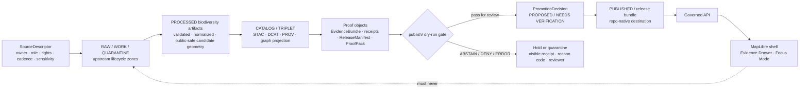

<!-- [KFM_META_BLOCK_V2]
doc_id: kfm://doc/NEEDS_VERIFICATION__pipelines_kansas_biodiversity_etl_publish_readme
title: Kansas Biodiversity ETL Publish README
type: standard
version: v1
status: draft
owners: NEEDS_VERIFICATION__owner_or_team
created: NEEDS_VERIFICATION__YYYY-MM-DD
updated: NEEDS_VERIFICATION__YYYY-MM-DD
policy_label: NEEDS_VERIFICATION__public_or_internal
related: [NEEDS_VERIFICATION__../README.md, NEEDS_VERIFICATION__../../README.md, NEEDS_VERIFICATION__../../../data/README.md, NEEDS_VERIFICATION__../../../data/catalog/README.md, NEEDS_VERIFICATION__../../../data/proofs/README.md, NEEDS_VERIFICATION__../../../data/receipts/README.md, NEEDS_VERIFICATION__../../../policy/README.md, NEEDS_VERIFICATION__../../../schemas/README.md]
tags: [kfm, readme, pipelines, kansas-biodiversity-etl, biodiversity, publish, evidence, promotion]
notes: [Target path was requested, but the current session did not expose a mounted KFM repository or existing target file. Owner, dates, policy label, related-link validity, schema home, commands, and artifact inventory require branch-level verification before commit.]
[/KFM_META_BLOCK_V2] -->

<a id="top"></a>

# Kansas Biodiversity ETL · Publish

Publish-boundary documentation for the Kansas biodiversity ETL lane: what may become a release candidate, what must stay upstream, and which proof objects must exist before outward exposure.

> [!NOTE]
> **Status:** `experimental`  
> **Owners:** `NEEDS_VERIFICATION__owner_or_team`  
> **Path:** `pipelines/kansas_biodiversity_etl/publish/README.md`  
> **Repo fit:** child README for the publish boundary of `pipelines/kansas_biodiversity_etl/`; upstream and downstream links below are **NEEDS VERIFICATION** until the real checkout is inspected.  
> **Evidence posture:** KFM doctrine is source-grounded; this target path and README role are requested; existing file inventory, commands, package manager, validators, workflow wiring, and emitted artifacts are **UNKNOWN** in this session.  
> **Quick jumps:** [Scope](#scope) · [Repo fit](#repo-fit) · [Accepted inputs](#accepted-inputs) · [Exclusions](#exclusions) · [Directory tree](#directory-tree) · [Quickstart](#quickstart) · [Publish flow](#publish-flow) · [Gate matrix](#gate-matrix) · [Task list](#task-list--definition-of-done) · [FAQ](#faq) · [Appendix](#appendix)


> [!IMPORTANT]
> `publish/` is **not** public truth by itself.
>
> In KFM, publication is a governed state transition. This directory may assemble, dry-run, describe, or validate release candidates, but it must not turn raw biodiversity observations, exact sensitive coordinates, model summaries, or unchecked source payloads into public artifacts by folder placement alone.

---

## Scope

`pipelines/kansas_biodiversity_etl/publish/` is the final pipeline boundary before a Kansas biodiversity artifact can be considered for governed release.

This README defines the lane contract for:

- assembling public-safe release candidates from already validated biodiversity outputs;
- checking source role, rights, sensitivity, evidence, catalog, proof, review, and rollback readiness;
- keeping biodiversity public outputs downstream of `EvidenceBundle`, `ReleaseManifest`, catalog closure, and policy decisions;
- preventing exact sensitive occurrence geometry from leaking into map layers, exports, Focus Mode, or public API responses.

### What this README can safely claim

| Claim | Label | Basis |
|---|---:|---|
| The target path is `pipelines/kansas_biodiversity_etl/publish/README.md`. | **CONFIRMED** | Requested target file path. |
| This is a README-like directory document and should include repo fit, inputs, exclusions, badges, quick jumps, diagram, and definition of done. | **CONFIRMED / PROPOSED** | KFM documentation convention plus current request. |
| The real repository tree, target file existence, artifacts, workflows, and validator commands were not visible in this session. | **CONFIRMED** | Current workspace scan. |
| The publish boundary should preserve KFM lifecycle, proof-object, source-descriptor, and geoprivacy doctrine. | **CONFIRMED doctrine** | Attached KFM corpus. |
| File names, commands, directory children, and downstream links in this README are repo-ready proposals until branch inspection confirms them. | **PROPOSED / NEEDS VERIFICATION** | No mounted checkout was available. |

[Back to top](#top)

---

## Repo fit

> [!WARNING]
> Link targets below are **candidate repo-fit anchors**. Verify them in the checked-out branch before committing this README.

| Direction | Candidate path | Why it matters | Status |
|---|---|---|---|
| Current | `pipelines/kansas_biodiversity_etl/publish/README.md` | This README; defines the publish boundary for the biodiversity ETL lane. | **CONFIRMED target / UNKNOWN existence** |
| Upstream | [`../README.md`](../README.md) | Expected landing page for the whole `kansas_biodiversity_etl` pipeline. | **NEEDS VERIFICATION** |
| Upstream | [`../../README.md`](../../README.md) | Expected `pipelines/` index and cross-pipeline routing surface. | **NEEDS VERIFICATION** |
| Source registry | [`../../../data/registry/README.md`](../../../data/registry/README.md) | Expected home for source descriptors: owner, role, rights, cadence, sensitivity, and access method. | **NEEDS VERIFICATION** |
| Catalog closure | [`../../../data/catalog/README.md`](../../../data/catalog/README.md) | Expected route to STAC/DCAT/PROV-style catalog records and closure checks. | **NEEDS VERIFICATION** |
| Receipts | [`../../../data/receipts/README.md`](../../../data/receipts/README.md) | Expected process-memory surface for ingest, validation, redaction, and dry-run receipts. | **NEEDS VERIFICATION** |
| Proofs | [`../../../data/proofs/README.md`](../../../data/proofs/README.md) | Expected release-significant proof surface: proof packs, release manifests, EvidenceBundles. | **NEEDS VERIFICATION** |
| Policy | [`../../../policy/README.md`](../../../policy/README.md) | Expected policy-as-code or policy-documentation boundary for rights, sensitivity, and promotion gates. | **NEEDS VERIFICATION** |
| Schemas / contracts | [`../../../schemas/README.md`](../../../schemas/README.md) / [`../../../contracts/README.md`](../../../contracts/README.md) | Expected contract authority or companion schema home; actual authority remains unresolved here. | **NEEDS VERIFICATION** |
| Downstream API | [`../../../apps/governed-api/README.md`](../../../apps/governed-api/README.md) | Candidate governed API consumer; public clients should not read this directory directly. | **NEEDS VERIFICATION** |
| Downstream UI | [`../../../apps/explorer-web/README.md`](../../../apps/explorer-web/README.md) | Candidate MapLibre/Evidence Drawer consumer of published, governed outputs. | **NEEDS VERIFICATION** |

### Boundary rule

`publish/` prepares a candidate. It does not become the release record, the proof pack, the catalog, the public API, or the MapLibre source of truth.

[Back to top](#top)

---

## Accepted inputs

Only material that has already passed earlier lifecycle stages belongs here.

| Input | What belongs here | Required support | Block if |
|---|---|---|---|
| Release candidate descriptors | Machine-readable candidate summaries that point to processed artifacts, catalog entries, evidence refs, and proof refs. | `spec_hash`, candidate ID, source descriptor refs, policy label, sensitivity summary. | The descriptor references RAW, WORK, QUARANTINE, unreviewed exact locations, or unresolved rights. |
| Public-safe artifacts | PMTiles, GeoJSON, GeoParquet, COG, TileJSON, or equivalent release-candidate references **only when generated from processed outputs**. | Content digest, artifact role, source/candidate linkage, public-safe geometry status. | Artifact contains exact sensitive biodiversity coordinates or unclear redistribution rights. |
| Catalog references | STAC/DCAT/PROV refs or closure reports tied to the candidate. | Resolvable catalog refs and provenance links. | Catalog triplet is missing, inconsistent, or points to different artifact identities. |
| Evidence references | `EvidenceBundle` or `EvidenceRef` references for claims, layer metadata, and drawer payloads. | Resolver-ready refs and bundle digests where repo convention supports them. | A consequential claim cannot be reconstructed to admissible evidence. |
| Redaction/generalization receipts | Records proving precision degradation, redaction, or public geometry transformation. | Transform method, before/after precision class, policy reason, reviewer or rule version. | Sensitive geometry is merely hidden by UI style or omitted without a traceable transform. |
| Layer descriptors | Map delivery descriptors for governed downstream rendering. | Released artifact URI, layer role, knowledge character, sensitivity state, evidence route. | Descriptor tells a browser to fetch source APIs, raw stores, or candidate internals directly. |
| Dry-run reports | No-publication validation outputs generated before promotion. | Deterministic pass/fail/deny/error result and audit/ref path. | Dry-run output is mistaken for proof of release. |

[Back to top](#top)

---

## Exclusions

| Do not put here | Why not | Put it here instead |
|---|---|---|
| Raw GBIF/iNaturalist/KDWP/USFWS/NatureServe/KBS downloads or source-native dumps | Raw material belongs at source edge or RAW. It may include sensitive locations, rights restrictions, or source quirks. | `data/raw/…` or the upstream ingest lane, after source descriptor review. |
| WORK or QUARANTINE intermediates | Unresolved material must not drift into publish candidate space. | `data/work/…` or `data/quarantine/…`. |
| Exact sensitive occurrence coordinates | Biodiversity publication must fail closed where rare species, protected habitats, private-land, steward, or cultural sensitivity burdens apply. | Restricted steward stores, quarantine, or processed internal records with public-safe transforms. |
| Source credentials, API keys, access tokens, or controlled-access downloads | Secrets and controlled access are not repo content and should not appear in release candidates. | Approved secret management / protected local config; document only non-secret source descriptors. |
| Canonical taxon or occurrence truth | `publish/` is not the canonical store. | Canonical or processed biodiversity lane after schema validation and source-role review. |
| Model-generated summaries without governed envelopes | AI cannot create public truth or bypass evidence. | Governed AI / Focus runtime envelopes downstream of EvidenceBundle resolution. |
| UI-only trust badges | Trust must be backed by manifests, evidence, catalog, receipts, and proof objects, not visual style alone. | MapLibre layer metadata + Evidence Drawer payload + proof/candidate references. |
| Permanent public release state | Folder placement is not promotion. | `data/published/…`, `data/releases/…`, proof packs, or repo-native release bundle homes after promotion. |

[Back to top](#top)

---

## Directory tree

**UNKNOWN current branch inventory.** The tree below is a proposed readable shape for this publish boundary. Keep it small unless the mounted repo already has a different convention.

```text
pipelines/kansas_biodiversity_etl/
├── README.md                         # NEEDS VERIFICATION: pipeline landing page
├── ingest/                           # NEEDS VERIFICATION: source-edge and RAW capture boundary
├── transform/                        # NEEDS VERIFICATION: normalization, joins, redaction, public-safe geometry
├── validate/                         # NEEDS VERIFICATION: schema, policy, catalog, evidence, and sensitivity checks
└── publish/
    ├── README.md                     # this file
    ├── release_candidate.example.json # PROPOSED: illustrative candidate descriptor only
    ├── manifests/                    # PROPOSED: release-manifest drafts or references
    ├── layer_descriptors/            # PROPOSED: governed MapLibre delivery descriptors
    ├── drawer_payloads/              # PROPOSED: Evidence Drawer payload examples or fixtures
    ├── dry_runs/                     # PROPOSED: no-publication validation outputs
    └── .gitkeep                      # optional placeholder if the repo convention uses it
```

> [!CAUTION]
> Do not add generated binary release artifacts here just because the directory name is `publish`. Prefer digest-addressed external artifact storage, `data/published/`, or repo-native release bundles once the promotion path is verified.

[Back to top](#top)

---

## Quickstart

### 1. Inspect the lane

```bash
# From repository root.
# CONFIRMED target path is requested; existing file inventory is NEEDS VERIFICATION.
test -f pipelines/kansas_biodiversity_etl/publish/README.md
find pipelines/kansas_biodiversity_etl/publish -maxdepth 2 -type f | sort
```

### 2. Review candidate readiness

```bash
# PROPOSED / NEEDS VERIFICATION:
# Replace this with the repo-native validator command once tools and package manager are confirmed.
python -m tools.validators.promotion_gate \
  --candidate pipelines/kansas_biodiversity_etl/publish/release_candidate.example.json \
  --policy policy/biodiversity \
  --out data/receipts/biodiversity/publish-dry-run.json
```

### 3. Check for forbidden path leaks

```bash
# Generic inspection helper; not a substitute for repo-native validation.
grep -RInE 'data/(raw|work|quarantine)|/raw/|/work/|/quarantine/' \
  pipelines/kansas_biodiversity_etl/publish || true
```

### 4. Open the proof trail

Before a candidate can move toward release, reviewers should be able to answer:

1. Which source descriptors support it?
2. Which processed artifacts and catalog records does it reference?
3. Which redaction or generalization receipts protect sensitive locations?
4. Which EvidenceBundle refs support claims and layer metadata?
5. Which release manifest or proof pack would promotion create or update?
6. Which rollback target and correction path are declared?

[Back to top](#top)

---

## Usage

### Add a publish candidate

1. Confirm upstream source descriptors are complete for owner, role, access method, rights, cadence, sensitivity, and validation checks.
2. Confirm all candidate artifacts are already in `PROCESSED` state or equivalent repo-native processed scope.
3. Generate or reference catalog closure: STAC for spatial assets, DCAT for datasets/distributions, PROV for lineage.
4. Attach EvidenceRefs or EvidenceBundle refs for every consequential claim, layer descriptor, drawer payload, and Focus-facing summary.
5. Attach redaction/generalization receipts for public biodiversity geometry.
6. Run schema, policy, catalog, proof, and no-raw-public-path checks.
7. Submit the candidate for steward review; do not manually copy it into a public surface.

### Illustrative candidate descriptor

This shape is illustrative. Replace it with the repo’s canonical schema once the schema home and object names are verified.

```json
{
  "candidate_id": "kfm://release-candidate/biodiversity/NEEDS_VERIFICATION",
  "lane": "kansas_biodiversity_etl",
  "stage": "publish",
  "policy_label": "NEEDS_VERIFICATION",
  "spec_hash": "sha256:NEEDS_VERIFICATION",
  "source_descriptor_refs": [],
  "processed_artifact_refs": [],
  "catalog_refs": {
    "stac": [],
    "dcat": [],
    "prov": []
  },
  "evidence_bundle_refs": [],
  "proof_refs": [],
  "release_manifest_ref": null,
  "sensitivity": {
    "contains_exact_sensitive_locations": false,
    "public_geometry": "generalized|redacted|withheld|none",
    "transform_receipt_refs": []
  },
  "decision": {
    "outcome": "ABSTAIN",
    "reason": "placeholder_requires_repo_validation"
  }
}
```

[Back to top](#top)

---

## Publish flow



### Flow rules

- The browser must consume released descriptors and governed API responses, not raw source APIs or unpublished pipeline files.
- A species-to-habitat join is a derived artifact or governed query result, not canonical species truth.
- Unknown rights, unknown sensitivity, unresolved source role, missing catalog closure, missing evidence, or missing proof must block outward trust.
- Failed candidates should remain inspectable through receipts, denial reasons, and review notes.

[Back to top](#top)

---

## Gate matrix

| Gate | What must be true before trust widens | Biodiversity-specific pressure | Fail-closed result |
|---|---|---|---|
| Identity | Candidate, artifacts, schemas, and process recipe have stable IDs and `spec_hash` or repo-native equivalent. | Occurrence and taxon IDs must not collapse source-native, accepted-authority, and KFM IDs. | `ABSTAIN` or block review. |
| Source role | Every source has owner, role, official/corroborative/steward status, cadence, rights, sensitivity, and validation expectations. | KDWP/steward review, USFWS status/context, NatureServe/heritage systems, GBIF, specimens, and community observations carry different authority burdens. | `DENY` for public promotion if role is missing or overstated. |
| Rights | License, access terms, redistribution posture, and attribution obligations are explicit. | Controlled-access or record-level licenses can block publication even when data is technically available. | Quarantine or restricted release only. |
| Sensitivity | Rare/protected/exact-location and private-land sensitivity are classified. | Exact species occurrences may require generalization, redaction, withholding, or steward-only access. | `DENY` public exact geometry. |
| Evidence | Every consequential claim resolves to EvidenceRefs/EvidenceBundles. | “Species present,” “habitat associated,” “range overlaps,” and “status applies” are different claim types. | `ABSTAIN` if evidence is incomplete; `DENY` if policy blocks disclosure. |
| Catalog | STAC/DCAT/PROV or repo-native catalog closure exists and cross-links correctly. | Public map assets need asset metadata and lineage; catalog metadata is not proof by itself. | Block release candidate. |
| Proof | ReleaseManifest, ProofPack, receipts, review records, and correction/rollback refs are present where required. | Public biodiversity outputs need transform receipts for sensitivity controls. | Block promotion. |
| Delivery | Layer descriptors point only to released, public-safe artifacts through governed routes. | MapLibre must not discover precise restricted points through style/source definitions. | `DENY` layer descriptor. |
| Review | Steward review state and obligations are recorded. | Some burdens may block public release but still allow steward-facing review. | Hold for review with visible reason. |
| Rollback | Prior release or safe withdrawal path is declared. | Bad species-status or location-publication errors require fast correction and visible supersession. | Block release until rollback target exists. |

[Back to top](#top)

---

## Operating tables

### Publish boundary object families

| Object family | Role in this lane | Truth status |
|---|---|---|
| `SourceDescriptor` | Source admission and role/risk record for biodiversity inputs. | **CONFIRMED doctrine / NEEDS VERIFICATION object home** |
| `ValidationReport` | Evidence that candidate shape, rights, sensitivity, catalog, and proof checks ran. | **PROPOSED** |
| `RunReceipt` | Process memory for publish dry-runs and transforms. | **CONFIRMED doctrine / NEEDS VERIFICATION object home** |
| `RedactionReceipt` or transform receipt | Records public geometry generalization/redaction. | **PROPOSED / sensitivity-critical** |
| `EvidenceBundle` | Traceable evidence support for claim-bearing outputs. | **CONFIRMED doctrine / NEEDS VERIFICATION object shape** |
| `ReleaseManifest` | Declares release candidate assets, hashes, identities, and references. | **CONFIRMED doctrine / NEEDS VERIFICATION object home** |
| `ProofPack` | Release-significant proof assembly. | **CONFIRMED doctrine / NEEDS VERIFICATION artifact inventory** |
| `LayerDescriptor` or `LayerManifest` | Downstream MapLibre delivery contract for released, public-safe layer sources. | **PROPOSED** |
| `DecisionEnvelope` / `PromotionDecision` | Structured outcome or state-elevation decision. | **CONFIRMED doctrine / PROPOSED implementation** |
| `CorrectionNotice` / rollback card | Visible post-publication correction and recovery path. | **CONFIRMED doctrine / PROPOSED implementation** |

### Biodiversity claim classes

| Claim class | Example | Minimum support |
|---|---|---|
| Occurrence claim | “This species was observed in this generalized area.” | Source role, date basis, coordinate uncertainty, sensitivity transform, EvidenceBundle. |
| Status claim | “This taxon has a listed or reviewed status.” | Official or steward source boundary, validity time, jurisdiction, review state. |
| Habitat-context claim | “This occurrence intersects a habitat class.” | Occurrence support, habitat artifact version, join method, confidence, generated time. |
| Range or model claim | “This area is within a modeled or documented range.” | Knowledge character marker: modeled, documentary, derived, observed, or generalized. |
| Public layer claim | “This layer is public-safe for this release.” | Policy decision, release manifest, proof pack, redaction receipts, catalog closure. |

[Back to top](#top)

---

## Task list / definition of done

This README is done enough to merge only after the reviewer can mark each item accurately.

- [ ] Owner/team is confirmed from `CODEOWNERS`, maintainers, or repo governance.
- [ ] `doc_id`, `created`, `updated`, `policy_label`, and `related` fields are resolved or intentionally left as reviewed placeholders.
- [ ] The target path exists in the checked-out branch, or the PR explicitly creates it.
- [ ] Upstream and downstream README links are checked from `pipelines/kansas_biodiversity_etl/publish/`.
- [ ] Directory tree reflects actual branch state or remains clearly marked as proposed.
- [ ] Schema home is verified: `contracts/`, `schemas/`, or another repo-native contract path.
- [ ] Validator command is replaced with the repo-native command.
- [ ] Source descriptor refs exist for all candidate biodiversity sources.
- [ ] Rights and sensitivity unknowns fail closed.
- [ ] Exact sensitive public geometry is impossible through candidate descriptors, artifacts, and layer metadata.
- [ ] Catalog closure checks cover STAC/DCAT/PROV or the repo-native equivalent.
- [ ] EvidenceBundle resolution is required for all claim-bearing publish outputs.
- [ ] ReleaseManifest and proof-pack references are required before public trust widens.
- [ ] MapLibre layer descriptors use released artifacts or governed API routes only.
- [ ] Rollback and correction references are required for publication.
- [ ] A negative-path fixture proves `ABSTAIN`, `DENY`, or `ERROR` behavior for missing evidence, blocked rights, sensitive exact location, and broken catalog closure.

[Back to top](#top)

---

## FAQ

### Is `publish/` the same thing as `data/published/`?

No. `publish/` is a pipeline boundary for preparing or validating release candidates. `data/published/` or a repo-native release surface is downstream of promotion and proof.

### Can this directory contain exact rare-species coordinates?

No. Exact sensitive occurrence coordinates must not be public release-candidate material. Public outputs need generalization, redaction, withholding, or steward-only access with transform receipts and policy state.

### Can MapLibre read files from this directory directly?

No. MapLibre should consume released artifacts or governed API responses with layer metadata, evidence routes, and trust cues. It should not read pipeline internals, RAW, WORK, QUARANTINE, or source APIs directly.

### Can a GBIF or community-science occurrence become public evidence?

Only after source descriptor review, rights checks, quality filters, coordinate uncertainty handling, sensitivity policy, and EvidenceBundle linkage. It remains occurrence evidence, not legal/regulatory authority by default.

### Can Focus Mode summarize publish candidates?

Not as public truth. Focus Mode must consume governed envelopes over released, policy-safe evidence. Candidate-stage summaries should remain review-only unless the release and evidence path is promoted.

[Back to top](#top)

---

## Appendix

<details>
<summary>Truth labels used in this README</summary>

| Label | Meaning |
|---|---|
| **CONFIRMED** | Verified in this session from the request, attached KFM doctrine, or current workspace scan. |
| **CONFIRMED doctrine** | Supported by attached KFM doctrine, but not necessarily by mounted implementation evidence. |
| **PROPOSED** | Recommended shape or behavior not verified as present in the current repository. |
| **INFERRED** | Reasonable repo-role or architecture interpretation from KFM doctrine and the requested target path. |
| **UNKNOWN** | Not verifiable because the real repository tree, tests, workflows, runtime, and artifacts were not mounted. |
| **NEEDS VERIFICATION** | Must be checked against the actual branch, current source terms, current tool versions, or repo-specific conventions before commit or release. |

</details>

<details>
<summary>Biodiversity source posture sketch — review before implementation</summary>

| Source family | Likely role | Publish posture |
|---|---|---|
| KDWP / steward ecological review surfaces | Official or steward-reviewed Kansas context. | Treat exact records and review outputs as controlled until source terms and release authorization are explicit. |
| USFWS ECOS / critical habitat context | Federal listed species and critical habitat context. | Use only within verified scope; do not collapse federal status into Kansas steward review. |
| NatureServe / heritage systems | Controlled sensitive occurrence or conservation-status context. | Public summaries may differ from controlled precise data; keep access and precision limits visible. |
| GBIF | Global occurrence corroboration. | Require dataset license, basis of record, coordinate uncertainty, and quality filters. Not a Kansas legal-status authority by itself. |
| Specimen/institutional records | Museum/herbarium/specimen-backed evidence. | Preserve institution, collection, catalog number, georeference quality, rights, and review state. |
| Community observations | Community occurrence evidence. | Require quality grade, license, date, observer/source policy, coordinate uncertainty, and sensitivity handling. |
| Habitat/land-cover covariates | Derived or official habitat context. | Use as context or derived join support, not occurrence truth. |

</details>

<details>
<summary>Anti-patterns this README is designed to block</summary>

- Treating `publish/` as a magic public folder.
- Letting source APIs become public layer sources.
- Publishing exact rare-species coordinates through map tiles, popups, exports, or Focus responses.
- Treating a species-to-habitat join as canonical biodiversity truth.
- Treating catalog metadata as proof of correctness.
- Treating receipts as release proof.
- Treating generated summaries as evidence.
- Hiding denials, abstentions, redactions, or rollback state from reviewers.
- Adding broad live-source activation before source descriptors and policy gates exist.

</details>

[Back to top](#top)
