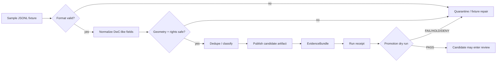

<!-- [KFM_META_BLOCK_V2]
doc_id: kfm://doc/TODO-uuid-for-pipelines-kansas-biodiversity-etl-samples-readme
title: Kansas Biodiversity ETL Samples
type: standard
version: v1
status: draft
owners: TODO-confirm-biodiversity-pipeline-owner
created: TODO-YYYY-MM-DD
updated: 2026-04-25
policy_label: TODO-confirm-policy-label
related: [../README.md, ../normalize/README.md, dwc_occurrences_sample.jsonl]
tags: [kfm, pipeline, biodiversity, samples, darwin-core, jsonl, fixture]
notes: [doc_id, owner, created date, and policy_label need repo-owner verification; this README documents sample fixture rules and does not prove promotion readiness]
[/KFM_META_BLOCK_V2] -->

# Kansas Biodiversity ETL Samples

Sample fixtures for the Kansas Biodiversity ETL lane: small, reviewable Darwin Core-like occurrence records used to test normalization, evidence closure, and fail-closed promotion behavior.

> [!IMPORTANT]
> This directory is for **fixture inputs**, not live source harvesting, public publication, or trusted biodiversity claims. A sample record is useful only when it stays clearly labeled as test material and cannot bypass the KFM truth path.


**Status:** `experimental` / `draft`  
**Owners:** `TODO-confirm-biodiversity-pipeline-owner`  
**Path:** `pipelines/kansas_biodiversity_etl/samples/README.md`  
**Quick jumps:** [Scope](#scope) · [Repo fit](#repo-fit) · [Accepted inputs](#accepted-inputs) · [Exclusions](#exclusions) · [Directory tree](#directory-tree) · [Sample contract](#sample-contract) · [Validation](#validation) · [Definition of done](#definition-of-done) · [Verification backlog](#verification-backlog)

---

## Scope

This directory holds **small, no-network sample inputs** for the Kansas Biodiversity ETL pipeline.

Samples are meant to exercise the first governed path:

```text
SAMPLE FIXTURE -> WORK / QUARANTINE -> PROCESSED CANDIDATE -> EVIDENCEBUNDLE -> RECEIPT -> PROMOTION DRY RUN
```

They are not field truth, not a public occurrence layer, and not evidence of current species presence unless a later release resolves the record through the full KFM evidence and policy system.

### What this directory should prove

A good sample fixture should help maintainers confirm that the pipeline can:

- parse Darwin Core-like occurrence records from JSONL;
- normalize coordinates into `EPSG:4326`;
- preserve source identity, collection identity, license, and attribution fields;
- route invalid or unsafe records to quarantine;
- produce deterministic downstream identity such as `spec_hash`;
- support a no-network dry run of normalize → dedupe → publish → gate behavior;
- demonstrate fail-closed handling before any live GBIF, DwC-A, or collection source is activated.

### What this directory should not imply

A sample fixture does **not** prove that:

- the record is ready for public release;
- exact coordinates are safe to expose;
- the named taxon has legal, conservation, habitat, or range significance;
- a source aggregator is a taxonomic or legal-status authority;
- promotion gates, signatures, source descriptors, or publication workflows have passed.

[Back to top](#kansas-biodiversity-etl-samples)

---

## Repo fit

| Field | Value |
|---|---|
| Target path | `pipelines/kansas_biodiversity_etl/samples/README.md` |
| Directory role | Local fixture/sample input directory for the Kansas Biodiversity ETL lane |
| Upstream | `../README.md` defines the lane-level contract and lifecycle posture |
| Downstream | `../normalize/README.md` and the pipeline’s sample mode should consume JSONL fixtures after validation |
| Current known fixture | `dwc_occurrences_sample.jsonl` |
| Public boundary | No public map, API, Focus Mode, Evidence Drawer, or AI surface may consume this directory directly |
| Lifecycle posture | Fixtures may enter WORK/QUARANTINE for tests; publication still requires EvidenceBundle, receipt, policy, review, and promotion gates |

> [!WARNING]
> Do not point public clients, MapLibre layers, story nodes, Focus Mode, or AI summaries at files in `samples/`. Samples exist to prove behavior before governed publication, not to publish biodiversity knowledge.

[Back to top](#kansas-biodiversity-etl-samples)

---

## Accepted inputs

Inputs belong here only when they are small, deterministic, safe to commit, and useful for no-network tests.

| Input | Accepted when | Required evidence or marker |
|---|---|---|
| Darwin Core-like JSONL occurrence sample | Each non-empty line is one valid JSON object | Fixture purpose, expected parser behavior, source-like fields |
| Synthetic occurrence fixture | Explicitly non-live and safe | `fixture: true` marker or README note in the test plan |
| Public-safe collection/specimen example | Rights and attribution are represented | `institutionCode`, `collectionCode`, `catalogNumber`, `license`, `rightsHolder` |
| Invalid negative fixture | Used to prove quarantine/fail-closed behavior | Expected failure reason such as `missing_license` or `invalid_coordinates` |
| Redaction/geoprivacy fixture | Uses synthetic or generalized location only | Expected transform or block reason |

### Minimum fixture fields

Each positive occurrence sample should include enough information to test source identity, time, geometry, rights, and attribution.

```json
{
  "catalogNumber": "EXAMPLE-0001",
  "scientificName": "Example taxon",
  "eventDate": "2026-04-10",
  "decimalLatitude": "39.0119",
  "decimalLongitude": "-95.6890",
  "coordinateUncertaintyInMeters": "25",
  "institutionCode": "EXAMPLE",
  "collectionCode": "FixtureCollection",
  "basisOfRecord": "PreservedSpecimen",
  "license": "CC0",
  "rightsHolder": "Fixture provider"
}
```

> [!NOTE]
> JSONL files must contain **only JSON objects separated by newlines**. Do not paste Markdown fences, code-drop instructions, prose, or multiple future-file snippets into a `.jsonl` fixture.

[Back to top](#kansas-biodiversity-etl-samples)

---

## Exclusions

These do not belong in this directory.

| Excluded item | Why | Preferred destination |
|---|---|---|
| Live GBIF API output used as production source data | Source activation, retrieval metadata, and rights need intake controls | `../../data/raw/kansas_biodiversity_etl/...` after source-descriptor gate |
| DwC-A archives or large exports | Too large and source-specific for committed samples | RAW lifecycle storage with checksums and source metadata |
| API keys, credentials, tokens, cookies, or private URLs | Secrets must not enter fixtures | Secret manager / deployment configuration |
| Exact sensitive species localities | Public fixture leakage risk | Synthetic generalized fixture or restricted test store |
| Unknown-license records as positive examples | Release rights unresolved | Negative fixture or `../../data/quarantine/...` |
| Taxonomic backbone authority data | Occurrence samples are not taxonomy authority | Taxonomy/source-role registry |
| Habitat suitability examples | Occurrence evidence is not habitat proof | Habitat/fauna/flora relation lane with separate evidence |
| Generated receipts, proof packs, or published outputs | Samples are inputs, not promotion products | `../../data/receipts/`, `../../data/proofs/`, `../../data/published/` according to repo convention |

[Back to top](#kansas-biodiversity-etl-samples)

---

## Directory tree

```text
pipelines/kansas_biodiversity_etl/samples/
├── README.md                    # this file
└── dwc_occurrences_sample.jsonl  # sample Darwin Core-like occurrence fixture; validate before use
```

Recommended future fixture split:

```text
samples/
├── README.md
├── dwc_occurrences_sample.jsonl
├── valid/
│   └── public_safe_occurrence.valid.jsonl
└── invalid/
    ├── missing_license.invalid.jsonl
    ├── invalid_coordinates.invalid.jsonl
    └── sensitive_exact_public.invalid.jsonl
```

> [!TIP]
> Keep positive and negative fixtures small. One or two records per behavior is usually enough for reviewable tests.

[Back to top](#kansas-biodiversity-etl-samples)

---

## Sample contract

A committed sample fixture should be reviewable in three passes.

### 1. Format pass

```text
one line = one JSON object
UTF-8 text
no Markdown fences
no prose lines
no trailing commas
no multiline JSON strings
```

### 2. Field pass

| Field family | Required behavior |
|---|---|
| Source identity | Preserve `institutionCode`, `collectionCode`, `catalogNumber`, and any source record identifier if present |
| Taxon label | Preserve `scientificName` as supplied; do not treat it as final taxonomic authority |
| Event time | Preserve `eventDate`; do not invent missing temporal precision |
| Geometry | Parse `decimalLatitude` and `decimalLongitude`; reject invalid ranges |
| Uncertainty | Preserve `coordinateUncertaintyInMeters` when present |
| Rights | Preserve `license` and `rightsHolder`; fail closed when missing or unknown |
| Basis | Preserve `basisOfRecord` to distinguish specimen, observation, and related record models |

### 3. Safety pass

| Risk | Fixture rule |
|---|---|
| Sensitive exact locality | Use synthetic/generalized examples or negative fixtures only |
| Rights ambiguity | Use as negative fixture unless explicitly testing quarantine |
| Source-role confusion | Do not label aggregators as legal/status/taxonomy authorities |
| False public claim | Include fixture notes that records are test material |
| Downstream leakage | Ensure sample mode writes only governed candidates, evidence, receipts, or failure reports |

[Back to top](#kansas-biodiversity-etl-samples)

---

## Validation

Run these checks before using any sample in the pipeline.

```bash
# From repo root: confirm this file is in a real checkout.
git rev-parse --show-toplevel
git status --short

# Inspect sample files.
find pipelines/kansas_biodiversity_etl/samples -maxdepth 2 -type f | sort

# Confirm every non-empty JSONL line parses as JSON.
python - <<'PY'
from pathlib import Path
import json

sample = Path("pipelines/kansas_biodiversity_etl/samples/dwc_occurrences_sample.jsonl")
for line_no, line in enumerate(sample.read_text(encoding="utf-8").splitlines(), start=1):
    if not line.strip():
        continue
    try:
        value = json.loads(line)
    except json.JSONDecodeError as exc:
        raise SystemExit(f"{sample}:{line_no}: invalid JSONL: {exc}") from exc
    if not isinstance(value, dict):
        raise SystemExit(f"{sample}:{line_no}: expected JSON object")
print(f"PASS: {sample} is JSONL")
PY
```

### Pipeline sample mode

The lane-level Makefile advertises a sample mode, but execution still needs local repo/toolchain verification.

```bash
cd pipelines/kansas_biodiversity_etl
make sample
```

Expected posture:

| Result | Meaning |
|---|---|
| `PASS` | Sample supports no-network dry-run behavior |
| `FAIL` | Format, evidence, rights, hash, or gate condition failed |
| `QUARANTINE` | Sample intentionally exercised invalid, unsafe, or unresolved behavior |
| `ERROR` | Tooling, dependency, or environment failure |

> [!CAUTION]
> Do not fix a failing sample by weakening validation. Samples should make failures easy to inspect, not easy to ignore.

[Back to top](#kansas-biodiversity-etl-samples)

---

## Fixture-to-pipeline flow



This diagram is a fixture-level test flow. It is not a claim that publication is complete.

[Back to top](#kansas-biodiversity-etl-samples)

---

## Definition of done

A sample fixture is ready to keep when all checks below are true.

- [ ] File contains only valid JSONL records.
- [ ] Each positive record includes source identity, taxon label, event date, geometry, uncertainty, basis, license, and rights holder when applicable.
- [ ] Negative records are clearly intentional and have expected failure reasons.
- [ ] No credentials, private URLs, or secrets are present.
- [ ] No exact sensitive locality is committed as a positive public-safe fixture.
- [ ] License and attribution fields are present or intentionally omitted only in invalid fixtures.
- [ ] Normalization can parse the fixture without inventing missing evidence.
- [ ] Invalid records route to quarantine or failure reports instead of being silently dropped.
- [ ] EvidenceBundle and receipt behavior can be exercised in no-network mode.
- [ ] Any fixture change is paired with validator/test updates or an explanation in this README.

[Back to top](#kansas-biodiversity-etl-samples)

---

## Verification backlog

| Item | Status | Why it matters |
|---|---|---|
| Confirm `doc_id` | `NEEDS VERIFICATION` | Required for stable KFM metadata |
| Confirm owner / CODEOWNERS mapping | `NEEDS VERIFICATION` | Samples affect pipeline review behavior |
| Confirm internal `policy_label` vocabulary | `NEEDS VERIFICATION` | Public vs restricted documentation labels must be repo-native |
| Confirm JSONL validity of `dwc_occurrences_sample.jsonl` | `NEEDS VERIFICATION` | Sample mode cannot rely on malformed fixture input |
| Confirm `make sample` runs in the mounted repo | `NEEDS VERIFICATION` | Make target text alone does not prove execution |
| Confirm normalize / dedupe / publish / validate entrypoints | `NEEDS VERIFICATION` | Avoid documenting non-existent scripts as active behavior |
| Confirm fixture storage convention | `UNKNOWN` | Repo may prefer `tests/fixtures/...` or lane-local fixtures |
| Confirm sensitive biodiversity policy | `NEEDS VERIFICATION` | Exact-location handling must fail closed |
| Confirm source-role registry path | `NEEDS VERIFICATION` | Occurrence samples must not become legal/status authority |
| Confirm whether generated reports are committed | `UNKNOWN` | Prevents mixing fixtures, receipts, and proof artifacts |

[Back to top](#kansas-biodiversity-etl-samples)

---

## FAQ

### Can this directory contain real GBIF harvest output?

Not by default. Real harvests need source descriptors, retrieval metadata, rights review, and lifecycle storage. Keep this directory small and fixture-oriented.

### Can a fixture contain exact coordinates?

Only when the record is explicitly public-safe or synthetic and does not expose protected, rare, embargoed, steward-controlled, private, or otherwise sensitive locality information.

### Can sample records be used by the UI?

No. Public UI, Evidence Drawer, Focus Mode, and AI summaries should consume governed APIs or published artifacts only.

### What should happen if the sample file contains Markdown or pasted code-drop content?

Treat it as `NEEDS VERIFICATION`, repair it into JSONL-only fixture content, and rerun the format pass before invoking pipeline sample mode.

[Back to top](#kansas-biodiversity-etl-samples)
