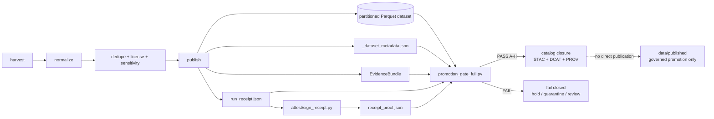

<!-- [KFM_META_BLOCK_V2]
doc_id: kfm://doc/TBD-kansas-biodiversity-etl-validate-readme-uuid
title: Kansas Biodiversity ETL Validation Gate
type: standard
version: v1
status: draft
owners: TODO-confirm-biodiversity-validation-stewards
created: 2026-04-25
updated: 2026-04-25
policy_label: TODO-confirm-public-or-restricted
related: [
  ../README.md,
  ../Makefile,
  ../attest/README.md,
  ../publish/README.md,
  ../../../data/README.md,
  ../../../data/receipts/README.md,
  ../../../data/proofs/README.md,
  ../../../data/catalog/README.md,
  ../../../schemas/README.md,
  ../../../contracts/README.md,
  ../../../policy/README.md,
  ../../../tools/validators/README.md,
  ../../../tools/validators/promotion_gate/README.md
]
tags: [kfm, pipelines, kansas-biodiversity-etl, validation, promotion-gate, evidencebundle, receipts, proofs, geoprivacy]
notes: [
  "Revision of an existing draft README for pipelines/kansas_biodiversity_etl/validate/.",
  "Documents the current proposed promotion_gate_full.py contract: JSONL, single Parquet, partitioned Parquet, metadata spec_hash, EvidenceBundle, and optional receipt proof enforcement.",
  "Branch-local implementation, exact owners, policy label, CI wiring, and schema homes remain NEEDS VERIFICATION."
]
[/KFM_META_BLOCK_V2] -->

<a id="top"></a>

# Kansas Biodiversity ETL Validation Gate

Fail-closed validation membrane for Kansas biodiversity ETL candidates before catalog closure, publication, API use, map rendering, export, or Focus Mode synthesis.

<div align="left">


</div>

| Impact field | Value |
| --- | --- |
| **Status** | `experimental` |
| **Owners** | `TODO-confirm-biodiversity-validation-stewards` |
| **Path** | `pipelines/kansas_biodiversity_etl/validate/README.md` |
| **Primary gate** | `promotion_gate_full.py` |
| **Current gate set** | A–H: EvidenceBundle, dataset, metadata, `spec_hash`, license, attribution, sensitivity, receipt proof |
| **Quick jumps** | [Scope](#scope) · [Repo fit](#repo-fit) · [Accepted inputs](#accepted-inputs) · [Exclusions](#exclusions) · [Directory tree](#directory-tree) · [Quickstart](#quickstart) · [Usage](#usage) · [Validation matrix](#validation-matrix) · [Diagram](#diagram) · [Failure reasons](#failure-reasons) · [Definition of done](#definition-of-done) · [FAQ](#faq) |

> [!IMPORTANT]
> `validate/` decides whether a generated Kansas biodiversity ETL candidate may continue through governed promotion. It does **not** harvest, normalize, dedupe, publish, repair, catalog, release, or make biological claims on its own.

> [!WARNING]
> Sensitive occurrence geometry, unknown rights, unresolved evidence, and receipt/proof mismatches are promotion blockers. The correct default is fail closed.

---

## Scope

This directory is the lane-local validation membrane for `pipelines/kansas_biodiversity_etl/`.

The current primary validator is:

```text
pipelines/kansas_biodiversity_etl/validate/promotion_gate_full.py
```

It validates a generated ETL candidate after publishing and local proof creation:

```text
harvest -> normalize -> dedupe -> publish -> sign -> gate -> catalog
```

### What this lane validates

| Gate | Check | Blocks when |
| --- | --- | --- |
| **A** | EvidenceBundle exists and parses | missing or invalid EvidenceBundle |
| **B** | dataset exists | missing dataset root or file |
| **C** | dataset metadata exists when required | missing or invalid `_dataset_metadata.json` |
| **D** | `spec_hash` agrees across metadata and EvidenceBundle | hash mismatch or missing hash |
| **E** | license posture is valid | missing or `UNKNOWN` license |
| **F** | attribution is present when required | missing attribution for attribution-bearing records |
| **G** | sensitivity is enforced | restricted records retain geometry |
| **H** | receipt proof verifies | missing receipt/proof, invalid proof, or receipt hash mismatch |

### Supported dataset shapes

| Dataset shape | Status | Identity source |
| --- | --- | --- |
| JSONL thin slice | supported | file byte hash |
| single Parquet file | supported | `_dataset_metadata.json` |
| partitioned Parquet directory | supported | `_dataset_metadata.json` |

> [!NOTE]
> Partitioned Parquet validation expects a dataset directory containing one or more `*.parquet` files and a metadata file that carries the canonical `spec_hash`.

[Back to top](#top)

---

## Repo fit

`validate/` sits inside the Kansas biodiversity ETL pipeline lane. It should stay execution-near and lane-specific while shared law remains in contracts, schemas, policy, and shared validator surfaces.

| Relation | Surface | Role | Status |
| --- | --- | --- | --- |
| Parent lane | [`../README.md`](../README.md) | ETL stage ordering and governance posture | NEEDS VERIFICATION |
| Makefile | [`../Makefile`](../Makefile) | wires harvest → normalize → dedupe → publish → sign → gate → catalog | PROPOSED / NEEDS VERIFICATION |
| Attestation helpers | [`../attest/README.md`](../attest/README.md) | local receipt proof creation and verification | PROPOSED / NEEDS VERIFICATION |
| Publisher | [`../publish/`](../publish/) | emits dataset, metadata, EvidenceBundle, and receipt | PROPOSED / NEEDS VERIFICATION |
| Receipts | [`../../../data/receipts/README.md`](../../../data/receipts/README.md) | run/process memory | CONFIRMED doctrine / path NEEDS VERIFICATION |
| Proofs | [`../../../data/proofs/README.md`](../../../data/proofs/README.md) | durable proof artifacts | CONFIRMED doctrine / path NEEDS VERIFICATION |
| Catalog | [`../../../data/catalog/README.md`](../../../data/catalog/README.md) | STAC/DCAT/PROV closure | CONFIRMED doctrine / path NEEDS VERIFICATION |
| Shared validators | [`../../../tools/validators/README.md`](../../../tools/validators/README.md) | reusable validation posture | CONFIRMED doctrine / path NEEDS VERIFICATION |
| Promotion gate | [`../../../tools/validators/promotion_gate/README.md`](../../../tools/validators/promotion_gate/README.md) | repo-wide promotion gate doctrine | CONFIRMED doctrine / path NEEDS VERIFICATION |
| Schemas/contracts | [`../../../schemas/README.md`](../../../schemas/README.md), [`../../../contracts/README.md`](../../../contracts/README.md) | object shape and semantic law | NEEDS VERIFICATION |
| Policy | [`../../../policy/README.md`](../../../policy/README.md) | rights, sensitivity, public release rules | NEEDS VERIFICATION |

### Boundary rule

```text
validate/ may read generated artifacts and fail closed.
validate/ must not mutate publication state.
```

[Back to top](#top)

---

## Accepted inputs

Material belongs here when it is already generated by the Kansas biodiversity ETL or is a public-safe validation fixture.

| Input | Example | Required posture |
| --- | --- | --- |
| dataset candidate | `data/processed/kansas_occurrences/` | generated by publisher; not manually edited |
| dataset metadata | `data/processed/kansas_occurrences/_dataset_metadata.json` | includes canonical `spec_hash` and record count |
| EvidenceBundle | `data/proofs/kansas_biodiversity_etl/YYYYMMDD/evidence_bundle.json` | includes source URIs, item count, license, attribution, obligations |
| run receipt | `data/receipts/kansas_biodiversity_etl/YYYYMMDD/run_receipt.json` | generated by publisher |
| local receipt proof | `data/proofs/kansas_biodiversity_etl/YYYYMMDD/receipt_proof.json` | generated by attestation helper |
| synthetic fixtures | valid/invalid no-network examples | must avoid real sensitive exact locations |
| validator config | lane-local profile or reason-code map | must not become policy source of truth |

### Required CLI inputs for the current full gate

```bash
python validate/promotion_gate_full.py \
  --dataset ../../data/processed/kansas_occurrences \
  --metadata ../../data/processed/kansas_occurrences/_dataset_metadata.json \
  --evidence ../../data/proofs/kansas_biodiversity_etl/20260425/evidence_bundle.json \
  --receipt ../../data/receipts/kansas_biodiversity_etl/20260425/run_receipt.json \
  --proof ../../data/proofs/kansas_biodiversity_etl/20260425/receipt_proof.json
```

[Back to top](#top)

---

## Exclusions

| Does **not** belong here | Better home | Why |
| --- | --- | --- |
| raw biodiversity exports | `../../../data/raw/` | validator does not own raw custody |
| intermediate work products | `../../../data/work/` | validator consumes candidates, not scratch state |
| quarantine payloads | `../../../data/quarantine/` | failures route there; docs should not leak them |
| canonical schemas | `../../../schemas/` or `../../../contracts/` | validators enforce law; they should not define parallel law |
| policy bundles | `../../../policy/` | rights and sensitivity law must remain explicit |
| durable proof storage | `../../../data/proofs/` | proofs are artifacts, not local validator files |
| run receipts | `../../../data/receipts/` | receipts are process memory |
| STAC/DCAT/PROV emitters | `../catalog/` and `../../../data/catalog/` | catalog closure is separate |
| publication aliases | `../../../data/published/` | validation is not publication |
| secrets or signing keys | secret manager / ignored local config | never commit trust-root material |
| AI-generated biodiversity claims | governed runtime / Focus surfaces | validators check artifacts, not narrative claims |

[Back to top](#top)

---

## Directory tree

> [!NOTE]
> This tree documents the intended local shape. Treat exact branch inventory as **NEEDS VERIFICATION** until checked.

```text
pipelines/kansas_biodiversity_etl/
├── README.md
├── Makefile
├── attest/
│   ├── sign_receipt.py                 # PROPOSED / NEEDS VERIFICATION
│   └── verify_receipt_proof.py         # PROPOSED / NEEDS VERIFICATION
├── publish/
│   └── publish.py                      # PROPOSED / NEEDS VERIFICATION
├── validate/
│   ├── README.md
│   └── promotion_gate_full.py          # PROPOSED / NEEDS VERIFICATION
└── catalog/
    └── emit_catalog.py                 # PROPOSED / NEEDS VERIFICATION
```

Expected output paths validated by the gate:

```text
data/
├── processed/
│   └── kansas_occurrences/
│       ├── _dataset_metadata.json
│       └── year=YYYY/
│           └── month=MM/
│               └── part-000.parquet
├── proofs/
│   └── kansas_biodiversity_etl/
│       └── YYYYMMDD/
│           ├── evidence_bundle.json
│           └── receipt_proof.json
└── receipts/
    └── kansas_biodiversity_etl/
        └── YYYYMMDD/
            └── run_receipt.json
```

[Back to top](#top)

---

## Quickstart

Run from:

```text
pipelines/kansas_biodiversity_etl/
```

### Full governed run

```bash
make clean
make all
```

Expected final gate output shape:

```json
{
  "decision": "PASS",
  "gates": ["A", "B", "C", "D", "E", "F", "G", "H"]
}
```

### Gate only

```bash
make gate
```

Expected Makefile target:

```makefile
gate:
	@echo "=== Promotion Gate (fail-closed) ==="
	python validate/promotion_gate_full.py \
		--dataset $(DATASET_ROOT) \
		--metadata $(METADATA) \
		--evidence $(EVIDENCE) \
		--receipt $(RECEIPT) \
		--proof $(PROOF)
```

### Offline sample mode

```bash
make sample
```

> [!CAUTION]
> Sample mode should remain fixture-safe. Do not use real sensitive occurrence coordinates in public fixtures.

[Back to top](#top)

---

## Usage

### `promotion_gate_full.py`

The gate accepts generated artifacts and returns one compact JSON decision.

```bash
python validate/promotion_gate_full.py \
  --dataset <dataset-file-or-directory> \
  --metadata <_dataset_metadata.json> \
  --evidence <evidence_bundle.json> \
  --receipt <run_receipt.json> \
  --proof <receipt_proof.json>
```

### Arguments

| Argument | Required | Meaning |
| --- | --- | --- |
| `--dataset` | yes | JSONL file, Parquet file, or partitioned Parquet dataset directory |
| `--evidence` | yes | EvidenceBundle JSON sidecar |
| `--metadata` | required for Parquet / recommended always | dataset metadata containing canonical `spec_hash` |
| `--receipt` | required when `--proof` is supplied | run receipt to verify |
| `--proof` | recommended / enforced by Makefile | local receipt proof object |

### Gate behavior

| Behavior | Rule |
| --- | --- |
| JSONL identity | hash JSONL file bytes |
| Parquet identity | read `spec_hash` from metadata |
| partitioned Parquet | recursively load `*.parquet` files |
| EvidenceBundle count | must match loaded record count |
| metadata count | must match loaded record count when present |
| proof verification | required when `--proof` is supplied |
| failure posture | first violation returns `{"decision":"FAIL","reason":"..."}` |

[Back to top](#top)

---

## Validation matrix

| Gate | Validator concern | Primary artifact | Failure examples |
| --- | --- | --- | --- |
| A | EvidenceBundle presence and JSON validity | `evidence_bundle.json` | `evidencebundle_missing`, `invalid_evidencebundle_json` |
| B | dataset presence | `data/processed/kansas_occurrences/` | `dataset_missing` |
| C | metadata presence and parseability | `_dataset_metadata.json` | `missing_dataset_metadata`, `invalid_dataset_metadata_json` |
| D | identity consistency | metadata + EvidenceBundle | `metadata_missing_spec_hash`, `evidencebundle_missing_spec_hash`, `spec_hash_mismatch` |
| E | license validity | dataset records + EvidenceBundle | `missing_license_in_dataset`, `unknown_license_in_dataset`, `missing_evidencebundle_license` |
| F | attribution completeness | dataset records + EvidenceBundle | `missing_required_attribution`, `missing_evidencebundle_attribution` |
| G | sensitivity enforcement | dataset records | `restricted_record_contains_geometry` |
| H | receipt proof binding | `run_receipt.json` + `receipt_proof.json` | `receipt_missing`, `proof_missing`, `invalid_proof_json`, `receipt_proof_hash_mismatch` |

### Source-role hierarchy to preserve

| Source family | Validation posture |
| --- | --- |
| Kansas state conservation/legal-status source | May support Kansas-specific status claims only when descriptor and authority scope are verified. |
| Federal listed-species / critical-habitat source | May support federal status or critical-habitat claims only within its declared scope. |
| Controlled heritage / NatureServe-like source | Sensitive by default; exact occurrence release requires steward authorization. |
| Occurrence aggregator | Corroborative occurrence evidence, not legal authority; requires record-level rights and geoprivacy checks. |
| Community-science source | Occurrence/monitoring signal only; requires bias, precision, rights, and review context. |
| Habitat / land-cover surface | Habitat context or derived join support; not proof of species presence. |
| Synthetic fixture | Test evidence only; never treated as public biological source authority. |

[Back to top](#top)

---

## Diagram



[Back to top](#top)

---

## Failure reasons

### Artifact and JSON failures

| Reason | Meaning |
| --- | --- |
| `dataset_missing` | `--dataset` path does not exist |
| `evidencebundle_missing` | `--evidence` path does not exist |
| `invalid_evidencebundle_json` | EvidenceBundle cannot be parsed or lacks expected root |
| `missing_dataset_metadata` | Parquet identity metadata was not found |
| `invalid_dataset_metadata_json` | metadata JSON cannot be parsed |
| `unsupported_dataset_format:<suffix>` | dataset path is neither JSONL, Parquet, nor directory |
| `dataset_read_failed` | dataset could not be loaded |
| `no_parquet_files_found` | dataset directory contains no Parquet partitions |
| `pyarrow_missing_for_parquet_validation` | Parquet validation dependency is unavailable |

### Identity and count failures

| Reason | Meaning |
| --- | --- |
| `metadata_missing_spec_hash` | metadata lacks `spec_hash` |
| `evidencebundle_missing_spec_hash` | EvidenceBundle lacks `spec_hash` |
| `spec_hash_mismatch` | EvidenceBundle and metadata identity disagree |
| `empty_evidencebundle_items` | EvidenceBundle item count is zero or missing |
| `empty_dataset` | loaded dataset contains no records |
| `item_count_mismatch` | EvidenceBundle count does not match loaded records |
| `metadata_record_count_mismatch` | metadata count does not match loaded records |

### Governance failures

| Reason | Meaning |
| --- | --- |
| `missing_source_uris` | EvidenceBundle has no source URI list |
| `missing_evidencebundle_license` | EvidenceBundle lacks license summary |
| `missing_evidencebundle_attribution` | EvidenceBundle lacks attribution summary |
| `missing_license_in_dataset` | record lacks license |
| `unknown_license_in_dataset` | record license is explicitly unknown |
| `missing_required_attribution` | attribution-bearing record lacks attribution |
| `duplicate_primary_key_detected` | duplicate `institution_code|id` key remains |
| `restricted_record_contains_geometry` | restricted record still has geometry |

### Receipt proof failures

| Reason | Meaning |
| --- | --- |
| `receipt_required_when_proof_supplied` | `--proof` was supplied without `--receipt` |
| `receipt_missing` | receipt path does not exist |
| `proof_missing` | proof path does not exist |
| `invalid_proof_json` | proof cannot be parsed |
| `proof_missing_receipt_hash` | proof lacks `receipt_hash` |
| `receipt_proof_hash_mismatch` | receipt bytes changed after proof creation |

[Back to top](#top)

---

## Definition of done

A validation change is not done until it is reviewable, reproducible, and fail-closed.

- [ ] Branch-local `promotion_gate_full.py` path is verified.
- [ ] `Makefile` passes `--dataset`, `--metadata`, `--evidence`, `--receipt`, and `--proof`.
- [ ] Valid fixture or sample run passes through Gates A–H.
- [ ] Missing EvidenceBundle fails.
- [ ] Missing metadata fails for Parquet.
- [ ] Broken `spec_hash` fails.
- [ ] Unknown or missing license fails.
- [ ] Missing required attribution fails.
- [ ] Duplicate primary key fails.
- [ ] Restricted record with geometry fails.
- [ ] Missing receipt/proof fails when proof enforcement is enabled.
- [ ] Receipt modified after proof creation fails.
- [ ] No validator writes to `data/published/`.
- [ ] No ordinary validation step requires secrets.
- [ ] Sensitive exact geometry is not added to public fixtures.
- [ ] Documentation and Makefile examples match the active code.

[Back to top](#top)

---

## FAQ

### Is this the publication gate?

No. This is a validation gate. Publication remains a governed state transition outside this directory.

### Why does Parquet use metadata for `spec_hash`?

Parquet bytes can change when compression, writer version, or partition layout changes. KFM dataset identity is anchored to canonical record content, so Parquet validation reads `spec_hash` from `_dataset_metadata.json`.

### Does Gate H replace cosign or DSSE?

No. Gate H verifies the local receipt hash proof. It is useful for the thin slice but remains weaker than release-grade DSSE/cosign attestation.

### Can the gate repair records?

No. Repair belongs upstream. The gate reports deterministic failure reasons and blocks promotion.

### Can catalog files be emitted before the gate passes?

Catalog emitters may generate drafts, but catalog closure should not be treated as promotion unless the gate passes and the governed promotion path accepts the candidate.

### Why keep negative tests?

Because biodiversity data has rights, sensitivity, taxonomy, and geoprivacy risk. A happy-path-only validator would not be a trustworthy KFM gate.

[Back to top](#top)

---

<details>
<summary>Appendix A — Example PASS output</summary>

```json
{
  "decision": "PASS",
  "dataset": "../../data/processed/kansas_occurrences",
  "evidence": "../../data/proofs/kansas_biodiversity_etl/20260425/evidence_bundle.json",
  "metadata": "../../data/processed/kansas_occurrences/_dataset_metadata.json",
  "proof": "../../data/proofs/kansas_biodiversity_etl/20260425/receipt_proof.json",
  "receipt": "../../data/receipts/kansas_biodiversity_etl/20260425/run_receipt.json",
  "records": 1000,
  "spec_hash": "sha256:...",
  "gates": ["A", "B", "C", "D", "E", "F", "G", "H"]
}
```

</details>

<details>
<summary>Appendix B — Reviewer checklist</summary>

- [ ] This README does not claim workflow enforcement that was not verified.
- [ ] All uncertain file presence is marked `NEEDS VERIFICATION`.
- [ ] Public examples avoid sensitive exact coordinates.
- [ ] Gate output examples are illustrative unless copied from a real run.
- [ ] `validate/` is not described as a publication or repair lane.
- [ ] Shared law is linked outward instead of duplicated loosely.
- [ ] The distinction between EvidenceBundle, receipt, proof, catalog, and publication is visible.

</details>
