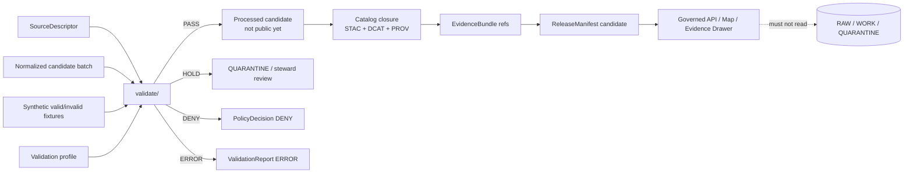

<!-- [KFM_META_BLOCK_V2]
doc_id: kfm://doc/TBD-kansas-biodiversity-etl-validate-readme-uuid
title: pipelines/kansas_biodiversity_etl/validate/ README
type: standard
version: v1
status: draft
owners: TODO-confirm-biodiversity-validation-stewards
created: 2026-04-25
updated: 2026-04-25
policy_label: TODO-confirm-public-or-restricted
related: [../README.md, ../../README.md, ../../../README.md, ../../../data/README.md, ../../../data/registry/README.md, ../../../data/catalog/stac/README.md, ../../../schemas/README.md, ../../../contracts/README.md, ../../../policy/README.md, ../../../tests/README.md]
tags: [kfm, pipelines, kansas-biodiversity-etl, validation, biodiversity, geoprivacy, evidence]
notes: [Generated as a review-ready draft for the requested path. Branch-local file presence, owners, policy label, CLI names, schema home, and related-link validity NEED VERIFICATION.]
[/KFM_META_BLOCK_V2] -->

<a id="top"></a>

# `pipelines/kansas_biodiversity_etl/validate/`

Validation gate for Kansas biodiversity ETL candidates before catalog, release, API, map, export, or Focus Mode use.

| Field | Value |
| --- | --- |
| **Status** | Experimental / draft |
| **Owners** | `TODO-confirm-biodiversity-validation-stewards` |
| **Path** | `pipelines/kansas_biodiversity_etl/validate/README.md` |
| **Badges** |      |
| **Quick jumps** | [Scope](#scope) · [Repo fit](#repo-fit) · [Accepted inputs](#accepted-inputs) · [Exclusions](#exclusions) · [Directory tree](#directory-tree) · [Quickstart](#quickstart) · [Usage](#usage) · [Validation matrix](#validation-matrix) · [Diagram](#diagram) · [Definition of done](#definition-of-done) · [FAQ](#faq) |
| **Accepted inputs** | Source descriptors, normalized candidate batches, synthetic fixtures, public-safe payload candidates, derivation receipts, catalog drafts, and validation profiles. |
| **Exclusions** | Live credentials, raw source dumps, canonical schema law, policy source-of-truth files, release aliases, public publication actions, and AI-generated claims. |
| **Truth boundary** | `CONFIRMED` requested target path; branch-local implementation, CLI names, workflow wiring, and current file inventory are `NEEDS VERIFICATION`. |

> [!IMPORTANT]
> `validate/` decides whether a biodiversity candidate can move forward. It does **not** publish, promote, repair, summarize, or make species claims on its own.

> [!WARNING]
> Exact rare-species, protected-species, steward-controlled, embargoed, or otherwise sensitive occurrence geometry is denied by default for public outputs unless a reviewed policy explicitly allows the release class.

---

## Scope

This directory is the lane-local validation membrane for `kansas_biodiversity_etl`.

It should help maintainers answer five review questions quickly:

1. Does each candidate record have admissible source identity, rights posture, and source-role scope?
2. Are taxonomy, geometry, time, sensitivity, and evidence references valid enough to continue?
3. Are public payloads free of restricted coordinates, private source fields, and reverse-engineering leakage?
4. Do catalog and release candidates close against STAC/DCAT/PROV-style provenance, evidence, checksums, and review state?
5. Can failures be routed to `HOLD`, `DENY`, `ERROR`, or quarantine without silently inventing truth?

### What this lane validates

| Validation concern | Why it matters in KFM |
| --- | --- |
| **Source role** | A status authority, occurrence aggregator, habitat surface, and controlled-access heritage record are not interchangeable evidence. |
| **Rights and sensitivity** | Unknown rights or sensitive exact location exposure blocks public promotion. |
| **Taxonomy** | Ambiguous or unresolved scientific names must not silently merge into canonical taxon identity. |
| **Geometry and time** | Coordinates, CRS, support, uncertainty, event date, source freshness, and publication date must remain distinct. |
| **Evidence closure** | Every consequential candidate claim must resolve to evidence, not just a fluent label or map popup. |
| **Catalog/proof closure** | STAC/DCAT/PROV, `EvidenceBundle`, `ReleaseManifest`, and digest references must close before release-facing use. |
| **Public payload safety** | Public API, map, Focus Mode, and export payloads must not expose restricted fields or exact sensitive geometry. |

### Truth labels used here

| Label | Meaning |
| --- | --- |
| **CONFIRMED** | Verified from the checked branch, current command output, or controlling KFM doctrine. |
| **INFERRED** | Conservative placement or relationship derived from adjacent repo/doc conventions. |
| **PROPOSED** | Recommended realization not yet verified in branch-local implementation. |
| **UNKNOWN** | Not proven strongly enough to state as current repo fact. |
| **NEEDS VERIFICATION** | Must be checked against the mounted repo, policy/schema home, source terms, or CI before merge. |

[Back to top](#top)

---

## Repo fit

`validate/` sits inside a pipeline lane. It should stay execution-near and lane-specific, while shared law remains outside this directory.

| Relation | Surface | Status | Use it for |
| --- | --- | --- | --- |
| Parent lane | [`../README.md`](../README.md) | NEEDS VERIFICATION | Biodiversity ETL lane overview and stage ordering. |
| Pipeline root | [`../../README.md`](../../README.md) | INFERRED | Pipeline-family placement, execution boundaries, and lane-local conventions. |
| Repo root | [`../../../README.md`](../../../README.md) | NEEDS VERIFICATION | Project identity, contribution posture, and high-level navigation. |
| Data lifecycle | [`../../../data/README.md`](../../../data/README.md) | NEEDS VERIFICATION | RAW / WORK / QUARANTINE / PROCESSED / CATALOG / PUBLISHED placement. |
| Source registry | [`../../../data/registry/README.md`](../../../data/registry/README.md) | NEEDS VERIFICATION | Source descriptors, source roles, cadence, rights, and authority scope. |
| Catalog closure | [`../../../data/catalog/stac/README.md`](../../../data/catalog/stac/README.md) | NEEDS VERIFICATION | STAC-facing metadata and release-candidate catalog checks. |
| Shared schemas | [`../../../schemas/README.md`](../../../schemas/README.md) | NEEDS VERIFICATION | JSON/YAML schema law and schema-home decisions. |
| Shared contracts | [`../../../contracts/README.md`](../../../contracts/README.md) | NEEDS VERIFICATION | Envelopes, proof objects, runtime payloads, and interface contracts. |
| Policy | [`../../../policy/README.md`](../../../policy/README.md) | NEEDS VERIFICATION | Default-deny, rights, sensitivity, source-role, and publication policy. |
| Tests | [`../../../tests/README.md`](../../../tests/README.md) | NEEDS VERIFICATION | Valid/invalid fixtures, negative cases, no-network CI posture. |

### Upstream / downstream boundary

```text
source descriptors + normalized candidates + fixtures
  -> pipelines/kansas_biodiversity_etl/validate/
  -> validation reports + policy decisions + quarantine reasons
  -> processed/catalog/release-candidate surfaces after promotion gates
```

`validate/` may emit a reviewable `ValidationReport`, `PolicyDecision`, and receipt references. It must not move release aliases, mutate public catalog state, or expose public map/API payloads directly.

[Back to top](#top)

---

## Accepted inputs

Material belongs here when it is specific to validating the Kansas biodiversity ETL lane.

| Input class | Examples | Required posture |
| --- | --- | --- |
| Source descriptors | KDWP-like state status source, USFWS-like federal status/critical habitat source, controlled heritage source, GBIF-like occurrence source | Descriptor must name `source_role`, `authority_scope`, rights, cadence, steward/review state, and sensitivity posture. |
| Normalized candidates | Taxon records, occurrence records, habitat-context joins, range/status summaries | Must be downstream of ingest/normalize and must carry source refs and hashes. |
| Synthetic fixtures | Public-safe occurrence fixture, sensitive exact-location negative fixture, unknown-rights fixture | Fixture-only unless explicitly promoted through governed source intake. |
| Validation profiles | Stage-specific config for source-role, taxonomy, geometry, sensitivity, catalog, and payload checks | Profiles are lane-local settings, not policy source of truth. |
| Public payload candidates | Candidate map popup, Evidence Drawer payload, API envelope, layer manifest | Must be checked for restricted fields, evidence refs, and finite outcomes. |
| Catalog drafts | STAC Item/Collection, DCAT dataset/distribution, PROV activity/entity draft | Must close to evidence, source descriptors, receipts, and digests. |
| Prior validation output | Earlier report, denial, hold reason, compatibility map | Must support regression checks and correction lineage. |

[Back to top](#top)

---

## Exclusions

| Does **not** belong here | Better home | Why |
| --- | --- | --- |
| Raw biodiversity source exports | `../../../data/raw/` or repo-confirmed raw source home | Raw data must stay in lifecycle storage, not validator docs. |
| Sensitive exact coordinates or restricted source payloads | Restricted storage approved by policy/steward process | README and public validation fixtures must not leak protected locations. |
| Canonical schemas | `../../../schemas/` or `../../../contracts/` | Validators enforce schema law; they should not define parallel law. |
| Policy bundles and allow/deny logic | `../../../policy/` | Policy must stay explicit and independently testable. |
| Live credentials, tokens, cookies, API keys, or workstation overrides | Secret manager / untracked local config | Validation directories must never become secret stores. |
| Catalog publication or release alias changes | Catalog/release/promotion surfaces | Validation can recommend; promotion is a governed state transition. |
| AI prompt templates that make biodiversity claims | Governed AI / Focus Mode surfaces | AI may summarize only released, policy-safe EvidenceBundles. |
| Generic biodiversity essays | `../../../docs/domains/` or repo-confirmed domain docs | This directory is execution-facing, not the domain manual. |

[Back to top](#top)

---

## Directory tree

> [!NOTE]
> The tree below is a target/checklist shape for this validation surface. Treat it as `NEEDS VERIFICATION` until branch-local files are inspected.

```text
pipelines/kansas_biodiversity_etl/
├── README.md
├── ingest/
├── normalize/
├── validate/
│   ├── README.md
│   ├── config/
│   │   ├── validation_profile.yaml          # PROPOSED: lane-local validator profile
│   │   └── reason_codes.yaml                # PROPOSED: stable validation reason codes
│   ├── fixtures/
│   │   ├── valid/
│   │   │   └── public_safe_occurrence.json  # PROPOSED: no sensitive exact geometry
│   │   └── invalid/
│   │       ├── sensitive_exact_public.json  # PROPOSED: must DENY/HOLD
│   │       ├── unknown_rights.json          # PROPOSED: must HOLD/DENY
│   │       └── unresolved_taxon.json        # PROPOSED: must HOLD/ABSTAIN
│   ├── reports/
│   │   └── .gitkeep                         # PROPOSED: local generated reports ignored or documented
│   └── scripts/
│       └── validate_biodiversity_candidates.py  # PROPOSED unless repo uses another CLI
└── catalog/
```

### Placement rule

Keep only lane-local validation support here. Move shared schemas, policy gates, reusable validators, and proof-object definitions to their repo-confirmed shared homes.

[Back to top](#top)

---

## Quickstart

### 1. Inspect the branch-local surface

Run these from the repo root before changing validator behavior.

```bash
git status --short

find pipelines/kansas_biodiversity_etl/validate -maxdepth 4 -type f | sort

find tests -maxdepth 5 -type f 2>/dev/null \
  | grep -E 'biodiversity|fauna|flora|habitat|geoprivacy|taxonomy' \
  || true

find schemas contracts policy data/registry -maxdepth 5 -type f 2>/dev/null \
  | grep -E 'biodiversity|fauna|flora|habitat|species|taxon|occurrence|sensitivity' \
  || true
```

### 2. Run the no-network fixture suite

> [!CAUTION]
> The exact command is `NEEDS VERIFICATION`. Use the branch-confirmed make target, test runner, or validator CLI. Do not add live-source network calls to ordinary PR validation.

```bash
# PSEUDOCODE — replace with the repo-confirmed validator entrypoint.
<validator-command> \
  --profile pipelines/kansas_biodiversity_etl/validate/config/validation_profile.yaml \
  --input tests/fixtures/biodiversity/valid/public_safe_occurrence.json \
  --report build/biodiversity/validation_report.json \
  --no-network
```

### 3. Confirm invalid fixtures fail closed

```bash
# PSEUDOCODE — invalid fixtures should produce HOLD, DENY, or ERROR with reason codes.
<validator-command> \
  --profile pipelines/kansas_biodiversity_etl/validate/config/validation_profile.yaml \
  --input tests/fixtures/biodiversity/invalid/sensitive_exact_public.json \
  --expect DENY \
  --no-network
```

[Back to top](#top)

---

## Usage

### Modes

| Mode | Purpose | Network posture | Merge posture |
| --- | --- | --- | --- |
| **Fixture mode** | Validate positive/negative fixtures and reason codes. | No network. | Should be merge-blocking once wired. |
| **Candidate mode** | Validate normalized candidate batches from ingest/normalize. | No network unless explicitly approved. | Blocks promotion when invalid. |
| **Review mode** | Emit reviewer-facing summaries from validation reports. | No network. | Supports steward review; does not publish. |
| **Source-probe mode** | Check external endpoint shape, rights, cadence, or drift. | Opt-in only. | Never required for ordinary PRs unless credentials and source policy are governed. |

### Outcome grammar

| Outcome | Meaning | Required next step |
| --- | --- | --- |
| `PASS` | Candidate satisfies configured validation checks for the current stage. | Continue to the next governed stage; do not publish automatically. |
| `HOLD` | Candidate may be fixable or needs steward/source review. | Route to quarantine/review with reason codes. |
| `DENY` | Policy or public-safety rule forbids the candidate or payload. | Do not promote; emit denial evidence. |
| `ERROR` | Validator infrastructure failed or input shape prevented a decision. | Block; repair validator/input before retrying. |

Runtime surfaces may later translate release-safe results into `ANSWER`, `ABSTAIN`, `DENY`, or `ERROR`, but this validator should not emit fluent public answers.

[Back to top](#top)

---

## Validation matrix

| Validator family | Required checks | Blocks when | Expected output |
| --- | --- | --- | --- |
| Source registry | `source_id`, `source_role`, `authority_scope`, rights, cadence, steward/review status | Unknown rights, unknown role, missing authority scope, live connector not verified | `ValidationReport` + source-role reason codes |
| Taxonomy | Scientific name normalization, rank, authority mapping, synonym handling, ambiguity classification | Ambiguous/unresolved taxon, silent merge, missing migration mapping | Taxon resolution receipt or `HOLD` |
| Occurrence geometry | Geometry validity, CRS, coordinate uncertainty, spatial support, event date, source freshness | Invalid geometry, unknown CRS, unsupported precision, event/publication date collapse | Geometry validation section |
| Sensitivity / geoprivacy | Sensitive class, steward override, embargo, coordinate generalization, redaction receipt | Exact sensitive geometry in public payload, missing redaction receipt, ignored geoprivacy flag | Redaction receipt + public support class |
| Rights | License, attribution, redistribution, source-specific terms, record-level rights | Unknown rights requested for public promotion | Rights block reason |
| Evidence refs | Candidate claims resolve to source refs and EvidenceBundle refs | Dangling refs, missing evidence, uncited consequential claim | Evidence closure report |
| Catalog closure | STAC/DCAT/PROV, digest alignment, source refs, generated-by activity | Missing PROV, mismatched checksums, incomplete catalog matrix | Catalog validation report |
| Public payload | Field allowlist, no `restricted_geometry_ref`, no private source fields, finite runtime envelope | Restricted fields, source-private data, raw/work/quarantine refs | Payload safety report |
| Continuity | Prior IDs, aliases, release refs, rollback refs, compatibility maps | Destructive rename or schema churn without mapping/tests/docs/rollback | Continuity report |

### Source-role hierarchy to preserve

| Source family | Validation posture |
| --- | --- |
| Kansas state conservation/legal-status source | May support Kansas-specific status claims only when descriptor and authority scope are verified. |
| Federal listed-species / critical-habitat source | May support federal status or critical-habitat claims only within its declared scope. |
| Controlled heritage / NatureServe-like source | Sensitive by default; exact occurrence release requires steward authorization. |
| Occurrence aggregator | Corroborative occurrence evidence, not legal authority. Requires record-level rights and geoprivacy checks. |
| Community-science source | Occurrence/monitoring signal only; requires bias, precision, rights, and review context. |
| Habitat / land-cover surface | Habitat context or derived join support; not proof of species presence. |
| Synthetic fixture | Test evidence only; never treated as public biological source authority. |

[Back to top](#top)

---

## Diagram



[Back to top](#top)

---

## Definition of done

A validation change is not done until it is reviewable, reproducible, and fail-closed.

- [ ] Branch-local path and adjacent links are verified.
- [ ] Owners and policy label are confirmed.
- [ ] Valid fixtures pass without network calls.
- [ ] Invalid fixtures fail with stable reason codes.
- [ ] Unknown rights block public promotion.
- [ ] Unknown source role cannot be used as authority.
- [ ] Ambiguous or unresolved taxon does not silently merge.
- [ ] Sensitive exact geometry cannot appear in public payloads.
- [ ] Redaction/generalization emits a receipt with before/after hashes.
- [ ] Public payload field allowlist is enforced.
- [ ] Evidence refs resolve or candidate is held/denied.
- [ ] STAC/DCAT/PROV closure is checked when catalog drafts are present.
- [ ] Runtime-facing candidates use finite outcome grammar.
- [ ] No validator writes public release aliases.
- [ ] No ordinary PR validation requires live source credentials.
- [ ] Rollback/correction references are present for release-bearing candidates.
- [ ] Documentation, fixtures, and tests change together when behavior changes.

[Back to top](#top)

---

## Failure patterns this lane should catch

| Pattern | Correct response |
| --- | --- |
| A GBIF-like occurrence is used as Kansas legal-status authority. | `DENY` or `HOLD` for source-role misuse. |
| A rare-species occurrence contains exact public coordinates. | `DENY`; require generalization/redaction receipt or steward-reviewed release class. |
| A candidate has a plausible species name but ambiguous taxonomy. | `HOLD`; require taxon resolution receipt or explicit unresolved state. |
| Rights are missing, vague, or inherited from an unverified source. | `HOLD` or `DENY`; no public promotion. |
| A habitat join is treated as proof of species presence. | `DENY` or `HOLD`; classify as derived context only. |
| A public map payload includes `restricted_geometry_ref`. | `DENY`; public-safety validator failure. |
| STAC exists but PROV activity is missing. | `HOLD`; catalog closure incomplete. |
| A validator silently drops unknown fields/assets. | `ERROR` or `HOLD`; route unmapped material to quarantine/review. |

[Back to top](#top)

---

## FAQ

### Is this the publication gate?

No. This directory validates candidates and emits reviewable outputs. Promotion and publication remain governed state transitions outside this directory.

### Can this lane validate live GBIF, eBird, iNaturalist, KDWP, NatureServe, or USFWS data?

Only after source descriptors, rights, terms, source roles, sensitivity rules, and steward review obligations are verified. The first mergeable tests should use no-network fixtures.

### Can a public fixture include exact coordinates?

Only for explicitly public-safe synthetic or non-sensitive fixtures. Sensitive and rare-species examples should use generalized geometry or invalid fixtures that prove denial behavior.

### Does a habitat assignment prove habitat preference or species presence?

No. A point-to-raster or point-to-polygon assignment is a derived context record. It must carry source refs, derivation parameters, validation state, and uncertainty/support notes.

### Why so many negative tests?

Because KFM treats overclaiming as a trust failure. A validator that only proves happy paths is not enough for biodiversity, where rights, sensitivity, taxonomy, and public-location risk matter.

[Back to top](#top)

---

<details>
<summary>Appendix A — Illustrative validation report shape</summary>

> [!NOTE]
> This is an illustrative example until the branch-confirmed schema home and validator contract are verified.

```json
{
  "schema_version": "kfm.validation_report.v1",
  "validator": "pipelines.kansas_biodiversity_etl.validate",
  "run_id": "kfm-run-TODO",
  "input_ref": "kfm://candidate/biodiversity/TODO",
  "outcome": "HOLD",
  "reason_codes": [
    "RIGHTS_UNKNOWN",
    "EVIDENCE_REF_UNRESOLVED"
  ],
  "source_refs": [
    "kfm://source/TODO"
  ],
  "evidence_refs": [],
  "policy_decision_ref": "kfm://policy-decision/TODO",
  "receipts": {
    "run_receipt_ref": "kfm://receipt/run/TODO",
    "redaction_receipt_ref": null
  },
  "public_payload_allowed": false,
  "network_used": false,
  "notes": [
    "Illustrative only; replace with repo-confirmed schema."
  ]
}
```

</details>

<details>
<summary>Appendix B — Illustrative validation profile shape</summary>

```yaml
# Illustrative only — replace with repo-confirmed schema and policy references.
profile_id: kansas_biodiversity_etl_validate_default
schema_version: kfm.validation_profile.v1
network: deny_by_default

required_checks:
  - source_registry
  - taxonomy
  - occurrence_geometry
  - sensitivity_geoprivacy
  - rights
  - evidence_refs
  - catalog_closure
  - public_payload
  - continuity

public_payload:
  deny_fields:
    - restricted_geometry_ref
    - private_source_payload
    - raw_record
    - steward_only_notes

reason_codes:
  rights_unknown: RIGHTS_UNKNOWN
  source_role_unknown: SOURCE_ROLE_UNKNOWN
  taxon_ambiguous: TAXON_AMBIGUOUS
  sensitive_exact_public: SENSITIVE_EXACT_PUBLIC
  redaction_receipt_missing: REDACTION_RECEIPT_MISSING
  evidence_ref_unresolved: EVIDENCE_REF_UNRESOLVED
  catalog_prov_missing: CATALOG_PROV_MISSING
```

</details>

<details>
<summary>Appendix C — Reviewer checklist</summary>

- [ ] This README does not claim live connectors, current workflows, or route names that were not verified.
- [ ] All examples are either branch-confirmed or explicitly marked illustrative / needs verification.
- [ ] Public biodiversity examples avoid sensitive exact coordinates.
- [ ] Shared law is linked outward instead of duplicated loosely.
- [ ] A future reader can tell the difference between validation, promotion, publication, and runtime answering.
- [ ] The validator cannot become a hidden publication path.

</details>
