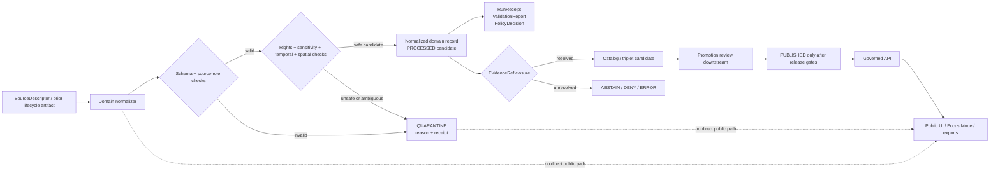

<a id="top"></a>

# Domain Normalization Pipelines

Domain-scoped normalization guidance for turning governed source or prior-stage material into reviewable KFM normalized artifacts without bypassing evidence, policy, receipts, or promotion gates.

<p align="center">
  
  
  
  
  
  
  
</p>

<p align="center">
  <a href="#scope">Scope</a> ·
  <a href="#repo-fit">Repo fit</a> ·
  <a href="#inputs">Inputs</a> ·
  <a href="#exclusions">Exclusions</a> ·
  <a href="#directory-tree">Tree</a> ·
  <a href="#normalization-contract">Contract</a> ·
  <a href="#domain-matrix">Domains</a> ·
  <a href="#flow">Flow</a> ·
  <a href="#quickstart">Quickstart</a> ·
  <a href="#review-gates">Review gates</a> ·
  <a href="#open-questions">Open questions</a>
</p>

| Field | Value |
|---|---|
| Status | `draft` |
| Owners | `TODO(pipeline/data platform owners + lane stewards)` |
| Target path | `pipelines/normalize/domains/README.md` |
| Document role | Directory README for domain-scoped normalization pipeline definitions, manifests, fixtures references, validation expectations, and fail-closed outcomes |
| Evidence mode | `NEEDS VERIFICATION`: drafted from KFM doctrine, visible repo connector evidence, and directory rules; verify in a mounted checkout before treating child paths or commands as current implementation |
| Public posture | Normalization is not publication. Public clients use governed APIs and released or policy-safe artifacts, not normalizer internals |
| Core invariant | `RAW -> WORK / QUARANTINE -> PROCESSED -> CATALOG / TRIPLET -> PUBLISHED` |
| First safe posture | Fixture-first, no-network, no-publication, receipt-emitting dry runs |

> [!IMPORTANT]
> This directory is for **normalization pipeline surfaces**, not broad domain doctrine and not release authority. A normalizer may regularize shape, identifiers, time fields, geometry support, source references, and validation reports. It must not strengthen weak evidence into fact, silently publish, bypass policy, or turn a derived artifact into canonical truth.

---

## Scope

`pipelines/normalize/domains/` is the proposed home for domain-specific normalization pipeline documentation and local execution surfaces.

A domain normalizer sits after source admission or prior-stage lifecycle work and before catalog, triplet, release, UI, or Focus Mode surfaces. Its job is to make lane data **consistent enough to validate and review**, not to declare it public truth.

### This directory should make obvious

| Question | Required answer |
|---|---|
| What domain is being normalized? | The lane name, source roles, and claim boundaries are explicit. |
| What lifecycle state is consumed? | Inputs come from declared source descriptors, fixtures, or governed lifecycle homes. |
| What changes during normalization? | Geometry, identifiers, temporal fields, source references, units, controlled vocabulary, and evidence links are transformed with receipts. |
| What remains unsupported? | Weak evidence, rights gaps, source-role mismatch, stale support, or sensitivity risk produce `QUARANTINE`, `ABSTAIN`, `DENY`, or `ERROR`. |
| What may leave this stage? | Only validated normalized artifacts, reports, receipts, and candidates for downstream catalog/proof review. |

### Normalization may

- map source-native fields to domain-normalized fields;
- standardize units, dates, identifiers, geometry encoding, CRS notes, and source references;
- attach or preserve `EvidenceRef` targets where available;
- emit validation reports, run receipts, and policy decision references;
- produce `PROCESSED` candidates or catalog-ready candidates after gates pass;
- fail closed with a reason code and reviewable disposition.

### Normalization must not

- admit live sources without source descriptors and rights review;
- publish directly to public or semi-public surfaces;
- write secrets, tokens, private steward details, or restricted exact locations into logs or fixtures;
- treat model output, map rendering, vector indexes, graph projections, summaries, or AI language as root truth;
- convert unresolved evidence into confident claims;
- hide redaction, generalization, spatial simplification, or temporal imputation.

[Back to top](#top)

---

## Repo fit

### Path

```text
pipelines/normalize/domains/
```

This path is a pipeline responsibility path. Domain names may appear below it only because they are scoped under the `pipelines/` responsibility root, not because domains should become repo-root folders.

### Upstream context

| Surface | Relationship | Link status |
|---|---|---|
| [`../../README.md`](../../README.md) | Parent pipeline operating law, trust membrane, lifecycle gate posture, and pipeline review expectations | `NEEDS VERIFICATION` |
| [`../README.md`](../README.md) | Parent normalization index and routing surface | `NEEDS VERIFICATION` |
| [`../../../docs/domains/`](../../../docs/domains/) | Domain meaning, lane burdens, source-role notes, and sensitivity posture | `NEEDS VERIFICATION` |
| [`../../../data/registry/`](../../../data/registry/) | Source descriptors, source authority records, source intake, and activation state | `NEEDS VERIFICATION` |
| [`../../../schemas/contracts/v1/domains/`](../../../schemas/contracts/v1/domains/) | Machine-checkable domain contract shapes if this is the adopted schema home | `NEEDS VERIFICATION` |
| [`../../../contracts/domains/`](../../../contracts/domains/) | Human-readable semantic contracts if this is the adopted contract home | `NEEDS VERIFICATION` |
| [`../../../policy/domains/`](../../../policy/domains/) | Domain policy, sensitivity, source-role, release, and deny/abstain rules | `NEEDS VERIFICATION` |
| [`../../../tools/validators/`](../../../tools/validators/) | Shared validators invoked by normalizers or CI | `NEEDS VERIFICATION` |
| [`../../../tests/domains/`](../../../tests/domains/) | Domain fixtures and regression tests where adopted by the repo | `NEEDS VERIFICATION` |

### Downstream consumers

| Downstream surface | Normalization responsibility |
|---|---|
| [`../../../data/processed/`](../../../data/processed/) | Receives validated normalized candidates, not unsupported public claims. |
| [`../../../data/quarantine/`](../../../data/quarantine/) | Receives ambiguous, invalid, rights-unclear, sensitive, or unsupported records with disposition. |
| [`../../../data/receipts/`](../../../data/receipts/) | Receives run receipts and transform memory where repo convention supports it. |
| [`../../../data/catalog/`](../../../data/catalog/) and [`../../../data/triplets/`](../../../data/triplets/) | Receives catalog/triplet candidates only after closure checks. |
| [`../../../release/`](../../../release/) | Receives release candidates only after promotion gates; normalizers do not publish. |
| [`../../../apps/governed-api/`](../../../apps/governed-api/) and [`../../../apps/web/`](../../../apps/web/) | Consume governed payloads and released or policy-safe artifacts, not raw normalizer outputs. |

[Back to top](#top)

---

## Inputs

Accepted inputs are intentionally narrow.

| Input class | Belongs here when… | Required posture |
|---|---|---|
| Domain normalizer README | It explains one lane’s normalization burden, inputs, outputs, finite outcomes, and review gates. | Required for each lane normalizer. |
| Normalizer manifest | It declares input lifecycle state, output lifecycle target, schemas, policies, fixtures, and emitted receipts. | `PROPOSED` until repo-native manifest schema is verified. |
| No-network fixture reference | It supports deterministic tests without live source calls. | Preferred first slice. |
| Source descriptor reference | It links to admitted source identity, source role, rights, cadence, and activation state. | Required before live-source normalization. |
| Prior-stage lifecycle artifact reference | It consumes governed `RAW`, `WORK`, `QUARANTINE`, or `PROCESSED` material. | Must preserve provenance and stage identity. |
| Validation report template | It records schema, source-role, spatial, temporal, rights, sensitivity, and evidence checks. | Must fail closed. |
| Transform note | It documents lane-specific repair, redaction, generalization, unit conversion, geometry handling, or temporal normalization. | Must be reviewable and reproducible. |

> [!WARNING]
> A normalizer can make a record cleaner. It cannot make unsupported evidence authoritative.

[Back to top](#top)

---

## Exclusions

| Do not put this here | Put it here instead | Why |
|---|---|---|
| Broad domain essays | `../../../docs/domains/` | Domain worldview belongs in documentation, not execution trees. |
| Source descriptors as canonical records | `../../../data/registry/` | Source authority and activation must stay registry-governed. |
| Machine schemas and reusable contracts | `../../../schemas/` and `../../../contracts/` | Prevents normalizers from inventing private object shapes. |
| Policy bundles and gate logic | `../../../policy/` | Deny/abstain/allow logic must be inspectable and testable. |
| Bulk source data or normalized output data | `../../../data/raw/`, `../../../data/work/`, `../../../data/quarantine/`, `../../../data/processed/` | Pipeline directories are not lifecycle storage. |
| Generated catalog, proof, or release objects | `../../../data/catalog/`, `../../../data/proofs/`, `../../../release/` | Promotion and proof closure are downstream governance surfaces. |
| Reusable implementation packages | `../../../packages/` or `../../../tools/` | Shared code should not be buried in one normalizer. |
| Secrets, tokens, private keys, cookies, or credentials | Secret manager or deployment config outside normal docs | README and manifests must be safe to review. |
| Direct AI prompts or generated claims | Governed AI contracts, receipts, and citation validation surfaces | AI is interpretive and cannot be root evidence. |
| Exact sensitive public geometry by default | Restricted/steward-reviewed lifecycle homes | Rare species, archaeology, cultural, living-person, DNA, and critical-infrastructure risks fail closed. |

[Back to top](#top)

---

## Directory tree

`PROPOSED / NEEDS VERIFICATION` until a mounted checkout confirms the actual tree and naming convention.

```text
pipelines/normalize/domains/
├── README.md
├── _shared/
│   └── README.md
├── hydrology/
│   ├── README.md
│   └── normalizer.manifest.yaml
├── soil/
│   ├── README.md
│   └── normalizer.manifest.yaml
├── habitat/
│   ├── README.md
│   └── normalizer.manifest.yaml
└── <domain-slug>/
    ├── README.md
    ├── normalizer.manifest.yaml
    └── fixtures/ -> ../../../tests or ../../../fixtures path after repo convention is verified
```

### Naming rules

| Rule | Reason |
|---|---|
| Match the repo’s verified domain slug exactly. | Prevents `roads-rail-trade`, `roads_rail_trade_routes`, and similar aliases from drifting. |
| Keep lane normalizers below this directory, not at repo root. | Preserves responsibility-root discipline. |
| Add `_shared/` only for normalization-local notes, not reusable libraries. | Shared implementation belongs in `packages/` or `tools/`. |
| Use manifests only after the manifest schema or convention is verified. | Avoids private schema drift. |

[Back to top](#top)

---

## Normalization contract

Each domain normalizer should carry a small, inspectable contract.

### Human README checklist

A lane-local README should answer:

- What domain lane is this?
- Which source roles can support its normalized fields?
- What lifecycle state does it consume?
- What output lifecycle state does it produce or simulate?
- Which fields are normalized, derived, redacted, generalized, or preserved?
- Which schemas and policies must pass?
- Which fixtures prove valid and invalid cases?
- Which receipts, reports, and policy decisions are emitted?
- What are the finite outcomes?
- What remains `UNKNOWN`, `NEEDS VERIFICATION`, or `CONFLICTED`?
- What rollback or correction path applies if a downstream release uses this output?

### Illustrative manifest shape

```yaml
# ILLUSTRATIVE EXAMPLE — PROPOSED, not confirmed repo schema.
normalizer_id: hydrology_observation_normalizer
status: proposed
owner: TODO(pipeline/data platform owner)
domain: hydrology

lifecycle:
  consumes: WORK
  emits: PROCESSED_CANDIDATE
  publication_performed: false

network:
  live_fetch: disabled
  reason: fixture-first dry run

inputs:
  source_descriptors:
    - ../../../data/registry/sources/hydrology/TODO.source.json
  fixtures:
    valid:
      - ../../../fixtures/domains/hydrology/TODO.valid.json
    invalid:
      - ../../../fixtures/domains/hydrology/TODO.invalid.json

normalizes:
  identifiers:
    - source_id
    - observation_id
    - station_id
  temporal_fields:
    - observed_time
    - retrieved_time
    - valid_time
  spatial_fields:
    - geometry
    - crs
    - spatial_support
  evidence_fields:
    - evidence_refs
    - source_role
    - support_level

gates:
  schemas:
    - ../../../schemas/contracts/v1/common/TODO.schema.json
    - ../../../schemas/contracts/v1/domains/hydrology/TODO.schema.json
  policies:
    - ../../../policy/domains/hydrology/TODO.rego
    - ../../../policy/common/no_public_raw_path.rego
  validators:
    - ../../../tools/validators/TODO.py

emits:
  receipts:
    - RunReceipt
    - ValidationReport
    - PolicyDecision
  candidates:
    - NormalizedDomainRecord
    - DatasetVersionCandidate
  failure_records:
    - QuarantineRecord

finite_outcomes:
  - PASS
  - QUARANTINE
  - ABSTAIN
  - DENY
  - ERROR
```

[Back to top](#top)

---

## Domain matrix

Use this matrix to keep each lane’s normalizer honest about its burden. This is an orientation matrix, not proof that child normalizers exist.

| Domain | Normalization burden | Fail-closed triggers |
|---|---|---|
| Hydrology | Normalize observed time, retrieval time, gage/site identity, watershed identity, geometry support, units, qualifiers, and source role. | Ambiguous hydro identity, stale observation, unresolved EvidenceRef, regulatory-vs-observed collapse. |
| Soil | Normalize map unit, component, horizon, interpretation, snapshot/version, unit, geometry support, and derived-vs-source fields. | Treating interpretation as observation, source version ambiguity, unsupported precision. |
| Habitat | Normalize habitat class, model support, patch/corridor identity, confidence, land-cover link, and public-safe geometry. | Model-as-occurrence collapse, exact sensitive habitat exposure, missing transform receipt. |
| Flora | Normalize taxon, specimen/observation role, rare-plant sensitivity, occurrence support, and public-safe spatial handling. | Exact rare plant location, weak taxonomic resolution, rights or steward review gap. |
| Fauna | Normalize taxon, occurrence, range/seasonal context, legal/conservation status source role, and sensitivity class. | Community-source-as-legal-authority, exact sensitive species location, range-as-observation collapse. |
| Agriculture | Normalize crop/field/land-use indicators, season, source role, units, spatial support, soil/hydrology joins, and derived index status. | Private-sensitive exposure, gridded indicator as field truth, rights or attribution gap. |
| Atmosphere / Air | Normalize station/model/smoke/EO fields, issue/retrieval/valid time, parameter units, freshness, and knowledge character. | Operational freshness gap, model/observation collapse, life-safety overclaim. |
| Geology & Natural Resources | Normalize unit, lithology, stratigraphy, borehole/core/reference, resource estimate, interpretation, and public-safe geometry. | Legal/resource administration as physical geology, precise sensitive resource exposure. |
| Hazards | Normalize event, regulatory context, declaration, warning/advisory, modeled/detected surface, issue/expiry time, and contextual-only flags. | Emergency instruction, expired operational feed, regulatory area as observed event. |
| Roads / Rail / Trade Routes | Normalize alignment, designation, operator/owner/status, temporal status, facility, restriction, and historic support. | Historic interpretation as surveyed alignment, sensitive corridor precision, operator/owner collapse. |
| Settlements & Infrastructure | Normalize settlement/facility/network identity, operator, condition, dependency, status, service area, and precision controls. | Critical-infrastructure exposure, facility-as-operator collapse, unsupported condition claim. |
| Archaeology | Normalize site/feature/survey/collection/candidate roles, cultural/steward review, remote-sensing support, and generalized geometry. | Exact site location, anomaly as confirmed site, cultural review gap. |
| People / Genealogy / DNA / Land | Normalize person assertions, relationship hypotheses, land/title/assessor distinctions, temporal validity, and privacy restrictions. | Living-person or DNA public output, assessor row as title truth, hypothesis as canonical fact. |

[Back to top](#top)

---

## Flow



[Back to top](#top)

---

## Quickstart

Use these commands only after opening the actual repository root.

### 1. Verify checkout and adjacent surfaces

```bash
git status --short
git branch --show-current
git rev-parse --show-toplevel

find pipelines -maxdepth 4 -type f | sort | sed -n '1,200p'
find docs data schemas contracts policy tools tests -maxdepth 3 -type f 2>/dev/null | sort | sed -n '1,200p'
```

### 2. Inspect this directory before editing

```bash
find pipelines/normalize/domains -maxdepth 3 -type f | sort
sed -n '1,220p' pipelines/README.md
sed -n '1,220p' pipelines/normalize/README.md
sed -n '1,220p' pipelines/normalize/domains/README.md
```

### 3. Start with a no-network dry run

```bash
# PROPOSED placeholder.
# Replace with the repo-native runner after package manager and normalizer conventions are verified.
python pipelines/normalize/domains/<domain>/run.py --dry-run --no-network
```

### 4. Validate before widening trust

```bash
# PROPOSED placeholders.
# Use repo-native wrappers if they exist.
python tools/validators/validate_source_descriptors.py --domain <domain>
python tools/validators/validate_domain_normalized_record.py --domain <domain>
python tools/validators/validate_evidence_bundle.py --domain <domain>
```

> [!CAUTION]
> Do not run live source fetches, destructive cleanup, public materialization, external model calls, or release promotion from a normalizer until source rights, endpoint behavior, credentials, policy gates, rollback, logging, and CI expectations are verified.

[Back to top](#top)

---

## Review gates

A domain normalizer is not ready for release-facing use until the right gates pass.

| Gate | Required evidence | Fail-closed outcome |
|---|---|---|
| Source admission | Descriptor exists and source role, rights, cadence, activation, and support are declared. | Reject, defer, or quarantine. |
| Schema | Valid and invalid fixtures exercise expected shape. | Block merge or promotion. |
| Source role | Observation, model, regulatory, documentary, remote-sensing, derived, and generalized roles stay distinct. | Quarantine or deny unsupported claim. |
| Spatial | CRS, geometry validity, precision, support, and transform history are explicit. | Hold in `WORK` or `QUARANTINE`. |
| Temporal | Observed, valid, retrieved, source, release, and freshness times are distinguished where material. | Hold, abstain, or expire. |
| Rights | License, terms, attribution, redistribution, and access class are known. | Block public release. |
| Sensitivity | Exact-location, cultural, living-person, restricted, or critical-infrastructure exposure is classified. | Redact, generalize, restrict, or deny. |
| Evidence closure | `EvidenceRef` resolves to `EvidenceBundle` for consequential claims. | Runtime must abstain, deny, or error. |
| Receipts | Transform, validation, and policy decisions are retained. | Block promotion. |
| Public boundary | No public route reads normalizer internals, raw/work/quarantine records, unpublished candidates, or direct model output. | Block release. |
| Rollback | Correction or rollback target is named before downstream release. | Block promotion. |

### Definition of done for the first domain normalizer

- [ ] Repository conventions are inspected in a mounted checkout.
- [ ] Lane README states status, owner, inputs, exclusions, finite outcomes, and rollback posture.
- [ ] Normalizer starts fixture-first and no-network.
- [ ] Source descriptors are present or explicitly `NEEDS VERIFICATION`.
- [ ] Valid and invalid fixtures are present or explicitly planned.
- [ ] Normalizer emits or simulates `RunReceipt`, `ValidationReport`, and `PolicyDecision`.
- [ ] `EvidenceRef -> EvidenceBundle` closure is demonstrated or the normalizer abstains.
- [ ] Sensitive geometry and restricted context fail closed.
- [ ] No public raw/work/quarantine or direct-normalizer path exists.
- [ ] No release or publication occurs in the first dry run.
- [ ] CI command is repo-native or marked `NEEDS VERIFICATION`.

[Back to top](#top)

---

## Operating rules

### Normalizers may

- read declared inputs from governed lifecycle homes;
- transform and validate fields within an explicit domain scope;
- emit normalized candidates, receipts, reports, and policy decisions;
- quarantine unsafe, ambiguous, malformed, unsupported, or rights-unclear records;
- prepare catalog-ready candidates after closure checks;
- support downstream review with reproducible transform memory.

### Normalizers must not

- publish directly;
- call live sources without descriptor and rights review;
- erase source-native meaning or provenance;
- conflate source role, evidence role, model role, legal role, and public-release role;
- allow UI or AI surfaces to treat normalizer output as sovereign truth;
- store secrets or restricted details in reviewable docs;
- silently generalize or redact geometry without a transform reason;
- skip citation validation for consequential claims.

[Back to top](#top)

---

## FAQ

### Is normalization the same as ingestion?

No. Ingestion admits or captures source material. Normalization regularizes admitted or prior-stage material for validation, review, and downstream catalog/proof closure.

### Can a normalizer write to `PUBLISHED`?

No. Publication is a governed state transition. A normalizer may prepare candidates and evidence for downstream promotion, but it must not publish directly.

### Can a normalizer call a live source?

Only after source descriptors, rights, endpoint behavior, cadence, attribution, credentials, failure modes, and source-role policy are verified. The safest first slice is no-network.

### Can a normalizer use AI?

Only as an evidence-subordinate helper behind governed boundaries. AI output cannot become root truth and must not bypass `EvidenceRef -> EvidenceBundle`, policy checks, or finite outcomes.

### Can the UI read normalized outputs directly?

Public and ordinary UI clients should use governed APIs and released or policy-safe artifacts. Normalizer internals and unpublished candidates are not normal public paths.

[Back to top](#top)

---

## Open questions

| Question | Status | Why it matters |
|---|---|---|
| Does the active repository branch contain `pipelines/normalize/domains/` and child normalizer files? | `NEEDS VERIFICATION` | Prevents stale connector evidence or branch mismatch from becoming path claims. |
| What is the repo-native domain slug convention? | `NEEDS VERIFICATION` | Prevents duplicate domain folders and broken links. |
| Is a normalizer manifest schema already defined? | `UNKNOWN` | Avoids inventing private manifest fields. |
| Which language or runner is authoritative for normalization pipelines? | `UNKNOWN` | Determines quickstart, tests, CI, and examples. |
| Where do domain fixtures live today? | `UNKNOWN` | Prevents incorrect fixture paths. |
| Which validators already exist? | `UNKNOWN` | Prevents duplicating tooling or claiming coverage. |
| Which source descriptors have verified rights and activation state? | `NEEDS VERIFICATION` | Blocks live-source use and public release. |
| Which owners approve normalization changes? | `TODO` | Required for review accountability and separation of duties. |
| What proof, receipt, and release object homes are active? | `UNKNOWN` | Prevents detached audit artifacts. |

[Back to top](#top)

---

<details>
<summary><strong>Appendix: reviewer prompt</strong></summary>

Use this prompt when reviewing a domain normalizer PR:

```text
Does this normalizer preserve the KFM lifecycle path:
RAW -> WORK / QUARANTINE -> PROCESSED -> CATALOG / TRIPLET -> PUBLISHED?

Does it declare:
- domain lane,
- source role,
- consumed lifecycle state,
- emitted lifecycle state,
- schemas,
- policies,
- fixtures,
- receipts,
- evidence closure,
- rights posture,
- sensitivity handling,
- rollback target,
- and finite outcomes?

Does it avoid:
- public reads from normalizer internals,
- live fetch without source descriptor and rights review,
- publication without promotion,
- model/renderer ownership of truth,
- secret leakage,
- silent geometry or time transformation,
- and unsupported claims?
```

</details>

<details>
<summary><strong>Appendix: glossary</strong></summary>

| Term | Working meaning |
|---|---|
| `Domain normalizer` | A lane-scoped pipeline surface that regularizes source or prior-stage material for validation and review. |
| `SourceDescriptor` | Source identity, role, rights, cadence, activation, support, and citation obligations. |
| `EvidenceRef` | A reference that must resolve to an `EvidenceBundle` before consequential claims are released. |
| `EvidenceBundle` | Inspectable support package for claims, layers, exports, reviews, or Focus outputs. |
| `RunReceipt` | Process memory for inputs, tools, versions, transforms, hashes, outcomes, and timestamps. |
| `ValidationReport` | Result of schema, policy, source-role, spatial, temporal, rights, sensitivity, or catalog checks. |
| `PolicyDecision` | Decision record for allow, deny, abstain, obligations, transforms, or release eligibility. |
| `QuarantineRecord` | Disposition record for unsafe, invalid, unsupported, ambiguous, rights-unclear, or sensitive material. |
| `PromotionDecision` | Reviewable decision allowing, blocking, or conditioning publication. |
| `ReleaseManifest` | Release-facing manifest binding artifacts, digests, evidence, policy, review, and rollback references. |
| `CorrectionNotice` | Notice explaining correction scope, reason, lineage, and replacement or withdrawal state. |

</details>

[Back to top](#top)
