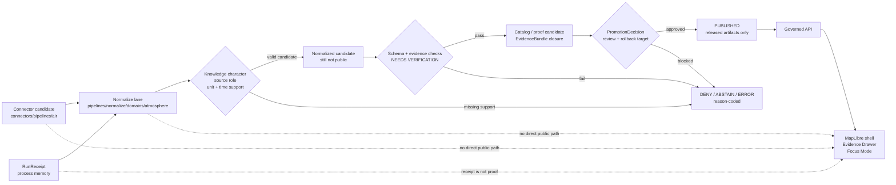

<!-- [KFM_META_BLOCK_V2]
doc_id: kfm://doc/NEEDS-VERIFICATION-pipelines-normalize-domains-atmosphere-readme
title: Atmosphere Normalization Pipeline
type: standard
version: v1
status: draft
owners: NEEDS_VERIFICATION
created: NEEDS_VERIFICATION-YYYY-MM-DD
updated: 2026-05-06
policy_label: NEEDS_VERIFICATION-public-or-restricted
related: [../README.md, ../../README.md, ../../../README.md, ../../../../docs/domains/atmosphere_air/README.md, ../../../../connectors/pipelines/air/README.md, ../../../../connectors/pipelines/air/air_ingest.py, ../../../../data/processed/air/qa_summary.example.json, ../../../../data/receipts/air/run_receipt.example.json]
tags: [kfm, pipelines, normalize, domains, atmosphere, air, evidence, knowledge-character, no-network, fail-closed]
notes: [Target README was confirmed repo-visible and empty before this draft; parent normalize READMEs were repo-visible but empty; owners, created date, policy label, sibling file inventory, validators, CI, source registry, schema home, and policy wiring require verification.]
[/KFM_META_BLOCK_V2] -->

<a id="top"></a>

# Atmosphere Normalization Pipeline

Domain-local normalization guidance for turning atmosphere/air candidates into reviewable, evidence-preserving normalized records without fetching live sources, declaring truth, or publishing public artifacts.

<div align="center">


</div>

> [!IMPORTANT]
> **Status:** `experimental`  
> **Owners:** `NEEDS_VERIFICATION`  
> **Path:** `pipelines/normalize/domains/atmosphere/README.md`  
> **Role:** domain-specific normalization lane under `pipelines/normalize/`  
> **Current implementation posture:** this README orients the lane. It does **not** claim a normalization script, validator, CI workflow, schema gate, policy gate, or public release flow is already implemented at this path.

**Quick jumps:** [Scope](#scope) · [Repo fit](#repo-fit) · [Accepted inputs](#accepted-inputs) · [Exclusions](#exclusions) · [Directory tree](#directory-tree) · [Normalization contract](#normalization-contract) · [Quickstart](#quickstart) · [Flow](#flow) · [Gates](#validation--policy-gates) · [Definition of done](#definition-of-done) · [FAQ](#faq) · [Open verification](#open-verification)

---

## Scope

`pipelines/normalize/domains/atmosphere/` is the execution-near documentation home for **atmosphere/air normalization**.

Normalization is the step that takes source-facing candidates and makes them more inspectable by preserving:

- source role;
- knowledge character;
- raw value and raw unit;
- normalized value and normalized unit;
- source payload hash or equivalent source trace;
- temporal support;
- EvidenceRefs;
- run receipt linkage;
- candidate status; and
- reason-coded failure outcomes.

It is **not** source admission, live fetching, policy authorization, public API binding, MapLibre rendering, Evidence Drawer display, Focus Mode answering, or publication.

### Working rule

A record may pass through this lane only when it remains a **candidate** until downstream schema, evidence, policy, catalog, review, promotion, release, and rollback gates prove otherwise.

> [!WARNING]
> Atmosphere work is easy to overstate. AQI, PM2.5 concentration, AOD, smoke masks, model fields, fusion products, weather context, advisories, and station metadata must not collapse into one “air layer.”

<p align="right"><a href="#top">Back to top ↑</a></p>

---

## Repo fit

### Path and naming posture

| Item | Status | Value |
|---|---:|---|
| Target README | CONFIRMED | `pipelines/normalize/domains/atmosphere/README.md` |
| Target file content before this draft | CONFIRMED | empty / newline-only |
| Parent normalize README | CONFIRMED | `pipelines/normalize/README.md` exists but is empty / newline-only |
| Parent normalize-domain README | CONFIRMED | `pipelines/normalize/domains/README.md` exists but is empty / newline-only |
| Pipeline root README | CONFIRMED | `pipelines/README.md` exists and is minimal |
| Domain doctrine path | CONFIRMED | `docs/domains/atmosphere_air/README.md` |
| Source-facing connector lane | CONFIRMED | `connectors/pipelines/air/README.md` |
| Current no-network candidate writer | CONFIRMED | `connectors/pipelines/air/air_ingest.py` |
| Naming friction | NEEDS VERIFICATION | pipeline path uses `atmosphere`; domain docs use `atmosphere_air`; connector path uses `air` |

### Upstream surfaces

| Surface | Path | How this README uses it |
|---|---|---|
| Pipeline root | [`../../../README.md`](../../../README.md) | Repo-wide execution-family entry point; currently thin. |
| Normalize index | [`../../README.md`](../../README.md) | Should eventually explain normalize-wide rules. |
| Normalize domains index | [`../README.md`](../README.md) | Should eventually link domain-local normalize lanes. |
| Atmosphere/air domain doctrine | [`../../../../docs/domains/atmosphere_air/README.md`](../../../../docs/domains/atmosphere_air/README.md) | Source-role, knowledge-character, lifecycle, public-safety, and UI-trust doctrine. |
| Air connector lane | [`../../../../connectors/pipelines/air/README.md`](../../../../connectors/pipelines/air/README.md) | Source-facing no-network candidate and receipt context. |
| No-network writer | [`../../../../connectors/pipelines/air/air_ingest.py`](../../../../connectors/pipelines/air/air_ingest.py) | Confirmed example producer for current air candidate artifacts. |

### Downstream surfaces

| Surface | Path | Normalization responsibility |
|---|---|---|
| QA summary candidate | [`../../../../data/processed/air/qa_summary.example.json`](../../../../data/processed/air/qa_summary.example.json) | Read as a candidate input shape; do not promote by implication. |
| Run receipt | [`../../../../data/receipts/air/run_receipt.example.json`](../../../../data/receipts/air/run_receipt.example.json) | Preserve as process memory; do not treat as release proof. |
| Schemas | `../../../../schemas/contracts/v1/atmosphere/` or repo-verified equivalent | NEEDS VERIFICATION before this lane can claim machine-contract enforcement. |
| Policy | `../../../../policy/atmosphere/` or repo-verified equivalent | NEEDS VERIFICATION before this lane can claim deny rules are executable. |
| Tests | `../../../../tests/domains/atmosphere/`, `../../../../tests/atmosphere/`, or repo-verified equivalent | NEEDS VERIFICATION before this lane can claim coverage. |
| Release and publication | release / catalog / proof homes | Downstream only; normalization does not write public release state. |

> [!NOTE]
> This README intentionally links to the existing `air` connector and `atmosphere_air` domain docs instead of duplicating their doctrine. The normalize lane should explain transformation burden, not become a second domain manual.

<p align="right"><a href="#top">Back to top ↑</a></p>

---

## Accepted inputs

Material belongs in this lane when it is **candidate-level atmosphere/air material** that needs normalization before downstream validation, cataloging, proof, review, or publication.

| Input | Accepted? | Minimum handling |
|---|---:|---|
| No-network QA summary candidate | Yes | Preserve `decision: candidate`, source label, metrics, aggregation metadata, time window, and receipt refs. |
| Run receipt | Yes | Keep process memory separate from proof. Confirm `network_access` and output path references. |
| Observation candidate | Yes | Preserve raw value/unit and normalized value/unit; require source role and EvidenceRefs before release use. |
| AQI / NowCast / public report candidate | Yes | Keep as report/index object; do not treat as raw concentration. |
| Station or site metadata | Yes | Preserve station/site ID, provider, geometry or generalization rule, cadence, siting caveat, and health state. |
| Model field candidate | Yes | Label as modeled; preserve model identity, time basis, uncertainty or model-card ref, and grid support. |
| Remote sensing mask candidate | Yes | Label as classification/support context; never surface as exposure measurement by default. |
| Fusion product candidate | Yes | Preserve input EvidenceRefs, method, transform hash, uncertainty, and derived status. |
| Invalid fixture | Yes | Use for negative tests: missing source role, unknown rights, AQI-as-concentration, AOD-as-PM2.5, stale support, malformed time. |
| Live source payload | Not yet | Requires verified source descriptor, rights, cadence, rate limits, endpoint schema, and policy gates before admission. |

### Minimum candidate fields to preserve

| Field family | Examples | Why it matters |
|---|---|---|
| Source identity | `provider`, `dataset`, `source_id` | Prevents anonymous or unreviewable records. |
| Knowledge character | `OBSERVED_SENSOR`, `PUBLIC_AQI_REPORT`, `ATMOSPHERIC_MODEL_FIELD`, `REMOTE_SENSING_MASK`, `DERIVED_FUSION` | Prevents epistemic collapse. |
| Parameter and unit | `pm25`, `ug_m3`, AQI/index method | Prevents unit drift and AQI/concentration confusion. |
| Time support | observation window, model valid time, retrieval time, freshness window | Prevents stale or temporally unsupported claims. |
| Evidence linkage | EvidenceRefs, source payload hash, transform hash | Makes the candidate traceable and auditable. |
| Decision posture | `candidate`, `ABSTAIN`, `DENY`, `ERROR` | Keeps non-public outcomes first-class. |
| Receipt linkage | `run_receipt_ref`, run ID, network posture | Separates process memory from release proof. |

<p align="right"><a href="#top">Back to top ↑</a></p>

---

## Exclusions

| Keep out of this normalize lane | Put it here instead | Reason |
|---|---|---|
| Source descriptors as authority | `data/registry/atmosphere/` or repo-verified source registry | Source identity, rights, cadence, and authority need central inspection. |
| Live source fetching | `connectors/` or source-specific pipeline lane | Normalization should not become source admission. |
| Shared schemas | `schemas/contracts/v1/atmosphere/` or repo-verified schema home | Avoid local schema drift. |
| Human-readable semantic contracts | `contracts/domains/atmosphere/` or repo-verified contract home | Contracts define meaning beyond this pipeline path. |
| Policy-as-code | `policy/atmosphere/` or repo-verified policy home | Deny/allow/restrict logic must remain centrally reviewable. |
| Public API routes | governed API app surface | Public clients should never read normalize-stage artifacts directly. |
| Evidence Drawer or Focus Mode payload authority | UI/API contract surfaces | Trust UI consumes governed envelopes, not raw normalize outputs. |
| RAW / WORK / QUARANTINE payloads | `data/raw/`, `data/work/`, `data/quarantine/` | Lifecycle data belongs in lifecycle roots. |
| Published artifacts | `data/published/` or release surface | Publication is a governed state transition, not a transform side effect. |
| Secrets and `.env` files | never commit | No normalization helper should require committed credentials. |
| Emergency instructions | official emergency/alerting systems | KFM may show source context; it must not become a life-safety alert authority. |

<p align="right"><a href="#top">Back to top ↑</a></p>

---

## Directory tree

### Confirmed target surface

```text
pipelines/
└── normalize/
    └── domains/
        └── atmosphere/
            └── README.md   # this file; confirmed repo-visible and blank before this draft
```

### Adjacent confirmed source-facing surface

```text
connectors/
└── pipelines/
    └── air/
        ├── README.md
        └── air_ingest.py
```

### Confirmed example artifacts used by the current air connector

```text
data/
├── processed/
│   └── air/
│       └── qa_summary.example.json
└── receipts/
    └── air/
        └── run_receipt.example.json
```

### Proposed expansion shape

The paths below are **PROPOSED** until the repository’s normalize conventions are verified.

```text
pipelines/
└── normalize/
    └── domains/
        └── atmosphere/
            ├── README.md
            ├── normalize.py                 # PROPOSED: CLI wrapper if repo conventions allow
            ├── profiles/
            │   ├── qa_summary.profile.yaml  # PROPOSED: expected candidate profile
            │   └── observation.profile.yaml  # PROPOSED: observation profile
            ├── mappings/
            │   ├── parameters.yaml           # PROPOSED: local mapping view; registry remains authoritative
            │   └── knowledge_characters.yaml # PROPOSED: local mapping view; domain docs remain authoritative
            └── fixtures/
                └── README.md                 # PROPOSED only if connector-local fixtures are accepted
```

> [!CAUTION]
> Do not create local `schemas/`, `policy/`, `data/published/`, or source registry authority inside this path. Link to shared responsibility roots instead.

<p align="right"><a href="#top">Back to top ↑</a></p>

---

## Normalization contract

A future normalizer in this lane should behave like a **transparent transformation membrane**.

### It may do

| Step | Allowed behavior | Output posture |
|---|---|---|
| Parse candidate | Read small candidate JSON or fixture-like records. | `candidate` |
| Classify | Preserve or derive `knowledge_character` only when rule support is explicit. | `candidate` or `DENY` |
| Normalize units | Record raw unit and normalized unit. | `candidate` |
| Normalize time | Preserve source time, observation/model valid time, retrieval time, and freshness support where available. | `candidate` |
| Check traceability | Require source role, EvidenceRefs, source hash, and transform hash for consequential records. | `candidate`, `ABSTAIN`, or `DENY` |
| Emit receipt | Record run ID, inputs, outputs, transform profile, network posture, and status. | process memory |
| Send downstream | Hand a normalized candidate to validators, catalog closure, proof, and promotion surfaces. | not public |

### It must not do

| Anti-pattern | Required outcome |
|---|---|
| Mark no-network fixture output as public truth | `DENY` |
| Treat AQI as concentration | `DENY` |
| Treat AOD as PM2.5 without governed assumptions | `DENY` |
| Treat smoke mask as exposure measurement | `DENY` or `ABSTAIN` |
| Label a model field as observed | `DENY` |
| Hide source uncertainty in a fusion product | `DENY` |
| Publish directly to `data/published/` | `DENY` |
| Serve public clients from normalize-stage artifacts | `DENY` |
| Replace EvidenceBundle closure with a run receipt | `DENY` |

<p align="right"><a href="#top">Back to top ↑</a></p>

---

## Quickstart

Run these checks from the repository root after confirming you are in the intended checkout.

### 1. Inspect the known current air surfaces

```bash
find pipelines/normalize/domains/atmosphere -maxdepth 3 -type f | sort
find connectors/pipelines/air -maxdepth 3 -type f | sort
```

### 2. Validate the confirmed no-network candidate and receipt parse as JSON

```bash
python -m json.tool data/processed/air/qa_summary.example.json > /dev/null
python -m json.tool data/receipts/air/run_receipt.example.json > /dev/null
```

### 3. Run a read-only shape check against the current example artifacts

```bash
python - <<'PY'
import json
from pathlib import Path

summary_path = Path("data/processed/air/qa_summary.example.json")
receipt_path = Path("data/receipts/air/run_receipt.example.json")

summary = json.loads(summary_path.read_text(encoding="utf-8"))
receipt = json.loads(receipt_path.read_text(encoding="utf-8"))

required_summary = {
    "aggregation",
    "decision",
    "flags",
    "metrics",
    "schema_version",
    "source",
    "time_window",
}

required_receipt = {
    "network_access",
    "outputs",
    "pipeline",
    "run_id",
    "schema_version",
    "status",
}

missing_summary = sorted(required_summary - set(summary))
missing_receipt = sorted(required_receipt - set(receipt))

if missing_summary or missing_receipt:
    raise SystemExit(
        {
            "missing_summary": missing_summary,
            "missing_receipt": missing_receipt,
        }
    )

if summary.get("decision") != "candidate":
    raise SystemExit("expected qa_summary decision to remain candidate")

if receipt.get("network_access") != "disabled":
    raise SystemExit("expected no-network receipt posture")

print("OK: current air candidate and receipt are parseable and remain non-public")
PY
```

### 4. Future normalize command placeholder

```bash
# PROPOSED — do not wire this into CI until the script path is verified.
python pipelines/normalize/domains/atmosphere/normalize.py \
  --input data/processed/air/qa_summary.example.json \
  --receipt data/receipts/air/run_receipt.example.json \
  --output data/processed/atmosphere/normalized.qa_summary.example.json
```

> [!WARNING]
> The command in step 4 is a placeholder for a future PR. It is included to show the intended interface shape, not to claim the file exists.

<p align="right"><a href="#top">Back to top ↑</a></p>

---

## Flow



Reading rule: normalization improves candidate inspectability. It does not shorten the path to public truth.

<p align="right"><a href="#top">Back to top ↑</a></p>

---

## Knowledge-character handling

Every normalized atmosphere record should preserve one primary knowledge character and any secondary context needed for interpretation.

| Knowledge character | Normalize-stage rule | Public-risk warning |
|---|---|---|
| `OBSERVED_SENSOR` | Preserve raw and normalized value, unit, site, instrument, time, source payload hash. | Do not interpolate or generalize without a derived-product record. |
| `PUBLIC_AQI_REPORT` | Preserve issuer, method, index scale, time window, and advisory source. | Do not treat as raw concentration. |
| `REGULATORY_ARCHIVE` | Preserve archive status, QA/QC posture, valid period, retrieval time. | Do not imply live state. |
| `LOW_COST_SENSOR` | Preserve correction method, caveats, confidence, and provider terms. | Unknown correction or rights blocks public release. |
| `ATMOSPHERIC_MODEL_FIELD` | Preserve model name/version, grid, valid time, uncertainty, and model-card reference. | Model output is not observation. |
| `REMOTE_SENSING_MASK` | Preserve sensor/product, classification, confidence, spatial support, and caveats. | Smoke/AOD masks are not exposure measurements. |
| `DERIVED_FUSION` | Preserve all input EvidenceRefs, method, transform hash, uncertainty, and output support. | Fusion output is derived, not canonical source truth. |
| `ALERT_AND_ADVISORY_CONTEXT` | Preserve issuer, message source, temporal scope, and not-emergency-alert posture. | KFM must not become a life-safety alerting system. |
| `NETWORK_AND_SITE_CONTEXT` | Preserve station ID, provider ID, siting caveats, cadence, active/inactive state. | Site context is not a measurement value. |

<p align="right"><a href="#top">Back to top ↑</a></p>

---

## Validation & policy gates

A future implementation should fail closed with explicit reason codes.

| Gate | Normalize-stage check | Failure outcome |
|---|---|---|
| Parse | Candidate and receipt parse as JSON. | `ERROR` |
| Candidate posture | Input remains non-public, usually `decision: candidate`. | `DENY` |
| No-network posture | Fixture/default receipt preserves `network_access: disabled`. | `DENY` if fixture path triggers live network |
| Source role | Source role or source descriptor ref exists for consequential records. | `DENY` |
| Knowledge character | Object declares what kind of knowledge it is. | `DENY` |
| Unit semantics | Raw and normalized units are explicit; AQI/index values are not concentration. | `DENY` |
| Time support | Valid/observed/retrieved/freshness windows are preserved where material. | `ABSTAIN` or `DENY` |
| Evidence closure | EvidenceRefs exist before consequential claim or release handoff. | `ABSTAIN` or `DENY` |
| Receipt/proof split | RunReceipt is not treated as EvidenceBundle or release proof. | `DENY` |
| Public boundary | No normalize-stage artifact is routed directly to public API/UI/tile output. | `DENY` |

### Reason codes to align with atmosphere policy

| Reason code | Use when |
|---|---|
| `ATMOS_MISSING_KNOWLEDGE_CHARACTER` | `knowledge_character` is absent. |
| `ATMOS_MISSING_SOURCE_ROLE` | Source role or source descriptor reference is absent. |
| `ATMOS_MISSING_RIGHTS` | Rights are absent, unknown, or insufficient for public use. |
| `ATMOS_MISSING_EVIDENCE_REFS` | Consequential record lacks EvidenceRefs. |
| `ATMOS_MISSING_SOURCE_PAYLOAD_HASH` | Normalized record cannot trace to source payload. |
| `ATMOS_MISSING_TRANSFORM_HASH` | Transform identity is missing. |
| `ATMOS_MODEL_AS_OBSERVED` | Modeled material is labeled as observation. |
| `ATMOS_AQI_AS_CONCENTRATION` | AQI/report index is treated as concentration. |
| `ATMOS_AOD_AS_PM25` | AOD is treated as PM2.5 without governed model assumptions. |
| `ATMOS_PUBLIC_INTERNAL_ACCESS` | Public surface attempts to read normalize/internal lifecycle artifacts. |
| `ATMOS_UNKNOWN_RIGHTS_PUBLIC` | Public output is requested while source rights remain unknown. |

<p align="right"><a href="#top">Back to top ↑</a></p>

---

## Definition of done

### README readiness

- [ ] KFM Meta Block values are verified or intentionally marked `NEEDS_VERIFICATION`.
- [ ] Owners are confirmed through CODEOWNERS or maintainer review.
- [ ] Parent README links are added from `pipelines/normalize/README.md` and `pipelines/normalize/domains/README.md`.
- [ ] The `atmosphere`, `air`, and `atmosphere_air` naming split is documented in an ADR or compatibility note.
- [ ] Relative links resolve from this path.
- [ ] This README does not duplicate domain doctrine already owned by `docs/domains/atmosphere_air/`.

### Normalize-lane readiness

- [ ] Candidate and receipt inputs parse in no-network mode.
- [ ] Normalized records preserve raw value/unit and normalized value/unit.
- [ ] Knowledge character is required for every consequential atmosphere object.
- [ ] AQI, concentration, AOD, smoke masks, models, and fusion products remain distinct.
- [ ] Unknown rights, missing source role, missing EvidenceRefs, or stale support fail closed.
- [ ] Run receipts remain process memory, not proof.
- [ ] No normalization step writes to `data/published/`.
- [ ] No public API, UI, Focus Mode, or tile service consumes normalize-stage outputs directly.
- [ ] Rollback and correction behavior is documented before any release-adjacent use.

### Expansion readiness

- [ ] Source registry and parameter registry homes are verified.
- [ ] Schema home is verified and not duplicated.
- [ ] Policy engine and test runner are verified before enforcement is claimed.
- [ ] Valid and invalid fixtures cover observed, AQI/report, model, remote mask, fusion, stale, unknown-rights, and malformed-unit cases.
- [ ] Downstream catalog/proof/release handoff emits reviewable artifacts without auto-publication.
- [ ] Evidence Drawer and Focus Mode examples consume governed API envelopes only.

<p align="right"><a href="#top">Back to top ↑</a></p>

---

## FAQ

<details>
<summary>Why is this under <code>pipelines/normalize/</code> instead of <code>docs/domains/</code>?</summary>

This README is execution-near. It explains the normalization responsibility for one domain lane. Domain meaning, public-safety posture, and knowledge-character doctrine belong in `docs/domains/atmosphere_air/`.
</details>

<details>
<summary>Can this lane use the current air connector output?</summary>

Yes, as a candidate input for shape checks and future no-network normalization tests. The current air connector output remains `decision: candidate`; it is not public truth and should not bypass validation or promotion.
</details>

<details>
<summary>Should this lane create source descriptors?</summary>

No. It may require or reference source descriptors, but source descriptor authority should live in the repo’s verified source registry home.
</details>

<details>
<summary>Can Focus Mode answer from normalized atmosphere records?</summary>

Only after the records are admitted through governed APIs with EvidenceBundle-backed, policy-safe context. Focus Mode must produce finite outcomes: `ANSWER`, `ABSTAIN`, `DENY`, or `ERROR`.
</details>

<details>
<summary>What should happen if normalized evidence is stale?</summary>

Do not invent freshness. Return `ABSTAIN`, `DENY`, or a stale-state candidate depending on policy and context. Public live-state claims require explicit freshness support.
</details>

<p align="right"><a href="#top">Back to top ↑</a></p>

---

## Open verification

| Item | Status | Why it matters |
|---|---:|---|
| Owners | NEEDS VERIFICATION | Required for review, routing, and source/policy changes. |
| Created date | NEEDS VERIFICATION | Target file existed but was blank before this draft; original creation date was not verified. |
| Policy label | NEEDS VERIFICATION | Determines whether the README and examples are public-safe or restricted. |
| Sibling files under `pipelines/normalize/domains/atmosphere/` | NEEDS VERIFICATION | Direct directory listing was not available through the connector; do not assume this README is the only file. |
| Parent README content | CONFIRMED thin / NEEDS REVISION | `pipelines/normalize/README.md` and `pipelines/normalize/domains/README.md` were repo-visible but empty. |
| Schema home | NEEDS VERIFICATION | Avoid divergent authority between `contracts/`, `schemas/`, and any compatibility roots. |
| Policy home | NEEDS VERIFICATION | Deny codes are doctrine until executable policy and tests are verified. |
| Test runner and CI | UNKNOWN | Do not claim enforcement until workflows/tests are opened and run. |
| Source registry path | NEEDS VERIFICATION | Normalization depends on source roles and rights but should not own source authority. |
| Public API/UI binding | UNKNOWN | No direct public path should be added from normalize outputs. |
| Release/proof implementation | UNKNOWN | Promotion, rollback, and catalog closure remain downstream proof obligations. |

<p align="right"><a href="#top">Back to top ↑</a></p>
