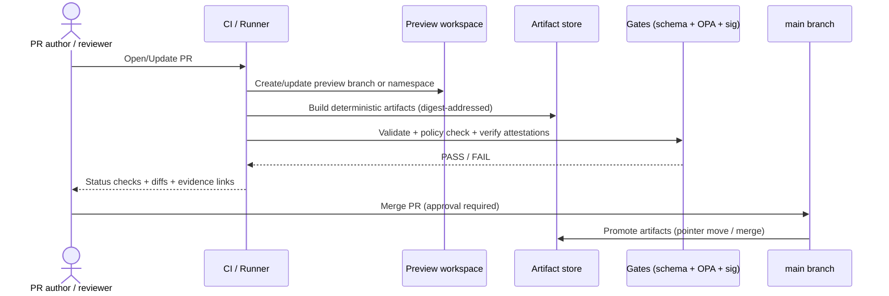

# 🧵 Pipelines · Orchestration


This directory defines **how/when** KFM pipelines execute, and **under what gates** they are allowed to publish.

**Orchestration is the “control plane” for runs**:
- schedules + triggers (cron / upstream events / manual runs)
- backfills (historic ranges) with explicit audit trails
- resource pools + freshness targets
- promotion gates (preview → attest → promote)
- run metadata + telemetry hooks

> [!IMPORTANT]
> Orchestration owns **execution + policy**. It does *not* own domain ETL logic.
>
> - ✅ Domain-specific pipeline code belongs in: `src/pipelines/**`
> - ✅ Published artifacts + catalogs belong in: `data/**` (raw/work/processed + STAC/DCAT/PROV)
> - ✅ Validation/policy tooling belongs in: `tools/**`
> - ✅ CI wiring (GitHub Actions, etc.) belongs in: `.github/**`

---

## System shape

KFM’s operational shape is:

> **ETL → STAC/DCAT/PROV → Graph → Governed API → UI → Story Nodes → Focus Mode**

```mermaid
flowchart LR
  subgraph Triggers
    Cron[Cron / cadence]:::t
    Event[Upstream event / webhook]:::t
    Manual[Manual run / backfill request]:::t
  end

  Orchestrator[Orchestration layer\n(pipelines/orchestration)]:::o
  Runner[Runner adapter\n(GitHub Actions / Tekton / Argo WF / etc.)]:::o
  Connector[Connector / Asset code\n(src/pipelines/...)]:::p

  Raw[(Raw zone)]:::d
  Work[(Work zone)]:::d
  Processed[(Processed zone)]:::d

  Catalogs[Catalogs\n(STAC/DCAT/PROV)]:::c
  Lineage[Lineage\n(PROV + OpenLineage)]:::c
  Gates[Validation + policy gates\n(schema + OPA/Conftest + signatures)]:::g
  PR[Promotion PR]:::g
  Merge[Merge = promotion]:::g

  Graph[Graph build\n(Neo4j ingest)]:::s
  API[Governed API]:::s
  UI[UI + Story + Focus]:::s

  Cron --> Orchestrator
  Event --> Orchestrator
  Manual --> Orchestrator
  Orchestrator --> Runner --> Connector

  Connector --> Raw --> Work --> Processed
  Connector --> Catalogs
  Connector --> Lineage
  Catalogs --> Gates --> PR --> Merge --> Graph --> API --> UI
  Lineage --> Gates

  classDef t fill:#fff,stroke:#666,stroke-width:1px;
  classDef o fill:#fff,stroke:#0aa,stroke-width:2px;
  classDef p fill:#fff,stroke:#06c,stroke-width:2px;
  classDef d fill:#fff,stroke:#333,stroke-width:1px;
  classDef c fill:#fff,stroke:#8a2be2,stroke-width:2px;
  classDef g fill:#fff,stroke:#d35400,stroke-width:2px;
  classDef s fill:#fff,stroke:#2d862d,stroke-width:2px;
```

---

## What belongs here

### ✅ In scope
- **Schedules & cadences**: “real-time”, “daily”, “weekly”, “annual”, “static”
- **Backfill orchestration**: explicit historic range runs (not “hidden loops”)
- **Promotion semantics**: preview builds, attestations, and promotion/rollback steps
- **Runner adapters**: glue to your runtime (GitHub Actions / Tekton / Argo Workflows / etc.)
- **Policy and quality gates wiring**: schema validation, OPA checks, signature verification hooks
- **Telemetry + run ledger hooks**: run lifecycle + freshness + artifact URIs

### 🚫 Out of scope (put elsewhere)
- Domain ETL logic (connectors, transforms): `src/pipelines/**`
- Graph ingest code / ontology constraints: `src/graph/**`
- API implementation/contracts: `src/server/**`
- Frontend/UI clients: `web/**`
- Secrets: **never in-repo** (use Vault / workload identity / K8s secrets references)

> [!NOTE]
> Trust membrane rule: **frontend and external clients never touch databases directly** — all reads go through the governed API boundary.

---

## Non-negotiables (enforced by orchestration)

These are “always-on” engineering properties. If any fail, promotion should fail closed.

- **Determinism**: stable IDs, stable partitions, stable packaging, replayability from recorded configs.
- **Evidence-first publishing**: every surfaced layer/claim resolves to artifacts (catalog + provenance) with checksums/digests.
- **Fail-closed policy**: missing required fields, signatures, attestations, or governance labels → fail promotion.
- **Sensitivity & sovereignty**: redaction/masking + access rights encoded as machine-checkable fields (not prose).
- **Human review**: validation failures (or low-confidence merges) route to QA with diffs + evidence links.

---

## Canonical connector contract

Orchestration assumes pipeline units conform to a connector-like contract (implementation language may vary).

```ts
// Canonical interface (conceptual)
// Implementations live under src/pipelines/**.
interface DataSourceConnector {
  discover(ctx): Capabilities
  acquire(ctx, plan): RawManifest
  transform(ctx, manifest): WorkArtifacts
  validate(ctx, work): ValidationReport
  publish(ctx, work, report): DatasetVersionRef
}
```

### Orchestration rules (must-haves)
- **Schedule connectors by cadence** (real-time, daily, weekly, annual, static).
- **Idempotency**: re-running a job never mutates an already-published `DatasetVersion`.
- **Backfills are explicit**: historic ranges run as separate “runs” with their own audit trail.
- **Operational metadata** is recorded: start/end, rows read/written, error counts, latency, freshness.

---

## Execution modes

### 1) Scheduled runs (cadence-based)
Use for sources with a known update cadence.

**Typical cadences**
| Cadence | Examples | Notes |
|---|---|---|
| real-time (1–5 min) | sensor feeds, stream-like APIs | throttle politely; store polling checkpoints; event-first preferred |
| daily | daily postings, nightly releases | incremental windows where possible |
| weekly | weekly datasets | best for “diff” production & QA review |
| annual | annual reports/series | treat as versioned snapshots |
| static | reference layers | run once; re-run only on schema/tool changes |

> [!TIP]
> Prefer **event-first** triggers (object-store events/webhooks) with a **poll fallback** (ETag/If-None-Match) for HTTP sources.

### 2) Backfills (historic ranges)
Backfills are *not* special “modes”; they are just runs with explicit range plans:

- backfill plan defines: time window(s), partitioning strategy, expected runtime & resource pool, and acceptance gates
- backfill outputs must still be deterministic and evidence-linked
- backfills should be resumable, with per-partition run ledger entries

### 3) PR-centric orchestration (Preview → Attest → Promote)
Use when changes are governed via pull requests and must be reviewable.



**Core idea**: PR builds create **previewable**, **idempotent**, **digest-addressed** outputs. Promotion is a controlled, auditable step (often “merge == promotion”).

### 4) Discovery → Draft PR (catalog-first)
When “discovery” finds a dataset/update, it should open a **draft PR** that:
- updates **STAC Items/Collections**, **DCAT datasets**, and **PROV run bundles**
- blocks merge until validation + attestation gates pass
- produces deterministic diffs that humans can review

---

## Pools + freshness targets (asset-style orchestration)

Orchestration can declare work as **assets** with:
- freshness policy (how stale is allowed)
- execution pool (what resources it can consume)
- deterministic partitions (what “unit of work” means)

### Minimum telemetry signals
These signals are the baseline for dashboards and alerting:

| Signal | Meaning |
|---|---|
| `run.lifecycle` | queued → started → succeeded / failed / cancelled |
| `freshness.delta_minutes` | observed staleness vs target SLO |
| `pool.wait_ms` | queue pressure / saturation |
| `artifact.size_bytes` | output sizes |
| `artifact.uri` | content-addressed URIs or storage paths |

---

## Promotion gates

Gates are executed at **two moments**:
1) **Before publish/promotion** (prevent bad artifacts from shipping)
2) **At serve time** via governed API policy evaluation (prevent unsafe exposure)

### Gate categories
- **Schema gates**: STAC/DCAT/PROV JSON schema validation
- **Policy gates**: OPA/Rego rules (redaction requirements, sensitive throttles, promotion prerequisites)
- **Integrity gates**: checksums/digests present; signatures verified
- **Quality gates**: row counts sanity, tile coverage, geometry validity, link checks
- **Graph gates** (when applicable): ensure catalog/lineage consistency before graph promotion

> [!WARNING]
> Default stance is **fail-closed**. If a required governance label/signature/attestation is missing, promotion fails.

---

## Runner adapters (where the “workflow YAML” goes)

KFM can be orchestrated by different runners. The important rule:

> **Runner choice must not change semantics** (idempotency, provenance, gates, promotion).

Common options (supported by the broader docs):
- GitHub Actions (repo-native CI orchestration)
- Tekton (Kubernetes-native CI/CD CRDs; “pipeline-as-code” patterns)
- Argo Workflows (Kubernetes-native DAG/step workflows)
- Argo CD / Flux (GitOps reconciliation for deployments)

If multiple runners exist, keep adapters thin and route them into shared scripts/libs (to avoid drift).

---

## Directory layout (this folder)

```text
pipelines/orchestration/
├── README.md
├── schedules/                # cadence/trigger definitions (cron/event/manual)
├── backfills/                # backfill plans + templates + run ledgers (if kept in-repo)
├── runners/                  # runner adapters (GitHub Actions/Tekton/Argo/etc.)
├── policies/                 # orchestration-level policy wiring (OPA/Conftest hooks)
├── templates/                # reusable YAML/templates for schedules/backfills/promotion
└── examples/                 # redaction-safe examples and golden fixtures (recommended)
```

### Cross-links to “where things live”
| Area | Path | What lives there |
|---|---|---|
| Pipelines (domain ETL) | `../../src/pipelines/` | connector implementations, transforms, validators |
| Data artifacts + catalogs | `../../data/` | raw/work/processed + STAC/DCAT/PROV outputs |
| Validation tooling | `../../tools/` | schema validators, catalog QA, policy checks |
| CI workflows | `../../.github/workflows/` | build/test gates and PR checks |
| Governed docs | `../../docs/` | standards, patterns, runbooks |
| Schemas | `../../schemas/` | JSON schemas for catalogs, telemetry, docs |

---

## Adding a new orchestrated pipeline

### Definition of Done (orchestration side)
- [ ] A schedule/trigger exists (or a backfill plan exists) with an explicit cadence.
- [ ] Job is **idempotent** (safe retries; no mutation of published `DatasetVersion`).
- [ ] Run ledger captures start/end, counts, latency, freshness, and errors.
- [ ] Artifacts are content-addressed (checksums/digests are recorded).
- [ ] Catalogs emitted/updated (DCAT always; STAC/PROV where applicable).
- [ ] Lineage emitted (OpenLineage + PROV bundles).
- [ ] Policy gates pass (schema + OPA/Conftest + attestation verification).
- [ ] Sensitive sources/fields have machine-checkable labels and redaction rules.
- [ ] A human-review path exists for failures or low-confidence merges.

### Minimal workflow (thin slice)
1. Implement/extend connector in `src/pipelines/<domain>/<pipeline>/`.
2. Add/extend schedule in `pipelines/orchestration/schedules/`.
3. Wire runner adapter (or reuse existing) in `pipelines/orchestration/runners/`.
4. Ensure gates run in CI and are required PR checks.
5. Ensure promotion is PR-gated (preview/attest before merge).

---

## Security & secrets

- **Never commit secrets.** Use vault/workload identity/K8s secret references.
- Include **emitter identity** in run metadata for audit trails.
- If using polling, store checkpoints in a small KV store (not in source control).

---

## Related docs (expected / recommended)

> [!NOTE]
> Some paths below are referenced by blueprint materials; create them if missing.

- `docs/patterns/orchestration/pr-previews.md` — Preview → attest → promote flow
- `docs/patterns/discovery-to-draft-pr.md` — Discovery → draft PR (catalog-first)
- `docs/patterns/replay_safe_outbox_idempotency.md` — Replay safety + idempotency
- `docs/patterns/provenance_attestations.md` — Signing/attestations (SLSA/in-toto/Sigstore)
- `docs/runbooks/reliability/trigger-retry-matrix.md` — Choosing triggers + retry strategy
- `docs/runbooks/reliability/trigger-mechanisms/README.md` — Webhook vs polling vs object events

---

## Glossary

- **Run**: One execution attempt with explicit inputs, outputs, and a run ledger record.
- **DatasetVersion**: Immutable published version; re-runs create new versions, not mutations.
- **Backfill**: A run plan over historic partitions/ranges with its own audit trail.
- **Promotion**: The governed step that makes artifacts “official” (often “merge == promote”).
- **Fail-closed**: Missing required governance field/signature/attestation blocks promotion.

---

## References (governance sources)

- KFM Data Source Integration Blueprint (v1.0)
- KFM Integration Idea Pack / Pulse-derived patterns
- KFM CI/CD + tooling comparison notes
- KFM Markdown documentation standards (repo-wide)
