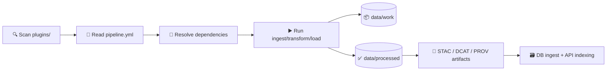

# 🧩 KFM Pipeline Plugins (`pipelines/plugins/`)


> [!NOTE]
> This folder is where **dataset-specific ETL “plugins”** live. Each plugin is a self-contained module that can be discovered & executed by the pipeline orchestrator (or run manually for one-offs). 🧪🗺️

---

## 🧭 What lives here?

A **plugin** is one dataset integration packaged as a folder:

- ✅ **metadata** (`pipeline.yml`) — name, schedule, dependencies, inputs/outputs
- ✅ **code** (`plugin.py`) — implements the ETL steps (`ingest → transform → load`)
- ✅ **tests** (`tests/`) — runs in isolation (great for CI/CD)
- ✅ **optional extras** — fixtures, notebooks, docs, per-plugin containers, etc.

---

## 🗂️ Folder layout (expected)

```text
pipelines/
  plugins/
    README.md   👈 you are here
    <plugin_id>/
      pipeline.yml
      plugin.py
      tests/
        test_plugin.py
      fixtures/               # optional: tiny input samples for tests
      docs/                   # optional: plugin runbook / assumptions
      requirements.txt        # optional: extra deps (if supported)
      Dockerfile              # optional: heavy deps (if supported)
```

> [!TIP]
> Use **kebab-case** or **snake_case** for `<plugin_id>` and keep it stable. Treat it like an API. 🔒

---

## 🧠 How plugins are discovered

Most deployments use a lightweight **orchestrator** that:

1. Scans `pipelines/plugins/**/pipeline.yml`
2. Builds a dependency graph (if declared)
3. Runs enabled plugins in order (or by schedule/config)



---

## 📦 Data staging rules (project standard)

All plugins must follow the shared data lifecycle:

- **Read from:** `../../data/raw/<domain>/…` (raw is **read-only**)
- **Write intermediates to:** `../../data/work/<domain>/…`
- **Publish final outputs to:** `../../data/processed/<domain>/…`

And when a dataset is “published”, it must generate boundary metadata artifacts:

- STAC:
  - `../../data/stac/collections/`
  - `../../data/stac/items/`
- DCAT:
  - `../../data/catalog/dcat/`
- PROV lineage:
  - `../../data/prov/`

> [!IMPORTANT]
> Raw data is sacred. **Never** mutate files under `data/raw/`. If a transform needs rewriting, write the new version into `data/work/` or `data/processed/`. 🧼

---

## ✅ Determinism & reproducibility (non-negotiable)

All official pipeline plugins must be:

- **deterministic** (same inputs + config → same outputs)
- **non-interactive** (no prompts, no manual steps)
- **idempotent** where possible (re-running should not duplicate outputs)
- **seeded** if randomness is needed (fixed seeds)

> [!WARNING]
> If you can’t reproduce it, you can’t defend it. Every layer/story/claim depends on this. 🧾⚖️

---

## 🧾 `pipeline.yml` (recommended schema)

A plugin’s `pipeline.yml` is the orchestrator contract. Keep it minimal but complete.

```yaml
id: census_1900
name: "US Census 1900 (Kansas)"
version: "0.1.0"
owner: "data-team"
description: "Ingests historical census tables and produces normalized geo-joined outputs."

# Optional scheduling metadata (orchestrator-dependent)
schedule:
  type: manual         # manual | cron | on_demand
  cron: "0 3 * * 0"     # if type=cron

# Dependencies on other plugins (by id)
depends_on:
  - admin_boundaries_1890

# Data contract (paths are repo-relative)
inputs:
  - path: "data/raw/census_1900/census_1900.csv"
outputs:
  processed:
    - path: "data/processed/demography/census_1900.parquet"
  catalogs:
    stac_collection: "data/stac/collections/demography.json"
    dcat_dataset: "data/catalog/dcat/demography-census_1900.jsonld"
    prov_bundle: "data/prov/demography-census_1900.prov.json"

# Entrypoint (how to execute the plugin)
entrypoint:
  module: "pipelines.plugins.census_1900.plugin"
  callable: "run"      # run(ctx) OR PluginClass depending on your orchestrator
```

> [!NOTE]
> The exact keys may evolve, but **the intent stays the same**: identify the plugin, declare dependencies, define inputs/outputs, and point to code. 🧩

---

## 🧑‍💻 `plugin.py` (minimal patterns)

### Option A: Functional entrypoint (simple)
```python
def run(ctx):
    """
    ctx: run context provided by orchestrator (config, logger, paths, env)
    """
    ingest(ctx)
    transform(ctx)
    load(ctx)
    publish_metadata(ctx)   # STAC/DCAT/PROV
```

### Option B: Class-based plugin (scales better)
```python
class Plugin:
    id = "census_1900"

    def ingest(self, ctx): ...
    def transform(self, ctx): ...
    def load(self, ctx): ...

    def run(self, ctx):
        self.ingest(ctx)
        self.transform(ctx)
        self.load(ctx)
        self.publish(ctx)
```

> [!TIP]
> Keep core logic **pure & testable** (functions that take dataframes/arrays and return transformed data). Use I/O at the edges. 🧪

---

## 🏃 Running plugins

### 1) Run in the “full stack” dev environment (recommended)
Many KFM setups run pipelines inside the backend container so you automatically get GIS deps (GDAL, raster libs, DB drivers, etc.).

```bash
docker-compose exec api python pipelines/plugins/<plugin_id>/plugin.py
```

> [!NOTE]
> Your repo may also provide an orchestrator CLI. If it exists, prefer it over direct execution.

### 2) Run through orchestrator (typical)
Examples (adjust to your actual CLI):

```bash
python -m pipelines.orchestrator run --plugin census_1900
python -m pipelines.orchestrator run --all --changed-only
python -m pipelines.orchestrator graph --format mermaid
```

### 3) Test in isolation (CI-style)
```bash
pytest pipelines/plugins/<plugin_id>/tests -q
```

---

## 🧪 Testing & quality gates

Each plugin should include:

- **unit tests** for transforms (pure functions)
- **integration smoke test** (tiny fixture input → known output)
- **schema checks** (columns, geometry validity, CRS, etc.)
- **metadata checks** (STAC/DCAT/PROV emitted for publication)

Recommended test strategy:

- “Golden file” tests with tiny parquet/geojson snapshots in `fixtures/`
- Determinism test: run twice → outputs hash-identical

---

## 🔐 Secrets, keys, and external services

If a plugin requires credentials (APIs, private buckets, etc.):

- Never commit secrets
- Pull from `.env` / injected runtime env
- Provide a safe fallback or a clear error message
- Make the plugin **skippable** if the deployment disables it

> [!IMPORTANT]
> A plugin that can’t run without secrets must still be safe to import, lint, and test locally. 🔒

---

## 🧰 Conventions (KFM defaults)

- **CRS**: Prefer a canonical CRS for storage; reproject explicitly when needed.
- **File formats**:
  - tabular: Parquet (preferred)
  - vector: GeoParquet / GeoJSON (depending on use)
  - raster: Cloud-optimized GeoTIFF when relevant
- **Naming**:
  - plugin id: `domain_dataset_year` (example: `demography_census_1900`)
  - outputs under `data/processed/<domain>/…`
- **Logging & provenance**:
  - Every run should log inputs, versions, checksums (when feasible), and outputs.
  - Emitting PROV is part of being “published”.

---

## ✅ New plugin checklist (copy/paste)

- [ ] Create folder: `pipelines/plugins/<plugin_id>/`
- [ ] Add `pipeline.yml` (id/name/version/deps/inputs/outputs/entrypoint)
- [ ] Implement `plugin.py` with `ingest/transform/load` (or equivalent)
- [ ] Enforce **determinism** (fixed seeds, no prompts)
- [ ] Use standard staging: `data/raw → data/work → data/processed`
- [ ] Emit boundary artifacts: **STAC + DCAT + PROV**
- [ ] Add `tests/` with fixtures + golden outputs
- [ ] Verify re-run idempotency (no duplicate outputs)
- [ ] Document assumptions + sources in `docs/` (optional but encouraged)

---

## 🧯 Troubleshooting

<details>
  <summary><b>Common issues (click to expand)</b></summary>

- **Permission errors writing to `data/`**  
  If running in Docker, ensure volumes are writable and your container user matches host permissions.

- **“It worked on my machine” GIS deps**  
  Run inside the container that has GDAL/raster libs, or use a plugin-specific Dockerfile.

- **Non-deterministic output diffs**  
  Check time-based defaults, random seeds, non-stable sorting, locale/encoding, floating precision.

- **Catalog artifacts missing**  
  Data isn’t “published” until STAC/DCAT/PROV artifacts are written to the canonical paths.

</details>

---

## 🔗 Related docs (repo-relative)

- `../README.md` — pipelines overview (if present)
- `../../docs/data/` — domain runbooks (recommended per dataset/domain)
- `../../data/` — raw/work/processed/cat/prov layout

---

🧩 **Bottom line:** plugin folders are the unit of scale. Add a new dataset by adding a new plugin, not by expanding a monolithic script pile. 🚀

