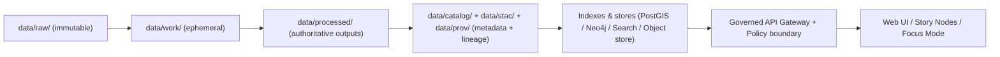

# pipelines/scripts


Operational scripts that **run** and **support** KFM ETL + simulation pipelines in a governed, reproducible way.

> [!IMPORTANT]
> Treat every script in this folder as a **governed interface** into the KFM “truth path”.  
> If it can change the state of `data/processed/`, catalogs, or databases, it MUST be deterministic, auditable, and fail-closed.

---

## What this folder is

This folder contains **thin wrappers** and **operational helpers** used to:

- run pipeline entrypoints consistently (local dev / CI / batch backfills)
- generate/validate catalog + provenance artifacts (STAC/DCAT/PROV)
- enforce promotion gates (Raw → Work → Processed) with checksums + metadata
- seed/dev-smoke minimal data (where allowed)
- standardize logging, run IDs, and outputs across pipelines

### What this folder is *not*

- ❌ a dumping ground for one-off experiments  
- ❌ a place for “quick fixes” that bypass catalogs/provenance  
- ❌ a place for business logic (that belongs in pipeline modules, not wrappers)

---

## KFM truth path reminder

KFM scripts must preserve the canonical flow (do **not** shortcut this):



> [!NOTE]
> **Raw is write-once evidence**. Pipelines read from `data/raw/` but must never mutate it.  
> Promotion to `data/processed/` must include catalogs + provenance (STAC/DCAT/PROV) and checksums.

---

## Folder layout

Actual contents will vary by implementation stage. The recommended structure below keeps scripts small, testable, and discoverable:

```text
pipelines/
  scripts/
    README.md                 # you are here
    lib/                      # shared helpers (arg parsing, logging, run-id, checksums)
      kfm_env.sh
      kfm_run_id.py
      kfm_log.py
      kfm_checksums.py
    run/                      # entrypoint wrappers (invoke pipeline modules)
      run_dataset.sh
      run_pipeline.py
    validate/                 # catalog + schema + policy validation helpers
      validate_catalogs.py
      validate_processed_layout.sh
    publish/                  # promotion helpers (work -> processed, emit catalogs)
      promote_dataset.py
    dev/                      # local-only smoke/seed tools (must be clearly labeled)
      seed_minimal_demo.py
```

> [!TIP]
> Keep scripts here **thin**:
> - shell/python argument parsing ✅
> - environment wiring ✅
> - calling pipeline modules ✅
> - emitting run metadata ✅  
> but **no transformation logic** here.

---

## Script contract (required)

Every script that can affect outputs MUST follow these rules.

### CLI behavior

- `--help` must exist and be accurate.
- `--dry-run` must exist for anything that writes to `data/processed/`, catalogs, or DBs.
- destructive actions require an explicit `--yes` (or similar) **and** print the exact targets.
- non-zero exit code on validation failure (fail-closed).

### Determinism + reproducibility

- Outputs must be reproducible given:
  - identical raw inputs (same checksums)
  - same script version (commit)
  - same parameters/config
- Always compute checksums for inputs + promoted outputs.
- Never embed nondeterministic timestamps into filenames (timestamps belong in metadata).

---

## Run metadata & observability

Scripts must emit run metadata in a machine-readable form (JSON line recommended):

### Required run fields

| Field | Type | Example | Notes |
|---|---:|---|---|
| `run_id` | string | `soil_ks_2026-02-16_3f2a9c1` | Deterministic-ish, stable naming |
| `dataset_id` | string | `ks-soil-survey` | Canonical dataset identifier |
| `pipeline` | string | `soil.normalize.v1` | Pipeline module/entry name |
| `env` | string | `dev` / `staging` / `prod` | Drives policy + storage targets |
| `commit_sha` | string | `a1b2c3d` | Git commit used to produce outputs |
| `started_at` | ISO8601 | `2026-02-16T14:03:11Z` | |
| `ended_at` | ISO8601 | `2026-02-16T14:09:02Z` | |
| `status` | enum | `success` / `failed` | |
| `inputs` | object | `{...}` | raw manifests + checksums |
| `outputs` | object | `{...}` | processed assets + checksums |

### Example log lines

```json
{"event":"run.start","run_id":"ks-soil_2026-02-16_3f2a9c1","dataset_id":"ks-soil","pipeline":"soil.normalize.v1","env":"dev","commit_sha":"a1b2c3d","started_at":"2026-02-16T14:03:11Z","dry_run":true}
{"event":"run.end","run_id":"ks-soil_2026-02-16_3f2a9c1","status":"success","ended_at":"2026-02-16T14:09:02Z","outputs":{"processed":["data/processed/soils/ks_soil.parquet"]}}
```

> [!IMPORTANT]
> The **same** `run_id` must be written into:
> - STAC Item/Collection properties (where applicable)
> - PROV activity bundle (always for promoted artifacts)
> - any dataset-version record / manifest

---

## Output contract: where scripts can read/write

### Read-only zones

- `data/raw/**` is immutable evidence (never modify)
- any vendor/third-party “source dump” should stay under `data/raw/<source>/...`

### Writable zones (expected)

- `data/work/**` (or temp volume)  
  - scratch space for intermediate artifacts
  - can be deleted/recomputed
- `data/processed/**`  
  - authoritative processed outputs
- `data/stac/**`  
  - STAC Items/Collections
- `data/catalog/**` (e.g., DCAT)  
  - dataset discovery layer
- `data/prov/**` (or `data/provenance/**` depending on repo conventions)  
  - PROV lineage bundles

> [!NOTE]
> If your branch uses `data/provenance/` instead of `data/prov/`, **don’t create a second folder name**.  
> Use what exists in the repo and keep it consistent.

---

## Running scripts

### Local (direct)

From repo root:

```bash
# list scripts
ls -la pipelines/scripts

# run a python wrapper (example)
python pipelines/scripts/run/run_pipeline.py --help
```

### Local (Docker Compose style dev stack)

If your dev stack runs an API container with the repo mounted:

```bash
# open a shell in the api container
docker-compose exec api bash

# then run a pipeline entrypoint or a wrapper
python pipelines/scripts/run/run_pipeline.py --dataset-id ks-soil --dry-run
```

> [!TIP]
> Prefer running inside the same container image used by CI to reduce “works on my machine” drift.

---

## CI usage patterns

Scripts in this folder are expected to be called by CI workflows for:

- catalog/profile validation (STAC/DCAT/PROV)
- schema + geometry validity checks
- checksums/manifest verification
- smoke pipeline runs on tiny fixtures (dev-only datasets)

**Rule of thumb:** if CI can’t run it non-interactively, it’s not a pipeline script.

---

## Adding a new script

### Step-by-step

1. Put transformation logic in a pipeline module (not in `pipelines/scripts/`).
2. Add a thin wrapper here that:
   - parses args
   - loads config / env
   - calls module entrypoint
   - emits run metadata
   - exits fail-closed on any validation failure
3. Update this README (or a sibling README in the subfolder) with:
   - purpose
   - example invocation
   - outputs + where they land

### Definition of Done

- [ ] `--help` and `--dry-run` work as expected
- [ ] writes **no** files outside approved zones
- [ ] produces deterministic manifests + checksums for promoted artifacts
- [ ] emits/updates required catalogs (DCAT always; STAC/PROV as applicable)
- [ ] produces a PROV activity that links raw → processed outputs
- [ ] has a smoke test path (tiny fixture or mocked connector)
- [ ] fails closed (non-zero exit) when validation/policy checks fail
- [ ] does not print secrets; uses env vars / vault in runtime

---

## Security & sensitivity guardrails

> [!WARNING]
> Some sources may include **sensitive-location** or otherwise restricted fields.
> Scripts MUST support redaction as a first-class transformation and must label outputs for policy enforcement.

Minimum expectations:

- never commit secrets
- do not log tokens/credentials
- if you handle sensitive locations:
  - reduce precision and/or redact fields
  - record the redaction in PROV + dataset notes
  - require governance review before promotion/publish

---

## Templates

<details>
<summary><strong>Bash wrapper template</strong> (strict mode + dry-run)</summary>

```bash
#!/usr/bin/env bash
set -euo pipefail

DRY_RUN=0
YES=0
DATASET_ID=""

while [[ $# -gt 0 ]]; do
  case "$1" in
    --dataset-id) DATASET_ID="$2"; shift 2 ;;
    --dry-run) DRY_RUN=1; shift ;;
    --yes) YES=1; shift ;;
    -h|--help)
      echo "Usage: $0 --dataset-id <id> [--dry-run] [--yes]"
      exit 0
      ;;
    *) echo "Unknown arg: $1" >&2; exit 2 ;;
  esac
done

if [[ -z "${DATASET_ID}" ]]; then
  echo "Missing --dataset-id" >&2
  exit 2
fi

# TODO: call into a real pipeline module entrypoint here
echo "{\"event\":\"run.start\",\"dataset_id\":\"${DATASET_ID}\",\"dry_run\":${DRY_RUN}}"

if [[ "${DRY_RUN}" -eq 1 ]]; then
  echo "DRY RUN: would run dataset ${DATASET_ID}"
else
  if [[ "${YES}" -ne 1 ]]; then
    echo "Refusing to write without --yes" >&2
    exit 3
  fi
  echo "RUN: executing dataset ${DATASET_ID}"
fi

echo "{\"event\":\"run.end\",\"dataset_id\":\"${DATASET_ID}\",\"status\":\"success\"}"
```

</details>

<details>
<summary><strong>Python wrapper template</strong> (argparse + JSON logs)</summary>

```python
#!/usr/bin/env python3
import argparse
import json
import sys
from datetime import datetime, timezone

def utc_now() -> str:
    return datetime.now(timezone.utc).isoformat().replace("+00:00", "Z")

def main() -> int:
    p = argparse.ArgumentParser(description="KFM pipeline wrapper (thin).")
    p.add_argument("--dataset-id", required=True)
    p.add_argument("--dry-run", action="store_true")
    p.add_argument("--yes", action="store_true", help="required for non-dry-run writes")
    args = p.parse_args()

    print(json.dumps({
        "event": "run.start",
        "dataset_id": args.dataset_id,
        "dry_run": args.dry_run,
        "started_at": utc_now(),
    }))

    if (not args.dry_run) and (not args.yes):
        print("Refusing to write without --yes", file=sys.stderr)
        return 3

    # TODO: import and call real pipeline module entrypoint here
    # from pipelines.soil.normalize import run
    # run(dataset_id=args.dataset_id, dry_run=args.dry_run)

    print(json.dumps({
        "event": "run.end",
        "dataset_id": args.dataset_id,
        "status": "success",
        "ended_at": utc_now(),
    }))
    return 0

if __name__ == "__main__":
    raise SystemExit(main())
```

</details>
