# 🧪 `pipelines/simulations/` — Scenario Models & Synthetic Layers


This folder contains **simulation pipelines** that generate **“created” data** (projections, what‑ifs, derived synthetic layers) to support Kansas Frontier Matrix (KFM) analysis and storytelling.

KFM is explicitly designed as a **pipeline → catalog → database → API → UI** system, where **pipelines are the only legal way** new data enters the platform. Every output must be **documented and traceable**. :contentReference[oaicite:0]{index=0}

---

## 🎯 What belongs here?

✅ **Belongs here**
- Scenario projections (e.g., climate scenario deltas, crop yield projections, settlement expansion, wildfire risk, drought indices).
- Model-based derived layers built from existing curated baselines.
- Batch “what-if” runs that produce publishable artifacts (GeoJSON/Parquet/GeoTIFF) with full metadata + lineage. :contentReference[oaicite:1]{index=1}

🚫 **Does NOT belong here**
- One-off exploratory notebooks with manual steps (move those to research/scratch space).
- Interactive prompts or “choose an option” scripts (official pipelines must run end-to-end unattended). :contentReference[oaicite:2]{index=2}
- Manual edits to `data/raw/` (raw inputs are read-only evidence). :contentReference[oaicite:3]{index=3}

---

## 🧠 Core rules (non‑negotiable)

### 1) Deterministic + reproducible 🧬
- **Same inputs + same config = byte-identical outputs**.
- If randomness is used (Monte Carlo, sampling, ML), it **must** be controlled with explicit seeds.
- No interactive prompts; no manual steps in official pipelines. :contentReference[oaicite:4]{index=4}

### 2) Respect the KFM data contract 📦
Pipelines follow the standard contract:
1. **Read** immutable inputs from `data/raw/` (and/or curated baselines from `data/processed/`)
2. **Transform / simulate**
3. **Write** outputs to `data/processed/`
4. **Update**:
   - `data/catalog/` (STAC / DCAT)
   - `data/provenance/` (W3C PROV / lineage logs)  
   This is a hard requirement, and missing it is CI-rejectable. :contentReference[oaicite:5]{index=5}:contentReference[oaicite:6]{index=6}

### 3) “Created data” requires extra care 🛡️
Simulation outputs may be **staged for review** rather than auto-published. A recommended pattern is producing outputs + opening a **draft PR** so maintainers can inspect and compare results before merge. :contentReference[oaicite:7]{index=7}

---

## 🗂️ Suggested folder layout (template)

> This is a **recommended** structure to keep simulations composable, testable, and orchestratable.

```text
📁 tests/
└─ 📁 data/                                        🧪 data-oriented test lane (fixtures + goldens)
   ├─ 📁 fixtures/                                   🧰 self-contained fixture sets (end-to-end data truth files)
   │  ├─ 📁 kfm_minimal/                              ✅ one minimal fixture set (golden “known good”)
   │  │  ├─ 📁 raw/                                   🧾 immutable source inputs
   │  │  │  └─ 📁 <domain>/                            🧭 e.g., historical/, hydrology/, air-quality/
   │  │  ├─ 📁 work/                                  🧪 intermediate artifacts (optional but supported)
   │  │  │  └─ 📁 <domain>/
   │  │  ├─ 📁 processed/                              ✅ golden processed outputs (expected pipeline results)
   │  │  │  └─ 📁 <domain>/
   │  │  ├─ 📁 stac/                                  🛰️ STAC geospatial catalog fixtures
   │  │  │  ├─ 📁 collections/                         🧩 STAC Collections
   │  │  │  └─ 📁 items/                               📦 STAC Items
   │  │  ├─ 📁 catalog/                                🗂️ DCAT discovery fixtures
   │  │  │  └─ 📁 dcat/                                 🧾 DCAT dataset entries (JSON-LD)
   │  │  ├─ 📁 prov/                                   🧬 PROV lineage bundles (JSON/JSON-LD)
   │  │  ├─ 📁 db/                                     ◻️ optional: PostGIS/Neo4j seeds (integration helpers)
   │  │  └─ 📄 README.md                                📘 fixture runbook (“what this set proves”)
   │  └─ 📁 <another_fixture_set>/                      ➕ additional fixture sets (same structure)
   │
   ├─ 📁 snapshots/                                   📸 golden responses (contract-level truth files)
   │  ├─ 📁 api/                                       🌐 golden HTTP responses (REST contract tests)
   │  └─ 📁 graphql/                                   🕸️ golden GraphQL responses (if used)
   │
   └─ 📁 generated/                                   ◻️ optional: test outputs (should be gitignored)
```

---

## 🔁 Simulation pipeline lifecycle (the “happy path”)

```mermaid
flowchart LR
  A["📥 data/raw/ + baseline processed inputs"] --> B["🧪 simulate (seeded, deterministic)"]
  B --> C["📦 data/processed/simulations/... outputs"]
  C --> D["🗂️ data/catalog/... STAC/DCAT records"]
  C --> E["🧬 data/provenance/... PROV lineage logs"]
  D --> F["✅ review / CI checks"]
  E --> F
  F --> G["🚀 merge then publish via API/UI"]
```



Reproducibility is a cornerstone: the repository should be able to regenerate outputs from scratch (given identical inputs/config). :contentReference[oaicite:8]{index=8}

---

## 📥 Inputs & 📤 Outputs (naming + conventions)

### Inputs
- **Evidence inputs**: `data/raw/<source>/...` (never modified by pipelines). :contentReference[oaicite:9]{index=9}
- **Baseline curated inputs**: `data/processed/<domain>/...` (preferred for simulations; treat as stable baselines)

### Outputs
Write simulation products under:

```text
data/processed/simulations/<sim_name>/<scenario_id>/<version_or_date>/...
```

**Examples**
- `data/processed/simulations/crop_yield/+2C_2050/v1/yield_2050.geojson`
- `data/processed/simulations/climate/rcp85_2050/v3/temp_delta_2050.tif`

The blueprint explicitly calls out that simulations may output vector or raster products into `data/processed/...` and must include provenance describing **model version + parameters**. :contentReference[oaicite:10]{index=10}

---

## 🧬 Provenance & metadata requirements (STAC/DCAT + PROV)

### ✅ Required artifacts per simulation run
| Artifact | Location | Purpose |
|---|---|---|
| Simulation output(s) | `data/processed/simulations/...` | Deliverable data |
| STAC Item/Collection | `data/catalog/...` | Spatial/temporal extent + licensing + discovery |
| DCAT dataset record (optional but recommended) | `data/catalog/...` | Portal-friendly dataset metadata |
| PROV lineage log | `data/provenance/...` | Exactly how outputs were derived |

KFM expects provenance logs to capture **entities (inputs/outputs), activities (pipeline run), agents (script + human trigger)** and may include parameters, notes, and citations. :contentReference[oaicite:11]{index=11}

### 🧾 Minimal PROV fields (recommended)
- `inputs[]`: raw/baseline paths + checksums
- `outputs[]`: produced files + checksums
- `activity`: `pipeline_name`, timestamp, runtime info
- `software_agent`: git commit hash / script hash
- `parameters`: scenario + model knobs
- `citations[]`: papers/specs used by model
- `determinism`: seed + RNG library versions

> Tip: pipelines should also avoid duplicating unchanged runs (checksums/version checks) when re-run. :contentReference[oaicite:12]{index=12}

---

## 🧱 Recommended “plugin” interface (future-proofing)

KFM is moving toward a **plugin-based ETL framework**: each data integration becomes a **self-contained module** with a standard interface (e.g., `ingest()`, `transform()`, `load()`), discoverable by an orchestrator (config/schedule driven). :contentReference[oaicite:13]{index=13}

For simulations, use the same spirit—keep it modular so orchestration is easy later.

### Suggested Python contract
```python
class SimulationPlugin:
    name: str
    version: str

    def inputs(self, cfg) -> list[str]: ...
    def run(self, cfg) -> list[str]: ...          # returns output file paths
    def write_metadata(self, cfg, outputs) -> None: ...
    def write_provenance(self, cfg, outputs) -> None: ...
    def validate(self, cfg, outputs) -> None: ...
```

---

## 🚀 Running a simulation (local)

> Your repository may expose an orchestrator/CLI in the future; until then, each sim should remain runnable directly.  
> Pipelines must run start-to-finish with **no prompts**. :contentReference[oaicite:14]{index=14}

### Example (pattern)
```bash
# from repo root
python pipelines/simulations/crop_yield_2050/run.py --config pipelines/simulations/crop_yield_2050/sim.yml
```

### Scenario sweep (pattern)
```bash
python pipelines/simulations/crop_yield_2050/run.py --config scenarios/+2C_2050.yml
python pipelines/simulations/crop_yield_2050/run.py --config scenarios/+3C_2050.yml
```

---

## ✅ Definition of Done (DoD) checklist

Before opening a PR, confirm:

- [ ] Simulation is **deterministic** (seeded, stable ordering, no hidden randomness). :contentReference[oaicite:15]{index=15}
- [ ] Reads from `data/raw/` and/or `data/processed/` **without modifying inputs**. :contentReference[oaicite:16]{index=16}
- [ ] Outputs written to `data/processed/simulations/...` in a stable structure. :contentReference[oaicite:17]{index=17}
- [ ] STAC/DCAT metadata updated/created in `data/catalog/`. :contentReference[oaicite:18]{index=18}
- [ ] PROV lineage log written to `data/provenance/` with params + script version. :contentReference[oaicite:19]{index=19}
- [ ] Validation checks run (schema, ranges, nulls, spatial ref). :contentReference[oaicite:20]{index=20}
- [ ] For “created data”, outputs are staged for review (ideally draft PR). :contentReference[oaicite:21]{index=21}

---

## 🧪 Suggested validation patterns

Keep validation cheap, deterministic, and automatable:

- **Schema checks**: required columns, types, CRS.
- **Range checks**: plausible min/max (e.g., yield cannot be negative).
- **Spatial checks**: geometry validity, bounds intersect Kansas region, CRS is correct.
- **Diff sanity**: if re-run unchanged, outputs should be identical (or pipeline should short-circuit). :contentReference[oaicite:22]{index=22}

---

## 🧩 Notes on performance & scaling (optional, but useful)

If simulations become heavy (large rasters, long time series, many scenarios):
- Prefer columnar formats (Parquet) and chunked compute.
- Build intermediate aggregates where it improves interactive exploration in the UI. :contentReference[oaicite:23]{index=23}
- Consider pipeline designs that support high-ingestion or spatiotemporal processing pipelines when needed. :contentReference[oaicite:24]{index=24}

---

## 📚 Project references (design sources)

- 📘 **KFM Comprehensive Technical Blueprint** (pipelines + simulations + provenance requirements)  
  :contentReference[oaicite:25]{index=25} :contentReference[oaicite:26]{index=26} :contentReference[oaicite:27]{index=27}
- 🧾 **Spatiotemporal processing pipeline patterns** (high-volume pipelines + visualization-oriented workflows)  
  :contentReference[oaicite:28]{index=28} :contentReference[oaicite:29]{index=29}
- ⏱️ **Time-oriented visualization & analysis patterns** (useful when designing scenario comparisons in UI)  
  :contentReference[oaicite:30]{index=30}
- 🛰️ **Cloud Remote Sensing w/ Google Earth Engine** (if simulations need on-demand Earth observation inputs)  
  :contentReference[oaicite:31]{index=31}

---

## 🧭 Next steps (recommended)

1. 🧰 Add `_template_sim/` scaffolding (config + run + model + tests).
2. 🧪 Add a **determinism test harness** (rerun twice → compare file hashes).
3. 📦 Add a shared helper to emit:
   - STAC Item/Collection stubs
   - PROV JSON stubs
4. 🔌 Align simulation modules with the plugin-based orchestration direction. :contentReference[oaicite:32]{index=32}

