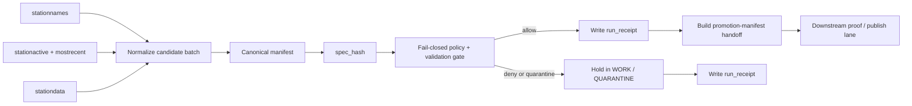

<!-- [KFM_META_BLOCK_V2]
doc_id: kfm://doc/NEEDS-VERIFICATION
title: pipelines/soil-moisture-watch
type: standard
version: v1
status: draft
owners: NEEDS-VERIFICATION
created: YYYY-MM-DD
updated: YYYY-MM-DD
policy_label: NEEDS-VERIFICATION
related: [../README.md, ../../data/receipts/README.md, ../../data/proofs/README.md, ../../policy/README.md, ../../schemas/README.md, ../../tests/README.md]
tags: [kfm, pipelines, soil-moisture, mesonet, watcher, receipts, spec_hash]
notes: [Target path was user-specified; mounted subtree, ownership, dates, and exact downstream link validity remain NEEDS-VERIFICATION in the current session.]
[/KFM_META_BLOCK_V2] -->

<a id="top"></a>

# pipelines/soil-moisture-watch/

Watcher-first Kansas Mesonet soil-moisture intake lane for deterministic candidate batches, fail-closed policy evaluation, receipt emission, and promotion-manifest handoff.

> [!NOTE]
> **Status:** experimental  
> **Owners:** `NEEDS-VERIFICATION`  
>       
> **Quick jumps:** [Scope](#scope) · [Repo fit](#repo-fit) · [Accepted inputs](#accepted-inputs) · [Exclusions](#exclusions) · [Flow](#flow) · [Source surfaces and roles](#source-surfaces-and-roles) · [Contract surfaces](#contract-surfaces) · [Validation and policy gates](#validation-and-policy-gates) · [Task list](#task-list) · [Open questions](#open-questions)

| Field | Value |
|---|---|
| Path | `pipelines/soil-moisture-watch/` |
| Role | `observe → normalize → spec_hash → policy gate → run_receipt → promotion-manifest handoff` |
| Posture | `fail-closed · watcher-first · receipt/proof/catalog separated` |
| Lane class | Narrow Mesonet soil-moisture watcher inside the broader hydrology / soils expansion field |
| Primary watched source | Kansas Mesonet |
| Adjacent future context | SCAN / SMAP / ET / broader hydrology joins are separate or future-expansion concerns unless explicitly admitted |
| Current evidence posture | Doctrine is strong; mounted workflow, subtree, schema-home, and signing-path proof remain bounded |

---

## Scope

This lane exists to turn **Kansas Mesonet soil-moisture observations** into a governed release candidate without collapsing observation, proof, and publication into one step.

It is responsible for:

- observing Mesonet roster, liveness, and observation surfaces
- normalizing one candidate batch into a deterministic shape
- deriving a stable `spec_hash`
- evaluating fail-closed policy against the normalized candidate
- emitting a compact `run_receipt`
- preparing a promotion-manifest handoff for downstream proof and release work

It is **not** the place where outward public truth is declared. This directory is the lane where a candidate becomes inspectable enough to hand off.

> [!IMPORTANT]
> Keep **receipt ≠ proof ≠ catalog** visible in the implementation. This lane should emit the first one and prepare the handoff for the others.

### Current evidence posture

| Surface | Status | Why it matters |
|---|---|---|
| Kansas Mesonet as a viable soil-moisture connector | **CONFIRMED** | The corpus repeatedly treats Mesonet as a real source surface for soil-moisture context. |
| Soil-moisture watch as a tractable watcher lane | **INFERRED / PROPOSED** | The corpus strongly supports Mesonet-based watcher logic, but this exact mounted path was not directly surfaced. |
| `manifest → spec_hash → policy gate → run_receipt → promotion` choreography | **TECHNICALLY VALIDATED / PROPOSED** | The April 2026 packet family makes this flow concrete enough to document. |
| Exact workflow filename, scheduler owner, storage layout, schema path, and signing mechanics under this directory | **NEEDS VERIFICATION** | Current-session evidence was PDF-rich rather than repo-mounted. |

[Back to top](#top)

---

## Repo fit

This directory sits at the seam between **source admission**, **deterministic candidate preparation**, and **downstream release-proof handling**.

| Direction | Surface | Relationship |
|---|---|---|
| Upstream | [`../README.md`](../README.md) | Parent pipelines surface for neighboring lane conventions. |
| Upstream | [`../../docs/patterns/dataset_watch.md`](../../docs/patterns/dataset_watch.md) | Intended watcher-pattern home if that repo surface exists as drafted. |
| Downstream | [`../../data/receipts/README.md`](../../data/receipts/README.md) | Compact run/process-memory outputs belong there. |
| Downstream | [`../../data/proofs/README.md`](../../data/proofs/README.md) | Release-grade proof objects belong there, not here. |
| Downstream | [`../../policy/README.md`](../../policy/README.md) | Fail-closed decision logic should live there. |
| Downstream | [`../../schemas/README.md`](../../schemas/README.md) | Shared schema authority belongs there once first-wave objects are published. |
| Downstream | [`../../tests/README.md`](../../tests/README.md) | Replay, negative fixtures, and policy checks should land there. |

> [!TIP]
> Keep this lane narrow: **watch and prepare** here, **prove and publish** downstream.

If this lane is later folded into a broader hydrology watcher, preserve the **Mesonet-specific** source-role, rights, and automation constraints instead of flattening them into a generic hydrology source.

[Back to top](#top)

---

## Accepted inputs

The current corpus safely supports the following inputs for this lane.

| Input surface | Purpose | Status |
|---|---|---|
| Kansas Mesonet `/rest/stationnames` | Station roster and identity surface | **CONFIRMED** |
| Kansas Mesonet `/rest/stationactive` | Activity-window / freshness context | **CONFIRMED** |
| Kansas Mesonet `/rest/mostrecent` | Last-observation / liveness context | **CONFIRMED** |
| Kansas Mesonet `/rest/stationdata` | Primary watched soil-moisture observation batch | **CONFIRMED** |
| Soil-moisture documentation / variable lists | Interpreting variable names, depths, and units | **CONFIRMED** |
| `SourceDescriptor` | Source identity, cadence, role, rights, and allowed automation posture | **PROPOSED** |
| Canonicalization rules | Stable batch identity before hashing | **TECHNICALLY VALIDATED direction** |
| Policy label + validation inputs | Fail-closed release-decision input | **CONFIRMED doctrine** / exact fields **NEEDS VERIFICATION** |
| SCAN / SMAP / ET or broader hydroclimate corroboration | Future validation or fusion context only | **PROPOSED future expansion** |

### What belongs here

- candidate Mesonet batches or snapshots that can be normalized deterministically
- roster, freshness, and most-recent metadata needed to interpret the batch honestly
- source-role metadata that explains what the Mesonet surface means
- release-candidate objects that remain reviewable and reversible
- explicit station-health or anomaly summaries when the lane computes them

> [!WARNING]
> **Kansas Mesonet is a viable public connector, not a free-for-all ingestion surface.** Treat automation against Mesonet as policy-bearing design work, not unconstrained scraping.

---

## Exclusions

This lane does **not**:

- publish catalog artifacts by itself
- replace policy ownership
- replace release-proof validation
- silently promote on schema drift
- redefine schema authority
- act as the final proof store
- collapse **receipts**, **proofs**, and **catalog** objects into one file
- silently broaden from **soil moisture watch** into a general hydrology watch
- silently widen into **ET**, **crop stress**, **satellite fusion**, or **model-assimilated moisture** without an explicit contract expansion
- imply live scheduler, workflow, storage, or signing integration unless those surfaces are directly verified in-repo

[Back to top](#top)

---

## Directory tree

Exact mounted contents under this directory were **not** surfaced in the current session. The only safe tree claim is the target document itself.

```text
pipelines/soil-moisture-watch/
└── README.md  # target lane document (mounted presence beyond this file still NEEDS VERIFICATION)
```

If this directory already contains code, fixtures, or workflow helpers, add them here only after direct repo inspection.

---

## Quickstart

Use this sequence when turning the lane from a draft contract into a real thin slice.

1. Define a `SourceDescriptor` for **Kansas Mesonet** that makes cadence, source role, rights posture, and acceptable automation explicit.
2. Pull one reviewable batch using the roster/liveness/observation surfaces that the first slice requires.
3. Normalize the batch into a stable long-form manifest shape.
4. Compute `spec_hash` from canonicalized content.
5. Run fail-closed validation and policy checks.
6. Always write `run_receipt`, whether the candidate is allowed, denied, or quarantined.
7. Build the promotion-manifest handoff object only after the candidate passes.

Illustrative sequence only:

```text
observe
  -> normalize
  -> canonicalize
  -> spec_hash
  -> policy gate
  -> run_receipt
  -> promotion-manifest handoff
```

---

## Flow



> [!NOTE]
> This README keeps the lane-level branch language to **allow / deny / quarantine**. The broader corpus still carries an unresolved outcome-vocabulary collision that should be normalized separately rather than silently decided here.

[Back to top](#top)

---

## Source surfaces and roles

| Source surface | Lane role | Notes |
|---|---|---|
| `stationnames` | Roster / identity surface | Use to stabilize station identifiers and roster-aware diffs. |
| `stationactive` | Activity-window surface | Use for freshness reasoning and degraded-station detection. |
| `mostrecent` | Liveness surface | Use for quick health checks before treating missing data as environmental signal. |
| `stationdata` | Primary watched observation surface | Use for the actual soil-moisture batch under review. |
| Soil-moisture docs / variable references | Interpretation surface | Keep depth and variable semantics explicit rather than implied. |
| Data-usage / automation constraints | Admission-burden surface | Treat as a gating concern, not footnote metadata. |

This split matters because the lane should preserve **source-role clarity** instead of flattening roster, health, and observations into one undifferentiated “Mesonet feed.”

### Adjacent but not first-wave sources

| Surface | Relationship to this README | Status |
|---|---|---|
| SCAN | Useful corroborative in-situ comparison source | **PROPOSED future expansion** |
| SMAP | Useful gridded satellite/model context | **PROPOSED future expansion** |
| ET variables | Adjacent Mesonet expansion, but not required for first soil-moisture slice | **INFERRED / NEEDS VERIFICATION** |
| USGS Water Data / WBD / NFHL | Belong to a broader hydrology proof lane, not this narrow Mesonet-first watch by default | **Adjacent, not primary here** |

---

## First-wave variable family

The safest first slice is the one the corpus directly supports.

| Variable family | Meaning | Status |
|---|---|---|
| `VWC5CM`, `VWC10CM`, `VWC20CM`, `VWC50CM` | Volumetric water content at 5, 10, 20, and 50 cm | **CONFIRMED** |
| `PCNTSAT5CM`, `PCNTSAT10CM`, `PCNTSAT20CM`, `PCNTSAT50CM` | Percent saturation at the same depths | **CONFIRMED** |
| ET or crop-water fields | Adjacent Mesonet capabilities worth documenting later, but not assumed in the first watcher contract | **INFERRED / NEEDS VERIFICATION** |

> [!TIP]
> A clean first release should prefer **depth-explicit soil moisture** over a mixed bag of soil, ET, drought, and crop-stress semantics.

[Back to top](#top)

---

## Contract surfaces

The corpus strongly pressures a small object family here, but not every schema is directly surfaced as mounted code.

| Object | Owned here? | Purpose | Status |
|---|---|---|---|
| `SourceDescriptor` | Partially | Describes source identity, cadence, role, rights posture, and allowed automation | **PROPOSED schema wave** |
| Canonical manifest | Yes | Stable batch identity surface before release handoff | **INFERRED** |
| `spec_hash` | Yes | Deterministic identity + idempotency anchor | **TECHNICALLY VALIDATED** |
| `run_receipt` | Yes | Compact process-memory record for allow / deny / quarantine | **TECHNICALLY VALIDATED** |
| Station-health or anomaly summary | Possibly | Explicit degradation or anomaly surface for downstream review | **PROPOSED** |
| Promotion manifest | Handoff | Release candidate passed downstream | **PROPOSED** |
| Signed proofs / bundles | No | Release-grade proof surface | **Downstream responsibility** |
| Catalog objects | No | Discoverability / outward linkage | **Downstream responsibility** |

### Receipt / proof boundary

| Surface | What it is | What it is not |
|---|---|---|
| `run_receipt` | Compact record of what the watcher decided or emitted | Not the cryptographic proof bundle |
| Proof object / attestation | Verifiable release-significant trust object | Not the same thing as pipeline memory |
| Catalog entry | Outward discoverability and lineage surface | Not the same thing as validation or promotion state |

> [!IMPORTANT]
> Keep **receipt ≠ proof ≠ catalog** visible in the implementation. This lane should emit the first one and prepare the handoff for the others.

---

## Validation and policy gates

### Confirmed lane laws

| Law | Practical consequence here |
|---|---|
| Promotion is a governed state transition, not a file move | Passing validation is necessary but not sufficient for publication. |
| Fail closed on weak support | Missing required fields or unresolved policy should stop promotion handoff. |
| `spec_hash` anchors identity | Replays and diffs should use canonical content, not ad hoc filenames. |
| Always emit a receipt | Denied and quarantined runs still need machine-readable memory. |
| Signed proof lives downstream | This lane prepares release objects; it does not pretend they are already published. |
| Source roles are not interchangeable | Roster, liveness, observations, and policy posture should not be flattened into one generic fetch. |

### Proposed first gate set

These are the safest first-wave checks to document here without inventing mounted implementation:

- required source identity present
- candidate manifest produced successfully
- `spec_hash` present and stable
- observed batch window explicit
- timestamps ordered and duplicate handling defined
- variable/depth whitelist explicit for the first slice
- station-health logic applied to `stationactive` / `mostrecent`-style evidence where used
- domain-range checks applied to the first-wave soil-moisture variables
- policy label present
- handoff object omitted when validation fails
- `run_receipt` emitted on both allow and deny paths

A good first implementation should fail for **missing manifest shape**, **missing `spec_hash`**, **missing source identity**, **missing receipt**, and **unresolved Mesonet automation posture** before it tries to do anything more ambitious.

[Back to top](#top)

---

## Task list

### Thin-slice definition of done

- [ ] one `SourceDescriptor` exists for the Kansas Mesonet soil-moisture watch
- [ ] one canonical candidate-manifest fixture exists
- [ ] one passing `run_receipt` fixture exists
- [ ] one denied or quarantined `run_receipt` fixture exists
- [ ] first-wave variable and depth whitelist is explicit
- [ ] policy rejects malformed, anonymous, or out-of-policy candidates
- [ ] direct repo evidence confirms workflow file, scheduler owner, and storage target
- [ ] mounted tests prove replayability for unchanged `spec_hash`
- [ ] receipt / proof / catalog boundaries stay explicit in code and docs
- [ ] approved automation posture for Mesonet use is documented before unattended polling begins

### Things this doc intentionally leaves open

- exact workflow filename
- exact scheduler owner
- exact storage layout below `data/raw/`, `data/work/`, `data/quarantine/`, and `data/receipts/`
- exact schema registry path for first-wave objects
- exact signing/proof bundle mechanics after handoff
- whether ET stays adjacent or becomes a first-class extension inside this lane

[Back to top](#top)

---

## FAQ

### Does this lane publish directly?

No. It prepares a candidate, emits a receipt, and hands a promotion object to downstream proof / release surfaces.

### Why keep this narrower than a general hydrology watch?

Because the Mesonet soil-moisture path carries its own source-role and automation constraints. A narrow first slice is easier to audit and less likely to blur rights, cadence, or meaning.

### Is ET part of the first contract?

Not by default in this README. ET is adjacent and potentially valuable, but the first soil-moisture slice should stay explicit and small.

### Is Kansas Mesonet treated as unconstrained public scrape infrastructure?

No. The corpus is clear that Mesonet is valuable but policy-bearing. Automation posture should stay explicit.

### Is the finite outcome grammar final?

No. The broader corpus still needs a normalization pass for outcome vocabulary. This README avoids pretending that work is finished.

---

## Open questions

- Does the mounted repo already contain a lane here, or is this target path still only a documentation request?
- Where will first-wave schemas for `SourceDescriptor`, canonical manifest, and `run_receipt` live?
- What polling cadence and batching posture are acceptable for Kansas Mesonet in the actual operating environment?
- Is the first release-bearing handoff a plain promotion manifest, a release manifest, or both?
- Should station-health and anomaly outputs live inside this lane or in a downstream analysis surface?
- Does the first published soil-moisture slice stay Mesonet-only, or is corroborative SCAN / SMAP metadata required before release?

---

## Appendix

<details>
<summary><strong>Illustrative candidate manifest</strong></summary>

These shapes are **illustrative only**. They make the lane concrete without pretending the final field names, paths, or schemas are already mounted.

```yaml
# illustrative only — final field names NEEDS VERIFICATION
source_descriptors:
  - id: kansas-mesonet-roster
    role: roster-identity
  - id: kansas-mesonet-liveness
    role: freshness-context
  - id: kansas-mesonet-stationdata
    role: primary-observation

observed_window:
  start: 2026-04-14T00:00:00Z
  end: 2026-04-14T01:00:00Z

variables:
  - VWC5CM
  - VWC10CM
  - VWC20CM
  - VWC50CM

policy_label: NEEDS-VERIFICATION
spec_hash: sha256:<digest>

artifacts:
  - kind: normalized-timeseries
    href: data/work/NEEDS-VERIFICATION
  - kind: station-health-summary
    href: data/work/NEEDS-VERIFICATION
```

</details>

<details>
<summary><strong>Illustrative normalized long-form row</strong></summary>

```yaml
# illustrative only — final field names NEEDS VERIFICATION
station_id: MANH
observed_at: 2026-04-14T01:00:00Z
measure: soil_moisture_vwc
depth_cm: 5
value: 0.21
unit: m3/m3
source_surface: stationdata
quality_flag: NEEDS-VERIFICATION
```

</details>

<details>
<summary><strong>Illustrative run receipt</strong></summary>

```yaml
# illustrative only — final field names NEEDS VERIFICATION
run_id: 2026-04-14T01:00:00Z
spec_hash: sha256:<digest>
decision: allow
reason_codes: []
quarantined: false
promotion_manifest_ref: pipelines/soil-moisture-watch/NEEDS-VERIFICATION
```

</details>

<details>
<summary><strong>Illustrative denied receipt</strong></summary>

```yaml
# illustrative only — final field names NEEDS VERIFICATION
run_id: 2026-04-14T01:05:00Z
spec_hash: sha256:<digest>
decision: deny
reason_codes:
  - missing-source-identity
quarantined: true
promotion_manifest_ref: null
```

</details>

Keep this lane small, explicit, and subordinate to the repo’s actual authority surfaces.

[Back to top](#top)
