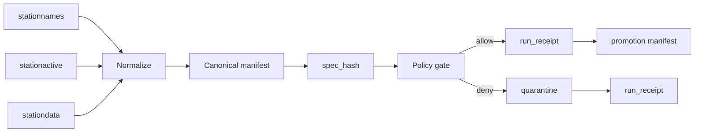

<!-- [KFM_META_BLOCK_V2]
doc_id: kfm://doc/NEEDS-VERIFICATION
title: pipelines/soil-moisture-watch
type: standard
version: v1
status: draft
owners: NEEDS-VERIFICATION
created: YYYY-MM-DD
updated: YYYY-MM-DD
policy_label: NEEDS-VERIFICATION
related: [
  ../README.md,
  ../../data/receipts/README.md,
  ../../data/proofs/README.md,
  ../../policy/README.md,
  ../../schemas/README.md,
  ../../tests/README.md
]
tags: [kfm, pipelines, soil-moisture, mesonet, watcher, receipts, spec_hash]
notes: [
  Thin-slice Mesonet soil-moisture watcher lane.
  Scheduler wiring, schema-home, and signing path remain NEEDS VERIFICATION.
]
[/KFM_META_BLOCK_V2] -->

<a id="top"></a>

# `pipelines/soil-moisture-watch/`

Watcher-first Kansas Mesonet soil-moisture intake lane for deterministic candidate batches, fail-closed policy evaluation, receipt emission, and promotion-manifest handoff.

> **Status:** experimental  
> **Owners:** NEEDS-VERIFICATION  
>    

**Quick jumps**  
[Scope](#scope) · [Repo fit](#repo-fit) · [Inputs](#accepted-inputs) · [Exclusions](#exclusions) · [Flow](#flow) · [Schema](#canonical-schema-first-wave) · [spec_hash](#deterministic-identity-spec_hash) · [Validation](#validation-and-policy-gates) · [Promotion](#promotion-rules)

---

## Scope

This lane converts **Kansas Mesonet soil-moisture observations** into a deterministic, policy-evaluated candidate dataset.

It is intentionally **Mesonet-first**, but MUST remain compatible with future multi-source integration.

### Responsibilities

- observe roster, liveness, and observations
- normalize candidate batches deterministically
- compute `spec_hash`
- enforce fail-closed policy
- emit `run_receipt`
- prepare promotion handoff

> [!IMPORTANT]
> This lane prepares candidates. It does **not** publish truth.

[Back to top](#top)

---

## Repo fit

| Direction | Surface | Role |
|----------|--------|------|
| Upstream | `../README.md` | pipeline conventions |
| Downstream | `../../data/receipts/` | run receipts |
| Downstream | `../../data/proofs/` | release proofs |
| Downstream | `../../policy/` | policy enforcement |
| Downstream | `../../schemas/` | schema authority |
| Downstream | `../../tests/` | replay + fixtures |

---

## Accepted inputs

| Surface | Purpose | Status |
|--------|--------|--------|
| `/rest/stationnames` | roster | CONFIRMED |
| `/rest/stationactive` | freshness | CONFIRMED |
| `/rest/mostrecent` | liveness | CONFIRMED |
| `/rest/stationdata` | observations | CONFIRMED |

> [!NOTE]
> Mesonet-only for now. All schema and hashing MUST remain forward-compatible.

---

## Exclusions

This lane does **not**:

- publish catalog artifacts  
- generate proof bundles  
- redefine schema authority  
- silently promote  
- collapse receipt / proof / catalog  

---

## Directory tree

```text
pipelines/soil-moisture-watch/
└── README.md
```

---

## Quickstart

1. Pull Mesonet batch  
2. Normalize to canonical schema  
3. Compute `spec_hash`  
4. Run validation + policy  
5. Emit `run_receipt`  
6. Build promotion manifest (if allowed)

---

## Flow



---

## Canonical schema (first-wave)

```yaml
station_id: string
source: mesonet
lat: float
lon: float
depth_cm: number
measure: soil_moisture_vwc
value: number
unit: m3/m3
timestamp_iso: ISO-8601 UTC
qc_flag: string
schema_ver: integer
```

### Rules

- moisture → `m3/m3`
- depth → `cm`
- timestamps → UTC ISO
- one row per (station, depth, time)

---

## Deterministic identity (spec_hash)

The `spec_hash` defines dataset identity.

### MUST include

- normalized rows (ordered)
- station roster snapshot
- variable whitelist
- transform version
- source descriptor

### MUST exclude

- filenames  
- runtime timestamps  
- scheduler artifacts  

> [!IMPORTANT]
> A changed `spec_hash` = a changed dataset.

---

## Validation and policy gates

### Fail-closed rules

- missing required fields  
- missing `spec_hash`  
- invalid domain values  
- missing source identity  
- unresolved policy label  

### Domain constraint

```text
0.0 ≤ soil moisture ≤ 0.6 m3/m3
```

### Requirement

- always emit `run_receipt`
- fail closed on uncertainty

---

## Anomaly and outage detection

| event_type | meaning |
|-----------|--------|
| new_reading | valid observation |
| station_outage | missing data |
| degraded_signal | stale readings |
| anomaly_detected | out-of-range |

---

## Promotion rules

Promotion occurs ONLY when:

| Condition | Description |
|----------|------------|
| spec_hash changed | dataset changed |
| new station | roster change |
| anomaly/outage | visibility required |
| schema change | contract evolution |

### No promotion if

- identical spec_hash  
- validation fails  
- incomplete normalization  

---

## Map-first output bridge

Outputs MUST support downstream tiling.

Required fields:

- lat/lon  
- timestamp_iso  
- depth_cm  
- value  
- qc_flag  

---

## Task list

- [ ] define SourceDescriptor  
- [ ] implement canonical schema  
- [ ] compute spec_hash  
- [ ] emit receipts  
- [ ] implement validation gates  
- [ ] confirm scheduler wiring  
- [ ] add replay tests  

---

## FAQ

### Does this publish data?
No. It prepares candidates.

### Why Mesonet-only?
To maintain auditability before expansion.

### Is ET included?
No.

---

## Appendix

<details>
<summary><strong>Example run receipt</strong></summary>

```yaml
run_id: 2026-04-15T14:00:00Z
spec_hash: sha256:abc123
decision: allow
quarantined: false
```

</details>

---

[Back to top](#top)
