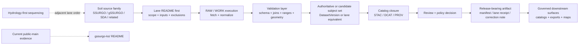

<!-- [KFM_META_BLOCK_V2]
doc_id: kfm://doc/<uuid>
title: Soils Pipelines
type: standard
version: v1
status: draft
owners: @bartytime4life (global fallback via CODEOWNERS); <lane-specific owner NEEDS VERIFICATION>
created: YYYY-MM-DD
updated: YYYY-MM-DD
policy_label: public
related: [../README.md, ./gssurgo-ks/README.md, ../../README.md, ../../.github/README.md, ../../docs/domains/soils/README.md, ../../docs/domains/hydrology/README.md, ../../contracts/README.md, ../../policy/README.md, ../../schemas/README.md, ../../tests/README.md, ../../data/README.md]
tags: [kfm, pipelines, soils]
notes: [New parent README for a currently minimal public-main subtree; doc_id and dates need confirmation before merge; narrower /pipelines/soils ownership remains unverified.]
[/KFM_META_BLOCK_V2] -->

# Soils Pipelines

Lane-level execution index for Kansas soils ingestion, validation, packaging, and publish-safe pipeline docs.

> [!IMPORTANT]
> **Status:** Experimental  
> **Owners:** `@bartytime4life` *(global fallback via CODEOWNERS; narrower `/pipelines/soils/` ownership needs verification)*  
>      
> **Quick jump:** [Scope](#scope) · [Repo fit](#repo-fit) · [Inputs](#inputs) · [Exclusions](#exclusions) · [Directory tree](#directory-tree) · [Quickstart](#quickstart) · [Usage](#usage) · [Diagram](#diagram) · [Tables](#tables) · [Task list](#task-list) · [FAQ](#faq)

> [!NOTE]
> **Current public-main signal:** `/pipelines/soils/` is presently a small, documentation-forward subtree. Only one checked-in child lane is directly visible from the public tree: [`./gssurgo-ks/README.md`](./gssurgo-ks/README.md). Treat richer watcher, scheduler, or runtime claims as **UNKNOWN** until files, tests, manifests, or proof objects are checked in.

## Scope

This README owns the **parent execution index** for soil-related pipeline surfaces under [`/pipelines/soils/`](./). It is here to keep the lane honest, navigable, and consistent with the rest of the repository.

This directory should answer four questions quickly:

1. What is checked in **now**?
2. What belongs in a soil pipeline lane versus somewhere else?
3. What must a child lane prove before it claims stronger maturity?
4. How should soil-lane docs connect to contracts, policy, schemas, tests, data, and domain doctrine?

### Evidence posture used in this README

| Label | How it is used here |
|---|---|
| **CONFIRMED** | Directly visible in the current public-main tree or already stated in checked-in repo docs. |
| **INFERRED** | Strongly implied by repo doctrine or child-lane content, but not directly proven as a checked-in implementation artifact. |
| **PROPOSED** | A recommended parent-lane shape or graduation rule that fits KFM doctrine but is not yet verified as implemented. |
| **UNKNOWN / NEEDS VERIFICATION** | Anything that would overclaim runtime depth, workflow enforcement, active scheduling, emitted proof objects, or narrower ownership. |

## Repo fit

**Path:** `pipelines/soils/README.md`  
**Upstream:** [`../README.md`](../README.md), [`../../README.md`](../../README.md), [`../../.github/README.md`](../../.github/README.md), [`../../docs/domains/soils/README.md`](../../docs/domains/soils/README.md), [`../../docs/domains/hydrology/README.md`](../../docs/domains/hydrology/README.md), [`../../contracts/README.md`](../../contracts/README.md), [`../../policy/README.md`](../../policy/README.md), [`../../schemas/README.md`](../../schemas/README.md), [`../../tests/README.md`](../../tests/README.md), [`../../data/README.md`](../../data/README.md)  
**Downstream:** [`./gssurgo-ks/README.md`](./gssurgo-ks/README.md)

| Surface | Relationship | Why it matters |
|---|---|---|
| [`../README.md`](../README.md) | Parent lane index | Defines `/pipelines/` as governed execution surface rather than a shortcut around contracts, policy, review, and promotion. |
| [`./gssurgo-ks/README.md`](./gssurgo-ks/README.md) | Current child lane | Concrete checked-in soil-lane recipe and the best direct example of current public-main soil pipeline intent. |
| [`../../docs/domains/soils/README.md`](../../docs/domains/soils/README.md) | Domain doctrine | Owns soils-lane purpose, source-family framing, and domain-specific interpretation burden. |
| [`../../docs/domains/hydrology/README.md`](../../docs/domains/hydrology/README.md) | Adjacent sequencing reference | Useful because repo doctrine keeps hydrology first and soils adjacent rather than flattening all environmental lanes together. |
| [`../../contracts/README.md`](../../contracts/README.md) | Contract boundary | Soil lanes should consume contract families, not invent incompatible repo-wide truth objects ad hoc. |
| [`../../policy/README.md`](../../policy/README.md) | Policy boundary | Publish-safe behavior, denial/obligation grammar, and fail-closed review gates live there. |
| [`../../schemas/README.md`](../../schemas/README.md) | Schema boundary | Lane-specific validation may exist, but repo-wide schema ownership should remain explicit. |
| [`../../tests/README.md`](../../tests/README.md) | Verification boundary | Soil lanes should name and exercise tests instead of implying correctness from prose. |
| [`../../data/README.md`](../../data/README.md) | Storage boundary | Pipelines do not own canonical truth by themselves; they land, transform, validate, and package toward governed data surfaces. |

## Inputs

Accepted inputs for this directory are **lane-facing execution materials**, not generic soils prose and not raw datasets.

| Belongs here | Typical examples | Notes |
|---|---|---|
| Child lane READMEs | Source-family recipes, watcher docs, package notes, runbook-style lane docs | Start here before implying larger runtime depth. |
| Lane-scoped execution helpers | Fetch, normalize, QA, diff, packaging, receipt, or STAC/DCAT/PROV emit helpers | Only when they are genuinely soil-lane scoped. |
| Lane-scoped fixtures or schema notes | Validation examples, sample manifests, example outputs, lane-specific schema snippets | Prefer linking to shared repo contracts/schemas when ownership is global. |
| Change-detection or watcher docs | Quiet-upstream revision tracking, digest/spec-hash notes, receipt emit patterns | Keep the current/proposed boundary explicit. |
| Correction / rollback notes for soil lanes | Lane-owned correction procedures and surface-state updates | Keep correction lineage visible rather than silently rewriting history. |

### Source-family examples this parent lane should be able to index

- **SSURGO-class authoritative survey inputs**
- **gSSURGO-style gridded derivative packaging**
- **SDA-style extract surfaces**
- **Adjacent Kansas soils companions** where their support, derivation, and rights posture are explicit

> [!CAUTION]
> This parent README may name soil source families and lane patterns, but it must **not** imply that every named source already has a checked-in watcher, workflow, or promoted artifact on current public `main`.

## Exclusions

This directory is not a catch-all for everything soil-related.

| Does **not** belong here | Put it instead | Why |
|---|---|---|
| Soil-domain doctrine, interpretation burden, and source-role philosophy | [`../../docs/domains/soils/README.md`](../../docs/domains/soils/README.md) | Keep execution indexing separate from domain doctrine. |
| Canonical or raw soil datasets | [`../../data/README.md`](../../data/README.md) and the relevant governed data subtree | Pipelines are not the canonical truth store. |
| Repo-wide contract families | [`../../contracts/README.md`](../../contracts/README.md) | Soil lanes should consume shared contract language rather than fork it. |
| Repo-wide policy bundles or reason-code registries | [`../../policy/README.md`](../../policy/README.md) | Publish law must stay centralized. |
| Global schemas and shared fixture governance | [`../../schemas/README.md`](../../schemas/README.md), [`../../tests/README.md`](../../tests/README.md) | Avoid lane drift against repo-wide validation. |
| Map-shell, Focus, or public/steward UI rules | App/UI docs, not here | Soil pipelines feed trust-visible surfaces; they do not define them. |
| Unverified claims about active automation, scheduling, attestations, or release proofs | Nowhere until evidence exists | KFM trust posture requires cite-or-abstain, not plausible prose. |

## Directory tree

### Current public-main snapshot

```text
pipelines/
└── soils/
    ├── README.md
    └── gssurgo-ks/
        └── README.md
```

**CONFIRMED now:** this parent subtree is small, and `gssurgo-ks/` is the only directly visible child lane.

<details>
<summary><strong>Illustrative richer lane shape (PROPOSED only)</strong></summary>

```text
pipelines/soils/
├── README.md
├── gssurgo-ks/
│   ├── README.md
│   ├── recipe.sh
│   ├── validate.py
│   ├── stac_emit.py
│   └── schema/
├── ssurgo-watch/
│   └── README.md
└── shared/
    └── README.md
```

Use this only as a **shape rule**, not as a claim that these files already exist:

- child lanes should be source-family or deliverable-family specific
- the parent directory should stay small and index-like
- shared helpers should appear **only** when duplication is real and checked in
- a child lane should not skip its own README and jump straight to opaque scripts

</details>

## Quickstart

For the current public tree, start by reading what already exists before proposing more structure.

```bash
# Inspect the current soils subtree
find pipelines/soils -maxdepth 3 -print | sort

# Re-read the parent /pipelines/ contract
sed -n '1,260p' pipelines/README.md

# Read the current checked-in child lane
sed -n '1,260p' pipelines/soils/gssurgo-ks/README.md

# Re-read domain doctrine before changing execution language
sed -n '1,260p' docs/domains/soils/README.md
sed -n '1,260p' docs/domains/hydrology/README.md
```

### First moves for maintainers

1. **Confirm fit.** If the change is lane-scoped execution or packaging guidance, it likely belongs here.
2. **Start with README truth.** A new child lane should get a README before it gets grand claims.
3. **Declare the source family.** Authoritative, derived, modeled, observed, mirrored, or watcher-only surfaces should not blur together.
4. **Name the proof objects.** Validation, receipt, catalog closure, correction, and rollback expectations should be explicit.
5. **Only then add automation.** Workflow, scheduler, or attestation language should follow checked-in evidence, not lead it.

## Usage

### Add a new soil lane

1. Create a source-family or deliverable-family child directory under `pipelines/soils/`.
2. Add a child README that includes:
   - path + upstream/downstream links
   - accepted inputs
   - exclusions
   - current public snapshot
   - validations
   - emitted artifacts
   - correction / rollback notes
3. Link the child README back to this parent index.
4. Keep runtime, workflow, and publish claims visibly bounded unless they are directly checked in.

### Revise an existing soil lane

Preserve what is already strong, especially where a child lane already names:

- source class
- normalization path
- QA rules
- STAC or catalog closure behavior
- signed or release-bearing receipt expectations
- fail-closed publication posture

Repair weak or ambiguous spots by tightening truth labels and moving global concerns back to repo-wide docs.

### Promote a lane from “recipe” to stronger maturity

A soil lane should not sound more mature than its proof objects. At minimum, stronger claims should be accompanied by explicit references to:

- source description
- fetch / landing receipt
- validation report
- dataset version or equivalent canonical subject-set boundary
- catalog closure or outward metadata object
- release-bearing manifest or lane receipt
- correction / rollback path

> [!TIP]
> A good parent-lane test is simple: can a reviewer tell, from the README alone, **what exists now**, **what is still target-state**, and **what proof object would need to appear next**?

## Diagram



## Tables

### Current lane registry

| Lane | Public-main visibility | Current role | Status signal |
|---|---|---|---|
| [`gssurgo-ks/`](./gssurgo-ks/README.md) | README directly visible | Kansas gSSURGO → GeoParquet ingest recipe / packaging slice | **CONFIRMED** checked-in child lane |
| Other soil sublanes | No child directories directly verified here | Future watcher, SSURGO, or adjacent soil-lane expansion | **UNKNOWN / PROPOSED** until files are checked in |

### Trust-bearing artifact ladder for soil lanes

| Artifact / proof object | Minimum purpose in a soil lane | Parent expectation |
|---|---|---|
| **SourceDescriptor** | Makes source identity, cadence, support, rights, and publication intent explicit | Name it or link to it before claiming mature intake. |
| **IngestReceipt** | Proves a fetch / landing event occurred | Needed once a lane stops being README-only. |
| **ValidationReport** | Records schema, range, join, geometry, and quarantine outcomes | Soil lanes should name their hard-fail checks. |
| **DatasetVersion** | Distinguishes a candidate or promoted subject set from raw or derived noise | Important once the lane emits reusable outputs. |
| **CatalogClosure** | Publishes STAC / DCAT / PROV linkage outward | Prevents packaging from drifting away from discoverability and lineage. |
| **Lane receipt / run receipt** | Captures run-level evidence for a specific soil packaging path | Already a useful child-lane pattern; keep it explicit and signed or otherwise verifiable where claimed. |
| **CorrectionNotice** | Preserves visible lineage when a release, artifact, or interpretation changes | Do not silently overwrite soil-lane history. |

### Common source-family posture for soil lanes

| Source family | Likely class | README rule |
|---|---|---|
| SSURGO-class survey inputs | Authoritative source family | Make support, time basis, and rights explicit before promotion. |
| gSSURGO-style grids | Derived / packaging-friendly surface | Useful, but do not silently replace more authoritative survey truth. |
| SDA-style extracts | Endpoint-driven extract surface | Record query basis, fetch semantics, and receipt lineage. |
| National or broader gridded companions | Comparative or adjacent surface | Keep derivation, scope, and Kansas fit explicit. |

## Task list

### Parent README definition of done

- [ ] Current public-main subtree is stated plainly.
- [ ] Every visible child lane is linked.
- [ ] Accepted inputs and exclusions are explicit.
- [ ] Relative links point to parent, child, and governing repo docs.
- [ ] Current public evidence is separated from **PROPOSED** growth.
- [ ] The README includes at least one meaningful architecture diagram.
- [ ] A reviewer can tell where doctrine ends and execution indexing begins.
- [ ] No workflow, scheduler, attestation, or release-proof claim appears without checked-in evidence.

### Child lane graduation checklist

- [ ] Source family is named and classed clearly.
- [ ] Authoritative vs derived vs modeled vs observed surfaces are not blurred.
- [ ] Validation rules are listed, not implied.
- [ ] Outward metadata / catalog closure expectations are stated.
- [ ] Receipt, manifest, or equivalent proof object is named.
- [ ] Correction / rollback behavior is visible.
- [ ] Tests, fixtures, or missing-test status are explicit.
- [ ] Lane README links back to this parent file and to the domain doctrine.

## FAQ

### Why does this parent README exist if only one child lane is visible?

Because the directory already exists as a public surface, and a parent lane index is the right place to explain what `/pipelines/soils/` owns, what it excludes, and how future soil lanes should grow without overclaiming.

### Does this README prove that an automated soils watcher already exists?

No. It only proves that the **directory** exists and that one child lane README is checked in. Automation, workflows, scheduling, emitted receipts, or promotion proof must be evidenced separately.

### Does `gssurgo-ks/` mean gSSURGO outranks more authoritative soil truth?

No. It is a checked-in child lane and a useful packaging recipe. Soil-lane docs should keep authoritative survey truth and derived packaging surfaces visibly distinct.

### Why keep hydrology in view inside a soils README?

Because lane ordering matters in KFM. Hydrology remains the preferred first thin slice, and soils should expand as an adjacent, reviewable lane rather than as a detached parallel universe.

### Where should lane-specific change logs or correction notes live?

In the child lane, package, or runbook that owns the change—unless the effect materially changes the public or maintainer-facing truth of the entire `/pipelines/soils/` parent surface.

[Back to top](#soils-pipelines)

## Appendix

<details>
<summary><strong>Truth-label shorthand used across soil lane docs</strong></summary>

| Label | Use it when… |
|---|---|
| **CONFIRMED** | The file, path, subtree, or behavior is directly visible in checked-in evidence. |
| **INFERRED** | The behavior is strongly implied by the repo’s doctrine or child-lane structure, but not directly proven as shipped implementation. |
| **PROPOSED** | You are naming the next useful reversible shape, artifact, or rule. |
| **UNKNOWN** | A reviewer would need more evidence before trusting the claim. |
| **NEEDS VERIFICATION** | A value may be right, but you have not yet surfaced enough evidence to publish it as settled fact. |

</details>

<details>
<summary><strong>Parent-lane shape rules</strong></summary>

1. Prefer **source-family child directories** over a crowded parent folder.
2. Keep the parent README small, index-like, and reviewable.
3. Do not let shared helpers appear until duplication is real.
4. Treat receipts, manifests, catalog closure, and correction notes as lane-bearing documentation—not as optional polish.
5. When a soil lane becomes materially reusable, update this parent index in the same review stream.

</details>

[Back to top](#soils-pipelines)
