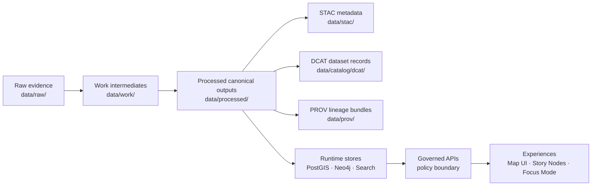

# Transforms


This folder contains **reusable transformation modules** used by KFM pipelines to convert **raw evidence** into **canonical, query-ready processed artifacts**—with **validation**, **catalog outputs**, and **provenance** generated alongside the data.

> [!IMPORTANT]
> KFM treats transforms as **governed production code**. A transform is not “just a script”—it is part of the platform’s **truth path** and must be repeatable, reviewable, and auditable.

---

## What lives here

**Transforms** are small, composable “building blocks” that domain pipelines call, such as:

- Parsing and normalizing tabular inputs (types, timestamps, units)
- Geospatial normalization (CRS checks, reprojection, geometry validation)
- Deterministic deduplication / stable ID generation
- QA/QC checks (range, completeness, drift, integrity)
- Writing required **boundary artifacts** (STAC/DCAT/PROV)
- Emitting run telemetry / lineage exports (when enabled)

**What does not live here**
- Domain-specific orchestration (that belongs in the pipeline for that domain)
- Ad-hoc analysis notebooks intended only for exploration
- Manual/interactive “one-off” data cleanup (must become deterministic code before promotion)

---

## Non negotiables

These rules apply to every transform in this directory:

1. **Deterministic**
   - Same inputs + same config = same outputs (byte-identical when practical)
   - If randomness is required, it must be controlled via fixed seeds and recorded config

2. **Idempotent**
   - Running twice without input changes must not produce duplicate outputs

3. **Fail closed**
   - Missing required metadata, license fields, or governance labels must cause the run/promotion to fail

4. **Raw data is immutable**
   - `data/raw/**` is read-only evidence; transforms must never mutate raw inputs

5. **Trust membrane respected**
   - Transforms do not “reach around” governance (no direct UI/DB coupling; no bypassing repository interfaces)

6. **Provenance-by-default**
   - Every promoted output must be traceable to:
     - Inputs
     - The exact transform(s) used
     - A recorded configuration
     - A run timestamp and responsible agent/process

---

## How transforms fit into the truth path



> [!NOTE]
> Treat STAC/DCAT/PROV as **boundary artifacts**: downstream systems should be able to rely on them as the “API” between pipelines and the rest of KFM.

---

## Directory layout

Below is the recommended shape for this folder. If your repo uses a different layout, keep the **intent** the same and update this README.

```text
pipelines/transforms/
├── README.md
├── geo/                       # CRS, geometry validity, tiling helpers
├── time/                      # timestamp parsing, temporal normalization
├── tabular/                   # schema normalization, typing, unit conversion
├── text/                      # OCR cleanup helpers, tokenization, NER prep
├── qc/                        # QA/QC checks and report emitters
├── catalog/                   # STAC/DCAT emitters + validators
├── provenance/                # PROV/OpenLineage emitters + signing hooks
├── ids/                       # stable ID + deterministic dedupe utilities
├── _templates/                # starter kits (new transform scaffold)
└── tests/                     # unit + contract tests for transforms
```

---

## Transform contract

Each transform must clearly declare:

| Contract item | Required | Notes |
|---|:---:|---|
| Transform ID | ✅ | Stable identifier (prefer `urn:kfm:transform:<name>@<version>`) |
| Version | ✅ | Increment when outputs/meaning changes |
| Inputs | ✅ | Paths + dataset IDs + checksums (or derivable digests) |
| Outputs | ✅ | `data/work/**` (optional) and/or `data/processed/**` (promotion targets) |
| Schema expectations | ✅ | What columns/fields + types are required |
| CRS expectations | ✅ | For geospatial transforms: what CRS is required/produced |
| License handling | ✅ | Preserve and propagate license/attribution constraints |
| Sensitivity label | ✅ | Machine-checkable label used by policy gates |
| Validation gates | ✅ | Which checks run pre/post materialization |
| Provenance emission | ✅ | PROV activity/entity/agent edges; link to run config |
| Test coverage | ✅ | Unit tests + at least one contract/golden test |
| Telemetry hooks | ◻︎ | Enabled when observability stack is configured |

### Minimal manifest pattern

Store a small manifest next to a transform (recommended):

```yaml
# Example: pipelines/transforms/geo/reproject/transform.yaml
id: "urn:kfm:transform:geo.reproject@1"
description: "Reproject vector data to canonical CRS and validate geometry."
inputs:
  - dataset_id: "urn:kfm:dataset:raw.some_source@2026-01-01"
    path: "data/raw/some_source/roads.shp"
outputs:
  - dataset_id: "urn:kfm:dataset:processed.roads@1"
    path: "data/processed/transport/roads.geojson"
policy:
  license_spdx: "CC-BY-4.0"
  sensitivity: "public"
quality:
  gates:
    - "schema"
    - "crs_sanity"
    - "geometry_validity"
provenance:
  emit_prov: true
  emit_openlineage: true
```

> [!TIP]
> If you don’t have a manifest system yet, start with `transform.yaml` as a thin slice. You can evolve it later into a JSON Schema-validated contract.

---

## Validation gates

Validation is split across **pre**, **post**, and **policy** gates.

| Gate type | When | Examples | Expected behavior |
|---|---|---|---|
| Pre-materialization | before writing outputs | schema validation, CRS/bbox sanity | fail fast; produce actionable error |
| Post-materialization | after writing outputs | row counts, coverage checks, index health | fail promotion if thresholds not met |
| Policy gates | before “publish/promote” | license fields present, sensitivity tags, required attestations | **fail closed** by default |

> [!WARNING]
> Never “fix” failures by silently dropping data. If you must filter or correct, emit a QC report and record the rule + version.

---

## Provenance and catalog outputs

Transforms that promote data to `data/processed/**` are expected to also produce:

- **STAC** items/collections under `data/stac/`
- **DCAT** dataset entries under `data/catalog/dcat/`
- **PROV** bundles under `data/prov/`

### Naming guidance

- Prefer stable dataset IDs and deterministic file naming.
- Prefer content-addressed checksums for run artifacts (e.g., QC reports) where feasible.

> [!NOTE]
> Provenance records should allow an auditor to trace:
> raw input → intermediate outputs → processed outputs → catalog records → runtime stores.

---

## Running transforms

Transforms are intended to be called by higher-level pipelines, but should also support local execution.

### Example invocation patterns

```bash
# Option A: run via a pipeline runner (preferred)
kfm pipeline run <domain_pipeline> --dataset <dataset_id> --config <config_path>

# Option B: run a specific transform module directly (only if supported)
python -m pipelines.transforms.geo.reproject \
  --in data/raw/some_source/roads.shp \
  --out data/processed/transport/roads.geojson \
  --config configs/roads.reproject.yaml
```

> [!NOTE]
> The actual runner entrypoints may live elsewhere in the repo. This README documents the contract and expectations for transforms, not a single execution framework.

---

## Adding a new transform

1. Create the module in the correct category folder (e.g., `geo/`, `qc/`, `catalog/`)
2. Add a `transform.yaml` manifest (recommended)
3. Add unit tests under `pipelines/transforms/tests/`
4. Add at least one **contract test**:
   - A “golden file” output test, or
   - A schema + statistics invariant test
5. Ensure the transform:
   - reads from `data/raw/**` and/or `data/work/**`
   - writes to `data/work/**` and/or `data/processed/**`
   - emits STAC/DCAT/PROV when promoting
6. Update this README (or a category README) if you added a new pattern

---

## Definition of Done

A transform is considered “production-ready” when all items below are true:

- [ ] Deterministic and idempotent
- [ ] No mutation of `data/raw/**`
- [ ] Stable IDs used where applicable
- [ ] Explicit schema and CRS expectations documented
- [ ] Validation gates implemented and failing correctly
- [ ] License + attribution handling documented and propagated
- [ ] Sensitivity label present and machine-checkable
- [ ] PROV lineage emitted for any promoted artifact
- [ ] STAC/DCAT produced for any promoted dataset
- [ ] Unit tests + contract tests added
- [ ] CI gates green
- [ ] No secrets, tokens, or credentials added to repo

---

## Common geospatial pitfall

> [!CAUTION]
> **SRID metadata is not a reprojection.** If you are changing CRS, you must actually transform coordinates (not just relabel them). Treat “set SRID” as metadata assertion and “transform” as reprojection.

---

## Related documentation

These repo paths are commonly referenced by transforms and pipelines:

- `docs/pipelines/` — domain pipeline specs and runbooks
- `schemas/` — JSON Schemas (STAC/DCAT/PROV, dataset contracts, telemetry)
- `tools/validation/` — validators (catalog QA, schema checks, etc.)
- `ops/observability/` — telemetry collectors, dashboards, exporters
- `docs/security/` — supply-chain hardening, signing, dependency controls

If any of these are missing in your current checkout, treat them as **required next thin-slice scaffolding** rather than optional extras.
