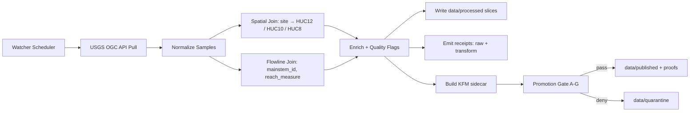

<!-- [KFM_META_BLOCK_V2]
doc_id: kfm://doc/<NEEDS_VERIFICATION_UUID>
title: USGS Gage → HUC Overlay Watcher (KFM Pipeline)
type: standard
version: v1
status: draft
owners: @bartytime4life
created: <NEEDS_VERIFICATION_CREATED_DATE>
updated: 2026-04-25
policy_label: <NEEDS_VERIFICATION_POLICY_LABEL>
related: [
  ../../data/raw/README.md,
  ../../data/work/README.md,
  ../../data/processed/README.md,
  ../../data/receipts/README.md,
  ../../data/proofs/README.md,
  ../../data/catalog/dcat/README.md,
  ../../data/catalog/stac/README.md,
  ../../data/catalog/prov/README.md,
  ../../tools/validators/promotion_gate/README.md,
  ../../schemas/contracts/v1/runtime/runtime_response_envelope.schema.json
]
tags: [kfm, usgs, gage, hydrology, huc, nhd, watcher, receipts, promotion, provenance]
notes: [
  "Watcher-first pipeline for USGS gage ingestion bound to HUC overlays and mainstem crosswalk.",
  "Emits receipts and sidecars for Promotion Gate; does not claim CI wiring until verified on branch.",
  "All runtime access must pass through governed API; no direct store access."
]
[/KFM_META_BLOCK_V2] -->

<a id="top"></a>

# USGS Gage → HUC Overlay Watcher

Ingest **live USGS gage streams** and bind each sample to **HUC12/10/8 overlays** and a **mainstem crosswalk**, emitting **receipts** and **KFM sidecars** for governed promotion.

> [!IMPORTANT]
> **Evidence-first**: Every promoted slice must carry a complete sidecar (lineage, spatial digest, completeness, quality).  
> **Fail-closed**: Missing fields or incomplete windows deny promotion.  
> **Trust membrane**: Clients resolve through governed APIs only.

---

## Status • Owners • Quick Links

- **Status:** draft  
- **Owners:** @bartytime4life  

**Quick jump:**  
[Scope](#scope) • [Repo fit](#repo-fit) • [Inputs](#inputs) • [Exclusions](#exclusions) •  
[Flow](#flow) • [Data model](#data-model) • [Sidecar](#kfm-promotion-sidecar) •  
[Polling](#polling-pattern-live) • [Backfill](#backfill-pattern-historical) •  
[Change events](#change-event-handling) • [Directory layout](#directory-layout) •  
[Promotion Gate](#promotion-gate-integration) • [Quickstart](#quickstart) • [FAQ](#faq)

---

## Scope

- Acquire **instantaneous (IV)** and **daily (DV)** values from USGS Water Data APIs.  
- Compute **site→HUC** overlays (HUC12 → HUC10 → HUC8 rollups).  
- Attach **mainstem_id** and **reach_measure** via NHD/NHDPlus/3DHP flowlines.  
- Emit **append-only samples**, **receipts**, and **promotion sidecars**.

## Repo fit

- **Upstream:** external USGS OGC APIs (continuous + daily collections; code dictionaries).  
- **Downstream:**  
  - `data/processed/` normalized slices  
  - `data/receipts/` acquisition + transform receipts  
  - `data/proofs/` promotion artifacts  
  - `data/catalog/{dcat,stac,prov}/` catalog closure  
  - `apps/governed_api/` runtime resolution (no direct store access)

---

## Inputs

- **USGS series**: `{monitoring_location_id, parameter_code, computation_identifier | statistic_id}`  
- **Time windows**: bounded `{start_time, end_time}`  
- **Code dictionaries / schemas**: units, statistic codes  
- **Hydrography**: WBD (HUC polygons), NHD/NHDPlus/3DHP (flowlines)

## Exclusions

- No UI rendering, dashboards, or tile serving.  
- No direct client reads of canonical stores.  
- No mutation-in-place of evidence; corrections are **append-only deltas**.

---

## Flow



> Diagram reflects intended architecture. Exact wiring of schedulers/CI is **NEEDS VERIFICATION** on branch.

---

## Data model

**Primary sample key (append-only):**
- `monitoring_location_id`
- `parameter_code`
- `computation_identifier` (IV) **or** `statistic_id` (DV)
- `time` (UTC)
- `value`
- `unit`
- `qualifiers` (if present)

**Spatial fields (derived, cached):**
- `site_lon`, `site_lat`
- `huc12`, `huc10`, `huc8`
- `mainstem_id`, `reach_measure`

**Partitioning (recommended):**
- by `huc8 / parameter_code / date` (or equivalent) to support watcher pools

---

## KFM promotion sidecar

Every slice submitted to promotion MUST include:

- **Source**  
  `source_api` (`usgs-ogcapi` | `waterservices-legacy`), `endpoint_path`
- **Query window**  
  `start_time`, `end_time`, `time_zone`
- **Series identity**  
  `monitoring_location_id`, `parameter_code`, `computation_identifier | statistic_id`
- **Resolution digest**  
  `spec_hash`, `schema_version`, `unit_resolver_version`
- **Spatial digest**  
  `huc12`, `huc10`, `huc8`, `mainstem_id`, `crosswalk_version`
- **Provenance**  
  `request_params`, `response_content_hash`, `retrieved_at`
- **Completeness**  
  `samples_expected`, `samples_received`, `late_sample_count`
- **Quality**  
  observed `qualifiers`, conversions applied (if any)

> **Fail-closed rule:** any missing or inconsistent field → **deny** at gate.

---

## Polling pattern (live)

- Maintain **per-series cursors** (`last_sample_time`).  
- Poll **short trailing windows** (e.g., last 15–30 minutes) at a steady cadence.  
- **Idempotent upsert** on `(series key + time)`; treat feed as append-only.  
- Detect **late arrivals** by gaps vs. expected cadence; record in sidecar.

---

## Backfill pattern (historical)

- Discover **period of record** via time-series metadata.  
- Page **bounded windows** (e.g., 30–90 days DV; tighter for IV).  
- Continue until target “as-of” date is reached.  
- Re-run backfill periodically to capture **revisions** (hash drift).

---

## Change-event handling

- **New sample** → enqueue downstream computations (rolling stats, thresholds).  
- **Late sample** → emit **corrective delta** with `supersedes` linkage; never mutate prior evidence.  
- **Revision** (content hash drift) → write new slice + receipt referencing prior artifact.

---

## Directory layout

```
pipelines/
  usgs-gage-watch/
    README.md
    configs/
      sources.yaml            # series registry (sites/params) — PROPOSED
      polling.yaml            # cadence/windows — PROPOSED
    jobs/
      poll_iv.py              # NEEDS VERIFICATION (existence)
      backfill_dv.py          # NEEDS VERIFICATION (existence)
    transforms/
      normalize.py
      spatial_join.py
      flowline_join.py
    receipts/
      writer.py
    sidecar/
      builder.py
```

> File presence and executability are **NEEDS VERIFICATION**.

---

## Promotion Gate integration

- Submit **(slice + sidecar + receipts)** to `tools/validators/promotion_gate`.  
- Expect **A–G checks** (schema, completeness, lineage, spatial, determinism, etc.).  
- Outcomes: `pass → data/published + proofs`, `deny → data/quarantine`.

---

## Quickstart

```bash
# 1) Configure series (sites/parameters)
cp pipelines/usgs-gage-watch/configs/sources.yaml.example \
   pipelines/usgs-gage-watch/configs/sources.yaml

# 2) Run a single poll window (IV)
python pipelines/usgs-gage-watch/jobs/poll_iv.py \
  --window "now-30m:now" \
  --emit receipts,processed,sidecar

# 3) Backfill DV (bounded range)
python pipelines/usgs-gage-watch/jobs/backfill_dv.py \
  --start 2024-01-01 --end 2024-03-31

# 4) Attempt promotion
python tools/validators/promotion_gate/run.py \
  --input data/processed/<slice> \
  --sidecar data/processed/<slice>.sidecar.json
```

> Commands are illustrative; exact CLI paths/flags are **NEEDS VERIFICATION**.

---

## FAQ

**Why HUC + mainstem together?**  
HUC provides **areal context** (watershed rollups); mainstem provides **network context** (up/downstream continuity).

**Why append-only?**  
Ensures **auditability**; corrections are explicit deltas with lineage.

**How are units handled?**  
Resolve via authoritative code dictionaries; record conversions in sidecar.

---

## Appendix A — Field reference (abridged)

| Field | Description |
|---|---|
| monitoring_location_id | USGS site id |
| parameter_code | e.g., discharge, gage height |
| computation_identifier | IV series identifier |
| statistic_id | DV statistic (e.g., mean) |
| huc12/huc10/huc8 | watershed codes |
| mainstem_id | derived river mainstem identifier |
| reach_measure | linear reference along flowline |

---

<a href="#top">Back to top ↑</a>
