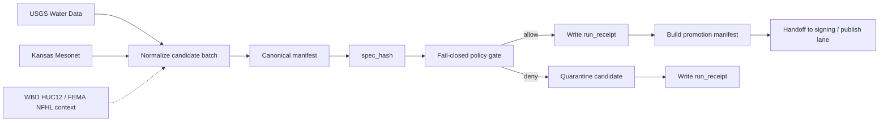

<!-- [KFM_META_BLOCK_V2]
doc_id: kfm://doc/NEEDS-VERIFICATION
title: pipelines/usgs-mesonet-watch
type: standard
version: v1
status: draft
owners: @bartytime4life
created: 2026-04-14
updated: 2026-04-14
policy_label: public
related: [
  ../README.md,
  ../../docs/patterns/dataset_watch.md,
  ../../data/receipts/README.md,
  ../../data/proofs/README.md,
  ../../tools/validators/README.md,
  ../../tools/validators/promotion_gate/README.md,
  ../../policy/README.md,
  ../../schemas/README.md,
  ../../tests/README.md
]
tags: [kfm, pipelines, usgs, mesonet, watcher, receipts, spec_hash]
notes: [Watcher-first hydrology thin slice. Doctrine is strong; exact mounted subtree, scheduler owner, validator path, and live endpoint wiring remain NEEDS VERIFICATION.]
[/KFM_META_BLOCK_V2] -->

# `pipelines/usgs-mesonet-watch/`

Watcher-first hydrology intake lane for **USGS Water Data** and **Kansas Mesonet** candidate batches, with deterministic `spec_hash`, fail-closed policy evaluation, receipt emission, and promotion-manifest handoff.

> [!NOTE]
> **Operational maturity:** experimental  
> **Document status:** draft  
> **Owners:** `@bartytime4life`  
>       
> **Quick jumps:** [Scope](#scope) · [Repo fit](#repo-fit) · [Accepted inputs](#accepted-inputs) · [Flow](#flow) · [Contract surfaces](#contract-surfaces) · [Release and policy gates](#release-and-policy-gates) · [Open questions](#open-questions)

| Field | Value |
|---|---|
| Path | `pipelines/usgs-mesonet-watch/` |
| Role | `observe → normalize → spec_hash → policy gate → receipt → promotion manifest` |
| Posture | `fail-closed · watcher-first · receipt/proof separated` |
| Lane class | Hydrology-first proof slice with time-series promotion pressure |
| Primary watched sources | USGS Water Data · Kansas Mesonet |
| Context sources | WBD HUC12 · FEMA NFHL |
| Current evidence posture | Doctrine is strong; mounted workflow/file proof remains bounded |

---

## Scope

This lane exists to turn **public-safe hydrology and station observations** into a governed release candidate without collapsing observation, proof, and publication into one step.

It is responsible for:

- observing upstream **USGS Water Data** and **Kansas Mesonet** surfaces
- normalizing a deterministic candidate batch
- deriving a stable `spec_hash`
- evaluating fail-closed policy against the normalized candidate
- emitting a compact `run_receipt`
- preparing a **promotion manifest** for downstream signing and release handling

It is **not** the place where public truth is declared. This directory is the lane where a candidate becomes inspectable enough to hand off.

> [!IMPORTANT]
> This README is strongest as a **lane contract and repo-fit document**. It is **not** evidence that the mounted repository already contains the watcher, scheduler, validators, manifests, or signing workflow described here.

### Current evidence posture

| Surface | Status | Why it matters |
|---|---|---|
| Watcher-first hydrology direction | **CONFIRMED** | Hydrology is the preferred first proof lane and this lane fits that burden profile. |
| `manifest → spec_hash → policy gate → receipt → promotion` choreography | **TECHNICALLY VALIDATED / PROPOSED** | The corpus now gives a strong, end-to-end pattern for watcher-driven time-series promotion. |
| Exact mounted subtree, scheduler owner, workflow files, and live URLs | **NEEDS VERIFICATION** | Current-session workspace evidence was PDF-rich, not repo-mounted. |

[Back to top](#pipelinesusgs-mesonet-watch)

---

## Repo fit

This directory sits at the handoff point between **dataset watching**, **validation/policy**, and **release-bearing artifact flow**.

| Direction | Surface | Relationship |
|---|---|---|
| Upstream | [`../README.md`](../README.md) | Parent pipelines surface for neighboring lane conventions. |
| Upstream | [`../../docs/patterns/dataset_watch.md`](../../docs/patterns/dataset_watch.md) | Watcher pattern and cadence discipline. |
| Downstream | [`../../data/receipts/README.md`](../../data/receipts/README.md) | Compact run/process-memory outputs belong there. |
| Downstream | [`../../data/proofs/README.md`](../../data/proofs/README.md) | Release-grade proof objects belong there, not here. |
| Downstream | [`../../tools/validators/README.md`](../../tools/validators/README.md) | Contract and validation surface that should consume emitted objects. |
| Downstream | [`../../tools/validators/promotion_gate/README.md`](../../tools/validators/promotion_gate/README.md) | Promotion decision surface for release-bearing candidates. |
| Downstream | [`../../policy/README.md`](../../policy/README.md) | Fail-closed decision logic. |
| Downstream | [`../../schemas/README.md`](../../schemas/README.md) | Canonical schema home once object shapes are published. |
| Downstream | [`../../tests/README.md`](../../tests/README.md) | Positive/negative fixtures and replay checks. |

> [!TIP]
> The lane should stay narrow: **watch and prepare** here, **prove and publish** downstream.

---

## Accepted inputs

The current corpus supports the following inputs for this lane.

| Input surface | Purpose | Status |
|---|---|---|
| USGS Water Data candidate batch | Primary hydrology/time-series observation input | CONFIRMED |
| Kansas Mesonet candidate batch | Kansas station and soil-moisture context input | CONFIRMED |
| WBD HUC12 context reference | Hydrologic grouping and basin context | CONFIRMED as contextual dependency |
| FEMA NFHL context reference | Regulatory flood context | CONFIRMED as contextual dependency |
| Source descriptors | Names source, cadence, role, and rights posture | PROPOSED first-wave contract |
| Canonicalization rules | Stable normalization before hashing | TECHNICALLY VALIDATED direction |
| Policy label + validation inputs | Fail-closed release decision input | CONFIRMED doctrine; exact fields NEED VERIFICATION |

### What belongs here

- candidate batches or snapshots that can be normalized deterministically
- source-role metadata needed to explain what **USGS Water Data** and **Kansas Mesonet** each mean
- context references that help interpret the batch without turning this lane into a general-purpose catalog
- release-candidate objects that are still reviewable and reversible

> [!WARNING]
> **Kansas Mesonet is a viable public connector, not a free-for-all ingestion surface.** Treat automation against Mesonet as policy-bearing design work, not unconstrained scraping.

---

## Exclusions

This lane does **not**:

- publish catalog artifacts by itself
- replace policy ownership
- replace release-proof validation
- silently promote on schema drift
- redefine schema authority
- act as the final proof store
- collapse **receipts**, **proofs**, and **catalog** objects into one file
- imply live scheduler, workflow, or signing integration unless those surfaces are directly verified in-repo

---

## Directory tree

Exact mounted contents under this directory were **not** surfaced in the current session. The only safe tree claim is the target document itself.

```text
pipelines/usgs-mesonet-watch/
└── README.md  # target lane document (mounted presence still NEEDS VERIFICATION)
```

If this directory already contains code, fixtures, or workflow helpers, add them only after direct repo inspection.

---

## Quickstart

Use this sequence when turning the lane from a draft contract into a real thin slice.

1. Define source descriptors for **USGS Water Data** and **Kansas Mesonet**.
2. Decide whether **WBD HUC12** and **FEMA NFHL** are resolved during the watch or joined as context later.
3. Normalize one candidate batch into a stable manifest shape.
4. Compute `spec_hash` from canonicalized content.
5. Run fail-closed validation and policy checks.
6. Always write `run_receipt`, whether the candidate is allowed or denied.
7. Build the promotion-manifest handoff object only after the candidate passes.

Illustrative sequence only:

```text
observe
  -> normalize
  -> canonicalize
  -> spec_hash
  -> policy gate
  -> run_receipt
  -> promotion manifest handoff
```

---

## Flow



> [!NOTE]
> This doc deliberately keeps the lane-level branch language to **allow / deny / quarantine**. The broader corpus still carries an unresolved outcome-vocabulary collision that should be normalized separately rather than silently decided here.

[Back to top](#pipelinesusgs-mesonet-watch)

---

## Source surfaces and roles

| Source | Lane role | Notes |
|---|---|---|
| **USGS Water Data** | Primary watched hydrology source | Best fit for first proof-lane observation flow. |
| **Kansas Mesonet** | Complementary Kansas station context | Valuable for local environmental context; usage constraints stay visible. |
| **WBD HUC12** | Context / grouping surface | Supports basin-aware interpretation and routing. |
| **FEMA NFHL** | Regulatory flood context | Useful context for flood-oriented reasoning; not a real-time inundation feed. |

This split matters because the lane should preserve **source-role clarity** instead of flattening everything into one undifferentiated “hydrology source.”

---

## Contract surfaces

The corpus strongly pressures a small object family here, but not every schema is directly surfaced as mounted code.

| Object | Owned here? | Purpose | Status |
|---|---|---|---|
| `SourceDescriptor` | Partially | Describe source identity, cadence, role, and rights posture | PROPOSED schema wave |
| Canonical manifest | Yes | Stable batch identity surface before release handoff | INFERRED |
| `spec_hash` | Yes | Deterministic identity + idempotency anchor | TECHNICALLY VALIDATED |
| `run_receipt` | Yes | Compact process-memory record for allow/deny/quarantine | TECHNICALLY VALIDATED |
| Promotion manifest | Handoff | Release candidate passed downstream | PROPOSED |
| Signed proofs / bundles | No | Release-grade proof surface | Downstream responsibility |
| Catalog objects | No | Discoverability / outward linkage | Downstream responsibility |

### Receipt / proof boundary

| Surface | What it is | What it is not |
|---|---|---|
| `run_receipt` | Compact record of what the watcher decided or emitted | Not the cryptographic proof bundle |
| Proof object / attestation | Verifiable release-significant trust object | Not the same thing as pipeline memory |
| Catalog entry | Outward discoverability and lineage surface | Not the same thing as validation or promotion state |

> [!IMPORTANT]
> Keep **receipt ≠ proof ≠ catalog** visible in the implementation. This lane should emit the first one and prepare the handoff for the others.

---

## Release and policy gates

### Confirmed lane laws

| Law | Practical consequence here |
|---|---|
| Promotion is a governed state transition, not a file move | Passing validation is necessary but not sufficient for publication. |
| Fail closed on weak support | Missing required fields or unresolved policy should stop promotion handoff. |
| `spec_hash` anchors identity | Replays and diffs should use canonical content, not ad hoc filenames. |
| Always emit a receipt | Denied and quarantined runs still need machine-readable memory. |
| Signed proof lives downstream | This lane prepares release objects; it does not pretend they are already published. |

### Proposed first gate set

These are the safest first-wave checks to document here without inventing mounted implementation:

- required source identity present
- canonical manifest produced successfully
- `spec_hash` present and stable
- timestamps ordered and batch window explicit
- policy label present
- values pass domain-range checks appropriate to the first slice
- handoff object omitted when validation fails
- `run_receipt` emitted on both allow and deny paths

A good first implementation should fail for **missing manifest shape**, **missing `spec_hash`**, **missing source identity**, and **missing receipt** before it tries to do anything more ambitious.

---

## Task list

### Thin-slice definition of done

- [ ] `SourceDescriptor` surfaces exist for **USGS Water Data**, **Kansas Mesonet**, **WBD HUC12**, and **FEMA NFHL**
- [ ] one canonical manifest fixture exists for a watcher candidate
- [ ] one passing `run_receipt` fixture exists
- [ ] one denied or quarantined `run_receipt` fixture exists
- [ ] policy rejects malformed or incomplete candidates
- [ ] promotion-manifest handoff is machine-readable
- [ ] direct repo evidence confirms workflow file, scheduler owner, and storage target
- [ ] mounted tests prove replayability for unchanged `spec_hash`

### Things this doc intentionally leaves open

- exact workflow filename
- exact scheduler owner
- exact storage layout below `data/work/`, `data/quarantine/`, and `data/receipts/`
- exact schema registry path for first-wave objects
- exact signing/proof bundle mechanics after handoff

[Back to top](#pipelinesusgs-mesonet-watch)

---

## FAQ

### Does this lane publish directly?

No. It prepares a candidate, emits a receipt, and hands a promotion object to downstream proof/release surfaces.

### Why put USGS Water Data and Kansas Mesonet in the same lane?

Because the corpus repeatedly treats hydrology as the strongest first proof field and explicitly names **USGS Water Data**, **Kansas Mesonet**, **WBD HUC12**, and **FEMA NFHL** as the relevant context family for first-wave hydrology work.

### Is Kansas Mesonet treated exactly like USGS Water Data?

No. Both are valuable, but the source roles are different and Mesonet carries explicit usage and automation constraints that should stay visible in design.

### Is the finite outcome grammar final?

No. The broader corpus still needs a normalization pass for outcome vocabulary. This README avoids pretending that work is finished.

---

## Open questions

- Is the first release-bearing slice a **true dual-source watch** or a **USGS-first watch with Mesonet as contextual join**?
- Where will the first-wave schemas for `SourceDescriptor`, canonical manifest, and `run_receipt` live?
- What is the mounted workflow path and scheduler owner for this lane?
- Does the repo use `promotion manifest`, `release manifest`, or both as distinct objects?
- Which validations are mandatory for the first allowed handoff?
- What exact downstream surface consumes this lane’s promotion object first?

---

<details>
<summary><strong>Appendix — illustrative shapes only</strong></summary>

These examples are **illustrative**. They are here to make the lane concrete without pretending the final field names or file paths are already verified.

### Illustrative candidate manifest

```yaml
# illustrative only — final field names NEEDS VERIFICATION
source_descriptors:
  - id: usgs-water-data
    role: primary-observation
  - id: kansas-mesonet
    role: complementary-station-context

context_refs:
  - id: wbd-huc12
  - id: fema-nfhl

observed_window:
  start: 2026-04-14T00:00:00Z
  end: 2026-04-14T01:00:00Z

policy_label: public
spec_hash: sha256:<digest>

artifacts:
  - kind: normalized-timeseries
    href: data/work/NEEDS-VERIFICATION
```

### Illustrative run receipt

```yaml
# illustrative only — final field names NEEDS VERIFICATION
run_id: 2026-04-14T01:00:00Z
spec_hash: sha256:<digest>
decision: allow
reason_codes: []
quarantined: false
promotion_manifest_ref: pipelines/usgs-mesonet-watch/NEEDS-VERIFICATION
```

### Illustrative denied receipt

```yaml
# illustrative only — final field names NEEDS VERIFICATION
run_id: 2026-04-14T01:05:00Z
spec_hash: sha256:<digest>
decision: deny
reason_codes:
  - missing-source-identity
quarantined: true
promotion_manifest_ref: null
```

</details>

[Back to top](#pipelinesusgs-mesonet-watch)
