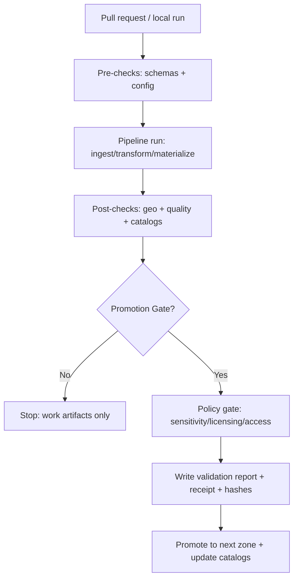

# Pipelines · Validators ✅🧪

> **Purpose:** Validators are the **merge-blocking + promotion-gating** checks that keep KFM *evidence-first, fail-closed, and auditable*—from ingestion artifacts to catalogs to served layers.

---

## Quick Links

- 📦 Pipeline overview: `pipelines/README.md` *(if present)*
- 🗂️ Data lifecycle zones: `data/raw/`, `data/work/`, `data/processed/`
- 🧾 Catalogs: `data/stac/`, `data/catalog/dcat/`, `data/prov/`
- 🔐 Policy-as-code (OPA/Rego): `policy/`
- 🧭 Story Nodes / Focus Mode evidence rules: `docs/` *(project-specific)*

---

## What Lives Here?

This directory owns **validation rules + runner plumbing** for:

- **Pre-materialization** checks (inputs + config sanity)
- **Post-materialization** checks (outputs match specs)
- **Promotion gates** (Raw → Work → Processed; Work → Processed; Processed → Served)
- **CI merge gates** for new/changed datasets, catalogs, policies, and governed docs

### Recommended Folder Layout

```text
pipelines/
  validators/
    README.md                  # you are here
    registry.py                # registry of validators + profiles (example)
    runner.py                  # runs validators, writes reports (example)
    schemas/                   # JSON ScheMAS for reports/receipts/catalog profiles
      validation-report.schema.json
      receipt.schema.json
      evidence-ref.schema.json
    checks/
      schema/                  # JSON schema validation (STAC/DCAT/PROV + receipts)
      geo/                     # CRS/bbox/geometry integrity checks
      quality/                 # QA sampling, duplicates, row counts, stats deltas
      provenance/              # PROV linkage + cross-link resolution checks
      licensing/               # license presence/compatibility + attribution fields
      sensitivity/             # sensitive location/PII detection + redaction enforcement
      security/                # artifact hashing, signatures/attestations, SBOM hooks
    fixtures/
      datasets/                # tiny sample datasets for tests
      catalogs/                # known-good STAC/DCAT/PROV fixtures
      policies/                # policy regression suite inputs/outputs
    reports/
      .gitkeep                 # optional; local/dev only (CI artifacts go to CI storage)
```

> **Note:** File names above are *recommended conventions*—adjust to match your actual pipeline runner/orchestrator.

---

## Core Design Principles

### 1) Fail-Closed Everywhere
If required metadata, licenses, governance labels, signatures, or policy decisions are missing or uncertain, **validation fails** and promotion stops.

### 2) Catalog-First, Evidence-First
Every published layer/feature/story must resolve to:
- **processed artifacts** (content-addressed)
- **catalog metadata** (STAC/DCAT)
- **lineage** (PROV)
- **validation reports** (this folder)
- **audit references** (append-only ledger, if implemented)

### 3) Determinism + Replayability
Validation must be reproducible:
- stable IDs
- stable ordering
- stable hashing (canonical JSON where applicable)
- consistent thresholds & profiles

---

## Validator Categories (What We Validate)

| Category | What it checks | Typical outputs |
|---|---|---|
| **Schema** | JSON schema validity for STAC/DCAT/PROV, receipts, evidence refs | PASS/FAIL + schema error locations |
| **Geospatial** | GeoJSON validity, geometry types, bbox sanity, CRS rules; GeoParquet/COG structure | PASS/FAIL + invalid features list |
| **Catalog Integrity** | STAC ↔ DCAT ↔ PROV cross-links resolvable; required fields present | PASS/FAIL + missing link graph |
| **Quality & Drift** | row counts, null/dup rates, range checks, sample QA, drift thresholds | WARN/FAIL + metrics table |
| **Licensing & Attribution** | license present, compatible, attribution fields present, access rights tags | FAIL if missing/invalid |
| **Sensitivity & Redaction** | sensitive site leakage rules, PII checks, masking/redaction required fields | FAIL + redaction tasks |
| **Security/Integrity** | checksums present, artifact digests match, signature/attestation hooks | FAIL if mismatch |
| **Policy Compliance** | OPA/Rego decisions (default deny), promotion prerequisites satisfied | FAIL + policy rule IDs |

---

## When Validators Run (Lifecycle)



---

## Validation Report Contract (Stable, Machine-Readable)

Validators must emit a **single normalized report format**, even if the underlying checks differ.

### Required Report Fields (Recommended)

- `report_id` (stable, content-addressable or deterministic)
- `run_id` (pipeline run correlation)
- `dataset_id`, `dataset_version`
- `zone` (`raw` | `work` | `processed` | `served`)
- `validator_id`, `validator_version`
- `status` (`PASS` | `WARN` | `FAIL`)
- `findings[]` (structured)
- `metrics{}` (optional)
- `artifacts[]` (URIs + digests)
- `catalog_refs` (STAC/DCAT/PROV IDs)
- `policy_decisions[]` (rule IDs + decision)

### Example Report (Shape Only)

```json
{
  "report_id": "kfmvrpt:sha256:…",
  "run_id": "kfmr:2026-02-16T12:00:00Z:…",
  "dataset_id": "kfm:dataset:…",
  "dataset_version": "2026-02-16.1",
  "zone": "processed",
  "validator_id": "geo.crs_bbox_sanity",
  "validator_version": "1.0.0",
  "status": "FAIL",
  "findings": [
    {
      "severity": "ERROR",
      "code": "BBOX_OUT_OF_RANGE",
      "message": "Feature bbox outside declared CRS bounds",
      "evidence_refs": ["kfmev:docspan:…", "kfmev:artifact:…"],
      "locations": [{"path": "features[120].bbox"}]
    }
  ],
  "artifacts": [{"uri": "s3://…/data/processed/…", "sha256": "…"}],
  "catalog_refs": {"stac": "…", "dcat": "…", "prov": "…"},
  "policy_decisions": [{"policy": "promotion.rego", "rule": "allow", "decision": false}]
}
```

---

## Running Validators

> The exact commands depend on your orchestrator (Dagster/Airflow/etc.) and language (Python/Node). Below are **recommended** entry points.

### Run All Validators (Local)
```bash
make validate
# or
python -m pipelines.validators.runner --profile default --zone work
```

### Run One Validator
```bash
python -m pipelines.validators.runner \
  --validator geo.crs_bbox_sanity \
  --dataset kfm:dataset:example \
  --zone processed
```

### CI Mode (Fail Fast)
```bash
python -m pipelines.validators.runner --ci --profile promotion_gate
```

---

## Adding a New Validator

1. **Pick a category** (`checks/geo`, `checks/schema`, etc.)
2. Implement the validator with a stable `validator_id` + semantic version
3. Add/extend a **JSON schema** if you introduce new finding/metric fields
4. Add tests:
   - unit tests (pure logic)
   - fixture-based tests (`fixtures/`)
   - contract tests for report stability
5. Register it in `registry.py` and map it into one or more profiles:
   - `default`
   - `promotion_gate`
   - `public_release`
6. Wire it into CI gates (merge-blocking if required)

### Definition of Done (Validator)

- [ ] Deterministic output (ordering + stable IDs where required)
- [ ] Emits a `ValidationReport` that matches `schemas/validation-report.schema.json`
- [ ] Has fixtures and tests
- [ ] Has documented thresholds/config knobs (with safe defaults)
- [ ] Fails closed on missing prerequisites
- [ ] Produces actionable findings (human-readable + machine-parsable)

---

## Governance & Sensitivity Notes ⚠️

- If a validator detects **sensitive location leakage** or potential **PII**, the correct default is:
  - **FAIL** promotion
  - create a **human review task** (QA queue)
  - require **redaction/masking** as an explicit transformation step
- Policy checks must remain **default-deny**: “unknown” is never treated as “allowed.”

---

## Troubleshooting

<details>
<summary><strong>“It passes locally but fails in CI.”</strong></summary>

Common causes:
- different validator profile in CI
- missing fixtures in CI environment
- non-deterministic ordering (hashes change)
- relying on local-only files (absolute paths)

Fix:
- run `--ci` locally
- add determinism tests (golden reports)
- ensure catalogs/prov links resolve from repo-relative URIs
</details>

<details>
<summary><strong>“Geo validator says CRS mismatch.”</strong></summary>

Check:
- artifact declares CRS in metadata
- STAC/DCAT CRS fields match
- transformation steps write CRS explicitly (don’t infer)

Fix:
- fail early in pre-materialization if CRS is missing/ambiguous
</details>

---

## Appendix: Suggested Profiles

| Profile | Use | Includes |
|---|---|---|
| `default` | developer feedback loop | schema + basic geo + catalog |
| `promotion_gate` | merge/publish gates | all required validators |
| `public_release` | public-facing datasets | adds sensitivity + license strictness |
| `focus_mode_bundle` | AI evidence packaging | evidence-ref + citation resolvability |

---

## Verification Steps (Repo Reality Check)

Because KFM implementations evolve, confirm the following in *your* repo:

1. What is the orchestrator (Dagster/Airflow/Prefect/etc.)?
2. Where do you write CI artifacts (S3, Actions artifacts, internal object store)?
3. Which schemas are canonical (`schemas/` vs `docs/standards/`)?
4. Which promotion gates exist today (Raw→Work→Processed vs additional tiers)?
