<!-- [KFM_META_BLOCK_V2]
doc_id: kfm://doc/NEEDS-VERIFICATION
title: pipelines/watchers
type: standard
version: v1
status: draft
owners: TODO(pipeline/data platform owners)
created: 2026-04-25
updated: 2026-04-25
policy_label: NEEDS-VERIFICATION
related: [../README.md, ./kansas_flora_watch/README.md, ../../data/registry/README.md, ../../policy/README.md, ../../schemas/README.md, ../../tools/validators/README.md, ../../tests/README.md, ../../release/]
tags: [kfm, pipelines, watchers, source-descriptor, spec_hash, run_receipt, validation-report, policy-decision, promotion]
notes: [Directory README for watcher lanes. Public main inspection showed pipelines/watchers/README.md was a placeholder-size file and kansas_flora_watch/ existed as a child watcher; mounted checkout, active branch, owners, workflow enforcement, scheduler, and live watcher maturity remain NEEDS VERIFICATION.]
[/KFM_META_BLOCK_V2] -->

<a id="top"></a>

# `pipelines/watchers/`

Watcher lane hub for detecting source change, producing governed candidate handoffs, and keeping source refresh automation subordinate to KFM evidence, policy, review, and release gates.

> [!NOTE]
> **Status:** `experimental`  
> **Owners:** `TODO(pipeline/data platform owners)`  
> **Path:** `pipelines/watchers/`  
> **Document role:** README-like directory contract for watcher lanes and source-refresh proof burdens  
>        
> **Quick jumps:** [Scope](#scope) · [Repo fit](#repo-fit) · [Accepted inputs](#accepted-inputs) · [Exclusions](#exclusions) · [Current snapshot](#current-snapshot) · [Directory tree](#directory-tree) · [Quickstart](#quickstart) · [Watcher flow](#watcher-flow) · [Operating tables](#operating-tables) · [Task list](#task-list--definition-of-done) · [FAQ](#faq) · [Appendix](#appendix)

> [!IMPORTANT]
> A watcher is **not** a cron job with a nicer name. In KFM, a watcher is a governed source-refresh surface: it observes change, records what happened, preserves uncertainty, and prepares reviewable candidates without silently publishing or bypassing the trust membrane.

---

## Scope

`pipelines/watchers/` is the directory for watcher lanes: small, reviewable, source-aware update flows that detect changes in admitted or candidate source families and turn those changes into governed pipeline handoffs.

A watcher may:

- detect upstream change signals such as version, timestamp, checksum, `ETag`, `Last-Modified`, snapshot date, API metadata, or reviewed manual trigger;
- acquire or replay a tiny candidate batch;
- normalize enough metadata to evaluate source identity, source role, rights, support, cadence, and freshness;
- compute or preserve deterministic identity such as `spec_hash`;
- run fail-closed schema, source-role, rights, sensitivity, spatial, temporal, and policy checks;
- emit process memory such as `RunReceipt`, `ValidationReport`, and `PolicyDecision`;
- hand off a promotion candidate to downstream proof, catalog, and release surfaces.

A watcher must not become the place where public truth is declared. Publication remains a governed state transition.

### What this directory should make obvious

| Question | Watcher answer |
|---|---|
| What changed? | A declared source, asset, registry entry, source descriptor, or fixture batch changed under a known signal. |
| Is the source admissible? | A `SourceDescriptor` or source-intake record states owner, role, rights, cadence, support, sensitivity, and activation state. |
| Is the candidate stable? | Canonical content is hashed where practical; `spec_hash` is used as a replay and idempotency anchor. |
| Is failure reviewable? | Denied, malformed, stale, ambiguous, or unsafe candidates go to quarantine or blocked handoff with a receipt. |
| Can the UI or API use it? | Only after downstream catalog/proof/release closure and governed API exposure; watcher internals are not public runtime surfaces. |

[Back to top](#top)

---

## Repo fit

### Path

```text
pipelines/watchers/
```

### Upstream and adjacent surfaces

| Surface | Relationship | Status |
|---|---|---|
| [`../README.md`](../README.md) | Parent pipeline contract and lifecycle rules. | CONFIRMED adjacent README path in public tree; active branch still needs verification. |
| [`../../data/registry/README.md`](../../data/registry/README.md) | Source admission and source-descriptor posture before live watch activation. | CONFIRMED adjacent public README path; schema bodies and activation rules still need verification. |
| [`../../schemas/README.md`](../../schemas/README.md) | Machine-checkable contracts for `SourceDescriptor`, `RunReceipt`, manifests, and related proof objects. | NEEDS VERIFICATION for final schema home. |
| [`../../policy/README.md`](../../policy/README.md) | Fail-closed rights, sensitivity, publication, and source-role decisions. | NEEDS VERIFICATION for active policy engine and workflow pins. |
| [`../../tools/validators/README.md`](../../tools/validators/README.md) | Reusable validators invoked by watcher lanes. | NEEDS VERIFICATION for runnable commands. |
| [`../../tests/README.md`](../../tests/README.md) | Valid/invalid fixtures, no-network replay, negative-path proof, and CI pressure. | CONFIRMED adjacent public README path; active tests still need branch verification. |

### Downstream consumers

| Surface | Watcher responsibility |
|---|---|
| `../../data/raw/`, `../../data/work/`, `../../data/quarantine/` | Write or reference lifecycle outputs only through declared, reviewable paths; do not store bulk data beside watcher code. |
| `../../data/receipts/` | Store compact process memory for allow, deny, quarantine, abstain, and error outcomes. |
| `../../data/proofs/` | Receive release-significant proof objects downstream; watchers do not pretend receipts are proofs. |
| `../../data/catalog/` and `../../data/triplets/` | Receive catalog/provenance/graph-ready records after closure checks. |
| [`../../release/`](../../release/) | Receives release candidates only after policy, proof, catalog, review, and rollback obligations are satisfied. |
| `../../apps/governed-api/` and `../../apps/web/` | Consume released or policy-safe payloads only; no ordinary UI should read watcher internals as truth. |

> [!WARNING]
> Watcher outputs can be useful before publication, but they are still **candidate state** until downstream closure is complete. Do not wire watcher outputs directly into public map layers, Focus Mode, exports, or claims.

[Back to top](#top)

---

## Accepted inputs

Material belongs in `pipelines/watchers/` only when it supports a watcher definition, a deterministic dry run, or a reviewable source-refresh handoff.

| Accepted input | Belongs here when… | Required posture |
|---|---|---|
| Watcher README | It documents source scope, inputs, exclusions, outputs, gates, receipts, and rollback. | Required for every watcher lane. |
| Watcher manifest or config | It is small, non-secret, and points to source descriptors, policies, fixtures, and outputs. | PROPOSED until schema home is verified. |
| SourceDescriptor reference | The watcher depends on source identity, source role, rights, cadence, support, or activation state. | Required before live source activation. |
| No-network fixture reference | The watcher needs deterministic replay before live fetch. | Required for first slices. |
| Change-signal metadata | The watcher checks version, timestamp, checksum, API metadata, or registry state. | Must be bounded and logged. |
| Canonical candidate manifest | The watcher prepares `spec_hash`, validation, and promotion handoff. | Must be stable and hashable where practical. |
| Tiny test helpers | The helper is watcher-specific and cannot reasonably live in shared tools. | Keep thin; shared logic belongs in `../../tools/`. |
| Handoff metadata | The watcher prepares a candidate for downstream proof/catalog/release processing. | Must not mark publication complete. |

### Reviewable watcher input rule

A watcher input should be small enough for PR review or explicitly externalized into a lifecycle path. If reviewers cannot tell what source, authority, policy, and candidate state are involved, the watcher is not ready.

[Back to top](#top)

---

## Exclusions

Do not put these in `pipelines/watchers/`.

| Excluded item | Why it does not belong | Use instead |
|---|---|---|
| Raw source dumps | Watcher code should not become storage. | `../../data/raw/` |
| Work or quarantine bulk data | Candidate data belongs in lifecycle storage with receipts. | `../../data/work/` or `../../data/quarantine/` |
| Released public artifacts | Publication is a governed transition, not a watcher side effect. | `../../release/` and published lifecycle homes |
| Secrets, API keys, cookies, tokens, private endpoints | Watcher files must be reviewable and safe. | Secret manager or deployment config outside the repo |
| Canonical schemas embedded in runner code | Schemas must remain reusable and validator-addressable. | `../../schemas/` or repo-approved contract home |
| Policy semantics encoded only in scripts | Policy must be inspectable and testable independently. | `../../policy/` plus fixtures |
| Proof packs disguised as receipts | Receipts record process memory; proof objects support release-significant verification. | `../../data/receipts/` and `../../data/proofs/` as separate surfaces |
| Browser, MapLibre, or Focus Mode truth logic | Renderer and UI surfaces do not own source truth. | Governed API, layer manifests, and Evidence Drawer payloads |
| Free-form model prompts or model outputs | AI is interpretive, not a source-refresh authority. | Governed AI adapter contracts and evidence-bound receipts |
| Silent destructive cleanup | Deletion or overwrite without lineage weakens correction and rollback. | Correction, withdrawal, rollback, and retention rules |

[Back to top](#top)

---

## Current snapshot

This section records the conservative drafting snapshot. Verify against the active checkout before merge.

| Item | Status | Notes |
|---|---|---|
| `pipelines/watchers/` | CONFIRMED in public `main`; local mounted checkout was not available during drafting. | Treat active branch inventory as NEEDS VERIFICATION. |
| `pipelines/watchers/README.md` | CONFIRMED placeholder-size file in public `main` before this revision. | This document is intended to replace that empty/placeholder surface. |
| `pipelines/watchers/kansas_flora_watch/` | CONFIRMED child watcher path in public `main`. | Preserve the path unless an ADR or migration note justifies renaming. |
| Runnable watcher commands | UNKNOWN. | Do not claim runner maturity until files, tests, and workflow outputs are inspected. |
| Scheduler and workflow enforcement | UNKNOWN. | Workflow presence is not enforcement proof; platform settings and emitted artifacts must be checked. |
| Owner assignment | TODO / NEEDS VERIFICATION. | Confirm with CODEOWNERS or maintainer assignment before publishing as stable. |

[Back to top](#top)

---

## Directory tree

### Verified public-tree floor

```text
pipelines/
└── watchers/
    ├── README.md
    └── kansas_flora_watch/
        └── README.md
```

### Proposed watcher-lane shape

```text
pipelines/
└── watchers/
    ├── README.md
    ├── kansas_flora_watch/
    │   └── README.md
    └── <domain>_<source-or-scope>_watch/
        ├── README.md
        ├── watcher.manifest.yaml        # PROPOSED after schema-home verification
        ├── config.example.yaml          # optional; no secrets
        ├── runner.py                    # NEEDS VERIFICATION / repo-native language may differ
        ├── steps/                       # optional thin lane-local helpers
        └── fixtures/                    # prefer ../../data/fixtures/<domain>/ for shared fixtures
```

### Naming posture

| Pattern | Meaning | Example |
|---|---|---|
| `<place-or-domain>_<source>_watch/` | Source-specific watcher lane. | `kansas_flora_watch/` |
| `<domain>_<object>_watch/` | Object-family watcher, often registry or manifest oriented. | `hydrology_huc12_watch/` |
| `<domain>_<source>_dryrun/` | Fixture-first dry run with no live source activation. | `soil_moisture_dryrun/` |
| `<domain>_<release>_watch/` | Release-candidate integrity or closure watch. | `hydrology_release_watch/` |

> [!TIP]
> Preserve existing watcher paths unless there is a reviewed migration reason. Path churn can break receipts, tests, source descriptors, and reviewer expectations.

[Back to top](#top)

---

## Quickstart

### 1. Inspect before editing

```bash
# From the repository root.
git status --short
git branch --show-current

# Inventory watcher files.
find pipelines/watchers -maxdepth 3 -type f | sort

# Inventory adjacent governance surfaces.
find data/registry schemas contracts policy tools tests -maxdepth 2 -type f 2>/dev/null | sort | head -200
```

### 2. Keep the first run no-network

```bash
# PROPOSED placeholder.
# Replace with the repo-native runner after active branch conventions are verified.

python pipelines/watchers/<watcher>/runner.py --once --dry-run --no-network --no-publish
```

### 3. Validate before live activation

```bash
# PROPOSED placeholders.
# Use repo-native wrappers or CI targets if they exist.

python tools/validators/validate_source_registry.py --fixtures data/fixtures
python tools/validators/validate_evidence_bundle.py --fixtures data/fixtures/evidence_bundle
python tools/validators/validate_layer_manifest.py --fixtures data/fixtures
```

> [!CAUTION]
> Do not run live fetches, bulk source downloads, scheduler activation, public publication, proof signing, or destructive cleanup until source rights, endpoint behavior, credentials, policy gates, rollback target, and CI expectations are verified.

[Back to top](#top)

---

## Watcher flow

```mermaid
flowchart LR
  A[SourceDescriptor / SourceIntakeRecord] --> B[Watcher observes change signal]
  B --> C{Changed?}

  C -->|no| R1[Write or update no-change RunReceipt]
  C -->|yes| D[Acquire or replay candidate]
  D --> E[Normalize minimal candidate metadata]
  E --> F[Canonical manifest]
  F --> G[spec_hash / deterministic identity]
  G --> H{Schema + source-role + rights + policy checks}

  H -->|pass| I[Write RunReceipt + ValidationReport + PolicyDecision]
  I --> J[Build promotion handoff candidate]
  J --> K[Downstream proof / catalog / release gates]

  H -->|fail / ambiguity| Q[QUARANTINE or blocked handoff]
  Q --> R2[Write denied/quarantined RunReceipt]

  K --> L{PromotionDecision}
  L -->|approved downstream| P[PUBLISHED via governed release path]
  L -->|blocked| Q

  P --> API[Governed API]
  API --> UI[Map / Evidence Drawer / Focus Mode / Export]

  B -. must not own .-> T[Public truth]
  B -. must not bypass .-> API
```



The shape is intentionally one-way: watcher lanes observe and prepare candidates. They do not grant themselves release authority.

[Back to top](#top)

---

## Operating tables

### Watcher stages

| Stage | Watcher may do | Watcher must not do |
|---|---|---|
| Detect | Check source metadata, registry state, snapshot identifiers, or fixture deltas. | Treat source availability as rights approval. |
| Acquire | Download or replay a candidate under declared scope. | Store secrets or unbounded bulk data beside code. |
| Normalize | Prepare deterministic candidate metadata and source-role context. | Hide transforms or erase uncertainty. |
| Hash | Compute stable `spec_hash` where practical. | Use ad hoc filenames as identity. |
| Validate | Invoke schema, rights, source-role, spatial, temporal, and policy checks. | Silently proceed on missing fields. |
| Receipt | Emit process memory for pass, deny, quarantine, abstain, or error. | Collapse receipts into proof packs. |
| Handoff | Prepare machine-readable promotion candidate. | Publish, serve public clients, or bypass release review. |
| Rollback support | Preserve prior `spec_hash`, run id, and reason codes. | Overwrite released history without correction lineage. |

### Gate matrix

| Gate | Minimum evidence | Fail-closed outcome |
|---|---|---|
| Source admission | Source identity, owner/publisher, role, rights, cadence, access method, activation state. | Defer live watch or quarantine. |
| Change detection | Stable signal such as hash, timestamp, version, metadata, or explicit manual trigger. | No-change receipt or blocked run. |
| Schema | Valid and invalid fixtures cover expected shape. | Block merge or handoff. |
| Source-role | Observation, model, regulatory, documentary, derived, generalized, and narrative roles stay distinct. | Quarantine or deny unsupported claim. |
| Rights and sensitivity | License, attribution, redistribution, access class, and exposure risk are known. | Block public release or restrict output. |
| Spatial support | CRS, geometry validity, precision, support, and transform receipts are meaningful. | Hold in `WORK` or `QUARANTINE`. |
| Temporal support | Observation, retrieval, effective, valid, issue, expiry, or publication time is explicit. | Hold, abstain, or deny. |
| Evidence closure | Consequential claims can resolve `EvidenceRef -> EvidenceBundle`. | Runtime must abstain, deny, or error. |
| Proof/catalog closure | Receipts, validation reports, catalog/provenance records, release manifest, and rollback references cross-link. | Block promotion. |
| Public boundary | No public route reads watcher internals, `RAW`, `WORK`, or `QUARANTINE` directly. | Block release. |

### Truth labels for watcher docs

| Label | Use here |
|---|---|
| CONFIRMED | Verified from the active checkout, current command output, public repo inspection, emitted artifacts, or cited KFM doctrine. |
| INFERRED | Narrow conclusion from adjacent verified evidence; keep reviewable. |
| PROPOSED | Intended watcher contract, path shape, or command not verified as current behavior. |
| UNKNOWN | Not inspectable from current files, logs, workflows, or runtime evidence. |
| NEEDS VERIFICATION | A concrete check required before treating the claim as implementation fact. |
| CONFLICTED | Docs, paths, schemas, or runtime conventions disagree and need an ADR or migration note. |
| LINEAGE / EXPLORATORY | Prior report or idea-packet material that may inform work but is not implementation proof. |

[Back to top](#top)

---

## Watcher manifest contract

Every watcher directory should eventually include either a manifest or a repo-native equivalent. Until schema home is settled, treat this as illustrative.

```yaml
# ILLUSTRATIVE ONLY — final schema and field names NEED VERIFICATION.
watcher_id: kansas_flora_watch
status: experimental
owner: TODO(pipeline/data platform owners)

source_descriptors:
  - data/registry/sources/flora/NEEDS-VERIFICATION.source.json

change_detection:
  signals:
    - etag
    - last_modified
    - source_modified_time
  no_change_receipt: true

candidate:
  network_mode: dry_run_first
  canonicalization: stable_json_or_declared_equivalent
  identity_anchor: spec_hash

policies:
  - policy/source_role.rego
  - policy/rights.rego
  - policy/sensitivity.rego

emits:
  process_memory:
    - RunReceipt
    - ValidationReport
    - PolicyDecision
  handoff_candidates:
    - ReleaseManifest
    - RollbackReference

publication_performed: false
```

A manifest that cannot say what it consumes, validates, emits, and refuses is not ready for live activation.

[Back to top](#top)

---

## Usage

Use watcher lanes for **source-refresh discipline**, not for general ETL sprawl.

### When creating or revising a watcher

1. Start with a local `README.md`.
2. Link the source descriptor and source-intake posture.
3. Add one valid fixture and one invalid fixture before live fetch.
4. Make no-network replay work before scheduling.
5. Emit receipts on both success and failure.
6. Keep proof, catalog, and release claims downstream.
7. Document rollback, correction, and abstain behavior.

### When reviewing a watcher PR

Ask:

- What source role is being admitted?
- What rights and sensitivity facts are known?
- What change signal triggers the watch?
- What is the `spec_hash` or equivalent identity anchor?
- What happens on no change, malformed change, ambiguous change, and unsafe change?
- Which receipts are emitted?
- Which downstream surface consumes the handoff?
- Which claim is still `UNKNOWN`?

[Back to top](#top)

---

## Task list / definition of done

### Directory README acceptance

- [ ] Title and one-line purpose are present.
- [ ] Status, owners, badges, and quick jumps are present.
- [ ] Repo fit includes path plus upstream/downstream links.
- [ ] Accepted inputs and exclusions are explicit.
- [ ] Directory tree separates verified floor from proposed shape.
- [ ] Mermaid diagram shows the real watcher responsibility boundary.
- [ ] Code fences are language-tagged.
- [ ] Open verification items are not hidden.

### First watcher slice acceptance

- [ ] Source descriptor exists and is inactive unless rights/endpoints are verified.
- [ ] Live connector activation is blocked until rights, terms, cadence, attribution, rate limits, and access class are reviewed.
- [ ] One no-network passing fixture exists.
- [ ] One malformed, denied, or quarantined fixture exists.
- [ ] `spec_hash` or equivalent deterministic identity is produced where practical.
- [ ] `RunReceipt`, `ValidationReport`, and `PolicyDecision` are emitted or simulated.
- [ ] Receipts do not contain secrets.
- [ ] No public route reads watcher internals or lifecycle candidate stores.
- [ ] Handoff object is omitted or blocked when validation fails.
- [ ] Rollback target or prior-version reference is documented.
- [ ] CI command is repo-native or clearly marked `NEEDS VERIFICATION`.

[Back to top](#top)

---

## FAQ

### Can a watcher publish directly?

No. A watcher may prepare a candidate and emit process memory. Publication requires downstream proof, catalog, policy, review, release, and rollback closure.

### Can a watcher call a live source?

Only after a source descriptor, rights posture, endpoint behavior, cadence, attribution, credentials, failure mode, and source-role policy have been verified. The safest first slice is fixture-first and no-network.

### Can a watcher emit an EvidenceBundle?

It may assemble or reference evidence-bearing objects if the contract is verified, but it must not treat an emitted object as public truth until downstream closure and policy gates pass.

### Can the UI use watcher output?

Ordinary UI and public clients should use governed APIs and released artifacts. Watcher internals, `RAW`, `WORK`, `QUARANTINE`, and unpublished candidates are not normal public paths.

### Why keep receipts separate from proofs?

Receipts record what happened during a run. Proofs support release-significant verification. Keeping them separate lets reviewers reconstruct process history without pretending every transient run is release evidence.

### Should `kansas_flora_watch/` be renamed?

Not without a migration reason. The child path is already visible in public `main`, and path changes can break references. Normalize naming only through an ADR or migration note.

[Back to top](#top)

---

## Appendix

<details>
<summary><strong>Suggested review prompt for watcher PRs</strong></summary>

Use this prompt during review:

```text
Does this watcher preserve KFM’s lifecycle and trust membrane?

Does it declare:
- source identity and source role,
- rights posture and citation obligations,
- sensitivity handling,
- lifecycle input and output homes,
- change signal,
- canonicalization and spec_hash behavior,
- schemas and policies,
- valid and invalid fixtures,
- receipts and validation reports,
- promotion handoff boundary,
- rollback target,
- finite failure outcomes,
- and open UNKNOWN / NEEDS VERIFICATION items?

Does it avoid:
- direct publication,
- direct public reads from RAW / WORK / QUARANTINE,
- live fetch without source admission,
- hidden policy semantics in code,
- generated language as evidence,
- renderer ownership of truth,
- secret leakage,
- unsupported source-role collapse,
- and silent overwrite of release history?
```

</details>

<details>
<summary><strong>Glossary</strong></summary>

| Term | Meaning |
|---|---|
| `SourceDescriptor` | Declares source identity, role, rights, cadence, support, activation state, citation obligations, and validation expectations. |
| `spec_hash` | Deterministic identity anchor for canonicalized candidate content or declared artifact specification. |
| `RunReceipt` | Process memory for a watcher run: inputs, versions, hashes, tools, outcomes, timestamps, and disposition. |
| `ValidationReport` | Machine or reviewer-readable result of schema, policy, source-role, spatial, temporal, or catalog checks. |
| `PolicyDecision` | Decision record for rights, sensitivity, source-role, release eligibility, obligations, or denial. |
| `EvidenceRef` | Stable citation token that should resolve to an `EvidenceBundle` before consequential claims are released. |
| `EvidenceBundle` | Inspectable support package for claims, layers, Focus outputs, exports, or review actions. |
| `ReleaseManifest` | Release-facing manifest that binds promoted artifacts, digests, evidence, policy, review, rollback, and correction references. |
| `Quarantine` | First-class lifecycle state for unsupported, unsafe, ambiguous, malformed, or failed candidates. |
| Trust membrane | KFM rule that public and ordinary UI access passes through governed APIs, policy boundaries, and released or policy-safe artifacts. |

</details>

[Back to top](#top)
