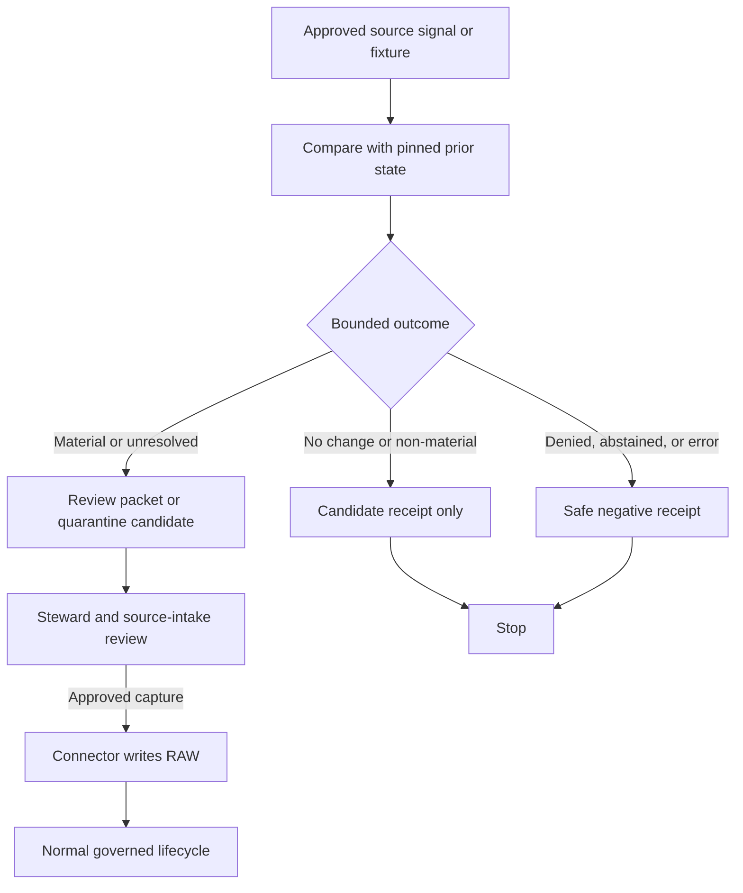

<!-- [KFM_META_BLOCK_V2]
doc_id: kfm://doc/pipelines-watchers-readme
title: Pipeline Watcher Orchestration Boundary
type: readme
version: v0.2
status: draft; repository-grounded; documentation-boundary; placement-conflicted; non-publisher
owners:
  - <pipeline-owner>
  - <watcher-steward>
  - <source-steward>
  - <evidence-steward>
  - <policy-steward>
  - <docs-steward>
created: 2026-06-13
updated: 2026-07-22
supersedes: v0.1
policy_label: public-with-watcher-review-and-sensitivity-gates
path: pipelines/watchers/README.md
evidence_snapshot:
  repository: bartytime4life/Kansas-Frontier-Matrix
  base_ref: main
  base_commit: 1180cf7ec53d5acbbb859a39d93c1d129ec83df9
  prior_blob: a3157c7057834f8a147e8d576f6cb512b32b2a52
related:
  - docs/architecture/directory-rules.md
  - CONTRIBUTING.md
  - pipelines/README.md
  - pipelines/watchers/plants/README.md
  - pipelines/domains/flora/watchers/README.md
  - pipeline_specs/watchers/README.md
  - pipeline_specs/flora/watchers/README.md
  - tools/watchers/README.md
  - connectors/
  - data/registry/sources/
  - data/work/
  - data/quarantine/
  - data/receipts/
  - data/proofs/
  - release/candidates/
tags:
  - kfm
  - pipelines
  - watchers
  - orchestration
  - source-change
  - material-change
  - non-publisher
  - no-network
  - receipts
  - sensitivity
  - governance
notes:
  - "This revision updates the existing README at its established repository path; it does not establish the final executable watcher owner."
  - "Directory Rules assigns executable pipeline logic to pipelines/ and declarative intent to pipeline_specs/, but the shared, domain, and tool watcher surfaces remain placement-conflicted."
  - "No active shared watcher framework, accepted watcher record contract, live-source activation, schedule, substantive CI lane, or production effect is established by this README."
  - "Watcher outputs are candidate evidence-development artifacts. Watchers do not publish."
[/KFM_META_BLOCK_V2] -->

<a id="top"></a>

# Pipeline Watcher Orchestration Boundary

> Observe upstream change signals, produce bounded candidate outcomes, and route reviewed work without turning freshness, drift, or automation into source admission, evidence, catalog truth, or publication authority.

[](#0-status-and-evidence-boundary)
[](#0-status-and-evidence-boundary)
[](#2-placement-and-authority)
[](#3-watcher-anti-collapse-rules)

> [!IMPORTANT]
> This is a documentation and routing boundary. It does not prove that a shared watcher runtime, parser, scheduler, source activation, accepted schema, receipt writer, reviewer integration, or substantive CI check exists. A watcher signal is pre-RAW candidate information; it is not an admitted source capture or a lifecycle promotion.

## Quick navigation

| Orient | Operate | Govern | Maintain |
|---|---|---|---|
| [Status](#0-status-and-evidence-boundary) · [Purpose](#1-purpose) · [Placement](#2-placement-and-authority) | [Scope](#6-watcher-scope) · [Lifecycle](#7-lifecycle-contract) · [Inputs and outputs](#10-inputs-and-outputs) · [Example](#11-minimal-material-change-record) | [Anti-collapse](#3-watcher-anti-collapse-rules) · [Exclusions](#5-what-does-not-belong-here) · [Gates](#8-required-gates) · [Promotion](#13-promotion-publication-correction-and-rollback) | [Directory contract](#9-directory-contract) · [Validation](#12-tests-fixtures-receipts-and-proofs) · [Done](#14-definition-of-done) · [Open questions](#15-open-questions) · [Maintenance](#16-validation-and-maintenance) |

---

## 0. Status and evidence boundary

This README separates current repository evidence from proposed watcher behavior.

| Surface | Status at `main@1180cf7` | Safe interpretation |
|---|---|---|
| `pipelines/watchers/README.md` | **CONFIRMED** existing parent README | Established documentation path; prior text described a shared executable lane, but did not prove one. |
| `pipelines/watchers/plants/README.md` | **CONFIRMED README-only** by its pinned inventory | Child documentation and routing boundary; no active plants watcher is established there. |
| `pipelines/domains/flora/watchers/README.md` | **CONFIRMED competing README surface** | Describes a Flora executable candidate; concrete behavior remains unverified. |
| `pipeline_specs/watchers/README.md` | **CONFIRMED declarative boundary** with one small `PROPOSED` placeholder | Describes what a shared watcher might run; it is not an active spec registry or executable owner. |
| `pipeline_specs/flora/watchers/README.md` | **CONFIRMED README-only declarative sublane** | Domain-specific specification candidate; no active watcher specification is established there. |
| `tools/watchers/README.md` | **CONFIRMED documentation/routing boundary** | Reusable-tool placement competes with pipeline placement; active tooling is not established by that README. |
| Shared watcher implementation | **UNKNOWN** in this bounded inspection | Do not infer implementation, scheduling, network use, or runtime effects from documentation. |
| Accepted shared watcher owner | **CONFLICTED / NEEDS VERIFICATION** | Requires an accepted placement decision, ADR, or migration note before authority is consolidated. |

The repository contains meaningful watcher doctrine and documentation, but documentation is not runtime proof. Current behavior requires implementation, contract, fixture, test, workflow, receipt, and observed-run evidence.

[Back to top](#top)

---

## 1. Purpose

`pipelines/watchers/` documents the candidate shared orchestration boundary for source-head observation, freshness and metadata drift comparison, bounded material-change classification, quarantine or review routing, and deterministic receipt expectations.

The responsibility is intentionally narrow:

- observe an approved signal without treating it as source truth;
- compare it with a pinned prior state;
- return a finite, reviewable candidate outcome;
- preserve source role, rights, sensitivity, temporal, and evidence context;
- emit process memory through an accepted receipt contract;
- hand later work to the connector, source-intake, domain pipeline, policy, evidence, or release owner.

This boundary does not own upstream access authority, source admission, RAW capture, normalization, validation approval, SourceDescriptor meaning, policy decisions, EvidenceBundle closure, catalog or triplet truth, release approval, public APIs, UI behavior, or published artifacts.

### Audience

- pipeline and watcher maintainers;
- source, domain, rights, sensitivity, and cultural-authority stewards;
- contract, schema, validation, evidence, policy, and release reviewers;
- contributors deciding whether shared watcher behavior belongs under pipelines, tools, packages, or a domain lane.

[Back to top](#top)

---

## 2. Placement and authority

Directory Rules assigns **executable pipeline logic** to `pipelines/` and **declarative pipeline configuration** to `pipeline_specs/`. It also requires watchers to emit receipts and candidate decisions only; watchers cannot write catalog or published state.

That root-level rule does not settle the lowest correct owner for a shared watcher framework. Current repository surfaces make competing claims:

| Candidate surface | Responsibility it may express | Current boundary |
|---|---|---|
| `pipelines/watchers/` | Shared executable orchestration used by multiple lanes | **PROPOSED / placement-conflicted**; implementation not established. |
| `pipelines/domains/<domain>/watchers/` | Domain-owned executable behavior | Appropriate only when behavior and review burden are domain-specific. |
| `tools/watchers/` | Reusable operator or repository tooling | **CONFLICTED** with pipeline ownership for long-lived orchestration. |
| `packages/<package>/` | Reusable library used by multiple deployables | Requires proven reuse and an accepted package boundary. |
| `pipeline_specs/watchers/` | Shared declarative watcher intent | May say **what** should run; must not become executable or source-activation authority. |
| `pipeline_specs/<domain>/watchers/` | Domain declarative intent | May bind domain-specific safe signals only after placement and consumer binding are accepted. |

> [!WARNING]
> Do not resolve the conflict by copying helpers, schemas, specs, or receipts into several roots. Select one authority through an ADR or repository-approved migration, preserve compatibility explicitly, and update consumers and tests together.

### Authority rules

- this README may explain and route; it cannot establish an accepted runtime contract by itself;
- domain behavior remains with the appropriate domain lane unless an accepted shared boundary delegates it;
- connector code owns approved source access and capture, not this watcher boundary;
- source descriptors and activation decisions remain in governed registry or source-intake homes;
- schema, contract, policy, fixture, test, lifecycle-data, proof, and release roots retain their own authority;
- public clients use governed APIs and released artifacts, never watcher candidates or internal stores.

[Back to top](#top)

---

## 3. Watcher anti-collapse rules

Disallowed collapses:

```text
watcher signal != source admission
watcher signal != RAW capture
source changed != domain truth changed
source changed != published layer changed
material-change report != EvidenceBundle
source-head match != rights approval
freshness check != validation pass
checksum change != catalog update
watcher receipt != proof or ReleaseManifest
generated watcher summary != evidence
branch, commit, PR, or merge != KFM publication
```

Required distinctions:

- watcher signal, connector output, SourceDescriptor, source-intake decision, RAW capture, WORK candidate, QUARANTINE record, RunReceipt, ValidationReport, EvidenceBundle, catalog record, ReleaseManifest, CorrectionNotice, RollbackCard, and public artifact remain separate object families;
- a watcher reads source role and authority from approved records; it does not invent or upgrade them;
- rights, citation, access class, cadence, source time, retrieval time, review state, and policy state remain auditable;
- unknown source role, rights, cultural authority, sensitivity, evidence, policy, or reviewer state fails closed;
- a no-change result records an observation only; it does not certify the source as correct, complete, current, or safe;
- a changed result proposes investigation; it does not authorize download, admission, transformation, release, or notification.

[Back to top](#top)

---

## 4. What belongs here

Only behavior whose primary responsibility is shared watcher orchestration may belong here after placement is accepted.

Candidate contents include:

- orchestration interfaces that delegate source access to approved connectors;
- deterministic source-head, manifest, checksum, ETag, header, and freshness comparison helpers;
- shared materiality-classification plumbing that consumes approved policy or contract references;
- builders for candidate change records, proposed work records, quarantine handoffs, and watcher receipts;
- checkpoint, replay, idempotency, and duplicate-suppression support;
- redacted reviewer-summary builders that cannot expose restricted values;
- fixture-only entrypoints and adapters shared across more than one accepted watcher lane;
- this README and other approved boundary documentation.

A placement test:

> If the behavior helps several accepted watcher lanes compare approved metadata and emit a bounded candidate or handoff, this path may be appropriate. If it fetches source payloads, owns a domain interpretation, defines object meaning or shape, decides policy, writes lifecycle truth, or publishes, it belongs elsewhere.

[Back to top](#top)

---

## 5. What does not belong here

| Do not place here | Owning responsibility root or boundary |
|---|---|
| Source-specific network clients, credentials, or admission logic | `connectors/<source_id>/` plus governed source records |
| Declarative watcher profiles | `pipeline_specs/watchers/` or an accepted domain spec lane |
| Domain-specific ingest, normalize, validate, catalog, publish, or rollback workflows | `pipelines/domains/<domain>/...` or the accepted domain pipeline lane |
| SourceDescriptor or activation authority | Accepted source registry and source-intake homes |
| Object meaning and machine shape | `contracts/` and `schemas/` |
| Allow, deny, restrict, hold, or abstain decisions | `policy/` under the applicable contract |
| Golden, invalid, sensitive, or replay fixtures | `fixtures/` under the accepted fixture layout |
| Executable proof of behavior | `tests/` and repository-native CI |
| RAW, WORK, QUARANTINE, PROCESSED, CATALOG, TRIPLET, or PUBLISHED material | The matching governed `data/<phase>/` home |
| EvidenceBundles, proof packs, or citation validation | Accepted `data/proofs/` and evidence boundaries |
| Release decisions, corrections, withdrawals, or rollback targets | `release/` |
| Public API, UI, map, tile, notification, or AI delivery code | Governed application and delivery boundaries |
| Generated summaries presented as evidence | Nowhere; generated language remains evidence-subordinate |

[Back to top](#top)

---

## 6. Watcher scope

### Trigger and preconditions

The default development trigger is a deterministic, no-network fixture run. Live or scheduled observation remains denied until current repository evidence proves all applicable prerequisites:

1. an approved watcher identity and owner;
2. an accepted executable home and consumer binding;
3. an admitted SourceDescriptor and explicit watcher activation decision;
4. source-specific rights, terms, access, cadence, robots, rate-limit, and credential handling;
5. an accepted watch specification, input/output contract, reason-code vocabulary, and receipt binding;
6. public-safe fixtures for positive, negative, stale, denial, quarantine, and error paths;
7. policy, sensitivity, reviewer, correction, and kill-switch controls;
8. substantive tests and CI ownership.

### Accepted input classes

| Input class | Required posture | On missing or invalid input |
|---|---|---|
| Watcher and source identity | Stable IDs plus accepted owner and scope | Stop; do not infer identity. |
| Source descriptor and activation | Resolved, active, rights-aware, sensitivity-aware | Deny live access or quarantine the candidate. |
| Watch specification | Versioned, hashed, bound to an accepted consumer | Abstain or error under the applicable contract. |
| Prior state | Immutable reference plus digest and observation time | Produce a baseline-missing candidate; do not claim drift. |
| Current signal | Metadata or fixture reference with source/retrieval time | Stop on malformed, stale, or unauthorized input. |
| Policy and review context | Applicable references and required reviewer classes | Fail closed when unresolved. |
| Runtime/tool identity | Version and configuration digest | Error; do not emit an ambiguous success. |

### Comparison scope

A watcher may compare approved metadata such as availability, version, source-head identifier, manifest digest, checksum, ETag, Last-Modified value, declared cadence, schema identifier, or a bounded material metric. Payload retrieval belongs to the connector/source-intake flow and must not be smuggled into a metadata check.

### Deterministic identity and replay

A future accepted contract should derive run identity from stable inputs, not a timestamp alone. At minimum, bind:

```text
watcher identity
+ source identity and source-descriptor version
+ watch-spec version and digest
+ prior-state reference and digest
+ current-signal reference and digest
+ policy/config/tool versions
= deterministic comparison identity
```

Replay must use pinned fixtures or immutable evidence references, preserve the original temporal fields, and avoid live network access by default. If a source cannot reproduce the original signal, record that limitation instead of fabricating parity.

### Finite candidate outcomes

No accepted repository-wide watcher enum was verified. Until one exists, treat these as **PROPOSED result classes**, not schema constants:

| Result class | Meaning | Allowed next step |
|---|---|---|
| No effective change | Compared signals are equivalent under the accepted rule | Record a no-op candidate receipt; no lifecycle write. |
| Non-material change | A difference exists but is below the approved review threshold | Record reason codes and receipt; no automatic promotion. |
| Material change / needs review | A bounded difference requires steward assessment | Create a candidate report and review handoff. |
| Baseline missing or stale | Comparison cannot support a drift claim | Establish a reviewed baseline or quarantine; never guess. |
| Quarantined or denied | Rights, sensitivity, authority, contract, or policy blocks use | Preserve safe reasons; stop access and side effects. |
| Abstained | Evidence is insufficient or conflict cannot be resolved | Narrow scope or request evidence. |
| Error | Parsing, validation, persistence, or routing failed | Preserve failure receipt and retry only when safe. |

Implementations must use the finite outcomes and reason codes defined by their accepted contracts. This README does not standardize them.

[Back to top](#top)

---

## 7. Lifecycle contract

The canonical KFM lifecycle remains:

```text
RAW -> WORK / QUARANTINE -> PROCESSED -> CATALOG / TRIPLET -> PUBLISHED
```

A watcher signal occurs **before** admission to that lifecycle. It may support a later source-intake decision, but it cannot perform the transition.



Text equivalent:

1. read an approved fixture, source descriptor, prior state, watch spec, and policy context;
2. compare bounded signals without treating them as admitted payloads;
3. classify the result under an accepted finite-outcome contract;
4. emit only a candidate receipt, review packet, proposed work record, or quarantine handoff;
5. stop on denial, abstention, error, or unresolved authority;
6. return approved follow-up to the source steward, connector, source-intake, or domain pipeline;
7. permit later lifecycle work only through its own validation, evidence, policy, review, promotion, correction, and rollback gates.

[Back to top](#top)

---

## 8. Required gates

Every future watcher component must satisfy or fail closed on the applicable gates.

| Gate | Required evidence | Failure posture |
|---|---|---|
| Scope and identity | Watcher ID, source ID, owner, responsibility boundary | Stop. |
| Placement and delegation | Accepted executable home and domain/shared delegation | Hold implementation. |
| No-network fixture | Deterministic public-safe fixture is the default test path | Deny unreviewed live access. |
| SourceDescriptor and activation | Approved identity, role, rights, citation, cadence, access, sensitivity, active state | Deny or quarantine. |
| Prior state | Pinned reference, digest, and relevant time | Baseline-missing result; no drift claim. |
| Specification and contract | Versioned spec, input/output schema, finite outcomes, reason codes | Error or abstain. |
| Materiality | Approved classification rule and recorded reasons | Needs review; no automatic action. |
| Rights, sovereignty, and cultural authority | Applicable rights and steward decisions | Deny or hold. |
| Sensitivity and join risk | Public-safe output, generalization/redaction, cross-dataset inference review | Deny exact or reconstructable exposure. |
| Temporal integrity | Source, retrieval, observation/run, review, release, and correction times remain distinct | Quarantine malformed records. |
| Receipt and integrity | Deterministic input/spec/output/tool digests plus outcome and handoff refs | Error; no success claim. |
| Side-effect boundary | No direct RAW admission, normalization, validation pass, catalog, triplet, release, notification, API/UI, or published write | Deny and preserve failure evidence. |
| Review and kill switch | Reviewer routing, deactivation, withdrawal, and emergency stop are enforceable | Stop further live access. |

### Sensitive and restricted information

Watcher metadata can itself be sensitive. Species names, source identifiers, coordinate-bearing URLs, row counts, diffs, access failures, or joined change patterns may expose rare taxa, cultural knowledge, private land activity, infrastructure, archaeology, living-person data, or other restricted facts.

- do not place credentials, signed URLs, restricted endpoints, exact coordinates, precise locality labels, or sensitive payload excerpts in logs, receipts, PRs, or review summaries;
- evaluate the combination of fields, not each field in isolation;
- generalize, redact, quarantine, delay, abstain, or deny when a safe reviewer view cannot be proven;
- keep restricted reasons available only through an approved role-gated path;
- never use a public GitHub artifact as the review channel for restricted source changes.

[Back to top](#top)

---

## 9. Directory contract

The current path is a documentation boundary. This README does not authorize the proposed files below.

| Artifact or sublane | Current state | Admission condition |
|---|---|---|
| `README.md` | **CONFIRMED** | Maintain as the parent boundary and routing guide. |
| `plants/README.md` | **CONFIRMED README-only** | Keep non-authoritative until placement and contracts are accepted. |
| Shared watcher contract | **PROPOSED** | Define under `contracts/`, not beside implementation; bind by reference. |
| Shared executable helpers | **PROPOSED / placement-conflicted** | Require accepted ownership, delegation, tests, and no-network proof. |
| Shared declarative profiles | **PROPOSED** under `pipeline_specs/watchers/` | Require accepted schema, parser, consumer, and activation binding. |
| Domain adapters | **PROPOSED** | Keep domain meaning and policy in domain lanes; document delegation. |
| Generated outputs | **DENIED beside code** | Write only through accepted lifecycle and receipt homes. |

<details>
<summary>Retained v0.1 candidate helper set</summary>

The prior README proposed helpers for source-head checks, manifest and checksum comparison, material-change classification, candidate-report construction, quarantine routing, dry fixtures, and watcher receipts. Those responsibilities remain useful design inputs, but their filenames and placement are not accepted repository facts.

Before creating any of them:

1. settle the shared pipeline, domain pipeline, tool, and package ownership conflict;
2. define semantic contracts under `contracts/` and machine shapes under `schemas/`;
3. bind declarative profiles from the accepted `pipeline_specs/` lane;
4. add public-safe fixtures and substantive negative tests;
5. document migration and compatibility for competing watcher surfaces.

</details>

[Back to top](#top)

---

## 10. Inputs and outputs

All path examples remain **PROPOSED / NEEDS VERIFICATION** until accepted placement and contracts resolve them.

| Class | Candidate authority or lifecycle home | Watcher relationship |
|---|---|---|
| Source descriptor and activation | Accepted `data/registry/sources/` or source-intake authority | Read-only prerequisite; never edited by the watcher. |
| Watch specification | `pipeline_specs/watchers/` or accepted domain spec lane | Declarative input bound by ID, version, and digest. |
| Prior observation | Prior receipt, source-head, manifest, or immutable fixture | Comparison input only. |
| Current signal | Approved connector metadata or public-safe fixture | Bounded metadata; not an admitted payload. |
| Candidate material-change report | Accepted `data/work/<domain>/...` candidate home | Review input; not evidence or validation approval. |
| Quarantine handoff | Accepted `data/quarantine/<domain>/...` home | Fail-closed routing with safe reason codes. |
| Watcher receipt | Accepted `data/receipts/...` subtype | Process memory; not proof, catalog truth, or release state. |
| Evidence and validation proof | Accepted `data/proofs/` homes | Referenced when available; not created by this lane unless explicitly delegated. |
| Release or rollback object | `release/` | Read or referenced only when necessary; never decided or written here. |

### Output obligations

Every candidate output should preserve, as applicable:

- stable watcher, source, spec, run/comparison, and prior-state references;
- content, input, spec, configuration, policy, and tool-version digests;
- source, retrieval, observation/run, review, release, and correction time without collapsing them;
- bounded outcome and reason codes from the accepted contract;
- rights, citation, source-role, access, sensitivity, and reviewer context by reference;
- emitted candidate, quarantine, receipt, correction, and supersession references;
- explicit negative assertions showing that no admission, catalog, release, or publication side effect occurred.

[Back to top](#top)

---

## 11. Minimal material-change record

The following YAML is **illustrative documentation only**. It is not a verified schema, accepted enum, activation record, or runtime payload.

```yaml
schema_version: <accepted-watcher-record-version>
watcher_run_id: <deterministic-comparison-id>
watcher_id: <approved-watcher-id>
outcome: <accepted-finite-outcome>

source:
  source_id: <approved-source-id>
  source_descriptor_ref: <immutable-source-descriptor-ref>
  source_role: <role-from-approved-descriptor>

specification:
  spec_ref: <immutable-watch-spec-ref>
  spec_hash: <digest>

comparison:
  previous_ref: <immutable-prior-state-ref-or-null>
  previous_hash: <digest-or-null>
  current_ref: <immutable-current-signal-ref>
  current_hash: <digest>
  changed: <true-false-or-unknown>

materiality:
  classification: <accepted-classification>
  reason_codes: []

checks:
  source_descriptor_resolved: false
  source_activation_allowed: false
  prior_state_resolved: false
  rights_and_sensitivity_resolved: false
  no_direct_admission: true
  no_direct_publication: true

outputs:
  candidate_report_ref: null
  quarantine_ref: null
  receipt_ref: <accepted-receipt-ref>
  review_handoff_ref: null

correction:
  supersedes_run_ref: null
  replay_required: false
```

Omitting a field from this example does not make it optional in an accepted contract. Use the accepted schema and validator when they exist.

[Back to top](#top)

---

## 12. Tests, fixtures, receipts, and proofs

### Documentation validation

This README can be checked for structure, links, anchors, tables, alerts, fences, Mermaid syntax, metadata continuity, and sensitive-content leakage. Passing those checks proves only that the documentation is internally coherent.

### Future implementation proof

A fixture-first validation suite should cover:

| Test family | Required behavior |
|---|---|
| No-network default | All ordinary tests use pinned public-safe fixtures. |
| Identity and scope | Missing watcher, source, owner, spec, or descriptor fails closed. |
| Baseline handling | Missing, incompatible, or stale prior state cannot produce a confident drift claim. |
| Outcome coverage | No-change, non-material, material, quarantine/deny, abstain, stale, and error paths are deterministic under the accepted contract. |
| Integrity | Input, spec, prior-state, output, policy, configuration, and tool digests validate. |
| Replay and idempotency | Same effective inputs produce the same identity and no duplicate side effects. |
| Partial failure | Comparison success plus persistence or routing failure cannot report overall success. |
| Rights and sensitivity | Unknown rights or reconstructable sensitive detail fails closed. |
| Temporal integrity | Source, retrieval, run, review, release, and correction time remain distinct. |
| Non-publication | No direct RAW admission, processed/catalog/triplet/published write, release decision, notification, or public API/UI side effect. |
| Correction and kill switch | Supersession preserves prior receipts; deactivation stops further live access. |
| Secret safety | Logs and review artifacts exclude credentials, signed URLs, restricted endpoints, and restricted payload values. |

### Receipts are not proofs

A watcher receipt records what comparison was attempted and its bounded outcome. It does not by itself prove:

- the source is correct or authoritative;
- the payload was admitted or validated;
- the domain interpretation is true;
- an EvidenceBundle is complete;
- a release was approved;
- a public artifact is safe or current.

No repository-native shared watcher command was verified during this documentation change. Do not invent a quickstart until executable code, accepted contracts, fixtures, and test wiring establish one.

[Back to top](#top)

---

## 13. Promotion, publication, correction, and rollback

Watchers may prepare candidate records, proposed work, quarantine handoffs, review packets, and receipts. They do not self-promote any result.

```text
candidate watcher outcome
  -> source, domain, rights, sensitivity, and policy review
  -> governed connector or source-intake action, if approved
  -> RAW capture
  -> WORK / QUARANTINE
  -> validation, evidence, catalog/triplet, and release gates
  -> ReleaseManifest + rollback target
  -> public artifact, only when authorized
```

### Idempotency, checkpoints, partial failure, and retry

- **Idempotency:** the same effective input tuple must not create duplicate candidate records, review packets, or lifecycle side effects.
- **Checkpoints:** persist only through an accepted receipt/state contract; bind the completed stage to input and output digests.
- **Partial failure:** if comparison succeeds but validation, persistence, receipt creation, or routing fails, record the failure and stop.
- **Retry:** retry bounded transient failures only. Re-read source-head and prior-state references so a retry is not confused with the original observation.
- **Ambiguous outcome:** inspect existing records and side effects before retrying; never duplicate writes because a timeout response was unclear.
- **Stale state:** preserve the last verified state as stale, not current.
- **Kill switch:** source withdrawal, rights change, sensitivity escalation, reviewer stop, or contract incompatibility must prevent further live access.

### Correction and supersession

1. preserve the original run receipt and bounded reason codes;
2. create a correction or superseding record rather than overwriting history;
3. retain denial, abstention, quarantine, and failure evidence under the applicable access controls;
4. notify downstream consumers only through governed interfaces;
5. stop future runs when a source, activation, or specification is withdrawn;
6. record whether replay is required and which immutable inputs govern it.

Rollback for a downstream published product is owned by `release/`, not this directory. A branch, commit, pull request, merge, tag, successful watcher run, or receipt is not KFM publication.

[Back to top](#top)

---

## 14. Definition of done

### This README

The documentation upgrade is complete when it:

- preserves the document ID, path, created date, core scope, boundary tables, example, validation intent, rollback posture, and open-question lineage;
- distinguishes verified documentation surfaces from unverified implementation;
- explains the pipeline/spec split without selecting a conflicted executable owner;
- preserves the canonical lifecycle by keeping watcher signals outside RAW admission;
- defines trigger, input, deterministic identity, replay, finite result, output, gate, retry, correction, and kill-switch expectations;
- makes rights, cultural authority, sensitivity, temporal integrity, and join risk explicit;
- denies direct admission, validation approval, catalog, release, notification, and publication side effects;
- contains no unsupported source activation, runtime, CI, owner, command, release, or public-safety claim.

### Future executable behavior

Implementation is done only when current repository evidence proves:

- placement and shared/domain delegation are accepted;
- SourceDescriptors and activation decisions resolve;
- input, output, outcome, reason-code, receipt, correction, and supersession contracts are accepted;
- deterministic no-network fixtures cover positive and negative paths;
- idempotency, replay, checkpoint, retry, partial-failure, stale-state, and kill-switch behavior are tested;
- rights, cultural authority, source role, sensitivity, evidence, and no-publication gates pass;
- credentials and restricted values cannot enter logs or review artifacts;
- substantive repository-native CI invokes the tests;
- reviewer routing and correction propagation are enforceable;
- release-owned rollback is documented and exercised.

[Back to top](#top)

---

## 15. Open questions

| ID | Question | Status |
|---|---|---|
| `PIPE-WATCH-001` | Is the accepted shared executable owner `pipelines/watchers/`, a package, a tool lane, or no shared lane at all? | **CONFLICTED / NEEDS VERIFICATION** |
| `PIPE-WATCH-002` | Which contracts and schemas own watcher candidate records, proposed work, receipts, corrections, and reason codes? | **NEEDS VERIFICATION** |
| `PIPE-WATCH-003` | What delegation rule separates shared helpers from `pipelines/domains/<domain>/watchers/` behavior? | **NEEDS VERIFICATION** |
| `PIPE-WATCH-004` | Which accepted parser, registry, and consumer bind shared versus domain watcher specifications? | **UNKNOWN** |
| `PIPE-WATCH-005` | Which SourceDescriptors and activation decisions permit the first bounded no-network and live watcher profiles? | **NEEDS VERIFICATION** |
| `PIPE-WATCH-006` | Which receipt subtype and lifecycle paths are canonical for shared versus domain watcher outcomes? | **NEEDS VERIFICATION** |
| `PIPE-WATCH-007` | Which substantive CI job owns no-network, sensitivity, negative-side-effect, replay, and correction tests? | **UNKNOWN** |
| `PIPE-WATCH-008` | Which verified reviewers own pipeline, domain, source rights, cultural authority, sensitivity, evidence, policy, and release handoffs? | **NEEDS VERIFICATION** |
| `PIPE-WATCH-009` | May an approved watcher open a draft PR or review packet automatically, and what prevents duplicate or restricted-content submissions? | **NEEDS VERIFICATION** |
| `PIPE-WATCH-010` | Which deterministic identity, outcome, checkpoint, retry, deactivation, correction, and supersession vocabularies are accepted? | **NEEDS VERIFICATION** |

[Back to top](#top)

---

## 16. Validation and maintenance

### Documentation checks

| Check | Expected result | What passing does not prove |
|---|---|---|
| Markdown structure | One H1, logical headings, closed fences, valid tables and alerts | Executable watcher behavior. |
| Links and anchors | Repository-relative destinations and document fragments resolve at the branch head | Linked plans are implemented or accepted. |
| Badge manifest | Four badges match text-backed document, evidence, placement, and publication posture | CI, security, compliance, or KFM release. |
| Mermaid source | The branching flow parses under supported Mermaid syntax | An orchestrator or runtime exists. |
| Metadata continuity | `doc_id`, path, owners, and created date are preserved; version and update date reflect this change | Owner assignment or publication. |
| Semantic no-loss | v0.1 purpose, boundaries, gates, example, validation, rollback, and questions remain materially represented | Acceptance of proposed contracts or paths. |
| Diff scope | Only `pipelines/watchers/README.md` changes | Absence of unrelated repository drift. |
| Sensitive-content scan | No credentials, signed URL, restricted endpoint, exact sensitive locality, or private identifier is added | Full repository or operational safety. |

### Review burden

Named human or team ownership remains unverified. Until CODEOWNERS and governance records settle it, changes should be reviewed by the applicable pipeline/watcher, source/domain, rights/cultural-authority, sensitivity, contract/schema, validation, evidence, policy, release, security, and documentation roles. Do not infer approval from a placeholder owner or a green documentation check.

### Maintenance triggers

Review this README when:

- an ADR or migration note settles shared, domain, tool, package, or spec placement;
- an accepted watcher contract, schema, parser, registry, or consumer lands;
- a source is activated, disabled, withdrawn, or changes terms;
- a no-network fixture suite, substantive CI job, scheduler, or live run becomes verifiable;
- outcome, reason-code, identity, receipt, correction, or rollback vocabularies change;
- rights, cultural authority, sensitivity, geoprivacy, security, or source-role rules change;
- a correction, incident, duplicate PR, stale baseline, or release rollback exposes a boundary gap.

Do not update a static badge independently of the matching text status.

[Back to top](#top)

---

## 17. Related authority surfaces

| Reference | Relationship |
|---|---|
| [`CONTRIBUTING.md`](../../CONTRIBUTING.md) | Repository evidence, placement, security, review, and PR discipline. |
| [Directory Rules](../../docs/architecture/directory-rules.md) | Responsibility-root law, pipeline/spec split, watcher non-publication, and migration discipline. |
| [Pipelines root](../README.md) | Parent executable pipeline responsibility boundary. |
| [Plants watcher boundary](plants/README.md) | Confirmed child documentation and placement-conflict case. |
| [Flora watcher candidate](../domains/flora/watchers/README.md) | Competing domain-owned executable documentation surface. |
| [Shared watcher specifications](../../pipeline_specs/watchers/README.md) | Declarative shared watcher intent and placeholder inventory. |
| [Flora watcher specifications](../../pipeline_specs/flora/watchers/README.md) | Domain declarative watcher boundary. |
| [Watcher tooling routing](../../tools/watchers/README.md) | Competing reusable-tool and compatibility boundary. |
| [Plants-drift fixtures](../../fixtures/domains/flora/plants_drift/README.md) | Synthetic fixture guidance; consumer coverage remains unverified. |
| [Flora source registry](../../data/registry/sources/flora/README.md) | Source identity, role, rights, access, and activation prerequisites. |
| [Flora receipts](../../data/receipts/flora/README.md) | Process-memory boundary; exact watcher subtype layout remains unresolved. |
| [Flora release candidates](../../release/candidates/flora/README.md) | Later pre-publication review boundary; watchers cannot write release decisions. |
| [Drift register](../../docs/registers/DRIFT_REGISTER.md) | Repository mechanism for recording unresolved structural conflict. |

## Maintainer note

Keep this boundary small until ownership and contracts are settled. The first useful executable slice should be fixture-only, metadata-first, deterministic, receipt-emitting, deny direct publication, and prove at least one no-op, one material-change review handoff, one quarantine or denial, and one partial-failure path before live source access is considered.

[Back to top](#top)
