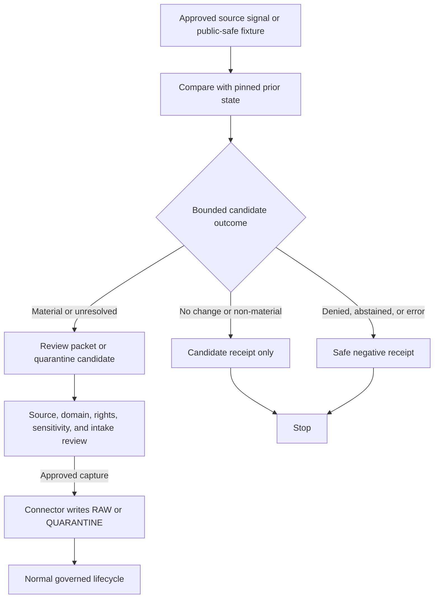

<!-- [KFM_META_BLOCK_V2]
doc_id: kfm://doc/pipelines-watchers-readme
title: pipelines/watchers/ — Governed Shared Watcher Orchestration Boundary
type: readme; nested-directory-readme; executable-orchestration-boundary; non-publisher
version: v0.3
status: draft; repository-grounded; documentation-boundary; bounded-non-publisher-ci-confirmed; watcher-runtime-unverified; placement-conflicted; non-publisher
owners:
  - "@bartytime4life"
created: 2026-06-13
updated: 2026-07-24
supersedes: v0.2
policy_label: public; pipelines; watchers; pre-raw; metadata-first; no-network-by-default; rights-aware; sensitivity-aware; receipt-aware; non-publisher; correction-aware; rollback-aware
path: pipelines/watchers/README.md
truth_posture: >
  CONFIRMED current target bytes, canonical pipelines responsibility root, Directory Rules v1.4,
  duplicated seven-line plants-drift specification placeholders, schema-paired PROPOSED RunReceipt,
  CODEOWNERS routing, a repository-native boundary-guard Make target, a path-scoped GitHub Actions
  workflow, and an executable static connector/pipeline non-publisher test / PROPOSED shared watcher
  runtime, accepted watcher record contract, watcher-specific receipt binding, parser, registry,
  materiality vocabulary, no-network fixture suite, reviewer handoff, and first governed executable
  slice / CONFLICTED shared-versus-domain-versus-tool ownership and duplicated shared-versus-Flora
  plants-drift specification placement / UNKNOWN source activation, scheduler, network behavior,
  emitted watcher receipts, observed watcher runs, production effects, and publication effects /
  NEEDS VERIFICATION accepted governance owners, branch-protection coupling, watcher-specific CI,
  source rights and activation records, correction propagation, deactivation, and release-owned rollback
evidence_snapshot:
  repository: bartytime4life/Kansas-Frontier-Matrix
  repository_id: "1059091169"
  visibility: public
  base_ref: main
  base_commit: 5c2ee7d15b99f0e308e8b937dee941daa4715211
  prior_blob: 8d6b6474365fbf4c93988db760c98348b1451af8
  directory_rules_doctrine_blob: 2affb080e6f0043867c64c7f06c1ca52030fbd55
  directory_rules_compatibility_blob: 18653c00ba193a4afaa3e07a0924452807fb98ef
  pipelines_root_blob: c2bee1db957a665b973b44aea8bda63bdd82b7e5
  shared_spec_readme_blob: d3f554a87a994ae32b9f3a6211a6224e5084b99f
  shared_placeholder_blob: fa8ab22f84d2ac41a3a49b9633509c196d989925
  flora_placeholder_blob: efc75e02896e99451fbd103d4a858c55c83784c1
  run_receipt_contract_blob: 5592aa5e22bbdd0c668189f79b50c18f7d1b2479
  run_receipt_schema_blob: 80d13bcb750d56c769da2f8871242388f7f50a69
  non_publisher_test_blob: c6164787bc848eb2347c347af203d76afae37a2b
  boundary_workflow_blob: 6d442a6cdd0b146cd4003cbf1d7c619a455a16ae
  codeowners_blob: dd2a84aa514d8ecd9208bc347f90f9a2ed37dd61
related:
  - ../../docs/doctrine/directory-rules.md
  - ../../docs/architecture/directory-rules.md
  - ../../CONTRIBUTING.md
  - ../README.md
  - ./plants/README.md
  - ../domains/flora/watchers/README.md
  - ../../pipeline_specs/watchers/README.md
  - ../../pipeline_specs/watchers/plants_drift.yaml
  - ../../pipeline_specs/flora/watchers/README.md
  - ../../pipeline_specs/flora/plants_drift_watcher.yaml
  - ../../tools/watchers/README.md
  - ../../tools/watchers/plants_watch/README.md
  - ../../contracts/runtime/run_receipt.md
  - ../../schemas/contracts/v1/runtime/run_receipt.schema.json
  - ../../tools/validators/validate_run_receipt.py
  - ../../fixtures/contracts/v1/runtime/run_receipt/README.md
  - ../../tests/policy/test_pipeline_connector_non_publisher.py
  - ../../.github/workflows/policy-boundary-guards.yml
  - ../../.github/CODEOWNERS
  - ../../data/registry/sources/
  - ../../data/work/
  - ../../data/quarantine/
  - ../../data/receipts/
  - ../../data/proofs/
  - ../../release/
  - ../../docs/registers/DRIFT_REGISTER.md
tags:
  - kfm
  - pipelines
  - watchers
  - orchestration
  - pre-raw
  - source-change
  - material-change
  - non-publisher
  - no-network
  - receipts
  - sensitivity
  - governance
notes:
  - "This revision updates the existing README at the same path and preserves its non-publisher boundary."
  - "CODEOWNERS confirms @bartytime4life as the GitHub review route for pipelines/, but does not establish governance-role approval or separation of duties."
  - "A bounded static CI guard now checks connectors/ and pipelines/ for direct write contexts targeting data/catalog, data/published, or release/; it is not a watcher runtime test."
  - "Two seven-line PROPOSED plants-drift placeholders exist in shared and Flora specification lanes; neither is an active specification."
  - "Watcher outputs are candidate evidence-development artifacts. Watchers do not publish."
[/KFM_META_BLOCK_V2] -->

<a id="top"></a>

# `pipelines/watchers/` — Governed Shared Watcher Orchestration Boundary

> Observe approved upstream signals, compare pinned state, emit bounded candidate outcomes, and route reviewed follow-up without turning freshness, drift, automation, or a green check into source admission, evidence, catalog truth, release authority, or publication.

[](#status-and-evidence-boundary)
[](https://github.com/bartytime4life/Kansas-Frontier-Matrix/actions/workflows/policy-boundary-guards.yml)
[](#placement-and-authority)
[](#watcher-anti-collapse-rules)
[](../../docs/doctrine/directory-rules.md)

> [!IMPORTANT]
> This path is currently a **documentation and routing boundary**, not proof of a shared watcher runtime. The repository does confirm a bounded non-publisher CI guard and a draft schema-paired `RunReceipt`; it does **not** confirm an accepted shared watcher parser, active specification, source activation, schedule, live network use, watcher-specific receipt binding, observed run, or production effect.

> [!CAUTION]
> The workflow badge represents the latest `policy-boundary-guards` result on `main`. That workflow includes a static non-publisher test for `connectors/` and `pipelines/`; it does not prove watcher correctness, rights or sensitivity review, evidence closure, release readiness, or KFM publication.

## Navigation

| Orient | Operate | Govern | Maintain |
|---|---|---|---|
| [Purpose](#purpose) · [Status](#status-and-evidence-boundary) · [Placement](#placement-and-authority) | [Operating contract](#watcher-operating-contract) · [Lifecycle](#lifecycle-contract) · [Inputs and outputs](#inputs-and-outputs) · [Example](#illustrative-material-change-record) | [Anti-collapse](#watcher-anti-collapse-rules) · [Exclusions](#what-does-not-belong-here) · [Gates](#required-gates) · [Promotion](#promotion-publication-correction-and-rollback) | [Directory contract](#directory-contract) · [Validation](#validation-tests-fixtures-receipts-and-proofs) · [Done](#definition-of-done) · [Open register](#open-verification-register) · [Maintenance](#validation-review-and-maintenance) |

---

## Purpose

`pipelines/watchers/` is the candidate shared executable-orchestration lane for watcher behavior that is truly reusable across multiple accepted source or domain lanes.

Its responsibility is intentionally narrow:

- consume an approved fixture or source-facing signal by reference;
- compare it with a pinned prior state under a versioned rule;
- preserve source role, rights, sensitivity, temporal, policy, and reviewer context;
- classify a bounded candidate outcome;
- emit process memory and a safe review or quarantine handoff;
- stop before source admission, lifecycle promotion, evidence closure, release, notification, or publication;
- delegate approved follow-up to the connector, source-intake, domain pipeline, policy, evidence, or release owner.

This path does not own upstream access authority, connector retrieval, `SourceDescriptor` meaning, source activation, RAW admission, domain normalization, validation approval, `EvidenceBundle` closure, policy decisions, catalog or triplet truth, release approval, public APIs, map/UI behavior, official notification, or published artifacts.

### Audience

- pipeline, watcher, and pipeline-spec maintainers;
- source, domain, rights, cultural-authority, sensitivity, and security stewards;
- contract, schema, validation, evidence, policy, release, correction, and rollback reviewers;
- contributors reconciling shared, domain-specific, tool, and package watcher ownership.

[Back to top](#top)

---

## Status and evidence boundary

Snapshot: `main@5c2ee7d15b99f0e308e8b937dee941daa4715211`, inspected for this README update on 2026-07-24.

| Surface | Current evidence | Safe interpretation |
|---|---|---|
| `pipelines/watchers/README.md` | **CONFIRMED** existing parent README | Established documentation path; not runtime proof. |
| `pipelines/watchers/plants/README.md` | **CONFIRMED** child documentation surface | Routing and proposed boundary only; no active plants watcher is established by the README. |
| `pipelines/domains/flora/watchers/README.md` | **CONFIRMED** competing domain-owned executable documentation surface | Describes Flora watcher intent; concrete executable behavior remains unverified. |
| `pipeline_specs/watchers/README.md` | **CONFIRMED** shared declarative boundary | Direct inventory documents one seven-line shared plants-drift placeholder. |
| `pipeline_specs/watchers/plants_drift.yaml` | **CONFIRMED** seven-line `PROPOSED` placeholder | No stable spec identity, parser, consumer, checks, source binding, fixtures, receipt binding, or activation. |
| `pipeline_specs/flora/watchers/README.md` | **CONFIRMED** Flora declarative documentation sublane | Domain specification boundary; not an active registry or consumer. |
| `pipeline_specs/flora/plants_drift_watcher.yaml` | **CONFIRMED** second seven-line `PROPOSED` placeholder | Duplicates the plants-drift concept in a different specification lane; placement remains conflicted. |
| `tools/watchers/README.md` and `tools/watchers/plants_watch/README.md` | **CONFIRMED** reusable-tool documentation surfaces | Tool placement competes with long-lived pipeline orchestration; no shared runtime is established by these READMEs. |
| `contracts/runtime/run_receipt.md` + paired schema | **CONFIRMED draft / PROPOSED** generic execution-receipt family | Provides a real schema-paired receipt surface, but no watcher-specific profile or binding is accepted. |
| `tests/policy/test_pipeline_connector_non_publisher.py` | **CONFIRMED executable static guard** | Scans write contexts in `connectors/` and `pipelines/` for direct targets under `data/catalog`, `data/published`, and `release/`. |
| `.github/workflows/policy-boundary-guards.yml` | **CONFIRMED path-scoped CI workflow** | Runs `make boundary-guards-ci`, includes the non-publisher test, uses read-only contents permission, and emits a non-authoritative JUnit artifact. |
| `.github/CODEOWNERS` | **CONFIRMED** `pipelines/` route to `@bartytime4life` | GitHub review routing only; not stewardship assignment, policy approval, release approval, or proof that review occurred. |
| Shared watcher implementation, parser, scheduler, source activation, live run, and production effect | **UNKNOWN** | Do not infer from README, placeholder YAML, static guard, workflow, or receipt schema. |
| Accepted shared executable owner | **CONFLICTED / NEEDS VERIFICATION** | Requires an accepted ADR, migration note, or repository-governed delegation decision. |

### Evidence grades

| Grade | Meaning here | Examples |
|---|---|---|
| Implementation-bearing | Current code, test, workflow, schema, or contract bytes inspected | Static non-publisher test, boundary workflow, RunReceipt schema |
| Documentation-bearing | README or planning surface exists | Shared/domain/tool watcher READMEs |
| Placeholder | File exists but intentionally establishes no active behavior | Both plants-drift YAML files |
| Proposed | Design supported by doctrine but not accepted as implementation | Shared watcher runtime and watcher-specific contracts |
| Unknown | No current evidence establishes the claim | Live scheduling, source activation, runtime effects |

[Back to top](#top)

---

## Placement and authority

Directory Rules v1.4 assigns:

```text
pipelines/       executable pipeline logic and orchestration — HOW work runs
pipeline_specs/  declarative configuration and activation intent — WHAT may run
tools/           reusable, side-effect-limited validators, checkers, and helpers
connectors/      source-specific upstream access and payload retrieval
packages/        reusable libraries with proven consumers and an accepted package boundary
```

The responsibility root is clear; the lowest correct watcher owner is not.

| Candidate surface | Responsibility it may express | Current posture |
|---|---|---|
| `pipelines/watchers/` | Shared executable orchestration used by multiple accepted lanes | **PROPOSED / placement-conflicted**; implementation not established. |
| `pipelines/domains/<domain>/watchers/` | Domain-owned executable behavior | Appropriate only when source interpretation, sensitivity, or review burden is domain-specific. |
| `tools/watchers/` | Reusable validators/checkers/helpers with bounded side effects | **CONFLICTED** when used as long-lived orchestration. |
| `packages/<package>/` | Shared library consumed by multiple implementations | Requires verified consumers, versioning, tests, and an accepted package boundary. |
| `pipeline_specs/watchers/` | Shared declarative watcher intent | May state what is permitted; cannot become executable or source-activation authority. |
| `pipeline_specs/<domain>/watchers/` | Domain declarative intent | May bind domain-specific signals only after consumer, parser, source, and policy bindings are accepted. |

> [!WARNING]
> Do not resolve the conflict by copying code, helpers, schemas, specifications, receipts, or fixtures into several roots. Choose one authority through an ADR or migration decision, retain explicit compatibility where required, update consumers and tests atomically, and record rollback.

### Authority rules

- this README may explain, index, and route; it cannot accept a runtime contract by itself;
- connector code owns approved upstream access and capture;
- source descriptors and activation decisions remain in governed registry/source-intake homes;
- domain meaning remains in domain contracts and domain-owned pipeline lanes;
- schemas define shape; policy decides allow, deny, restrict, hold, or abstain;
- tests and fixtures prove representative behavior;
- lifecycle records, receipts, proofs, catalogs, and published artifacts remain in governed `data/` homes;
- release, correction, withdrawal, supersession, and rollback decisions remain under `release/`;
- public clients use governed APIs and released artifacts, never watcher candidates or internal stores.

[Back to top](#top)

---

## Watcher anti-collapse rules

Disallowed collapses:

```text
README or path existence != active watcher
placeholder specification != accepted specification
watcher signal != source admission
watcher signal != RAW capture
source changed != domain truth changed
source changed != published layer changed
material-change report != ValidationReport
material-change report != EvidenceBundle
source-head match != rights approval
freshness check != validation pass
checksum change != catalog update
RunReceipt != proof, PolicyDecision, or ReleaseManifest
green boundary guard != watcher correctness
branch, commit, PR, merge, tag, workflow, or receipt != KFM publication
generated watcher summary != evidence
```

Required distinctions:

- trigger, signal, connector output, `SourceDescriptor`, activation decision, RAW capture, WORK candidate, QUARANTINE record, `RunReceipt`, `ValidationReport`, `EvidenceBundle`, catalog record, release object, correction notice, rollback card, and public artifact remain separate;
- generic execution outcome (`SUCCESS`, `PARTIAL`, `FAIL`) remains distinct from a domain/watch result such as no-change, material-change, deny, abstain, stale, or error;
- a watcher reads source role and authority from approved records; it does not invent or upgrade them;
- rights, citation, access class, cadence, source time, retrieval time, run time, review time, release time, and correction time remain auditable and distinct;
- unknown source role, rights, cultural authority, sensitivity, evidence, policy, or reviewer state fails closed;
- a no-change result records one observation only; it does not certify the source as correct, complete, current, or safe;
- a changed result proposes investigation; it does not authorize download, admission, transformation, notification, release, or publication.

[Back to top](#top)

---

## What belongs here

Only behavior whose primary responsibility is **shared executable watcher orchestration** may belong here after placement is accepted.

Candidate contents include:

- orchestration interfaces that delegate source access to approved connectors;
- deterministic source-head, manifest, checksum, ETag, header, version, and freshness comparison helpers;
- shared materiality-classification plumbing that consumes accepted contract and policy references;
- builders for candidate change records, proposed work records, quarantine handoffs, and watcher receipts;
- checkpoint, replay, idempotency, duplicate-suppression, retry, and stale-state support;
- redacted reviewer-summary builders that cannot expose restricted values;
- fixture-only entrypoints and adapters shared across more than one accepted watcher lane;
- this README and approved boundary documentation.

> **Placement test:** If the behavior helps several accepted watcher lanes compare approved metadata and emit a bounded candidate or handoff, this path may be appropriate. If it fetches source payloads, owns domain interpretation, defines meaning or shape, decides policy, writes lifecycle truth, or publishes, it belongs elsewhere.

[Back to top](#top)

---

## What does not belong here

| Do not place here | Owning responsibility root or boundary |
|---|---|
| Source-specific network clients, credentials, payload retrieval, or source admission | `connectors/<source_id>/` plus governed source records |
| Declarative watcher profiles | `pipeline_specs/watchers/` or an accepted domain specification lane |
| Domain-specific ingest, normalize, validate, catalog, publish, or rollback workflows | `pipelines/domains/<domain>/...` |
| `SourceDescriptor` or activation authority | Accepted source registry and source-intake homes |
| Object meaning and machine shape | `contracts/` and `schemas/` |
| Allow, deny, restrict, hold, or abstain decisions | `policy/` under the applicable contract |
| Golden, invalid, sensitive, or replay fixtures | `fixtures/` under the accepted fixture layout |
| Executable proof of behavior | `tests/` and repository-native CI |
| RAW, WORK, QUARANTINE, PROCESSED, CATALOG, TRIPLET, or PUBLISHED material | The matching governed `data/<phase>/` home |
| `EvidenceBundle`, proof pack, or citation-validation authority | Accepted evidence and `data/proofs/` homes |
| Release decisions, corrections, withdrawals, supersessions, or rollback targets | `release/` |
| Public API, UI, map, tile, alert, notification, or AI delivery code | Governed application and delivery boundaries |
| Generated summaries presented as evidence | Nowhere; generated language remains evidence-subordinate |

[Back to top](#top)

---

## Watcher operating contract

### Trigger and preconditions

The default development trigger is a deterministic, no-network fixture run. Live or scheduled observation remains denied until current evidence proves all applicable prerequisites:

1. an approved watcher identity, scope, owner, and executable home;
2. an accepted shared/domain delegation and consumer binding;
3. an admitted `SourceDescriptor` and explicit watcher activation decision;
4. source-specific rights, terms, access, cadence, robots, rate-limit, credential, and outage handling;
5. an accepted watch specification, parser, input/output contract, materiality rules, finite outcomes, reason codes, and receipt profile;
6. public-safe fixtures for positive, negative, stale, deny, quarantine, abstain, error, retry, replay, and partial-failure paths;
7. policy, sensitivity, reviewer, correction, deactivation, and kill-switch controls;
8. substantive watcher-specific tests and CI ownership.

### Accepted input classes

| Input class | Required posture | On missing or invalid input |
|---|---|---|
| Watcher and source identity | Stable IDs, accepted owner, bounded scope | Stop; do not infer identity. |
| Source descriptor and activation | Resolved, active, rights-aware, sensitivity-aware | Deny live access or quarantine the candidate. |
| Watch specification | Versioned, hashed, parsed, bound to one accepted consumer | Abstain or error under the applicable contract. |
| Prior state | Immutable reference, digest, and observation time | Produce a baseline-missing candidate; do not claim drift. |
| Current signal | Approved metadata or public-safe fixture with source/retrieval time | Stop on malformed, stale, unauthorized, or overbroad input. |
| Policy and review context | Applicable references, obligations, and reviewer classes | Fail closed when unresolved. |
| Runtime/tool identity | Version, code reference, and configuration digest | Error; do not emit ambiguous success. |

### Comparison scope

A watcher may compare approved metadata such as availability, source-head identifier, manifest digest, checksum, ETag, `Last-Modified`, content length, declared cadence, schema/version identifier, DOI/package version, or a bounded material metric.

Payload retrieval belongs to connector/source-intake flow. It must not be smuggled into a metadata check.

### Deterministic identity and replay

A future accepted contract should derive comparison identity from stable inputs rather than a timestamp alone:

```text
watcher identity
+ source identity and SourceDescriptor version
+ watch-spec version and digest
+ prior-state reference and digest
+ current-signal reference and digest
+ policy/configuration/tool/code versions
= deterministic comparison identity
```

Replay must use pinned fixtures or immutable references, preserve the original temporal fields, and avoid live network access by default. When a source cannot reproduce the original signal, record the limitation rather than fabricating parity.

### Candidate outcomes versus execution outcomes

The repository confirms a draft generic `RunReceipt` outcome enum:

```text
SUCCESS | PARTIAL | FAIL
```

Those values describe stage execution. They do **not** define watcher meaning.

No accepted repository-wide watcher result enum was verified. Until one exists, these remain **PROPOSED result classes**, not schema constants:

| Candidate result class | Meaning | Allowed next step |
|---|---|---|
| No effective change | Compared signals are equivalent under the accepted rule | Record a no-op candidate receipt; no lifecycle write. |
| Non-material change | A difference exists below the approved review threshold | Record reasons and receipt; no automatic promotion. |
| Material change / needs review | A bounded difference requires steward assessment | Create a safe candidate report and review handoff. |
| Baseline missing or stale | Comparison cannot support a drift claim | Establish a reviewed baseline or quarantine; never guess. |
| Quarantined or denied | Rights, sensitivity, authority, contract, or policy blocks use | Preserve safe reasons; stop access and side effects. |
| Abstained | Evidence is insufficient or a conflict is unresolved | Narrow scope or request evidence. |
| Error | Parsing, validation, persistence, or routing failed | Preserve failure receipt and retry only when safe. |

An accepted watcher profile must define how its candidate result maps to a generic execution receipt without collapsing the two vocabularies.

[Back to top](#top)

---

## Lifecycle contract

The canonical lifecycle remains:

```text
RAW -> WORK / QUARANTINE -> PROCESSED -> CATALOG / TRIPLET -> PUBLISHED
```

A watcher signal occurs before admission to that lifecycle.



Text equivalent:

1. resolve an approved fixture/signal, source descriptor, prior state, specification, runtime identity, and policy context;
2. compare bounded signals without treating them as admitted payloads;
3. classify the result under an accepted finite-outcome contract;
4. emit only a candidate receipt, safe review packet, proposed work record, or quarantine handoff;
5. stop on denial, abstention, error, or unresolved authority;
6. return approved follow-up to the source steward, connector, source-intake owner, or domain pipeline;
7. permit later lifecycle work only through its own validation, evidence, policy, review, promotion, correction, and rollback gates.

[Back to top](#top)

---

## Required gates

Every future watcher component must satisfy or fail closed on the applicable gates.

| Gate | Required evidence | Failure posture |
|---|---|---|
| Scope and identity | Watcher ID, source ID, owner, responsibility boundary | Stop. |
| Placement and delegation | Accepted executable home, parser, consumer, and shared/domain delegation | Hold implementation. |
| No-network fixture | Deterministic public-safe fixture is the default test path | Deny unreviewed live access. |
| SourceDescriptor and activation | Approved identity, role, rights, citation, cadence, access, sensitivity, active state | Deny or quarantine. |
| Prior state | Pinned reference, digest, and relevant time | Baseline-missing result; no drift claim. |
| Specification and contract | Versioned spec, input/output shapes, finite outcomes, reason codes | Error or abstain. |
| Materiality | Approved classification rule and recorded reasons | Needs review; no automatic action. |
| Rights, sovereignty, and cultural authority | Applicable rights and steward decisions | Deny or hold. |
| Sensitivity and join risk | Public-safe output, generalization/redaction, inference review | Deny exact or reconstructable exposure. |
| Temporal integrity | Source, retrieval, run, review, release, and correction times remain distinct | Quarantine malformed records. |
| Receipt and integrity | Input/spec/output/code/tool digests, outcome, and handoff refs | Error; no success claim. |
| Side-effect boundary | No direct admission, validation approval, catalog, triplet, release, public notification, API/UI, or published write | Deny and preserve failure evidence. |
| Review and kill switch | Reviewer routing, deactivation, withdrawal, and emergency stop are enforceable | Stop further live access. |

### Sensitive and restricted information

Watcher metadata can itself be sensitive. Species names, source identifiers, coordinate-bearing URLs, row counts, diffs, access failures, or joined change patterns may expose rare taxa, cultural knowledge, private-land activity, infrastructure, archaeology, living-person data, or other restricted facts.

- do not place credentials, signed URLs, restricted endpoints, exact coordinates, precise locality labels, or sensitive payload excerpts in logs, receipts, PRs, issues, workflow artifacts, or review summaries;
- evaluate combinations of fields, not each field in isolation;
- generalize, redact, quarantine, delay, abstain, or deny when a safe reviewer view cannot be proven;
- keep restricted reasons available only through an approved role-gated path;
- never use a public GitHub artifact as the review channel for restricted source changes.

[Back to top](#top)

---

## Directory contract

The current path is a documentation boundary. This README does not authorize proposed implementation files.

| Artifact or sublane | Current state | Admission condition |
|---|---|---|
| `README.md` | **CONFIRMED** | Maintain as parent boundary and routing guide. |
| `plants/README.md` | **CONFIRMED documentation-only** | Keep non-authoritative until placement and contracts are accepted. |
| Shared watcher contract/profile | **PROPOSED** | Define meaning under `contracts/` and shape under `schemas/`; bind by immutable refs. |
| Generic `RunReceipt` contract/schema | **CONFIRMED draft / PROPOSED** | May be reused only after a watcher-specific profile, validator, fixtures, and consumer binding are accepted. |
| Shared executable helpers | **PROPOSED / placement-conflicted** | Require accepted ownership, delegation, tests, and no-network proof. |
| Shared declarative profile | **CONFIRMED placeholder only** | Replace placeholder only through an accepted schema, parser, consumer, source binding, fixtures, and activation decision. |
| Flora declarative profile | **CONFIRMED duplicate placeholder only** | Resolve shared-versus-domain placement before either placeholder matures. |
| Domain adapters | **PROPOSED** | Keep domain meaning, sensitivity, and policy in domain lanes; document delegation. |
| Generated outputs | **DENIED beside code** | Write only through accepted lifecycle, receipt, proof, and release homes. |

<details>
<summary>Retained v0.1 candidate helper responsibilities</summary>

The prior README proposed helpers for source-head checks, manifest and checksum comparison, material-change classification, candidate-report construction, quarantine routing, dry fixtures, and watcher receipts. Those responsibilities remain useful design inputs; their filenames and placement are not accepted repository facts.

Before creating them:

1. settle shared pipeline, domain pipeline, tool, and package ownership;
2. define semantic contracts under `contracts/` and machine shapes under `schemas/`;
3. bind declarative profiles from the accepted `pipeline_specs/` lane;
4. add public-safe fixtures and substantive positive and negative tests;
5. document migration, compatibility, deactivation, correction, and rollback for competing watcher surfaces.

</details>

[Back to top](#top)

---

## Inputs and outputs

Path examples remain **PROPOSED / NEEDS VERIFICATION** until accepted placement and contracts resolve them.

| Class | Candidate authority or lifecycle home | Watcher relationship |
|---|---|---|
| Source descriptor and activation | Accepted `data/registry/sources/` or source-intake authority | Read-only prerequisite; never edited by the watcher. |
| Watch specification | `pipeline_specs/watchers/` or accepted domain specification lane | Declarative input bound by ID, version, and digest. |
| Prior observation | Prior receipt, source-head, manifest, or immutable fixture | Comparison input only. |
| Current signal | Approved connector metadata or public-safe fixture | Bounded metadata; not an admitted payload. |
| Candidate material-change report | Accepted `data/work/<domain>/...` candidate home | Review input; not evidence or validation approval. |
| Quarantine handoff | Accepted `data/quarantine/<domain>/...` home | Fail-closed routing with safe reason codes. |
| Run/watcher receipt | Accepted `data/receipts/...` subtype | Process memory; not proof, catalog truth, or release state. |
| Validation/evidence proof | Accepted validation and `data/proofs/` homes | Referenced when available; not created here without explicit delegation. |
| Release, correction, or rollback object | `release/` | Read or referenced only when necessary; never decided here. |

### Output obligations

Every candidate output should preserve, as applicable:

- stable watcher, source, spec, run/comparison, prior-state, and supersession references;
- content, input, spec, configuration, policy, code, and tool-version digests;
- source, retrieval, observation/run, review, release, and correction time without collapsing them;
- generic execution outcome and watcher candidate outcome as distinct fields;
- bounded reason codes from the accepted contract;
- rights, citation, source-role, access, sensitivity, and reviewer context by reference;
- emitted candidate, quarantine, receipt, correction, and review-handoff references;
- explicit negative assertions showing that no source admission, catalog, release, or publication side effect occurred.

[Back to top](#top)

---

## Illustrative material-change record

The following YAML is **illustrative documentation only**. It is not a verified watcher schema, accepted enum, activation record, or runtime payload.

```yaml
schema_version: <accepted-watcher-record-version>
watcher_run_id: <deterministic-comparison-id>
watcher_id: <approved-watcher-id>

execution:
  outcome: <SUCCESS-PARTIAL-or-FAIL>
  run_receipt_ref: <accepted-run-receipt-ref>

candidate:
  outcome: <accepted-watcher-result>
  reason_codes: []

source:
  source_id: <approved-source-id>
  source_descriptor_ref: <immutable-source-descriptor-ref>
  source_role: <role-from-approved-descriptor>

specification:
  spec_ref: <immutable-watch-spec-ref>
  spec_hash: <sha256-digest>
  parser_ref: <accepted-parser-ref>
  consumer_ref: <accepted-consumer-ref>

comparison:
  previous_ref: <immutable-prior-state-ref-or-null>
  previous_hash: <digest-or-null>
  current_ref: <immutable-current-signal-ref>
  current_hash: <digest>
  changed: <true-false-or-unknown>

checks:
  source_descriptor_resolved: false
  source_activation_allowed: false
  prior_state_resolved: false
  rights_and_sensitivity_resolved: false
  no_direct_admission: true
  no_direct_publication: true

outputs:
  candidate_report_ref: null
  quarantine_ref: null
  review_handoff_ref: null

correction:
  supersedes_run_ref: null
  replay_required: false
```

Omitting a field from this example does not make it optional in an accepted contract.

[Back to top](#top)

---

## Validation, tests, fixtures, receipts, and proofs

### Confirmed bounded repository guard

The repository provides these implemented commands:

```bash
make boundary-guards
make boundary-guards-ci
```

The CI variant emits `artifacts/qa/policy-boundary-guards.xml`. The path-scoped workflow `.github/workflows/policy-boundary-guards.yml` runs the CI target for changes under `pipelines/**` and other trust-boundary inputs.

The relevant test currently:

- scans `*.py`, `*.sh`, `*.yaml`, and `*.yml` under `connectors/` and `pipelines/`;
- detects selected Python and shell write contexts;
- fails when nearby text targets `data/catalog`, `data/published`, or `release/`.

> [!NOTE]
> This is a useful structural/static guard, not a complete sandbox or watcher test. It does not prove source activation, no-network behavior, watcher outcomes, rights or sensitivity policy, receipt emission, idempotency, replay, correction, or runtime side effects.

No repository-native **shared watcher execution command** was verified. Do not invent a watcher quickstart.

### Required watcher-specific validation

A fixture-first suite should cover:

| Test family | Required behavior |
|---|---|
| No-network default | Ordinary tests use pinned public-safe fixtures. |
| Identity and scope | Missing watcher, source, owner, spec, parser, consumer, or descriptor fails closed. |
| Baseline handling | Missing, incompatible, or stale prior state cannot produce a confident drift claim. |
| Outcome coverage | No-change, non-material, material, deny/quarantine, abstain, stale, and error paths are deterministic. |
| Outcome separation | Generic execution result does not replace watcher candidate meaning. |
| Integrity | Input, spec, prior-state, output, policy, configuration, code, and tool digests validate. |
| Replay and idempotency | Same effective inputs produce the same identity and no duplicate side effects. |
| Partial failure | Comparison success plus persistence, receipt, or routing failure cannot report overall success. |
| Rights and sensitivity | Unknown rights or reconstructable sensitive detail fails closed. |
| Temporal integrity | Source, retrieval, run, review, release, and correction time remain distinct. |
| Non-publication | No direct admission, processed/catalog/triplet/published write, release decision, notification, or public API/UI side effect. |
| Correction and kill switch | Supersession preserves prior receipts; deactivation stops further live access. |
| Secret safety | Logs and review artifacts exclude credentials, signed URLs, restricted endpoints, and restricted values. |

### Receipts are not proofs

A `RunReceipt` or watcher receipt records what execution or comparison was attempted. It does not by itself prove:

- the source is correct or authoritative;
- the payload was admitted or validated;
- the domain interpretation is true;
- an `EvidenceBundle` is complete;
- policy allowed exposure;
- release was approved;
- a public artifact is safe, current, or published.

[Back to top](#top)

---

## Promotion, publication, correction, and rollback

Watchers may prepare candidate records, proposed work, quarantine handoffs, review packets, and receipts. They do not self-promote.

```text
candidate watcher outcome
  -> source, domain, rights, sensitivity, security, and policy review
  -> governed connector or source-intake action, if approved
  -> RAW capture or QUARANTINE
  -> WORK
  -> validation, evidence, catalog/triplet, and release gates
  -> ReleaseManifest + correction path + rollback target
  -> public artifact, only when authorized
```

### Idempotency, checkpoints, partial failure, and retry

- **Idempotency:** the same effective input tuple must not create duplicate candidates, review packets, receipts, PRs, or lifecycle side effects.
- **Checkpoints:** persist only through an accepted receipt/state contract and bind completed stages to input/output digests.
- **Partial failure:** if comparison succeeds but validation, persistence, receipt creation, or routing fails, record failure and stop.
- **Retry:** retry bounded transient failures only; re-read source-head and prior-state refs before retry.
- **Ambiguous outcome:** inspect existing records and side effects before retrying.
- **Stale state:** preserve the last verified state as stale, not current.
- **Kill switch:** source withdrawal, rights change, sensitivity escalation, reviewer stop, contract incompatibility, or security incident must stop further live access.

### Correction and supersession

1. preserve the original receipt and bounded reasons;
2. create a correction or superseding record rather than overwriting history;
3. retain denial, abstention, quarantine, and failure evidence under applicable access controls;
4. notify downstream consumers only through governed interfaces;
5. stop future runs when source, activation, specification, parser, or consumer is withdrawn;
6. record whether replay is required and which immutable inputs govern it.

Rollback for a downstream published product is owned by `release/`, not this directory. A branch, commit, PR, merge, tag, workflow, successful run, badge, or receipt is not KFM publication.

[Back to top](#top)

---

## Definition of done

### This README

The documentation upgrade is complete when it:

- preserves document ID, path, created date, purpose, boundaries, lifecycle, gates, example, validation intent, rollback posture, and open-question lineage;
- distinguishes implementation-bearing evidence, documentation, placeholders, proposals, and unknowns;
- reflects the current pipelines root, Directory Rules v1.4, duplicated spec placeholders, draft RunReceipt, bounded CI guard, workflow, and CODEOWNERS route;
- explains the pipeline/spec split without selecting a conflicted executable owner;
- keeps watcher signals outside RAW admission and later lifecycle promotion;
- defines trigger, input, deterministic identity, replay, candidate result, execution result, output, gate, retry, correction, and kill-switch expectations;
- makes rights, cultural authority, sensitivity, temporal integrity, and join risk explicit;
- denies direct admission, validation approval, catalog, release, notification, and publication side effects;
- contains no unsupported source activation, runtime, owner, command, release, or public-safety claim.

### Future executable behavior

Watcher implementation is done only when current evidence proves:

- placement and shared/domain/tool/package delegation are accepted;
- `SourceDescriptor` and activation decisions resolve;
- input, output, materiality, reason-code, receipt, correction, and supersession contracts are accepted;
- parser, registry, and executable consumer are bound and versioned;
- deterministic no-network fixtures cover positive and negative paths;
- idempotency, replay, checkpoint, retry, partial failure, stale state, and kill-switch behavior are tested;
- rights, cultural authority, source role, sensitivity, evidence, and no-publication gates pass;
- credentials and restricted values cannot enter logs, issues, PRs, or artifacts;
- watcher-specific CI invokes the tests;
- reviewer routing and correction propagation are enforceable;
- release-owned rollback is documented and exercised.

[Back to top](#top)

---

## Open verification register

| ID | Question | Current status |
|---|---|---|
| `PIPE-WATCH-001` | Is the accepted shared executable owner `pipelines/watchers/`, a package, a tool lane, or no shared lane? | **CONFLICTED / NEEDS VERIFICATION** |
| `PIPE-WATCH-002` | Which contracts and schemas own watcher candidates, materiality, reasons, receipts, corrections, and supersession? | **NEEDS VERIFICATION** |
| `PIPE-WATCH-003` | What delegation rule separates shared helpers from domain watcher behavior? | **NEEDS VERIFICATION** |
| `PIPE-WATCH-004` | Which accepted parser, registry, and consumer bind shared versus domain watcher specifications? | **UNKNOWN** |
| `PIPE-WATCH-005` | Which `SourceDescriptor`s and activation decisions permit the first no-network and later live profiles? | **NEEDS VERIFICATION** |
| `PIPE-WATCH-006` | Can the draft generic `RunReceipt` profile watcher runs, or is a distinct watcher receipt family required? | **PARTIAL — generic contract/schema confirmed; watcher binding unresolved** |
| `PIPE-WATCH-007` | Which CI owns watcher-specific no-network, sensitivity, outcome, replay, receipt, correction, and kill-switch tests? | **PARTIAL — bounded non-publisher workflow confirmed; watcher-specific suite UNKNOWN** |
| `PIPE-WATCH-008` | Which verified reviewers own pipeline, domain, source rights, cultural authority, sensitivity, evidence, policy, release, and security handoffs? | **PARTIAL — CODEOWNERS route confirmed; governance assignments NEEDS VERIFICATION** |
| `PIPE-WATCH-009` | May an approved watcher open a draft PR or review packet automatically, and what prevents duplicates or restricted-content leakage? | **NEEDS VERIFICATION** |
| `PIPE-WATCH-010` | Which deterministic identity, result, checkpoint, retry, deactivation, correction, and supersession vocabularies are accepted? | **NEEDS VERIFICATION** |
| `PIPE-WATCH-011` | Which plants-drift placeholder survives: shared `pipeline_specs/watchers/plants_drift.yaml`, Flora `pipeline_specs/flora/plants_drift_watcher.yaml`, or neither? | **CONFLICTED / NEEDS VERIFICATION** |

[Back to top](#top)

---

## Validation, review, and maintenance

### Documentation checks

| Check | Expected result | What passing does not prove |
|---|---|---|
| Markdown structure | One H1, logical headings, closed fences, valid tables, alerts, and details block | Executable watcher behavior. |
| Links and anchors | Introduced repository-relative links and fragments resolve at branch head | Linked proposals are accepted or implemented. |
| Badge manifest | Five badges match text-backed status; workflow badge is bounded by adjacent caution | Security, compliance, release, or KFM publication. |
| Mermaid source | Branching flow uses supported syntax | A watcher runtime exists. |
| Metadata continuity | `doc_id`, path, owner route, and created date are preserved; version/date/snapshot update | Governance-role assignment or approval. |
| Semantic no-loss | v0.2 purpose, boundaries, gates, example, validation, rollback, and questions remain materially represented | Acceptance of proposed contracts or paths. |
| Diff scope | Only `pipelines/watchers/README.md` changes | Absence of unrelated repository drift. |
| Sensitive-content scan | No credentials, signed URLs, restricted endpoints, exact sensitive localities, or private identifiers | Full repository or operational safety. |

### Review burden

`.github/CODEOWNERS` routes `pipelines/` changes to `@bartytime4life`. That is a confirmed GitHub review route only.

Changes that materially affect watcher behavior should also receive the applicable pipeline/watcher, source/domain, rights/cultural-authority, sensitivity, security, contract/schema, validation, evidence, policy, release, correction, rollback, and documentation review. Do not infer those approvals from CODEOWNERS, a green workflow, or a merged PR.

### Maintenance triggers

Review this README when:

- an ADR or migration note settles shared, domain, tool, package, or specification placement;
- one duplicated plants-drift placeholder is removed, migrated, or promoted;
- an accepted watcher contract, schema, parser, registry, consumer, or receipt profile lands;
- a source is activated, disabled, withdrawn, or changes terms;
- a watcher-specific no-network suite, scheduler, live run, receipt, or substantive CI job becomes verifiable;
- outcome, reason-code, identity, correction, or rollback vocabularies change;
- rights, cultural authority, sensitivity, geoprivacy, security, or source-role rules change;
- a correction, incident, duplicate PR, stale baseline, or release rollback exposes a boundary gap.

Do not update a static badge independently of the matching text status.

[Back to top](#top)

---

## Related authority surfaces

| Reference | Relationship |
|---|---|
| [Directory Rules — doctrine](../../docs/doctrine/directory-rules.md) | Current placement doctrine: responsibility roots, pipeline/spec split, watcher non-publication, migration discipline. |
| [Directory Rules — compatibility copy](../../docs/architecture/directory-rules.md) | Older/parallel placement artifact retained as an explicit compatibility and drift reference. |
| [`CONTRIBUTING.md`](../../CONTRIBUTING.md) | Repository evidence, security, review, and PR discipline. |
| [Pipelines root](../README.md) | Canonical executable-pipeline responsibility boundary and current root evidence inventory. |
| [Plants watcher boundary](plants/README.md) | Child documentation and placement-conflict case. |
| [Flora watcher candidate](../domains/flora/watchers/README.md) | Competing domain-owned executable documentation surface. |
| [Shared watcher specifications](../../pipeline_specs/watchers/README.md) | Declarative shared boundary and direct placeholder inventory. |
| [Shared plants-drift placeholder](../../pipeline_specs/watchers/plants_drift.yaml) | Seven-line `PROPOSED` placeholder; activates nothing. |
| [Flora watcher specifications](../../pipeline_specs/flora/watchers/README.md) | Domain declarative watcher boundary. |
| [Flora plants-drift placeholder](../../pipeline_specs/flora/plants_drift_watcher.yaml) | Second seven-line `PROPOSED` placeholder; placement conflict. |
| [Watcher tooling routing](../../tools/watchers/README.md) | Competing reusable-tool boundary. |
| [Plants watcher tooling](../../tools/watchers/plants_watch/README.md) | Plants-specific tool documentation surface. |
| [RunReceipt contract](../../contracts/runtime/run_receipt.md) | Draft execution-receipt meaning; not watcher-specific proof. |
| [RunReceipt schema](../../schemas/contracts/v1/runtime/run_receipt.schema.json) | PROPOSED machine shape with `SUCCESS`, `PARTIAL`, and `FAIL`. |
| [RunReceipt validator](../../tools/validators/validate_run_receipt.py) | Validator implementation surface; integration with watchers remains unverified. |
| [RunReceipt fixtures](../../fixtures/contracts/v1/runtime/run_receipt/README.md) | Schema fixture boundary. |
| [Non-publisher test](../../tests/policy/test_pipeline_connector_non_publisher.py) | Implemented static guard for direct pipeline/connector publish-target writes. |
| [Boundary workflow](../../.github/workflows/policy-boundary-guards.yml) | Path-scoped CI invoking the bounded static guard suite. |
| [`CODEOWNERS`](../../.github/CODEOWNERS) | GitHub review routing; not governance or release authority. |
| [Plants-drift fixtures](../../fixtures/domains/flora/plants_drift/README.md) | Synthetic fixture guidance; watcher consumer coverage remains unverified. |
| [Flora source registry](../../data/registry/sources/flora/README.md) | Source identity, role, rights, access, and activation prerequisites. |
| [Flora receipts](../../data/receipts/flora/README.md) | Process-memory boundary; exact watcher subtype remains unresolved. |
| [Flora release candidates](../../release/candidates/flora/README.md) | Later pre-publication review boundary; watchers cannot write release decisions. |
| [Drift register](../../docs/registers/DRIFT_REGISTER.md) | Repository mechanism for unresolved structural conflict. |

## Maintainer note

Keep this boundary small until ownership and contracts are settled. The first useful executable slice should be fixture-only, metadata-first, deterministic, receipt-emitting, deny direct publication, and prove at least one no-op, one material-change review handoff, one quarantine or denial, one partial failure, and one correction/replay path before live source access is considered.

[Back to top](#top)
