<!-- [KFM_META_BLOCK_V2]
doc_id: TODO: assign kfm://doc/<uuid>
title: Hydrology HUC12 Admin Crosswalk Watch
type: standard
version: v1
status: draft
owners: TODO: verify owner
created: 2026-04-26
updated: 2026-04-26
policy_label: TODO: verify policy label
related: [TODO: verify related paths]
tags: [kfm, hydrology, huc12, watcher, crosswalk, admin-boundaries]
notes: [Requested target path is hydrology_huc12_admin_crosswalk_watch/README.md; local KFM repo was not mounted in the authoring session; implementation depth remains UNKNOWN until verified from current repository evidence.]
[/KFM_META_BLOCK_V2] -->

<a id="top"></a>

# Hydrology HUC12 Admin Crosswalk Watch

<p align="center">
  <strong>Receipt-first watcher guidance for public-safe HUC12 ↔ administrative-boundary crosswalk change detection.</strong>
</p>

<p align="center">
  
  
  
  
  
  
  
</p>

<p align="center">
  <a href="#scope">Scope</a> ·
  <a href="#repo-fit">Repo fit</a> ·
  <a href="#accepted-inputs">Inputs</a> ·
  <a href="#watcher-flow">Watcher flow</a> ·
  <a href="#validation">Validation</a> ·
  <a href="#rollback-and-correction">Rollback</a>
</p>

> [!IMPORTANT]
> This README is repo-ready guidance, not proof of current implementation. The requested path, watcher files, source descriptors, schemas, validators, workflows, receipts, and runtime behavior remain `UNKNOWN` until verified from the mounted KFM repository.

| Field | Value |
|---|---|
| Status | `draft` |
| Owners | `TODO: verify owner` |
| Evidence mode | `CORPUS_ONLY` |
| Requested target path | `hydrology_huc12_admin_crosswalk_watch/README.md` |
| Implementation state | `UNKNOWN` until mounted repo inspection confirms file inventory, tests, workflows, and emitted artifacts |
| Public posture | Receipt-first; no direct publication; cite-or-abstain; fail closed on unresolved source role, rights, sensitivity, review, or release state |
| First safe proof target | One no-network or public-safe fixture that emits a run receipt, deterministic diff, validation report, and downstream promotion handoff candidate |

## What this is / what this is not

| This document does | This document does not do |
|---|---|
| Defines the lane-local role of a HUC12 ↔ admin-boundary crosswalk watcher. | Does not prove this directory or any executable watcher exists. |
| Keeps watcher output separate from proof, catalog closure, and publication. | Does not authorize public release of source data, derived layers, or crosswalk claims. |
| Identifies accepted inputs, outputs, validation gates, and rollback handling. | Does not replace `EvidenceBundle` resolution, promotion review, or release manifests. |
| Gives maintainers a small, reversible first-slice path. | Does not claim workflow YAML, route handlers, source descriptors, or validators are already checked in. |

## Scope

This lane is a proposed watcher surface for tracking and explaining the relationship between hydrologic units and administrative boundaries.

The first-wave scope is intentionally narrow:

- watch one or more Kansas-relevant `HUC12` subjects;
- compare a current HUC12/admin crosswalk summary against a prior summary;
- preserve source snapshot identity, source role, geometry fingerprint, and algorithm version;
- emit a watcher-local `run_receipt`;
- produce a deterministic change/no-change summary;
- hand off a narrow candidate to downstream promotion review without becoming the promotion system itself.

> [!WARNING]
> A hydrologic boundary is not an administrative boundary. An administrative boundary is not hydrologic truth. This lane records overlap relationships and change signals; it must not collapse hydrologic, legal, jurisdictional, regulatory, or cartographic authority into one class.

## Repo fit

| Surface | Proposed role | Status |
|---|---|---|
| `hydrology_huc12_admin_crosswalk_watch/README.md` | This lane README at the requested path | `PROPOSED` |
| `data/registry/hydrology/sources/*.yaml` | Source descriptors for WBD/HUC12 and admin-boundary source families | `PROPOSED / NEEDS VERIFICATION` |
| `schemas/contracts/v1/hydrology/*.schema.json` | Machine contracts for HUC12, crosswalk, receipts, Evidence Drawer payloads, and release objects | `PROPOSED / NEEDS VERIFICATION` |
| `data/receipts/` | Run-scoped process memory for watcher executions | `PROPOSED downstream home` |
| `tools/diff/` | Deterministic prior/current comparison support | `PROPOSED downstream dependency` |
| `tools/validators/promotion_gate/` | Release-facing candidate validation after watcher handoff | `PROPOSED downstream dependency` |
| `tests/reproducibility/` | Deterministic replay checks for spec hashes, diffs, and receipt linkage | `PROPOSED downstream dependency` |
| `data/proofs/`, `data/catalog/`, `release/` | Proof, catalog, and publication surfaces after governed promotion | `DOWNSTREAM ONLY` |

> [!NOTE]
> If the mounted repository already uses a different watcher path such as `pipelines/wbd-huc12-watcher/`, preserve the existing lane and either alias this requested path or move this README through an ADR-backed rename. Do not create parallel watcher authority by accident.

## Accepted inputs

| Input | Required handling |
|---|---|
| HUC12 source descriptor | Must identify source family, source role, vintage/snapshot, access method, rights posture, checksum or retrieval evidence, and geometry role. |
| Administrative-boundary source descriptor | Must identify administrative unit type, boundary vintage, source role, rights posture, and whether the geometry is legal, statistical, planning, or cartographic context. |
| Prior watcher summary or receipt | Used for deterministic comparison; timestamps must not destabilize unchanged subject identity. |
| Current normalized watcher summary | Must include canonicalized HUC12/admin relationship state and source references. |
| Crosswalk algorithm metadata | Must include method, precision/rounding rules, CRS assumptions, area calculation basis, and algorithm version or `spec_hash`. |
| Policy inputs | Must include rights, sensitivity, publication state, review state, and release readiness. |
| Synthetic or public-safe fixtures | Preferred for the first no-network slice. |

## Exclusions

This lane must not accept or produce:

- direct public access to `RAW`, `WORK`, `QUARANTINE`, unpublished candidate data, or source-system side effects;
- direct publication artifacts;
- proof objects masquerading as receipts;
- catalog closure without validation;
- administrative labels treated as hydrologic evidence;
- hydrologic boundaries treated as legal jurisdiction boundaries;
- source snapshots without source role, vintage, and rights posture;
- watcher outputs that skip promotion review;
- AI or Focus Mode responses over unresolved evidence;
- exact sensitive geometry from adjacent lanes without policy review.

## Watcher flow

```mermaid
flowchart LR
  SRC[Source descriptors] --> SNAP[Snapshot references]
  SNAP --> NORM[Normalize HUC12 + admin inputs]
  NORM --> CROSS[Build crosswalk summary]
  CROSS --> HASH[Canonicalize + spec_hash]
  HASH --> RCPT[Emit run_receipt]
  RCPT --> DIFF[Deterministic stable_diff]
  DIFF --> VALIDATE[Validate schema / source role / rights / geometry / temporal / policy]
  VALIDATE --> HANDOFF[Promotion-gate handoff candidate]
  HANDOFF --> REVIEW[Review / ABSTAIN / DENY / release candidate]
  REVIEW --> DOWNSTREAM[Proof / catalog / release only after promotion]
```



> [!IMPORTANT]
> Preferred ordering: `watcher run → run_receipt → stable diff → validation report → promotion-gate handoff → later proof/catalog/release`. The watcher is review-supportive, not publication-sovereign.

## Lifecycle boundary

```mermaid
flowchart LR
  RAW[RAW source snapshots] --> WORK[WORK / QUARANTINE]
  WORK --> PROCESSED[PROCESSED normalized summaries]
  PROCESSED --> RECEIPT[RunReceipt / ChangeSummary]
  RECEIPT --> CANDIDATE[Promotion candidate]
  CANDIDATE --> CATALOG[CATALOG / TRIPLET]
  CATALOG --> PUBLISHED[PUBLISHED]
  PUBLISHED --> API[Governed API]
  API --> UI[Map / Evidence Drawer / Focus Mode]
```



The lane may prepare `RunReceipt`, `ChangeSummary`, `ValidationReport`, and handoff objects. It must not directly create public release authority unless a later repo-confirmed promotion gate explicitly delegates that responsibility.

## Proposed object families

| Object | Role | First-slice status |
|---|---|---|
| `SourceDescriptor` | Describes each source family, source role, rights posture, access method, and update basis. | `PROPOSED` |
| `Huc12SnapshotRef` | Points to a watched HUC12 source snapshot without exposing raw source state to public clients. | `PROPOSED` |
| `AdminBoundarySnapshotRef` | Points to administrative-boundary input vintage and unit type. | `PROPOSED` |
| `Huc12AdminCrosswalkRecord` | Records overlap relationship between one HUC12 and one administrative unit. | `PROPOSED` |
| `RunReceipt` | Process memory for one watcher execution. | `PROPOSED` |
| `ChangeSummary` | Compact change/no-change/abstain summary. | `PROPOSED` |
| `StableDiffResult` | Prior/current deterministic comparison output. | `PROPOSED` |
| `ValidationReport` | Schema, geometry, policy, source-role, and temporal validation results. | `PROPOSED` |
| `PromotionHandoff` | Narrow downstream candidate for release-facing review. | `PROPOSED` |
| `EvidenceBundle` | Downstream evidence closure object for consequential claims. | `DOWNSTREAM` |
| `EvidenceDrawerPayload` | Trust-visible UI payload after release or dry-run review. | `DOWNSTREAM` |
| `CorrectionNotice` | Records source, algorithm, identity, or release correction. | `DOWNSTREAM` |
| `RollbackReference` | Records prior artifact target for rollback. | `DOWNSTREAM` |

## Minimal crosswalk record sketch

Illustrative only — schema home, field names, and hash rules must be verified before implementation.

```json
{
  "kind": "huc12_admin_crosswalk_record",
  "schema_version": "TODO: verify",
  "subject": {
    "huc12": "102600030504",
    "huc12_name": "TODO: fixture value",
    "huc12_source_ref": "TODO: source descriptor ref",
    "huc12_snapshot_ref": "TODO: snapshot ref"
  },
  "admin_unit": {
    "unit_type": "county",
    "geoid": "TODO: fixture value",
    "name": "TODO: fixture value",
    "admin_source_ref": "TODO: source descriptor ref",
    "admin_snapshot_ref": "TODO: snapshot ref"
  },
  "relationship": {
    "method": "area_intersection",
    "relationship_type": "overlap",
    "area_calculation_crs": "TODO: verify",
    "algorithm_version": "TODO: verify"
  },
  "measures": {
    "overlap_area_sq_m": 0,
    "huc12_overlap_pct": 0,
    "admin_overlap_pct": 0
  },
  "identity": {
    "spec_hash": "sha256:TODO",
    "canonicalization": "TODO: verify canonical JSON / sorting / rounding rule"
  },
  "policy": {
    "sensitivity": "public_safe_fixture",
    "release_state": "dry_run_only",
    "rights_state": "TODO: verify"
  }
}
```

## Source-role discipline

| Source family | Allowed role | Not allowed to claim |
|---|---|---|
| WBD / HUC12 source family | Hydrologic-unit boundary reference and drainage-context geometry. | Legal jurisdiction boundary, regulatory flood determination, or real-time hydrologic observation. |
| Census or other verified admin-boundary source family | Administrative or statistical boundary context by vintage. | Hydrologic truth, land-title truth, infrastructure authority, or flood authority. |
| Crosswalk output | Derived overlap relationship with algorithm and source versions. | Source data replacement, public release proof, or canonical truth independent of evidence. |
| Map layer or tiles | Rebuildable delivery surface after release. | Sovereign truth source. |
| Focus Mode summary | Evidence-bounded synthesis only after EvidenceBundle resolution. | Uncited answer, model-origin proof, or release approval. |

## Watcher finite outcomes

| Outcome | Meaning |
|---|---|
| `NO_CHANGE` | Current canonical summary matches prior summary under the identity rules. |
| `CHANGE_DETECTED` | Stable difference exists and is ready for validation and review. |
| `ABSTAIN` | Required evidence, source role, rights, geometry, or temporal basis is unresolved. |
| `DENY` | Policy blocks publication or downstream use. |
| `ERROR` | Technical failure prevents a reliable result. |

## Validation

Validation must be no-network by default for the first slice.

| Gate | Expected check |
|---|---|
| Schema | `SourceDescriptor`, `Huc12AdminCrosswalkRecord`, `RunReceipt`, `ChangeSummary`, and `PromotionHandoff` validate against repo-confirmed schemas. |
| Source role | HUC12 source role and admin-boundary source role are explicit and compatible with the claim. |
| Rights | Public or downstream use is blocked unless rights are reviewed. |
| Sensitivity | Unknown sensitivity blocks public release. |
| Geometry | Geometry validity, CRS, area basis, and topology assumptions are explicit. |
| Temporal | Source vintage, valid time, observed time, and run time remain distinct. |
| Identity | Same canonical input produces the same `spec_hash`; volatile run timestamps are excluded from identity digest. |
| Diff | Same prior/current pair produces the same diff result. |
| Evidence closure | Downstream claim refs resolve to EvidenceBundle before UI or Focus Mode use. |
| Public boundary | No public client points to `RAW`, `WORK`, `QUARANTINE`, or direct source-system state. |
| Promotion handoff | Receipt, diff, source ref, `spec_hash`, and finite outcome are present before promotion review. |

Illustrative command shape only:

```bash
# Illustrative only — NEEDS VERIFICATION against mounted repo conventions.
python hydrology_huc12_admin_crosswalk_watch/run.py \
  --fixture tests/fixtures/hydrology/huc12_admin_crosswalk.public_safe.valid.json \
  --emit-receipt data/receipts/examples/huc12-admin-crosswalk.run_receipt.example.json
```

```bash
# Illustrative only — NEEDS VERIFICATION against mounted repo conventions.
python tools/diff/stable_diff.py \
  --prior data/receipts/examples/huc12-admin-crosswalk.run_receipt.prior.json \
  --current data/receipts/examples/huc12-admin-crosswalk.run_receipt.example.json
```

## Map, Evidence Drawer, and Focus Mode

This watcher is not a renderer. If later connected to map/UI surfaces, public clients must consume only governed API responses or released artifacts.

Required trust-visible state for any drawer or Focus response:

- source family and source role;
- HUC12 code and administrative unit identity;
- source vintage and valid time;
- algorithm version and `spec_hash`;
- run receipt ref;
- diff ref, when change is detected;
- policy decision;
- review state;
- release state;
- correction or rollback refs, when present;
- finite outcome: `ANSWER`, `ABSTAIN`, `DENY`, or `ERROR`.

> [!CAUTION]
> Focus Mode must not answer crosswalk questions from raw watcher output, direct model output, or unresolved evidence. It may summarize only released or explicitly dry-run evidence envelopes.

## Security and exposure posture

- Do not store credentials, private endpoints, tokens, cookies, or source-system secrets in this directory.
- Do not expose source fetch endpoints through public UI routes.
- Do not auto-merge watcher-origin changes.
- Do not publish or tile watcher output before promotion review.
- Keep admin, steward, and maintenance paths separate from public paths.
- Keep receipts useful for review without exposing sensitive data.
- Fail closed when source terms, rights, sensitivity, authentication, or release state are unresolved.

## Rollback and correction

Rollback and correction must preserve the distinction between process memory, proof, catalog, and publication.

| Scenario | Required response |
|---|---|
| Bad source descriptor | Emit or update a correction note; rerun validation; do not rewrite historical receipts silently. |
| Bad algorithm or area-basis rule | Increment algorithm version or `spec_hash` basis; invalidate affected candidate outputs; rerun fixture and diff tests. |
| False-positive change | Mark the run receipt and diff as superseded or corrected; do not promote. |
| Released downstream artifact later found invalid | Use downstream rollback reference to prior release; preserve correction lineage and affected claim IDs. |
| Rights or sensitivity status changes | Deny or withdraw public release until reviewed; record reason and source authority decision. |

## Proposed directory map

> [!NOTE]
> This map is a proposed shape for this requested path. Adapt it to mounted repo conventions before creating files.

```text
hydrology_huc12_admin_crosswalk_watch/
├── README.md
├── fixtures/
│   ├── huc12_admin_crosswalk.public_safe.valid.json
│   └── huc12_admin_crosswalk.unknown_rights.invalid.json
├── examples/
│   ├── run_receipt.example.json
│   ├── change_summary.example.json
│   ├── stable_diff.example.json
│   └── promotion_handoff.example.json
├── docs/
│   ├── SOURCE_ROLE_NOTES.md
│   ├── IDENTITY_RULES.md
│   └── RELEASE_BOUNDARY.md
└── src/
    └── TODO: create only after repo language/runtime conventions are verified
```

## Definition of Done

- [ ] Mounted repo inspection confirms target path or approved alternate path.
- [ ] README metadata is updated with real owner, policy label, related links, and doc ID.
- [ ] Source descriptors exist or are explicitly listed as missing.
- [ ] HUC12 and administrative-boundary source roles are explicit.
- [ ] First fixture is public-safe and no-network.
- [ ] `RunReceipt` is emitted as process memory only.
- [ ] Stable diff output is deterministic.
- [ ] `spec_hash` excludes volatile run timestamps.
- [ ] Validation reports include schema, source-role, rights, sensitivity, geometry, temporal, and publication-boundary checks.
- [ ] Promotion handoff carries `run_receipt_ref`, `diff_ref`, `spec_hash`, source refs, finite outcome, and review state.
- [ ] No public client reads raw watcher output.
- [ ] EvidenceBundle resolution is required before any consequential map popup, Evidence Drawer payload, Focus answer, export, or release claim.
- [ ] Rollback/correction handling is documented and tested.
- [ ] CI/workflow references are verified or marked `NEEDS VERIFICATION`.

## Open verification backlog

- [ ] Confirm whether this requested path should live at repository root, under `pipelines/`, under `docs/domains/hydrology/`, or elsewhere.
- [ ] Confirm package manager, runtime language, test runner, and validator conventions.
- [ ] Confirm schema home: `schemas/contracts/v1/hydrology/` vs another repo-native contract path.
- [ ] Confirm source registry path and source descriptor naming.
- [ ] Confirm administrative boundary source family, vintage policy, and allowed downstream use.
- [ ] Confirm CRS, area calculation, geometry hashing, and rounding rules.
- [ ] Confirm whether `tools/diff/stable_diff.py` or equivalent exists.
- [ ] Confirm promotion-gate input contract.
- [ ] Confirm receipt/proof/catalog/release storage paths.
- [ ] Confirm UI layer manifest and Evidence Drawer payload contract paths.
- [ ] Confirm branch protections and no-auto-merge behavior for watcher-origin changes.

<p align="right"><a href="#top">Back to top ↑</a></p>
