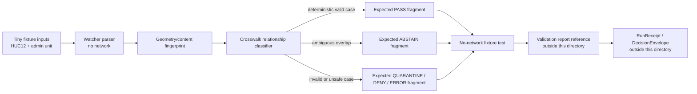

<!-- [KFM_META_BLOCK_V2]
doc_id: kfm://doc/NEEDS_VERIFICATION__hydrology_huc12_admin_crosswalk_watch_fixtures_readme
title: HUC12 Admin Crosswalk Watch Fixtures
type: standard
version: v1
status: draft
owners: NEEDS_VERIFICATION__hydrology_owner_or_team
created: NEEDS_VERIFICATION__YYYY-MM-DD
updated: NEEDS_VERIFICATION__YYYY-MM-DD
policy_label: NEEDS_VERIFICATION__public_or_internal
related: [NEEDS_VERIFICATION__upstream_watcher_readme, NEEDS_VERIFICATION__hydrology_schema_home, NEEDS_VERIFICATION__source_registry_home]
tags: [kfm, hydrology, huc12, admin-crosswalk, watcher, fixtures, no-network]
notes: [Drafted from attached KFM hydrology, pipeline, and documentation doctrine. Active repository checkout, exact fixture inventory, owners, dates, policy label, validator names, and workflow wiring remain NEEDS VERIFICATION.]
[/KFM_META_BLOCK_V2] -->

<a id="top"></a>

# HUC12 Admin Crosswalk Watch Fixtures

Small, deterministic, no-network fixtures for proving the `hydrology_huc12_admin_crosswalk_watch` behavior without treating fixtures as source data, proof objects, catalog records, or publication authority.

> [!NOTE]
> **Status:** `experimental`  
> **Owners:** `NEEDS VERIFICATION — hydrology owner or team`  
> **Path:** `pipelines/watchers/hydrology_huc12_admin_crosswalk_watch/fixtures/README.md`  
> **Authority class:** fixture / verification support  
> **Quick jumps:** [Scope](#scope) · [Repo fit](#repo-fit) · [Accepted inputs](#accepted-inputs) · [Exclusions](#exclusions) · [Directory tree](#directory-tree) · [Quickstart](#quickstart) · [Usage](#usage) · [Diagram](#diagram) · [Operating tables](#operating-tables) · [Task list](#task-list--definition-of-done) · [FAQ](#faq) · [Appendix](#appendix)


> [!IMPORTANT]
> This directory is a **watcher-local fixture surface**. It may help tests prove parsing, fingerprinting, relationship classification, quarantine, and expected finite outcomes. It must not become the canonical home for WBD, administrative-boundary source data, processed crosswalks, release receipts, proof packs, catalog records, or published layers.

---

## Scope

This fixture directory supports the HUC12-to-administrative-crosswalk watcher implied by the target path.

The fixture burden is narrow:

- prove that tiny HUC12 and administrative-unit examples can be parsed without network access;
- prove deterministic geometry/content fingerprint behavior where the watcher depends on change detection;
- prove crosswalk relationship classification without hiding ambiguous overlaps;
- prove that invalid, ambiguous, stale, or unsupported inputs are **quarantined, denied, or abstained from**, rather than promoted by convenience;
- preserve the KFM boundary: **fixture ≠ receipt ≠ proof ≠ catalog ≠ published artifact**.

### Truth labels used here

| Label | Meaning in this README |
| --- | --- |
| **CONFIRMED** | Verified from the current request, visible workspace probe, or attached KFM doctrine. |
| **INFERRED** | Conservative reading of the requested path or adjacent hydrology watcher doctrine. |
| **PROPOSED** | Recommended fixture shape that still needs active-branch verification. |
| **UNKNOWN** | Not verified because the real repository tree, tests, workflows, and runtime were not mounted. |
| **NEEDS VERIFICATION** | Exact owner, file inventory, schema home, command, validator, workflow, or policy detail to confirm before merge. |

[Back to top](#top)

---

## Repo fit

| Direction | Surface | Role |
| --- | --- | --- |
| Current directory | [`./`](./) | Watcher-local fixture examples and expected-output fragments. |
| Parent watcher | [`../`](../) | Expected home for watcher code, watcher README, or runner docs. **NEEDS VERIFICATION.** |
| Watchers root | [`../../`](../../) | Expected collection of pipeline watchers. **NEEDS VERIFICATION.** |
| Pipelines root | [`../../../`](../../../) | Expected broader pipeline boundary. **NEEDS VERIFICATION.** |

**Path role:** `pipelines/watchers/hydrology_huc12_admin_crosswalk_watch/fixtures/` should own only small examples that make watcher behavior reviewable. It should not own hydrology doctrine, source descriptors, registry state, lifecycle data, policy-as-code, validator implementations, or emitted release objects.

**Upstream dependencies, subject to repo verification:**

- watcher implementation under `pipelines/watchers/hydrology_huc12_admin_crosswalk_watch/`;
- hydrology source descriptors under a repo-confirmed `data/registry/hydrology/` or equivalent home;
- hydrology schemas under the repo-confirmed schema/contract authority;
- policy and validator homes established by the hydrology schema-home ADR;
- no-network test runner and CI wiring established by the active branch.

**Downstream consumers, subject to repo verification:**

- watcher unit tests;
- fixture regression tests;
- relationship-classification tests;
- quarantine/deny/abstain expectation tests;
- reviewer summaries that reference fixture outcomes without converting them into publication proof.

[Back to top](#top)

---

## Accepted inputs

Files belong here only when they are intentionally tiny, reviewable, deterministic, and safe to keep in source control.

| Input family | Expected use | Status |
| --- | --- | --- |
| Minimal HUC12 geometry fixture | Proves HUC12 ID parsing, CRS/geometry validation, and deterministic fingerprinting. | **PROPOSED** |
| Minimal administrative-unit geometry fixture | Proves administrative ID parsing and relationship classification. | **INFERRED / PROPOSED** |
| Crosswalk case table | Names expected relationship cases such as one-to-one, one-to-many, many-to-one, overlap, missing ID, or ambiguous geometry. | **PROPOSED** |
| Expected watcher output fragment | Documents the expected finite result for a fixture case: `PASS`, `QUARANTINE`, `ABSTAIN`, `DENY`, or `ERROR`. | **PROPOSED** |
| Source-state hash snapshot | Provides before/after examples for detecting meaningful content or geometry changes. | **PROPOSED** |
| Invalid fixture examples | Proves fail-closed behavior for missing IDs, duplicate keys, invalid geometry, unknown source role, or unclear rights. | **PROPOSED** |

### Fixture admission rules

A fixture should enter this directory only when it answers “yes” to all of these:

- Is it small enough to review in a pull request?
- Can it run without network access, credentials, browser automation, or external services?
- Does it name the behavior or failure reason clearly?
- Does it avoid becoming a provider mirror?
- Does it preserve source role and relationship uncertainty?
- Does it keep receipts, proofs, catalogs, and published artifacts outside this directory?

[Back to top](#top)

---

## Exclusions

This directory is **not** the right place for:

| Excluded item | Why excluded | Expected home |
| --- | --- | --- |
| Full WBD, HUC12, or administrative-boundary extracts | Too large and too close to source custody. | `data/raw/hydrology/` or another repo-confirmed lifecycle home. |
| Live source responses from scheduled watchers | Fixtures must not become unreviewed source mirrors. | Raw/source lifecycle storage, with receipts. |
| Credentials, API keys, tokens, cookies, or service secrets | KFM fixtures must be safe to publish and review. | Never in repo fixtures. Use approved secret storage. |
| Canonical schemas or contracts | Fixture examples do not define schema authority. | Repo-confirmed `schemas/`, `contracts/`, or ADR-selected home. |
| Validator implementations | This directory may support validators; it does not own them. | Repo-confirmed `tools/validators/`, `packages/`, or watcher module. |
| Policy rules | Fixtures can trigger policy; they do not define it. | Repo-confirmed `policy/hydrology/` or equivalent. |
| Run receipts | Receipts are process memory and should remain append-only elsewhere. | `data/receipts/hydrology/` or repo-confirmed receipt home. |
| EvidenceBundles, DecisionEnvelopes, proof packs | Proof objects are release/promotion artifacts, not fixture data. | `data/proofs/hydrology/` or repo-confirmed proof home. |
| Catalog records, layer manifests, published tiles | Publication is a governed state transition. | `data/catalog/`, `data/published/`, or repo-confirmed release home. |

[Back to top](#top)

---

## Directory tree

> [!WARNING]
> The tree below is an **expected fixture shape**, not a claim that these files already exist. Confirm the active branch before adding, renaming, or deleting fixture files.

```text
fixtures/
├── README.md
├── valid/
│   ├── huc12_admin_crosswalk.minimal.geojson
│   ├── huc12_admin_crosswalk.minimal.csv
│   └── expected.pass.json
├── invalid/
│   ├── missing_huc12_id.geojson
│   ├── missing_admin_id.geojson
│   ├── duplicate_crosswalk_key.csv
│   └── expected.error.json
├── ambiguous/
│   ├── overlapping_admin_units.geojson
│   ├── huc12_multi_admin_case.csv
│   └── expected.abstain.json
├── changed/
│   ├── source_state.before.json
│   ├── source_state.after_geometry_change.json
│   └── expected.diff_summary.json
└── README.fixture-index.md
```

### Naming guidance

Use names that describe the behavior, not the source brand alone.

Good names:

- `missing_huc12_id.geojson`
- `duplicate_crosswalk_key.csv`
- `expected.abstain.json`
- `source_state.after_geometry_change.json`

Avoid names like:

- `latest.geojson`
- `real_data.csv`
- `copy_from_service.json`
- `final_output.json`
- `publish_me.pmtiles`

[Back to top](#top)

---

## Quickstart

1. Confirm the active branch actually contains the watcher, schema home, validator home, and test runner.
2. Review this README before adding fixture files.
3. Add the smallest fixture that proves one behavior or one failure reason.
4. Add or update the expected outcome fragment.
5. Run the repo-native no-network watcher tests.
6. Update the fixture index and pull-request notes with any remaining `NEEDS VERIFICATION` items.

```bash
# NEEDS VERIFICATION:
# Replace this placeholder with the repo-native command once the watcher
# test runner and validator path are confirmed in the active checkout.

<repo-native-test-runner> pipelines/watchers/hydrology_huc12_admin_crosswalk_watch
```

> [!TIP]
> When the fixture is meant to prove a failure case, the successful test outcome is usually **quarantine, abstain, deny, or error with a reason** — not promotion.

[Back to top](#top)

---

## Usage

### Adding a fixture

1. Choose one behavior:
   - parse HUC12 ID;
   - parse admin ID;
   - classify crosswalk relationship;
   - detect geometry/content fingerprint change;
   - quarantine invalid geometry;
   - abstain on ambiguous overlap;
   - deny unclear publication posture.
2. Add only the minimum geometry, table rows, or JSON fields required.
3. Add an expected outcome fragment.
4. Update the fixture index.
5. Confirm no file contains secrets, large source extracts, unreviewed exact sensitive locations, or publication artifacts.

### Fixture review prompts

Before merge, reviewers should ask:

- Does the fixture prove one behavior cleanly?
- Does it preserve HUC12 identity and administrative-unit identity separately?
- Does it avoid flattening uncertain overlaps into false precision?
- Does it keep expected outputs finite and reviewable?
- Does it distinguish parser failures from policy failures?
- Does it avoid claiming live source watcher automation exists?
- Does it avoid placing run receipts, proof objects, catalog records, or published artifacts in this directory?

[Back to top](#top)

---

## Diagram



The diagram is intentionally fixture-bounded. It shows what this directory can help prove, not the full KFM hydrology publication path.

[Back to top](#top)

---

## Operating tables

### Fixture role matrix

| Fixture role | May live here? | Notes |
| --- | ---: | --- |
| Tiny source-shaped input | Yes | Only when reviewable and no-network. |
| Tiny expected output | Yes | Use to prove watcher behavior, not release state. |
| Invalid example | Yes | Prefer explicit failure reasons. |
| Ambiguity example | Yes | Expected outcome should be `ABSTAIN` or quarantine, not silent pass. |
| Full source extract | No | Belongs to governed raw/source lifecycle, not watcher-local fixtures. |
| Run receipt | No | Receipts are process memory and should remain separate. |
| EvidenceBundle / proof pack | No | Proof objects are release/promotion artifacts. |
| Published layer or tile artifact | No | Publication requires promotion gates and release state. |

### Expected finite outcomes

| Outcome | Fixture meaning |
| --- | --- |
| `PASS` | Fixture proves a deterministic valid case and may feed later non-public test stages. |
| `QUARANTINE` | Fixture is structurally parseable but unsafe, ambiguous, unsupported, or policy-blocked. |
| `ABSTAIN` | Fixture cannot support a strong crosswalk claim because identity or relationship evidence is insufficient. |
| `DENY` | Fixture models a case policy must reject, such as unknown rights or unsupported public release. |
| `ERROR` | Fixture models malformed input, missing required fields, invalid geometry, or validator failure. |

### Current evidence posture

| Surface | Status | Why it matters |
| --- | --- | --- |
| Target path from the request | **CONFIRMED** | The requested README path is explicit. |
| Active repo checkout | **UNKNOWN** | The working session did not expose a mounted KFM Git repository. |
| Exact fixture inventory | **UNKNOWN / NEEDS VERIFICATION** | Do not claim files that were not inspected. |
| Hydrology-first no-network fixture strategy | **CONFIRMED doctrine / PROPOSED implementation** | The attached KFM hydrology and pipeline materials repeatedly prioritize fixture-first hydrology proof work. |
| HUC12 watcher fixture semantics | **INFERRED / PROPOSED** | The target path implies this watcher; exact implementation remains unverified. |
| Admin-crosswalk schema and relationship labels | **PROPOSED** | Define through schema/ADR once the active repo is available. |
| Owner, policy label, dates | **NEEDS VERIFICATION** | Metadata must be branch-backed before merge. |

[Back to top](#top)

---

## Task list / definition of done

A fixture change is ready only when:

- [ ] The fixture is no-network and small enough for PR review.
- [ ] The fixture does not contain credentials, tokens, cookies, or private service details.
- [ ] HUC12 and administrative-unit identifiers are explicit where required.
- [ ] Geometry is minimal, valid, and deterministic enough for hashing tests.
- [ ] The expected relationship class is documented or intentionally withheld as `ABSTAIN`.
- [ ] Invalid fixtures have explicit expected failure reasons.
- [ ] Ambiguous fixtures do not silently pass.
- [ ] Fixture filenames name behavior or failure reason.
- [ ] Run receipts, proof packs, catalog records, and published artifacts are not stored here.
- [ ] The fixture index is updated.
- [ ] The repo-native validator/test command has been run or is marked `NEEDS VERIFICATION` in the PR.
- [ ] Any schema-home, owner, or policy-label uncertainty is called out in the PR notes.
- [ ] Rollback is simple: revert fixture files and this README without data migration or public release impact.

[Back to top](#top)

---

## FAQ

### Does this fixture directory prove the watcher exists?

No. It documents how watcher-local fixtures should behave. The watcher implementation, test runner, validator names, and CI wiring remain **NEEDS VERIFICATION** until confirmed in the active checkout.

### Why not store full HUC12 or administrative-boundary extracts here?

Because this directory is for verification support, not data custody. Full or pinned source extracts belong in the governed data lifecycle, with source descriptors, rights posture, receipts, and review state.

### Can expected receipt or proof fragments live here?

Only tiny expected-output fragments may be used when a unit test needs to verify handoff shape. Full receipts, proof packs, EvidenceBundles, catalog records, release manifests, or published artifacts should live in their governed homes.

### What should an ambiguous crosswalk fixture do?

It should prove that the watcher refuses false certainty. The expected outcome should be `ABSTAIN`, `QUARANTINE`, or another finite negative state with a reason.

### Does a `PASS` fixture mean the crosswalk can be published?

No. A local fixture pass is not promotion. Publication requires governed lifecycle state, catalog/proof closure, policy checks, review, and release state.

[Back to top](#top)

---

## Appendix

<details>
<summary><strong>Illustrative fixture cards</strong> — PROPOSED / NEEDS VERIFICATION</summary>

These sketches show fixture intent only. They do not define the final schema, filenames, or validator contract.

### Minimal valid case card

```yaml
fixture_id: huc12_admin_crosswalk__minimal_valid
truth_label: PROPOSED
purpose: Prove one deterministic HUC12-to-admin relationship can be parsed and classified.
network_required: false
inputs:
  - valid/huc12_admin_crosswalk.minimal.geojson
  - valid/huc12_admin_crosswalk.minimal.csv
expected:
  outcome: PASS
  relationship_class: NEEDS_VERIFICATION__single_or_overlap_label
  emits_public_artifact: false
checks:
  - huc12_id_present
  - admin_id_present
  - geometry_valid
  - content_fingerprint_stable
  - relationship_class_explicit
```

### Ambiguous overlap case card

```yaml
fixture_id: huc12_admin_crosswalk__ambiguous_overlap
truth_label: PROPOSED
purpose: Prove overlapping or under-supported relationships do not become authoritative claims.
network_required: false
inputs:
  - ambiguous/overlapping_admin_units.geojson
  - ambiguous/huc12_multi_admin_case.csv
expected:
  outcome: ABSTAIN
  reason_code: ambiguous_crosswalk_relationship
  emits_public_artifact: false
checks:
  - overlap_detected
  - relationship_not_silently_flattened
  - abstain_reason_present
```

### Invalid ID case card

```yaml
fixture_id: huc12_admin_crosswalk__missing_huc12_id
truth_label: PROPOSED
purpose: Prove malformed input fails before downstream processing.
network_required: false
inputs:
  - invalid/missing_huc12_id.geojson
expected:
  outcome: ERROR
  reason_code: missing_required_huc12_identifier
  emits_public_artifact: false
checks:
  - required_identifier_validation
  - no_run_receipt_written_here
  - no_catalog_record_written_here
```

</details>

[Back to top](#top)
