<!-- [KFM_META_BLOCK_V2]
doc_id: kfm://doc/TODO-NEEDS-UUID
title: Hydrology HUC12 Admin Crosswalk Watch SQL
type: standard
version: v1
status: draft
owners: TODO-NEEDS-OWNER
created: TODO-NEEDS-VERIFICATION
updated: 2026-04-26
policy_label: TODO-NEEDS-VERIFICATION
related: [pipelines/watchers/hydrology_huc12_admin_crosswalk_watch/README.md, docs/domains/hydrology/README.md, data/registry/hydrology/README.md, schemas/contracts/v1/hydrology/README.md, tools/validators/README.md]
tags: [kfm, hydrology, huc12, watcher, sql, crosswalk, admin-boundaries, evidence]
notes: [Target repository was not mounted during authoring; doc_id, owner, created date, policy label, adjacent links, SQL runner, schema home, and exact file inventory need repository verification.]
[/KFM_META_BLOCK_V2] -->

# Hydrology HUC12 Admin Crosswalk Watch SQL

SQL-stage guidance for building and validating governed HUC12 ↔ administrative-boundary crosswalk candidates without turning joins into publication truth.


> [!IMPORTANT]
> **Status:** experimental  
> **Owners:** `TODO-NEEDS-OWNER`  
> **Path:** `pipelines/watchers/hydrology_huc12_admin_crosswalk_watch/sql/README.md`  
> **Quick jumps:** [Scope](#scope) · [Repo fit](#repo-fit) · [Inputs](#accepted-inputs) · [Exclusions](#exclusions) · [Directory tree](#directory-tree) · [SQL role](#sql-role) · [Output contract](#candidate-output-contract) · [Quickstart](#quickstart) · [Validation](#validation-and-review-gates) · [Diagram](#flow-diagram) · [FAQ](#faq) · [Appendix](#appendix)

> [!CAUTION]
> This README is drafted from KFM doctrine and current-session workspace inspection, but the target repository was not mounted. Treat concrete paths, table names, runner commands, owners, and adjacent links as **NEEDS VERIFICATION** until checked in the real checkout.

---

## Scope

This folder is the SQL boundary for the `hydrology_huc12_admin_crosswalk_watch` watcher.

It should contain only the SQL needed to stage, normalize, classify, validate, or expose **candidate** HUC12-to-administrative-boundary crosswalk records for later governance. The SQL may support source-diff review, deterministic hashes, ambiguity classification, and downstream validator fixtures.

It must not become the source registry, the watcher scheduler, the publication gate, the EvidenceBundle resolver, or the public truth surface.

### Working interpretation

| Term | Meaning in this README | Status |
|---|---|---|
| `HUC12` | A 12-digit hydrologic unit used as the watershed grouping surface. | CONFIRMED project concept; source details need repo verification. |
| `admin crosswalk` | A relationship between HUC12 units and administrative units such as state, county, municipality, or other admitted admin geography. | INFERRED from target path; exact admin unit set is NEEDS VERIFICATION. |
| `watch` | A pipeline/watchers lane expected to detect source changes and emit reviewable candidate artifacts. | INFERRED from path and KFM watcher doctrine. |
| `sql/` | SQL-only helper area for candidate staging, normalization, joins, and validation queries. | TARGET path; actual contents UNKNOWN. |

### Boundary rule

The output of this folder is **candidate evidence support**, not publication.

A SQL view or table can say:

> “These source geometries intersect or overlap under this deterministic rule.”

It cannot say:

> “KFM has published this as authoritative truth.”

That requires source descriptors, schema validation, policy checks, EvidenceBundle closure, catalog/proof closure, review state, promotion state, and rollback/correction readiness.

[Back to top](#hydrology-huc12-admin-crosswalk-watch-sql)

---

## Repo fit

This README belongs at:

```text
pipelines/watchers/hydrology_huc12_admin_crosswalk_watch/sql/README.md
```

### Relationship map

The following surfaces are expected neighbors or downstream consumers. Link targets are recorded as repo-relative path candidates rather than hard Markdown links because this authoring session did not include the mounted repository.

| Surface | Expected relationship | Verification status |
|---|---|---|
| `pipelines/watchers/hydrology_huc12_admin_crosswalk_watch/README.md` | Watcher-level purpose, source polling, run receipts, and lifecycle placement. | NEEDS VERIFICATION |
| `data/registry/hydrology/sources/wbd_huc12.yaml` | WBD/HUC12 source descriptor or equivalent. | PROPOSED / NEEDS VERIFICATION |
| `data/registry/hydrology/sources/admin_boundaries.yaml` | Administrative-boundary source descriptor or equivalent. | PROPOSED / NEEDS VERIFICATION |
| `schemas/contracts/v1/hydrology/` | Machine contracts for HUC12, admin units, crosswalk candidates, receipts, and evidence payloads. | PROPOSED / schema home NEEDS VERIFICATION |
| `tools/validators/hydrology/` | Validator family for SQL outputs, hashes, ambiguity states, and fail-closed rules. | PROPOSED / NEEDS VERIFICATION |
| `data/work/hydrology/` or repo-native equivalent | Candidate workspace for unpromoted watcher outputs. | PROPOSED / lifecycle path NEEDS VERIFICATION |
| `data/processed/hydrology/` or repo-native equivalent | Validated processed artifacts before catalog/proof closure. | PROPOSED / lifecycle path NEEDS VERIFICATION |
| `data/catalog/`, `data/proofs/`, `data/receipts/` | Catalog, proof, and run-memory surfaces. | PROPOSED / NEEDS VERIFICATION |
| Governed API + Evidence Drawer | Downstream trust-visible consumers after promotion. | PROPOSED / implementation UNKNOWN |

> [!NOTE]
> This SQL folder should remain a narrow implementation helper. It should not absorb source onboarding, policy authority, schema authority, promotion authority, or UI behavior.

[Back to top](#hydrology-huc12-admin-crosswalk-watch-sql)

---

## Accepted inputs

This folder may accept SQL that works with **already admitted** fixtures, staging tables, or candidate work tables.

| Accepted input | Examples | Required posture |
|---|---|---|
| HUC12 staging records | `huc12`, name, source version, geometry, source digest | Must resolve to an admitted WBD/HUC12 source descriptor. |
| Administrative-boundary staging records | admin unit type, ID, name, geometry, source digest | Must resolve to an admitted admin-boundary source descriptor. |
| Deterministic geometry helpers | normalized geometry, area, centroid, bbox, geometry hash | Must preserve CRS and transform assumptions. |
| Candidate overlap SQL | HUC12 ↔ admin intersection, area share, overlap rank | Must expose ambiguity and sliver handling. |
| Validation SQL | duplicate checks, missing refs, invalid geometry, low-confidence overlap | Must fail closed or emit review-needed state. |
| Fixture-only SQL | tiny no-network pass/fail examples for CI | Must be clearly non-production. |

### Minimum retained evidence fields

Any candidate record produced through this SQL lane should preserve enough information for reviewers to reconstruct how the join happened.

| Field family | Minimum examples | Why it matters |
|---|---|---|
| HUC12 identity | `huc12`, `huc12_source_ref`, `huc12_geometry_hash` | Keeps hydrologic grouping traceable. |
| Admin identity | `admin_unit_type`, `admin_unit_id`, `admin_unit_name`, `admin_source_ref` | Prevents unlabeled political/geographic joins. |
| Spatial relationship | `relationship_type`, `overlap_area_sqkm`, `overlap_pct_of_huc12`, `overlap_pct_of_admin` | Makes partial overlaps reviewable. |
| Run identity | `spec_hash`, `run_id`, `ingested_at`, `source_state_hash` | Supports deterministic reruns and drift detection. |
| Review posture | `requires_review`, `review_reason`, `decision_reason` | Prevents ambiguous joins from becoming silent truth. |
| Evidence hooks | `evidence_ref`, `source_descriptor_ref`, `receipt_ref` | Enables EvidenceRef → EvidenceBundle resolution later. |

[Back to top](#hydrology-huc12-admin-crosswalk-watch-sql)

---

## Exclusions

Do not put these responsibilities in this folder.

| Excluded responsibility | Belongs instead | Reason |
|---|---|---|
| Source downloads, API polling, conditional HTTP, credentials | Watcher runtime or source-ingestion tooling | SQL should not hide acquisition state or secrets. |
| Source descriptors and rights/cadence metadata | `data/registry/hydrology/sources/` or repo-native source registry | Source authority must be explicit before ingestion. |
| JSON Schema authority | `schemas/contracts/v1/hydrology/` or repo-confirmed schema home | Schema shape must not drift inside SQL comments. |
| Policy-as-code | `policy/` or repo-confirmed policy home | Policy must be testable outside a database session. |
| Promotion decisions | Promotion gate tooling and review console | Promotion is governed state transition, not a SQL write. |
| Catalog, STAC/DCAT/PROV, proof packs, signatures | Catalog/proof/release artifact family | SQL output alone is not catalog closure. |
| Public API route handlers | Governed API app | Public clients must not query SQL internals directly. |
| MapLibre style/layer configuration | UI/layer manifest surfaces | Renderer configuration is downstream of released artifacts. |
| Emergency or hazard guidance | Official emergency systems or hazards lane with disclaimers | Hydrology crosswalks are not life-safety alerts. |
| Local undocumented overrides | ADR-backed correction or source review process | Hidden overrides break reproducibility. |

[Back to top](#hydrology-huc12-admin-crosswalk-watch-sql)

---

## Directory tree

Current mounted repo contents were not available during authoring. The tree below is the expected shape to verify or adapt in the real checkout.

```text
pipelines/
└── watchers/
    └── hydrology_huc12_admin_crosswalk_watch/
        ├── README.md                         # watcher-level guide; NEEDS VERIFICATION
        ├── sql/
        │   ├── README.md                     # this file
        │   ├── 00_*_staging.sql              # PROPOSED naming family
        │   ├── 10_*_normalize_huc12.sql      # PROPOSED naming family
        │   ├── 20_*_admin_overlap.sql        # PROPOSED naming family
        │   ├── 30_*_classify_relationship.sql# PROPOSED naming family
        │   ├── 40_*_candidate_view.sql       # PROPOSED naming family
        │   └── 90_*_validation.sql           # PROPOSED naming family
        └── ...                               # watcher runtime files; UNKNOWN
```

> [!TIP]
> Keep SQL filenames ordered by responsibility if the repo has no stronger local convention. That makes review diffs easier and helps validators target stable stages.

[Back to top](#hydrology-huc12-admin-crosswalk-watch-sql)

---

## SQL role

The SQL in this directory should answer one narrow question:

> Which admitted administrative units overlap each admitted HUC12 under a reproducible method, and which rows require review before any downstream claim can be trusted?

### Suggested SQL file families

These are proposed naming families, not confirmed files.

| Family | Purpose | Should write to | Should not do |
|---|---|---|---|
| `00_*_staging.sql` | Define fixture/staging shapes or temp views used by later transforms. | Temporary or work-stage objects only. | Fetch network sources or create production truth. |
| `10_*_normalize_huc12.sql` | Normalize HUC12 records, geometries, areas, hashes, and source refs. | Candidate staging. | Infer missing HUC12 identities without source evidence. |
| `20_*_admin_overlap.sql` | Compute intersections between HUC12 and admitted admin units. | Candidate staging. | Treat overlap as legal/jurisdictional proof. |
| `30_*_classify_relationship.sql` | Classify exact, dominant, partial, multi-admin, sliver, invalid, or review-needed relationships. | Candidate staging with reason codes. | Drop ambiguity rows silently. |
| `40_*_candidate_view.sql` | Expose a stable candidate view/table for validators and fixtures. | Work/processed candidate surface. | Expose public API output directly. |
| `90_*_validation.sql` | Run SQL-native checks for missing refs, duplicates, invalid geometry, and confidence thresholds. | Validation result table or runner output. | Promote, publish, sign, or mutate released artifacts. |

### SQL design rules

1. **Preserve source identity.** Every candidate row must trace back to source descriptor references and source digests.
2. **Compute deterministic hashes.** Geometry/content fingerprints must be reproducible across reruns with the same inputs.
3. **Make ambiguity visible.** Multi-admin overlaps, tiny slivers, missing IDs, invalid geometry, and CRS uncertainty should produce `requires_review=true` or equivalent.
4. **Fail closed.** Missing HUC12, missing admin identity, missing source refs, invalid geometry, or unreviewed ambiguity must block release.
5. **Keep SQL downstream of source governance.** SQL must not smuggle in unofficial source assumptions that are absent from source descriptors.
6. **Keep publication downstream of promotion.** SQL can prepare candidates; promotion gates decide release.

[Back to top](#hydrology-huc12-admin-crosswalk-watch-sql)

---

## Candidate output contract

No mounted schema registry was available in this authoring session. Treat this table as a proposed review target until the actual hydrology schema home is verified.

| Field | Type shape | Required | Notes |
|---|---:|:---:|---|
| `crosswalk_id` | text | Yes | Deterministic ID derived from HUC12, admin identity, source state, and method. |
| `huc12` | text, 12 chars | Yes | Must not be guessed. |
| `huc12_name` | text | No | Preserve source label when available. |
| `admin_unit_type` | enum/text | Yes | Example values need repo confirmation: `state`, `county`, `municipality`, `tribal_area`, `other`. |
| `admin_unit_id` | text | Yes | FIPS/GNIS/local ID or admitted equivalent. |
| `admin_unit_name` | text | Yes | Source-provided preferred name. |
| `relationship_type` | enum/text | Yes | Proposed: `contained_by_admin`, `contains_admin`, `partial_overlap`, `multi_admin`, `sliver`, `invalid`, `requires_review`. |
| `overlap_area_sqkm` | numeric | Yes | Must state geometry/CRS calculation assumptions upstream. |
| `overlap_pct_of_huc12` | numeric | Yes | Use bounded range `0..1` or document percent convention. |
| `overlap_pct_of_admin` | numeric | Yes | Use same bounded convention as above. |
| `huc12_geometry_hash` | text | Yes | Deterministic fingerprint of normalized HUC12 geometry. |
| `admin_geometry_hash` | text | Yes | Deterministic fingerprint of normalized admin geometry. |
| `source_state_hash` | text | Yes | Hash of input state used for drift detection. |
| `spec_hash` | text | Yes | Hash of transformation specification or query pack. |
| `source_descriptor_ref` | text | Yes | One or more source descriptor references. |
| `receipt_ref` | text | Yes | Run receipt reference or equivalent. |
| `evidence_ref` | text | Conditional | Required before EvidenceBundle-backed claims. |
| `requires_review` | boolean | Yes | Must be true for unresolved ambiguity. |
| `review_reason` | text | Conditional | Required when `requires_review=true`. |
| `valid_time` | timestamp/range | Conditional | Required when source validity is time-scoped. |
| `as_of` | timestamp | Yes | Timestamp for the source snapshot or processing view. |

[Back to top](#hydrology-huc12-admin-crosswalk-watch-sql)

---

## Quickstart

Use this as a verification sequence after mounting the real repository.

### 1. Confirm repository context

```bash
git status --short
git branch --show-current
pwd
find pipelines/watchers/hydrology_huc12_admin_crosswalk_watch -maxdepth 3 -type f | sort
```

Expected outcome:

- target watcher path exists or the PR creates it intentionally;
- this README is under `sql/`;
- adjacent watcher README, schemas, source descriptors, validators, and fixtures are identified or explicitly marked missing.

### 2. Verify source and schema homes

```bash
find data/registry schemas contracts policy tools tests -maxdepth 4 -type f 2>/dev/null | sort | grep -E 'hydrology|huc12|source|validator|policy' || true
```

Expected outcome:

- source descriptors for HUC12 and administrative boundaries are present or scheduled in the same PR;
- schema home is resolved by repo convention or ADR;
- validators have a repo-native runner.

### 3. Run SQL only through the repo-approved database target

```bash
# NEEDS VERIFICATION — adapt to the repo-native SQL runner.
# Use a non-production database and fixture inputs unless a reviewer approves otherwise.
psql "$KFM_DEV_DATABASE_URL" \
  -v ON_ERROR_STOP=1 \
  -f pipelines/watchers/hydrology_huc12_admin_crosswalk_watch/sql/<verified-script>.sql
```

> [!WARNING]
> Do not run SQL against production, published, or canonical stores unless the repo has an explicit migration/review process for that action.

[Back to top](#hydrology-huc12-admin-crosswalk-watch-sql)

---

## Usage

### Reviewer-safe validation examples

The snippets below are illustrative. Replace table/view names with repo-confirmed names before use.

```sql
-- Illustrative only — table/view name NEEDS VERIFICATION.
-- Missing source references should block promotion.
SELECT
  COUNT(*) AS rows_missing_source_refs
FROM hydrology_huc12_admin_crosswalk_candidate
WHERE source_descriptor_ref IS NULL
   OR huc12_geometry_hash IS NULL
   OR admin_geometry_hash IS NULL;
```

```sql
-- Illustrative only — table/view name NEEDS VERIFICATION.
-- Ambiguous rows must remain review-visible.
SELECT
  relationship_type,
  requires_review,
  COUNT(*) AS row_count
FROM hydrology_huc12_admin_crosswalk_candidate
GROUP BY relationship_type, requires_review
ORDER BY relationship_type, requires_review;
```

```sql
-- Illustrative only — table/view name NEEDS VERIFICATION.
-- Candidate IDs should be stable and unique within a source state.
SELECT
  crosswalk_id,
  COUNT(*) AS duplicate_count
FROM hydrology_huc12_admin_crosswalk_candidate
GROUP BY crosswalk_id
HAVING COUNT(*) > 1;
```

### Safe implementation pattern

1. Stage fixture inputs.
2. Normalize geometries and source references.
3. Compute deterministic overlap candidates.
4. Classify ambiguity and review state.
5. Emit candidate rows with source hashes and receipt refs.
6. Run SQL-native checks.
7. Hand the candidate artifact to validators.
8. Let promotion gates decide publication.

[Back to top](#hydrology-huc12-admin-crosswalk-watch-sql)

---

## Flow diagram

```mermaid
flowchart LR
    A[Admitted source descriptors] --> B[Watcher source probe]
    B --> C[RAW source snapshot or fixture]
    C --> D[SQL staging and normalization]
    D --> E[HUC12 admin overlap candidates]
    E --> F{SQL validation}
    F -- invalid or ambiguous --> Q[WORK / QUARANTINE review queue]
    F -- valid candidate --> G[PROCESSED candidate artifact]
    G --> H[Catalog + provenance + receipts]
    H --> I[EvidenceBundle / DecisionEnvelope]
    I --> J{Promotion gate}
    J -- denied or abstain --> Q
    J -- published --> K[PUBLISHED artifact]
    K --> L[Governed API]
    L --> M[MapLibre layer + Evidence Drawer]

    classDef sql fill:#eef6ff,stroke:#2b6cb0,stroke-width:1px;
    class D,E,F sql;
```



The SQL stage is intentionally in the middle of the trust path. It can prepare and validate candidates, but it cannot bypass catalog, evidence, policy, review, or promotion gates.

[Back to top](#hydrology-huc12-admin-crosswalk-watch-sql)

---

## Validation and review gates

### Minimum gate checklist

- [ ] Actual repository path and sibling files verified.
- [ ] Owner and CODEOWNERS coverage verified.
- [ ] Source descriptors exist for HUC12 and all admin-boundary inputs.
- [ ] Schema home resolved or ADR added.
- [ ] SQL scripts use fixture/work inputs before live sources.
- [ ] SQL scripts preserve source refs, hashes, run IDs, and review state.
- [ ] No SQL writes directly to `PUBLISHED`, public API stores, or canonical truth stores.
- [ ] Ambiguous, invalid, missing-ref, and duplicate cases have negative tests.
- [ ] Candidate outputs are validated by repo-native validators.
- [ ] Promotion gate rejects incomplete evidence, missing source refs, and unresolved ambiguity.
- [ ] Rollback/correction path is documented before publication.
- [ ] Evidence Drawer payload is generated only from governed API output, not raw SQL tables.

### Fail-closed examples

| Condition | Required result |
|---|---|
| Missing HUC12 | `DENY` or validation failure |
| Missing admin unit ID | `DENY` or validation failure |
| Missing source descriptor ref | `DENY` or validation failure |
| Invalid geometry | quarantine or validation failure |
| Multi-admin overlap without ranking/reason code | `requires_review=true` |
| Tiny sliver overlap below threshold | `requires_review=true` or explicit `sliver` classification |
| Drift in geometry/content hash | reviewer diff required |
| SQL output lacks receipt or source-state hash | block promotion |
| Public client attempts to query SQL object directly | deny; route through governed API |

[Back to top](#hydrology-huc12-admin-crosswalk-watch-sql)

---

## Tables

### Responsibility matrix

| Responsibility | SQL folder | Watcher runtime | Source registry | Schema/contracts | Validators/policy | Promotion/release | UI/API |
|---|:---:|:---:|:---:|:---:|:---:|:---:|:---:|
| Source acquisition | No | Yes | Supports | No | Checks | No | No |
| Candidate staging | Yes | Supports | Supports | Shapes | Checks | No | No |
| Geometry overlap | Yes | No | Supports | Shapes | Checks | No | No |
| Ambiguity classification | Yes | Supports | Supports | Shapes | Checks | Supports | Exposes after governance |
| Rights/cadence/source role | No | No | Yes | Shapes | Checks | Checks | Displays after governance |
| EvidenceBundle resolution | No | No | Supports | Shapes | Checks | Yes | Yes |
| Publication decision | No | No | Supports | Supports | Yes | Yes | Displays only |
| Public map rendering | No | No | No | Payload shape | Checks | Supports | Yes |

### Status vocabulary

| Label | Use in this README |
|---|---|
| CONFIRMED | Verified from current-session workspace inspection or high-weight KFM doctrine. |
| INFERRED | Deduced from the target path or adjacent doctrine but not directly verified in repo files. |
| PROPOSED | Recommended file, field, SQL role, or review gate not confirmed as implemented. |
| NEEDS VERIFICATION | Must be checked in the mounted repository before committing or relying on it. |
| UNKNOWN | Not resolvable in this authoring session. |

[Back to top](#hydrology-huc12-admin-crosswalk-watch-sql)

---

## Task list

### Definition of done for this README

- [ ] Replace `TODO-NEEDS-UUID` with a governed document ID.
- [ ] Replace `TODO-NEEDS-OWNER` with verified owner or team.
- [ ] Confirm `created`, `updated`, and `policy_label` metadata.
- [ ] Convert repo-fit path candidates into valid relative links after path verification.
- [ ] Confirm actual SQL filenames and update the directory tree.
- [ ] Add or link the source descriptor for HUC12.
- [ ] Add or link the source descriptor for administrative boundaries.
- [ ] Add or link schema/contract for the crosswalk candidate.
- [ ] Add fixture-backed positive and negative SQL examples.
- [ ] Add repo-native validation command once runner is known.
- [ ] Add rollback/correction card reference after lifecycle paths are verified.

### Definition of done for SQL in this folder

- [ ] No live network dependency.
- [ ] No production/canonical write without explicit reviewer gate.
- [ ] Deterministic candidate IDs.
- [ ] Deterministic geometry/content hashes.
- [ ] Source refs and receipt refs retained.
- [ ] Ambiguity emits reason code.
- [ ] Invalid rows fail validation or enter quarantine.
- [ ] Candidate output is schema-valid.
- [ ] Promotion gate rejects incomplete evidence.
- [ ] Public UI receives only governed API output.

[Back to top](#hydrology-huc12-admin-crosswalk-watch-sql)

---

## FAQ

### Is this the NHDPlus HR Permanent Identifier / COMID crosswalk?

No. The target path names a HUC12 ↔ administrative crosswalk watcher. The NHDPlus HR identity bridge is related hydrology infrastructure, but it should remain a separate governed reconciliation layer unless the repo explicitly combines them through an ADR.

### Can this SQL decide which county “owns” a watershed?

No. HUC12 units are hydrologic groupings. Administrative boundaries are political or administrative units. Their overlap can support reporting, filtering, and review, but it is not legal jurisdictional proof unless an admitted source and claim type explicitly support that use.

### Can MapLibre read these SQL tables directly?

No. MapLibre should render released artifacts or governed API responses. SQL internals are not a public interface.

### Can this folder include one-off local fixes?

Only if the fix is expressed as a governed correction, fixture, or reviewed transform with source references and rollback. Hidden local overrides are not acceptable.

### What should happen when the source geometry changes?

Compute a new geometry/content fingerprint, emit a diff summary, preserve the previous state, and require reviewer evaluation before promotion.

[Back to top](#hydrology-huc12-admin-crosswalk-watch-sql)

---

## Appendix

<details>
<summary>Reviewer notes: why this folder stays narrow</summary>

KFM treats hydrology as a proof-bearing lane because it can exercise source descriptors, watchers, identity, geometry, time, evidence, catalog closure, governed API output, and trust-visible UI without starting from the highest-sensitivity domains.

This SQL folder participates in that proof path, but it is not the proof path by itself. It should stay narrow so reviewers can answer:

- Which source states entered this SQL?
- Which deterministic rules transformed them?
- Which candidates are valid?
- Which candidates require review?
- Which outputs are eligible for schema, policy, evidence, catalog, and promotion checks?
- Which outputs must be quarantined or corrected?

Keeping those questions separate protects KFM from three common failures:

1. treating an overlap join as truth;
2. publishing a candidate artifact before evidence closure;
3. letting a map or model summarize ungoverned SQL output.

</details>

<details>
<summary>Open verification backlog</summary>

| Item | Status | Owner |
|---|---|---|
| Confirm target path exists or should be created. | NEEDS VERIFICATION | TODO |
| Confirm watcher root README and sibling docs. | NEEDS VERIFICATION | TODO |
| Confirm actual SQL files and runner. | NEEDS VERIFICATION | TODO |
| Confirm database platform and spatial SQL dialect. | NEEDS VERIFICATION | TODO |
| Confirm source descriptor for WBD/HUC12. | NEEDS VERIFICATION | TODO |
| Confirm source descriptor for admin boundaries. | NEEDS VERIFICATION | TODO |
| Confirm whether admin units include only counties/states or additional units. | NEEDS VERIFICATION | TODO |
| Confirm schema home and candidate contract name. | NEEDS VERIFICATION | TODO |
| Confirm lifecycle output path for work/candidate rows. | NEEDS VERIFICATION | TODO |
| Confirm validation runner and CI workflow. | NEEDS VERIFICATION | TODO |
| Confirm policy handling for ambiguous/sliver overlaps. | NEEDS VERIFICATION | TODO |
| Confirm EvidenceBundle and Evidence Drawer downstream payloads. | NEEDS VERIFICATION | TODO |
| Confirm rollback/correction path. | NEEDS VERIFICATION | TODO |

</details>

[Back to top](#hydrology-huc12-admin-crosswalk-watch-sql)
