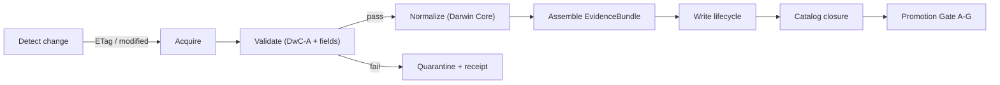

<!-- [KFM_META_BLOCK_V2]
doc_id: kfm://doc/<NEEDS_VERIFICATION_UUID>
title: Kansas Flora Watcher (pipelines/watchers/kansas_flora_watch)
type: standard
version: v1
status: draft
owners: @bartytime4life
created: <NEEDS_VERIFICATION_CREATED_DATE>
updated: 2026-04-25
policy_label: public
related: [
  ../../../data/raw/README.md,
  ../../../data/work/README.md,
  ../../../data/processed/README.md,
  ../../../data/catalog/README.md,
  ../../../data/catalog/dcat/README.md,
  ../../../data/catalog/stac/README.md,
  ../../../data/catalog/prov/README.md,
  ../../../data/receipts/README.md,
  ../../../tools/validators/README.md,
  ../../../tools/validators/promotion_gate/README.md,
  ../../../schemas/contracts/v1/runtime/runtime_response_envelope.schema.json,
  ../../../contracts/source/<NEEDS_VERIFICATION_SOURCE_DESCRIPTOR>.md
]
tags: [kfm, flora, watcher, dwc-a, gbif, ingestion, evidencebundle]
notes: [
  "Watcher-first ingestion doc for Kansas flora (plants).",
  "Paths and validator names reflect repo conventions; exact filenames may need verification.",
  "No claim of existing executable watcher until verified on branch."
]
[/KFM_META_BLOCK_V2] -->

<a id="top"></a>

# Kansas Flora Watcher
One-way, fail-closed ingestion of Kansas flora (plant) data into KFM EvidenceBundles.

> **Path:** `pipelines/watchers/kansas_flora_watch/`  
> **Role:** Source → EvidenceBundle → Catalog closure (DCAT + STAC + PROV) → Promotion Gate

---

## 🚦 Impact Block

- **Status:** draft  
- **Owners:** @bartytime4life  
- **Badges:**  
    
    
  

**Quick links**
- [Scope](#scope) • [Repo fit](#repo-fit) • [Inputs](#inputs) • [Exclusions](#exclusions)  
- [Flow](#ingest-flow-fail-closed) • [EvidenceBundle](#evidencebundle-contract)  
- [Catalog closure](#catalog-closure) • [Promotion gate](#promotion-gate-ag)  
- [Directory tree](#directory-tree) • [Quickstart](#quickstart) • [DoD](#definition-of-done)

---

## Scope

Ingest **Kansas flora** (vascular plants and related taxa) from specimen-backed and curated sources, normalize to Darwin Core, and emit **EvidenceBundles** with full provenance and licensing for downstream map layers and Focus Mode.

**Priority principle:** specimen-backed records (herbaria) > aggregated observations.

---

## Repo fit

- **Upstream (sources):**
  - Institutional IPT (Darwin Core Archives)
  - Aggregators (GBIF/iDigBio)
  - Federal baseline (USDA PLANTS)

- **Downstream (KFM):**
  - `data/raw` → `data/work` → `data/processed`
  - `data/catalog/{dcat,stac,prov}`
  - `data/receipts`
  - `tools/validators/*` (schema + promotion gate)
  - Governed APIs (trust membrane) and UI (Evidence Drawer)

> This watcher **emits only** (no direct runtime serving). Runtime reads from governed APIs.

---

## Inputs

| Source class | Format | Access pattern | Notes |
|---|---|---|---|
| IPT exports (KANU/KSC) | DwC-A (zip) | HTTP with `ETag` / `Last-Modified` | **Primary evidence** |
| GBIF | JSON API + downloads | `modified` filter or download jobs | Coverage + dedupe |
| iDigBio | JSON API | paginated | Supplemental specimens |
| USDA PLANTS | bulk tables | versioned snapshots | Taxonomy + traits baseline |

> **Accepted fields:** Darwin Core terms (e.g., `scientificName`, `decimalLatitude`, `decimalLongitude`, `eventDate`, `institutionCode`, `catalogNumber`, `license`, `rightsHolder`, `datasetID`).

---

## Exclusions

- Non-plant taxa (handled by other watchers)
- Non-georeferenced records lacking coordinates (**fail ingest** unless policy allows specific exceptions)
- Records missing **license**, **rightsHolder**, or **datasetID**
- Restricted datasets (e.g., NatureServe) **outside gated partitions** (see Policy notes)

---

## Directory tree

```
pipelines/
  watchers/
    kansas_flora_watch/
      README.md
      config.yaml                 # sources + schedules (NEEDS VERIFICATION)
      runner.py                   # orchestrator (NEEDS VERIFICATION)
      steps/
        detect.py                 # ETag/modified checks (NEEDS VERIFICATION)
        acquire.py                # download & checksum (NEEDS VERIFICATION)
        validate_dwca.py          # schema & field validation (NEEDS VERIFICATION)
        normalize.py              # Darwin Core normalization (NEEDS VERIFICATION)
        bundle.py                 # EvidenceBundle assembly (NEEDS VERIFICATION)
        publish.py                # write lifecycle + catalog (NEEDS VERIFICATION)
      tests/                      # watcher tests (NEEDS VERIFICATION)
```

> Tree reflects intended structure; exact filenames **NEEDS VERIFICATION**.

---

## Ingest flow (fail-closed)



### 1) Detect change
- IPT: honor `ETag` / `Last-Modified`
- GBIF/iDigBio: filter on `modified`
- USDA: snapshot version/date

> **Zero-drift rule:** if no change → **no ingest**.

### 2) Acquire
- Download archives (DwC-A zip) or API pages
- Verify:
  - checksum (if provided)
  - archive completeness (`meta.xml`, core/extension tables)
  - encoding integrity

### 3) Validate (hard gate)
Reject if any:
- Missing `license` / `rightsHolder` / `datasetID`
- Invalid coordinates or CRS ambiguity
- Required DwC fields absent or malformed
- Temporal fields invalid (`eventDate`)

> Failures go to **quarantine** with a **receipt**.

### 4) Normalize
- Map inputs → canonical Darwin Core fields
- Standardize dates, coordinates, taxon strings
- Attach **source descriptor** (see `contracts/source/*`)

### 5) Assemble EvidenceBundle
- Deterministic `spec_hash`
- Attach dataset DOI/version and harvest metadata
- Preserve per-record attribution fields

### 6) Write lifecycle
```
data/raw/flora/<source>/<timestamp>/
data/work/flora/<run_id>/
data/processed/flora/<spec_hash>/
data/receipts/flora/<run_id>.json
```

### 7) Catalog closure
- DCAT dataset entry
- STAC collection/item(s)
- PROV lineage

### 8) Promotion Gate (A–G)
- A: Schema valid  
- B: License compliant  
- C: Provenance complete  
- D: Spatial integrity  
- E: Temporal consistency  
- F: Cross-source dedupe  
- G: Evidence Drawer render

> **Fail-closed:** no promotion → no runtime visibility.

---

## EvidenceBundle contract

```json
{
  "spec_hash": "<deterministic>",
  "dataset_doi": "<doi-or-key>",
  "dataset_version": "<version-or-timestamp>",
  "harvest_date": "<iso8601>",
  "license": "<spdx-or-url>",
  "rightsHolder": "<string>",
  "records": [
    {
      "scientificName": "...",
      "decimalLatitude": 0.0,
      "decimalLongitude": 0.0,
      "eventDate": "YYYY-MM-DD",
      "institutionCode": "...",
      "catalogNumber": "...",
      "datasetID": "...",
      "basisOfRecord": "PreservedSpecimen|HumanObservation|..."
    }
  ],
  "provenance": {
    "source": "<descriptor-id>",
    "method": "dwca_ingest|api_ingest",
    "validator": "<validator@version>"
  }
}
```

> Schema location **NEEDS VERIFICATION** (see `schemas/*`).

---

## Catalog closure

- **DCAT**: dataset metadata (title, publisher, license, temporal/spatial coverage)
- **STAC**: collection for flora, items per release (and/or tiles if derived)
- **PROV**: lineage linking source → bundle → processed outputs

> Catalog must be **complete before promotion**.

---

## Deduplication

Cross-source duplicates (e.g., KANU vs GBIF mirror) resolved using:

```
key = institutionCode + catalogNumber + eventDate
```

- Prefer **institutional record** when conflicts exist
- Keep trace to all contributing datasets in provenance

---

## Policy notes

- **Attribution mandatory:** `license`, `rightsHolder`, `datasetID` carried end-to-end
- **Restricted data:** segregate (e.g., NatureServe) → **no open publication**
- **Specimen-first weighting:** used by downstream layer generation (NEEDS VERIFICATION implementation)

---

## Quickstart

> Illustrative; adjust paths/commands to actual repo wiring.

```bash
# 1) Configure sources
cp pipelines/watchers/kansas_flora_watch/config.example.yaml \
   pipelines/watchers/kansas_flora_watch/config.yaml

# 2) Run a single ingest (dry-run)
python pipelines/watchers/kansas_flora_watch/runner.py \
  --once --dry-run

# 3) Run ingest (write enabled)
python pipelines/watchers/kansas_flora_watch/runner.py \
  --once

# 4) Inspect receipts
ls data/receipts/flora/
```

**Example GBIF query (illustrative):**
```bash
curl "https://api.gbif.org/v1/occurrence/search?country=US&stateProvince=Kansas&modified=2026-01-01"
```

---

## Usage

- Schedule via CI/cron (NEEDS VERIFICATION)
- Emit **receipts** for every run (success/failure)
- Downstream consumers **must** read via governed APIs

---

## Tables

### Source registry (illustrative)

| id | type | endpoint | auth | notes |
|---|---|---|---|---|
| kanu_ipt | IPT DwC-A | `<KANU_IPT_URL>` | none | primary |
| ksc_ipt | IPT DwC-A | `<KSC_IPT_URL>` | none | primary |
| gbif_api | REST | `api.gbif.org` | none | delta via `modified` |
| usda_plants | bulk | `<USDA_URL>` | none | taxonomy |

> Fill endpoints and IDs from **contracts/source/** (**NEEDS VERIFICATION**).

---

## Definition of Done

- [ ] Change detection uses `ETag` / `modified` correctly  
- [ ] Acquisition verifies checksums and archive completeness  
- [ ] Validation rejects records missing license/rights fields  
- [ ] EvidenceBundle emitted with deterministic `spec_hash`  
- [ ] Lifecycle paths populated (`raw/work/processed/receipts`)  
- [ ] DCAT + STAC + PROV written (catalog closure)  
- [ ] Promotion Gate A–G passes (or fails with receipts)  
- [ ] Evidence Drawer shows attribution for sample queries (NEEDS VERIFICATION)  

---

## FAQ

**Q: Why fail on missing license fields?**  
A: KFM requires machine-verifiable attribution; missing fields break “cite-or-abstain”.

**Q: Why specimen-first?**  
A: Physical vouchers provide stronger, auditable evidence for claims.

**Q: Can we merge restricted datasets?**  
A: Not in open layers; keep gated partitions with explicit policy.

---

## Appendix

<details>
<summary>Validator expectations (illustrative)</summary>

- DwC-A structure present (`meta.xml`, core table)
- Required fields non-null
- Coordinate bounds valid for Kansas (or explicitly global with filter)
- Date parsing ISO-8601
- License parseable (SPDX or URL)

</details>

---

[Back to top](#top)
