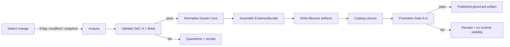

<!-- [KFM_META_BLOCK_V2]
doc_id: kfm://doc/<NEEDS_VERIFICATION_UUID>
title: Kansas Flora Watcher
type: standard
version: v1
status: draft
owners: @bartytime4life
created: <NEEDS_VERIFICATION_CREATED_DATE>
updated: 2026-04-25
policy_label: public
related: [
  ../../../data/raw/README.md,
  ../../../data/work/README.md,
  ../../../data/processed/README.md,
  ../../../data/catalog/README.md,
  ../../../data/catalog/dcat/README.md,
  ../../../data/catalog/stac/README.md,
  ../../../data/catalog/prov/README.md,
  ../../../data/receipts/README.md,
  ../../../tools/validators/README.md,
  ../../../tools/validators/promotion_gate/README.md,
  ../../../schemas/contracts/v1/runtime/runtime_response_envelope.schema.json,
  ../../../contracts/source/<NEEDS_VERIFICATION_SOURCE_DESCRIPTOR>.md
]
tags: [kfm, flora, watcher, dwc-a, gbif, ingestion, evidencebundle]
notes: [
  "Watcher-first ingestion doc for Kansas flora (plants).",
  "Target path is pipelines/watchers/kansas_flora_watch/; exact repo placement still needs verification.",
  "Paths, validator names, source descriptors, and executable watcher status remain NEEDS VERIFICATION until checked on branch."
]
[/KFM_META_BLOCK_V2] -->

<a id="top"></a>

# Kansas Flora Watcher

One-way, fail-closed ingestion of Kansas flora records into KFM EvidenceBundles, catalog records, receipts, and promotion-gate review.


## Impact block

| Field | Value |
|---|---|
| **Status** | `experimental` / `draft` — **NEEDS VERIFICATION** in target branch |
| **Owner** | `@bartytime4life` |
| **Target path** | `pipelines/watchers/kansas_flora_watch/` |
| **Primary role** | Source → EvidenceBundle → catalog closure → Promotion Gate |
| **Runtime boundary** | Emits governed artifacts only; normal runtime access should happen through governed APIs. |

**Quick links:** [Scope](#scope) · [Repo fit](#repo-fit) · [Inputs](#inputs) · [Exclusions](#exclusions) · [Directory tree](#directory-tree) · [Quickstart](#quickstart) · [Usage](#usage) · [Flow](#ingest-flow-fail-closed) · [EvidenceBundle](#evidencebundle-contract) · [Catalog closure](#catalog-closure) · [Definition of Done](#definition-of-done)

> [!IMPORTANT]
> **Truth posture:** this README describes the intended watcher shape. It does not claim that `runner.py`, validator modules, source descriptors, catalog writers, or CI wiring already exist. Those implementation details remain **NEEDS VERIFICATION** until inspected in the mounted repo.

---

## Scope

This watcher is intended to ingest **Kansas flora** records, especially vascular plant records and related taxa, from specimen-backed and curated sources. The output target is a normalized Darwin Core-oriented EvidenceBundle with provenance, source identity, rights metadata, and enough catalog closure for downstream map layers and Focus Mode.

**Priority principle:** specimen-backed records, especially herbarium-backed records, outrank aggregated observations when conflicts require weighting.

## Repo fit

| Side | Expected connection | Notes |
|---|---|---|
| **Upstream sources** | Institutional IPT exports, GBIF/iDigBio aggregators, USDA PLANTS snapshots | Source descriptors and endpoint details are **NEEDS VERIFICATION**. |
| **Lifecycle** | `data/raw` → `data/work` / `data/quarantine` → `data/processed` | Preserves KFM ingest discipline and failure isolation. |
| **Catalog / receipts** | `data/catalog/{dcat,stac,prov}` and `data/receipts` | Catalog closure is required before promotion. |
| **Validation** | `tools/validators/*` and promotion-gate checks | Exact validator names are **NEEDS VERIFICATION**. |
| **Runtime** | Governed APIs and trust-visible UI surfaces | The watcher should not become a direct public-serving surface. |

## Inputs

Accepted input belongs here only when source identity, rights posture, and minimum Darwin Core fields can be resolved.

| Source class | Format | Access pattern | Intended role |
|---|---|---|---|
| IPT exports, such as KANU / KSC | DwC-A `.zip` | HTTP with `ETag` / `Last-Modified` | Primary specimen evidence |
| GBIF | JSON API or download job | `modified` filter or download jobs | Coverage, mirror detection, dedupe context |
| iDigBio | JSON API | Paginated API access | Supplemental specimen records |
| USDA PLANTS | Bulk tables | Versioned snapshot | Taxonomy and traits baseline |

**Accepted Darwin Core-style fields include:** `scientificName`, `decimalLatitude`, `decimalLongitude`, `eventDate`, `institutionCode`, `catalogNumber`, `license`, `rightsHolder`, and `datasetID`.

> [!NOTE]
> Source endpoints, source IDs, and authentication posture are placeholders until a source descriptor is verified in `contracts/source/` or the repo’s actual source-registry home.

## Exclusions

| Excluded material | Default handling |
|---|---|
| Non-plant taxa | Route to the appropriate fauna, habitat, or other domain watcher. |
| Non-georeferenced records without coordinates | Fail ingest unless a documented policy exception exists. |
| Records missing `license`, `rightsHolder`, or `datasetID` | Fail closed and emit a quarantine receipt. |
| Restricted datasets, including controlled rare-plant sources | Keep outside open publication; use gated partitions and explicit policy review. |

## Directory tree

```text
pipelines/
  watchers/
    kansas_flora_watch/
      README.md
      config.yaml                 # sources + schedules; NEEDS VERIFICATION
      runner.py                   # orchestrator; NEEDS VERIFICATION
      steps/
        detect.py                 # ETag / modified checks; NEEDS VERIFICATION
        acquire.py                # download + checksum; NEEDS VERIFICATION
        validate_dwca.py          # schema + field validation; NEEDS VERIFICATION
        normalize.py              # Darwin Core normalization; NEEDS VERIFICATION
        bundle.py                 # EvidenceBundle assembly; NEEDS VERIFICATION
        publish.py                # lifecycle + catalog writes; NEEDS VERIFICATION
      tests/                      # watcher tests; NEEDS VERIFICATION
```

> [!CAUTION]
> This tree is a target structure, not confirmed repo inventory. Verify actual file homes before committing or wiring imports.

## Quickstart

These commands are **illustrative** and should be adjusted to the actual repo wiring after the watcher files, config template, and runtime entrypoint are verified.

```bash
# 1) Configure sources.
cp pipelines/watchers/kansas_flora_watch/config.example.yaml \
  pipelines/watchers/kansas_flora_watch/config.yaml

# 2) Run a single ingest without writing promoted outputs.
python pipelines/watchers/kansas_flora_watch/runner.py --once --dry-run

# 3) Inspect run receipts.
ls data/receipts/flora/
```

> [!WARNING]
> The write-enabled command below should not be run until source descriptors, rights checks, validation gates, and lifecycle paths are verified.

```bash
python pipelines/watchers/kansas_flora_watch/runner.py --once
```

**Illustrative GBIF query:**

```bash
curl "https://api.gbif.org/v1/occurrence/search?country=US&stateProvince=Kansas&modified=2026-01-01"
```

## Usage

The watcher should be used as a governed ingest path, not as a public runtime path.

| Use | Expected behavior |
|---|---|
| Scheduled ingest | Run via CI, cron, or scheduler only after repo wiring is verified. |
| Dry-run review | Validate source shape, field completeness, and receipt emission without promotion. |
| Production ingest | Write lifecycle artifacts only after source rights and promotion gates pass. |
| Downstream access | Consumers read through governed APIs, catalog records, and EvidenceBundle resolution. |

## Ingest flow (fail-closed)



| Step | Gate | Output |
|---|---|---|
| **1. Detect** | Honor `ETag`, `Last-Modified`, API `modified`, or snapshot version/date. | No change → no ingest. |
| **2. Acquire** | Download archives or pages; verify checksum, archive completeness, and encoding. | Raw source package and acquisition receipt. |
| **3. Validate** | Reject missing rights fields, invalid coordinates, CRS ambiguity, malformed DwC fields, or invalid `eventDate`. | Pass to normalization or quarantine with receipt. |
| **4. Normalize** | Map inputs to canonical Darwin Core fields; standardize dates, coordinates, and taxon strings. | Work artifact with source descriptor attached. |
| **5. Bundle** | Build deterministic `spec_hash`; attach dataset DOI/version, harvest metadata, and record attribution. | EvidenceBundle candidate. |
| **6. Write lifecycle** | Preserve raw/work/processed/receipt separation. | Lifecycle artifacts. |
| **7. Catalog closure** | Emit DCAT, STAC, and PROV records. | Catalog-ready candidate. |
| **8. Promote** | Pass Promotion Gate A-G. | Published governed artifact or fail-closed receipt. |

### Lifecycle paths

```text
data/raw/flora/<source>/<timestamp>/
data/work/flora/<run_id>/
data/processed/flora/<spec_hash>/
data/receipts/flora/<run_id>.json
```

## EvidenceBundle contract

The JSON below is an **illustrative contract sketch**. Confirm the actual schema home and field names before implementation.

```json
{
  "spec_hash": "<deterministic>",
  "dataset_doi": "<doi-or-key>",
  "dataset_version": "<version-or-timestamp>",
  "harvest_date": "<iso8601>",
  "license": "<spdx-or-url>",
  "rightsHolder": "<string>",
  "records": [
    {
      "scientificName": "...",
      "decimalLatitude": 0.0,
      "decimalLongitude": 0.0,
      "eventDate": "YYYY-MM-DD",
      "institutionCode": "...",
      "catalogNumber": "...",
      "datasetID": "...",
      "basisOfRecord": "PreservedSpecimen|HumanObservation|..."
    }
  ],
  "provenance": {
    "source": "<descriptor-id>",
    "method": "dwca_ingest|api_ingest",
    "validator": "<validator@version>"
  }
}
```

> [!NOTE]
> Schema location remains **NEEDS VERIFICATION**. The visible placeholder points toward `schemas/*`, but the mounted repo must resolve the canonical schema home.

## Catalog closure

Catalog closure must happen before promotion. Each catalog surface answers a different question and should not silently substitute for the others.

| Surface | Purpose | Minimum expectation |
|---|---|---|
| **DCAT** | Dataset metadata | Title, publisher, license, spatial coverage, temporal coverage. |
| **STAC** | Spatiotemporal inventory | Flora collection and item/release records; derived tile records only when applicable. |
| **PROV** | Lineage | Source → bundle → processed outputs, including validator and run metadata. |

## Promotion gate A-G

| Gate | Check |
|---|---|
| **A** | Schema valid |
| **B** | License compliant |
| **C** | Provenance complete |
| **D** | Spatial integrity verified |
| **E** | Temporal consistency verified |
| **F** | Cross-source dedupe completed |
| **G** | Evidence Drawer attribution render verified |

> [!IMPORTANT]
> **Fail-closed:** no promotion means no runtime visibility.

## Deduplication

Cross-source duplicates, such as an institutional record mirrored into GBIF, should resolve with a deterministic key where available.

```text
key = institutionCode + catalogNumber + eventDate
```

When conflicts exist, prefer the institutional specimen record and preserve traceability to every contributing dataset in provenance.

## Policy notes

- **Attribution is mandatory:** `license`, `rightsHolder`, and `datasetID` must be carried end-to-end.
- **Restricted flora data is not open-layer data:** rare, sensitive, or controlled-access records require gated partitions and policy review.
- **Specimen-first weighting is a downstream interpretation rule:** its implementation remains **NEEDS VERIFICATION** until confirmed in layer-generation or Focus Mode code.

## Source registry

This source registry is illustrative. Populate endpoint values and IDs from verified source descriptors.

| ID | Type | Endpoint | Auth | Notes |
|---|---|---|---|---|
| `kanu_ipt` | IPT DwC-A | `<KANU_IPT_URL>` | `none` | Primary specimen source; **NEEDS VERIFICATION**. |
| `ksc_ipt` | IPT DwC-A | `<KSC_IPT_URL>` | `none` | Primary specimen source; **NEEDS VERIFICATION**. |
| `gbif_api` | REST | `api.gbif.org` | `none` | Delta via `modified`; **NEEDS VERIFICATION**. |
| `idigbio_api` | REST | `<IDIGBIO_ENDPOINT>` | `none` | Supplemental specimens; **NEEDS VERIFICATION**. |
| `usda_plants` | Bulk | `<USDA_URL>` | `none` | Taxonomy / traits baseline; **NEEDS VERIFICATION**. |

## Definition of Done

- [ ] Change detection uses `ETag`, `Last-Modified`, `modified`, or versioned snapshots correctly.
- [ ] Acquisition verifies checksums, archive completeness, and encoding integrity.
- [ ] Validation rejects records missing license, rights holder, or dataset identity.
- [ ] EvidenceBundle emits deterministic `spec_hash`.
- [ ] Lifecycle paths populate `raw`, `work`, `processed`, and `receipts` without collapse.
- [ ] Failed records produce quarantine receipts.
- [ ] DCAT, STAC, and PROV catalog records are written before promotion.
- [ ] Promotion Gate A-G passes or fails with receipts.
- [ ] Evidence Drawer shows attribution for sample queries — **NEEDS VERIFICATION**.
- [ ] Downstream consumers use governed APIs rather than direct watcher output.

## FAQ

### Why fail on missing license fields?

KFM requires machine-verifiable attribution. Missing rights fields break cite-or-abstain behavior and should fail closed.

### Why specimen-first?

Physical vouchers provide stronger, auditable evidence for claims than aggregate observations alone.

### Can restricted datasets be merged?

Not into open layers. Restricted records require gated partitions, explicit policy, and review state before any derived public representation.

## Appendix

<details>
<summary>Validator expectations</summary>

- DwC-A structure is present, including `meta.xml` and core table.
- Required fields are non-null.
- Coordinates are valid and policy-safe for Kansas use, or the record is explicitly global and filtered.
- Dates parse to ISO-8601-compatible values.
- License is parseable as SPDX identifier or URL.
- Source descriptor is present and resolvable.
- Quarantine receipts are emitted for all hard-gate failures.

</details>

<details>
<summary>Remaining verification items</summary>

- Confirm target repo path and neighboring README conventions.
- Confirm whether `schemas/`, `contracts/`, or another directory is the canonical machine-contract home.
- Confirm actual validator names, CLI commands, and promotion-gate implementation.
- Confirm source endpoints, source terms, licenses, and auth requirements.
- Confirm how Evidence Drawer sample rendering is tested.
- Confirm whether `data/quarantine` exists as a first-class lifecycle path in the target repo.

</details>

---

[Back to top](#top)
