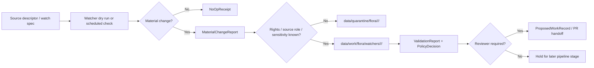

<!-- [KFM_META_BLOCK_V2]
doc_id: kfm://doc/pipelines-watchers-plants-readme
title: Plants Watchers README
type: readme
version: v0.1
status: draft
owners:
  - <plants-watcher-owner>
  - <flora-domain-steward>
  - <agriculture-domain-steward>
  - <docs-steward>
created: 2026-06-13
updated: 2026-06-13
policy_label: public
path: pipelines/watchers/plants/README.md
related:
  - docs/doctrine/directory-rules.md
  - docs/domains/flora/FILE_SYSTEM_PLAN.md
  - docs/domains/flora/DATA_LIFECYCLE.md
  - docs/domains/flora/CROSSWALKS.md
  - docs/domains/flora/EVIDENCE_DRAWER.md
  - docs/sources/catalog/usda/usda-plants.md
  - docs/sources/catalog/usda/usda-nass-cdl.md
  - pipeline_specs/flora/
  - pipelines/domains/flora/
  - data/registry/sources/flora/
  - data/work/flora/
  - data/quarantine/flora/
  - data/receipts/
  - release/candidates/flora/
tags:
  - kfm
  - pipelines
  - watchers
  - plants
  - flora
  - agriculture
  - source-admission
  - material-change
  - governance
notes:
  - "This README governs the requested watcher path. It does not prove that executable watcher code, source activation, credentials, schedules, CI jobs, or release wiring already exist."
  - "Watcher outputs are candidate evidence-development artifacts only. Watchers do not publish."
  - "If Directory Rules or an accepted ADR later chooses a different watcher home, this README should be migrated with a drift entry and rollback note."
[/KFM_META_BLOCK_V2] -->

# 🌿 Plants Watchers

> **Purpose:** govern plant-related source watchers that detect source availability, source metadata drift, taxonomy drift, class-list drift, and other material changes **without** admitting those changes directly into published KFM products.


---

## Quick jump

- [1. What this directory is](#1-what-this-directory-is)
- [2. Placement and authority](#2-placement-and-authority)
- [3. Watcher-as-non-publisher rule](#3-watcher-as-non-publisher-rule)
- [4. In scope](#4-in-scope)
- [5. Out of scope](#5-out-of-scope)
- [6. Expected watcher flow](#6-expected-watcher-flow)
- [7. Allowed outputs](#7-allowed-outputs)
- [8. Required gates](#8-required-gates)
- [9. Source families and activation posture](#9-source-families-and-activation-posture)
- [10. Directory contract](#10-directory-contract)
- [11. Minimal material-change record](#11-minimal-material-change-record)
- [12. Local dry-run contract](#12-local-dry-run-contract)
- [13. Review, promotion, and rollback](#13-review-promotion-and-rollback)
- [14. Definition of done](#14-definition-of-done)
- [15. Open questions](#15-open-questions)

---

## 1. What this directory is

`pipelines/watchers/plants/` is a **watcher lane** for plant-related source-change detection.

A watcher may notice that something changed upstream. It may produce a bounded, auditable candidate record saying:

- what source or source descriptor was checked;
- what hash, timestamp, endpoint metadata, ETag, header, manifest, file listing, class list, or taxonomy signal changed;
- whether the change appears material;
- what downstream steward review is needed;
- where candidate records were written in the KFM lifecycle;
- which policy and validation checks passed, failed, abstained, or denied.

A watcher **does not** decide that a source is authoritative, rights-cleared, sensitivity-safe, validated, cataloged, published, or suitable for public map display.

---

## 2. Placement and authority

**Primary responsibility:** executable watcher orchestration under the `pipelines/` responsibility root.

**Path status:** `PROPOSED / NEEDS VERIFICATION` until validated against the current mounted repository, Directory Rules, accepted ADRs, and nearby per-root README contracts.

This requested path is acceptable only as a watcher-specific implementation lane if it does not create a parallel home for:

- source descriptors;
- schemas;
- contracts;
- policy;
- release decisions;
- receipts;
- proofs;
- catalog records;
- published artifacts.

If the repository standardizes on `pipelines/domains/flora/` for all flora execution, then this directory should become either:

1. a thin watcher sublane that delegates to `pipelines/domains/flora/`, or
2. a migrated path with a drift entry and deprecation note.

> [!IMPORTANT]
> Domain names do not justify root folders. Plant watcher code may live under a responsibility root, but plant truth objects, flora domain contracts, schemas, policies, evidence, data lifecycle artifacts, and release decisions remain in their own governed homes.

---

## 3. Watcher-as-non-publisher rule

This directory follows the KFM watcher rule:

```text
watcher -> detect -> record candidate -> validate -> quarantine or work -> review -> later promotion gate
```

It must never become:

```text
watcher -> source changed -> write published layer
```

### Watchers MAY

- run no-network dry-run fixtures;
- compare known hashes, manifests, ETags, headers, checksums, sidecars, source profile metadata, or fixture snapshots;
- produce a `MaterialChangeReport`;
- produce a `ProposedWorkRecord`;
- route unresolved material to `data/work/flora/` or `data/quarantine/flora/`;
- open or support a maintainer PR when a material change requires review;
- emit receipts for the watcher run.

### Watchers MUST NOT

- write directly to `data/processed/`;
- write directly to `data/catalog/`;
- write directly to `data/published/`;
- write directly to `release/`;
- update public MapLibre layers;
- generate authoritative botanical claims without EvidenceBundle closure;
- expose rare-plant exact locations;
- silently join plant sources with occurrence sources in a way that creates sensitive derived products;
- bypass source-role, rights, sensitivity, validation, citation, review, or rollback gates.

---

## 4. In scope

This directory may govern plant-related watcher behavior for:

- source-head checks;
- version, date, and metadata drift checks;
- checksum/hash comparisons;
- taxonomy-name drift signals;
- source profile freshness checks;
- source descriptor mismatch checks;
- material-change classification;
- fixture-only dry runs;
- candidate work records;
- quarantine routing;
- steward-review handoff.

This lane is useful for sources and datasets that are plant-related, agriculture-adjacent, habitat-adjacent, or flora-adjacent, but the domain ownership must be explicit in the produced record.

---

## 5. Out of scope

Do not place the following here:

| Do not place here | Proper responsibility root |
|---|---|
| Human source catalog profile | `docs/sources/catalog/...` |
| Machine source registry record | `data/registry/sources/...` |
| Object meaning contract | `contracts/domains/flora/` or other domain contract home |
| JSON Schema | `schemas/contracts/v1/domains/flora/` or approved schema home |
| Policy logic | `policy/domains/flora/`, `policy/rights/`, or approved policy home |
| Golden / invalid fixtures | `fixtures/domains/flora/` or watcher-specific fixture home approved by tests |
| Test code | `tests/domains/flora/` or `tests/pipelines/watchers/plants/` if established |
| Connector/fetcher implementation | `connectors/<source_id>/` |
| Lifecycle data | `data/raw/`, `data/work/`, `data/quarantine/`, `data/processed/`, `data/catalog/`, `data/published/` |
| Release decision | `release/candidates/`, `release/manifests/`, `release/rollback_cards/` |
| Public map/style artifact | governed published artifact path only after release |

---

## 6. Expected watcher flow



The watcher is complete when it produces an auditable outcome. It is **not** complete because a public layer changed.

---

## 7. Allowed outputs

A plants watcher should produce small, reviewable artifacts such as:

| Output | Purpose | Typical status |
|---|---|---|
| `NoOpReceipt` | Records that a check ran and no material change was detected. | `CONFIRMED run / no candidate` |
| `MaterialChangeReport` | Records what changed and why it may matter. | `WORK_CANDIDATE` |
| `ProposedWorkRecord` | Requests steward or maintainer action. | `REVIEW_PENDING` |
| `ValidationReport` | Records schema, source-role, rights, sensitivity, and evidence checks. | `PASS / FAIL / ABSTAIN / DENY / ERROR` |
| `PolicyDecision` | Records deny, restrict, abstain, or allow-at-this-stage. | `stage-bound` |
| `QuarantineReceipt` | Records why the candidate cannot move forward. | `QUARANTINED` |
| `RunReceipt` | Records watcher execution identity and hashes. | `auditable` |

---

## 8. Required gates

A watcher run must pass or explicitly record the following gates before any downstream pipeline consumes its candidate output:

1. **Source identity gate** — the source has a stable source identifier or is quarantined.
2. **Source role gate** — the source role is declared and not silently upgraded.
3. **Rights gate** — unknown redistribution or reuse terms block public release.
4. **Sensitivity gate** — rare-plant, cultural, exact-location, and join-induced risks fail closed.
5. **Freshness gate** — source version and retrieval time are recorded separately from observation time.
6. **Evidence gate** — consequential claims use EvidenceRef / EvidenceBundle closure or abstain.
7. **Hash gate** — source input, watch spec, and output hashes are recorded.
8. **No-publish gate** — the watcher cannot target `PUBLISHED`.
9. **Review gate** — material changes requiring interpretation become reviewer work.
10. **Rollback gate** — any future promoted downstream product must have a rollback target.

---

## 9. Source families and activation posture

This README does **not** activate any source.

Candidate plant-related watcher subjects may include source families such as:

- plant taxonomy or plant profile sources;
- crop / land-cover class-list sources;
- flora occurrence or specimen-source metadata;
- invasive-plant watchlists;
- rare-plant protection metadata;
- restoration or seed-mix source references;
- habitat association source references.

Each concrete source requires a source descriptor, rights posture, source-role classification, update cadence, sensitivity review, fixture, validator, and steward review before live watch behavior is enabled.

> [!CAUTION]
> Public-safe source metadata does not guarantee public-safe derived output. Plant taxa lists, land-cover products, occurrence feeds, herbarium records, and habitat associations can become sensitive when joined.

---

## 10. Directory contract

This directory may contain only files whose primary responsibility is watcher orchestration or local watcher documentation.

Recommended future shape:

```text
pipelines/watchers/plants/
├── README.md                         # this file
├── WATCHER_CONTRACT.md               # PROPOSED: local watcher behavior contract
├── no_network_dry_run.md             # PROPOSED: human runbook for fixture-only checks
├── material_change_report.example.yml# PROPOSED: example only, no live source
└── scripts-or-entrypoints/           # PROPOSED only if repo convention permits
```

Declarative watch specs should prefer a pipeline spec home such as:

```text
pipeline_specs/flora/
├── plants_drift_watcher.yaml
└── flora_publish_dryrun.yaml
```

Executable domain processing should prefer the flora domain pipeline home when the task is no longer watcher-specific:

```text
pipelines/domains/flora/
├── ingest/
├── normalize/
├── validate/
├── catalog/
├── publish/
└── rollback/
```

---

## 11. Minimal material-change record

A minimal record emitted by this watcher lane should look like this shape. Field names are examples until schema-backed.

```yaml
schema_version: kfm.material_change_report.v1
watcher_id: plants_watcher
run_id: run_YYYYMMDDThhmmssZ
source_id: src_plants_example
source_descriptor_ref: docs/sources/catalog/<provider>/<source>.md
watch_spec_hash: sha256:<hash>
retrieved_at: "YYYY-MM-DDThh:mm:ssZ"
network_mode: no_network_fixture # no_network_fixture | live_reviewed
change_class: no_op # no_op | metadata_changed | content_hash_changed | taxonomy_changed | class_list_changed | endpoint_error
materiality: none # none | low | medium | high | unknown
candidate_state: WORK_CANDIDATE
allowed_next_stage: review
blocked_publication: true
evidence_refs: []
policy_decision:
  outcome: ABSTAIN
  reason_code: EVIDENCE_BUNDLE_NOT_RESOLVED
sensitivity_flags:
  rare_plant: unknown
  exact_location: denied
  join_induced: needs_review
rights_status: unknown
outputs:
  work_record: data/work/flora/watchers/src_plants_example/run_YYYYMMDDThhmmssZ/material_change_report.yml
  receipt: data/receipts/pipeline/plants_watcher/run_YYYYMMDDThhmmssZ.yml
review:
  reviewer_required: true
  reviewer_role: flora-domain-steward
rollback:
  required_before_publication: true
```

---

## 12. Local dry-run contract

Default watcher execution must be **no-network** until the source descriptor, rights review, sensitivity review, fixture suite, and CI path are approved.

A dry run should prove:

- the watcher can read fixture input;
- the watcher can classify no-op vs material change;
- output records contain required hashes and timestamps;
- policy denies direct publication;
- rare-plant exact geometry is not emitted;
- unknown rights produce `ABSTAIN` or `DENY`, not public release;
- invalid records fail validation;
- receipts are deterministic enough for review.

---

## 13. Review, promotion, and rollback

A material change can become an implementation task, but the watcher cannot self-promote it.

Required promotion chain:

```text
MaterialChangeReport
  -> ProposedWorkRecord
  -> steward / maintainer review
  -> validated downstream pipeline change
  -> release candidate
  -> ReleaseManifest
  -> RollbackCard
  -> published artifact, if allowed
```

Rollback for watcher-created candidate records is usually simple:

- remove or supersede the candidate work record;
- preserve the run receipt;
- preserve the quarantine reason if one was emitted;
- avoid deleting evidence of a denied or abstained run.

Rollback for any downstream published product is handled by `release/`, not by this watcher directory.

---

## 14. Definition of done

This README is done when it:

- explains that plant watchers detect and record candidate changes only;
- preserves the RAW → WORK / QUARANTINE → PROCESSED → CATALOG / TRIPLET → PUBLISHED lifecycle;
- denies direct publication from watchers;
- separates watcher logic from connectors, schemas, policy, fixtures, tests, data lifecycle, and release objects;
- records sensitivity and join-induced risk for plant-derived products;
- gives maintainers a safe no-network starting point;
- leaves source activation, live endpoint behavior, credentials, schedules, CI wiring, and release behavior as verification items.

Future executable watcher code is done only when it has:

- source descriptor coverage;
- no-network fixtures;
- schema validation;
- policy tests;
- source-role tests;
- rights tests;
- sensitivity tests;
- evidence-closure behavior;
- deterministic receipts;
- CI coverage;
- reviewer handoff;
- rollback notes.

---

## 15. Open questions

| ID | Question | Status |
|---|---|---|
| `PLANTS-WATCH-001` | Should this requested watcher home remain `pipelines/watchers/plants/`, or should executable logic migrate under `pipelines/domains/flora/watchers/` with a compatibility stub here? | NEEDS VERIFICATION |
| `PLANTS-WATCH-002` | Which source descriptors are approved as first-wave plant watcher inputs? | NEEDS VERIFICATION |
| `PLANTS-WATCH-003` | What schema will define `MaterialChangeReport` and `ProposedWorkRecord`? | PROPOSED / NEEDS ADR if new object family |
| `PLANTS-WATCH-004` | Which CI job owns no-network watcher fixtures? | UNKNOWN |
| `PLANTS-WATCH-005` | Which steward reviews rare-plant and join-induced sensitivity decisions? | NEEDS VERIFICATION |
| `PLANTS-WATCH-006` | Where should watcher receipts live if the repo already has a more specific receipt convention? | NEEDS VERIFICATION |
| `PLANTS-WATCH-007` | Are any live source terms, rate limits, robots rules, credentials, or redistribution limits unresolved? | NEEDS VERIFICATION |
| `PLANTS-WATCH-008` | Should CDL-adjacent class-list watching remain in plants, agriculture, habitat, or a cross-lane watcher? | NEEDS VERIFICATION |

---

## Maintainer note

This README intentionally favors a small, reversible watcher contract over a broad source-ingestion promise. Add executable behavior only after the adjacent source descriptors, fixtures, validators, policy gates, and review path exist.
