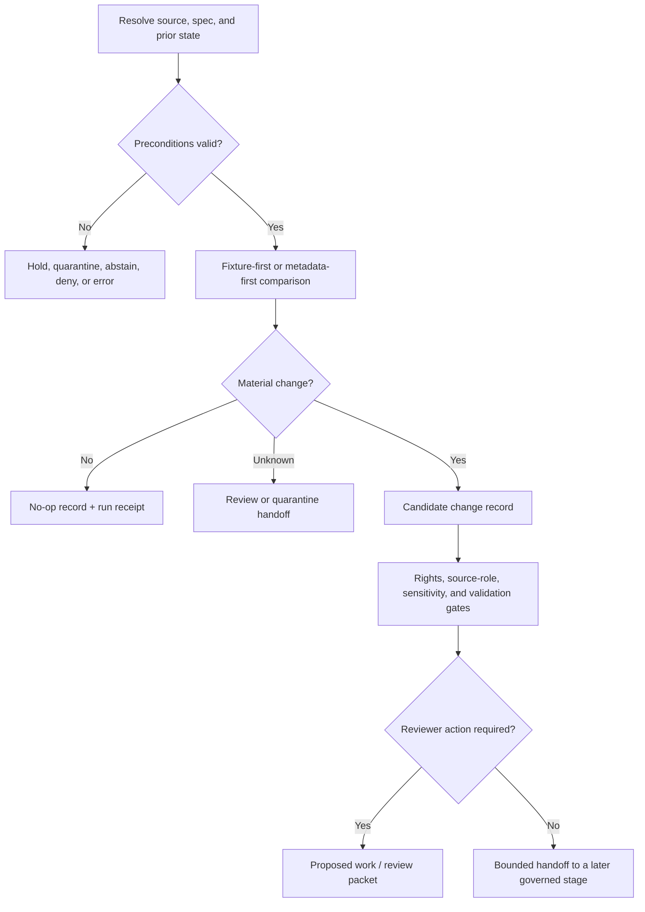

<!-- [KFM_META_BLOCK_V2]
doc_id: kfm://doc/pipelines-watchers-plants-readme
title: Plants Watcher Orchestration Boundary
type: readme
version: v0.2
status: draft; repository-grounded; README-only; placement-conflicted; non-publisher
owners:
  - <plants-watcher-owner>
  - <flora-domain-steward>
  - <agriculture-domain-steward>
  - <docs-steward>
created: 2026-06-13
updated: 2026-07-22
supersedes: v0.1
policy_label: public-with-review-and-sensitivity-gates
path: pipelines/watchers/plants/README.md
evidence_snapshot:
  repository: bartytime4life/Kansas-Frontier-Matrix
  base_ref: main
  base_commit: e6204b75790d6566cc5dc4841110f760eb2267d9
  prior_blob: fc523e15f62f62e025d0d4586ffff929ae367eb7
related:
  - docs/architecture/directory-rules.md
  - CONTRIBUTING.md
  - pipelines/README.md
  - pipelines/watchers/README.md
  - pipelines/domains/flora/watchers/README.md
  - pipeline_specs/flora/watchers/README.md
  - pipeline_specs/flora/plants_drift_watcher.yaml
  - pipeline_specs/watchers/plants_drift.yaml
  - tools/watchers/plants_watch/README.md
  - fixtures/domains/flora/plants_drift/README.md
  - docs/runbooks/flora/SOURCE_REFRESH_RUNBOOK.md
  - data/registry/sources/flora/README.md
  - data/receipts/flora/README.md
  - release/candidates/flora/README.md
tags:
  - kfm
  - pipelines
  - watchers
  - plants
  - flora
  - agriculture
  - source-drift
  - material-change
  - non-publisher
  - no-network
  - sensitivity
  - governance
notes:
  - "This revision updates the existing README at its canonical repository path; it does not establish the final executable watcher owner."
  - "The direct directory is README-only at the pinned evidence snapshot. Executable behavior, source activation, live access, schedules, schemas, tests, receipts, and release wiring remain unverified."
  - "Watcher outputs are candidate evidence-development artifacts. Watchers do not publish."
[/KFM_META_BLOCK_V2] -->

<a id="top"></a>

# Plants Watcher Orchestration Boundary

> Detect plant-source drift, record bounded candidate outcomes, and route reviewed work without turning a source change into botanical truth or publication authority.

[](#0-status-and-evidence-boundary)
[](#0-status-and-evidence-boundary)
[](#2-placement-and-authority)
[](#3-watcher-as-non-publisher-rule)

> [!IMPORTANT]
> This directory is **README-only** at the pinned repository snapshot. It does not prove that a plant watcher, parser, scheduler, source activation decision, accepted specification, fixture payload set, receipt emitter, policy implementation, or substantive CI check exists.

## Quick navigation

| Orient | Operate | Govern | Maintain |
|---|---|---|---|
| [Status](#0-status-and-evidence-boundary) · [Purpose](#1-what-this-directory-is) · [Placement](#2-placement-and-authority) | [Operating law](#3-watcher-as-non-publisher-rule) · [Scope](#4-in-scope) · [Flow](#6-expected-watcher-flow) · [Outputs](#7-allowed-outputs) | [Exclusions](#5-out-of-scope) · [Gates](#8-required-gates) · [Activation](#9-source-families-and-activation-posture) · [Sensitivity](#9-source-families-and-activation-posture) | [Directory contract](#10-directory-contract) · [Example](#11-minimal-material-change-record) · [Dry run](#12-local-dry-run-contract) · [Rollback](#13-review-promotion-and-rollback) · [Validation](#16-validation-and-maintenance) |

---

## 0. Status and evidence boundary

This README separates verified repository state from proposed watcher behavior.

| Surface | Status at `main@e6204b7` | Safe interpretation |
|---|---|---|
| `pipelines/watchers/plants/` | **CONFIRMED README-only** in the bounded repository inventory | Documentation boundary; no executable watcher is established here. |
| `pipelines/watchers/` | **CONFIRMED parent README** | Shared watcher orchestration is documented; implementation maturity remains unproven. |
| `pipelines/domains/flora/watchers/` | **CONFIRMED README-only candidate** | A second executable-placement candidate exists; ownership is unresolved. |
| `pipeline_specs/flora/watchers/` | **CONFIRMED README-only direct sublane** | No accepted concrete watcher profile was established in that directory. |
| Plants-drift specifications | **CONFIRMED `PROPOSED` placeholders** at two paths | The placeholders are not active, canonical, schema-backed, or consumer-bound. |
| `tools/watchers/plants_watch/` | **CONFIRMED compatibility/routing README** | It records overlapping candidate homes and blocks tool-lane implementation growth. |
| Plants-drift fixture lane | **CONFIRMED README; payload inventory unverified** | Documentation supports synthetic fixtures, but fixture evidence is not established. |
| Flora workflow | **CONFIRMED TODO-oriented scaffold** in inspected repository evidence | It does not prove watcher validation or publication-denial enforcement. |
| Active runtime, source access, schedules, and emitted receipts | **UNKNOWN** | No current behavior is claimed by this README. |

**Current determination:** this path is an implementation-bearing *candidate boundary* under `pipelines/`, but its final relationship to the Flora domain watcher lane is **CONFLICTED / NEEDS VERIFICATION**. Until that conflict is resolved, this README may constrain behavior and route review; it must not be cited as proof that the watcher is implemented.

[Back to top](#top)

---

## 1. What this directory is

`pipelines/watchers/plants/` is the requested shared orchestration boundary for plant-related source-change detection.

Its audience is pipeline maintainers, Flora and agriculture stewards, source and rights reviewers, sensitivity reviewers, validator authors, and release reviewers. It answers four bounded questions:

1. What plant-source signals may a watcher observe?
2. Which preconditions and gates must be satisfied before a check runs?
3. Which candidate records may a run emit?
4. How does the run stop without publishing or hiding uncertainty?

A future watcher may compare an admitted source's hash, timestamp, endpoint metadata, `ETag`, `Last-Modified` value, file listing, class list, taxonomy signal, or manifest. It may then record:

- the source descriptor and immutable watch-spec identity used;
- prior and current source-head state;
- retrieval and observation times without collapsing them;
- whether a change appears material under an explicit rule;
- source-role, rights, sensitivity, evidence, and review results;
- the candidate lifecycle destination;
- deterministic input, output, and receipt hashes;
- a finite outcome and machine-readable reason;
- the required steward handoff.

A watcher does **not** decide that a source is authoritative, rights-cleared, sensitivity-safe, validated, cataloged, released, published, or suitable for public map display.

[Back to top](#top)

---

## 2. Placement and authority

The path is under the `pipelines/` responsibility root because its proposed responsibility is executable orchestration: the **how** of a watcher run. Declarative run intent belongs under `pipeline_specs/`; source access belongs under `connectors/`; reusable tooling belongs under `tools/`; governed records belong under the correct `data/` or `release/` home.

| Responsibility | Owning surface | This directory's relationship |
|---|---|---|
| Shared plant watcher orchestration | `pipelines/watchers/plants/` | **PROPOSED / CONFLICTED** implementation owner; currently README-only. |
| Flora-owned watcher execution | `pipelines/domains/flora/watchers/` | Competing README-only candidate; delegation is unresolved. |
| Declarative watch intent | `pipeline_specs/flora/watchers/` or reconciled watcher-spec home | Read immutable, reviewed specs; do not define them here. |
| Upstream access and capture | `connectors/<source>/` | Invoke an admitted connector contract; do not become the connector. |
| Reusable watcher helper or CLI | `tools/watchers/` | Consume only after placement and interface ownership are settled. |
| Synthetic test material | `fixtures/domains/flora/plants_drift/` | Read public-safe fixtures; do not store fixtures here. |
| Source identity and activation | `data/registry/sources/flora/` and governing review records | Resolve; never invent or silently activate. |
| Policy and sensitivity decisions | `policy/` | Evaluate and record; never author policy in orchestration code. |
| Lifecycle records and receipts | Governed `data/` homes | Emit through accepted contracts; do not create a parallel record home. |
| Promotion, correction, and rollback decisions | `release/` | Hand off; never self-approve. |

The live Directory Rules file is currently at [`docs/architecture/directory-rules.md`](../../../docs/architecture/directory-rules.md). That document records its own path placement as an unresolved ADR-class question, but it instructs new cross-references to use the live path until resolved.

> [!NOTE]
> A README's presence proves documentation exists. It does not establish executable ownership, runtime behavior, schema authority, or release authority.

### Authority this directory does not have

This lane does not own source descriptors, botanical or taxonomic truth, schemas, semantic contracts, policy, sensitivity classification, lifecycle state, EvidenceBundles, catalogs, release decisions, public APIs, maps, tiles, search indexes, or AI answers.

[Back to top](#top)

---

## 3. Watcher-as-non-publisher rule

The controlling operating law is:

```text
admitted source descriptor + reviewed watch spec + prior source state
  -> fixture-first or metadata-first comparison
  -> no-op, candidate, quarantine, abstain, deny, or error outcome
  -> receipt + steward-readable review handoff
  -> later governed intake, validation, evidence, policy, and release stages
```

It must never become:

```text
source changed -> watcher rewrites catalog, map, or published artifact
```

### Watchers may

- run deterministic no-network fixture checks;
- probe source availability or headers only after source activation and network review;
- compare known hashes, manifests, `ETag`, `Last-Modified`, checksums, sidecars, class lists, or taxonomy signals;
- classify a bounded candidate change under an explicit materiality rule;
- emit no-op, candidate, quarantine, validation, policy, and run records through accepted contracts;
- prepare a review packet or maintainer pull-request handoff;
- route unresolved material to WORK or QUARANTINE through governed interfaces.

### Watchers must not

- activate an unreviewed source or bypass connector controls;
- commit directly to the default branch;
- write directly to PROCESSED, CATALOG, TRIPLET, PUBLISHED, or `release/`;
- treat HTTP success, a timestamp, checksum, header, or source-head change as botanical truth;
- upgrade a source role or taxonomic authority;
- create an EvidenceBundle from a diff or receipt;
- rebuild public artifacts without promotion gates;
- expose exact or reconstructable sensitive plant locations;
- silently join plant, occurrence, parcel, habitat, or cultural-knowledge sources;
- publish AI-generated interpretation;
- approve their own downstream work.

[Back to top](#top)

---

## 4. In scope

This directory may govern plant-related watcher orchestration for:

- manual, scheduled, or event-driven source-head checks after activation;
- no-network fixture runs;
- version, date, metadata, manifest, checksum, and hash comparisons;
- taxonomy-name, class-list, crosswalk, or source-profile drift signals;
- material-change classification under a pinned rule;
- deterministic run identity, replay, and duplicate suppression;
- candidate work and quarantine routing;
- finite outcomes with stable reason codes;
- validation, policy, receipt, and review handoffs;
- checkpoint, retry, stale-state, and kill-switch behavior;
- correction or supersession of prior candidate records.

The lane may serve sources adjacent to Flora, agriculture, habitat, restoration, or land-cover work only when every output records the owning domain and source role. Cross-domain relevance does not grant shared publication authority.

[Back to top](#top)

---

## 5. Out of scope

| Do not place here | Governing responsibility home |
|---|---|
| Human source profile or source-family guidance | `docs/sources/` or verified domain documentation home |
| Machine source record and activation state | `data/registry/sources/` or accepted registry home |
| Full upstream client, fetcher, or payload capture | `connectors/<source>/` |
| Declarative watcher profile | `pipeline_specs/` after placement reconciliation |
| Semantic object meaning | `contracts/` |
| Machine-checkable schema | `schemas/contracts/v1/` |
| Rights, sensitivity, admissibility, or release rules | `policy/` |
| Synthetic valid, invalid, denied, or stale examples | `fixtures/` |
| Executable assertions and regression coverage | `tests/` |
| RAW, WORK, QUARANTINE, PROCESSED, CATALOG, TRIPLET, or PUBLISHED records | Correct phase under `data/` |
| EvidenceBundle or proof object | Accepted `data/proofs/` home |
| Release decision, manifest, correction, or rollback card | `release/` |
| Public API, MapLibre layer, tile, export, search, graph, or AI implementation | Governed application/package roots |
| Secrets, credentials, signed URLs, or restricted endpoints | Never documentation or committed watcher configuration |

[Back to top](#top)

---

## 6. Expected watcher flow

### Trigger and accepted input contract

A future run must begin with immutable, reviewable inputs. Exact field names remain **NEEDS VERIFICATION** until accepted contracts and schemas exist.

| Input | Minimum requirement | Missing or invalid behavior |
|---|---|---|
| Trigger | Manual, scheduled, or event identity plus initiating actor/tool | Reject or record `ERROR`; do not infer a trigger. |
| Source descriptor | Stable source id, role, authority limit, rights, sensitivity, cadence, and activation state | Hold, abstain, deny, or quarantine according to policy. |
| Watch specification | Stable id/version/digest, allowed checks, materiality rule, output limits, and kill switch | Do not run. |
| Prior state | Prior source-head, manifest, sidecar, hash, or explicit no-baseline decision | Record baseline-required outcome; do not call first observation a change. |
| Connector capability | Accepted connector path and bounded metadata/payload contract | Do not fetch directly. |
| Policy context | Rights, sensitivity, public-exposure, and reviewer requirements | Fail closed. |
| Output contract | Accepted record schemas and governed destinations | Do not emit ad hoc trust objects. |

### Deterministic run identity and replay

A run identity should be derived from stable inputs such as watcher id, source id, watch-spec digest, prior-state digest, trigger time bucket or event id, and execution version. The accepted identity algorithm remains **PROPOSED** until schema-backed.

A replay with identical effective inputs must:

- produce the same materiality classification and stable semantic output;
- avoid duplicate review packets and duplicate lifecycle writes;
- record tool-version or environment differences that affect bytes;
- preserve the original record and create a linked superseding record when a correction changes the result;
- never overwrite a prior receipt in place.

### Stage flow



The run is complete when it records one auditable outcome. A changed public layer is neither an output nor a completion criterion.

[Back to top](#top)

---

## 7. Allowed outputs

The names below preserve the existing README vocabulary but remain documentation-level until accepted contracts and schemas establish them.

| Candidate output | Purpose | Authority limit |
|---|---|---|
| `NoOpReceipt` | Records that the bounded comparison found no material change. | Does not prove the source can never change. |
| `MaterialChangeReport` | Records observed differences, materiality reasoning, and uncertainty. | Not an EvidenceBundle, validation approval, or release decision. |
| `ProposedWorkRecord` | Requests steward or maintainer action. | Review request only; not approval. |
| `ValidationReport` | Records checks, failures, blockers, and applicable finite results. | Validates the declared surface only. |
| `PolicyDecision` | Records the applicable stage-bound policy result and reason. | Does not redefine policy or authorize later stages. |
| `QuarantineReceipt` | Records why a candidate cannot advance and what remediation is required. | Must preserve the denied or unresolved evidence. |
| `RunReceipt` | Pins run identity, inputs, outputs, hashes, versions, and reason codes. | Administrative provenance; not botanical truth. |
| Review packet | Gives reviewers bounded evidence and requested action. | Must exclude restricted data and must not auto-approve. |

### Finite outcome posture

No accepted watcher outcome enum was verified. A future contract must define a finite vocabulary and stable reason codes rather than relying on free text. The documentation-level cases that require representation are:

- no material change;
- material candidate requiring review;
- non-material change recorded without reprocessing;
- missing baseline or stale prior state;
- rights, source-role, or sensitivity hold;
- quarantine;
- abstention or denial under the applicable policy surface;
- connector, validation, persistence, or system error.

Do not reuse `ANSWER | ABSTAIN | DENY | ERROR` automatically: that vocabulary belongs to governed-AI surfaces unless an accepted watcher contract explicitly adopts it.

[Back to top](#top)

---

## 8. Required gates

Every run must pass a gate or record a finite blocked outcome before a downstream consumer can use its candidate output.

| Gate | Required evidence | Fail-closed behavior |
|---|---|---|
| Source identity | Stable source id and resolvable descriptor | Hold or quarantine. |
| Activation | Reviewed watcher permission, cadence, and access scope | No live access. |
| Source role | Declared role and authority limits | Abstain or quarantine; never upgrade silently. |
| Rights and attribution | Current terms, allowed uses, redistribution posture, and attribution | Deny public release; route review. |
| Sensitivity and join risk | Rare/protected taxa, cultural authority, locality, private-land, and join-induced risk posture | Redact, generalize, quarantine, or deny. |
| Freshness and time | Source version, observed time, retrieval time, and prior-state time kept distinct | Mark stale or hold. |
| Baseline | Prior state or explicit first-observation policy | Do not infer material change. |
| Materiality | Pinned rule, inputs, thresholds, and rationale | Review or abstain when indeterminate. |
| Evidence | Consequential claims resolve through EvidenceRef/EvidenceBundle or abstain | Do not convert a diff into truth. |
| Validation | Accepted record shapes, hashes, destinations, and negative cases | Quarantine or error. |
| No publication | Destination set excludes PUBLISHED and release decisions | Abort on forbidden side effect. |
| Review | Required reviewer roles and handoff target are resolvable | Hold. |
| Correction and rollback | Supersession link, downstream invalidation path, and future release rollback requirement | Block promotion beyond candidate state. |

[Back to top](#top)

---

## 9. Source families and activation posture

This README activates **no source**.

Potential watcher subjects include:

- plant taxonomy or plant-profile sources;
- crop and land-cover class lists;
- flora occurrence or specimen-source metadata;
- invasive-plant watchlists;
- rare or protected plant status metadata;
- restoration or seed-mix source references;
- habitat-association source references;
- vegetation classification, package, or manifest metadata.

Each concrete source requires a reviewed descriptor, source-role classification, rights and attribution posture, update cadence, allowed comparison strategy, sensitivity profile, deterministic no-network fixtures, accepted output contract, reviewer route, and kill switch before live behavior is enabled.

### Sensitivity and public-safe behavior

> [!CAUTION]
> Plant-source drift can expose rare or protected taxa, herbarium localities, private land, restoration sites, or culturally sensitive plant knowledge when records are joined. Exact or reconstructable sensitive detail must fail closed in logs, diffs, receipts, review packets, issues, pull requests, and public surfaces.

Public-safe source metadata does not guarantee public-safe derived output. A taxonomy list, specimen portal, occurrence feed, land-cover layer, habitat association, parcel reference, or restoration record may become sensitive through linkage.

A watcher must therefore:

- minimize fetched and retained data to what the comparison requires;
- avoid exact locality or geometry in logs and review artifacts;
- test whether a change increases re-identification or inference risk;
- keep restricted values out of filenames, branch names, badge URLs, issues, and pull-request text;
- generalize or withhold before any human-facing review packet when policy requires it;
- record that a transform occurred and preserve its reason without leaking the protected value;
- deny or quarantine when rights, cultural authority, or sensitivity cannot be resolved.

[Back to top](#top)

---

## 10. Directory contract

### Current repository shape

At the pinned snapshot, the direct directory is:

```text
pipelines/watchers/plants/
└── README.md
```

The repository also contains overlapping watcher surfaces:

| Surface | Current role | Placement posture |
|---|---|---|
| `pipelines/watchers/plants/` | Shared plant watcher orchestration candidate | README-only; **CONFLICTED** with Flora domain lane. |
| `pipelines/domains/flora/watchers/` | Flora-owned executable watcher candidate | README-only; ownership not accepted. |
| `pipeline_specs/flora/watchers/` | Flora declarative-spec boundary | README-only direct sublane. |
| `pipeline_specs/flora/plants_drift_watcher.yaml` | Flora plants-drift placeholder | `PROPOSED`; not active. |
| `pipeline_specs/watchers/plants_drift.yaml` | Shared plants-drift placeholder | `PROPOSED`; duplicate candidate. |
| `tools/watchers/plants_watch/` | Compatibility and routing boundary | README-only; implementation growth blocked. |

### Expansion rule

Do not add executable code, live configuration, schedules, credentials, schemas, policy, fixtures, lifecycle records, or release objects here until a reviewed decision or migration note identifies:

1. one canonical executable owner;
2. one canonical declarative-spec owner;
3. delegation rules for shared and Flora-specific behavior;
4. one canonical connector and source-registry path per source;
5. compatibility, deprecation, consumer-migration, and rollback steps;
6. accepted input, output, outcome, and receipt contracts.

If this lane becomes the accepted shared executor, Flora-specific behavior must delegate through explicit interfaces rather than duplicating domain code. If the Flora domain lane becomes canonical, this path should become a thin compatibility pointer or be migrated under the Directory Rules discipline.

[Back to top](#top)

---

## 11. Minimal material-change record

The following YAML is **illustrative only**. It preserves the useful shape from v0.1 but does not claim an accepted schema, enum, reason-code registry, or destination convention.

```yaml
example_contract_status: PROPOSED
illustrative_only: true
watcher_id: plants_watcher
run_id: run_YYYYMMDDThhmmssZ
source_id: source_example
source_descriptor_ref: data/registry/sources/flora/example.yaml
watch_spec_ref: pipeline_specs/example.yaml
watch_spec_hash: sha256:<digest>
prior_state_hash: sha256:<digest>
observed_at: "YYYY-MM-DDThh:mm:ssZ"
retrieved_at: "YYYY-MM-DDThh:mm:ssZ"
network_mode: no_network_fixture
change_class: metadata_changed
materiality: unknown
outcome: proposed_work_record
blocked_publication: true
evidence_refs: []
policy_result:
  status: needs_verification
  reason_code: EVIDENCE_NOT_RESOLVED
sensitivity:
  rare_or_protected_plant: unknown
  exact_location: denied
  join_induced_risk: needs_review
rights_status: unknown
outputs:
  candidate_record: <governed-work-or-quarantine-path>
  run_receipt: <accepted-receipt-path>
review:
  required: true
  role: <verified-review-role>
correction:
  supersedes: null
rollback:
  required_before_publication: true
```

Replace placeholders only through an accepted contract, registry, source descriptor, and reviewed run configuration. Never copy this example into a live record as authority.

[Back to top](#top)

---

## 12. Local dry-run contract

No-network execution is the default until source activation, rights review, sensitivity review, fixture coverage, connector behavior, accepted schemas, and CI ownership are verified.

A dry run should prove that the future implementation can:

- read only synthetic, public-safe fixture input;
- distinguish unchanged, non-material, material, baseline-missing, stale, quarantined, denied, abstained, and error cases as defined by the accepted contract;
- derive stable run identity and suppress duplicate side effects;
- preserve source time, retrieval time, run time, review time, and release time as distinct concepts;
- record input, spec, prior-state, output, and tool-version hashes;
- reject malformed or schema-incompatible candidate records;
- deny direct publication and direct release writes;
- avoid emitting rare-plant exact geometry or reconstructable sensitive detail;
- convert unknown rights or authority into a blocked outcome;
- preserve failed, denied, and quarantined receipts for audit;
- produce a reviewer-readable summary without restricted values.

No verified repository command currently proves this lane. Do not invent a quickstart until executable code and repository-native test wiring exist.

[Back to top](#top)

---

## 13. Review, promotion, and rollback

A material change may become an implementation task, but the watcher cannot self-promote it.

```text
candidate change record
  -> proposed work / review packet
  -> source, domain, rights, sensitivity, and implementation review
  -> governed intake and downstream pipeline work
  -> evidence, validation, and policy closure
  -> release candidate
  -> release manifest + rollback target
  -> published artifact, only if authorized
```

### Idempotency, partial failure, retry, and checkpoints

- **Idempotency:** the same effective inputs must not create duplicate lifecycle writes or review packets.
- **Checkpointing:** persist the last completed stage and its input/output digests through an accepted receipt contract.
- **Partial failure:** if comparison succeeds but validation, persistence, or review routing fails, record the failure and stop; do not report success.
- **Retry:** retry only bounded transient failures. Re-read current source-head and prior-state evidence before retrying so a retry is not mistaken for the original observation.
- **Ambiguous outcome:** inspect records and side effects before retry. Never duplicate writes because a timeout response was unclear.
- **Kill switch:** a disabled source, withdrawn right, sensitivity escalation, or reviewer stop must prevent further live access.
- **Stale state:** preserve the last verified state as stale; do not silently present it as current.

### Correction and rollback

For watcher-created candidate records:

1. create a correction or superseding record rather than overwriting history;
2. preserve the original run receipt and reason codes;
3. preserve quarantine, denial, and abstention evidence;
4. invalidate or notify downstream consumers through governed interfaces;
5. stop future runs when the source or watch spec is withdrawn;
6. record whether replay is required.

Rollback for any downstream published product is owned by `release/`, not by this directory. A branch, commit, pull request, merge, tag, or successful run is not KFM publication.

[Back to top](#top)

---

## 14. Definition of done

### This README

This documentation upgrade is complete when it:

- preserves the watcher-as-non-publisher and KFM lifecycle boundaries;
- distinguishes verified README-only state from proposed behavior;
- surfaces the competing executable and declarative homes without selecting one silently;
- defines trigger, input, run-identity, replay, output, gate, failure, retry, review, correction, and rollback expectations;
- retains source-role, rights, sensitivity, EvidenceBundle, and join-risk controls;
- gives maintainers a no-network, fail-closed starting posture;
- contains no unsupported live-source, runtime, CI, owner, release, or public-safety claim;
- keeps executable behavior, accepted contracts, source activation, schedules, and production use as verification items.

### Future executable behavior

Implementation is done only when current repository evidence proves:

- placement and delegation are accepted;
- source descriptors and activation decisions resolve;
- input, output, outcome, reason-code, receipt, and correction contracts are accepted;
- deterministic no-network fixtures cover positive and negative paths;
- source-role, rights, sensitivity, evidence, and no-publication tests pass;
- idempotency, replay, retry, partial-failure, stale-state, and kill-switch behavior are tested;
- secrets and restricted values cannot enter logs or review artifacts;
- CI invokes substantive repository-native checks;
- reviewer routing is enforceable;
- correction and release-owned rollback paths are documented and exercised.

[Back to top](#top)

---

## 15. Open questions

| ID | Question | Status |
|---|---|---|
| `PLANTS-WATCH-001` | Which path is the accepted executable owner: shared `pipelines/watchers/plants/`, Flora `pipelines/domains/flora/watchers/`, or another reviewed home? | **CONFLICTED / NEEDS VERIFICATION** |
| `PLANTS-WATCH-002` | Which source descriptors and activation decisions are approved for the first bounded watcher? | **NEEDS VERIFICATION** |
| `PLANTS-WATCH-003` | Which accepted contracts and schemas define candidate changes, no-op/run/quarantine receipts, validation reports, and proposed work? | **NEEDS VERIFICATION** |
| `PLANTS-WATCH-004` | Which one of the two plants-drift spec paths survives reconciliation, and which consumer binds it? | **CONFLICTED / NEEDS VERIFICATION** |
| `PLANTS-WATCH-005` | Which substantive CI job owns no-network watcher fixtures and negative publication tests? | **UNKNOWN** |
| `PLANTS-WATCH-006` | Which verified reviewers own Flora, agriculture, taxonomy, source rights, cultural authority, and rare-plant sensitivity decisions? | **NEEDS VERIFICATION** |
| `PLANTS-WATCH-007` | Which receipt home and reason-code registry are canonical for shared versus domain watcher runs? | **NEEDS VERIFICATION** |
| `PLANTS-WATCH-008` | What source-specific terms, rate limits, robots rules, credentials, cadence limits, and redistribution restrictions remain unresolved? | **NEEDS VERIFICATION** |
| `PLANTS-WATCH-009` | Should CDL-adjacent class-list watching remain in plants, agriculture, habitat, or a reviewed cross-lane boundary? | **NEEDS VERIFICATION** |
| `PLANTS-WATCH-010` | Which deterministic identity, checkpoint, retry, correction, and supersession rules are contractually accepted? | **NEEDS VERIFICATION** |

[Back to top](#top)

---

## 16. Validation and maintenance

### Documentation validation

| Check | Expected result | What passing does not prove |
|---|---|---|
| Markdown structure | One H1, logical heading hierarchy, closed fences, valid tables and alerts | Runtime behavior. |
| Links and anchors | Every repository-relative link and fragment resolves at the branch head | The linked plan is implemented or authoritative. |
| Badge manifest | Four badges represent verified document/repository posture and link to text evidence | CI, security, or release status. |
| Mermaid source | Grounded branching flow parses under supported syntax | Executable orchestration exists. |
| Metadata review | `doc_id` and created date preserved; version and update date match this substantive change | KFM publication or owner assignment. |
| Semantic no-loss | Existing purpose, scope, gates, outputs, example, dry-run, rollback, and open questions remain | Acceptance of proposed contracts. |
| Diff scope | Only this README changes | Absence of unrelated repository drift. |
| Sensitive-data scan | No credentials, restricted endpoint, exact sensitive locality, or private identifier added | Full repository safety. |

### Maintenance triggers

Review this README when:

- an ADR or migration note settles watcher placement;
- either plants-drift specification changes from placeholder status;
- a source is activated, disabled, or withdrawn;
- accepted watcher record schemas or outcome vocabularies land;
- fixtures, tests, validators, schedules, or substantive CI become available;
- rights, sensitivity, cultural authority, or source-role rules change;
- a correction, deprecation, or release rollback exposes a documentation gap.

Do not update static badges independently of the matching text status.

[Back to top](#top)

---

## 17. Related authority surfaces

| Reference | Relationship |
|---|---|
| [`CONTRIBUTING.md`](../../../CONTRIBUTING.md) | Repository change, evidence, security, and review discipline. |
| [Directory Rules](../../../docs/architecture/directory-rules.md) | Live placement doctrine and responsibility-root law. |
| [Pipelines root](../../README.md) | Executable pipeline authority boundary. |
| [Shared watchers](../README.md) | Parent watcher orchestration contract. |
| [Flora watcher candidate](../../domains/flora/watchers/README.md) | Competing Flora-owned executable candidate. |
| [Flora watcher specifications](../../../pipeline_specs/flora/watchers/README.md) | Declarative watch-intent boundary. |
| [Tool watcher routing](../../../tools/watchers/plants_watch/README.md) | Compatibility, current inventory, and placement-conflict detail. |
| [Plants-drift fixtures](../../../fixtures/domains/flora/plants_drift/README.md) | Synthetic fixture guidance; payload coverage remains unverified. |
| [Flora source-refresh runbook](../../../docs/runbooks/flora/SOURCE_REFRESH_RUNBOOK.md) | Human review and refresh procedure; verify current authority before use. |
| [Flora source registry](../../../data/registry/sources/flora/README.md) | Source-record boundary and activation prerequisites. |
| [Flora receipts](../../../data/receipts/flora/README.md) | Candidate receipt boundary; exact watcher subtype remains unresolved. |
| [Flora release candidates](../../../release/candidates/flora/README.md) | Later release-review boundary; watchers cannot write release decisions. |

## Maintainer note

Keep this lane small until placement and contracts are settled. The first useful executable slice should be fixture-only, metadata-first, deterministic, receipt-emitting, deny direct publication, and prove at least one no-op plus one blocked material-change path before any live source access is considered.

[Back to top](#top)
